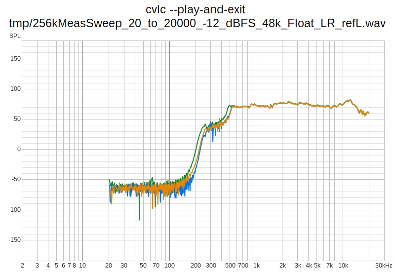
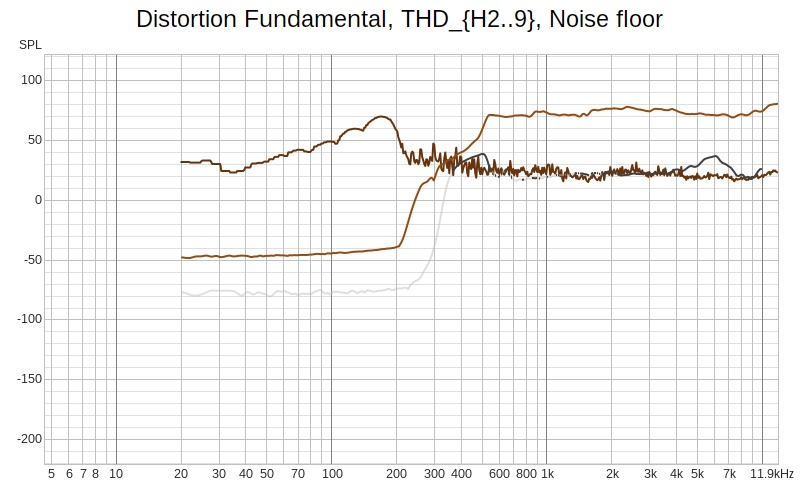
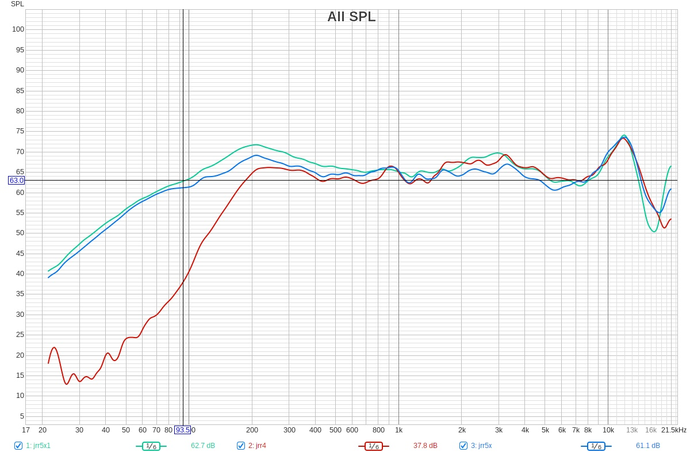

* Suunnittelun lähtötiedot

[[https://loudspeakerdatabase.com/Simulators/ClosedBox#tenv=22/phPa=1000/eg=2.83/rg=0/brand=Peerless/ref=PLS-P830986/re=6.2/le=0.12/bl=3.45/rms=0.35/cms=790/mms=2.6/sd=27/pmax=50/xmax=3.38/tvc=22/ly=138/lx=232/lz=138/dx=69/dy=69/wt=19/lmz=25/lmrf=10/vr=0.0/nm_max=14/tbox=22][Loudspeakerdatabase suunnnitelma]]

* Mittausjärjestelyt

** Mittauskohteet

- jrr5x1.local
  - Kaiutinelementti: [[file:bom/peerless-830986.pdf][PLS-P830986]]
  - DA-muunnin: Realtek ALC5686
  - Vahvistin: PAM8403-GF1002 2x3W [[https://uraltone.com/vahvistinmoduli-pam8403-class-d-2x3w.html][Uraltone 190-PAM8403-2x3W-AMP]]
  - suljettu kotelo LxKxS: 232mm x x 138mm xx 138mm 19mm MDF
  - n. 10mm vanu kotelon sisällä
- jrr5x.local
  - Kaiutinelementti: [[file:bom/peerless-830986.pdf][PLS-P830986]] 
  - Vahvistin: PAM8403-GF1002 2x3W [[https://uraltone.com/vahvistinmoduli-pam8403-class-d-2x3w.html][Uraltone 190-PAM8403-2x3W-AMP]]
  - DA-muunnin: Realtek ALC5686
  - suljettu kotelo LxKxS: 232mm x x 138mm xx 138mm 19mm MDF
- jrr4.local
  - Kaiutinelementti: [[file:bom/peerless-830986.pdf][PLS-P830986]] 
  - DA-muunnin: Raspberry Pi 3B+ 3.5mm audio jack PWM
  - Vahvistin: Velleman VMA408 (PAM8403)
  - suljettu kotelo LxKxS: 232mm x x 138mm xx 138mm 19mm MDF

** Mittausympäristö
- Mikrofoni T-Bone SC 400
  - Käyttöohje: [[file:bom/t-bone-sc400-microphone.pdf]]
  - n. 10 cm suoraan kaiuttimien edessä
- Äänikortti: Behringer UMC202HD
  - 2x2, 24-Bit/192 kH
  - Kotisivu: https://www.behringer.com/en/products/0805-AAR
  - Pikaohje: [[file:bom/Behringer-U-PHORIA-Series_WW.pdf]]
- Analyysohjelmisto REW
  - Versio 5.31.3, JRE 1.8.0_422 64-bit on linx 6.17.0-1028-oem

    
* Mittaukset

** jrr4
:PROPERTIES:
:header-args+: :var  AUDIO_TARGET_SSH="pi@jrr4.local"
:header-args+:   :dir  /ssh:pi@jrr4.local:
:END:

*** Testiympäristön alustus
#+BEGIN_SRC bash :eval no-export :results output
echo "Running in $(pwd) for user '$(whoami)' on host '$(hostname)' on $(date)"
echo AUDIO_TARGET_SSH=$AUDIO_TARGET_SSH
#+END_SRC

#+RESULTS:
: Running in /home/pi for user 'pi' on host 'jrr4' on Mon Jul 27 09:44:14 EEST 2026
: AUDIO_TARGET_SSH=pi@jrr4.local

#+call: create-dir(DIR="tmp")

#+RESULTS:
: Create DIR=tmp in /home/pi for user 'pi' on host='jrr4' on Mon Jul 27 09:45:31 EEST 2026
: Directory tmp already exists

Kopioidaa audio tiedostot
#+call: audio-analysis-copy[:dir .](AUDIO_FILE="audio/*")

#+RESULTS:
: Running in /home/jj/work/jrr for user 'jj' on host 'Leo' on ma 27.7.2026 09.47.21 +0300

Kohdejärjestelmässä olevat äänitiedostot
#+call: audio-analysis-playable()

#+RESULTS:
#+begin_example
Running in /home/pi for user 'pi' on host 'jrr4' on Mon Jul 27 09:48:04 EEST 2026
-rw-r--r-- 1 pi pi 4718636 Jul 27 09:47 tmp/256kMeasSweep_100_to_15000_-12_dBFS_48k_Float_LR_refL.wav
-rw-r--r-- 1 pi pi 4718636 Jul 27 09:47 tmp/256kMeasSweep_100_to_20000_-12_dBFS_48k_Float_LR_refL.wav
-rw-r--r-- 1 pi pi 4718636 Jul 27 09:47 tmp/256kMeasSweep_100_to_5000_-12_dBFS_48k_Float_LR_refL.wav
-rw-r--r-- 1 pi pi 4718636 Jul 27 09:47 tmp/256kMeasSweep_20_to_20000_-12_dBFS_48k_Float_LR_refL.wav
-rw-r--r-- 1 pi pi 4718636 Jul 27 09:47 tmp/256kMeasSweep_50_to_20000_-12_dBFS_48k_Float_LR_refL.wav
-rw-r--r-- 1 pi pi 3840044 Jul 27 09:47 tmp/LinSwp_10_20000_-12_dBFS_48k_Float_LR.wav
-rw-r--r-- 1 pi pi 3840044 Jul 27 09:47 tmp/Sine_1000_-12_dBFS_48k_Float_LR.wav
-rw-r--r-- 1 pi pi 3840044 Jul 27 09:47 tmp/Sine_100_-12_dBFS_48k_Float_LR.wav
-rw-r--r-- 1 pi pi 3840044 Jul 27 09:47 tmp/Sine_200_-12_dBFS_48k_Float_LR.wav
-rw-r--r-- 1 pi pi 3840044 Jul 27 09:47 tmp/Sine_30_-12_dBFS_48k_Float_LR.wav
-rw-r--r-- 1 pi pi 3840044 Jul 27 09:47 tmp/Sine_500_-12_dBFS_48k_Float_LR.wav
-rw-r--r-- 1 pi pi 3840044 Jul 27 09:47 tmp/Sine_50_-12_dBFS_48k_Float_LR.wav
-rw-r--r-- 1 pi pi 3840044 Jul 27 09:47 tmp/Sine_75_-12_dBFS_48k_Float_LR.wav
#+end_example

Pysäytetään streamaus palvelus

#+BEGIN_SRC bash :eval no-export :results output
echo "Running in $(pwd) for user '$(whoami)' on host '$(hostname)' on $(date)"
# jrr-control.sh stop
runner/jrr-control.sh stop
#+END_SRC

#+RESULTS:
: Running in /home/pi for user 'pi' on host 'jrr4' on Tue Jul 28 09:03:14 EEST 2026

*** Linear sweep 20Hz-20kHz -12dBFS 48k LR
:PROPERTIES:
:header-args+: :var  AUDIO_FILE="audio/256kMeasSweep_20_to_20000_-12_dBFS_48k_Float_LR_refL.wav"
:END:

#+BEGIN_SRC bash :eval no-export :results output
echo "Running in $(pwd) for user '$(whoami)' on host '$(hostname)' on $(date)"
echo "AUDIO_FILE=$AUDIO_FILE"
#+END_SRC

#+RESULTS:
: Running in /home/pi for user 'pi' on host 'jrr4' on Mon Jul 27 10:14:09 EEST 2026
: AUDIO_FILE=audio/256kMeasSweep_20_to_20000_-12_dBFS_48k_Float_LR_refL.wav

#+call: vlc-play()

#+RESULTS:
: Running in /home/pi for user 'pi' on host 'jrr4' on Mon Jul 27 10:19:26 EEST 2026
: AUDIO_FILE_TO_PLAY=tmp/256kMeasSweep_20_to_20000_-12_dBFS_48k_Float_LR_refL.wav
: cvlc --play-and-exit tmp/256kMeasSweep_20_to_20000_-12_dBFS_48k_Float_LR_refL.wav
: VLC media player 3.0.10 Vetinari (revision 3.0.10-0-g7f145afa84)
: [00d010d0] main interface error: no suitable interface module
: [00c7a6c0] main libvlc error: interface "globalhotkeys,none" initialization failed
: [00d010d0] dummy interface: using the dummy interface module...
: [00ce5268] main playlist: end of playlist, exiting

*** SPL

*** Distortion

** jrr5x1
:PROPERTIES:
:header-args+: :var  AUDIO_TARGET_SSH="jrr@jrr5x1.local"
:header-args+:   :dir  /ssh:jrr@jrr5x1.local:
:END:

*** Testiympäristön alustus
#+BEGIN_SRC bash :eval no-export :results output
echo "Running in $(pwd) for user '$(whoami)' on host '$(hostname)' on $(date)"
echo AUDIO_TARGET_SSH=$AUDIO_TARGET_SSH
#+END_SRC

#+RESULTS:
: Running in /home2/jrr for user 'jrr' on host 'jrr5x1' on Mon Jul 27 10:30:11 EEST 2026
: AUDIO_TARGET_SSH=jrr@jrr5x1.local

#+call: create-dir(DIR="tmp")

#+RESULTS:
: Create DIR=tmp in /home2/jrr for user 'jrr' on host='jrr5x1' on Mon Jul 27 10:30:28 EEST 2026
: Directory tmp already exists

Kopioidaan audio tiedostot mittauskohteeseen
#+call: audio-analysis-copy[:dir .](AUDIO_FILE="audio/*.wav")

#+RESULTS:
: Running in /home/jj/work/jrr for user 'jj' on host 'Leo' on ma 27.7.2026 10.35.01 +0300

Kohdejärjestelmässä olevat äänitiedostot
#+call: audio-analysis-playable()

#+RESULTS:
#+begin_example
Running in /home2/jrr for user 'jrr' on host 'jrr5x1' on Mon Jul 27 10:35:13 EEST 2026
-rw-rw-r-- 1 jrr jrr 4718636 Jul 27 10:30 tmp/256kMeasSweep_100_to_15000_-12_dBFS_48k_Float_LR_refL.wav
-rw-rw-r-- 1 jrr jrr 4718636 Jul 27 10:30 tmp/256kMeasSweep_100_to_20000_-12_dBFS_48k_Float_LR_refL.wav
-rw-rw-r-- 1 jrr jrr 4718636 Jul 27 10:30 tmp/256kMeasSweep_100_to_5000_-12_dBFS_48k_Float_LR_refL.wav
-rw-rw-r-- 1 jrr jrr 4718636 Jul 27 10:30 tmp/256kMeasSweep_20_to_20000_-12_dBFS_48k_Float_LR_refL.wav
-rw-rw-r-- 1 jrr jrr 4718636 Jul 27 10:30 tmp/256kMeasSweep_50_to_20000_-12_dBFS_48k_Float_LR_refL.wav
-rw-rw-r-- 1 jrr jrr 3840044 Jul 27 10:30 tmp/LinSwp_10_20000_-12_dBFS_48k_Float_LR.wav
-rw-rw-r-- 1 jrr jrr 3840044 Jul 27 10:30 tmp/Sine_1000_-12_dBFS_48k_Float_LR.wav
-rw-rw-r-- 1 jrr jrr 3840044 Jul 27 10:30 tmp/Sine_100_-12_dBFS_48k_Float_LR.wav
-rw-rw-r-- 1 jrr jrr 3840044 Jul 27 10:30 tmp/Sine_200_-12_dBFS_48k_Float_LR.wav
-rw-rw-r-- 1 jrr jrr 3840044 Jul 27 10:30 tmp/Sine_30_-12_dBFS_48k_Float_LR.wav
-rw-rw-r-- 1 jrr jrr 3840044 Jul 27 10:30 tmp/Sine_500_-12_dBFS_48k_Float_LR.wav
-rw-rw-r-- 1 jrr jrr 3840044 Jul 27 10:30 tmp/Sine_50_-12_dBFS_48k_Float_LR.wav
-rw-rw-r-- 1 jrr jrr 3840044 Jul 27 10:30 tmp/Sine_75_-12_dBFS_48k_Float_LR.wav
#+end_example

*** Pysäytetään streamaus palvelus

#+call: jrr-where()

#+RESULTS:
: Running in /home2/jrr for user 'jrr' host 'jrr5x1' on Tue Jul 28 09:31:29 EEST 2026

Stop jrr -service
#+call: jrr-stop()

#+RESULTS:
: Running in /home2/jrr for user 'jrr' host 'jrr5x1' on Tue Jul 28 09:31:32 EEST 2026
: 'jrr' runs '/home2/jrr/jrr/bin/jrr.sh stop' on 'jrr5x1:/home2/jrr'
: do_stop: no jrr.py process found

*** Linear sweep 20Hz-20kHz -12dBFS 48k LR
:PROPERTIES:
:header-args+: :var  AUDIO_FILE="audio/256kMeasSweep_20_to_20000_-12_dBFS_48k_Float_LR_refL.wav"
:END:

#+BEGIN_SRC bash :eval no-export :results output
echo "Running in $(pwd) for user '$(whoami)' on host '$(hostname)' on $(date)"
echo "AUDIO_FILE=$AUDIO_FILE"
#+END_SRC

#+RESULTS:
: Running in /home2/jrr for user 'jrr' on host 'jrr5x1' on Mon Jul 27 10:37:37 EEST 2026
: AUDIO_FILE=audio/256kMeasSweep_20_to_20000_-12_dBFS_48k_Float_LR_refL.wav

#+call: audio-analysis-play()

#+RESULTS:
#+begin_example
Running in /home2/jrr for user 'jrr' on host 'jrr5x1' on Mon Jul 27 10:40:01 EEST 2026
20260727-10:40:02: jrr/src/jrr_streamer.sh|init_ALSA_CARD: starting with ALSA_CARD=''
20260727-10:40:02: jrr/src/jrr_streamer.sh|init_ALSA_CARD: done with ALSA_CARD='Audio '
20260727-10:40:02: jrr/src/jrr_streamer.sh|set_alsa_volume: card=Audio , volume=95%
Simple mixer control 'Headphone',0
  Capabilities: pvolume pswitch pswitch-joined
  Playback channels: Front Left - Front Right
  Limits: Playback 0 - 175
  Mono:
  Front Left: Playback 166 [95%] [-3.38dB] [on]
  Front Right: Playback 166 [95%] [-3.38dB] [on]
Running in host 'jrr5x1' on Mon Jul 27 10:40:02 EEST 2026
20260727-10:40:02: jrr/src/jrr_streamer.sh|AUDIO_OUT=hw:CARD=Audio,DEV=0, URL=tmp/256kMeasSweep_20_to_20000_-12_dBFS_48k_Float_LR_refL.wav, GAIN=1.5
+ ffmpeg -hide_banner -nostdin -nostats -loglevel error -i tmp/256kMeasSweep_20_to_20000_-12_dBFS_48k_Float_LR_refL.wav -filter_complex '[0:a]volume=volume=1.5,pan=mono|c0=0.5*c0+0.5*c1,alimiter[aout]' -map '[aout]' -ac 2 -f alsa hw:CARD=Audio,DEV=0
#+end_example

#+call: audio-analysis-ffmpeg()

#+RESULTS:
: Running in /home2/jrr for user 'jrr' on host 'jrr5x1' on Mon Jul 27 11:15:25 EEST 2026
: CMD=ffmpeg -hide_banner -nostdin -nostats -loglevel error -i tmp/256kMeasSweep_20_to_20000_-12_dBFS_48k_Float_LR_refL.wav -f alsa hw:CARD=Audio,DEV=0

** jrr5x
:PROPERTIES:
:header-args+: :var  AUDIO_TARGET_SSH="jrr@jrr5x.local"
:header-args+:   :dir  /ssh:jrr@jrr5x.local:
:END:

*** Testiympäristön alustus
#+BEGIN_SRC bash :eval no-export :results output
echo "Running in $(pwd) for user '$(whoami)' on host '$(hostname)' on $(date)"
echo AUDIO_TARGET_SSH=$AUDIO_TARGET_SSH
#+END_SRC

#+RESULTS:
: Running in /home2/jrr for user 'jrr' on host 'jrr5x' on Mon Jul 27 10:56:55 EEST 2026
: AUDIO_TARGET_SSH=jrr@jrr5x.local

#+call: create-dir(DIR="tmp")

#+RESULTS:
: Create DIR=tmp in /home2/jrr for user 'jrr' on host='jrr5x' on Mon Jul 27 10:57:00 EEST 2026
: Directory tmp already exists

Kopioidaan audio tiedostot mittauskohteeseen
#+call: audio-analysis-copy[:dir .](AUDIO_FILE="audio/*.wav")

#+RESULTS:
: Running in /home/jj/work/jrr for user 'jj' on host 'Leo' on ma 27.7.2026 10.58.47 +0300

Kohdejärjestelmässä olevat äänitiedostot
#+call: audio-analysis-playable()

#+RESULTS:
#+begin_example
Running in /home2/jrr for user 'jrr' on host 'jrr5x' on Mon Jul 27 10:59:03 EEST 2026
-rw-rw-r-- 1 jrr jrr 4718636 Jul 27 10:58 tmp/256kMeasSweep_100_to_15000_-12_dBFS_48k_Float_LR_refL.wav
-rw-rw-r-- 1 jrr jrr 4718636 Jul 27 10:58 tmp/256kMeasSweep_100_to_20000_-12_dBFS_48k_Float_LR_refL.wav
-rw-rw-r-- 1 jrr jrr 4718636 Jul 27 10:58 tmp/256kMeasSweep_100_to_5000_-12_dBFS_48k_Float_LR_refL.wav
-rw-rw-r-- 1 jrr jrr 4718636 Jul 27 10:58 tmp/256kMeasSweep_20_to_20000_-12_dBFS_48k_Float_LR_refL.wav
-rw-rw-r-- 1 jrr jrr 4718636 Jul 27 10:58 tmp/256kMeasSweep_50_to_20000_-12_dBFS_48k_Float_LR_refL.wav
-rw-rw-r-- 1 jrr jrr 3840044 Jul 27 10:58 tmp/LinSwp_10_20000_-12_dBFS_48k_Float_LR.wav
-rw-rw-r-- 1 jrr jrr 3840044 Jul 27 10:58 tmp/Sine_1000_-12_dBFS_48k_Float_LR.wav
-rw-rw-r-- 1 jrr jrr 3840044 Jul 27 10:58 tmp/Sine_100_-12_dBFS_48k_Float_LR.wav
-rw-rw-r-- 1 jrr jrr 3840044 Jul 27 10:58 tmp/Sine_200_-12_dBFS_48k_Float_LR.wav
-rw-rw-r-- 1 jrr jrr 3840044 Jul 27 10:58 tmp/Sine_30_-12_dBFS_48k_Float_LR.wav
-rw-rw-r-- 1 jrr jrr 3840044 Jul 27 10:58 tmp/Sine_500_-12_dBFS_48k_Float_LR.wav
-rw-rw-r-- 1 jrr jrr 3840044 Jul 27 10:58 tmp/Sine_50_-12_dBFS_48k_Float_LR.wav
-rw-rw-r-- 1 jrr jrr 3840044 Jul 27 10:58 tmp/Sine_75_-12_dBFS_48k_Float_LR.wav
#+end_example

*** Pysäytetään streamaus palvelus

#+call: jrr-where()

#+RESULTS:
: Running in /home2/jrr for user 'jrr' host 'jrr5x' on Tue Jul 28 10:10:46 EEST 2026

Stop jrr -service
#+call: jrr-stop()

#+RESULTS:
: Running in /home2/jrr for user 'jrr' host 'jrr5x' on Tue Jul 28 10:10:49 EEST 2026
: 'jrr' runs '/home2/jrr/jrr/bin/jrr.sh stop' on 'jrr5x:/home2/jrr'
: do_stop: no jrr.py process found

*** Linear sweep 20Hz-20kHz -12dBFS 48k LR
:PROPERTIES:
:header-args+: :var  AUDIO_FILE="audio/256kMeasSweep_20_to_20000_-12_dBFS_48k_Float_LR_refL.wav"
:END:

#+BEGIN_SRC bash :eval no-export :results output
echo "Running in $(pwd) for user '$(whoami)' on host '$(hostname)' on $(date)"
echo "AUDIO_FILE=$AUDIO_FILE"
#+END_SRC

#+RESULTS:
: Running in /home2/jrr for user 'jrr' on host 'jrr5x' on Mon Jul 27 10:59:26 EEST 2026
: AUDIO_FILE=audio/256kMeasSweep_20_to_20000_-12_dBFS_48k_Float_LR_refL.wav

#+call: audio-analysis-play()

#+RESULTS:
#+begin_example
Running in /home2/jrr for user 'jrr' on host 'jrr5x' on Mon Jul 27 10:59:32 EEST 2026
20260727-10:59:32: jrr/src/jrr_streamer.sh|init_ALSA_CARD: starting with ALSA_CARD=''
20260727-10:59:32: jrr/src/jrr_streamer.sh|init_ALSA_CARD: done with ALSA_CARD='Audio '
20260727-10:59:32: jrr/src/jrr_streamer.sh|set_alsa_volume: card=Audio , volume=95%
Simple mixer control 'Headphone',0
  Capabilities: pvolume pswitch pswitch-joined
  Playback channels: Front Left - Front Right
  Limits: Playback 0 - 175
  Mono:
  Front Left: Playback 166 [95%] [-3.38dB] [on]
  Front Right: Playback 166 [95%] [-3.38dB] [on]
Running in host 'jrr5x' on Mon Jul 27 10:59:32 EEST 2026
20260727-10:59:32: jrr/src/jrr_streamer.sh|AUDIO_OUT=hw:CARD=Audio,DEV=0, URL=tmp/256kMeasSweep_20_to_20000_-12_dBFS_48k_Float_LR_refL.wav, GAIN=1.5
+ ffmpeg -hide_banner -nostdin -nostats -loglevel error -i tmp/256kMeasSweep_20_to_20000_-12_dBFS_48k_Float_LR_refL.wav -filter_complex '[0:a]volume=volume=1.5,pan=mono|c0=0.5*c0+0.5*c1,alimiter[aout]' -map '[aout]' -ac 2 -f alsa hw:CARD=Audio,DEV=0
#+end_example

#+call: audio-analysis-ffmpeg()

#+RESULTS:
: Running in /home2/jrr for user 'jrr' on host 'jrr5x' on Tue Jul 28 10:11:41 EEST 2026
: CMD=ffmpeg -hide_banner -nostdin -nostats -loglevel error -i tmp/256kMeasSweep_20_to_20000_-12_dBFS_48k_Float_LR_refL.wav -f alsa hw:CARD=Audio,DEV=0

* Yhteenveto
** ~jrr5x1~: chatgpt analysis
Knowing the hardware changes the interpretation quite a bit. This now
looks less like a generic loudspeaker measurement and more like a
*small, cost-optimized active desktop speaker*, and judged against that
target I'd say the results are surprisingly good.

*** Driver: Peerless PLS-P830986 (3” full-range)
:PROPERTIES:
:CUSTOM_ID: driver-peerless-pls-p830986-3-full-range
:END:
The P830986 is a well-regarded 3” full-range driver. Its strengths are:

- Smooth midrange
- Good dispersion
- Low distortion for its size
- Extended treble without a tweeter

Its limitations are exactly what your measurements show:

- Limited bass displacement
- Rapid LF rolloff in small sealed boxes
- Some breakup/resonance in the upper midrange/lower treble

The ridge around 3--4 kHz immediately caught my attention before
knowing the driver.

For this Peerless driver that region is completely believable and
probably intrinsic to the cone rather than the enclosure. It's also
fairly modest.

I would not attempt aggressive EQ there unless listening tests
consistently indicate excessive brightness.

*** Enclosure
:PROPERTIES:
:CUSTOM_ID: enclosure
:END:
You listed

#+begin_quote
232 × 138 × 138 mm

19 mm MDF

#+end_quote

Assuming outside dimensions:

Internal dimensions become roughly

194 × 100 × 100 mm

which is about *1.9 liters*

after subtracting wall thickness.

That's almost exactly the kind of enclosure this driver expects.

*** Bass
:PROPERTIES:
:CUSTOM_ID: bass
:END:
The gradual rise toward 200 Hz is exactly what I'd expect from:

- 3” driver
- ~2 L enclosure
- probably sealed

There isn't evidence of a badly tuned box.

Instead, it looks like normal physics.

If sealed, I'd expect an F3 somewhere around 120--150 Hz.

That matches the graph remarkably well.

*** Amplifier: PAM8403
:PROPERTIES:
:CUSTOM_ID: amplifier-pam8403
:END:
The PAM8403 is often criticized because it's inexpensive, but within its
limits it's actually quite competent.

*** A few observations:

**** Power
:PROPERTIES:
:CUSTOM_ID: power
:END:
With a 3” driver:

3 W/channel is actually plenty.

The driver will reach excursion limits before amplifier clipping for
most near-field use.

**** Distortion
:PROPERTIES:
:CUSTOM_ID: distortion
:END:
Your distortion plot doesn't suggest the amplifier is causing problems.

If the PAM8403 were clipping or oscillating, I'd expect:

- broadband distortion increase
- HF garbage
- irregular harmonics

Instead the distortion stays low.

That suggests:

#+begin_quote
amplifier is not currently the limiting factor.

#+end_quote

--------------

*** DAC: Realtek ALC5686
:PROPERTIES:
:CUSTOM_ID: dac-realtek-alc5686
:END:
This DAC is unlikely to be visible in any of these measurements.

Modern Realtek codecs generally have:

- flat frequency response
- low THD
- low enough noise

Nothing in the graphs suggests source electronics are limiting
performance.

*** What impresses me most
:PROPERTIES:
:CUSTOM_ID: what-impresses-me-most
:END:
Actually the waterfall.

Many inexpensive DIY speakers show:

- cabinet panel resonance
- long ringing
- poorly damped internal reflections

I don't really see those.

The decay is fairly clean.

That suggests:

- decent cabinet stiffness
- reasonable damping
- no obvious enclosure problems

*** One thing I'd investigate
:PROPERTIES:
:CUSTOM_ID: one-thing-id-investigate
:END:
The response above roughly 8 kHz.

There is:

- strong peak around 10--11 kHz
- deep cancellation around 15--17 kHz

This could simply be:

- microphone position
- measurement axis
- diffraction from cabinet edges

I'd verify by measuring:

- 0°
- 15°
- 30°
- 45°

If the notch moves with angle, it isn't a loudspeaker defect.

*** What I would add to the design
:PROPERTIES:
:CUSTOM_ID: what-i-would-add-to-the-design
:END:

**** 1. Baffle edge treatment
:PROPERTIES:
:CUSTOM_ID: baffle-edge-treatment
:END:
The cabinet is only 138 mm wide.

Sharp edges on a narrow baffle can produce diffraction in the
several-kHz region.

A 10--15 mm round-over or chamfer on the front edges may slightly smooth
the 3--10 kHz response.

The effect won't be dramatic but is measurable.

**** 2. More stuffing
:PROPERTIES:
:CUSTOM_ID: more-stuffing
:END:
If there's only light damping inside:

I'd experiment with

- polyester fiber
- acoustic wool
- felt on the rear wall

Sometimes this reduces a few hundred Hz ripple.

**** 3. DSP low-shelf
:PROPERTIES:
:CUSTOM_ID: dsp-low-shelf
:END:
If the system is powered from a PC anyway, a gentle low-shelf can
improve perceived balance at moderate listening levels.

For example:

- +3 dB below 120 Hz

I would avoid larger boosts because the driver's excursion rises quickly
below its box resonance.

**** 4. High-pass filter
:PROPERTIES:
:CUSTOM_ID: high-pass-filter
:END:
If this speaker will ever be played loudly, I'd strongly recommend a
high-pass filter around 80--100 Hz.

That greatly reduces excursion while sacrificing little usable output,
since the speaker is already rolling off there.

*** Overall assessment in context
:PROPERTIES:
:CUSTOM_ID: overall-assessment-in-context
:END:
If someone told me:

#+begin_quote
"This is a €40 DIY powered desktop speaker using a single 3-inch
Peerless driver and a PAM8403 amp."

#+end_quote

and then showed me these measurements, I'd say:

#+begin_quote
*This is an excellent result.*
#+end_quote

The measured performance aligns well with the design constraints:

- *Excellent midrange:* smooth enough that voices should sound natural.
- *Controlled resonance:* the 3--4 kHz behavior is present but not
  excessive.
- *Clean decay:* no obvious cabinet issues.
- *Low distortion:* the driver appears to be operating comfortably at
  the measurement level.

The only fundamental limitation is the bass, and that's dictated by the
combination of a 3” driver and roughly 2 L enclosure---not by poor
implementation.

*** One additional measurement I'd like to see
:PROPERTIES:
:CUSTOM_ID: one-additional-measurement-id-like-to-see
:END:

To fully characterize the design, the most valuable next measurement
would be a *gated on-axis frequency response overlaid with 15°, 30°, and
45° off-axis responses*. Because this is a single full-range driver, its
directivity is a major part of how it will sound in a room. If the
off-axis response tracks the on-axis response smoothly, the speaker is
likely to have a very natural tonal balance despite its limited bass
extension.

** ~jrr-spl-combined~: jrr5x1, jrr5x, jrr4 taajuusvasteiden vertailu

*** Chatgpt arvio

Assuming these are near-field or 1 m gated SPL measurements with the
same drive level, here is what stands out.

Overall observations:You have three systems that are mechanically almost identical:

- Same driver: *Peerless PLS-P830986*

- Same enclosure dimensions

- Same enclosure type (sealed)

- The only intentional differences are:

  - DAC
  - amplifier module
  - internal damping (jrr5x1 has ~10 mm polyester filling)

That makes it a useful comparison because any differences are likely due
to the electronics and the cabinet stuffing.

**** 1. Bass response (20--200 Hz)
:PROPERTIES:
:CUSTOM_ID: bass-response-20200-hz
:END:
This is where the biggest differences occur.

***** jrr5x (blue)
- Smooth rise from 20 Hz to around 200 Hz
- About *69 dB around 200 Hz*
- Very typical response for a small sealed enclosure

***** jrr5x1 (green)
Compared with jrr5x:

- roughly *1--3 dB more output from 40--250 Hz*
- slightly broader hump around 180--250 Hz

The only mechanical difference is the polyester filling.

This is consistent with what stuffing usually does:

- increases effective enclosure volume slightly
- lowers Qtc
- reduces internal reflections
- can produce a little more low-frequency extension

The effect isn't huge, but it is visible.

***** jrr4 (red)
This is the surprising one.

Below about *120 Hz* it is *20--25 dB lower* than the others.

That is far too large to be explained by:

- enclosure tolerances
- stuffing
- amplifier differences

Instead it strongly suggests one of:

- a high-pass filter in the signal chain
- measurement settings
- Raspberry Pi PWM audio path
- software EQ
- ALSA/PipeWire configuration

The response begins matching the others around *180--250 Hz*, indicating
the driver itself is probably fine.

This looks much more like electronics than acoustics.

**** Taajuusvasteet

***** 2. Midrange (200 Hz -- 2 kHz)
:PROPERTIES:
:CUSTOM_ID: midrange-200-hz-2-khz
:END:
All three are remarkably similar.

Differences are mostly within:

±1--2 dB

which is excellent repeatability.

This indicates

- same driver behavior
- same cabinet
- same baffle diffraction

The PAM8403 variants also appear essentially identical here.

***** 3. Presence region (2--5 kHz)
:PROPERTIES:
:CUSTOM_ID: presence-region-25-khz
:END:
There are some small differences.

Green:

- a little stronger around 2--3.5 kHz

Blue:

- slightly lower around 2.5--4 kHz

Red:

- between the two

These are all within roughly 2 dB.

Possible causes:

- microphone placement
- driver unit variation
- amplifier output impedance (minor)
- stuffing affecting internal cavity resonances

Nothing alarming.

--------------

***** 4. Treble (10--20 kHz)
:PROPERTIES:
:CUSTOM_ID: treble-1020-khz
:END:
All three show:

- strong peak around *11--12 kHz*
- rapid roll-off after 13--14 kHz

The exact depth of the notch differs.

Green has the deepest notch.

This is almost certainly dominated by:

- driver breakup/directivity
- microphone angle
- measurement geometry

rather than the electronics.

The DAC is very unlikely to create such narrow acoustic features.

--------------

**** DAC comparison
:PROPERTIES:
:CUSTOM_ID: dac-comparison
:END:
***** Realtek ALC5686 (jrr5x / jrr5x1)
:PROPERTIES:
:CUSTOM_ID: realtek-alc5686-jrr5x-jrr5x1
:END:
The two Realtek-based systems overlay extremely well.

This suggests:

- flat frequency response
- no obvious filtering
- no unexpected coloration

Exactly what you would expect from a modern codec.

--------------

***** Raspberry Pi PWM audio (jrr4)
:PROPERTIES:
:CUSTOM_ID: raspberry-pi-pwm-audio-jrr4
:END:
The bass roll-off strongly suggests the PWM output path is not flat.

Possible reasons include:

- output coupling capacitor
- load interaction
- software processing
- analog reconstruction filter
- measurement gain differences

Since everything above about 200 Hz matches well, I would investigate
the Pi audio path first.

--------------

**** Amplifier comparison
:PROPERTIES:
:CUSTOM_ID: amplifier-comparison
:END:
Both amplifiers are PAM8403-based.

The response above about 200 Hz is almost identical.

That suggests neither amplifier is significantly affecting frequency
response.

Any audible differences between them would more likely be due to:

- noise floor
- clipping behavior
- output power
- distortion

rather than tonal balance.

--------------

**** Cabinet stuffing effect
:PROPERTIES:
:CUSTOM_ID: cabinet-stuffing-effect
:END:
Comparing *jrr5x* and *jrr5x1*:

The stuffing appears to provide:

- slightly smoother low end
- modest increase in bass output
- slightly smoother upper midrange

Exactly what one would expect from light damping.

The effect is relatively subtle---which is also expected in a sealed
box.

--------------

**** Most important finding
:PROPERTIES:
:CUSTOM_ID: most-important-finding
:END:
The dominant anomaly is *jrr4*.

Its bass response differs dramatically from the other two.

Because the cabinet and driver are the same, I'd investigate:

1. Raspberry Pi analog output configuration
2. ALSA/PipeWire volume and EQ
3. High-pass filtering in software
4. Measurement level calibration
5. Coupling capacitor values in the Pi audio path

--------------

**** Overall assessment
:PROPERTIES:
:CUSTOM_ID: overall-assessment
:END:
| System   | Strengths                                                | Weaknesses                                 |
|----------+----------------------------------------------------------+--------------------------------------------|
| *jrr5x1* | Best low-frequency extension, smoothest overall response | Slightly stronger 200 Hz hump              |
| *jrr5x*  | Very balanced reference response                         | Slightly less bass than stuffed version    |
| *jrr4*   | Midrange and treble closely match the others             | Severe bass attenuation below ~120--150 Hz |

The close agreement between *jrr5x* and *jrr5x1* suggests your enclosure
design is repeatable, and the small amount of stuffing has the expected
beneficial effect. The large low-frequency discrepancy in *jrr4* is
almost certainly due to the Raspberry Pi analog audio path or its
configuration rather than the loudspeaker itself.

* Admin                                                            :noexport:

** Os admin
*** ~create-dir~:  mkdir command to create DIR
#+name: create-dir
#+BEGIN_SRC bash :eval no-export :results output :var DIR="/home/jj/vc"
echo "Create DIR=$DIR in $(pwd) for user '$(whoami)' on host='$(hostname)' on $(date)"
([ ! -d $DIR ] && mkdir -p $DIR && echo Directory $DIR created ) || echo Directory $DIR already exists
#+END_SRC

#+RESULTS: create-dir
: Directory /home/jj/vc already exists

*** ~hosti~: Hostname
Installation hostname

#+name: hosti
#+BEGIN_SRC bash :eval no-export :results output :exports both
echo User $(whoami) in host $(hostname) on $(date)
#+END_SRC

#+RESULTS: hosti
: jrr5 on Tue Nov 19 13:41:36 EET 2024

#+RESULTS:
: sorsa

** jrr-admin
:PROPERTIES:
:header-args+: :dir  /ssh:jrr5:
:END:

*** ~jrr-where~: Expect to run on :dir

#+name: jrr-where
#+BEGIN_SRC bash :eval no-export :results output
echo "Running in $(pwd) for user '$(whoami)' host '$(hostname)' on $(date)"
#+END_SRC

*** ~jrr-stop~: stop ~jrr~ - service

#+name: jrr-stop
#+BEGIN_SRC bash :eval no-export :results output
echo "Running in $(pwd) for user '$(whoami)' host '$(hostname)' on $(date)"
jrr.sh stop 2>&1
#+END_SRC

#+RESULTS: jrr-start
: Running in /home/pi host 'jrr5' on Tue Apr 14 15:07:30 EEST 2026
: 'pi' runs '/home/pi/jrr/bin/jrr.sh start' on 'jrr5:/home/pi'

*** ~jrr-start~: start ~jrr~ - service

#+name: jrr-start
#+BEGIN_SRC bash :eval no-export :results output
echo "Running in $(pwd) for user '$(whoami)' host '$(hostname)' on $(date)"
jrr.sh start 2>&1
#+END_SRC

#+RESULTS: jrr-start
: Running in /home/pi host 'jrr5' on Tue Apr 14 15:07:30 EEST 2026
: 'pi' runs '/home/pi/jrr/bin/jrr.sh start' on 'jrr5:/home/pi'

*** ~jrr-status~: status ~jrr~ - service

#+name: jrr-status
#+BEGIN_SRC bash :eval no-export :results output
echo "Running in $(pwd) for user '$(whoami)' host '$(hostname)' on $(date)"
jrr.sh status 2>&1
#+END_SRC

#+RESULTS: jrr-status
: Running in /home/pi host 'jrr5' on Tue Apr 28 10:04:37 EEST 2026
: 'pi' runs '/home/pi/jrr/bin/jrr.sh status' on 'jrr5:/home/pi'
: jrr.sh: status=1/
: jrr.py: status=0/pi         10276   10272  8 09:57 pts/1    00:00:34 .venv/bin/python ./jrr.py -v -v radio --screen-shots
: ffmpeg: status=0/pi          2665    2664  5 08:22 ?        00:05:27 ffmpeg -hide_banner -nostdin -nostats -loglevel error -i https://jarviradio.radiotaajuus.fi:9000/jr -filter_complex [0:a]volume=volume=1.5,pan=mono|c0=0.5*c0+0.5*c1,alimiter[aout] -map [aout] -ac 2 -f alsa hw:CARD=Audio,DEV=0

Success

: Running in /home/pi host 'jrr5' on Tue Apr 14 15:08:02 EEST 2026
: 'pi' runs '/home/pi/jrr/bin/jrr.sh status' on 'jrr5:/home/pi'
: jrr.sh: status=0/pi          4044       1  0 15:07 ?        00:00:00 /bin/bash /home/pi/jrr/bin/jrr.sh daemon
: jrr.py: status=0/pi          4057    4044 11 15:07 ?        00:00:06 .venv/bin/python ./jrr.py radio
: ffmpeg: status=0/pi          4091    4090  7 15:07 ?        00:00:03 ffmpeg -hide_banner -nostdin -nostats -loglevel error -i https://jarviradio.radiotaajuus.fi:9000/jr -filter_complex [0:a]volume=volume=2,pan=mono|c0=0.5*c0+0.5*c1,alimiter[aout] -map [aout] -ac 2 -f alsa hw:CARD=Audio,DEV=0

#+RESULTS: jrr-start

*** ~jrr-debug~: run ~jrr.sh debug~

   #+name: jrr-debug
   #+BEGIN_SRC elisp :noweb yes :results output :eval no-export :exports none  :var TERM_HEADER="jrr5 journalctl"
   (start-process "server" "buf-server" "xterm"  "-T" TERM_HEADER "-fa" "'Monospace'" "-fs" "12" "-hold" "-e"  "bash" "-c" "ssh jrr5 jrr/bin/jrr.sh --dir jrr debug")
   #+END_SRC

   #+RESULTS: jrr-debug

** Audio analysis
*** ~audio-analysis-doc~: Show  AUDIO_FILE used for testing
#+name: audio-analysis-doc
#+BEGIN_SRC bash :eval no-export :results output :dir .
echo "Running in $(pwd) for user '$(whoami)' on host '$(hostname)' on $(date)"
echo "AUDIO_FILE=$AUDIO_FILE"
[[ ! -f "$AUDIO_FILE" ]] && echo "No such file $AUDIO_FILE" && exit 1
ls -latr $AUDIO_FILE
#+END_SRC

#+RESULTS: audio-analysis-doc
: Running in /home/jj/work/jrr for user 'jj' on host 'Leo' on ke 22.7.2026 12.20.01 +0300
: AUDIO_FILE=audio/LinSwp_10_20000_-12_dBFS_48k_Float_LR.wav
: -rw-rw-r-- 1 jj jj 3840044 heinä  22 10:25 audio/LinSwp_10_20000_-12_dBFS_48k_Float_LR.wav

*** ~audio-analysis-show-all~: Show availables test signals in ~audio~ -directory

#+name: audio-analysis-show-all
#+BEGIN_SRC bash :eval no-export :results output :dir .
echo "Running in $(pwd) for user '$(whoami)' on host '$(hostname)' on $(date)"
ls -latr audio/*.wav
#+END_SRC

#+RESULTS: audio-analysis-show-all
: Running in /home/jj/work/jrr for user 'jj' on host 'Leo' on ke 22.7.2026 12.20.29 +0300
: -rw-rw-r-- 1 jj jj  3840044 heinä  22 10:25 audio/LinSwp_10_20000_-12_dBFS_48k_Float_LR.wav
: -rw-rw-r-- 1 jj jj 23040044 heinä  22 12:18 audio/Sine_1000_-12_dBFS_48k_Float_LR.wav

*** ~audio-analysis-copy~: Copy AUDIO_FILE/* to AUDIO_TARGET_SSH into 'tmp' -directory
#+name: audio-analysis-copy
#+BEGIN_SRC bash :eval no-export :results output :dir .
echo "Running in $(pwd) for user '$(whoami)' on host '$(hostname)' on $(date)"
[[ "$AUDIO_FILE" != *"*"* ]] && [[ ! -f "$AUDIO_FILE" ]] && echo "No such file $AUDIO_FILE" && exit 1
scp $AUDIO_FILE $AUDIO_TARGET_SSH:tmp 2>&1; true
#+END_SRC

#+RESULTS: audio-analysis-copy
: Running in /home/jj/work/jrr for user 'jj' on host 'Leo' on ke 22.7.2026 12.21.06 +0300

*** ~audio-analysis-playable~: Show audio analysis files playable on remote
#+name: audio-analysis-playable
#+BEGIN_SRC bash :eval no-export :results output
echo "Running in $(pwd) for user '$(whoami)' on host '$(hostname)' on $(date)"
ls -ltr tmp/*.wav
#+END_SRC

#+BEGIN_SRC bash :eval no-export :results output 
echo "Running in $(pwd) for user '$(whoami)' on host '$(hostname)' on $(date)"
$STREAMER --help; true
#+END_SRC

#+RESULTS:
#+begin_example
Running in /home2/jrr for user 'jrr' on host 'jrr5x1' on Wed Jul 22 11:18:34 EEST 2026

usage: jrr_streamer.sh
jrr/src/jrr_streamer.sh - 0.1

Generate sine waves

Usage:
jrr/src/jrr_streamer.sh [options]  -- <commands>
options:
--sh_trace
--version             : print out version number && exit 0
--mono                : pan stereo streams to one mono stream
--filter FILTER       : manyally set FILTER
--stereo              : streo streams (default)
--device AUDIO_OUT    : Set audio AUDIO_OUT one from 'list-devices', defaults 
--gain GAIN           : Volume gain, default 1.5
--rgain RGAIN         : Volume on right channel, default 1.0
--lgain LGAIN         : Volume on left channel, default 1.0
--start-freq FREQ     : Set START_FREQ
--end-freq FREQ       : Set END_FREQ
--left FREQ           : Set left ch frequency, default 1000
--left FREQ           : Set left ch frequency, default 1000
--right FREQ          : Set right ch frequency, default 440
--volume VOLUME       : Set output VOLUME
--duration DURATION   : Set duration of generated sound file to DURATION=60 secs
--file FILE           : Use sound FILE
--debug|-v (multiple) : increment debug level
-?|--help             : usage

commands:
alsa-devices          : list ALSA hw devices
list-devices          : list audio devices
gen                   : sine signal generator RIGHT=440 Hz, LEFT=1000 Hz, GAIN=1.5 DURATION=60 s
sine                  : generate 'sine FILE'
chirp-file            : generate 'chirp START_FREQ END_FREQ to FILE'
play FILE             : play FILE
chirp                 : stream chirp START_FREQ END_FREQ  with GAIN to alsa 
stream URL            : stream URL with GAIN (action from jrr.py)
dmsg MSG              : send MSG to kernel /dev/kmsg
wifi-setup SSID PASSWD: configure wifi SSID and PASSWORD
fw-download U         : Download firmware from url U to LOCAL_REPO=/home2/jrr/jrr/
fw-unpack U           : Unpack firmware package in LOCAL_REPO downloaded from url U
                        forexample U=https://github.com/jarjuk/jrr/archive/refs/tags/jrr-0.0.0.zip
fw-pending U          : Set symbolic link to fw unpacked into LOCAL_REPO fo remote repo url U
firmware U            : Download, unpack and mark pending in LOCAL_REPO remote repo firmware url U

Examples:

# generate sine wave LEFT_FREQ=1000, RIGHT_FREQ=440 to sound FILE= w
jrr/src/jrr_streamer.sh sine

# play sound FILE=
jrr/src/jrr_streamer.sh play

# stream URL
jrr/src/jrr_streamer.sh stream https://jarviradio.radiotaajuus.fi:9000/jr

#+end_example

*** ~audio-analysis-play~: Start playing AUDIO_FILE (as AUDIO_FILE_TO_PLAY)

#+name: audio-analysis-play
#+BEGIN_SRC bash :eval no-export :results output :var STREAMER="jrr/src/jrr_streamer.sh"
echo "Running in $(pwd) for user '$(whoami)' on host '$(hostname)' on $(date)"
AUDIO_FILE_TO_PLAY=tmp/$(basename $AUDIO_FILE)
$STREAMER --file $AUDIO_FILE_TO_PLAY stream 2>&1; true
#+END_SRC

*** ~audio-analysis-ffmpeg~: Play using ffmpeg AUDIO_FILE (as AUDIO_FILE_TO_PLAY)

#+name: audio-analysis-ffmpeg
#+BEGIN_SRC bash :eval no-export :results output :var STREAMER="jrr/src/jrr_streamer.sh"
echo "Running in $(pwd) for user '$(whoami)' on host '$(hostname)' on $(date)"
AUDIO_FILE_TO_PLAY=tmp/$(basename $AUDIO_FILE)
set -x
CMD="ffmpeg -hide_banner -nostdin -nostats -loglevel error -i $AUDIO_FILE_TO_PLAY -f alsa hw:CARD=Audio,DEV=0"
echo CMD=$CMD
$CMD 2>&1; true
#+END_SRC

*** ~vlc-play~: Start playing AUDIO_FILE using vlc

#+name: vlc-play
#+BEGIN_SRC bash :eval no-export :results output
echo "Running in $(pwd) for user '$(whoami)' on host '$(hostname)' on $(date)"
# audio test files in tmp -directory
AUDIO_FILE_TO_PLAY=tmp/$(basename $AUDIO_FILE)
echo AUDIO_FILE_TO_PLAY=$AUDIO_FILE_TO_PLAY
# using command line vlc 
CMD="cvlc --play-and-exit $AUDIO_FILE_TO_PLAY"
echo $CMD
$CMD 2>&1; true
#+END_SRC

#+RESULTS: vlc-play
: Running in /home/jj/work/jrr for user 'jj' on host 'Leo' on ma 27.7.2026 10.10.47 +0300
: bash: line 4: tmp/: Is a directory
: 

* Notes

** Taajuusvaste                                                    :noexport:
*** jrr5x1
:PROPERTIES:
:header-args+: :var  AUDIO_TARGET_SSH="jrr@jrr5x1.local"
:header-args+: :var STREAMER="jrr/src/jrr_streamer.sh"
:header-args+:   :dir  /ssh:jrr@jrr5x1.local:
:END:

Frequency response of a loudspeaker remotee AUDIO_TARGET_SSH on using
test signal in AUDIO_FILE.

*** Stop jrr -service

Managing jrr -service
#+call: jrr-where()

#+RESULTS:
: Running in /home2/jrr for user 'jrr' host 'jrr5x1' on Wed Jul 22 11:03:31 EEST 2026

Stop jrr -service
#+call: jrr-stop()

#+RESULTS:
: Running in /home2/jrr for user 'jrr' host 'jrr5x1' on Wed Jul 22 18:46:47 EEST 2026
: 'jrr' runs '/home2/jrr/jrr/bin/jrr.sh stop' on 'jrr5x1:/home2/jrr'
: do_stop: no jrr.py process found

*** Using AUDIO_TARGET

Audio analysis on remote host for 'jrr' user
#+BEGIN_SRC bash :eval no-export :results output
echo "Running in $(pwd) for user '$(whoami)' on host '$(hostname)' on $(date)"
echo "AUDIO_TARGET_SSH=$AUDIO_TARGET_SSH"
#+END_SRC

#+RESULTS:
: Running in /home2/jrr for user 'jrr' on host 'jrr5x1' on Wed Jul 22 12:19:39 EEST 2026
: AUDIO_TARGET_SSH=jrr@jrr5x1.local

Target system AUDIO_TARGET_SSH accessed using ssh  
#+BEGIN_SRC bash :eval no-export :results output :dir .
echo "Running in $(pwd) for user '$(whoami)' on host '$(hostname)' on $(date)"
echo "AUDIO_TARGET_SSH=$AUDIO_TARGET_SSH"
ssh $AUDIO_TARGET_SSH echo 'Running in $(pwd) for user "$(whoami)" on host "$(hostname)" on $(date)'
#+END_SRC

Validate that we can access also over tramp
#+BEGIN_SRC bash :eval no-export :results output
echo "Running in $(pwd) for user '$(whoami)' on host '$(hostname)' on $(date)"
#+END_SRC

*** Copy all audio test files to AUDIO_TARGET_SSH

Copy all files from ~audio~ -directory
#+call: audio-analysis-copy[:dir .](AUDIO_FILE="audio/*")

#+RESULTS:
: Running in /home/jj/work/jrr for user 'jj' on host 'Leo' on ke 22.7.2026 18.59.13 +0300

Copy playable  ~audio~ -files
#+call: audio-analysis-playable()

#+RESULTS:
#+begin_example
Running in /home2/jrr for user 'jrr' on host 'jrr5x1' on Wed Jul 22 18:59:28 EEST 2026
-rw-rw-r-- 1 jrr jrr  4718636 Jul 22 18:59 tmp/256kMeasSweep_100_to_15000_-12_dBFS_48k_Float_LR_refL.wav
-rw-rw-r-- 1 jrr jrr  4718636 Jul 22 18:59 tmp/256kMeasSweep_100_to_20000_-12_dBFS_48k_Float_LR_refL.wav
-rw-rw-r-- 1 jrr jrr  4718636 Jul 22 18:59 tmp/256kMeasSweep_100_to_5000_-12_dBFS_48k_Float_LR_refL.wav
-rw-rw-r-- 1 jrr jrr  4718636 Jul 22 18:59 tmp/256kMeasSweep_20_to_20000_-12_dBFS_48k_Float_LR_refL.wav
-rw-rw-r-- 1 jrr jrr  4718636 Jul 22 18:59 tmp/256kMeasSweep_50_to_20000_-12_dBFS_48k_Float_LR_refL.wav
-rw-rw-r-- 1 jrr jrr  3840044 Jul 22 18:59 tmp/LinSwp_10_20000_-12_dBFS_48k_Float_LR.wav
-rw-rw-r-- 1 jrr jrr 23040044 Jul 22 18:59 tmp/Sine_1000_-12_dBFS_48k_Float_LR.wav
-rw-rw-r-- 1 jrr jrr  3840044 Jul 22 18:59 tmp/Sine_100_-12_dBFS_48k_Float_LR.wav
-rw-rw-r-- 1 jrr jrr  3840044 Jul 22 18:59 tmp/Sine_200_-12_dBFS_48k_Float_LR.wav
-rw-rw-r-- 1 jrr jrr  3840044 Jul 22 18:59 tmp/Sine_30_-12_dBFS_48k_Float_LR.wav
-rw-rw-r-- 1 jrr jrr  3840044 Jul 22 18:59 tmp/Sine_500_-12_dBFS_48k_Float_LR.wav
-rw-rw-r-- 1 jrr jrr  3840044 Jul 22 18:59 tmp/Sine_50_-12_dBFS_48k_Float_LR.wav
-rw-rw-r-- 1 jrr jrr  3840044 Jul 22 18:59 tmp/Sine_75_-12_dBFS_48k_Float_LR.wav
#+end_example

*** Audio analysis linear sweep 20Hz-20kHz -12dBFS 48k LR
:PROPERTIES:
:header-args+: :var  AUDIO_FILE="audio/256kMeasSweep_20_to_20000_-12_dBFS_48k_Float_LR_refL.wav"
:END:

Show availables test signals in ~audio~ -directory

#+call: audio-analysis-show-all[:dir .]()

#+RESULTS:
: Running in /home/jj/work/jrr for user 'jj' on host 'Leo' on ke 22.7.2026 12.57.04 +0300
: -rw-rw-r-- 1 jj jj  3840044 heinä  22 10:25 audio/LinSwp_10_20000_-12_dBFS_48k_Float_LR.wav
: -rw-rw-r-- 1 jj jj 23040044 heinä  22 12:18 audio/Sine_1000_-12_dBFS_48k_Float_LR.wav
: -rw-rw-r-- 1 jj jj  4718636 heinä  22 12:49 audio/256kMeasSweep_100_to_5000_-12_dBFS_48k_Float_LR_refL.wav
: -rw-rw-r-- 1 jj jj  4718636 heinä  22 12:56 audio/256kMeasSweep_20_to_20000_-12_dBFS_48k_Float_LR_refL.wav

Using test signal in AUDIO_FILE
#+call: audio-analysis-doc[:dir .]()

#+RESULTS:
: Running in /home/jj/work/jrr for user 'jj' on host 'Leo' on ke 22.7.2026 12.56.52 +0300
: AUDIO_FILE=audio/256kMeasSweep_20_to_20000_-12_dBFS_48k_Float_LR_refL.wav
: -rw-rw-r-- 1 jj jj 4718636 heinä  22 12:56 audio/256kMeasSweep_20_to_20000_-12_dBFS_48k_Float_LR_refL.wav

Copy AUDIO_FILE to AUDIO_TARGET_SSH into 'tmp' -directory
#+call: audio-analysis-copy[:dir .]()

#+RESULTS:
: Running in /home/jj/work/jrr for user 'jj' on host 'Leo' on ke 22.7.2026 12.57.09 +0300

Show audio analysis files playable on remote
#+call: audio-analysis-playable()

#+RESULTS:
: Running in /home2/jrr for user 'jrr' on host 'jrr5x1' on Wed Jul 22 12:57:14 EEST 2026
: -rw-rw-r-- 1 jrr jrr 23040044 Jul 22 12:28 tmp/Sine_1000_-12_dBFS_48k_Float_LR.wav
: -rw-rw-r-- 1 jrr jrr  3840044 Jul 22 12:38 tmp/LinSwp_10_20000_-12_dBFS_48k_Float_LR.wav
: -rw-rw-r-- 1 jrr jrr  4718636 Jul 22 12:51 tmp/256kMeasSweep_100_to_5000_-12_dBFS_48k_Float_LR_refL.wav
: -rw-rw-r-- 1 jrr jrr  4718636 Jul 22 12:57 tmp/256kMeasSweep_20_to_20000_-12_dBFS_48k_Float_LR_refL.wav

#+call: audio-analysis-play()

#+RESULTS:
#+begin_example
Running in /home2/jrr for user 'jrr' on host 'jrr5x1' on Wed Jul 22 13:53:57 EEST 2026
20260722-13:53:57: jrr/src/jrr_streamer.sh|init_ALSA_CARD: starting with ALSA_CARD=''
20260722-13:53:57: jrr/src/jrr_streamer.sh|init_ALSA_CARD: done with ALSA_CARD='Audio '
20260722-13:53:57: jrr/src/jrr_streamer.sh|set_alsa_volume: card=Audio , volume=95%
Simple mixer control 'Headphone',0
  Capabilities: pvolume pswitch pswitch-joined
  Playback channels: Front Left - Front Right
  Limits: Playback 0 - 175
  Mono:
  Front Left: Playback 166 [95%] [-3.38dB] [on]
  Front Right: Playback 166 [95%] [-3.38dB] [on]
Running in host 'jrr5x1' on Wed Jul 22 13:53:57 EEST 2026
20260722-13:53:57: jrr/src/jrr_streamer.sh|AUDIO_OUT=hw:CARD=Audio,DEV=0, URL=tmp/256kMeasSweep_20_to_20000_-12_dBFS_48k_Float_LR_refL.wav, GAIN=1.5
+ ffmpeg -hide_banner -nostdin -nostats -loglevel error -i tmp/256kMeasSweep_20_to_20000_-12_dBFS_48k_Float_LR_refL.wav -filter_complex '[0:a]volume=volume=1.5,pan=mono|c0=0.5*c0+0.5*c1,alimiter[aout]' -map '[aout]' -ac 2 -f alsa hw:CARD=Audio,DEV=0
#+end_example

*** Audio analysis linear sweep 50Hz-20kHz -12dBFS 48k LR
:PROPERTIES:
:header-args+: :var  AUDIO_FILE="audio/256kMeasSweep_50_to_20000_-12_dBFS_48k_Float_LR_refL.wav"
:END:

Show availables test signals in ~audio~ -directory

#+call: audio-analysis-show-all[:dir .]()

#+RESULTS:
: Running in /home/jj/work/jrr for user 'jj' on host 'Leo' on ke 22.7.2026 13.00.16 +0300
: -rw-rw-r-- 1 jj jj  3840044 heinä  22 10:25 audio/LinSwp_10_20000_-12_dBFS_48k_Float_LR.wav
: -rw-rw-r-- 1 jj jj 23040044 heinä  22 12:18 audio/Sine_1000_-12_dBFS_48k_Float_LR.wav
: -rw-rw-r-- 1 jj jj  4718636 heinä  22 12:49 audio/256kMeasSweep_100_to_5000_-12_dBFS_48k_Float_LR_refL.wav
: -rw-rw-r-- 1 jj jj  4718636 heinä  22 12:56 audio/256kMeasSweep_20_to_20000_-12_dBFS_48k_Float_LR_refL.wav
: -rw-rw-r-- 1 jj jj  4718636 heinä  22 12:59 audio/256kMeasSweep_50_to_20000_-12_dBFS_48k_Float_LR_refL.wav

Using test signal in AUDIO_FILE
#+call: audio-analysis-doc[:dir .]()

#+RESULTS:
: Running in /home/jj/work/jrr for user 'jj' on host 'Leo' on ke 22.7.2026 13.00.19 +0300
: AUDIO_FILE=audio/256kMeasSweep_50_to_20000_-12_dBFS_48k_Float_LR_refL.wav
: -rw-rw-r-- 1 jj jj 4718636 heinä  22 12:59 audio/256kMeasSweep_50_to_20000_-12_dBFS_48k_Float_LR_refL.wav

Copy AUDIO_FILE to AUDIO_TARGET_SSH into 'tmp' -directory
#+call: audio-analysis-copy[:dir .]()

#+RESULTS:
: Running in /home/jj/work/jrr for user 'jj' on host 'Leo' on ke 22.7.2026 13.00.24 +0300

Show audio analysis files playable on remote
#+call: audio-analysis-playable()

#+RESULTS:
: Running in /home2/jrr for user 'jrr' on host 'jrr5x1' on Wed Jul 22 13:00:29 EEST 2026
: -rw-rw-r-- 1 jrr jrr 23040044 Jul 22 12:28 tmp/Sine_1000_-12_dBFS_48k_Float_LR.wav
: -rw-rw-r-- 1 jrr jrr  3840044 Jul 22 12:38 tmp/LinSwp_10_20000_-12_dBFS_48k_Float_LR.wav
: -rw-rw-r-- 1 jrr jrr  4718636 Jul 22 12:51 tmp/256kMeasSweep_100_to_5000_-12_dBFS_48k_Float_LR_refL.wav
: -rw-rw-r-- 1 jrr jrr  4718636 Jul 22 12:57 tmp/256kMeasSweep_20_to_20000_-12_dBFS_48k_Float_LR_refL.wav
: -rw-rw-r-- 1 jrr jrr  4718636 Jul 22 13:00 tmp/256kMeasSweep_50_to_20000_-12_dBFS_48k_Float_LR_refL.wav

#+call: audio-analysis-play()

#+RESULTS:
#+begin_example
Running in /home2/jrr for user 'jrr' on host 'jrr5x1' on Wed Jul 22 13:01:00 EEST 2026
20260722-13:01:00: jrr/src/jrr_streamer.sh|init_ALSA_CARD: starting with ALSA_CARD=''
20260722-13:01:00: jrr/src/jrr_streamer.sh|init_ALSA_CARD: done with ALSA_CARD='Audio '
20260722-13:01:00: jrr/src/jrr_streamer.sh|set_alsa_volume: card=Audio , volume=95%
Simple mixer control 'Headphone',0
  Capabilities: pvolume pswitch pswitch-joined
  Playback channels: Front Left - Front Right
  Limits: Playback 0 - 175
  Mono:
  Front Left: Playback 166 [95%] [-3.38dB] [on]
  Front Right: Playback 166 [95%] [-3.38dB] [on]
Running in host 'jrr5x1' on Wed Jul 22 13:01:00 EEST 2026
20260722-13:01:00: jrr/src/jrr_streamer.sh|AUDIO_OUT=hw:CARD=Audio,DEV=0, URL=tmp/256kMeasSweep_50_to_20000_-12_dBFS_48k_Float_LR_refL.wav, GAIN=1.5
+ ffmpeg -hide_banner -nostdin -nostats -loglevel error -i tmp/256kMeasSweep_50_to_20000_-12_dBFS_48k_Float_LR_refL.wav -filter_complex '[0:a]volume=volume=1.5,pan=mono|c0=0.5*c0+0.5*c1,alimiter[aout]' -map '[aout]' -ac 2 -f alsa hw:CARD=Audio,DEV=0
#+end_example

*** Audio analysis linear sweep 100Hz-20kHz -12dBFS 48k LR
:PROPERTIES:
:header-args+: :var  AUDIO_FILE="audio/256kMeasSweep_100_to_20000_-12_dBFS_48k_Float_LR_refL.wav"
:END:

Show availables test signals in ~audio~ -directory

#+call: audio-analysis-show-all[:dir .]()

#+RESULTS:
: Running in /home/jj/work/jrr for user 'jj' on host 'Leo' on ke 22.7.2026 13.02.37 +0300
: -rw-rw-r-- 1 jj jj  3840044 heinä  22 10:25 audio/LinSwp_10_20000_-12_dBFS_48k_Float_LR.wav
: -rw-rw-r-- 1 jj jj 23040044 heinä  22 12:18 audio/Sine_1000_-12_dBFS_48k_Float_LR.wav
: -rw-rw-r-- 1 jj jj  4718636 heinä  22 12:49 audio/256kMeasSweep_100_to_5000_-12_dBFS_48k_Float_LR_refL.wav
: -rw-rw-r-- 1 jj jj  4718636 heinä  22 12:56 audio/256kMeasSweep_20_to_20000_-12_dBFS_48k_Float_LR_refL.wav
: -rw-rw-r-- 1 jj jj  4718636 heinä  22 12:59 audio/256kMeasSweep_50_to_20000_-12_dBFS_48k_Float_LR_refL.wav
: -rw-rw-r-- 1 jj jj  4718636 heinä  22 13:02 audio/256kMeasSweep_100_to_20000_-12_dBFS_48k_Float_LR_refL.wav

Using test signal in AUDIO_FILE
#+call: audio-analysis-doc[:dir .]()

#+RESULTS:
: Running in /home/jj/work/jrr for user 'jj' on host 'Leo' on ke 22.7.2026 13.02.39 +0300
: AUDIO_FILE=audio/256kMeasSweep_100_to_20000_-12_dBFS_48k_Float_LR_refL.wav
: -rw-rw-r-- 1 jj jj 4718636 heinä  22 13:02 audio/256kMeasSweep_100_to_20000_-12_dBFS_48k_Float_LR_refL.wav

Copy AUDIO_FILE to AUDIO_TARGET_SSH into 'tmp' -directory
#+call: audio-analysis-copy[:dir .]()

#+RESULTS:
: Running in /home/jj/work/jrr for user 'jj' on host 'Leo' on ke 22.7.2026 13.02.42 +0300

Show audio analysis files playable on remote
#+call: audio-analysis-playable()

#+RESULTS:
: Running in /home2/jrr for user 'jrr' on host 'jrr5x1' on Wed Jul 22 13:02:46 EEST 2026
: -rw-rw-r-- 1 jrr jrr 23040044 Jul 22 12:28 tmp/Sine_1000_-12_dBFS_48k_Float_LR.wav
: -rw-rw-r-- 1 jrr jrr  3840044 Jul 22 12:38 tmp/LinSwp_10_20000_-12_dBFS_48k_Float_LR.wav
: -rw-rw-r-- 1 jrr jrr  4718636 Jul 22 12:51 tmp/256kMeasSweep_100_to_5000_-12_dBFS_48k_Float_LR_refL.wav
: -rw-rw-r-- 1 jrr jrr  4718636 Jul 22 12:57 tmp/256kMeasSweep_20_to_20000_-12_dBFS_48k_Float_LR_refL.wav
: -rw-rw-r-- 1 jrr jrr  4718636 Jul 22 13:00 tmp/256kMeasSweep_50_to_20000_-12_dBFS_48k_Float_LR_refL.wav
: -rw-rw-r-- 1 jrr jrr  4718636 Jul 22 13:02 tmp/256kMeasSweep_100_to_20000_-12_dBFS_48k_Float_LR_refL.wav

#+call: audio-analysis-play()

#+RESULTS:
#+begin_example
Running in /home2/jrr for user 'jrr' on host 'jrr5x1' on Wed Jul 22 13:51:53 EEST 2026
20260722-13:51:53: jrr/src/jrr_streamer.sh|init_ALSA_CARD: starting with ALSA_CARD=''
20260722-13:51:53: jrr/src/jrr_streamer.sh|init_ALSA_CARD: done with ALSA_CARD='Audio '
20260722-13:51:53: jrr/src/jrr_streamer.sh|set_alsa_volume: card=Audio , volume=95%
Simple mixer control 'Headphone',0
  Capabilities: pvolume pswitch pswitch-joined
  Playback channels: Front Left - Front Right
  Limits: Playback 0 - 175
  Mono:
  Front Left: Playback 166 [95%] [-3.38dB] [on]
  Front Right: Playback 166 [95%] [-3.38dB] [on]
Running in host 'jrr5x1' on Wed Jul 22 13:51:53 EEST 2026
20260722-13:51:53: jrr/src/jrr_streamer.sh|AUDIO_OUT=hw:CARD=Audio,DEV=0, URL=tmp/256kMeasSweep_100_to_20000_-12_dBFS_48k_Float_LR_refL.wav, GAIN=1.5
+ ffmpeg -hide_banner -nostdin -nostats -loglevel error -i tmp/256kMeasSweep_100_to_20000_-12_dBFS_48k_Float_LR_refL.wav -filter_complex '[0:a]volume=volume=1.5,pan=mono|c0=0.5*c0+0.5*c1,alimiter[aout]' -map '[aout]' -ac 2 -f alsa hw:CARD=Audio,DEV=0
#+end_example

*** Audio analysis linear sweep 100Hz-15kHz -12dBFS 48k LR
:PROPERTIES:
:header-args+: :var  AUDIO_FILE="audio/256kMeasSweep_100_to_15000_-12_dBFS_48k_Float_LR_refL.wav"
:END:

Show availables test signals in ~audio~ -directory

#+call: audio-analysis-show-all[:dir .]()

#+RESULTS:
: Running in /home/jj/work/jrr for user 'jj' on host 'Leo' on ke 22.7.2026 13.04.50 +0300
: -rw-rw-r-- 1 jj jj  3840044 heinä  22 10:25 audio/LinSwp_10_20000_-12_dBFS_48k_Float_LR.wav
: -rw-rw-r-- 1 jj jj 23040044 heinä  22 12:18 audio/Sine_1000_-12_dBFS_48k_Float_LR.wav
: -rw-rw-r-- 1 jj jj  4718636 heinä  22 12:49 audio/256kMeasSweep_100_to_5000_-12_dBFS_48k_Float_LR_refL.wav
: -rw-rw-r-- 1 jj jj  4718636 heinä  22 12:56 audio/256kMeasSweep_20_to_20000_-12_dBFS_48k_Float_LR_refL.wav
: -rw-rw-r-- 1 jj jj  4718636 heinä  22 12:59 audio/256kMeasSweep_50_to_20000_-12_dBFS_48k_Float_LR_refL.wav
: -rw-rw-r-- 1 jj jj  4718636 heinä  22 13:02 audio/256kMeasSweep_100_to_20000_-12_dBFS_48k_Float_LR_refL.wav
: -rw-rw-r-- 1 jj jj  4718636 heinä  22 13:04 audio/256kMeasSweep_100_to_15000_-12_dBFS_48k_Float_LR_refL.wav

Using test signal in AUDIO_FILE
#+call: audio-analysis-doc[:dir .]()

#+RESULTS:
: Running in /home/jj/work/jrr for user 'jj' on host 'Leo' on ke 22.7.2026 13.04.54 +0300
: AUDIO_FILE=audio/256kMeasSweep_100_to_15000_-12_dBFS_48k_Float_LR_refL.wav
: -rw-rw-r-- 1 jj jj 4718636 heinä  22 13:04 audio/256kMeasSweep_100_to_15000_-12_dBFS_48k_Float_LR_refL.wav

Copy AUDIO_FILE to AUDIO_TARGET_SSH into 'tmp' -directory
#+call: audio-analysis-copy[:dir .]()

#+RESULTS:
: Running in /home/jj/work/jrr for user 'jj' on host 'Leo' on ke 22.7.2026 13.04.57 +0300

Show audio analysis files playable on remote
#+call: audio-analysis-playable()

#+RESULTS:
: Running in /home2/jrr for user 'jrr' on host 'jrr5x1' on Wed Jul 22 13:05:04 EEST 2026
: -rw-rw-r-- 1 jrr jrr 23040044 Jul 22 12:28 tmp/Sine_1000_-12_dBFS_48k_Float_LR.wav
: -rw-rw-r-- 1 jrr jrr  3840044 Jul 22 12:38 tmp/LinSwp_10_20000_-12_dBFS_48k_Float_LR.wav
: -rw-rw-r-- 1 jrr jrr  4718636 Jul 22 12:51 tmp/256kMeasSweep_100_to_5000_-12_dBFS_48k_Float_LR_refL.wav
: -rw-rw-r-- 1 jrr jrr  4718636 Jul 22 12:57 tmp/256kMeasSweep_20_to_20000_-12_dBFS_48k_Float_LR_refL.wav
: -rw-rw-r-- 1 jrr jrr  4718636 Jul 22 13:00 tmp/256kMeasSweep_50_to_20000_-12_dBFS_48k_Float_LR_refL.wav
: -rw-rw-r-- 1 jrr jrr  4718636 Jul 22 13:02 tmp/256kMeasSweep_100_to_20000_-12_dBFS_48k_Float_LR_refL.wav
: -rw-rw-r-- 1 jrr jrr  4718636 Jul 22 13:04 tmp/256kMeasSweep_100_to_15000_-12_dBFS_48k_Float_LR_refL.wav

#+call: audio-analysis-play()

#+RESULTS:
#+begin_example
Running in /home2/jrr for user 'jrr' on host 'jrr5x1' on Wed Jul 22 13:10:01 EEST 2026
20260722-13:10:02: jrr/src/jrr_streamer.sh|init_ALSA_CARD: starting with ALSA_CARD=''
20260722-13:10:02: jrr/src/jrr_streamer.sh|init_ALSA_CARD: done with ALSA_CARD='Audio '
20260722-13:10:02: jrr/src/jrr_streamer.sh|set_alsa_volume: card=Audio , volume=95%
Simple mixer control 'Headphone',0
  Capabilities: pvolume pswitch pswitch-joined
  Playback channels: Front Left - Front Right
  Limits: Playback 0 - 175
  Mono:
  Front Left: Playback 166 [95%] [-3.38dB] [on]
  Front Right: Playback 166 [95%] [-3.38dB] [on]
Running in host 'jrr5x1' on Wed Jul 22 13:10:02 EEST 2026
20260722-13:10:02: jrr/src/jrr_streamer.sh|AUDIO_OUT=hw:CARD=Audio,DEV=0, URL=tmp/256kMeasSweep_100_to_15000_-12_dBFS_48k_Float_LR_refL.wav, GAIN=1.5
+ ffmpeg -hide_banner -nostdin -nostats -loglevel error -i tmp/256kMeasSweep_100_to_15000_-12_dBFS_48k_Float_LR_refL.wav -filter_complex '[0:a]volume=volume=1.5,pan=mono|c0=0.5*c0+0.5*c1,alimiter[aout]' -map '[aout]' -ac 2 -f alsa hw:CARD=Audio,DEV=0
#+end_example

*** Audio analysis sine 1kHz -12dBFS 48k LR
:PROPERTIES:
:header-args+: :var  AUDIO_FILE="audio/Sine_1000_-12_dBFS_48k_Float_LR.wav"
:END:

Using test signal in AUDIO_FILE
#+call: audio-analysis-doc[:dir .]()

#+RESULTS:
: Running in /home/jj/work/jrr for user 'jj' on host 'Leo' on ke 22.7.2026 12.27.23 +0300
: AUDIO_FILE=audio/Sine_1000_-12_dBFS_48k_Float_LR.wav
: -rw-rw-r-- 1 jj jj 23040044 heinä  22 12:18 audio/Sine_1000_-12_dBFS_48k_Float_LR.wav

Show availables test signals in ~audio~ -directory

#+call: audio-analysis-show-all[:dir .]()

#+RESULTS:
: Running in /home/jj/work/jrr for user 'jj' on host 'Leo' on ke 22.7.2026 12.27.54 +0300
: -rw-rw-r-- 1 jj jj  3840044 heinä  22 10:25 audio/LinSwp_10_20000_-12_dBFS_48k_Float_LR.wav
: -rw-rw-r-- 1 jj jj 23040044 heinä  22 12:18 audio/Sine_1000_-12_dBFS_48k_Float_LR.wav

Copy AUDIO_FILE to AUDIO_TARGET_SSH into 'tmp' -directory
#+call: audio-analysis-copy[:dir .]()

#+RESULTS:
: Running in /home/jj/work/jrr for user 'jj' on host 'Leo' on ke 22.7.2026 12.28.12 +0300

Show audio analysis files playable on remote
#+call: audio-analysis-playable()

#+RESULTS:
: Running in /home2/jrr for user 'jrr' on host 'jrr5x1' on Wed Jul 22 12:39:12 EEST 2026
: -rw-rw-r-- 1 jrr jrr 23040044 Jul 22 12:28 tmp/Sine_1000_-12_dBFS_48k_Float_LR.wav
: -rw-rw-r-- 1 jrr jrr  3840044 Jul 22 12:38 tmp/LinSwp_10_20000_-12_dBFS_48k_Float_LR.wav

#+call: audio-analysis-play()

*** Audio analysis sine 30Hz -12dBFS 48k LR
:PROPERTIES:
:header-args+: :var  AUDIO_FILE="audio/Sine_30_-12_dBFS_48k_Float_LR.wav"
:END:

Using test signal in AUDIO_FILE
#+call: audio-analysis-doc[:dir .]()

#+RESULTS:
: Running in /home/jj/work/jrr for user 'jj' on host 'Leo' on ke 22.7.2026 13.48.12 +0300
: AUDIO_FILE=audio/Sine_30_-12_dBFS_48k_Float_LR.wav
: -rw-rw-r-- 1 jj jj 3840044 heinä  22 13:47 audio/Sine_30_-12_dBFS_48k_Float_LR.wav

Show availables test signals in ~audio~ -directory

#+call: audio-analysis-show-all[:dir .]()

#+RESULTS:
#+begin_example
Running in /home/jj/work/jrr for user 'jj' on host 'Leo' on ke 22.7.2026 13.48.14 +0300
-rw-rw-r-- 1 jj jj  3840044 heinä  22 10:25 audio/LinSwp_10_20000_-12_dBFS_48k_Float_LR.wav
-rw-rw-r-- 1 jj jj 23040044 heinä  22 12:18 audio/Sine_1000_-12_dBFS_48k_Float_LR.wav
-rw-rw-r-- 1 jj jj  4718636 heinä  22 12:49 audio/256kMeasSweep_100_to_5000_-12_dBFS_48k_Float_LR_refL.wav
-rw-rw-r-- 1 jj jj  4718636 heinä  22 12:56 audio/256kMeasSweep_20_to_20000_-12_dBFS_48k_Float_LR_refL.wav
-rw-rw-r-- 1 jj jj  4718636 heinä  22 12:59 audio/256kMeasSweep_50_to_20000_-12_dBFS_48k_Float_LR_refL.wav
-rw-rw-r-- 1 jj jj  4718636 heinä  22 13:02 audio/256kMeasSweep_100_to_20000_-12_dBFS_48k_Float_LR_refL.wav
-rw-rw-r-- 1 jj jj  4718636 heinä  22 13:04 audio/256kMeasSweep_100_to_15000_-12_dBFS_48k_Float_LR_refL.wav
-rw-rw-r-- 1 jj jj  3840044 heinä  22 13:42 audio/Sine_50_-12_dBFS_48k_Float_LR.wav
-rw-rw-r-- 1 jj jj  3840044 heinä  22 13:43 audio/Sine_100_-12_dBFS_48k_Float_LR.wav
-rw-rw-r-- 1 jj jj  3840044 heinä  22 13:45 audio/Sine_75_-12_dBFS_48k_Float_LR.wav
-rw-rw-r-- 1 jj jj  3840044 heinä  22 13:47 audio/Sine_30_-12_dBFS_48k_Float_LR.wav
#+end_example

Copy AUDIO_FILE to AUDIO_TARGET_SSH into 'tmp' -directory
#+call: audio-analysis-copy[:dir .]()

#+RESULTS:
: Running in /home/jj/work/jrr for user 'jj' on host 'Leo' on ke 22.7.2026 13.48.17 +0300

Show audio analysis files playable on remote
#+call: audio-analysis-playable()

#+RESULTS:
#+begin_example
Running in /home2/jrr for user 'jrr' on host 'jrr5x1' on Wed Jul 22 13:48:21 EEST 2026
-rw-rw-r-- 1 jrr jrr 23040044 Jul 22 12:28 tmp/Sine_1000_-12_dBFS_48k_Float_LR.wav
-rw-rw-r-- 1 jrr jrr  3840044 Jul 22 12:38 tmp/LinSwp_10_20000_-12_dBFS_48k_Float_LR.wav
-rw-rw-r-- 1 jrr jrr  4718636 Jul 22 12:51 tmp/256kMeasSweep_100_to_5000_-12_dBFS_48k_Float_LR_refL.wav
-rw-rw-r-- 1 jrr jrr  4718636 Jul 22 12:57 tmp/256kMeasSweep_20_to_20000_-12_dBFS_48k_Float_LR_refL.wav
-rw-rw-r-- 1 jrr jrr  4718636 Jul 22 13:00 tmp/256kMeasSweep_50_to_20000_-12_dBFS_48k_Float_LR_refL.wav
-rw-rw-r-- 1 jrr jrr  4718636 Jul 22 13:02 tmp/256kMeasSweep_100_to_20000_-12_dBFS_48k_Float_LR_refL.wav
-rw-rw-r-- 1 jrr jrr  4718636 Jul 22 13:04 tmp/256kMeasSweep_100_to_15000_-12_dBFS_48k_Float_LR_refL.wav
-rw-rw-r-- 1 jrr jrr  3840044 Jul 22 13:43 tmp/Sine_50_-12_dBFS_48k_Float_LR.wav
-rw-rw-r-- 1 jrr jrr  3840044 Jul 22 13:44 tmp/Sine_100_-12_dBFS_48k_Float_LR.wav
-rw-rw-r-- 1 jrr jrr  3840044 Jul 22 13:46 tmp/Sine_75_-12_dBFS_48k_Float_LR.wav
-rw-rw-r-- 1 jrr jrr  3840044 Jul 22 13:48 tmp/Sine_30_-12_dBFS_48k_Float_LR.wav
#+end_example

#+call: audio-analysis-play()

#+RESULTS:
#+begin_example
Running in /home2/jrr for user 'jrr' on host 'jrr5x1' on Wed Jul 22 13:48:25 EEST 2026
20260722-13:48:25: jrr/src/jrr_streamer.sh|init_ALSA_CARD: starting with ALSA_CARD=''
20260722-13:48:25: jrr/src/jrr_streamer.sh|init_ALSA_CARD: done with ALSA_CARD='Audio '
20260722-13:48:25: jrr/src/jrr_streamer.sh|set_alsa_volume: card=Audio , volume=95%
Simple mixer control 'Headphone',0
  Capabilities: pvolume pswitch pswitch-joined
  Playback channels: Front Left - Front Right
  Limits: Playback 0 - 175
  Mono:
  Front Left: Playback 166 [95%] [-3.38dB] [on]
  Front Right: Playback 166 [95%] [-3.38dB] [on]
Running in host 'jrr5x1' on Wed Jul 22 13:48:25 EEST 2026
20260722-13:48:25: jrr/src/jrr_streamer.sh|AUDIO_OUT=hw:CARD=Audio,DEV=0, URL=tmp/Sine_30_-12_dBFS_48k_Float_LR.wav, GAIN=1.5
+ ffmpeg -hide_banner -nostdin -nostats -loglevel error -i tmp/Sine_30_-12_dBFS_48k_Float_LR.wav -filter_complex '[0:a]volume=volume=1.5,pan=mono|c0=0.5*c0+0.5*c1,alimiter[aout]' -map '[aout]' -ac 2 -f alsa hw:CARD=Audio,DEV=0
#+end_example

*** Audio analysis sine 50Hz -12dBFS 48k LR
:PROPERTIES:
:header-args+: :var  AUDIO_FILE="audio/Sine_50_-12_dBFS_48k_Float_LR.wav"
:END:

Using test signal in AUDIO_FILE
#+call: audio-analysis-doc[:dir .]()

#+RESULTS:
: Running in /home/jj/work/jrr for user 'jj' on host 'Leo' on ke 22.7.2026 13.42.59 +0300
: AUDIO_FILE=audio/Sine_50_-12_dBFS_48k_Float_LR.wav
: -rw-rw-r-- 1 jj jj 3840044 heinä  22 13:42 audio/Sine_50_-12_dBFS_48k_Float_LR.wav

Show availables test signals in ~audio~ -directory

#+call: audio-analysis-show-all[:dir .]()

#+RESULTS:
: Running in /home/jj/work/jrr for user 'jj' on host 'Leo' on ke 22.7.2026 13.43.02 +0300
: -rw-rw-r-- 1 jj jj  3840044 heinä  22 10:25 audio/LinSwp_10_20000_-12_dBFS_48k_Float_LR.wav
: -rw-rw-r-- 1 jj jj 23040044 heinä  22 12:18 audio/Sine_1000_-12_dBFS_48k_Float_LR.wav
: -rw-rw-r-- 1 jj jj  4718636 heinä  22 12:49 audio/256kMeasSweep_100_to_5000_-12_dBFS_48k_Float_LR_refL.wav
: -rw-rw-r-- 1 jj jj  4718636 heinä  22 12:56 audio/256kMeasSweep_20_to_20000_-12_dBFS_48k_Float_LR_refL.wav
: -rw-rw-r-- 1 jj jj  4718636 heinä  22 12:59 audio/256kMeasSweep_50_to_20000_-12_dBFS_48k_Float_LR_refL.wav
: -rw-rw-r-- 1 jj jj  4718636 heinä  22 13:02 audio/256kMeasSweep_100_to_20000_-12_dBFS_48k_Float_LR_refL.wav
: -rw-rw-r-- 1 jj jj  4718636 heinä  22 13:04 audio/256kMeasSweep_100_to_15000_-12_dBFS_48k_Float_LR_refL.wav
: -rw-rw-r-- 1 jj jj  3840044 heinä  22 13:42 audio/Sine_50_-12_dBFS_48k_Float_LR.wav

Copy AUDIO_FILE to AUDIO_TARGET_SSH into 'tmp' -directory
#+call: audio-analysis-copy[:dir .]()

#+RESULTS:
: Running in /home/jj/work/jrr for user 'jj' on host 'Leo' on ke 22.7.2026 13.43.04 +0300

Show audio analysis files playable on remote
#+call: audio-analysis-playable()

#+RESULTS:
: Running in /home2/jrr for user 'jrr' on host 'jrr5x1' on Wed Jul 22 13:43:07 EEST 2026
: -rw-rw-r-- 1 jrr jrr 23040044 Jul 22 12:28 tmp/Sine_1000_-12_dBFS_48k_Float_LR.wav
: -rw-rw-r-- 1 jrr jrr  3840044 Jul 22 12:38 tmp/LinSwp_10_20000_-12_dBFS_48k_Float_LR.wav
: -rw-rw-r-- 1 jrr jrr  4718636 Jul 22 12:51 tmp/256kMeasSweep_100_to_5000_-12_dBFS_48k_Float_LR_refL.wav
: -rw-rw-r-- 1 jrr jrr  4718636 Jul 22 12:57 tmp/256kMeasSweep_20_to_20000_-12_dBFS_48k_Float_LR_refL.wav
: -rw-rw-r-- 1 jrr jrr  4718636 Jul 22 13:00 tmp/256kMeasSweep_50_to_20000_-12_dBFS_48k_Float_LR_refL.wav
: -rw-rw-r-- 1 jrr jrr  4718636 Jul 22 13:02 tmp/256kMeasSweep_100_to_20000_-12_dBFS_48k_Float_LR_refL.wav
: -rw-rw-r-- 1 jrr jrr  4718636 Jul 22 13:04 tmp/256kMeasSweep_100_to_15000_-12_dBFS_48k_Float_LR_refL.wav
: -rw-rw-r-- 1 jrr jrr  3840044 Jul 22 13:43 tmp/Sine_50_-12_dBFS_48k_Float_LR.wav

#+call: audio-analysis-play()

#+RESULTS:
#+begin_example
Running in /home2/jrr for user 'jrr' on host 'jrr5x1' on Wed Jul 22 13:43:12 EEST 2026
20260722-13:43:12: jrr/src/jrr_streamer.sh|init_ALSA_CARD: starting with ALSA_CARD=''
20260722-13:43:12: jrr/src/jrr_streamer.sh|init_ALSA_CARD: done with ALSA_CARD='Audio '
20260722-13:43:12: jrr/src/jrr_streamer.sh|set_alsa_volume: card=Audio , volume=95%
Simple mixer control 'Headphone',0
  Capabilities: pvolume pswitch pswitch-joined
  Playback channels: Front Left - Front Right
  Limits: Playback 0 - 175
  Mono:
  Front Left: Playback 166 [95%] [-3.38dB] [on]
  Front Right: Playback 166 [95%] [-3.38dB] [on]
Running in host 'jrr5x1' on Wed Jul 22 13:43:12 EEST 2026
20260722-13:43:12: jrr/src/jrr_streamer.sh|AUDIO_OUT=hw:CARD=Audio,DEV=0, URL=tmp/Sine_50_-12_dBFS_48k_Float_LR.wav, GAIN=1.5
+ ffmpeg -hide_banner -nostdin -nostats -loglevel error -i tmp/Sine_50_-12_dBFS_48k_Float_LR.wav -filter_complex '[0:a]volume=volume=1.5,pan=mono|c0=0.5*c0+0.5*c1,alimiter[aout]' -map '[aout]' -ac 2 -f alsa hw:CARD=Audio,DEV=0
#+end_example

*** Audio analysis sine 75Hz -12dBFS 48k LR
:PROPERTIES:
:header-args+: :var  AUDIO_FILE="audio/Sine_75_-12_dBFS_48k_Float_LR.wav"
:END:

Using test signal in AUDIO_FILE
#+call: audio-analysis-doc[:dir .]()

#+RESULTS:
: Running in /home/jj/work/jrr for user 'jj' on host 'Leo' on ke 22.7.2026 13.45.53 +0300
: AUDIO_FILE=audio/Sine_75_-12_dBFS_48k_Float_LR.wav
: -rw-rw-r-- 1 jj jj 3840044 heinä  22 13:45 audio/Sine_75_-12_dBFS_48k_Float_LR.wav

Show availables test signals in ~audio~ -directory

#+call: audio-analysis-show-all[:dir .]()

#+RESULTS:
#+begin_example
Running in /home/jj/work/jrr for user 'jj' on host 'Leo' on ke 22.7.2026 13.45.59 +0300
-rw-rw-r-- 1 jj jj  3840044 heinä  22 10:25 audio/LinSwp_10_20000_-12_dBFS_48k_Float_LR.wav
-rw-rw-r-- 1 jj jj 23040044 heinä  22 12:18 audio/Sine_1000_-12_dBFS_48k_Float_LR.wav
-rw-rw-r-- 1 jj jj  4718636 heinä  22 12:49 audio/256kMeasSweep_100_to_5000_-12_dBFS_48k_Float_LR_refL.wav
-rw-rw-r-- 1 jj jj  4718636 heinä  22 12:56 audio/256kMeasSweep_20_to_20000_-12_dBFS_48k_Float_LR_refL.wav
-rw-rw-r-- 1 jj jj  4718636 heinä  22 12:59 audio/256kMeasSweep_50_to_20000_-12_dBFS_48k_Float_LR_refL.wav
-rw-rw-r-- 1 jj jj  4718636 heinä  22 13:02 audio/256kMeasSweep_100_to_20000_-12_dBFS_48k_Float_LR_refL.wav
-rw-rw-r-- 1 jj jj  4718636 heinä  22 13:04 audio/256kMeasSweep_100_to_15000_-12_dBFS_48k_Float_LR_refL.wav
-rw-rw-r-- 1 jj jj  3840044 heinä  22 13:42 audio/Sine_50_-12_dBFS_48k_Float_LR.wav
-rw-rw-r-- 1 jj jj  3840044 heinä  22 13:43 audio/Sine_100_-12_dBFS_48k_Float_LR.wav
-rw-rw-r-- 1 jj jj  3840044 heinä  22 13:45 audio/Sine_75_-12_dBFS_48k_Float_LR.wav
#+end_example

Copy AUDIO_FILE to AUDIO_TARGET_SSH into 'tmp' -directory
#+call: audio-analysis-copy[:dir .]()

#+RESULTS:
: Running in /home/jj/work/jrr for user 'jj' on host 'Leo' on ke 22.7.2026 13.46.01 +0300

Show audio analysis files playable on remote
#+call: audio-analysis-playable()

#+RESULTS:
#+begin_example
Running in /home2/jrr for user 'jrr' on host 'jrr5x1' on Wed Jul 22 13:46:06 EEST 2026
-rw-rw-r-- 1 jrr jrr 23040044 Jul 22 12:28 tmp/Sine_1000_-12_dBFS_48k_Float_LR.wav
-rw-rw-r-- 1 jrr jrr  3840044 Jul 22 12:38 tmp/LinSwp_10_20000_-12_dBFS_48k_Float_LR.wav
-rw-rw-r-- 1 jrr jrr  4718636 Jul 22 12:51 tmp/256kMeasSweep_100_to_5000_-12_dBFS_48k_Float_LR_refL.wav
-rw-rw-r-- 1 jrr jrr  4718636 Jul 22 12:57 tmp/256kMeasSweep_20_to_20000_-12_dBFS_48k_Float_LR_refL.wav
-rw-rw-r-- 1 jrr jrr  4718636 Jul 22 13:00 tmp/256kMeasSweep_50_to_20000_-12_dBFS_48k_Float_LR_refL.wav
-rw-rw-r-- 1 jrr jrr  4718636 Jul 22 13:02 tmp/256kMeasSweep_100_to_20000_-12_dBFS_48k_Float_LR_refL.wav
-rw-rw-r-- 1 jrr jrr  4718636 Jul 22 13:04 tmp/256kMeasSweep_100_to_15000_-12_dBFS_48k_Float_LR_refL.wav
-rw-rw-r-- 1 jrr jrr  3840044 Jul 22 13:43 tmp/Sine_50_-12_dBFS_48k_Float_LR.wav
-rw-rw-r-- 1 jrr jrr  3840044 Jul 22 13:44 tmp/Sine_100_-12_dBFS_48k_Float_LR.wav
-rw-rw-r-- 1 jrr jrr  3840044 Jul 22 13:46 tmp/Sine_75_-12_dBFS_48k_Float_LR.wav
#+end_example

#+call: audio-analysis-play()

#+RESULTS:
#+begin_example
Running in /home2/jrr for user 'jrr' on host 'jrr5x1' on Wed Jul 22 13:46:10 EEST 2026
20260722-13:46:10: jrr/src/jrr_streamer.sh|init_ALSA_CARD: starting with ALSA_CARD=''
20260722-13:46:10: jrr/src/jrr_streamer.sh|init_ALSA_CARD: done with ALSA_CARD='Audio '
20260722-13:46:10: jrr/src/jrr_streamer.sh|set_alsa_volume: card=Audio , volume=95%
Simple mixer control 'Headphone',0
  Capabilities: pvolume pswitch pswitch-joined
  Playback channels: Front Left - Front Right
  Limits: Playback 0 - 175
  Mono:
  Front Left: Playback 166 [95%] [-3.38dB] [on]
  Front Right: Playback 166 [95%] [-3.38dB] [on]
Running in host 'jrr5x1' on Wed Jul 22 13:46:10 EEST 2026
20260722-13:46:10: jrr/src/jrr_streamer.sh|AUDIO_OUT=hw:CARD=Audio,DEV=0, URL=tmp/Sine_75_-12_dBFS_48k_Float_LR.wav, GAIN=1.5
+ ffmpeg -hide_banner -nostdin -nostats -loglevel error -i tmp/Sine_75_-12_dBFS_48k_Float_LR.wav -filter_complex '[0:a]volume=volume=1.5,pan=mono|c0=0.5*c0+0.5*c1,alimiter[aout]' -map '[aout]' -ac 2 -f alsa hw:CARD=Audio,DEV=0
#+end_example

*** Audio analysis sine 100Hz -12dBFS 48k LR
:PROPERTIES:
:header-args+: :var  AUDIO_FILE="audio/Sine_100_-12_dBFS_48k_Float_LR.wav"
:END:

Using test signal in AUDIO_FILE
#+call: audio-analysis-doc[:dir .]()

#+RESULTS:
: Running in /home/jj/work/jrr for user 'jj' on host 'Leo' on ke 22.7.2026 13.43.57 +0300
: AUDIO_FILE=audio/Sine_100_-12_dBFS_48k_Float_LR.wav
: -rw-rw-r-- 1 jj jj 3840044 heinä  22 13:43 audio/Sine_100_-12_dBFS_48k_Float_LR.wav

Show availables test signals in ~audio~ -directory

#+call: audio-analysis-show-all[:dir .]()

#+RESULTS:
#+begin_example
Running in /home/jj/work/jrr for user 'jj' on host 'Leo' on ke 22.7.2026 13.44.00 +0300
-rw-rw-r-- 1 jj jj  3840044 heinä  22 10:25 audio/LinSwp_10_20000_-12_dBFS_48k_Float_LR.wav
-rw-rw-r-- 1 jj jj 23040044 heinä  22 12:18 audio/Sine_1000_-12_dBFS_48k_Float_LR.wav
-rw-rw-r-- 1 jj jj  4718636 heinä  22 12:49 audio/256kMeasSweep_100_to_5000_-12_dBFS_48k_Float_LR_refL.wav
-rw-rw-r-- 1 jj jj  4718636 heinä  22 12:56 audio/256kMeasSweep_20_to_20000_-12_dBFS_48k_Float_LR_refL.wav
-rw-rw-r-- 1 jj jj  4718636 heinä  22 12:59 audio/256kMeasSweep_50_to_20000_-12_dBFS_48k_Float_LR_refL.wav
-rw-rw-r-- 1 jj jj  4718636 heinä  22 13:02 audio/256kMeasSweep_100_to_20000_-12_dBFS_48k_Float_LR_refL.wav
-rw-rw-r-- 1 jj jj  4718636 heinä  22 13:04 audio/256kMeasSweep_100_to_15000_-12_dBFS_48k_Float_LR_refL.wav
-rw-rw-r-- 1 jj jj  3840044 heinä  22 13:42 audio/Sine_50_-12_dBFS_48k_Float_LR.wav
-rw-rw-r-- 1 jj jj  3840044 heinä  22 13:43 audio/Sine_100_-12_dBFS_48k_Float_LR.wav
#+end_example

Copy AUDIO_FILE to AUDIO_TARGET_SSH into 'tmp' -directory
#+call: audio-analysis-copy[:dir .]()

#+RESULTS:
: Running in /home/jj/work/jrr for user 'jj' on host 'Leo' on ke 22.7.2026 13.44.02 +0300

Show audio analysis files playable on remote
#+call: audio-analysis-playable()

#+RESULTS:
#+begin_example
Running in /home2/jrr for user 'jrr' on host 'jrr5x1' on Wed Jul 22 13:44:06 EEST 2026
-rw-rw-r-- 1 jrr jrr 23040044 Jul 22 12:28 tmp/Sine_1000_-12_dBFS_48k_Float_LR.wav
-rw-rw-r-- 1 jrr jrr  3840044 Jul 22 12:38 tmp/LinSwp_10_20000_-12_dBFS_48k_Float_LR.wav
-rw-rw-r-- 1 jrr jrr  4718636 Jul 22 12:51 tmp/256kMeasSweep_100_to_5000_-12_dBFS_48k_Float_LR_refL.wav
-rw-rw-r-- 1 jrr jrr  4718636 Jul 22 12:57 tmp/256kMeasSweep_20_to_20000_-12_dBFS_48k_Float_LR_refL.wav
-rw-rw-r-- 1 jrr jrr  4718636 Jul 22 13:00 tmp/256kMeasSweep_50_to_20000_-12_dBFS_48k_Float_LR_refL.wav
-rw-rw-r-- 1 jrr jrr  4718636 Jul 22 13:02 tmp/256kMeasSweep_100_to_20000_-12_dBFS_48k_Float_LR_refL.wav
-rw-rw-r-- 1 jrr jrr  4718636 Jul 22 13:04 tmp/256kMeasSweep_100_to_15000_-12_dBFS_48k_Float_LR_refL.wav
-rw-rw-r-- 1 jrr jrr  3840044 Jul 22 13:43 tmp/Sine_50_-12_dBFS_48k_Float_LR.wav
-rw-rw-r-- 1 jrr jrr  3840044 Jul 22 13:44 tmp/Sine_100_-12_dBFS_48k_Float_LR.wav
#+end_example

#+call: audio-analysis-play()

#+RESULTS:
#+begin_example
Running in /home2/jrr for user 'jrr' on host 'jrr5x1' on Wed Jul 22 13:44:11 EEST 2026
20260722-13:44:11: jrr/src/jrr_streamer.sh|init_ALSA_CARD: starting with ALSA_CARD=''
20260722-13:44:11: jrr/src/jrr_streamer.sh|init_ALSA_CARD: done with ALSA_CARD='Audio '
20260722-13:44:11: jrr/src/jrr_streamer.sh|set_alsa_volume: card=Audio , volume=95%
Simple mixer control 'Headphone',0
  Capabilities: pvolume pswitch pswitch-joined
  Playback channels: Front Left - Front Right
  Limits: Playback 0 - 175
  Mono:
  Front Left: Playback 166 [95%] [-3.38dB] [on]
  Front Right: Playback 166 [95%] [-3.38dB] [on]
Running in host 'jrr5x1' on Wed Jul 22 13:44:11 EEST 2026
20260722-13:44:11: jrr/src/jrr_streamer.sh|AUDIO_OUT=hw:CARD=Audio,DEV=0, URL=tmp/Sine_100_-12_dBFS_48k_Float_LR.wav, GAIN=1.5
+ ffmpeg -hide_banner -nostdin -nostats -loglevel error -i tmp/Sine_100_-12_dBFS_48k_Float_LR.wav -filter_complex '[0:a]volume=volume=1.5,pan=mono|c0=0.5*c0+0.5*c1,alimiter[aout]' -map '[aout]' -ac 2 -f alsa hw:CARD=Audio,DEV=0
#+end_example

*** Audio analysis linear sweep 100Hz-5kHz -12dBFS 48k LR
:PROPERTIES:
:header-args+: :var  AUDIO_FILE="audio/256kMeasSweep_100_to_5000_-12_dBFS_48k_Float_LR_refL.wav"
:END:

Show availables test signals in ~audio~ -directory

#+call: audio-analysis-show-all[:dir .]()

#+RESULTS:
: Running in /home/jj/work/jrr for user 'jj' on host 'Leo' on ke 22.7.2026 12.51.15 +0300
: -rw-rw-r-- 1 jj jj  3840044 heinä  22 10:25 audio/LinSwp_10_20000_-12_dBFS_48k_Float_LR.wav
: -rw-rw-r-- 1 jj jj 23040044 heinä  22 12:18 audio/Sine_1000_-12_dBFS_48k_Float_LR.wav
: -rw-rw-r-- 1 jj jj  4718636 heinä  22 12:49 audio/256kMeasSweep_100_to_5000_-12_dBFS_48k_Float_LR_refL.wav

Using test signal in AUDIO_FILE
#+call: audio-analysis-doc[:dir .]()

#+RESULTS:
: Running in /home/jj/work/jrr for user 'jj' on host 'Leo' on ke 22.7.2026 12.51.31 +0300
: AUDIO_FILE=audio/256kMeasSweep_100_to_5000_-12_dBFS_48k_Float_LR_refL.wav
: -rw-rw-r-- 1 jj jj 4718636 heinä  22 12:49 audio/256kMeasSweep_100_to_5000_-12_dBFS_48k_Float_LR_refL.wav

Copy AUDIO_FILE to AUDIO_TARGET_SSH into 'tmp' -directory
#+call: audio-analysis-copy[:dir .]()

#+RESULTS:
: Running in /home/jj/work/jrr for user 'jj' on host 'Leo' on ke 22.7.2026 12.51.36 +0300

Show audio analysis files playable on remote
#+call: audio-analysis-playable()

#+RESULTS:
: Running in /home2/jrr for user 'jrr' on host 'jrr5x1' on Wed Jul 22 12:51:41 EEST 2026
: -rw-rw-r-- 1 jrr jrr 23040044 Jul 22 12:28 tmp/Sine_1000_-12_dBFS_48k_Float_LR.wav
: -rw-rw-r-- 1 jrr jrr  3840044 Jul 22 12:38 tmp/LinSwp_10_20000_-12_dBFS_48k_Float_LR.wav
: -rw-rw-r-- 1 jrr jrr  4718636 Jul 22 12:51 tmp/256kMeasSweep_100_to_5000_-12_dBFS_48k_Float_LR_refL.wav

#+call: audio-analysis-play()

#+RESULTS:
#+begin_example
Running in /home2/jrr for user 'jrr' on host 'jrr5x1' on Wed Jul 22 12:54:45 EEST 2026
20260722-12:54:45: jrr/src/jrr_streamer.sh|init_ALSA_CARD: starting with ALSA_CARD=''
20260722-12:54:45: jrr/src/jrr_streamer.sh|init_ALSA_CARD: done with ALSA_CARD='Audio '
20260722-12:54:45: jrr/src/jrr_streamer.sh|set_alsa_volume: card=Audio , volume=95%
Simple mixer control 'Headphone',0
  Capabilities: pvolume pswitch pswitch-joined
  Playback channels: Front Left - Front Right
  Limits: Playback 0 - 175
  Mono:
  Front Left: Playback 166 [95%] [-3.38dB] [on]
  Front Right: Playback 166 [95%] [-3.38dB] [on]
Running in host 'jrr5x1' on Wed Jul 22 12:54:45 EEST 2026
20260722-12:54:45: jrr/src/jrr_streamer.sh|AUDIO_OUT=hw:CARD=Audio,DEV=0, URL=tmp/256kMeasSweep_100_to_5000_-12_dBFS_48k_Float_LR_refL.wav, GAIN=1.5
+ ffmpeg -hide_banner -nostdin -nostats -loglevel error -i tmp/256kMeasSweep_100_to_5000_-12_dBFS_48k_Float_LR_refL.wav -filter_complex '[0:a]volume=volume=1.5,pan=mono|c0=0.5*c0+0.5*c1,alimiter[aout]' -map '[aout]' -ac 2 -f alsa hw:CARD=Audio,DEV=0
#+end_example

* Fin                                                              :noexport:

** Emacs variables

#+RESULTS:

# Local Variables:
# time-stamp-line-limit: -8
# time-stamp-start: "Modified:"
# time-stamp-format: "%:y-%02m-%02d.%02H:%02M"
# time-stamp-time-zone: nil
# time-stamp-end: "; # time-stamp"
# eval: (add-hook 'before-save-hook 'time-stamp)
# org-confirm-babel-evaluate: nil
# eval: (setq-local org-format-latex-options
#                   (plist-put org-format-latex-options :scale 1.5))
# End:
#
# Muuta
# org-cdlatex-mode: t
# eval: (cdlatex-mode)
#
# Local ebib:
# org-ref-default-bibliography: "./jrr-rew.bib"
# org-ref-bibliography-notes: "./jrr-rew-notes.org"
# org-ref-pdf-directory: "./pdf/"
# org-ref-notes-directory: "."
# bibtex-completion-notes-path: "./jrr-rew-notes.org"
# ebib-preload-bib-files: ("./jrr-rew.bib")
# ebib-notes-file: ("./jrr-rew-notes.org")
# reftex-default-bibliography: ("./jrr-rew.bib")

Modified:2026-07-28.14:20; # time-stamp
