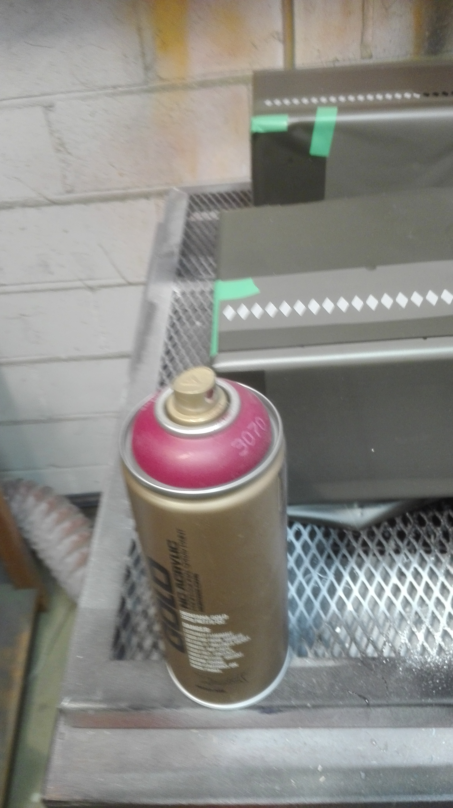

* BOM

** Piirilevy

[[file:jrr-pcb.org]]

** Materiaalit

\tiny
| Käyttökohde       | Materiaali                                 | Toimittaja                 | Hinta |
|-------------------+--------------------------------------------+----------------------------+-------|
| Kotelon liimaus   | EriKeeper                                  | Bauhaus                    | 10.00 |
| Kotelon liimaus   | Lamelli 0                                  | Bauhaus                    |     5 |
| Pohjamaali        | Futura Aqua3 Primer Val                    | [[file:bom/2026-01-16-pintaväri.pdf][Pintaväri Oy]]               | 29.50 |
| Harmaa            | Futura Aqua40 0.9l, puolikiiltävä, RAL7004 | [[file:bom/2026-01-16-pintaväri.pdf][Pintaväri Oy]]               | 46.80 |
| Punainen          |        | [[https://www.decovari.fi/][Decoväri]]                   | 10.00 |
| Kaiutin pölysuoja | Fender style black kaiutin kangas, 60x60cm | [[https://uraltone.com/fender-style-black-kaiutinkangas-grill-cloth-60x60cm.html][Uraltone 926-F-BLACK-60x60]] |    9. |
|-------------------+--------------------------------------------+----------------------------+-------|
|                   | Yhteensä                                   |                            |  80.9 |
#+TBLFM: @>$4=vsum(@I..@II)

** Osat

\tiny
| S[fn:S] | Kohde                       | Koodi               | Toimittaja                          | Kpl | A-hinta |    Yht | Huom   |
|---------+-----------------------------+---------------------+-------------------------------------+-----+---------+--------+--------|
| E       | Vahvistin                   | [[file:bom/PAM8403-datasheet.pdf][PAM8403]]             | [[https://uraltone.com/vahvistinmoduli-pam8403-class-d-2x3w.html][Uraltone 190-PAM8403-2x3W-AMP]]       |   1 |     5.0 |     5. |        |
| E       | USB-A/3.5mm DAC muunnin     | ALC5686             | [[https://www.aliexpress.com/item/1005004358120260.html][Axpress 1005004358120260]]            |   1 |    7.85 |   7.85 |        |
| E       | Nuppi/vahvistin             | 6mm,20mm/phi,16mm/h | [[https://www.aliexpress.com/item/1005007000845408.html][Axpress 1005007000845408]]            |   1 |         |      0 |        |
| E       | Nupin jatkovarsi            | 6mm,10mm/phi,25mm/h | [[https://www.aliexpress.com/item/1005006549662711.html][Axpress 1005006549662711]]            |   1 |         |      0 |        |
| E       | Vahvistimen asennuslevy     |                     | Laserleikkaus                       |   1 |       0 |      0 |        |
| E       | Rampamuhvi/vahvistin        | M3X10X6             | [[https://www.ruuvikeskus.fi/?tuote=315-7-0310061][Ruuvikeskus 315-7-0310061]]           |   4 |    0.41 |   1.64 |        |
| E       | Pultti/vahvistin            | M3x10mm             |                                     |   4 |    0.02 |   0.08 |        |
| E       | Kaiutinelementti            | [[file:bom/peerless-830986.pdf][PLS-P830986]]         | [[https://www.soundimports.eu/en/peerless-by-tymphany-pls-p830986.html][SoundImports PLS-P830986]]            |   1 |   28.45 |  28.45 |        |
| E       | Rampamuhvi/kaiutin          | M3X10X6             | [[file:bom/RAMPAMUTTERI ST M3X10X6 .png][Ruuvikeskus]]                         |   4 |    0.41 |   1.64 |        |
| E       | Pultti/kaiutin              | M3x16mm, musta      | [[https://www.aliexpress.com/item/1005003640558992.html][Axpress 1005003640558992 M3,16mm]]    |   4 |    0.08 |   0.32 |        |
| E       | Asennuskehys/kaiutin        | [[file:cad/laseroinnit/LaseroiKaiutinRengas.pdf][KaiutinRengas.pdf]]   | Laserleikkaus                       |   2 |       0 |      0 |        |
|---------+-----------------------------+---------------------+-------------------------------------+-----+---------+--------+--------|
| KS      | Tietokone                   | Raspberry Pi 3 B+   | [[https://raspberrypi.dk/fi][raspberrypi.dk]] [[https://raspberrypi.dk/fi/tuote/raspberry-pi-3-model-b-2][8211 (RPI 3B+) ]]      |   1 |   44.11 |  44.11 |        |
| KS      | Korotushylsy/piirilevy      | M3x8mm              |                                     |   3 |         |      0 |        |
| KS      | Korotushylsy/piirilevy      | M5x8mm              |                                     |   3 |         |      0 |        |
| KS      | Piirilevy                   | schema/jrr5         | JCLPCB                              |   1 |       5 |      5 |        |
| KS      | Rampamuhvi, DIN 7965        | M3X10X6             | [[https://www.ruuvikeskus.fi/?tuote=315-7-0310061][Ruuvikeskus 315-7-0310061]]           |   5 |    0.41 |   2.46 | [fn:1] |
| KS      | Korotushylsy/piirilevy      | M3x8mm              |                                     |   5 |         |      0 |        |
| KS      | Piirilevyjen kiinnitys      | M3x25, 6-kolo       |                                     |   3 |         |        |        |
| KS      | Piirilevyjen kiinnitys      | M3x10, 6kolo        |                                     |   2 |         |        |        |
|---------+-----------------------------+---------------------+-------------------------------------+-----+---------+--------+--------|
| KU      | TFT3.52 näyttö              | [[file:bom/MHS3.5-display.pdf][ILI9486]]             | [[https://www.aliexpress.com/item/1005008964389076.html?spm=a2g0o.order_list.order_list_main.52.10b9180265YXoP][Axpress]]                             |   1 |   14.40 |   14.4 |        |
| KU      | Asennuskehys/näyttö         | [[file:cad/laseroinnit/LaserointiNäyttöKehys.pdf][NäyttöKehys.pdf]]     | Laserleikkaus                       |   1 |       0 |      0 |        |
| KU      | Ruuvi/näyttö                | M2.9x?? musta       |                                     |     |         |        |        |
|---------+-----------------------------+---------------------+-------------------------------------+-----+---------+--------+--------|
| T       | Keystone panelisovitin      | [[file:bom/KAPMAmc_eng_tds.pdf][KAPMA#20]]            | [[https://www.distrelec.nl/en/panel-mount-adaptor-metal-pack-of-20-pieces-tuk-limited-kapma-20/p/30134977][Elfa 301-34-977]]                     |   4 |    1.66 |   3.32 | [fn:2] |
| T       | Pultti  keystone kiinnitys  | M3x25               |                                     |   6 |         |        | [fn:3] |
| T       | Mutteri  keystone kiinnitys | M3                  |                                     |   6 |         |        | [fn:3] |
| T       | Keystone USB-C/USB-C        |                     | [[https://www.aliexpress.com/item/1005007356362854.html][Axpress 1005007356362854 White,5pcs]] |   1 |    1.56 |   1.56 |        |
| T       | Keystone USB-A/USB-A        |                     | [[https://www.aliexpress.com/item/1005005600484996.html][Axpress 1005005600484996 White,5PCS]] |   1 |    1.32 |   1.32 |        |
| T       | USB-C/USC-C jatko 0.5       |                     |                                     |   1 |         |        | [fn:5] |
| T       | USB-C 90-aste kulma         |                     |                                     |   1 |         |        | [fn:5] |
| T       | USB-A/USC-A jatko 0.5       |                     |                                     |   1 |         |        | [fn:4] |
| T       | Rampamuhvi                  | M4x8mmx12mm         | Helakauppa                          |   6 |     1.4 |    8.4 |        |
| T       | Pultti takaseinän kiinnitys | M4x30mm,A4,upotus   | [[https://www.aliexpress.com/item/1005007838338973.html][Axpress 1005007838338973 M4,30mm]]    |   6 |    0.14 |   0.84 |        |
| TR      | Keystone panelisovitin      | [[file:bom/KAPMAmc_eng_tds.pdf][KAPMA#20]]            | [[https://www.distrelec.nl/en/panel-mount-adaptor-metal-pack-of-20-pieces-tuk-limited-kapma-20/p/30134977][Elfa 301-34-977]]                     |   2 |    1.66 |   3.32 |        |
| TR      | Liukukytkin                 | SPDT,15mm           | [[https://www.partco.fi/fi/saehkoemekaniikka/kytkimet/liukukytkimet/7283-kyt-liu15.html][Partco KYT LIU15]]                    |   1 |     0.5 |    0.5 |        |
| TR      | Liukukytkin sovitin         |                     | 3D tulostus                         |   1 |     0.5 |    0.5 |        |
| TR      | Keystonone RCA              |                     |                                     |     |         |      0 |        |
|---------+-----------------------------+---------------------+-------------------------------------+-----+---------+--------+--------|
| P       | Kumitassu                   | \phi5mm/22x13mm     | [[https://www.partco.fi/fi/mekaniikka/kotelointi/kotelotarvikkeet/21895-kot-g050.html][Partco KOT G050]]                     |   4 |    0.36 |   1.44 |        |
| P       | Pultti/tassu                | M4x30mm             |                                     |   4 |    0.05 |    0.2 |        |
| P       | Mutteri                     | M4                  |                                     |   4 |    0.05 |    0.2 |        |
| P       | Aluslevy                    | M4                  |                                     |   8 |    0.02 |   0.16 |        |
|---------+-----------------------------+---------------------+-------------------------------------+-----+---------+--------+--------|
|         | *YHTEENSÄ*                  |                     |                                     |     |         | 132.59 |        |
#+TBLFM: $7=$5*$6::@>$7=vsum(@I..@IIIII)

[fn:S] E=Etusivu, KS=sisäkatto, KU=ulkokatto, T=takasivu, TR=takasivu, RC liitin, P=pohja

[fn:1] Kuudes rampamuhvi tulisi liian lähellä IDC liittimen aukkoa, siksi 5 ruuvin paikkaa

[fn:2] 2 kpl USB-power + KB + optio 2 kpl RCA-liitin, Audio -switch

[fn:3] 2x keystone liittimien lukumäärä

[fn:4] Näppäimistön kytkeminen 

[fn:5] Virran syöttö 

* Kommetteja

- Painonappien läpireikä 5mm (min 4.5)
- Kaiuttimen aukko ei ole keskellä
- jrr raspeberry hattu piirilevyn asennusreijät M3:ksi
  - Huom. Raspberry pi asennusreijät 2.5mm --> etsittävä 2.5mm rampamuhvi
- Huom. jatkossa takaseinän kiinnnitys 3mm rampamuhvilla ja M3/30 mm linssikantaruuvilla

[[file:bom/Manufacturing facility overview and pre-drilling instructions - B.pdf][Rampamuhvin mitat ja pilotreijän poraus]]:
- Taulukko https://www.rampa.com/eu/en/Online-Shop/Products/Inserts/
- M3 (ulkohalkaisija 6mm) -> 5mm pora
- M4 (ulkohalkaisija 8mm) -> 6mm pora

* Fin                                                              :noexport:

** Emacs variables

#+RESULTS:

* Footnotes

# Local Variables:
# time-stamp-line-limit: -8
# time-stamp-start: "Modified:"
# time-stamp-format: "%:y-%02m-%02d.%02H:%02M"
# time-stamp-time-zone: nil
# time-stamp-end: "; # time-stamp"
# eval: (add-hook 'before-save-hook 'time-stamp)
# org-confirm-babel-evaluate: nil
# End:
#
# Muuta
# org-cdlatex-mode: t
# eval: (cdlatex-mode)
#
# Local ebib:
# org-ref-default-bibliography: "./jrr-bom.bib"
# org-ref-bibliography-notes: "./jrr-bom-notes.org"
# org-ref-pdf-directory: "./pdf/"
# org-ref-notes-directory: "."
# bibtex-completion-notes-path: "./jrr-bom-notes.org"
# ebib-preload-bib-files: ("./jrr-bom.bib")
# ebib-notes-file: ("./jrr-bom-notes.org")
# reftex-default-bibliography: ("./jrr-bom.bib")

Modified:2026-04-13.16:21; # time-stamp
