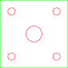

#+PROPERTY: header-args+ :var  MEM_STICK="/media/jj/jj"
#+PROPERTY: header-args+ :var  PROJECT="jrr"
#+PROPERTY: header-args+ :var  RELEASE="2"

#+LATEX: \setlength{\parindent}{0pt}
#+options: ':nil *:t -:t ::t <:t H:3 \n:t ^:nil arch:headline

* Koten MDF levyjen leikkaus

Kotelon osat 3:lle radiolle 600 mm x 800 mm x 19 mm MDF levystä leikattaessa:
- 6 kpl x 232mm x 138mm
- 6 kpl x 232mm x 100mm
- 6 kpl x 100mm x 100mm   

Leikkaussuunnitelma 600 mm x 800 mm levylle:

| 232mm+232mm+100 = 564mm => | 232mm sorko | 232mm sorko | 100mm  sorko |
|---------------------------+-------------+-------------+--------------|
|                           |         138 |         138 |          100 |
|                           |         138 |         100 |          100 |
|                           |         138 |         100 |          100 |
|                           |         138 |         100 |          100 |
|                           |         138 |         100 |          100 |
|                           |         100 |         100 |          100 |
|---------------------------+-------------+-------------+--------------|
| Yhteensä < 800mm          |         790 |         638 |          600 |
#+TBLFM: @>$2=vsum(@I..@II)::@>$3=vsum(@I..@II)::@>$4=vsum(@I..@II)

* Kotelon jyrsintä
** Katon aukkojen jyrsintä

[[file:cad/pages/katto.pdf]]

Jyrsintätiedostot [[file:cad/jyrsi/katto]]

- Origo: xy, keskelle aihiota, z=0 aihion yläpinnalle
- Jyrsintä:
  - 3.2mm poraterällä:
    - katto-01-nappainreijat-pora.ngc
  - 4mm x 20mm terällä:
    - +katto-01-nappainreijat-04mm.ngc+
    - katto-02-liitin-04mm.ngc
  - 6mm x 20mm terällä
    - katto-03-naytto-06mm.ngc

** Etuseinän aukkojen jyrsintä

[[file:cad/pages/etuseinä.pdf]]

- Origo: xy, keskelle aihiota, z=0 aihion yläpinnalle
- Jyrsintä:
  - 6mm x 20mm terällä
    - etu-kytkin.ngc
    - etu-pls-läpi.ngc
    - etu-pls-upotus.ngc
    - etu-pls-reunat.ngc
  
** Takaseinän aukkojen jyrsintä

[[file:cad/pages/takaseinä.pdf]]

- Origo: xy, keskelle aihiota, z=0 aihion yläpinnalle
- Jyrsintä:
  - 6mm x 20mm terällä
    - taka-kytkin.ngc
    - taka-keystone-vasen.ngc
    - taka-keystone-oikea.ngc (mikäli kalustetaan RC input:lle)

** +Lattian kaiverrus+
:PROPERTIES:
:header-args+: :var  GERBERS="cad/laseroinnit/url/gerbers"
:header-args+: :var  ETOOLGERBERS="/home/jj/Documents/etool/01-gerber"
:header-args+:   :var  GERB="url-F_Cu"
:END:

Kaiverruksen gerber -tiedostot ovat hakemistossa

#+BEGIN_SRC bash :eval no-export :results file :exports results
echo "Running in $(pwd) host '$(hostname)' on $(date)" 1>&2
echo -n "$GERBERS"
#+END_SRC

#+RESULTS:
[[file:cad/laseroinnit/url/gerbers]]

Tyhjennetään työhakemisto  ~Documents/etool~
#+BEGIN_SRC bash :eval no-export :results output :exports none
echo "Running in $(pwd) host '$(hostname)' on $(date)"
rm -rf /home/jj/Documents/etool
etool.sh ls
#+END_SRC

#+RESULTS:
#+begin_example
Running in /home/jj/work/jrr host 'eero' on pe 1.8.2025 10.01.15 +0300
DISPLAY=:1
Created ETOOL_DIR=/home/jj/Documents/etool
Directory /etool/01-gerber created
Directory /etool/01-image created
Directory /etool/02-ngc created
Directory /etool/02-silk created
Directory /etool/linuxcnc/configs/sim.axis created
File /etool/pcb2gcode-3-grooves.ini created
File /etool/pcb2gcode-control-3-grooves.template created
File /etool/pcb2gcode-control.template created
File /etool/pcb2gcode.ini created
File /etool/linuxcnc/configs/sim.axis/axis_etool.ini created
File /etool/linuxcnc/configs/sim.axis/sim_mm.tbl created
File /etool/.linuxcncrc created
/etool/01-gerber:
total 0

/etool/01-image:
total 0

/etool/02-ngc:
total 0

/etool/02-silk:
total 0
#+end_example

Päivitetään etool konfiguraatiotiedostoa
~/home/jj/Documents/etool/pcb2gcode.ini~ estämällä 'autoleveling'
-toiminto.

#+BEGIN_SRC bash :eval no-export :results output :exports results
echo "Running in $(pwd) host '$(hostname)' on $(date)" >&2
FILE=/home/jj/Documents/etool/pcb2gcode.ini

sed -e 's/al-front=./al-front=0/' -i $FILE
sed -e 's/al-back=./al-back=0/' -i $FILE
sed -e 's/isolation-width=[0-9\.]*/isolation-width=0.1/' -i $FILE
grep -e 'al-front' -e 'al-back' -e 'isolation-width' $FILE
#+END_SRC

#+RESULTS:
: al-front=0             # enable 1, disable 0 z autoleveller front layer
: al-back=0              # enable 1, disable 0 z autoleveller back layer
: isolation-width=0.1mm # min width between copper surfaces

Jyrsintään käytettävät gerber tiedostot
#+BEGIN_SRC bash :eval no-export :results output :exports results
echo "Running in $(pwd) host '$(hostname)' on $(date)"
ls -ltr $GERBERS
#+END_SRC

#+RESULTS:
#+begin_example
Running in /home/jj/work/jrr host 'eero' on pe 1.8.2025 10.02.33 +0300
total 75
-rw-r--r-- 1 jj jj  3580 heinä  30 15:50 url-PTH-drl_map.gbr
-rw-r--r-- 1 jj jj  3580 heinä  30 15:50 url-NPTH-drl_map.gbr
-rw-rw-r-- 1 jj jj   564 elo     1 10:00 url-drl.rpt
-rw-r--r-- 1 jj jj   305 elo     1 10:00 url-PTH.drl
-rw-r--r-- 1 jj jj   309 elo     1 10:00 url-NPTH.drl
-rw-r--r-- 1 jj jj 10249 elo     1 10:00 url-F_Cu.gbr
-rw-r--r-- 1 jj jj   530 elo     1 10:00 url-B_Cu.gbr
-rw-r--r-- 1 jj jj   526 elo     1 10:00 url-F_Paste.gbr
-rw-r--r-- 1 jj jj   526 elo     1 10:00 url-B_Paste.gbr
-rw-r--r-- 1 jj jj   527 elo     1 10:00 url-F_Silkscreen.gbr
-rw-r--r-- 1 jj jj   527 elo     1 10:00 url-B_Silkscreen.gbr
-rw-r--r-- 1 jj jj   531 elo     1 10:00 url-F_Mask.gbr
-rw-r--r-- 1 jj jj   531 elo     1 10:00 url-B_Mask.gbr
-rw-r--r-- 1 jj jj   677 elo     1 10:00 url-Edge_Cuts.gbr
-rw-r--r-- 1 jj jj  2575 elo     1 10:00 url-job.gbrjob
#+end_example

Kaiverrus

#+BEGIN_SRC bash :eval no-export :results file  :exports results
echo "Running in $(pwd) host '$(hostname)' on $(date)" >&2
GERB=url-F_Cu
SVG=pics/$GERB.pdf
gerbv $GERBERS/$GERB.gbr -x pdf -o $SVG >&2
echo -n $SVG
#+END_SRC

#+RESULTS:
[[file:pics/url-F_Cu.pdf]]

Muunnetaan gerber tiedostot hakemistossa  ~$GERBERS/*~ jyrsintäkoodiksi ~$ETOOLGERBERS~
#+BEGIN_SRC bash :eval no-export :results output :exports none
echo "Running in $(pwd) host '$(hostname)' on $(date)"
echo "GERBERS=$GERBERS"
echo "ETOOLGERBERS=$ETOOLGERBERS"
cp $GERBERS/* $ETOOLGERBERS
etool.sh gerber url
#+END_SRC

#+RESULTS:
#+begin_example
Running in /home/jj/work/jrr host 'eero' on pe 1.8.2025 10.10.01 +0300
GERBERS=cad/laseroinnit/url/gerbers
ETOOLGERBERS=/home/jj/Documents/etool/01-gerber
DISPLAY=:1
Directory /etool/01-gerber exits - not modified
Directory /etool/01-image exits - not modified
Directory /etool/02-ngc exits - not modified
Directory /etool/02-silk exits - not modified
Directory /etool/linuxcnc/configs/sim.axis exits - not modified
File /etool/pcb2gcode-3-grooves.ini exits - not modified
File /etool/pcb2gcode-control-3-grooves.template exits - not modified
File /etool/pcb2gcode-control.template exits - not modified
File /etool/pcb2gcode.ini exits - not modified
File /etool/linuxcnc/configs/sim.axis/axis_etool.ini exits - not modified
File /etool/linuxcnc/configs/sim.axis/sim_mm.tbl exits - not modified
File /etool/.linuxcncrc exits - not modified
pcb2gcode using configuration files /etool/pcb2gcode-control.template, /etool/pcb2gcode.ini
Importing front side... DONE.
Importing back side... DONE.
Importing outline... DONE.
Processing input files... DONE.
Exporting back... DONE. (Height: 25.65mm Width: 104.25mm)
Exporting front... DONE. (Height: 25.65mm Width: 104.25mm)
Exporting outline... DONE. (Height: 25.65mm Width: 104.25mm) The board should be cut from the FRONT side. 
Importing drill... DONE.
Exporting milldrill... Exporting drill... DONE. The board should be drilled from the FRONT side.
END.
Importing front side... not specified.
Importing back side... not specified.
Importing outline... DONE.
Processing input files... DONE.
Exporting outline... DONE. (Height: 25.65mm Width: 104.25mm) The board should be cut from the FRONT side. 
Importing drill... DONE.
Exporting milldrill... Exporting drill... DONE. The board should be drilled from the FRONT side.
END.
Convert Gerber  /etool/01-gerber/url-F_SilkS.gbr to png -image /etool/02-silk/url-F_SilkS.png
--> No such file /etool/01-gerber/url-F_SilkS.gbr - no conversion
Convert Gerber  /etool/01-gerber/url-F_Silkscreen.gbr to png -image /etool/02-silk/url-F_Silkscreen.png
Convert Gerber  /etool/01-gerber/url-B_SilkS.gbr to png -image /etool/02-silk/url-B_SilkS.png
--> No such file /etool/01-gerber/url-B_SilkS.gbr - no conversion
Convert Gerber  /etool/01-gerber/url-B_Silkscreen.gbr to png -image /etool/02-silk/url-B_Silkscreen.png
Convert Gerber  /etool/01-gerber/url-User_1.gbr to png -image /etool/02-silk/url-User_1.png
--> No such file /etool/01-gerber/url-User_1.gbr - no conversion
Convert Gerber  /etool/01-gerber/url-User_2.gbr to png -image /etool/02-silk/url-User_2.png
--> No such file /etool/01-gerber/url-User_2.gbr - no conversion
#+end_example

Jyrsintäkoodi hakemistossa ~/Documents/etool/02-ngc~ 
#+BEGIN_SRC bash :eval no-export :results output
echo "Running in $(pwd) host '$(hostname)' on $(date)"
ls -ltr ~/Documents/etool/02-ngc/$GERB*
#+END_SRC

#+RESULTS:
: Running in /home/jj/work/jrr host 'eero' on pe 1.8.2025 10.10.07 +0300
: -rw-r--r-- 1 jj jj 46231 elo     1 10:10 /home/jj/Documents/etool/02-ngc/url-F_Cu.ngc

Launch simulator
#+BEGIN_SRC bash :eval no-export :results output
echo "Running in $(pwd) host '$(hostname)' on $(date)"
etool.sh simulator
#+END_SRC

Kopioidaan jyrsintäkoodi  ~/Documents/etool/url-F_Cu.ngc~ hakememistoon [[file:cad/jyrsi/lattia]]

#+BEGIN_SRC bash :eval no-export :results output :exports none
echo "Running in $(pwd) host '$(hostname)' on $(date)"
cp $ETOOLGERBERS/../02-ngc/$GERB.ngc cad/jyrsi/lattia/.
#+END_SRC

#+RESULTS:
: Running in /home/jj/work/jrr host 'eero' on pe 1.8.2025 10.10.12 +0300

* Poraukset

** Lattia

- M4 pultin reijät 4 kpl
  - kumitassun phi 22mm
  - seinän paksuus 19mm
  - etäisyys radion reunasta 30mm - 
  - --> etäisyys lattian reunasta =  30mm-19mm = 11mm

** Etuseinä

- Potikkareikä M3mm rampmuhvi x 4kpl
  - ulkohalkaisija 6mm, syvyys 6mm
  - 5mm pilotreikä syvyys 10mm

** Katto

- PCB  M3mm rampmuhvi x 5kpl
  - ulkohalkaisija 6mm, syvyys 6mm
  - 5mm pilotreikä syvyys 10mm

- PCB, reikä liittimen vieressää
  - phi 2.5mm, syvyys 10mm

* Laseroinnit
** Vahvistimen potikan asennuskehys
:PROPERTIES:
:header-args+: :var  TEMPLATE_W="10"
:header-args+: :var  BIT_W="6"
:END:

#+NAME: LaseroiPotikkaLevy
#+BEGIN_SRC asymptote :eval no-export :exports results :file cad/laseroinnit/LaseroiPotikkaLevy.svg :var fmt="svg"
// https://www.google.com/search?q=asymptote+tutorial
// https://www.google.com/search?q=asymptote+Reference+card
// https://asymptote.sourceforge.io/asymptote_tutorial.pdf
// https://asymptote.sourceforge.io/links.html
// https://asymptote.sourceforge.io/doc/Index.html
// https://asymptote.sourceforge.io/asyRefCard.pdf
// /home/jj/usr/distal-ohjeet/Ohjeet/diagramming/asymptotote-geometry_en-5.pdf
// https://asymptote.sourceforge.io/FAQ/index.html
import  graph;
import geometry;
texpreamble("\usepackage[utf8]{inputenc}");
import settings;
// import fontsize;
outformat=fmt;
size(100mm);
unitsize(1mm);

real keskusreika_phi=7;
real kiinnitysreika_phi=3.2;
real ruuvireunasta = 5;
real koko = 30;

  pen penTeksti=blue;
  pen penCut1=green;
  pen penCut2=orange;
  pen penCut3=red;

    

  path keskusreika = circle((0,0), keskusreika_phi/2);
  path ruuvireika = circle((0,0), kiinnitysreika_phi/2);
  pair kulma= (koko/2, koko/2);
  pair ruuvipaikka=(koko/2 - ruuvireunasta, koko/2 - ruuvireunasta);
    
  path reuna = (1,0)*kulma -- (0,1)*kulma -- ( -1, 0)*kulma -- (0,-1)*kulma -- cycle;
  draw( keskusreika, p=penCut3);
  draw(reuna, p=penCut1);
  draw(shift((1,0)*ruuvipaikka)*ruuvireika, p=penCut3);
  draw(shift((0,1)*ruuvipaikka)*ruuvireika, p=penCut3);
  draw(shift((-1,0)*ruuvipaikka)*ruuvireika, p=penCut3);
  draw(shift((0,-1)*ruuvipaikka)*ruuvireika, p=penCut3);

  

  write( "valmis");
  #+END_SRC

  #+RESULTS: LaseroiPotikkaLevy
  

Muunnetaan svg tiedosto dxf -tiedostoksi.
#+BEGIN_SRC bash :eval no-export :results result file :var SVG=LaseroiPotikkaLevy
svg2dxf.sh $SVG
#+END_SRC

#+RESULTS:
[[file:cad/laseroinnit/LaseroiPotikkaLevy.dxf]]

Potikkalevy laseroinnin tiedostot

#+BEGIN_SRC bash :eval no-export :results output :exports results
echo "Running in $(pwd) host '$(hostname)' on $(date)"
ls -ltr cad/laseroinnit/LaseroiPotikka*

#+END_SRC

#+RESULTS:
: Running in /home/jj/work/jrr host 'eero' on ke 30.7.2025 09.02.56 +0300
: -rw-r--r-- 1 jj jj  2696 heinä  30 09:02 cad/laseroinnit/LaseroiPotikkaLevy.svg
: -rw-rw-r-- 1 jj jj  3695 heinä  30 09:02 cad/laseroinnit/LaseroiPotikkaLevy.eps
: -rw-rw-r-- 1 jj jj 17585 heinä  30 09:02 cad/laseroinnit/LaseroiPotikkaLevy.dxf

** Näytön asennuskehys

[[file:cad/laseroinnit/LaserointiNäyttöKehys.pdf]]

** Kaiuttimen asennuskehys

[[file:cad/laseroinnit/LaseroiKaiutinRengas.pdf]]

* 3D tulostus

** Liukukytkimen keystone -sovitin

[[file:cad/3D/keystone-liukukytkin-v10.stl]]

* Maalaus

** Maalaussabluunat

Hakemistossa [[file:cad/sabluunat]] olevat maalaussabluunat

#+BEGIN_SRC bash :eval no-export :results output :exports results
ls cad/sabluunat
#+END_SRC

#+RESULTS:
: JussiSalmiakki.dxf
: JussiSalmiakki.jpg
: JussiSalmiakki.pdf
: JussiSalmiakki.svg

#+CAPTION: JussiSalmiakki
[[file:cad/sabluunat/JussiSalmiakki.pdf]]

* Issues

#+ATTR_LATEX: :font \tiny
   |------------+-------------+---------------------------------+-------------+----------------------------------------+--------------------|
   | #          |      Date/# | Ref                             |     Fixed/# | As-is                                  | Tobe               |
   |------------+-------------+---------------------------------+-------------+----------------------------------------+--------------------|
   | JRR-CAD-1  |   15.7.2025 | katto-03-naytto-06mm.ngc        |             | Step down 3+3+0.5+1                    | 3.5 + 3.5 + 0.5    |
   | JRR-CAD-2  |   15.7.2025 | katto-03-liitin-reunat-04mm.ngc |   16.5.2025 | Step down 2.0                          | 3.5                |
   | JRR-CAD-3  |   15.7.2025 | katto-03-liitin-reunat-04mm.ngc |             | Separate from katto-02-liitin-04mm.ngc | Combine            |
   | JRR-CAD-4  |   15.7.2025 | Katto*                          |   16.5.2025 | Safe height < 30mm, Clearance < 10>    | 30/10mm            |
   | JRR-CAD-5  |   15.7.2025 | cad                             |   16.5.2025 | Automate copy to USB                   |                    |
   | JRR-CAD-6  |   15.7.2025 | Katto*                          |   16.5.2025 | Too much to the right                  | -43 mm             |
   | JRR-CAD-7  |   16.7.2025 | Katto                           |   16.5.2025 | Origin lower-right                     | Center block       |
   | JRR-CAD-8  |   20.7.2025 | Katto                           |   20.7.2025 | Drill button holes                     | nappainreijat-pora |
   | JRR-CAD-9  |    1.8.2025 | LaserRengas                     |             | Phi 99.5                               | 101.5              |
   | JRR-CAD-10 | 13.4.2026/1 | Potinkanreikä                   | 19.4.2026/2 | Diameter/10.5                          | Diameter +11m      |
   | JRR-CAD-11 |   13.4.2026 | Kauitin ja potikkalinja         | 19.4.2026/2 | Sijainti alareunassa                   | Keskellä           |
   | JRR-CAD-12 |    13.4.206 | Painonappien reijät             |             |                                        | 4.5 -5mm           |
   |------------+-------------+---------------------------------+-------------+----------------------------------------+--------------------|

* Deploy                                                           :noexport:
** Deploy to simutor

#+BEGIN_SRC bash :eval no-export :results output
  echo "Running in $(pwd) host '$(hostname)' on $(date)"
  ROOT_DIR=/home/jj/work/jrr/cad/jyrsi
  FROM_DIRS="$ROOT_DIR/etu $ROOT_DIR/katto $ROOT_DIR/taka"
  TO_DIR=/home/jj/Documents/etool/02-ngc
  for d in $FROM_DIRS; do
      (set -x; cp $d/* $TO_DIR)
  done

  ls -ltr $TO_DIR
  	 
#+END_SRC

#+RESULTS:
#+begin_example
Running in /home/jj/work/jrr host 'eero' on su 20.7.2025 15.50.25 +0300
total 55
-rw-rw-r-- 1 jj jj 9374 heinä  20 15:50 etu-pls-upotus.ngc
-rw-r--r-- 1 jj jj 1514 heinä  20 15:50 etu-pls-reunat.ngc
-rw-r--r-- 1 jj jj 9575 heinä  20 15:50 etu-pls-läpi.ngc
-rw-r--r-- 1 jj jj 1941 heinä  20 15:50 etu-kytkin.ngc
-rw-rw-r-- 1 jj jj 2520 heinä  20 15:50 katto-01-nappainreijat-04mm.ngc
-rw-rw-r-- 1 jj jj 5902 heinä  20 15:50 katto-03-naytto-06mm.ngc
-rw-rw-r-- 1 jj jj 7361 heinä  20 15:50 katto-02-liitin-04mm.ngc
-rw-rw-r-- 1 jj jj  736 heinä  20 15:50 katto-01-nappainreijat-pora.ngc
-rw-rw-r-- 1 jj jj 2559 heinä  20 15:50 taka-kytkin.ngc
-rw-r--r-- 1 jj jj 6195 heinä  20 15:50 taka-keystone-vasen.ngc
-rw-rw-r-- 1 jj jj 7689 heinä  20 15:50 taka-keystone-oikea.ngc
#+end_example

** Sync SUB_FOLDERS to MEM_STICK/PROJECT in two ways
:PROPERTIES:
:header-args+: :var  SUB_FOLDERS='("pics" "pics-keep" "cad")
:END:

#+call: lob-sync-doc()

#+RESULTS:
: lob-sync-doc: in /home/jj/work/jrr host 'Leo' on ke 1.4.2026 13.47.20 +0300
: MEM_STICK=/media/jj/jj
: PROJECT=jrr
: SUB_FOLDERS[@]=pics pics-keep cad

#+call: lob-sync-two-ways()

#+RESULTS:
#+begin_example
Running in /home/jj/work/jrr host 'Leo' on ke 1.4.2026 13.46.48 +0300
DRY_RUN=0
sync SUB_FOLDER=pics
sending incremental file list
created directory /media/jj/jj/jrr/pics
./
asy1.png
fab.pdf
jrr-menu.png
jrr5.pdf
url-F_Cu.pdf
url-F_Cu.svg

sent 713.796 bytes  received 177 bytes  475.982,00 bytes/sec
total size is 713.079  speedup is 1,00
sending incremental file list
./

sent 260 bytes  received 25 bytes  570,00 bytes/sec
total size is 713.079  speedup is 2.502,03
712K	/media/jj/jj/jrr/pics
712K	pics
sync SUB_FOLDER=pics-keep
sending incremental file list
created directory /media/jj/jj/jrr/pics-keep
./
RPI-physical-dimensions.png
audio-cables.png
jrr5-front.png

sent 374.379 bytes  received 125 bytes  249.669,33 bytes/sec
total size is 373.965  speedup is 1,00
sending incremental file list
./

sent 193 bytes  received 25 bytes  436,00 bytes/sec
total size is 373.965  speedup is 1.715,44
376K	/media/jj/jj/jrr/pics-keep
376K	pics-keep
sync SUB_FOLDER=cad
sending incremental file list
created directory /media/jj/jj/jrr/cad
./
.gitignore
jrr5.20250715-105520.FCBak
jrr5.20250720-154752.FCBak
jrr5.FCStd
jrr5.nc
3D/
3D/keystone-liukukytkin-v10.stl
jyrsi/
jyrsi/etu/
jyrsi/etu/etu-kytkin.ngc
jyrsi/etu/etu-pls-läpi.ngc
jyrsi/etu/etu-pls-reunat.ngc
jyrsi/etu/etu-pls-upotus.ngc
jyrsi/katto/
jyrsi/katto/katto-01-nappainreijat-04mm.ngc
jyrsi/katto/katto-01-nappainreijat-pora.ngc
jyrsi/katto/katto-02-liitin-04mm.ngc
jyrsi/katto/katto-03-liitin-reunat-04mm.ngc
jyrsi/katto/katto-03-naytto-06mm.ngc
jyrsi/lattia/
jyrsi/lattia/url-F_Cu.ngc
jyrsi/taka/
jyrsi/taka/taka-keystone-oikea.ngc
jyrsi/taka/taka-keystone-vasen.ngc
jyrsi/taka/taka-kytkin.ngc
laseroinnit/
laseroinnit/LaseroiKaiutinRengas-sabluuna.dxf
laseroinnit/LaseroiKaiutinRengas.dxf
laseroinnit/LaseroiKaiutinRengas.pdf
laseroinnit/LaseroiKaiutinRengas.svg
laseroinnit/LaseroiPotikkaLevy.dxf
laseroinnit/LaseroiPotikkaLevy.eps
laseroinnit/LaseroiPotikkaLevy.svg
laseroinnit/LaserointiNäyttöKehys-sabluuna.dxf
laseroinnit/LaserointiNäyttöKehys.dxf
laseroinnit/LaserointiNäyttöKehys.pdf
laseroinnit/LaserointiNäyttöKehys.svg
laseroinnit/url/
laseroinnit/url/fp-info-cache
laseroinnit/url/url.kicad_pcb
laseroinnit/url/url.kicad_prl
laseroinnit/url/url.kicad_pro
laseroinnit/url/url.kicad_sch
laseroinnit/url/gerbers/
laseroinnit/url/gerbers/.url-PTH-drl_map.gbr.sfi5Bf
laseroinnit/url/gerbers/url-B_Cu.gbr
laseroinnit/url/gerbers/url-B_Mask.gbr
laseroinnit/url/gerbers/url-B_Paste.gbr
laseroinnit/url/gerbers/url-B_Silkscreen.gbr
laseroinnit/url/gerbers/url-Edge_Cuts.gbr
laseroinnit/url/gerbers/url-F_Cu.gbr
laseroinnit/url/gerbers/url-F_Mask.gbr
laseroinnit/url/gerbers/url-F_Paste.gbr
laseroinnit/url/gerbers/url-F_Silkscreen.gbr
laseroinnit/url/gerbers/url-NPTH-drl_map.gbr
laseroinnit/url/gerbers/url-NPTH.drl
laseroinnit/url/gerbers/url-PTH-drl_map.gbr
laseroinnit/url/gerbers/url-PTH.drl
laseroinnit/url/gerbers/url-drl.rpt
laseroinnit/url/gerbers/url-job.gbrjob
laseroinnit/url/url-backups/
laseroinnit/url/url-backups/url-2025-07-29_213923.zip
laseroinnit/url/url-backups/url-2025-07-29_214759.zip
laseroinnit/url/url-backups/url-2025-07-29_220344.zip
laseroinnit/url/url-backups/url-2025-07-30_081346.zip
laseroinnit/url/url-backups/url-2025-07-30_101711.zip
laseroinnit/url/url-backups/url-2025-07-30_102726.zip
laseroinnit/url/url-backups/url-2025-07-30_154643.zip
laseroinnit/url/url-backups/url-2025-07-30_160012.zip
laseroinnit/url/url-backups/url-2025-07-31_195429.zip
laseroinnit/url/url-backups/url-2025-08-01_100036.zip
laseroinnit/url/url-backups/url-2025-08-01_100910.zip
laseroinnit/url/url-backups/url-2025-08-01_164644.zip
pages/
pages/etuseinä.pdf
pages/katto.pdf
pages/takaseinä.pdf
sabluunat/
sabluunat/JussiSalmiakki.dxf
sabluunat/JussiSalmiakki.jpg
sabluunat/JussiSalmiakki.pdf
sabluunat/JussiSalmiakki.svg
sabluunat/salmiakki.cst

sent 2.151.371 bytes  received 1.499 bytes  253.278,82 bytes/sec
total size is 2.144.322  speedup is 1,00
sending incremental file list

sent 3.040 bytes  received 27 bytes  6.134,00 bytes/sec
total size is 2.144.322  speedup is 699,16
20K	/media/jj/jj/jrr/cad/3D
148K	/media/jj/jj/jrr/cad/jyrsi
312K	/media/jj/jj/jrr/cad/laseroinnit
836K	/media/jj/jj/jrr/cad/pages
252K	/media/jj/jj/jrr/cad/sabluunat
2,3M	/media/jj/jj/jrr/cad
148K	cad/jyrsi
252K	cad/sabluunat
20K	cad/3D
836K	cad/pages
312K	cad/laseroinnit
2,3M	cad
#+end_example

** +Deploy to USB stick - REPLACED Sync SUB_FOLDERS+
#+call: sync-info()

#+RESULTS:
: PROJECT=jrr
: SUB_FOLDER=cad
: MEM_STICK=/media/jj/jj

#+call: sync-init()

#+RESULTS:
#+begin_example
mkdir /media/jj/jj/jrr already exists
total 732
drwxr-xr-x 2 jj jj   4096 helmi  19  2020 sabluunat
-rw-r--r-- 1 jj jj 199517 heinä  15 10:55 jrr5.20250715-105520.FCBak
drwxr-xr-x 2 jj jj   4096 heinä  16 10:47 pages
drwxr-xr-x 2 jj jj   4096 heinä  18 08:55 3D
-rw-r--r-- 1 jj jj 260841 heinä  20 15:47 jrr5.20250720-154752.FCBak
-rw-r--r-- 1 jj jj    736 heinä  20 15:54 jrr5.nc
-rw-r--r-- 1 jj jj 260846 heinä  20 15:55 jrr5.FCStd
drwxr-xr-x 3 jj jj   4096 heinä  30 09:02 laseroinnit
drwxr-xr-x 6 jj jj   4096 heinä  30 10:03 jyrsi
#+end_example

#+call: sync-doc()

#+RESULTS:
#+begin_example
Running in /home/jj/work/jrr host 'eero' on ke 30.7.2025 20.16.36 +0300
PROJECT=jrr
SUB_FOLDER=cad
MEM_STICK=/media/jj/jj
------------------------------------------------------------------
cad
total 657
drwxr-xr-x 2 jj jj      7 helmi  19  2020 sabluunat
-rw-r--r-- 1 jj jj 199517 heinä  15 10:55 jrr5.20250715-105520.FCBak
drwxr-xr-x 2 jj jj      5 heinä  16 10:47 pages
drwxr-xr-x 2 jj jj      3 heinä  18 08:55 3D
-rw-r--r-- 1 jj jj 260841 heinä  20 15:47 jrr5.20250720-154752.FCBak
-rw-rw-r-- 1 jj jj    736 heinä  20 15:54 jrr5.nc
-rw-r--r-- 1 jj jj 260846 heinä  20 15:55 jrr5.FCStd
drwxr-xr-x 3 jj jj     14 heinä  30 09:02 laseroinnit
drwxr-xr-x 6 jj jj      6 heinä  30 10:03 jyrsi
------------------------------------------------------------------
/media/jj/jj/jrr
total 0
#+end_example

#+call: sync-two-ways()

#+RESULTS:
#+begin_example
Running in /home/jj/work/jrr host 'eero' on pe 1.8.2025 10.13.55 +0300
rsync SUB_FOLDER=cad <----> MEM_STICK/PROJECT=/media/jj/jj/jrr
sending incremental file list
laseroinnit/url/gerbers/
laseroinnit/url/gerbers/url-PTH-drl_map.gbr
laseroinnit/url/gerbers/url-PTH.drl
laseroinnit/url/gerbers/url-drl.rpt
laseroinnit/url/gerbers/url-job.gbrjob
laseroinnit/url/url-backups/url-2025-07-29_213923.zip
laseroinnit/url/url-backups/url-2025-07-29_214759.zip
laseroinnit/url/url-backups/url-2025-07-29_220344.zip
laseroinnit/url/url-backups/url-2025-07-30_081346.zip
laseroinnit/url/url-backups/url-2025-07-30_101711.zip
laseroinnit/url/url-backups/url-2025-07-30_102726.zip
laseroinnit/url/url-backups/url-2025-07-30_154643.zip
laseroinnit/url/url-backups/url-2025-07-30_160012.zip
laseroinnit/url/url-backups/url-2025-07-31_195429.zip
laseroinnit/url/url-backups/url-2025-08-01_100036.zip
laseroinnit/url/url-backups/url-2025-08-01_100910.zip
pages/etuseinä.pdf
pages/katto.pdf
pages/takaseinä.pdf
sabluunat/JussiSalmiakki.dxf
sabluunat/JussiSalmiakki.jpg
sabluunat/JussiSalmiakki.pdf
sabluunat/JussiSalmiakki.svg
sabluunat/salmiakki.cst

sent 1.140.456 bytes  received 523 bytes  456.391,60 bytes/sec
total size is 2.136.717  speedup is 1,87
sending incremental file list
laseroinnit/url/gerbers/.url-PTH-drl_map.gbr.sfi5Bf

sent 6.682 bytes  received 47 bytes  13.458,00 bytes/sec
total size is 2.140.297  speedup is 318,07
/media/jj/jj/jrr:
total 732
drwxr-xr-x 2 jj jj   4096 helmi  19  2020 sabluunat
-rw-r--r-- 1 jj jj 199517 heinä  15 10:55 jrr5.20250715-105520.FCBak
drwxr-xr-x 2 jj jj   4096 heinä  16 10:47 pages
drwxr-xr-x 2 jj jj   4096 heinä  18 08:55 3D
-rw-r--r-- 1 jj jj 260841 heinä  20 15:47 jrr5.20250720-154752.FCBak
-rw-r--r-- 1 jj jj    736 heinä  20 15:54 jrr5.nc
-rw-r--r-- 1 jj jj 260846 heinä  20 15:55 jrr5.FCStd
drwxr-xr-x 3 jj jj   4096 heinä  30 09:02 laseroinnit
drwxr-xr-x 6 jj jj   4096 heinä  30 10:03 jyrsi

cad:
total 657
drwxr-xr-x 2 jj jj      7 helmi  19  2020 sabluunat
-rw-r--r-- 1 jj jj 199517 heinä  15 10:55 jrr5.20250715-105520.FCBak
drwxr-xr-x 2 jj jj      5 heinä  16 10:47 pages
drwxr-xr-x 2 jj jj      3 heinä  18 08:55 3D
-rw-r--r-- 1 jj jj 260841 heinä  20 15:47 jrr5.20250720-154752.FCBak
-rw-rw-r-- 1 jj jj    736 heinä  20 15:54 jrr5.nc
-rw-r--r-- 1 jj jj 260846 heinä  20 15:55 jrr5.FCStd
drwxr-xr-x 3 jj jj     14 heinä  30 09:02 laseroinnit
drwxr-xr-x 6 jj jj      6 heinä  30 10:03 jyrsi
#+end_example

* Admin                                                            :noexport:
** Sync
:PROPERTIES:
:header-args+: :var  PROJECT="jrr"
:header-args+: :var  SUB_FOLDER="cad"
:END:

*** ~sync-doc~: Show sync info for SUB_FOLDER in PROJECT

#+name: sync-info
#+BEGIN_SRC bash :eval no-export :results output
echo PROJECT=$PROJECT
echo SUB_FOLDER=$SUB_FOLDER
echo MEM_STICK=$MEM_STICK
#+END_SRC

#+RESULTS: show-project
: PROJECT=jrr
: SUB_FOLDER=cad

#+name: sync-doc
#+BEGIN_SRC bash :eval no-export :results output
echo "Running in $(pwd) host '$(hostname)' on $(date)"
echo PROJECT=$PROJECT
echo SUB_FOLDER=$SUB_FOLDER
echo MEM_STICK=$MEM_STICK
echo ------------------------------------------------------------------
echo  $SUB_FOLDER
ls -ltr $SUB_FOLDER; true
echo ------------------------------------------------------------------
echo  $MEM_STICK/$PROJECT
ls -ltr $MEM_STICK/$PROJECT; true
#+END_SRC

*** ~sync-init~: Create directory MEM_STICK/PROJECT 

#+name: sync-init
#+BEGIN_SRC bash :eval no-export :results output
( [ -d $MEM_STICK/$PROJECT ] &&  echo mkdir $MEM_STICK/$PROJECT already exists) || (echo mkdir $MEM_STICK/$PROJECT; mkdir -p $MEM_STICK/$PROJECT )
ls -ltr $MEM_STICK/$PROJECT
#+END_SRC

#+RESULTS: sync-init
: mkdir /media/jj/jj/jrr already exists
: total 0

*** ~sync-two-ways~: Sync SUB_FOLDER to MEM_STICK/PROJECT in two ways

#+call: sync-info()

#+RESULTS:
: PROJECT=jrr
: SUB_FOLDER=cad
: MEM_STICK=/media/jj/jj

#+name: sync-two-ways
#+BEGIN_SRC bash :eval no-export :results output
echo "Running in $(pwd) host '$(hostname)' on $(date)"
echo "rsync SUB_FOLDER=$SUB_FOLDER <----> MEM_STICK/PROJECT=$MEM_STICK/$PROJECT"
find $SUB_FOLDER -name '*~' -delete
find $SUB_FOLDER -name '#*' -delete
find $MEM_STICK/$PROJECT -name '*~' -delete
find $MEM_STICK/$PROJECT -name '#*' -delete
# rm -f *~ $SUB_FOLDER/*~ $MEM_STICK/$PROJECT/*~
# rm -f  $SUB_FOLDER/#* $MEM_STICK/$PROJECT/#*
# rm -f  $SUB_FOLDER/.#* $MEM_STICK/$PROJECT/.#*
# rm -f  $SUB_FOLDER/.~*# $MEM_STICK/$PROJECT/.~*
rsync -a --update --verbose  --checksum --recursive  $SUB_FOLDER/ $MEM_STICK/$PROJECT/
rsync -a --update --verbose  --checksum --recursive  $MEM_STICK/$PROJECT/ $SUB_FOLDER/
ls -ltr $MEM_STICK/$PROJECT  $SUB_FOLDER
#+END_SRC

#+RESULTS: sync-two-ways
#+begin_example
Running in /home/jj/work/jrr host 'eero' on ke 16.7.2025 08.50.02 +0300
rsync SUB_FOLDER=cad <----> MEM_STICK/PROJECT=/media/jj/jj/jrr
sending incremental file list

sent 984 bytes  received 48 bytes  2.064,00 bytes/sec
total size is 861.456  speedup is 834,74
sending incremental file list

sent 833 bytes  received 17 bytes  1.700,00 bytes/sec
total size is 861.456  speedup is 1.013,48
/media/jj/jj/jrr:
total 404
drwxr-xr-x 2 jj jj   4096 kesä   19 09:03 pages
drwxr-xr-x 5 jj jj   4096 heinä   8 14:03 jyrsi
-rw-r--r-- 1 jj jj   2536 heinä  15 10:55 jrr5.nc
-rw-r--r-- 1 jj jj 199517 heinä  15 10:55 jrr5.20250715-105520.FCBak
-rw-r--r-- 1 jj jj 199517 heinä  15 12:26 jrr5.FCStd

cad:
total 369
drwxr-xr-x 2 jj jj      3 kesä   19 09:03 pages
drwxr-xr-x 5 jj jj      5 heinä   8 14:03 jyrsi
-rw-rw-r-- 1 jj jj   2536 heinä  15 10:55 jrr5.nc
-rw-r--r-- 1 jj jj 199517 heinä  15 10:55 jrr5.20250715-105520.FCBak
-rw-rw-r-- 1 jj jj 199517 heinä  15 12:26 jrr5.FCStd
#+end_example

* Fin                                                              :noexport:

** Emacs variables

#+RESULTS:

# Local Variables:
# time-stamp-line-limit: -8
# time-stamp-start: "Modified:"
# time-stamp-format: "%:y-%02m-%02d.%02H:%02M"
# time-stamp-time-zone: nil
# time-stamp-end: "; # time-stamp"
# eval: (add-hook 'before-save-hook 'time-stamp)
# org-confirm-babel-evaluate: nil
# End:
#
# Muuta
# org-cdlatex-mode: t
# eval: (cdlatex-mode)
#
# Local ebib:
# org-ref-default-bibliography: "./jrr-cad.bib"
# org-ref-bibliography-notes: "./jrr-cad-notes.org"
# org-ref-pdf-directory: "./pdf/"
# org-ref-notes-directory: "."
# bibtex-completion-notes-path: "./jrr-cad-notes.org"
# ebib-preload-bib-files: ("./jrr-cad.bib")
# ebib-notes-file: ("./jrr-cad-notes.org")
# reftex-default-bibliography: ("./jrr-cad.bib")

Modified:2026-04-19.10:32; # time-stamp
