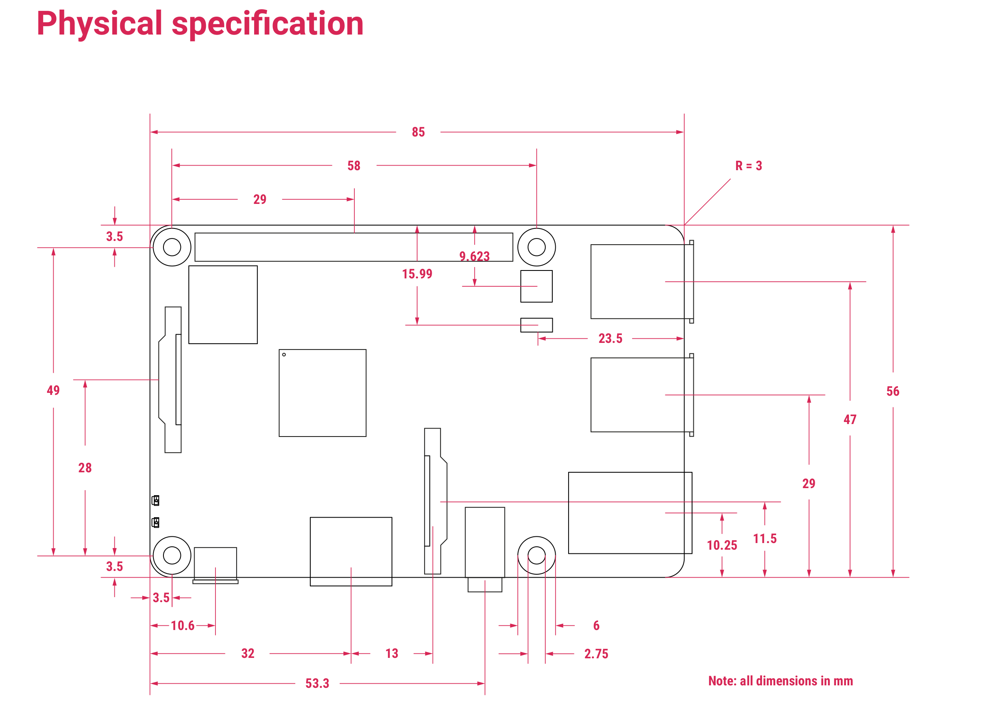

#PROPERTY: header-args+ :var  JRR5_IP_="192.168.1.241"
#PROPERTY: header-args+ :var  JRR5_IP="jrr5.local"
#+PROPERTY: header-args+ :var  JRR5_IP="jrr5x.local"
#+PROPERTY: header-args+ :var  CONDA_ENV="pyyton3"
#+PROPERTY: header-args+ :var  FIRMWARE_RELEASE="3"

Somewhat dirtyish trick to be able to tangle files pointed by a global property.

#+BEGIN_SRC elisp :eval no-export :exports none
(defun jj-org-tmp-get-global-prop ( prop )
  "Read global org property 'prop'"
(let ((keyVal 
       (seq-find (lambda (x) (string= (car(split-string  x "=")) prop))
		 (org-babel--get-vars (org-babel-parse-header-arguments (org-entry-get-with-inheritance "header-args")))
		)))	
  (if keyVal (string-trim  (nth 1 (split-string keyVal "=" )) "\""  "\""  )))
)
#+END_SRC

#+RESULTS:
: jj-org-tmp-get-global-prop

* Design
** PCB design

[[file:jrr-pcb.org]]

** 3.5inch TFT display

In jrr.org

#+begin_example
ssh pi@$IP  "cd LCD-show; sudo ./MHS35-show"

#+end_example

Search for MHS35-show finds

http://www.lcdwiki.com/MHS-3.5inch_RPi_Display#Product_Features

with specs

| Name                                  | Description                          |
|---------------------------------------+--------------------------------------|
| SKU                                   | MHS3528                              |
| Screen Size                           | 3.5inch                              |
| LCD Type                              | TFT                                  |
| Module Interface                      | SPI (upports up to 125MHz SPI input) |
| Resolution                            | 320*480 (Pixel)                      |
| Touch Screen Controller               | XPT2046                              |
| LCD Driver IC                         | ILI9486                              |
| Backlight                             | LED                                  |
| power consumption                     | 0.16A*5V                             |
| Working temperature）                 | -20~60                               |
| Active Area                           | 48.96x73.44(mm)                      |
| Module PCB Size                       | 85.42*55.60 (mm)                     |
| Package Size                          | 136x98x41 (mm)                       |
| Product Weight(Package containing)(g) | 92 (g)                               |


Especially LCD Driver IC ~ILI9486~

Locate ILI9486 python driver https://github.com/SirLefti/Python_ILI9486

** Raspberry PI pinout

https://pinout.xyz/

** Physical design

https://datasheets.raspberrypi.com/rpi3/raspberry-pi-3-b-plus-product-brief.pdf



** Current

Mitattu USB virrankultus jrr1
- n. 0.37A max volyymi
- n. 0.57A max virta

--> 1.1A sulake ok

--> USB-C current resistores
   - https://community.infineon.com/t5/Knowledge-Base-Articles/USB-Type-C-connector-Rp-Rd-and-Ra-termination-resistors/ta-p/253544

     DFP Advertisement 	     Resistor Pull-up to
     4.75 V – 5.5 V 	     Resistor Pull-up to
     3.3 ± 5%
     Default USB power 	     56 kΩ ± 20% 	     36 kΩ ± 20%
     1.5 A at 5 V 	     22 kΩ ± 5% 	     12 kΩ ± 5%
     3.0 A at 5 V 	     10 kΩ ± 5% 	     4.7 kΩ ± 5%

| DFP Advertisement | Pull-up to 4.75 V – 5.5 V | Pull-up to 3.3 ± 5% |
|-------------------+---------------------------+---------------------|
| Default USB power | 56 kΩ ± 20%               | 36 kΩ ± 20%         |
| 1.5 A at 5 V      | 22 kΩ ± 5%                | 12 kΩ ± 5%          |
| 3.0 A at 5 V      | 10 kΩ ± 5%                | 4.7 kΩ ± 5%         |

--> 22kOhm     

* Config ssh access

** Create entry into ~.ssh/config~
:PROPERTIES:
:header-args+: :var  FILE="/home/jj/.ssh/config"
:END:

#+BEGIN_SRC bash :eval no-export :results output :dir .
echo "Running in $(pwd) for user '$(whoami)' on host '$(hostname)' on $(date)"
echo "FILE=$FILE"
echo JRR5_IP=${JRR5_IP}
#+END_SRC

#+RESULTS:
: Running in /home/jj/work/jrr for user 'jj' on host 'Leo' on ke 15.7.2026 15.39.07 +0300
: FILE=/home/jj/.ssh/config
: JRR5_IP=jrr5x.local

#+BEGIN_SRC bash :eval no-export :results output :dir .
echo "Running in $(pwd) for user '$(whoami)' on host '$(hostname)' on $(date)"
echo "FILE=$FILE"
cat $FILE
#+END_SRC

Expect raspberry pi to be online
#+call: ping-ip[:dir "."]()

#+RESULTS:
: User 'jj pinging JRR5_IP=jrr5x.local from Leo on ke 15.7.2026 15.39.31 +0300
: PING jrr5x.local (192.168.1.203) 56(84) bytes of data.
: 64 bytes from jrr5x.local (192.168.1.203): icmp_seq=1 ttl=64 time=1.92 ms
: 64 bytes from jrr5x.local (192.168.1.203): icmp_seq=2 ttl=64 time=5.18 ms
: 64 bytes from jrr5x.local (192.168.1.203): icmp_seq=3 ttl=64 time=5.69 ms
: 
: --- jrr5x.local ping statistics ---
: 3 packets transmitted, 3 received, 0% packet loss, time 2003ms
: rtt min/avg/max/mdev = 1.924/4.264/5.693/1.668 ms


#+BEGIN_SRC bash :eval no-export :results output :dir .
FILE=~/.ssh/config
START="added by raspberry.org in jrr-pi  - start"
END="added by raspberry.org in jrr-pi - end"

sed -i -e "/$START/,/$END/d" $FILE

cat <<HERE >> $FILE
# $START
host jrr5
     user pi
     IdentityFile ~/.ssh/id_ed25519
     hostname ${JRR5_IP}
# $END
HERE
#+END_SRC

#+RESULTS:

* Create SD -card image with 3-partitions
:PROPERTIES:
:header-args+: :var  SD_DEV="/dev/sda"
:END:


** Flash rasbian OS using Raspberry Pi Imager (v2.0.4)

- Selections:
  - [ ] Device: RPi 3B+
  - [ ] OS RPi Other, PI OS-light (64 bi)
    - Released 2026-04-21
    - A port of Debian Trixie with Raspberry Desktop
  - [ ] User name: pi
  - [ ] Wifi
  - [ ] Disblae Raspberry Pi Connect
  - [ ] Finnish keyboard
  - [ ] SSH identity id_ed25519.pub
  - [ ] hostname ~jrr5x~ (expect to change jrr5x1, jrr5x2, ...)

** Boot with new SD card - wait for ping

#+call: ping-ip[:dir .]()

#+RESULTS:
: User 'jj pinging JRR5_IP=jrr5x.local from Leo on to 16.7.2026 12.32.57 +0300
: PING jrr5x.local (192.168.1.203) 56(84) bytes of data.
: 64 bytes from jrr5x.local (192.168.1.203): icmp_seq=1 ttl=64 time=105 ms
: 64 bytes from jrr5x.local (192.168.1.203): icmp_seq=2 ttl=64 time=5.91 ms
: 64 bytes from jrr5x.local (192.168.1.203): icmp_seq=3 ttl=64 time=5.97 ms
: 
: --- jrr5x.local ping statistics ---
: 3 packets transmitted, 3 received, 0% packet loss, time 2003ms
: rtt min/avg/max/mdev = 5.907/39.015/105.167/46.776 ms


: Ping JRR5_IP=jrr5.local on ti 19.5.2026 10.24.41 +0300
: PING jrr5.local (192.168.1.203) 56(84) bytes of data.
: 64 bytes from jrr5.local (192.168.1.203): icmp_seq=1 ttl=64 time=5.66 ms
: 64 bytes from jrr5.local (192.168.1.203): icmp_seq=2 ttl=64 time=5.60 ms
: 64 bytes from jrr5.local (192.168.1.203): icmp_seq=3 ttl=64 time=2.46 ms
: 
: --- jrr5.local ping statistics ---
: 3 packets transmitted, 3 received, 0% packet loss, time 2002ms
: rtt min/avg/max/mdev = 2.464/4.573/5.657/1.491 ms

Expect ~/ssh:jrr5:~ to log in as pi
#+call: greet-tramp[:dir /ssh:jrr5:]()

#+RESULTS:
: User 'pi' from host 'jrr5x' greeting on Thu Jul 16 12:33:52 EEST 2026  (using eshell tramp)


#+RESULTS:
: Greet Tue May 19 10:25:07 EEST 2026 from host 'jrr5' (using eshell tramp)

** Check partions on RPI 
:PROPERTIES:
:header-args+: :dir  /ssh:jrr5:
:header-args+: :var  RPI_DISK="/dev/mmcblk0"
:END:

Ensure that running on RPI and RPI_DISK correctly set
#+BEGIN_SRC bash :eval no-export :results output
echo "Running in $(pwd) host '$(hostname)' on $(date)"
[[ -z "$RPI_DISK" ]] && echo "Missing parameter RPI_DISK" && exit 1
echo "RPI_DISK=$RPI_DISK"
#+END_SRC

#+RESULTS:
: Running in /home/pi host 'jrr5x' on Thu Jul 16 12:34:02 EEST 2026
: RPI_DISK=/dev/mmcblk0

#+BEGIN_SRC bash :eval no-export :results output :dir /ssh:jrr5:
  echo "Running in $(pwd) host '$(hostname)' on $(date)"
  sudo lsblk
#+END_SRC

#+RESULTS:
: Running in /home/pi host 'jrr5x' on Thu Jul 16 12:34:08 EEST 2026
: NAME        MAJ:MIN RM  SIZE RO TYPE MOUNTPOINTS
: loop0         7:0    0  905M  0 loop 
: mmcblk0     179:0    0 28.9G  0 disk 
: ├─mmcblk0p1 179:1    0  512M  0 part /boot/firmware
: └─mmcblk0p2 179:2    0 28.4G  0 part /
: zram0       254:0    0  905M  0 disk [SWAP]


: Running in /home/pi host 'jrr5' on Tue May 19 10:25:39 EEST 2026
: NAME        MAJ:MIN RM  SIZE RO TYPE MOUNTPOINTS
: loop0         7:0    0  905M  0 loop 
: mmcblk0     179:0    0 28.9G  0 disk 
: ├─mmcblk0p1 179:1    0  512M  0 part /boot/firmware
: └─mmcblk0p2 179:2    0 28.4G  0 part /
: zram0       254:0    0  905M  0 disk [SWAP]

#+BEGIN_SRC bash :eval no-export :results output
echo "Running in $(pwd) host '$(hostname)' on $(date)"
sudo fdisk -l $RPI_DISK
#+END_SRC

#+RESULTS:
#+begin_example
Running in /home/pi host 'jrr5x' on Thu Jul 16 12:34:14 EEST 2026
Disk /dev/mmcblk0: 28.88 GiB, 31008489472 bytes, 60563456 sectors
Units: sectors of 1 * 512 = 512 bytes
Sector size (logical/physical): 512 bytes / 512 bytes
I/O size (minimum/optimal): 512 bytes / 512 bytes
Disklabel type: dos
Disk identifier: 0x08059157

Device         Boot   Start      End  Sectors  Size Id Type
/dev/mmcblk0p1        16384  1064959  1048576  512M  c W95 FAT32 (LBA)
/dev/mmcblk0p2      1064960 60563455 59498496 28.4G 83 Linux
#+end_example


#+BEGIN_SRC sh :eval no-export :results output :noweb yes
  echo "Running in $(pwd) for user '$(whoami)' on host '$(hostname)' on $(date)"
  echo RPI_DISK=$RPI_DISK
  sudo fdisk $RPI_DISK <<EOF
  p
  EOF
#+END_SRC

#+RESULTS:
#+begin_example
Running in /home/pi for user 'pi' on host 'jrr5x' on Thu Jul 16 12:34:20 EEST 2026
RPI_DISK=/dev/mmcblk0

Welcome to fdisk (util-linux 2.41).
Changes will remain in memory only, until you decide to write them.
Be careful before using the write command.


Command (m for help): 
Disk /dev/mmcblk0: 28.88 GiB, 31008489472 bytes, 60563456 sectors
Units: sectors of 1 * 512 = 512 bytes
Sector size (logical/physical): 512 bytes / 512 bytes
I/O size (minimum/optimal): 512 bytes / 512 bytes
Disklabel type: dos
Disk identifier: 0x08059157

Device         Boot   Start      End  Sectors  Size Id Type
/dev/mmcblk0p1        16384  1064959  1048576  512M  c W95 FAT32 (LBA)
/dev/mmcblk0p2      1064960 60563455 59498496 28.4G 83 Linux

Command (m for help): 
#+end_example

** Mount to develoment host - resize partition 2 and create new 2GB partition 3 on SD_DEV

*** Using SD_DEV
Mount SD card on host as SD_DEV

#+BEGIN_SRC bash :eval no-export :results output
  echo "Running in $(pwd) host '$(hostname)' on $(date)"
  echo SD_DEV=$SD_DEV
#+END_SRC

#+RESULTS:
: Running in /home/jj/work/jrr host 'Leo' on to 16.7.2026 12.57.35 +0300
: SD_DEV=/dev/sda

*** Ensure that ~SD_DEV~ is pointing to SD card mounted over usb

#+BEGIN_SRC bash :eval no-export :results output
echo "Running in $(pwd) host '$(hostname)' on $(date)"
echo "SD_DEV=$SD_DEV"
#+END_SRC

#+RESULTS:
: Running in /home/jj/work/jrr host 'Leo' on to 16.7.2026 12.57.38 +0300
: SD_DEV=/dev/sda

Check:
- RM=1 → removable device
- TRAN=usb → often SD card readers appear as USB
- Size matches your SD card
  - sda    28,9G usb - OK
  - sda2  28.4G    1 OS system


#+call: lsblk-conf()

#+RESULTS:
: Running in /home/jj/work/jrr host 'Leo' on to 16.7.2026 12.57.44 +0300
: SD_DEV=/dev/sda
: NAME    SIZE TRAN RM MOUNTPOINT
: sda      30G usb   1 
: ├─sda1  512M       1 
: └─sda2  2,3G       1 


Expect something like this:

: Running in /home/jj/work/jrr host 'Leo' on to 16.7.2026 12.07.54 +0300
: SD_DEV=/dev/sda
: NAME    SIZE TRAN RM MOUNTPOINT
: sda    28,9G usb   1 
: ├─sda1  512M       1 /media/jj/bootfs
: └─sda2  2,3G       1 /media/jj/rootfs


*** Unmount partitions on SD_DEV

#+BEGIN_SRC bash :eval no-export :results output
echo "Running in $(pwd) host '$(hostname)' on $(date)"
mount | grep $SD_DEV
#+END_SRC

#+RESULTS:
: Running in /home/jj/work/jrr host 'Leo' on to 16.7.2026 12.57.49 +0300

#+name: umount-sd-dev
#+BEGIN_SRC bash :eval no-export :results output  :dir /sudo::
echo "Running in $(pwd) host '$(hostname)' on $(date)"
sudo umount ${SD_DEV}*
#+END_SRC

#+RESULTS: umount-sd-dev
: Running in /root host 'Leo' on Thu Jul 16 12:39:22 PM EEST 2026

#+RESULTS:
: Running in /root host 'Leo' on Tue May 19 10:27:24 AM EEST 2026

Show 

#+call: sd-partitions()

#+RESULTS:
#+begin_example
Running in /root host 'Leo' on Thu Jul 16 12:57:59 PM EEST 2026
SD_DEV=/dev/sda

Welcome to fdisk (util-linux 2.39.3).
Changes will remain in memory only, until you decide to write them.
Be careful before using the write command.


Command (m for help): Disk /dev/sda: 30.01 GiB, 32227983360 bytes, 62945280 sectors
Disk model: Storage Device  
Units: sectors of 1 * 512 = 512 bytes
Sector size (logical/physical): 512 bytes / 512 bytes
I/O size (minimum/optimal): 512 bytes / 512 bytes
Disklabel type: dos
Disk identifier: 0x041bba91

Device     Boot   Start     End Sectors  Size Id Type
/dev/sda1         16384 1064959 1048576  512M  c W95 FAT32 (LBA)
/dev/sda2       1064960 5816319 4751360  2.3G 83 Linux

Command (m for help): 
#+end_example

Example of expected output
#+begin_example
Running in /root host 'Leo' on Tue May 19 10:27:32 AM EEST 2026

Welcome to fdisk (util-linux 2.39.3).
Changes will remain in memory only, until you decide to write them.
Be careful before using the write command.


Command (m for help): Disk /dev/sda: 28.88 GiB, 31008489472 bytes, 60563456 sectors
Disk model: Storage Device  
Units: sectors of 1 * 512 = 512 bytes
Sector size (logical/physical): 512 bytes / 512 bytes
I/O size (minimum/optimal): 512 bytes / 512 bytes
Disklabel type: dos
Disk identifier: 0xf307c993

Device     Boot   Start      End  Sectors  Size Id Type
/dev/sda1         16384  1064959  1048576  512M  c W95 FAT32 (LBA)
/dev/sda2       1064960 60563455 59498496 28.4G 83 Linux

Command (m for help): 
#+end_example

*** Shrink PARTITION 2 on SD_DEV 
:PROPERTIES:
:header-args+: :var  PARTITION=2
:END:


#+call: parted-print()

#+RESULTS:
#+begin_example
Running in /root host 'Leo' on Thu Jul 16 12:58:25 PM EEST 2026
Model: Mass Storage Device (scsi)
Disk /dev/sda: 32.2GB
Sector size (logical/physical): 512B/512B
Partition Table: msdos
Disk Flags: 

Number  Start   End     Size    Type     File system  Flags
 1      8389kB  545MB   537MB   primary  fat32        lba
 2      545MB   2978MB  2433MB  primary  ext4

Model: Mass Storage Device (scsi)
Disk /dev/sda: 30.0GiB
Sector size (logical/physical): 512B/512B
Partition Table: msdos
Disk Flags: 

Number  Start    End      Size     Type     File system  Flags
 1      0.01GiB  0.51GiB  0.50GiB  primary  fat32        lba
 2      0.51GiB  2.77GiB  2.27GiB  primary  ext4

#+end_example


#+call: fs-check(PARTITION=2)
#+RESULTS:
: CHeck /dev/sda2 in /root host 'Leo' on Thu Jul 16 12:58:34 PM EEST 2026
: e2fsck 1.47.0 (5-Feb-2023)
: Pass 1: Checking inodes, blocks, and sizes
: Pass 2: Checking directory structure
: Pass 3: Checking directory connectivity
: Pass 4: Checking reference counts
: Pass 5: Checking group summary information
: rootfs: 73256/148656 files (0.2% non-contiguous), 513060/593920 blocks


Expected output 

: CHeck /dev/sda2 in /root host 'Leo' on Wed Jul 15 07:42:36 PM EEST 2026
: Pass 1: Checking inodes, blocks, and sizes
: Pass 2: Checking directory structure
: Pass 3: Checking directory connectivity
: Pass 4: Checking reference counts
: Pass 5: Checking group summary information
: rootfs: 73281/1776048 files (0.2% non-contiguous), 847924/7437312 blocks

Shrink ext4 filesystem FIRST to 22G
#+BEGIN_SRC bash :eval no-export :results output  :dir /sudo::
  echo "Running in $(pwd) host '$(hostname)' on $(date)"
  sudo resize2fs ${SD_DEV}${PARTITION} 22G
#+END_SRC

#+RESULTS:
: Running in /root host 'Leo' on Thu Jul 16 12:58:45 PM EEST 2026

#+BEGIN_SRC bash :eval no-export :results output
  echo "Running in $(pwd) host '$(hostname)' on $(date)"
  echo Partition ${SD_DEV}${PARTITION}
  df -h ${SD_DEV}${PARTITION}
#+END_SRC

#+RESULTS:
: Running in /home/jj/work/jrr host 'Leo' on to 16.7.2026 12.58.56 +0300
: Partition /dev/sda2
: Filesystem      Size  Used Avail Use% Mounted on
: udev             16G     0   16G   0% /dev


Expected output
: Running in /home/jj/work/jrr host 'Leo' on ti 19.5.2026 10.28.03 +0300
: Partition /dev/sda2
: Filesystem      Size  Used Avail Use% Mounted on
: udev             16G     0   16G   0% /dev

#+BEGIN_SRC octave :eval no-export :results output :session *Octave* :exports both
  pico = 10^-12;
  nano = 10^-9;
  micro = 10^-6;
  milli = 10^-3;
  kilo = 10^3;
  mega = 10^6;
  giga = 10^9;

5767168 * 4*1024
  #+END_SRC   


#+RESULTS:
: ans = 2.3622e+10

Check file system (after resize - expect pass)
#+call: fs-check(PARTITION=2)

#+RESULTS:
: CHeck /dev/sda2 in /root host 'Leo' on Thu Jul 16 12:59:08 PM EEST 2026
: e2fsck 1.47.0 (5-Feb-2023)
: Pass 1: Checking inodes, blocks, and sizes
: Pass 2: Checking directory structure
: Pass 3: Checking directory connectivity
: Pass 4: Checking reference counts
: Pass 5: Checking group summary information
: rootfs: 73256/148656 files (0.2% non-contiguous), 513060/593920 blocks


Before resize confirm:
- partition 2 currently extends beyond 25GiB
- partition 1 stays untouched
- there’s room afterward for partition 3

#+call: parted-print()  

#+RESULTS:
#+begin_example
Running in /root host 'Leo' on Thu Jul 16 12:59:26 PM EEST 2026
Model: Mass Storage Device (scsi)
Disk /dev/sda: 32.2GB
Sector size (logical/physical): 512B/512B
Partition Table: msdos
Disk Flags: 

Number  Start   End     Size    Type     File system  Flags
 1      8389kB  545MB   537MB   primary  fat32        lba
 2      545MB   2978MB  2433MB  primary  ext4

Model: Mass Storage Device (scsi)
Disk /dev/sda: 30.0GiB
Sector size (logical/physical): 512B/512B
Partition Table: msdos
Disk Flags: 

Number  Start    End      Size     Type     File system  Flags
 1      0.01GiB  0.51GiB  0.50GiB  primary  fat32        lba
 2      0.51GiB  2.77GiB  2.27GiB  primary  ext4

#+end_example


Expected output
#+begin_example
Running in /root host 'Leo' on Tue May 19 10:28:20 AM EEST 2026
Model: Mass Storage Device (scsi)
Disk /dev/sda: 31.0GB
Sector size (logical/physical): 512B/512B
Partition Table: msdos
Disk Flags: 

Number  Start   End     Size    Type     File system  Flags
 1      8389kB  545MB   537MB   primary  fat32        lba
 2      545MB   31.0GB  30.5GB  primary  ext4

Model: Mass Storage Device (scsi)
Disk /dev/sda: 28.9GiB
Sector size (logical/physical): 512B/512B
Partition Table: msdos
Disk Flags: 

Number  Start    End      Size     Type     File system  Flags
 1      0.01GiB  0.51GiB  0.50GiB  primary  fat32        lba
 2      0.51GiB  28.9GiB  28.4GiB  primary  ext4

#+end_example


Run on command line (notice 23GiB for 22G filesystem)
#+BEGIN_SRC bash :eval no-export :results output  :dir /sudo::
echo "Running in $(pwd) host '$(hostname)' on $(date)"
echo sudo parted  $SD_DEV resizepart 2 23GiB
#+END_SRC

#+RESULTS:
: Running in /root host 'Leo' on Thu Jul 16 12:59:35 PM EEST 2026
: sudo parted /dev/sda resizepart 2 23GiB

Check 
#+call: parted-print()  

#+RESULTS:
#+begin_example
Running in /root host 'Leo' on Thu Jul 16 01:00:01 PM EEST 2026
Model: Mass Storage Device (scsi)
Disk /dev/sda: 32.2GB
Sector size (logical/physical): 512B/512B
Partition Table: msdos
Disk Flags: 

Number  Start   End     Size    Type     File system  Flags
 1      8389kB  545MB   537MB   primary  fat32        lba
 2      545MB   24.7GB  24.2GB  primary  ext4

Model: Mass Storage Device (scsi)
Disk /dev/sda: 30.0GiB
Sector size (logical/physical): 512B/512B
Partition Table: msdos
Disk Flags: 

Number  Start    End      Size     Type     File system  Flags
 1      0.01GiB  0.51GiB  0.50GiB  primary  fat32        lba
 2      0.51GiB  23.0GiB  22.5GiB  primary  ext4

#+end_example


Expected output

#+begin_example
Running in /root host 'Leo' on Tue May 19 10:29:16 AM EEST 2026
Model: Mass Storage Device (scsi)
Disk /dev/sda: 31.0GB
Sector size (logical/physical): 512B/512B
Partition Table: msdos
Disk Flags: 

Number  Start   End     Size    Type     File system  Flags
 1      8389kB  545MB   537MB   primary  fat32        lba
 2      545MB   24.7GB  24.2GB  primary  ext4

Model: Mass Storage Device (scsi)
Disk /dev/sda: 28.9GiB
Sector size (logical/physical): 512B/512B
Partition Table: msdos
Disk Flags: 

Number  Start    End      Size     Type     File system  Flags
 1      0.01GiB  0.51GiB  0.50GiB  primary  fat32        lba
 2      0.51GiB  23.0GiB  22.5GiB  primary  ext4

#+end_example

Expect fs-check pass
#+call: fs-check()

#+RESULTS:
: CHeck /dev/sda2 in /root host 'Leo' on Thu Jul 16 01:00:21 PM EEST 2026
: e2fsck 1.47.0 (5-Feb-2023)
: Pass 1: Checking inodes, blocks, and sizes
: Pass 2: Checking directory structure
: Pass 3: Checking directory connectivity
: Pass 4: Checking reference counts
: Pass 5: Checking group summary information
: rootfs: 73256/148656 files (0.2% non-contiguous), 513060/593920 blocks


: CHeck /dev/sda2 in /root host 'Leo' on Tue May 19 10:29:30 AM EEST 2026
: Pass 1: Checking inodes, blocks, and sizes
: Pass 2: Checking directory structure
: Pass 3: Checking directory connectivity
: Pass 4: Checking reference counts
: Pass 5: Checking group summary information
: rootfs: 73201/1441792 files (0.2% non-contiguous), 877124/5767168 blocks


#+BEGIN_SRC bash :eval no-export :results output
echo "Running in $(pwd) host '$(hostname)' on $(date)"
lsblk $SD_DEV
#+END_SRC

#+RESULTS:
: Running in /home/jj/work/jrr host 'Leo' on to 16.7.2026 13.00.50 +0300
: NAME   MAJ:MIN RM  SIZE RO TYPE MOUNTPOINTS
: sda      8:0    1   30G  0 disk 
: ├─sda1   8:1    1  512M  0 part 
: └─sda2   8:2    1 22,5G  0 part 

Expected output

: Running in /home/jj/work/jrr host 'Leo' on ti 19.5.2026 10.29.38 +0300
: NAME   MAJ:MIN RM  SIZE RO TYPE MOUNTPOINTS
: sda      8:0    1 28,9G  0 disk 
: ├─sda1   8:1    1  512M  0 part 
: └─sda2   8:2    1 22,5G  0 part 

*** Add partition 3 of size 2G and label it ~home~
:PROPERTIES:
:header-args+: :var  PARTITION=3
:END:

#+BEGIN_SRC bash :eval no-export :results output
  echo "Running in $(pwd) host '$(hostname)' on $(date)"
  echo "SD_DEV=$SD_DEV"
  echo "PARTITION=$PARTITION"
#+END_SRC

#+RESULTS:
: Running in /home/jj/work/jrr host 'Leo' on to 16.7.2026 13.00.56 +0300
: SD_DEV=/dev/sda
: PARTITION=3

#+BEGIN_SRC bash :eval no-export :results output  :dir /sudo::
echo "Running in $(pwd) host '$(hostname)' on $(date)"
sudo parted $SD_DEV unit GiB print free
#+END_SRC

#+RESULTS:
#+begin_example
Running in /root host 'Leo' on Thu Jul 16 01:01:11 PM EEST 2026
Model: Mass Storage Device (scsi)
Disk /dev/sda: 30.0GiB
Sector size (logical/physical): 512B/512B
Partition Table: msdos
Disk Flags: 

Number  Start    End      Size     Type     File system  Flags
        0.00GiB  0.01GiB  0.01GiB           Free Space
 1      0.01GiB  0.51GiB  0.50GiB  primary  fat32        lba
 2      0.51GiB  23.0GiB  22.5GiB  primary  ext4
        23.0GiB  30.0GiB  7.01GiB           Free Space

#+end_example


Expected output

#+begin_example
Running in /root host 'Leo' on Tue May 19 10:29:57 AM EEST 2026
Model: Mass Storage Device (scsi)
Disk /dev/sda: 28.9GiB
Sector size (logical/physical): 512B/512B
Partition Table: msdos
Disk Flags: 

Number  Start    End      Size     Type     File system  Flags
        0.00GiB  0.01GiB  0.01GiB           Free Space
 1      0.01GiB  0.51GiB  0.50GiB  primary  fat32        lba
 2      0.51GiB  23.0GiB  22.5GiB  primary  ext4
        23.0GiB  28.9GiB  5.88GiB           Free Space

#+end_example

Run on terminal *check start address for free space*
#+BEGIN_SRC bash :eval no-export :results output
echo "Running in $(pwd) host '$(hostname)' on $(date)"
echo sudo parted -s $SD_DEV  mkpart primary ext4 23.0GiB 25.5GiB
#+END_SRC

#+RESULTS:
: Running in /home/jj/work/jrr host 'Leo' on to 16.7.2026 13.01.27 +0300
: sudo parted -s /dev/sda mkpart primary ext4 23.0GiB 25.5GiB


Check change (expect three partitions)
#+call: parted-print()

#+RESULTS:
#+begin_example
Running in /root host 'Leo' on Thu Jul 16 01:02:12 PM EEST 2026
Model: Mass Storage Device (scsi)
Disk /dev/sda: 32.2GB
Sector size (logical/physical): 512B/512B
Partition Table: msdos
Disk Flags: 

Number  Start   End     Size    Type     File system  Flags
 1      8389kB  545MB   537MB   primary  fat32        lba
 2      545MB   24.7GB  24.2GB  primary  ext4
 3      24.7GB  26.8GB  2147MB  primary

Model: Mass Storage Device (scsi)
Disk /dev/sda: 30.0GiB
Sector size (logical/physical): 512B/512B
Partition Table: msdos
Disk Flags: 

Number  Start    End      Size     Type     File system  Flags
 1      0.01GiB  0.51GiB  0.50GiB  primary  fat32        lba
 2      0.51GiB  23.0GiB  22.5GiB  primary  ext4
 3      23.0GiB  25.0GiB  2.00GiB  primary

#+end_example

Expected output
#+begin_example
Running in /root host 'Leo' on Tue May 19 10:30:22 AM EEST 2026
Model: Mass Storage Device (scsi)
Disk /dev/sda: 31.0GB
Sector size (logical/physical): 512B/512B
Partition Table: msdos
Disk Flags: 

Number  Start   End     Size    Type     File system  Flags
 1      8389kB  545MB   537MB   primary  fat32        lba
 2      545MB   24.7GB  24.2GB  primary  ext4
 3      24.7GB  26.8GB  2147MB  primary

Model: Mass Storage Device (scsi)
Disk /dev/sda: 28.9GiB
Sector size (logical/physical): 512B/512B
Partition Table: msdos
Disk Flags: 

Number  Start    End      Size     Type     File system  Flags
 1      0.01GiB  0.51GiB  0.50GiB  primary  fat32        lba
 2      0.51GiB  23.0GiB  22.5GiB  primary  ext4
 3      23.0GiB  25.0GiB  2.00GiB  primary

#+end_example

Format filesystem on PARTITION
#+BEGIN_SRC bash :eval no-export :results output  :dir /sudo::
echo "Running in $(pwd) host '$(hostname)' on $(date)"
sudo mkfs.ext4 ${SD_DEV}${PARTITION}
#+END_SRC

#+RESULTS:
#+begin_example
Running in /root host 'Leo' on Thu Jul 16 01:02:40 PM EEST 2026
Creating filesystem with 524288 4k blocks and 131072 inodes
Filesystem UUID: 74fdccdf-2264-4627-8bf0-18e41384ce01
Superblock backups stored on blocks: 
	32768, 98304, 163840, 229376, 294912

Allocating group tables:  0/16     done                            
Writing inode tables:  0/16     done                            
Creating journal (16384 blocks): done
Writing superblocks and filesystem accounting information:  0/16     done

#+end_example


Expected output
#+begin_example
Running in /root host 'Leo' on Tue May 19 10:30:30 AM EEST 2026
Creating filesystem with 524288 4k blocks and 131072 inodes
Filesystem UUID: fa610b2a-3c01-408b-acf1-093e30072a64
Superblock backups stored on blocks: 
	32768, 98304, 163840, 229376, 294912

Allocating group tables:  0/16     done                            
Writing inode tables:  0/16     done                            
Creating journal (16384 blocks): done
Writing superblocks and filesystem accounting information:  0/16     done

#+end_example

#+BEGIN_SRC bash :eval no-export :results output
echo "Running in $(pwd) host '$(hostname)' on $(date)"
lsblk $SD_DEV
#+END_SRC

#+RESULTS:
: Running in /home/jj/work/jrr host 'Leo' on to 16.7.2026 13.03.15 +0300
: NAME   MAJ:MIN RM  SIZE RO TYPE MOUNTPOINTS
: sda      8:0    1   30G  0 disk 
: ├─sda1   8:1    1  512M  0 part 
: ├─sda2   8:2    1 22,5G  0 part 
: └─sda3   8:3    1    2G  0 part 


Expected output
: Running in /home/jj/work/jrr host 'Leo' on ti 19.5.2026 10.30.38 +0300
: NAME   MAJ:MIN RM  SIZE RO TYPE MOUNTPOINTS
: sda      8:0    1 28,9G  0 disk 
: ├─sda1   8:1    1  512M  0 part 
: ├─sda2   8:2    1 22,5G  0 part 
: └─sda3   8:3    1    2G  0 part 

Label PARTITION 3 as ~home2~
#+BEGIN_SRC bash :eval no-export :results output  :dir /sudo:: :var PARTITION=3
  echo "Running in $(pwd) host '$(hostname)' on $(date)"
  echo "SD_DEV=$SD_DEV"
  echo PARTITION=$PARTITION
  echo ${SD_DEV}${PARTITION}
  sudo e2label ${SD_DEV}${PARTITION} home2
#+END_SRC

#+RESULTS:
: Running in /root host 'Leo' on Thu Jul 16 01:03:24 PM EEST 2026
: SD_DEV=/dev/sda
: PARTITION=3
: /dev/sda3

Shouw mounts
#+BEGIN_SRC bash :eval no-export :results output
echo "Running in $(pwd) for user '$(whoami)' on host '$(hostname)' on $(date)"
echo "mount | grep $SD_DEV"
#+END_SRC

#+RESULTS:
: Running in /home/jj/work/jrr for user 'jj' on host 'Leo' on to 16.7.2026 13.03.31 +0300
: mount | grep /dev/sda


#+call: umount-sd-dev()

#+RESULTS:
: Running in /root host 'Leo' on Thu Jul 16 01:03:40 PM EEST 2026

* OS install & config
:PROPERTIES:
:header-args+: :dir  /ssh:jrr5:
:END:

** Expect JRR_IP to respond to ping

#+call: ping-ip[:dir .]()

#+RESULTS:
: User 'jj pinging JRR5_IP=jrr5x.local from Leo on to 16.7.2026 13.08.47 +0300
: PING jrr5x.local (192.168.1.203) 56(84) bytes of data.
: 64 bytes from jrr5x.local (192.168.1.203): icmp_seq=1 ttl=64 time=32.3 ms
: 64 bytes from jrr5x.local (192.168.1.203): icmp_seq=2 ttl=64 time=5.35 ms
: 64 bytes from jrr5x.local (192.168.1.203): icmp_seq=3 ttl=64 time=5.81 ms
: 
: --- jrr5x.local ping statistics ---
: 3 packets transmitted, 3 received, 0% packet loss, time 2003ms
: rtt min/avg/max/mdev = 5.345/14.488/32.312/12.604 ms

#+call: greet-tramp()

#+RESULTS:
: User 'pi' from host 'jrr5x' greeting on Thu Jul 16 13:09:07 EEST 2026  (using eshell tramp)


** Update && upgrade

#+call: disk-space()

#+RESULTS:
#+begin_example
Installation target host jrr5x on Thu Jul 16 13:09:13 EEST 2026 for user pi
Free disk space
Filesystem      Size  Used Avail Use% Mounted on
udev            332M     0  332M   0% /dev
tmpfs           190M  4.0M  186M   3% /run
/dev/mmcblk0p2   24G  3.0G   20G  13% /
tmpfs           475M     0  475M   0% /dev/shm
tmpfs           5.3M   17k  5.3M   1% /run/lock
tmpfs           1.1M     0  1.1M   0% /run/credentials/systemd-journald.service
tmpfs           475M  4.1k  475M   1% /tmp
/dev/mmcblk0p1  529M   79M  451M  15% /boot/firmware
tmpfs           1.1M     0  1.1M   0% /run/credentials/getty@tty1.service
tmpfs           1.1M     0  1.1M   0% /run/credentials/serial-getty@ttyS0.service
tmpfs            95M  8.2k   95M   1% /run/user/1000
#+end_example


#+call: apt-update()

#+RESULTS:
: Running in /home/pi host 'jrr5x' on Thu Jul 16 13:09:18 EEST 2026
: 
0% [Working]
            
Hit:1 http://deb.debian.org/debian trixie InRelease
: 
0% [Connecting to archive.raspberrypi.com]
                                          
Hit:2 http://deb.debian.org/debian trixie-updates InRelease
: 
                                          
Hit:3 http://deb.debian.org/debian-security trixie-security InRelease
: 
0% [Connecting to archive.raspberrypi.com]
0% [Connecting to archive.raspberrypi.com]
                                          
0% [Waiting for headers]
                        
Hit:4 http://archive.raspberrypi.com/debian trixie InRelease
: 
                        
0% [Working]
0% [Working]
20% [Working]
             

Reading package lists... 0%

Reading package lists... 0%

Reading package lists... 0%

Reading package lists... 4%

Reading package lists... 9%

Reading package lists... 14%

Reading package lists... 22%

Reading package lists... 31%

Reading package lists... 36%

Reading package lists... 36%

Reading package lists... 41%

Reading package lists... 55%

Reading package lists... 66%

Reading package lists... 71%

Reading package lists... 71%

Reading package lists... 88%

Reading package lists... 93%

Reading package lists... 93%

Reading package lists... 94%

Reading package lists... 94%

Reading package lists... 94%

Reading package lists... 94%

Reading package lists... 94%

Reading package lists... 94%

Reading package lists... 94%

Reading package lists... 94%

Reading package lists... 94%

Reading package lists... 94%

Reading package lists... 94%

Reading package lists... 94%

Reading package lists... 94%

Reading package lists... 94%

Reading package lists... 95%

Reading package lists... 95%

Reading package lists... 95%

Reading package lists... 95%

Reading package lists... 95%

Reading package lists... 95%

Reading package lists... 95%

Reading package lists... 95%

Reading package lists... 95%

Reading package lists... 95%

Reading package lists... 96%

Reading package lists... 96%

Reading package lists... 96%

Reading package lists... 96%

Reading package lists... 97%

Reading package lists... 97%

Reading package lists... 97%

Reading package lists... 97%

Reading package lists... 98%

Reading package lists... 98%

Reading package lists... 99%

Reading package lists... 99%

Reading package lists... Done


#+call: apt-list-upgradeable()


#+call: apt-upgrade()

#+RESULTS:
#+begin_example
Running in /home/pi host 'jrr5x' on Thu Jul 16 13:10:28 EEST 2026

Reading package lists... 0%

Reading package lists... 100%

Reading package lists... Done

Building dependency tree... 0%

Building dependency tree... 0%

Building dependency tree... 50%

Building dependency tree... 50%

Building dependency tree... 69%

Building dependency tree... Done

Reading state information... 0% 

Reading state information... 0%

Reading state information... Done

Calculating upgrade... 0%

Calculating upgrade... 50%

Calculating upgrade... Done
The following packages will be upgraded:
  base-files curl dhcpcd-base dirmngr firmware-atheros firmware-brcm80211
  firmware-libertas firmware-mediatek firmware-realtek gnupg-utils gpg
  gpg-agent gpg-wks-client gpgconf gpgsm gpgv libcurl3t64-gnutls libcurl4t64
  libdtovl0 libgpiolib0 liblzma5 libnss3 libntfs-3g89t64 libpisp-common
  libpisp1 libpython3.13 libpython3.13-minimal libpython3.13-stdlib
  librpieepromab0 librpifwcrypto0 libssh2-1t64 libtalloc2 libtasn1-6
  libwbclient0 libxml2 ntfs-3g python3-idna python3-urllib3 python3.13
  python3.13-minimal python3.13-venv raspi-utils raspi-utils-core
  raspi-utils-dt raspi-utils-eeprom raspi-utils-otp raspinfo rpi-connect-lite
  rpi-eeprom rpi-loop-utils rpi-swap rpieepromab rpifwcrypto rsync
  wireless-regdb xz-utils
56 upgraded, 0 newly installed, 0 to remove and 0 not upgraded.
Need to get 104 MB of archives.
After this operation, 53.4 MB of additional disk space will be used.

0% [Working]
            
Get:1 http://deb.debian.org/debian trixie/main arm64 base-files arm64 13.8+deb13u6 [73.3 kB]

0% [1 base-files 677 B/73.3 kB 1%] [Connecting to archive.raspberrypi.com (176.
                                                                               
0% [Connecting to archive.raspberrypi.com (176.126.240.86)]
                                                           
Get:2 http://deb.debian.org/debian trixie/main arm64 python3.13-venv arm64 3.13.5-2+deb13u3 [5480 B]

0% [2 python3.13-venv 679 B/5480 B 12%] [Waiting for headers]
                                                             
1% [Waiting for headers]
                        
Get:3 http://deb.debian.org/debian trixie/main arm64 libpython3.13 arm64 3.13.5-2+deb13u3 [1978 kB]

1% [3 libpython3.13 2119 B/1978 kB 0%] [Waiting for headers]
                                                            
Get:4 http://archive.raspberrypi.com/debian trixie/main arm64 firmware-atheros all 1:20260519-1~bpo13+1+rpt1 [38.0 MB]

1% [3 libpython3.13 184 kB/1978 kB 9%] [4 firmware-atheros 5486 B/38.0 MB 0%]
2% [3 libpython3.13 1474 kB/1978 kB 75%] [4 firmware-atheros 396 kB/38.0 MB 1%]
3% [3 libpython3.13 1703 kB/1978 kB 86%] [4 firmware-atheros 1784 kB/38.0 MB 5%
5% [3 libpython3.13 1868 kB/1978 kB 94%] [4 firmware-atheros 3233 kB/38.0 MB 9%
6% [3 libpython3.13 1976 kB/1978 kB 100%] [4 firmware-atheros 4641 kB/38.0 MB 1
                                                                               
7% [4 firmware-atheros 5097 kB/38.0 MB 13%]
                                           
Get:5 http://deb.debian.org/debian trixie/main arm64 python3.13 arm64 3.13.5-2+deb13u3 [757 kB]

7% [5 python3.13 22.0 kB/757 kB 3%] [4 firmware-atheros 5097 kB/38.0 MB 13%]
8% [5 python3.13 148 kB/757 kB 19%] [4 firmware-atheros 6590 kB/38.0 MB 17%]
9% [5 python3.13 335 kB/757 kB 44%] [4 firmware-atheros 7894 kB/38.0 MB 21%]
10% [5 python3.13 529 kB/757 kB 70%] [4 firmware-atheros 9433 kB/38.0 MB 25%]
12% [5 python3.13 708 kB/757 kB 93%] [4 firmware-atheros 10.9 MB/38.0 MB 29%]
                                                                             
12% [4 firmware-atheros 11.4 MB/38.0 MB 30%]
                                            
Get:6 http://deb.debian.org/debian trixie/main arm64 libpython3.13-stdlib arm64 3.13.5-2+deb13u3 [1893 kB]

12% [6 libpython3.13-stdlib 8962 B/1893 kB 0%] [4 firmware-atheros 11.4 MB/38.0
13% [6 libpython3.13-stdlib 189 kB/1893 kB 10%] [4 firmware-atheros 12.6 MB/38.
15% [6 libpython3.13-stdlib 370 kB/1893 kB 20%] [4 firmware-atheros 14.2 MB/38.
16% [6 libpython3.13-stdlib 592 kB/1893 kB 31%] [4 firmware-atheros 15.5 MB/38.
17% [6 libpython3.13-stdlib 796 kB/1893 kB 42%] [4 firmware-atheros 16.9 MB/38.
19% [6 libpython3.13-stdlib 1078 kB/1893 kB 57%] [4 firmware-atheros 18.3 MB/38
20% [6 libpython3.13-stdlib 1361 kB/1893 kB 72%] [4 firmware-atheros 19.7 MB/38
21% [6 libpython3.13-stdlib 1687 kB/1893 kB 89%] [4 firmware-atheros 20.8 MB/38
22% [4 firmware-atheros 22.0 MB/38.0 MB 58%]                      3170 kB/s 24s
                                                                               
Get:7 http://deb.debian.org/debian trixie/main arm64 python3.13-minimal arm64 3.13.5-2+deb13u3 [2003 kB]

22% [7 python3.13-minimal 12.3 kB/2003 kB 1%] [4 firmware-atheros 22.0 MB/38.0 
24% [7 python3.13-minimal 241 kB/2003 kB 12%] [4 firmware-atheros 23.4 MB/38.0 
25% [7 python3.13-minimal 423 kB/2003 kB 21%] [4 firmware-atheros 24.7 MB/38.0 
26% [7 python3.13-minimal 654 kB/2003 kB 33%] [4 firmware-atheros 26.1 MB/38.0 
27% [7 python3.13-minimal 1183 kB/2003 kB 59%] [4 firmware-atheros 27.0 MB/38.0
28% [7 python3.13-minimal 1695 kB/2003 kB 85%] [4 firmware-atheros 28.2 MB/38.0
30% [7 python3.13-minimal 2003 kB/2003 kB 100%] [4 firmware-atheros 29.4 MB/38.
30% [4 firmware-atheros 29.6 MB/38.0 MB 78%]                      3170 kB/s 21s
                                                                               
Get:8 http://deb.debian.org/debian trixie/main arm64 libpython3.13-minimal arm64 3.13.5-2+deb13u3 [856 kB]

30% [8 libpython3.13-minimal 35.3 kB/856 kB 4%] [4 firmware-atheros 29.6 MB/38.
31% [8 libpython3.13-minimal 532 kB/856 kB 62%] [4 firmware-atheros 30.7 MB/38.
33% [8 libpython3.13-minimal 856 kB/856 kB 100%] [4 firmware-atheros 32.1 MB/38
33% [4 firmware-atheros 32.2 MB/38.0 MB 85%]                      3194 kB/s 20s
                                                                               
Get:9 http://deb.debian.org/debian trixie/main arm64 liblzma5 arm64 5.8.1-1+deb13u1 [303 kB]

                                                                               
33% [9 liblzma5 17.3 kB/303 kB 6%] [4 firmware-atheros 32.2 MB/38.0 MB 85%]
34% [4 firmware-atheros 32.9 MB/38.0 MB 87%]                      3194 kB/s 19s
                                                                               
Get:10 http://deb.debian.org/debian trixie/main arm64 rsync arm64 3.4.1+ds1-5+deb13u4 [414 kB]

                                                                               
34% [10 rsync 0 B/414 kB 0%] [4 firmware-atheros 33.1 MB/38.0 MB 87%]
36% [10 rsync 334 kB/414 kB 80%] [4 firmware-atheros 34.4 MB/38.0 MB 91%]
                                                                         
36% [Waiting for headers] [4 firmware-atheros 34.7 MB/38.0 MB 92%]
                                                                  
Get:11 http://deb.debian.org/debian trixie/main arm64 dhcpcd-base arm64 1:10.1.0-11+deb13u3 [188 kB]

36% [11 dhcpcd-base 5776 B/188 kB 3%] [4 firmware-atheros 34.9 MB/38.0 MB 92%]
38% [4 firmware-atheros 35.7 MB/38.0 MB 94%]                      3194 kB/s 18s
                                                                               
Get:12 http://deb.debian.org/debian trixie/main arm64 xz-utils arm64 5.8.1-1+deb13u1 [658 kB]

                                                                               
38% [12 xz-utils 9338 B/658 kB 1%] [4 firmware-atheros 35.8 MB/38.0 MB 94%]
39% [12 xz-utils 330 kB/658 kB 50%] [4 firmware-atheros 37.0 MB/38.0 MB 98%]
                                                                            
40% [Waiting for headers] [4 firmware-atheros 38.0 MB/38.0 MB 100%]
                                                                   
Get:13 http://deb.debian.org/debian trixie/main arm64 libssh2-1t64 arm64 1.11.1-1+deb13u1 [236 kB]

40% [13 libssh2-1t64 676 B/236 kB 0%] [4 firmware-atheros 38.0 MB/38.0 MB 100%]
41% [4 firmware-atheros 38.0 MB/38.0 MB 100%]                     3194 kB/s 17s
                                                                               
Get:14 http://deb.debian.org/debian trixie/main arm64 curl arm64 8.14.1-2+deb13u4 [262 kB]

                                                                               
41% [14 curl 0 B/262 kB 0%] [4 firmware-atheros 38.0 MB/38.0 MB 100%]
41% [4 firmware-atheros 38.0 MB/38.0 MB 100%]                     3194 kB/s 17s
                                                                               
Get:15 http://deb.debian.org/debian trixie/main arm64 libcurl4t64 arm64 8.14.1-2+deb13u4 [360 kB]

                                                                               
41% [15 libcurl4t64 0 B/360 kB 0%] [4 firmware-atheros 38.0 MB/38.0 MB 100%]
42% [4 firmware-atheros 38.0 MB/38.0 MB 100%]                     3194 kB/s 17s
                                                                               
Get:16 http://deb.debian.org/debian trixie/main arm64 gpgsm arm64 2.4.7-21+deb13u1+b4 [252 kB]

                                                                               
42% [16 gpgsm 675 B/252 kB 0%] [4 firmware-atheros 38.0 MB/38.0 MB 100%]
42% [4 firmware-atheros 38.0 MB/38.0 MB 100%]                     3194 kB/s 17s
                                                                               
Get:17 http://deb.debian.org/debian trixie/main arm64 gnupg-utils arm64 2.4.7-21+deb13u1+b4 [181 kB]

42% [17 gnupg-utils 20.5 kB/181 kB 11%] [4 firmware-atheros 38.0 MB/38.0 MB 100
43% [4 firmware-atheros 38.0 MB/38.0 MB 100%]                     3194 kB/s 17s
                                                                               
Get:18 http://deb.debian.org/debian trixie/main arm64 gpg-wks-client arm64 2.4.7-21+deb13u1+b4 [102 kB]

43% [18 gpg-wks-client 1447 B/102 kB 1%] [4 firmware-atheros 38.0 MB/38.0 MB 10
43% [4 firmware-atheros 38.0 MB/38.0 MB 100%]                     3194 kB/s 17s
                                                                               
Get:19 http://deb.debian.org/debian trixie/main arm64 dirmngr arm64 2.4.7-21+deb13u1+b4 [359 kB]

                                                                               
43% [19 dirmngr 210 B/359 kB 0%] [4 firmware-atheros 38.0 MB/38.0 MB 100%]
44% [19 dirmngr 107 kB/359 kB 30%]                                3194 kB/s 17s
                                                                               
Get:20 http://archive.raspberrypi.com/debian trixie/main arm64 firmware-brcm80211 all 1:20260519-1~bpo13+1+rpt1 [5942 kB]

                                                                               
44% [19 dirmngr 324 kB/359 kB 90%] [20 firmware-brcm80211 4078 B/5942 kB 0%]
44% [20 firmware-brcm80211 34.5 kB/5942 kB 1%]                    3194 kB/s 17s
                                                                               
Get:21 http://deb.debian.org/debian trixie/main arm64 gpg arm64 2.4.7-21+deb13u1+b4 [579 kB]

                                                                               
44% [21 gpg 24.8 kB/579 kB 4%] [20 firmware-brcm80211 34.5 kB/5942 kB 1%]
46% [21 gpg 465 kB/579 kB 80%] [20 firmware-brcm80211 1220 kB/5942 kB 21%]
47% [20 firmware-brcm80211 1746 kB/5942 kB 29%]                   3194 kB/s 16s
                                                                               
Get:22 http://deb.debian.org/debian trixie/main arm64 gpgconf arm64 2.4.7-21+deb13u1+b4 [122 kB]

                                                                               
47% [22 gpgconf 1081 B/122 kB 1%] [20 firmware-brcm80211 1746 kB/5942 kB 29%]
                                                                             
47% [Waiting for headers] [20 firmware-brcm80211 2030 kB/5942 kB 34%]
                                                                     
Get:23 http://deb.debian.org/debian trixie/main arm64 gpg-agent arm64 2.4.7-21+deb13u1+b4 [249 kB]

47% [23 gpg-agent 3562 B/249 kB 1%] [20 firmware-brcm80211 2091 kB/5942 kB 35%]
48% [20 firmware-brcm80211 2902 kB/5942 kB 49%]                   3194 kB/s 16s
                                                                               
Get:24 http://deb.debian.org/debian trixie/main arm64 gpgv arm64 2.4.7-21+deb13u1+b4 [221 kB]

                                                                               
48% [24 gpgv 0 B/221 kB 0%] [20 firmware-brcm80211 2978 kB/5942 kB 50%]
50% [20 firmware-brcm80211 4280 kB/5942 kB 72%]                   3194 kB/s 15s
                                                                               
Get:25 http://deb.debian.org/debian trixie/main arm64 libcurl3t64-gnutls arm64 8.14.1-2+deb13u4 [354 kB]

50% [25 libcurl3t64-gnutls 1444 B/354 kB 0%] [20 firmware-brcm80211 4283 kB/594
51% [25 libcurl3t64-gnutls 204 kB/354 kB 57%] [20 firmware-brcm80211 5499 kB/59
52% [25 libcurl3t64-gnutls 280 kB/354 kB 79%]                     3194 kB/s 14s
                                                                               
Get:26 http://archive.raspberrypi.com/debian trixie/main arm64 firmware-libertas all 1:20260519-1~bpo13+1+rpt1 [3637 kB]

52% [25 libcurl3t64-gnutls 280 kB/354 kB 79%] [26 firmware-libertas 14.5 kB/363
53% [26 firmware-libertas 850 kB/3637 kB 23%]                     3194 kB/s 14s
                                                                               
Get:27 http://deb.debian.org/debian trixie/main arm64 libnss3 arm64 2:3.110-1+deb13u3 [1292 kB]

                                                                               
53% [27 libnss3 106 B/1292 kB 0%] [26 firmware-libertas 850 kB/3637 kB 23%]
54% [27 libnss3 195 kB/1292 kB 15%] [26 firmware-libertas 2178 kB/3637 kB 60%]
56% [27 libnss3 420 kB/1292 kB 33%] [Waiting for headers]         3197 kB/s 13s
                                                                               
Get:28 http://archive.raspberrypi.com/debian trixie/main arm64 firmware-mediatek all 1:20260519-1~bpo13+1+rpt1 [25.9 MB]

                                                                               
56% [27 libnss3 420 kB/1292 kB 33%] [28 firmware-mediatek 2724 B/25.9 MB 0%]
57% [27 libnss3 643 kB/1292 kB 50%] [28 firmware-mediatek 1278 kB/25.9 MB 5%]
57% [27 libnss3 656 kB/1292 kB 51%] [28 firmware-mediatek 1293 kB/25.9 MB 5%]
57% [27 libnss3 656 kB/1292 kB 51%] [28 firmware-mediatek 1293 kB/25.9 MB 5%]
57% [27 libnss3 656 kB/1292 kB 51%] [28 firmware-mediatek 1293 kB/25.9 MB 5%]
57% [27 libnss3 656 kB/1292 kB 51%] [28 firmware-mediatek 1293 kB/25.9 MB 5%]
57% [27 libnss3 656 kB/1292 kB 51%] [28 firmware-mediatek 1293 kB/25.9 MB 5%]
57% [27 libnss3 656 kB/1292 kB 51%] [28 firmware-mediatek 1293 kB/25.9 MB 5%]
57% [27 libnss3 656 kB/1292 kB 51%] [28 firmware-mediatek 1293 kB/25.9 MB 5%]
57% [27 libnss3 656 kB/1292 kB 51%] [28 firmware-mediatek 1293 kB/25.9 MB 5%]
57% [27 libnss3 656 kB/1292 kB 51%] [28 firmware-mediatek 1293 kB/25.9 MB 5%]
57% [27 libnss3 656 kB/1292 kB 51%] [28 firmware-mediatek 1293 kB/25.9 MB 5%]
60% [27 libnss3 1292 kB/1292 kB 100%] [28 firmware-mediatek 4964 kB/25.9 MB 19%
61% [28 firmware-mediatek 5375 kB/25.9 MB 21%]                     971 kB/s 38s
                                                                               
Get:29 http://deb.debian.org/debian-security trixie-security/main arm64 ntfs-3g arm64 1:2022.10.3-5+deb13u2 [377 kB]

                                                                               
61% [29 ntfs-3g 19.9 kB/377 kB 5%] [28 firmware-mediatek 5375 kB/25.9 MB 21%]
62% [28 firmware-mediatek 5659 kB/25.9 MB 22%]                     971 kB/s 37s
                                                                               
Get:30 http://deb.debian.org/debian-security trixie-security/main arm64 libntfs-3g89t64 arm64 1:2022.10.3-5+deb13u2 [152 kB]

62% [30 libntfs-3g89t64 35.1 kB/152 kB 23%] [28 firmware-mediatek 5659 kB/25.9 
62% [28 firmware-mediatek 5966 kB/25.9 MB 23%]                     971 kB/s 37s
                                                                               
Get:31 http://deb.debian.org/debian trixie/main arm64 libtalloc2 arm64 2:2.4.3+samba4.22.10+dfsg-0+deb13u1 [62.0 kB]

62% [31 libtalloc2 13.4 kB/62.0 kB 22%] [28 firmware-mediatek 5976 kB/25.9 MB 2
63% [28 firmware-mediatek 6122 kB/25.9 MB 24%]                     971 kB/s 37s
                                                                               
Get:32 http://deb.debian.org/debian trixie/main arm64 libtasn1-6 arm64 4.20.0-2+deb13u1 [47.3 kB]

63% [32 libtasn1-6 16.1 kB/47.3 kB 34%] [28 firmware-mediatek 6122 kB/25.9 MB 2
64% [28 firmware-mediatek 6306 kB/25.9 MB 24%]                     971 kB/s 36s
                                                                               
Get:33 http://deb.debian.org/debian trixie/main arm64 libwbclient0 arm64 2:4.22.10+dfsg-0+deb13u1 [70.8 kB]

64% [33 libwbclient0 33.6 kB/70.8 kB 47%] [28 firmware-mediatek 6306 kB/25.9 MB
64% [28 firmware-mediatek 6359 kB/25.9 MB 25%]                     971 kB/s 36s
                                                                               
Get:34 http://deb.debian.org/debian trixie/main arm64 libxml2 arm64 2.12.7+dfsg+really2.9.14-2.1+deb13u3 [631 kB]

                                                                               
64% [34 libxml2 27.6 kB/631 kB 4%] [28 firmware-mediatek 6359 kB/25.9 MB 25%]
65% [28 firmware-mediatek 6723 kB/25.9 MB 26%]                     971 kB/s 35s
                                                                               
Get:35 http://deb.debian.org/debian trixie/main arm64 python3-idna all 3.10-1+deb13u1 [43.0 kB]

65% [35 python3-idna 12.1 kB/43.0 kB 28%] [28 firmware-mediatek 6723 kB/25.9 MB
66% [28 firmware-mediatek 6823 kB/25.9 MB 26%]                     971 kB/s 35s
                                                                               
Get:36 http://deb.debian.org/debian trixie/main arm64 python3-urllib3 all 2.3.0-3+deb13u2 [115 kB]

66% [36 python3-urllib3 33.9 kB/115 kB 29%] [28 firmware-mediatek 6823 kB/25.9 
                                                                               
Get:37 http://deb.debian.org/debian trixie/main arm64 wireless-regdb all 2026.05.30-1~deb13u1 [12.4 kB]

66% [37 wireless-regdb 12.4 kB/12.4 kB 100%] [28 firmware-mediatek 7004 kB/25.9
67% [28 firmware-mediatek 7111 kB/25.9 MB 27%]                     971 kB/s 35s
68% [28 firmware-mediatek 8737 kB/25.9 MB 34%]                     971 kB/s 33s
69% [28 firmware-mediatek 10.2 MB/25.9 MB 39%]                     971 kB/s 31s
70% [28 firmware-mediatek 12.0 MB/25.9 MB 46%]                     971 kB/s 30s
71% [28 firmware-mediatek 13.5 MB/25.9 MB 52%]                     971 kB/s 28s
73% [28 firmware-mediatek 15.2 MB/25.9 MB 59%]                     971 kB/s 26s
74% [28 firmware-mediatek 16.8 MB/25.9 MB 65%]                     971 kB/s 25s
75% [28 firmware-mediatek 18.3 MB/25.9 MB 71%]                     971 kB/s 23s
76% [28 firmware-mediatek 19.9 MB/25.9 MB 77%]                     971 kB/s 21s
78% [28 firmware-mediatek 21.7 MB/25.9 MB 84%]                     971 kB/s 20s
79% [28 firmware-mediatek 23.3 MB/25.9 MB 90%]                     971 kB/s 18s
80% [28 firmware-mediatek 24.2 MB/25.9 MB 94%]                     3438 kB/s 4s
81% [28 firmware-mediatek 25.6 MB/25.9 MB 99%]                     3438 kB/s 4s
81% [28 firmware-mediatek 25.9 MB/25.9 MB 100%]                    3438 kB/s 4s
81% [28 firmware-mediatek 25.9 MB/25.9 MB 100%]                    3438 kB/s 4s
81% [28 firmware-mediatek 25.9 MB/25.9 MB 100%]                    3438 kB/s 4s
81% [28 firmware-mediatek 25.9 MB/25.9 MB 100%]                    3438 kB/s 4s
81% [28 firmware-mediatek 25.9 MB/25.9 MB 100%]                    3438 kB/s 4s
81% [28 firmware-mediatek 25.9 MB/25.9 MB 100%]                    3438 kB/s 4s
81% [28 firmware-mediatek 25.9 MB/25.9 MB 100%]                    3438 kB/s 4s
81% [28 firmware-mediatek 25.9 MB/25.9 MB 100%]                    3438 kB/s 4s
81% [Working]                                                      3438 kB/s 4s
                                                                               
Get:38 http://archive.raspberrypi.com/debian trixie/main arm64 firmware-realtek all 1:20260519-1~bpo13+1+rpt1 [3540 kB]

81% [38 firmware-realtek 9532 B/3540 kB 0%]                        3438 kB/s 4s
85% [Working]                                                      861 kB/s 13s
                                                                               
Get:39 http://archive.raspberrypi.com/debian trixie/main arm64 libdtovl0 arm64 20260626-1 [30.0 kB]

85% [39 libdtovl0 20.5 kB/30.0 kB 68%]                             861 kB/s 13s
85% [Working]                                                      861 kB/s 13s
                                                                               
Get:40 http://archive.raspberrypi.com/debian trixie/main arm64 libgpiolib0 arm64 20260626-1 [41.0 kB]

85% [40 libgpiolib0 28.7 kB/41.0 kB 70%]                           861 kB/s 13s
85% [Working]                                                      861 kB/s 13s
                                                                               
Get:41 http://archive.raspberrypi.com/debian trixie/main arm64 libpisp1 arm64 1.6.0-1 [312 kB]

85% [41 libpisp1 1876 B/312 kB 1%]                                 861 kB/s 13s
86% [Working]                                                      861 kB/s 13s
                                                                               
Get:42 http://archive.raspberrypi.com/debian trixie/main arm64 libpisp-common all 1.6.0-1 [8942 B]

86% [42 libpisp-common 8942 B/8942 B 100%]                         861 kB/s 13s
86% [Working]                                                      861 kB/s 13s
                                                                               
Get:43 http://archive.raspberrypi.com/debian trixie/main arm64 librpieepromab0 arm64 20260626-1 [14.8 kB]

86% [43 librpieepromab0 8287 B/14.8 kB 56%]                        861 kB/s 13s
87% [Working]                                                      861 kB/s 13s
                                                                               
Get:44 http://archive.raspberrypi.com/debian trixie/main arm64 librpifwcrypto0 arm64 20260626-1 [13.8 kB]

87% [44 librpifwcrypto0 13.8 kB/13.8 kB 100%]                      861 kB/s 13s
87% [Working]                                                      861 kB/s 13s
                                                                               
Get:45 http://archive.raspberrypi.com/debian trixie/main arm64 raspi-utils-core arm64 20260626-1 [41.4 kB]

87% [45 raspi-utils-core 36.9 kB/41.4 kB 89%]                      861 kB/s 13s
87% [Working]                                                      861 kB/s 13s
                                                                               
Get:46 http://archive.raspberrypi.com/debian trixie/main arm64 raspinfo all 20260626-1 [10.6 kB]

87% [46 raspinfo 3015 B/10.6 kB 29%]                               861 kB/s 13s
88% [Working]                                                      861 kB/s 13s
                                                                               
Get:47 http://archive.raspberrypi.com/debian trixie/main arm64 raspi-utils-otp all 20260626-1 [10.3 kB]

88% [47 raspi-utils-otp 8192 B/10.3 kB 79%]                        861 kB/s 13s
88% [Working]                                                      861 kB/s 13s
                                                                               
Get:48 http://archive.raspberrypi.com/debian trixie/main arm64 raspi-utils-eeprom arm64 20260626-1 [27.6 kB]

88% [48 raspi-utils-eeprom 8192 B/27.6 kB 30%]                     861 kB/s 13s
88% [Working]                                                      861 kB/s 13s
                                                                               
Get:49 http://archive.raspberrypi.com/debian trixie/main arm64 raspi-utils-dt arm64 20260626-1 [54.9 kB]

88% [49 raspi-utils-dt 19.3 kB/54.9 kB 35%]                        861 kB/s 13s
89% [Working]                                                      861 kB/s 13s
                                                                               
Get:50 http://archive.raspberrypi.com/debian trixie/main arm64 raspi-utils all 20260626-1 [7794 B]

89% [50 raspi-utils 7794 B/7794 B 100%]                            861 kB/s 13s
89% [Working]                                                      861 kB/s 13s
                                                                               
Get:51 http://archive.raspberrypi.com/debian trixie/main arm64 rpi-connect-lite arm64 2.12.1 [8459 kB]

89% [51 rpi-connect-lite 21.6 kB/8459 kB 0%]                       861 kB/s 12s
91% [51 rpi-connect-lite 2446 kB/8459 kB 29%]                      861 kB/s 10s
92% [51 rpi-connect-lite 4207 kB/8459 kB 50%]                       861 kB/s 8s
94% [51 rpi-connect-lite 5822 kB/8459 kB 69%]                       861 kB/s 6s
95% [51 rpi-connect-lite 7364 kB/8459 kB 87%]                       861 kB/s 4s
96% [51 rpi-connect-lite 8459 kB/8459 kB 100%]                      861 kB/s 3s
96% [51 rpi-connect-lite 8459 kB/8459 kB 100%]                      861 kB/s 3s
96% [Waiting for headers]                                           861 kB/s 3s
                                                                               
Get:52 http://archive.raspberrypi.com/debian trixie/main arm64 rpi-eeprom all 28.28-1 [2691 kB]

96% [52 rpi-eeprom 12.3 kB/2691 kB 0%]                              861 kB/s 3s
99% [Working]                                                       861 kB/s 0s
                                                                               
Get:53 http://archive.raspberrypi.com/debian trixie/main arm64 rpi-loop-utils all 1.2.3 [7872 B]

99% [53 rpi-loop-utils 7872 B/7872 B 100%]                          861 kB/s 0s
99% [Working]                                                       861 kB/s 0s
                                                                               
Get:54 http://archive.raspberrypi.com/debian trixie/main arm64 rpi-swap all 1.2.3 [17.1 kB]

99% [54 rpi-swap 4096 B/17.1 kB 24%]                                861 kB/s 0s
99% [Working]                                                       861 kB/s 0s
                                                                               
Get:55 http://archive.raspberrypi.com/debian trixie/main arm64 rpieepromab arm64 20260626-1 [14.9 kB]

99% [55 rpieepromab 14.9 kB/14.9 kB 100%]                           861 kB/s 0s
100% [Working]                                                      861 kB/s 0s
                                                                               
Get:56 http://archive.raspberrypi.com/debian trixie/main arm64 rpifwcrypto arm64 20260626-1 [15.4 kB]

100% [56 rpifwcrypto 15.4 kB/15.4 kB 100%]                          861 kB/s 0s
100% [Working]                                                      861 kB/s 0s
                                                                               
Fetched 104 MB in 41s (2508 kB/s)
apt-listchanges: Reading changelogs...
(Reading database ... 
(Reading database ... 5%
(Reading database ... 10%
(Reading database ... 15%
(Reading database ... 20%
(Reading database ... 25%
(Reading database ... 30%
(Reading database ... 35%
(Reading database ... 40%
(Reading database ... 45%
(Reading database ... 50%
(Reading database ... 55%
(Reading database ... 60%
(Reading database ... 65%
(Reading database ... 70%
(Reading database ... 75%
(Reading database ... 80%
(Reading database ... 85%
(Reading database ... 90%
(Reading database ... 95%
(Reading database ... 100%
(Reading database ... 66501 files and directories currently installed.)
Preparing to unpack .../base-files_13.8+deb13u6_arm64.deb ...
Unpacking base-files (13.8+deb13u6) over (13.8+deb13u5) ...
Setting up base-files (13.8+deb13u6) ...
Installing new version of config file /etc/debian_version ...
(Reading database ... 
(Reading database ... 5%
(Reading database ... 10%
(Reading database ... 15%
(Reading database ... 20%
(Reading database ... 25%
(Reading database ... 30%
(Reading database ... 35%
(Reading database ... 40%
(Reading database ... 45%
(Reading database ... 50%
(Reading database ... 55%
(Reading database ... 60%
(Reading database ... 65%
(Reading database ... 70%
(Reading database ... 75%
(Reading database ... 80%
(Reading database ... 85%
(Reading database ... 90%
(Reading database ... 95%
(Reading database ... 100%
(Reading database ... 66501 files and directories currently installed.)
Preparing to unpack .../0-python3.13-venv_3.13.5-2+deb13u3_arm64.deb ...
Unpacking python3.13-venv (3.13.5-2+deb13u3) over (3.13.5-2+deb13u2) ...
Preparing to unpack .../1-libpython3.13_3.13.5-2+deb13u3_arm64.deb ...
Unpacking libpython3.13:arm64 (3.13.5-2+deb13u3) over (3.13.5-2+deb13u2) ...
Preparing to unpack .../2-python3.13_3.13.5-2+deb13u3_arm64.deb ...
Unpacking python3.13 (3.13.5-2+deb13u3) over (3.13.5-2+deb13u2) ...
Preparing to unpack .../3-libpython3.13-stdlib_3.13.5-2+deb13u3_arm64.deb ...
Unpacking libpython3.13-stdlib:arm64 (3.13.5-2+deb13u3) over (3.13.5-2+deb13u2) ...
Preparing to unpack .../4-python3.13-minimal_3.13.5-2+deb13u3_arm64.deb ...
Unpacking python3.13-minimal (3.13.5-2+deb13u3) over (3.13.5-2+deb13u2) ...
Preparing to unpack .../5-libpython3.13-minimal_3.13.5-2+deb13u3_arm64.deb ...
Unpacking libpython3.13-minimal:arm64 (3.13.5-2+deb13u3) over (3.13.5-2+deb13u2) ...
Preparing to unpack .../6-liblzma5_5.8.1-1+deb13u1_arm64.deb ...
Unpacking liblzma5:arm64 (5.8.1-1+deb13u1) over (5.8.1-1) ...
Setting up liblzma5:arm64 (5.8.1-1+deb13u1) ...
(Reading database ... 
(Reading database ... 5%
(Reading database ... 10%
(Reading database ... 15%
(Reading database ... 20%
(Reading database ... 25%
(Reading database ... 30%
(Reading database ... 35%
(Reading database ... 40%
(Reading database ... 45%
(Reading database ... 50%
(Reading database ... 55%
(Reading database ... 60%
(Reading database ... 65%
(Reading database ... 70%
(Reading database ... 75%
(Reading database ... 80%
(Reading database ... 85%
(Reading database ... 90%
(Reading database ... 95%
(Reading database ... 100%
(Reading database ... 66501 files and directories currently installed.)
Preparing to unpack .../00-rsync_3.4.1+ds1-5+deb13u4_arm64.deb ...
Unpacking rsync (3.4.1+ds1-5+deb13u4) over (3.4.1+ds1-5+deb13u3) ...
Preparing to unpack .../01-dhcpcd-base_1%3a10.1.0-11+deb13u3_arm64.deb ...
Unpacking dhcpcd-base (1:10.1.0-11+deb13u3) over (1:10.1.0-11+deb13u2) ...
Preparing to unpack .../02-xz-utils_5.8.1-1+deb13u1_arm64.deb ...
Unpacking xz-utils (5.8.1-1+deb13u1) over (5.8.1-1) ...
Preparing to unpack .../03-libssh2-1t64_1.11.1-1+deb13u1_arm64.deb ...
Unpacking libssh2-1t64:arm64 (1.11.1-1+deb13u1) over (1.11.1-1) ...
Preparing to unpack .../04-curl_8.14.1-2+deb13u4_arm64.deb ...
Unpacking curl (8.14.1-2+deb13u4) over (8.14.1-2+deb13u3) ...
Preparing to unpack .../05-libcurl4t64_8.14.1-2+deb13u4_arm64.deb ...
Unpacking libcurl4t64:arm64 (8.14.1-2+deb13u4) over (8.14.1-2+deb13u3) ...
Preparing to unpack .../06-gpgsm_2.4.7-21+deb13u1+b4_arm64.deb ...
Unpacking gpgsm (2.4.7-21+deb13u1+b4) over (2.4.7-21+deb13u1+b3) ...
Preparing to unpack .../07-gnupg-utils_2.4.7-21+deb13u1+b4_arm64.deb ...
Unpacking gnupg-utils (2.4.7-21+deb13u1+b4) over (2.4.7-21+deb13u1+b3) ...
Preparing to unpack .../08-gpg-wks-client_2.4.7-21+deb13u1+b4_arm64.deb ...
Unpacking gpg-wks-client (2.4.7-21+deb13u1+b4) over (2.4.7-21+deb13u1+b3) ...
Preparing to unpack .../09-dirmngr_2.4.7-21+deb13u1+b4_arm64.deb ...
Unpacking dirmngr (2.4.7-21+deb13u1+b4) over (2.4.7-21+deb13u1+b3) ...
Preparing to unpack .../10-gpg_2.4.7-21+deb13u1+b4_arm64.deb ...
Unpacking gpg (2.4.7-21+deb13u1+b4) over (2.4.7-21+deb13u1+b3) ...
Preparing to unpack .../11-gpgconf_2.4.7-21+deb13u1+b4_arm64.deb ...
Unpacking gpgconf (2.4.7-21+deb13u1+b4) over (2.4.7-21+deb13u1+b3) ...
Preparing to unpack .../12-gpg-agent_2.4.7-21+deb13u1+b4_arm64.deb ...
Unpacking gpg-agent (2.4.7-21+deb13u1+b4) over (2.4.7-21+deb13u1+b3) ...
Preparing to unpack .../13-firmware-atheros_1%3a20260519-1~bpo13+1+rpt1_all.deb ...
Unpacking firmware-atheros (1:20260519-1~bpo13+1+rpt1) over (1:20250410-2+rpt1) ...
Preparing to unpack .../14-firmware-brcm80211_1%3a20260519-1~bpo13+1+rpt1_all.deb ...
Unpacking firmware-brcm80211 (1:20260519-1~bpo13+1+rpt1) over (1:20250410-2+rpt1) ...
Preparing to unpack .../15-firmware-libertas_1%3a20260519-1~bpo13+1+rpt1_all.deb ...
Unpacking firmware-libertas (1:20260519-1~bpo13+1+rpt1) over (1:20250410-2+rpt1) ...
Preparing to unpack .../16-firmware-mediatek_1%3a20260519-1~bpo13+1+rpt1_all.deb ...
Unpacking firmware-mediatek (1:20260519-1~bpo13+1+rpt1) over (1:20250410-2+rpt1) ...
Preparing to unpack .../17-firmware-realtek_1%3a20260519-1~bpo13+1+rpt1_all.deb ...
Unpacking firmware-realtek (1:20260519-1~bpo13+1+rpt1) over (1:20250410-2+rpt1) ...
Preparing to unpack .../18-gpgv_2.4.7-21+deb13u1+b4_arm64.deb ...
Unpacking gpgv (2.4.7-21+deb13u1+b4) over (2.4.7-21+deb13u1+b3) ...
Preparing to unpack .../19-libcurl3t64-gnutls_8.14.1-2+deb13u4_arm64.deb ...
Unpacking libcurl3t64-gnutls:arm64 (8.14.1-2+deb13u4) over (8.14.1-2+deb13u3) ...
Preparing to unpack .../20-libdtovl0_20260626-1_arm64.deb ...
Unpacking libdtovl0:arm64 (20260626-1) over (20260601-1) ...
Preparing to unpack .../21-libgpiolib0_20260626-1_arm64.deb ...
Unpacking libgpiolib0:arm64 (20260626-1) over (20260601-1) ...
Preparing to unpack .../22-libnss3_2%3a3.110-1+deb13u3_arm64.deb ...
Unpacking libnss3:arm64 (2:3.110-1+deb13u3) over (2:3.110-1+deb13u2) ...
Preparing to unpack .../23-ntfs-3g_1%3a2022.10.3-5+deb13u2_arm64.deb ...
Unpacking ntfs-3g (1:2022.10.3-5+deb13u2) over (1:2022.10.3-5+deb13u1) ...
Preparing to unpack .../24-libntfs-3g89t64_1%3a2022.10.3-5+deb13u2_arm64.deb ...
Adding 'diversion of /lib/aarch64-linux-gnu/libntfs-3g.so.89 to /lib/aarch64-linux-gnu/libntfs-3g.so.89.usr-is-merged by libntfs-3g89t64'
Adding 'diversion of /lib/aarch64-linux-gnu/libntfs-3g.so.89.0.0 to /lib/aarch64-linux-gnu/libntfs-3g.so.89.0.0.usr-is-merged by libntfs-3g89t64'
Unpacking libntfs-3g89t64:arm64 (1:2022.10.3-5+deb13u2) over (1:2022.10.3-5+deb13u1) ...
Preparing to unpack .../25-libpisp1_1.6.0-1_arm64.deb ...
Unpacking libpisp1:arm64 (1.6.0-1) over (1.5.0-1) ...
Preparing to unpack .../26-libpisp-common_1.6.0-1_all.deb ...
Unpacking libpisp-common (1.6.0-1) over (1.5.0-1) ...
Preparing to unpack .../27-librpieepromab0_20260626-1_arm64.deb ...
Unpacking librpieepromab0:arm64 (20260626-1) over (20260601-1) ...
Preparing to unpack .../28-librpifwcrypto0_20260626-1_arm64.deb ...
Unpacking librpifwcrypto0:arm64 (20260626-1) over (20260601-1) ...
Preparing to unpack .../29-libtalloc2_2%3a2.4.3+samba4.22.10+dfsg-0+deb13u1_arm64.deb ...
Unpacking libtalloc2:arm64 (2:2.4.3+samba4.22.10+dfsg-0+deb13u1) over (2:2.4.3+samba4.22.8+dfsg-0+deb13u2) ...
Preparing to unpack .../30-libtasn1-6_4.20.0-2+deb13u1_arm64.deb ...
Unpacking libtasn1-6:arm64 (4.20.0-2+deb13u1) over (4.20.0-2) ...
Preparing to unpack .../31-libwbclient0_2%3a4.22.10+dfsg-0+deb13u1_arm64.deb ...
Unpacking libwbclient0:arm64 (2:4.22.10+dfsg-0+deb13u1) over (2:4.22.8+dfsg-0+deb13u2) ...
Preparing to unpack .../32-libxml2_2.12.7+dfsg+really2.9.14-2.1+deb13u3_arm64.deb ...
Unpacking libxml2:arm64 (2.12.7+dfsg+really2.9.14-2.1+deb13u3) over (2.12.7+dfsg+really2.9.14-2.1+deb13u2) ...
Preparing to unpack .../33-python3-idna_3.10-1+deb13u1_all.deb ...
Unpacking python3-idna (3.10-1+deb13u1) over (3.10-1) ...
Preparing to unpack .../34-python3-urllib3_2.3.0-3+deb13u2_all.deb ...
Unpacking python3-urllib3 (2.3.0-3+deb13u2) over (2.3.0-3+deb13u1) ...
Preparing to unpack .../35-raspi-utils-core_20260626-1_arm64.deb ...
Unpacking raspi-utils-core (20260626-1) over (20260601-1) ...
Preparing to unpack .../36-raspinfo_20260626-1_all.deb ...
Unpacking raspinfo (20260626-1) over (20260601-1) ...
Preparing to unpack .../37-raspi-utils-otp_20260626-1_all.deb ...
Unpacking raspi-utils-otp (20260626-1) over (20260601-1) ...
Preparing to unpack .../38-raspi-utils-eeprom_20260626-1_arm64.deb ...
Unpacking raspi-utils-eeprom (20260626-1) over (20260601-1) ...
Preparing to unpack .../39-raspi-utils-dt_20260626-1_arm64.deb ...
Unpacking raspi-utils-dt (20260626-1) over (20260601-1) ...
Preparing to unpack .../40-raspi-utils_20260626-1_all.deb ...
Unpacking raspi-utils (20260626-1) over (20260601-1) ...
Preparing to unpack .../41-rpi-connect-lite_2.12.1_arm64.deb ...
Unpacking rpi-connect-lite (2.12.1) over (2.12.0) ...
Preparing to unpack .../42-rpi-eeprom_28.28-1_all.deb ...
Unpacking rpi-eeprom (28.28-1) over (28.27-1) ...
Preparing to unpack .../43-rpi-loop-utils_1.2.3_all.deb ...
Unpacking rpi-loop-utils (1.2.3) over (1.2.2) ...
Preparing to unpack .../44-rpi-swap_1.2.3_all.deb ...
Unpacking rpi-swap (1.2.3) over (1.2.2) ...
Preparing to unpack .../45-rpieepromab_20260626-1_arm64.deb ...
Unpacking rpieepromab (20260626-1) over (20260601-1) ...
Preparing to unpack .../46-rpifwcrypto_20260626-1_arm64.deb ...
Unpacking rpifwcrypto (20260626-1) over (20260601-1) ...
Preparing to unpack .../47-wireless-regdb_2026.05.30-1~deb13u1_all.deb ...
Unpacking wireless-regdb (2026.05.30-1~deb13u1) over (2026.02.04-1~deb13u1) ...
Setting up raspi-utils-eeprom (20260626-1) ...
Setting up raspi-utils-otp (20260626-1) ...
Setting up libntfs-3g89t64:arm64 (1:2022.10.3-5+deb13u2) ...
Removing 'diversion of /lib/aarch64-linux-gnu/libntfs-3g.so.89 to /lib/aarch64-linux-gnu/libntfs-3g.so.89.usr-is-merged by libntfs-3g89t64'
Removing 'diversion of /lib/aarch64-linux-gnu/libntfs-3g.so.89.0.0 to /lib/aarch64-linux-gnu/libntfs-3g.so.89.0.0.usr-is-merged by libntfs-3g89t64'
Setting up libdtovl0:arm64 (20260626-1) ...
Setting up wireless-regdb (2026.05.30-1~deb13u1) ...
Setting up raspi-utils-dt (20260626-1) ...
Setting up firmware-atheros (1:20260519-1~bpo13+1+rpt1) ...
Setting up libnss3:arm64 (2:3.110-1+deb13u3) ...
Setting up libwbclient0:arm64 (2:4.22.10+dfsg-0+deb13u1) ...
Setting up ntfs-3g (1:2022.10.3-5+deb13u2) ...
Setting up libtalloc2:arm64 (2:2.4.3+samba4.22.10+dfsg-0+deb13u1) ...
Setting up libpython3.13-minimal:arm64 (3.13.5-2+deb13u3) ...
Setting up firmware-brcm80211 (1:20260519-1~bpo13+1+rpt1) ...
Setting up firmware-mediatek (1:20260519-1~bpo13+1+rpt1) ...
Setting up firmware-realtek (1:20260519-1~bpo13+1+rpt1) ...
Setting up rpi-connect-lite (2.12.1) ...

For Raspberry Pi OS Lite, enable user lingering for your user:

    loginctl enable-linger

This allows users who are not logged in to run long-running services.

For information on getting started with Raspberry Pi Connect, please see the official documentation:

    https://rpltd.co/rpi-connect

Setting up xz-utils (5.8.1-1+deb13u1) ...
Setting up libpisp-common (1.6.0-1) ...
Setting up python3-idna (3.10-1+deb13u1) ...
Setting up libgpiolib0:arm64 (20260626-1) ...
Setting up dhcpcd-base (1:10.1.0-11+deb13u3) ...
Setting up librpifwcrypto0:arm64 (20260626-1) ...
Setting up python3-urllib3 (2.3.0-3+deb13u2) ...
Setting up firmware-libertas (1:20260519-1~bpo13+1+rpt1) ...
Setting up gpgv (2.4.7-21+deb13u1+b4) ...
Setting up gpgconf (2.4.7-21+deb13u1+b4) ...
Setting up libtasn1-6:arm64 (4.20.0-2+deb13u1) ...
Setting up python3.13-minimal (3.13.5-2+deb13u3) ...
Setting up libpisp1:arm64 (1.6.0-1) ...
Setting up libssh2-1t64:arm64 (1.11.1-1+deb13u1) ...
Setting up libpython3.13-stdlib:arm64 (3.13.5-2+deb13u3) ...
Setting up libxml2:arm64 (2.12.7+dfsg+really2.9.14-2.1+deb13u3) ...
Setting up gpg (2.4.7-21+deb13u1+b4) ...
Setting up rsync (3.4.1+ds1-5+deb13u4) ...
rsync.service is a disabled or a static unit not running, not starting it.
Setting up raspi-utils-core (20260626-1) ...
Setting up gnupg-utils (2.4.7-21+deb13u1+b4) ...
Setting up librpieepromab0:arm64 (20260626-1) ...
Setting up rpi-loop-utils (1.2.3) ...
Setting up libpython3.13:arm64 (3.13.5-2+deb13u3) ...
Setting up gpg-agent (2.4.7-21+deb13u1+b4) ...
Setting up raspinfo (20260626-1) ...
Setting up libcurl4t64:arm64 (8.14.1-2+deb13u4) ...
Setting up python3.13 (3.13.5-2+deb13u3) ...
Setting up gpgsm (2.4.7-21+deb13u1+b4) ...
Setting up rpieepromab (20260626-1) ...
Setting up libcurl3t64-gnutls:arm64 (8.14.1-2+deb13u4) ...
Setting up rpifwcrypto (20260626-1) ...
Setting up python3.13-venv (3.13.5-2+deb13u3) ...
Setting up raspi-utils (20260626-1) ...
Setting up rpi-swap (1.2.3) ...
Setting up dirmngr (2.4.7-21+deb13u1+b4) ...
Setting up rpi-eeprom (28.28-1) ...
Setting up curl (8.14.1-2+deb13u4) ...
Setting up gpg-wks-client (2.4.7-21+deb13u1+b4) ...
Processing triggers for systemd (257.13-1~deb13u1) ...
Processing triggers for man-db (2.13.1-1) ...
Processing triggers for initramfs-tools (0.148.4+rpt2) ...
update-initramfs: Generating /boot/initrd.img-6.18.34+rpt-rpi-v8
'/boot/initrd.img-6.18.34+rpt-rpi-v8' -> '/boot/firmware/initramfs8'
update-initramfs: Generating /boot/initrd.img-6.18.34+rpt-rpi-2712
'/boot/initrd.img-6.18.34+rpt-rpi-2712' -> '/boot/firmware/initramfs_2712'
Processing triggers for libc-bin (2.41-12+rpt1+deb13u3) ...
#+end_example


#+call: apt-autoremove()

#+RESULTS:
: Running in /home/pi host 'jrr5x' on Thu Jul 16 13:16:31 EEST 2026
: 
Reading package lists... 0%

Reading package lists... 100%

Reading package lists... Done
: 
Building dependency tree... 0%

Building dependency tree... 0%

Building dependency tree... 50%

Building dependency tree... 50%

Building dependency tree... 68%

Building dependency tree... Done
: 
Reading state information... 0% 

Reading state information... 0%

Reading state information... 0%

Reading state information... Done
: 0 upgraded, 0 newly installed, 0 to remove and 0 not upgraded.

** Create ~/home/pi/tmp~ directory

#+call: create-dir(DIR="tmp")

#+RESULTS:
: Create DIR=tmp in /home/pi for user 'pi' on host='jrr5x' on Thu Jul 16 13:16:43 EEST 2026
: Directory tmp created

** ~evtest~: Input device event monitor and query tool


#+call: apt-install(PKG="evtest")

#+RESULTS:
#+begin_example
Running 'sudo apt install -y evtest' in host 'jrr5x' on Thu Jul 16 13:16:49 EEST 2026

Reading package lists... 0%

Reading package lists... 100%
                              

Building dependency tree... 0%

Building dependency tree... 0%

Building dependency tree... 50%

Building dependency tree... 50%

Building dependency tree... 68%
                                

Reading state information... 0%

Reading state information... 0%

Reading state information... 0%
                                
Installing:
  evtest

Installing dependencies:
  evemu-tools  libevdev2  libevemu3t64

Summary:
  Upgrading: 0, Installing: 4, Removing: 0, Not Upgrading: 0
  Download size: 71.9 kB
  Space needed: 693 kB / 19.6 GB available


0% [Working]
            
Get:1 http://deb.debian.org/debian trixie/main arm64 libevdev2 arm64 1.13.4+dfsg-1 [30.4 kB]

0% [1 libevdev2 0 B/30.4 kB 0%]
                               
39% [Working]
             
Get:2 http://deb.debian.org/debian trixie/main arm64 libevemu3t64 arm64 2.7.0-4+b1 [11.6 kB]

39% [2 libevemu3t64 0 B/11.6 kB 0%]
                                   
57% [Working]
             
Get:3 http://deb.debian.org/debian trixie/main arm64 evemu-tools arm64 2.7.0-4+b1 [14.3 kB]

70% [3 evemu-tools 11.6 kB/14.3 kB 81%]
                                       
78% [Working]
             
Get:4 http://deb.debian.org/debian trixie/main arm64 evtest arm64 1:1.35-1+b1 [15.7 kB]

84% [4 evtest 6134 B/15.7 kB 39%]
                                 
100% [Working]
              
Fetched 71.9 kB in 0s (766 kB/s)
debconf: unable to initialize frontend: Dialog
debconf: (Dialog frontend will not work on a dumb terminal, an emacs shell buffer, or without a controlling terminal.)
debconf: falling back to frontend: Readline
Selecting previously unselected package libevdev2:arm64.
(Reading database ... 
(Reading database ... 5%
(Reading database ... 10%
(Reading database ... 15%
(Reading database ... 20%
(Reading database ... 25%
(Reading database ... 30%
(Reading database ... 35%
(Reading database ... 40%
(Reading database ... 45%
(Reading database ... 50%
(Reading database ... 55%
(Reading database ... 60%
(Reading database ... 65%
(Reading database ... 70%
(Reading database ... 75%
(Reading database ... 80%
(Reading database ... 85%
(Reading database ... 90%
(Reading database ... 95%
(Reading database ... 100%
(Reading database ... 66582 files and directories currently installed.)
Preparing to unpack .../libevdev2_1.13.4+dfsg-1_arm64.deb ...
Unpacking libevdev2:arm64 (1.13.4+dfsg-1) ...
Selecting previously unselected package libevemu3t64:arm64.
Preparing to unpack .../libevemu3t64_2.7.0-4+b1_arm64.deb ...
Unpacking libevemu3t64:arm64 (2.7.0-4+b1) ...
Selecting previously unselected package evemu-tools.
Preparing to unpack .../evemu-tools_2.7.0-4+b1_arm64.deb ...
Unpacking evemu-tools (2.7.0-4+b1) ...
Selecting previously unselected package evtest.
Preparing to unpack .../evtest_1%3a1.35-1+b1_arm64.deb ...
Unpacking evtest (1:1.35-1+b1) ...
Setting up evtest (1:1.35-1+b1) ...
Setting up libevdev2:arm64 (1.13.4+dfsg-1) ...
Setting up libevemu3t64:arm64 (2.7.0-4+b1) ...
Setting up evemu-tools (2.7.0-4+b1) ...
Processing triggers for man-db (2.13.1-1) ...
Processing triggers for libc-bin (2.41-12+rpt1+deb13u3) ...
#+end_example

Testing evtest. Hint: connect keyboard to have something usefull to test with

#+BEGIN_SRC elisp :noweb yes :results output :eval no-export :exports none 
(start-process "server" "buf-server" "xterm"  "-T" "evtest" "-fa" "'Monospace'" "-fs" "12"  "-hold" "-e"  "bash" "-c" "ssh jrr5 sudo evtest")
#+END_SRC

#+RESULTS:

** ~python3-dev~: 
:PROPERTIES:
:header-args+: :var  PKG="python3-dev"
:END:

#+call: apt-install-doc()

#+RESULTS:
: Running 'sudo apt install -y python3-dev' in host 'jrr5x' on Thu Jul 16 14:07:39 EEST 2026
: PKG=python3-dev

#+call: apt-install()

#+RESULTS:
#+begin_example
Running 'sudo apt install -y python3-dev' in host 'jrr5x' on Thu Jul 16 14:07:49 EEST 2026

Reading package lists... 0%

Reading package lists... 100%
                              

Building dependency tree... 0%

Building dependency tree... 0%

Building dependency tree... 50%

Building dependency tree... 50%

Building dependency tree... 67%

Building dependency tree... 99%
                                

Reading state information... 0%

Reading state information... 0%
                                
Installing:
  python3-dev

Installing dependencies:
  javascript-common  libjs-sphinxdoc   libpython3.13-dev
  libexpat1-dev      libjs-underscore  python3.13-dev
  libjs-jquery       libpython3-dev    zlib1g-dev

Suggested packages:
  apache2  | lighttpd  | httpd

Summary:
  Upgrading: 0, Installing: 10, Removing: 0, Not Upgrading: 0
  Download size: 7009 kB
  Space needed: 29.9 MB / 18.9 GB available


0% [Working]
            
Get:1 http://deb.debian.org/debian trixie/main arm64 javascript-common all 12+nmu1 [4864 B]

0% [1 javascript-common 4864 B/4864 B 100%]
                                           
2% [Working]
            
Get:2 http://deb.debian.org/debian trixie/main arm64 libexpat1-dev arm64 2.7.1-2 [145 kB]

2% [2 libexpat1-dev 0 B/145 kB 0%]
                                  
6% [Working]
            
Get:3 http://deb.debian.org/debian trixie/main arm64 libjs-jquery all 3.6.1+dfsg+~3.5.14-1 [326 kB]

6% [3 libjs-jquery 11.5 kB/326 kB 4%]
                                     
11% [Working]
             
Get:4 http://deb.debian.org/debian trixie/main arm64 libjs-underscore all 1.13.4~dfsg+~1.11.4-3 [116 kB]

12% [4 libjs-underscore 13.8 kB/116 kB 12%]
13% [4 libjs-underscore 116 kB/116 kB 100%]
                                           
15% [Working]
             
Get:5 http://deb.debian.org/debian trixie/main arm64 libjs-sphinxdoc all 8.1.3-5 [30.5 kB]

15% [5 libjs-sphinxdoc 24.6 kB/30.5 kB 81%]
                                           
17% [Working]
             
Get:6 http://deb.debian.org/debian trixie/main arm64 zlib1g-dev arm64 1:1.3.dfsg+really1.3.1-1+b1 [917 kB]

17% [6 zlib1g-dev 28.8 kB/917 kB 3%]
                                    
30% [Working]
             
Get:7 http://deb.debian.org/debian trixie/main arm64 libpython3.13-dev arm64 3.13.5-2+deb13u3 [4929 kB]

30% [7 libpython3.13-dev 20.5 kB/4929 kB 0%]
55% [7 libpython3.13-dev 2235 kB/4929 kB 45%]
74% [7 libpython3.13-dev 3853 kB/4929 kB 78%]
86% [7 libpython3.13-dev 4929 kB/4929 kB 100%]
86% [7 libpython3.13-dev 4929 kB/4929 kB 100%]
86% [7 libpython3.13-dev 4929 kB/4929 kB 100%]
                                              
88% [Working]
             
Get:8 http://deb.debian.org/debian trixie/main arm64 libpython3-dev arm64 3.13.5-1 [10.4 kB]

88% [8 libpython3-dev 10.0 kB/10.4 kB 96%]
                                          
90% [Working]
             
Get:9 http://deb.debian.org/debian trixie/main arm64 python3.13-dev arm64 3.13.5-2+deb13u3 [504 kB]

90% [9 python3.13-dev 20.5 kB/504 kB 4%]
                                        
98% [Working]
             
Get:10 http://deb.debian.org/debian trixie/main arm64 python3-dev arm64 3.13.5-1 [26.1 kB]

98% [10 python3-dev 18.0 kB/26.1 kB 69%]
                                        
100% [Working]
              
Fetched 7009 kB in 4s (1844 kB/s)
debconf: unable to initialize frontend: Dialog
debconf: (Dialog frontend will not work on a dumb terminal, an emacs shell buffer, or without a controlling terminal.)
debconf: falling back to frontend: Readline
Selecting previously unselected package javascript-common.
(Reading database ... 
(Reading database ... 5%
(Reading database ... 10%
(Reading database ... 15%
(Reading database ... 20%
(Reading database ... 25%
(Reading database ... 30%
(Reading database ... 35%
(Reading database ... 40%
(Reading database ... 45%
(Reading database ... 50%
(Reading database ... 55%
(Reading database ... 60%
(Reading database ... 65%
(Reading database ... 70%
(Reading database ... 75%
(Reading database ... 80%
(Reading database ... 85%
(Reading database ... 90%
(Reading database ... 95%
(Reading database ... 100%
(Reading database ... 72702 files and directories currently installed.)
Preparing to unpack .../0-javascript-common_12+nmu1_all.deb ...
Unpacking javascript-common (12+nmu1) ...
Selecting previously unselected package libexpat1-dev:arm64.
Preparing to unpack .../1-libexpat1-dev_2.7.1-2_arm64.deb ...
Unpacking libexpat1-dev:arm64 (2.7.1-2) ...
Selecting previously unselected package libjs-jquery.
Preparing to unpack .../2-libjs-jquery_3.6.1+dfsg+~3.5.14-1_all.deb ...
Unpacking libjs-jquery (3.6.1+dfsg+~3.5.14-1) ...
Selecting previously unselected package libjs-underscore.
Preparing to unpack .../3-libjs-underscore_1.13.4~dfsg+~1.11.4-3_all.deb ...
Unpacking libjs-underscore (1.13.4~dfsg+~1.11.4-3) ...
Selecting previously unselected package libjs-sphinxdoc.
Preparing to unpack .../4-libjs-sphinxdoc_8.1.3-5_all.deb ...
Unpacking libjs-sphinxdoc (8.1.3-5) ...
Selecting previously unselected package zlib1g-dev:arm64.
Preparing to unpack .../5-zlib1g-dev_1%3a1.3.dfsg+really1.3.1-1+b1_arm64.deb ...
Unpacking zlib1g-dev:arm64 (1:1.3.dfsg+really1.3.1-1+b1) ...
Selecting previously unselected package libpython3.13-dev:arm64.
Preparing to unpack .../6-libpython3.13-dev_3.13.5-2+deb13u3_arm64.deb ...
Unpacking libpython3.13-dev:arm64 (3.13.5-2+deb13u3) ...
Selecting previously unselected package libpython3-dev:arm64.
Preparing to unpack .../7-libpython3-dev_3.13.5-1_arm64.deb ...
Unpacking libpython3-dev:arm64 (3.13.5-1) ...
Selecting previously unselected package python3.13-dev.
Preparing to unpack .../8-python3.13-dev_3.13.5-2+deb13u3_arm64.deb ...
Unpacking python3.13-dev (3.13.5-2+deb13u3) ...
Selecting previously unselected package python3-dev.
Preparing to unpack .../9-python3-dev_3.13.5-1_arm64.deb ...
Unpacking python3-dev (3.13.5-1) ...
Setting up javascript-common (12+nmu1) ...
Setting up libexpat1-dev:arm64 (2.7.1-2) ...
Setting up zlib1g-dev:arm64 (1:1.3.dfsg+really1.3.1-1+b1) ...
Setting up libjs-jquery (3.6.1+dfsg+~3.5.14-1) ...
Setting up libjs-underscore (1.13.4~dfsg+~1.11.4-3) ...
Setting up libpython3.13-dev:arm64 (3.13.5-2+deb13u3) ...
Setting up libjs-sphinxdoc (8.1.3-5) ...
Setting up libpython3-dev:arm64 (3.13.5-1) ...
Setting up python3.13-dev (3.13.5-2+deb13u3) ...
Setting up python3-dev (3.13.5-1) ...
Processing triggers for man-db (2.13.1-1) ...
#+end_example

** ~git~: version control
:PROPERTIES:
:header-args+: :var  PKG="git"
:END:


#+call: apt-install-doc()

#+RESULTS:
: Running 'sudo apt install -y git' in host 'jrr5x' on Thu Jul 16 13:18:51 EEST 2026
: PKG=git

#+call: apt-install()

#+RESULTS:
#+begin_example
Running 'sudo apt install -y git' in host 'jrr5x' on Thu Jul 16 13:18:54 EEST 2026

Reading package lists... 0%

Reading package lists... 100%
                              

Building dependency tree... 0%

Building dependency tree... 0%

Building dependency tree... 50%

Building dependency tree... 50%

Building dependency tree... 69%
                                

Reading state information... 0%

Reading state information... 0%
                                
Installing:
  git

Installing dependencies:
  git-man  liberror-perl

Suggested packages:
  git-doc  git-email  git-gui  gitk  gitweb  git-cvs  git-mediawiki  git-svn

Summary:
  Upgrading: 0, Installing: 3, Removing: 0, Not Upgrading: 0
  Download size: 10.9 MB
  Space needed: 53.1 MB / 19.6 GB available


0% [Working]
            
Get:1 http://deb.debian.org/debian trixie/main arm64 liberror-perl all 0.17030-1 [26.9 kB]

0% [1 liberror-perl 4096 B/26.9 kB 15%]
                                       
7% [Working]
            
Get:2 http://deb.debian.org/debian trixie/main arm64 git-man all 1:2.47.3-0+deb13u1 [2205 kB]

7% [2 git-man 1444 B/2205 kB 0%]
19% [2 git-man 1691 kB/2205 kB 77%]
                                   
30% [Working]
             
Get:3 http://deb.debian.org/debian trixie/main arm64 git arm64 1:2.47.3-0+deb13u1 [8666 kB]

30% [3 git 0 B/8666 kB 0%]
44% [3 git 1880 kB/8666 kB 22%]
55% [3 git 3494 kB/8666 kB 40%]
67% [3 git 5115 kB/8666 kB 59%]
79% [3 git 6729 kB/8666 kB 78%]
91% [3 git 8343 kB/8666 kB 96%]
93% [3 git 8666 kB/8666 kB 100%]
93% [3 git 8666 kB/8666 kB 100%]
93% [3 git 8666 kB/8666 kB 100%]
                                
100% [Working]
              
Fetched 10.9 MB in 5s (2183 kB/s)
debconf: unable to initialize frontend: Dialog
debconf: (Dialog frontend will not work on a dumb terminal, an emacs shell buffer, or without a controlling terminal.)
debconf: falling back to frontend: Readline
Selecting previously unselected package liberror-perl.
(Reading database ... 
(Reading database ... 5%
(Reading database ... 10%
(Reading database ... 15%
(Reading database ... 20%
(Reading database ... 25%
(Reading database ... 30%
(Reading database ... 35%
(Reading database ... 40%
(Reading database ... 45%
(Reading database ... 50%
(Reading database ... 55%
(Reading database ... 60%
(Reading database ... 65%
(Reading database ... 70%
(Reading database ... 75%
(Reading database ... 80%
(Reading database ... 85%
(Reading database ... 90%
(Reading database ... 95%
(Reading database ... 100%
(Reading database ... 66614 files and directories currently installed.)
Preparing to unpack .../liberror-perl_0.17030-1_all.deb ...
Unpacking liberror-perl (0.17030-1) ...
Selecting previously unselected package git-man.
Preparing to unpack .../git-man_1%3a2.47.3-0+deb13u1_all.deb ...
Unpacking git-man (1:2.47.3-0+deb13u1) ...
Selecting previously unselected package git.
Preparing to unpack .../git_1%3a2.47.3-0+deb13u1_arm64.deb ...
Unpacking git (1:2.47.3-0+deb13u1) ...
Setting up liberror-perl (0.17030-1) ...
Setting up git-man (1:2.47.3-0+deb13u1) ...
Setting up git (1:2.47.3-0+deb13u1) ...
Processing triggers for man-db (2.13.1-1) ...
#+end_example

** ~lsof~, ~iotop~, ~sysstat~: debug tools
:PROPERTIES:
:header-args+: :var  PKG="lsof iotop sysstat"
:END:


#+call: apt-install-doc()

#+RESULTS:
: Running 'sudo apt install -y lsof iotop sysstat' in host 'jrr5x' on Thu Jul 16 13:22:46 EEST 2026
: PKG=lsof iotop sysstat

#+call: apt-install()

#+RESULTS:
#+begin_example
Running 'sudo apt install -y lsof iotop sysstat' in host 'jrr5x' on Thu Jul 16 13:22:50 EEST 2026

Reading package lists... 0%

Reading package lists... 100%
                              

Building dependency tree... 0%

Building dependency tree... 0%

Building dependency tree... 50%

Building dependency tree... 50%

Building dependency tree... 69%
                                

Reading state information... 0%

Reading state information... 0%
                                
Installing:
  iotop  lsof  sysstat

Installing dependencies:
  liblsof0  libsensors-config  libsensors5

Suggested packages:
  lm-sensors  isag

Summary:
  Upgrading: 0, Installing: 6, Removing: 0, Not Upgrading: 0
  Download size: 1108 kB
  Space needed: 3205 kB / 19.6 GB available


0% [Working]
            
Get:1 http://deb.debian.org/debian trixie/main arm64 liblsof0 arm64 4.99.4+dfsg-2 [128 kB]

0% [1 liblsof0 0 B/128 kB 0%]
                             
13% [Working]
             
Get:2 http://deb.debian.org/debian trixie/main arm64 lsof arm64 4.99.4+dfsg-2 [306 kB]

13% [2 lsof 0 B/306 kB 0%]
                          
38% [Working]
             
Get:3 http://deb.debian.org/debian trixie/main arm64 iotop arm64 0.6-42-ga14256a-0.3+b1 [24.1 kB]

40% [3 iotop 22.7 kB/24.1 kB 94%]
                                 
43% [Working]
             
Get:4 http://deb.debian.org/debian trixie/main arm64 libsensors-config all 1:3.6.2-2 [16.2 kB]

44% [4 libsensors-config 16.2 kB/16.2 kB 100%]
                                              
48% [Working]
             
Get:5 http://deb.debian.org/debian trixie/main arm64 libsensors5 arm64 1:3.6.2-2 [36.4 kB]

50% [5 libsensors5 36.4 kB/36.4 kB 100%]
                                        
54% [Working]
             
Get:6 http://deb.debian.org/debian trixie/main arm64 sysstat arm64 12.7.5-2+b2 [597 kB]

54% [6 sysstat 9187 B/597 kB 2%]
                                
100% [Working]
              
Fetched 1108 kB in 0s (2518 kB/s)
debconf: unable to initialize frontend: Dialog
debconf: (Dialog frontend will not work on a dumb terminal, an emacs shell buffer, or without a controlling terminal.)
debconf: falling back to frontend: Readline
Preconfiguring packages ...
Selecting previously unselected package liblsof0.
(Reading database ... 
(Reading database ... 5%
(Reading database ... 10%
(Reading database ... 15%
(Reading database ... 20%
(Reading database ... 25%
(Reading database ... 30%
(Reading database ... 35%
(Reading database ... 40%
(Reading database ... 45%
(Reading database ... 50%
(Reading database ... 55%
(Reading database ... 60%
(Reading database ... 65%
(Reading database ... 70%
(Reading database ... 75%
(Reading database ... 80%
(Reading database ... 85%
(Reading database ... 90%
(Reading database ... 95%
(Reading database ... 100%
(Reading database ... 67762 files and directories currently installed.)
Preparing to unpack .../0-liblsof0_4.99.4+dfsg-2_arm64.deb ...
Unpacking liblsof0 (4.99.4+dfsg-2) ...
Selecting previously unselected package lsof.
Preparing to unpack .../1-lsof_4.99.4+dfsg-2_arm64.deb ...
Unpacking lsof (4.99.4+dfsg-2) ...
Selecting previously unselected package iotop.
Preparing to unpack .../2-iotop_0.6-42-ga14256a-0.3+b1_arm64.deb ...
Unpacking iotop (0.6-42-ga14256a-0.3+b1) ...
Selecting previously unselected package libsensors-config.
Preparing to unpack .../3-libsensors-config_1%3a3.6.2-2_all.deb ...
Unpacking libsensors-config (1:3.6.2-2) ...
Selecting previously unselected package libsensors5:arm64.
Preparing to unpack .../4-libsensors5_1%3a3.6.2-2_arm64.deb ...
Unpacking libsensors5:arm64 (1:3.6.2-2) ...
Selecting previously unselected package sysstat.
Preparing to unpack .../5-sysstat_12.7.5-2+b2_arm64.deb ...
Unpacking sysstat (12.7.5-2+b2) ...
Setting up liblsof0 (4.99.4+dfsg-2) ...
Setting up libsensors-config (1:3.6.2-2) ...
Setting up iotop (0.6-42-ga14256a-0.3+b1) ...
update-alternatives: using /usr/sbin/iotop-py to provide /usr/sbin/iotop (iotop) in auto mode
Setting up libsensors5:arm64 (1:3.6.2-2) ...
Setting up lsof (4.99.4+dfsg-2) ...
Setting up sysstat (12.7.5-2+b2) ...
debconf: unable to initialize frontend: Dialog
debconf: (Dialog frontend will not work on a dumb terminal, an emacs shell buffer, or without a controlling terminal.)
debconf: falling back to frontend: Readline
debconf: unable to initialize frontend: Readline
debconf: (This frontend requires a controlling tty.)
debconf: falling back to frontend: Teletype
debconf: unable to initialize frontend: Teletype
debconf: (This frontend requires a controlling tty.)
debconf: falling back to frontend: Noninteractive
Creating config file /etc/default/sysstat with new version
update-alternatives: using /usr/bin/sar.sysstat to provide /usr/bin/sar (sar) in auto mode
Created symlink '/etc/systemd/system/sysstat.service.wants/sysstat-collect.timer' → '/usr/lib/systemd/system/sysstat-collect.timer'.
Created symlink '/etc/systemd/system/sysstat.service.wants/sysstat-rotate.timer' → '/usr/lib/systemd/system/sysstat-rotate.timer'.
Created symlink '/etc/systemd/system/sysstat.service.wants/sysstat-summary.timer' → '/usr/lib/systemd/system/sysstat-summary.timer'.
Created symlink '/etc/systemd/system/multi-user.target.wants/sysstat.service' → '/usr/lib/systemd/system/sysstat.service'.
Processing triggers for man-db (2.13.1-1) ...
Processing triggers for libc-bin (2.41-12+rpt1+deb13u3) ...
#+end_example

** ~raspi-utils~: CLI utilities to access GPIO
:PROPERTIES:
:header-args+: :var  PKG="raspi-utils"
:END:

#+call: apt-install-doc()

#+RESULTS:
: Running 'sudo apt install -y raspi-utils' in host 'jrr5x' on Thu Jul 16 13:23:51 EEST 2026
: PKG=raspi-utils

#+call: apt-install()

#+RESULTS:
: Running 'sudo apt install -y raspi-utils' in host 'jrr5x' on Thu Jul 16 13:23:56 EEST 2026
: 
Reading package lists... 0%

Reading package lists... 100%
                              

Building dependency tree... 0%

Building dependency tree... 0%

Building dependency tree... 50%

Building dependency tree... 50%

Building dependency tree... 69%
                                

Reading state information... 0%

Reading state information... 0%
                                
raspi-utils is already the newest version (20260626-1).
: Summary:
:   Upgrading: 0, Installing: 0, Removing: 0, Not Upgrading: 0

** ~swig~: Simplified Wrapper and Interface Generator
:PROPERTIES:
:header-args+: :var  PKG="swig build-essential liblgpio-dev"
:END:

#+call: apt-install-doc()

#+RESULTS:
: Running 'sudo apt install -y swig build-essential liblgpio-dev' in host 'jrr5x' on Thu Jul 16 13:24:15 EEST 2026
: PKG=swig build-essential liblgpio-dev

#+call: apt-install()

#+RESULTS:
#+begin_example
Running 'sudo apt install -y swig build-essential liblgpio-dev' in host 'jrr5x' on Thu Jul 16 13:24:21 EEST 2026

Reading package lists... 0%

Reading package lists... 100%
                              

Building dependency tree... 0%

Building dependency tree... 0%

Building dependency tree... 50%

Building dependency tree... 50%

Building dependency tree... 69%
                                

Reading state information... 0%

Reading state information... 0%
                                
build-essential is already the newest version (12.12).
Installing:
  liblgpio-dev  swig

Suggested packages:
  swig-doc  swig-examples

Summary:
  Upgrading: 0, Installing: 2, Removing: 0, Not Upgrading: 0
  Download size: 1461 kB
  Space needed: 6307 kB / 19.6 GB available


0% [Working]
            
Get:1 http://deb.debian.org/debian trixie/main arm64 swig arm64 4.3.0-1 [1406 kB]

0% [Connecting to archive.raspberrypi.com (176.126.243.6)] [1 swig 0 B/1406 kB 
                                                                               
Get:2 http://archive.raspberrypi.com/debian trixie/main arm64 liblgpio-dev arm64 0.2.2-1~rpt1+trixie [54.3 kB]

                                                                               
77% [2 liblgpio-dev 1148 B/54.3 kB 2%] [1 swig 1406 kB/1406 kB 100%]
                                                                    
88% [2 liblgpio-dev 18.5 kB/54.3 kB 34%]
                                        
100% [Working]
              
Fetched 1461 kB in 1s (2220 kB/s)
debconf: unable to initialize frontend: Dialog
debconf: (Dialog frontend will not work on a dumb terminal, an emacs shell buffer, or without a controlling terminal.)
debconf: falling back to frontend: Readline
Selecting previously unselected package liblgpio-dev:arm64.
(Reading database ... 
(Reading database ... 5%
(Reading database ... 10%
(Reading database ... 15%
(Reading database ... 20%
(Reading database ... 25%
(Reading database ... 30%
(Reading database ... 35%
(Reading database ... 40%
(Reading database ... 45%
(Reading database ... 50%
(Reading database ... 55%
(Reading database ... 60%
(Reading database ... 65%
(Reading database ... 70%
(Reading database ... 75%
(Reading database ... 80%
(Reading database ... 85%
(Reading database ... 90%
(Reading database ... 95%
(Reading database ... 100%
(Reading database ... 67932 files and directories currently installed.)
Preparing to unpack .../liblgpio-dev_0.2.2-1~rpt1+trixie_arm64.deb ...
Unpacking liblgpio-dev:arm64 (0.2.2-1~rpt1+trixie) ...
Selecting previously unselected package swig.
Preparing to unpack .../swig_4.3.0-1_arm64.deb ...
Unpacking swig (4.3.0-1) ...
Setting up swig (4.3.0-1) ...
Setting up liblgpio-dev:arm64 (0.2.2-1~rpt1+trixie) ...
Processing triggers for man-db (2.13.1-1) ...
#+end_example

** ~ffmpeg~: A complete, cross-platform solution to record, convert and stream audio and video
:PROPERTIES:
:header-args+: :var  PKG="ffmpeg"
:END:

#+call: apt-install-doc()

#+RESULTS:
: Running 'sudo apt install -y ffmpeg' in host 'jrr5x' on Thu Jul 16 13:24:55 EEST 2026
: PKG=ffmpeg

#+call: apt-install()

#+RESULTS:
#+begin_example
Running 'sudo apt install -y ffmpeg' in host 'jrr5x' on Thu Jul 16 13:25:00 EEST 2026

Reading package lists... 0%

Reading package lists... 100%
                              

Building dependency tree... 0%

Building dependency tree... 0%

Building dependency tree... 50%

Building dependency tree... 50%

Building dependency tree... 69%
                                

Reading state information... 0%

Reading state information... 0%
                                
Installing:
  ffmpeg

Installing dependencies:
  adwaita-icon-theme         libglvnd0            libtheoradec1
  at-spi2-common             libglx-mesa0         libtheoraenc1
  at-spi2-core               libglx0              libtwolame0
  dconf-gsettings-backend    libgme0              libudfread0
  dconf-service              libgraphite2-3       libunibreak6
  fontconfig                 libgsm1              libva-drm2
  fontconfig-config          libgtk-3-0t64        libva-x11-2
  fonts-dejavu-core          libgtk-3-bin         libva2
  fonts-dejavu-mono          libgtk-3-common      libvdpau-va-gl1
  gsettings-desktop-schemas  libharfbuzz0b        libvdpau1
  gtk-update-icon-cache      libhwy1t64           libvidstab1.1
  hicolor-icon-theme         libiec61883-0        libvorbisenc2
  libaacs0                   libjack-jackd2-0     libvorbisfile3
  libaom3                    libjxl0.11           libvpx9
  libass9                    liblapack3           libvulkan1
  libasyncns0                liblcms2-2           libwayland-client0
  libatk-bridge2.0-0t64      liblilv-0-0          libwayland-cursor0
  libatk1.0-0t64             libllvm19            libwayland-egl1
  libatspi2.0-0t64           libmbedcrypto16      libwayland-server0
  libavahi-client3           libmp3lame0          libwebpmux3
  libavc1394-0               libmpg123-0t64       libx11-xcb1
  libavcodec61               libmysofa1           libx264-164
  libavdevice61              libnorm1t64          libx265-215
  libavfilter10              libopenal-data       libxcb-dri3-0
  libavformat61              libopenal1           libxcb-glx0
  libavutil59                libopenjp2-7         libxcb-present0
  libbdplus0                 libopenmpt0t64       libxcb-randr0
  libblas3                   libopus0             libxcb-render0
  libbluray2                 libpango-1.0-0       libxcb-shape0
  libbs2b0                   libpangocairo-1.0-0  libxcb-shm0
  libcaca0                   libpangoft2-1.0-0    libxcb-sync1
  libcairo-gobject2          libpgm-5.3-0t64      libxcb-xfixes0
  libcairo2                  libpixman-1-0        libxcomposite1
  libcdio-cdda2t64           libplacebo349        libxcursor1
  libcdio-paranoia2t64       libpocketsphinx3     libxdamage1
  libcdio19t64               libpostproc58        libxfixes3
  libchromaprint1            libpulse0            libxi6
  libcjson1                  librabbitmq4         libxinerama1
  libcloudproviders0         librav1e0.7          libxkbcommon0
  libcodec2-1.2              libraw1394-11        libxrandr2
  libcolord2                 librist4             libxrender1
  libcups2t64                librsvg2-2           libxshmfence1
  libdatrie1                 librsvg2-common      libxss1
  libdav1d7                  librubberband2       libxtst6
  libdc1394-25               libsdl2-2.0-0        libxv1
  libdecor-0-0               libserd-0-0          libxvidcore4
  libdecor-0-plugin-1-gtk    libshine3            libxxf86vm1
  libdrm-amdgpu1             libsnappy1v5         libz3-4
  libdvdnav4                 libsndfile1          libzimg2
  libepoxy0                  libsodium23          libzix-0-0
  libfftw3-double3           libsord-0-0          libzmq5
  libflite1                  libsoxr0             libzvbi-common
  libfontconfig1             libspeex1            libzvbi0t64
  libfreetype6               libsphinxbase3t64    mesa-libgallium
  libfribidi0                libsratom-0-0        mesa-va-drivers
  libgbm1                    libsrt1.5-gnutls     mesa-vdpau-drivers
  libgdk-pixbuf-2.0-0        libssh-4             mesa-vulkan-drivers
  libgdk-pixbuf2.0-bin       libsvtav1enc2        ocl-icd-libopencl1
  libgdk-pixbuf2.0-common    libswresample5       pocketsphinx-en-us
  libgfortran5               libswscale8          va-driver-all
  libgl1                     libthai-data         vdpau-driver-all
  libgl1-mesa-dri            libthai0             x11-common

Suggested packages:
  adwaita-icon-theme-legacy  libfftw3-bin    libraw1394-doc
  ffmpeg-doc                 libfftw3-dev    librsvg2-bin
  libcuda1                   gvfs            xdg-utils
  libnvcuvid1                jackd2          serdi
  libnvidia-encode1          liblcms2-utils  sordi
  libbluray-bdj              libportaudio2   speex
  colord                     libsndio7.0     opencl-icd
  cups-common                opus-tools      nvidia-vdpau-driver
  libdvdcss2                 pulseaudio

Summary:
  Upgrading: 0, Installing: 187, Removing: 0, Not Upgrading: 0
  Download size: 176 MB
  Space needed: 564 MB / 19.5 GB available


0% [Working]
            
Get:1 http://deb.debian.org/debian trixie/main arm64 libgdk-pixbuf2.0-common all 2.42.12+dfsg-4+deb13u1 [312 kB]

0% [1 libgdk-pixbuf2.0-common 0 B/312 kB 0%] [Connecting to archive.raspberrypi
                                                                               
0% [Waiting for headers]
                        
Get:2 http://archive.raspberrypi.com/debian trixie/main arm64 gsettings-desktop-schemas all 48.0-1+rpt1 [1681 kB]

0% [Waiting for headers] [2 gsettings-desktop-schemas 1144 B/1681 kB 0%]
                                                                        
Get:3 http://deb.debian.org/debian trixie/main arm64 libgdk-pixbuf-2.0-0 arm64 2.42.12+dfsg-4+deb13u1 [131 kB]

0% [3 libgdk-pixbuf-2.0-0 0 B/131 kB 0%] [2 gsettings-desktop-schemas 14.2 kB/1
                                                                               
0% [2 gsettings-desktop-schemas 28.7 kB/1681 kB 2%]
                                                   
Get:4 http://deb.debian.org/debian trixie/main arm64 gtk-update-icon-cache arm64 4.18.6+ds-2 [52.3 kB]

0% [4 gtk-update-icon-cache 13.0 kB/52.3 kB 25%] [2 gsettings-desktop-schemas 2
                                                                               
1% [2 gsettings-desktop-schemas 31.6 kB/1681 kB 2%]
                                                   
Get:5 http://deb.debian.org/debian trixie/main arm64 hicolor-icon-theme all 0.18-2 [11.8 kB]

1% [5 hicolor-icon-theme 6365 B/11.8 kB 54%] [2 gsettings-desktop-schemas 31.6 
                                                                               
1% [2 gsettings-desktop-schemas 40.2 kB/1681 kB 2%]
                                                   
Get:6 http://deb.debian.org/debian trixie/main arm64 adwaita-icon-theme all 48.1-1 [504 kB]

1% [6 adwaita-icon-theme 12.7 kB/504 kB 3%] [2 gsettings-desktop-schemas 40.2 k
                                                                               
1% [2 gsettings-desktop-schemas 340 kB/1681 kB 20%]
                                                   
Get:7 http://deb.debian.org/debian trixie/main arm64 at-spi2-common all 2.56.2-1+deb13u1 [171 kB]

1% [7 at-spi2-common 5776 B/171 kB 3%] [2 gsettings-desktop-schemas 433 kB/1681
                                                                               
2% [2 gsettings-desktop-schemas 1681 kB/1681 kB 100%]
                                                     
Get:8 http://deb.debian.org/debian trixie/main arm64 libxi6 arm64 2:1.8.2-1 [77.8 kB]

2% [8 libxi6 1645 B/77.8 kB 2%] [2 gsettings-desktop-schemas 1681 kB/1681 kB 10
                                                                               
2% [2 gsettings-desktop-schemas 1681 kB/1681 kB 100%]
                                                     
Get:9 http://deb.debian.org/debian trixie/main arm64 libatspi2.0-0t64 arm64 2.56.2-1+deb13u1 [76.3 kB]

2% [9 libatspi2.0-0t64 6865 B/76.3 kB 9%] [2 gsettings-desktop-schemas 1681 kB/
                                                                               
2% [2 gsettings-desktop-schemas 1681 kB/1681 kB 100%]
                                                     
Get:10 http://deb.debian.org/debian trixie/main arm64 x11-common all 1:7.7+24+deb13u1 [217 kB]

2% [10 x11-common 2023 B/217 kB 1%] [2 gsettings-desktop-schemas 1681 kB/1681 k
                                                                               
2% [10 x11-common 52.6 kB/217 kB 24%]
                                     
Get:11 http://archive.raspberrypi.com/debian trixie/main arm64 libavutil59 arm64 8:7.1.5-0+deb13u1+rpt1 [505 kB]

2% [10 x11-common 132 kB/217 kB 61%] [11 libavutil59 6976 B/505 kB 1%]
                                                                      
3% [11 libavutil59 155 kB/505 kB 31%]
                                     
Get:12 http://deb.debian.org/debian trixie/main arm64 libxtst6 arm64 2:1.2.5-1 [25.7 kB]

3% [12 libxtst6 2519 B/25.7 kB 10%] [11 libavutil59 160 kB/505 kB 32%]
                                                                      
3% [11 libavutil59 215 kB/505 kB 43%]
                                     
Get:13 http://deb.debian.org/debian trixie/main arm64 dconf-service arm64 0.40.0-5 [30.9 kB]

3% [13 dconf-service 1886 B/30.9 kB 6%] [11 libavutil59 215 kB/505 kB 43%]
                                                                          
3% [11 libavutil59 217 kB/505 kB 43%]
                                     
Get:14 http://deb.debian.org/debian trixie/main arm64 dconf-gsettings-backend arm64 0.40.0-5 [27.3 kB]

3% [14 dconf-gsettings-backend 1826 B/27.3 kB 7%] [11 libavutil59 218 kB/505 kB
                                                                               
3% [11 libavutil59 428 kB/505 kB 85%]
                                     
Get:15 http://deb.debian.org/debian trixie/main arm64 at-spi2-core arm64 2.56.2-1+deb13u1 [60.2 kB]

3% [15 at-spi2-core 1218 B/60.2 kB 2%] [11 libavutil59 437 kB/505 kB 86%]
                                                                         
3% [15 at-spi2-core 35.9 kB/60.2 kB 60%]
                                        
Get:16 http://archive.raspberrypi.com/debian trixie/main arm64 libpixman-1-0 arm64 0.46.4-1+rpt1 [240 kB]

3% [15 at-spi2-core 35.9 kB/60.2 kB 60%] [16 libpixman-1-0 28.4 kB/240 kB 12%]
                                                                              
3% [16 libpixman-1-0 107 kB/240 kB 44%]
                                       
4% [Waiting for headers]
                        
Get:17 http://archive.raspberrypi.com/debian trixie/main arm64 libcairo2 arm64 1.18.4-1+rpt1 [631 kB]

4% [Waiting for headers] [17 libcairo2 30.7 kB/631 kB 5%]
                                                         
Get:18 http://deb.debian.org/debian trixie/main arm64 libaom3 arm64 3.12.1-1 [1670 kB]

4% [18 libaom3 5776 B/1670 kB 0%] [17 libcairo2 36.9 kB/631 kB 6%]
                                                                  
4% [18 libaom3 85.2 kB/1670 kB 5%]
                                  
Get:19 http://archive.raspberrypi.com/debian trixie/main arm64 libcairo-gobject2 arm64 1.18.4-1+rpt1 [134 kB]

4% [18 libaom3 85.2 kB/1670 kB 5%] [19 libcairo-gobject2 21.6 kB/134 kB 16%]
                                                                            
4% [18 libaom3 93.9 kB/1670 kB 6%]
                                  
Get:20 http://archive.raspberrypi.com/debian trixie/main arm64 libswresample5 arm64 8:7.1.5-0+deb13u1+rpt1 [113 kB]

4% [18 libaom3 93.9 kB/1670 kB 6%] [20 libswresample5 18.7 kB/113 kB 17%]
                                                                         
4% [18 libaom3 95.3 kB/1670 kB 6%]
                                  
Get:21 http://archive.raspberrypi.com/debian trixie/main arm64 libavcodec61 arm64 8:7.1.5-0+deb13u1+rpt1 [7236 kB]

4% [18 libaom3 95.3 kB/1670 kB 6%] [21 libavcodec61 22.2 kB/7236 kB 0%]
5% [18 libaom3 215 kB/1670 kB 13%] [21 libavcodec61 1521 kB/7236 kB 21%]
6% [18 libaom3 384 kB/1670 kB 23%] [21 libavcodec61 2967 kB/7236 kB 41%]
7% [18 libaom3 627 kB/1670 kB 38%] [21 libavcodec61 4340 kB/7236 kB 60%]
7% [18 libaom3 921 kB/1670 kB 55%] [21 libavcodec61 5672 kB/7236 kB 78%]
8% [18 libaom3 1158 kB/1670 kB 69%] [21 libavcodec61 6912 kB/7236 kB 96%]
8% [18 libaom3 1383 kB/1670 kB 83%] [21 libavcodec61 7236 kB/7236 kB 100%]
8% [18 libaom3 1607 kB/1670 kB 96%] [21 libavcodec61 7236 kB/7236 kB 100%]
                                                                          
8% [21 libavcodec61 7236 kB/7236 kB 100%]
                                         
Get:22 http://deb.debian.org/debian trixie/main arm64 libva2 arm64 2.22.0-3 [74.2 kB]

8% [22 libva2 1238 B/74.2 kB 2%] [21 libavcodec61 7236 kB/7236 kB 100%]
                                                                       
9% [21 libavcodec61 7236 kB/7236 kB 100%]
                                         
Get:23 http://deb.debian.org/debian trixie/main arm64 libva-drm2 arm64 2.22.0-3 [18.5 kB]

9% [23 libva-drm2 1375 B/18.5 kB 7%] [21 libavcodec61 7236 kB/7236 kB 100%]
                                                                           
9% [21 libavcodec61 7236 kB/7236 kB 100%]
                                         
Get:24 http://deb.debian.org/debian trixie/main arm64 libx11-xcb1 arm64 2:1.8.12-1 [247 kB]

9% [24 libx11-xcb1 865 B/247 kB 0%] [21 libavcodec61 7236 kB/7236 kB 100%]
                                                                          
9% [21 libavcodec61 7236 kB/7236 kB 100%]
                                         
Get:25 http://deb.debian.org/debian trixie/main arm64 libxcb-dri3-0 arm64 1.17.0-2+b1 [107 kB]

9% [25 libxcb-dri3-0 2410 B/107 kB 2%] [21 libavcodec61 7236 kB/7236 kB 100%]
9% [21 libavcodec61 7236 kB/7236 kB 100%]                     2350 kB/s 1min 8s
                                                                               
Get:26 http://deb.debian.org/debian trixie/main arm64 libxfixes3 arm64 1:6.0.0-2+b4 [20.5 kB]

                                                                               
9% [26 libxfixes3 1437 B/20.5 kB 7%] [21 libavcodec61 7236 kB/7236 kB 100%]
9% [21 libavcodec61 7236 kB/7236 kB 100%]                     2350 kB/s 1min 8s
                                                                               
Get:27 http://deb.debian.org/debian trixie/main arm64 libva-x11-2 arm64 2.22.0-3 [23.0 kB]

                                                                               
9% [27 libva-x11-2 10.4 kB/23.0 kB 45%] [21 libavcodec61 7236 kB/7236 kB 100%]
9% [21 libavcodec61 7236 kB/7236 kB 100%]                     2350 kB/s 1min 8s
                                                                               
Get:28 http://deb.debian.org/debian trixie/main arm64 libvdpau1 arm64 1.5-3+b1 [24.4 kB]

                                                                               
9% [28 libvdpau1 912 B/24.4 kB 4%] [21 libavcodec61 7236 kB/7236 kB 100%]
9% [21 libavcodec61 7236 kB/7236 kB 100%]                     2350 kB/s 1min 8s
                                                                               
Get:29 http://deb.debian.org/debian trixie/main arm64 ocl-icd-libopencl1 arm64 2.3.3-1 [42.7 kB]

9% [29 ocl-icd-libopencl1 420 B/42.7 kB 1%] [21 libavcodec61 7236 kB/7236 kB 10
10% [21 libavcodec61 7236 kB/7236 kB 100%]                    2350 kB/s 1min 8s
10% [Waiting for headers]                                     2350 kB/s 1min 8s
                                                                               
Get:30 http://archive.raspberrypi.com/debian trixie/main arm64 libavformat61 arm64 8:7.1.5-0+deb13u1+rpt1 [1475 kB]

                                                                               
10% [Waiting for headers] [30 libavformat61 45.1 kB/1475 kB 3%]
                                                               
Get:31 http://deb.debian.org/debian trixie/main arm64 libfreetype6 arm64 2.13.3+dfsg-1+deb13u1 [422 kB]

10% [31 libfreetype6 4332 B/422 kB 1%] [30 libavformat61 337 kB/1475 kB 23%]
10% [31 libfreetype6 43.3 kB/422 kB 10%]                      2350 kB/s 1min 8s
                                                                               
Get:32 http://archive.raspberrypi.com/debian trixie/main arm64 libpulse0 arm64 17.0+dfsg1-2+rpt1 [336 kB]

                                                                               
10% [31 libfreetype6 43.3 kB/422 kB 10%] [32 libpulse0 41.5 kB/336 kB 12%]
11% [31 libfreetype6 52.0 kB/422 kB 12%]                      2350 kB/s 1min 7s
                                                                               
Get:33 http://archive.raspberrypi.com/debian trixie/main arm64 libpostproc58 arm64 8:7.1.5-0+deb13u1+rpt1 [94.3 kB]

11% [31 libfreetype6 52.0 kB/422 kB 12%] [33 libpostproc58 32.8 kB/94.3 kB 35%]
11% [31 libfreetype6 60.6 kB/422 kB 14%]                      2350 kB/s 1min 7s
                                                                               
Get:34 http://archive.raspberrypi.com/debian trixie/main arm64 libswscale8 arm64 8:7.1.5-0+deb13u1+rpt1 [269 kB]

                                                                               
11% [31 libfreetype6 60.6 kB/422 kB 14%] [34 libswscale8 5715 B/269 kB 2%]
11% [31 libfreetype6 75.1 kB/422 kB 18%]                      2350 kB/s 1min 7s
                                                                               
Get:35 http://archive.raspberrypi.com/debian trixie/main arm64 libavfilter10 arm64 8:7.1.5-0+deb13u1+rpt1 [5307 kB]

                                                                               
11% [31 libfreetype6 75.1 kB/422 kB 18%] [35 libavfilter10 61.7 kB/5307 kB 1%]
13% [31 libfreetype6 336 kB/422 kB 80%] [35 libavfilter10 4534 kB/5307 kB 85%]
14% [35 libavfilter10 4994 kB/5307 kB 94%]                    2350 kB/s 1min 5s
                                                                               
Get:36 http://deb.debian.org/debian trixie/main arm64 fonts-dejavu-mono all 2.37-8 [489 kB]

14% [36 fonts-dejavu-mono 2888 B/489 kB 1%] [35 libavfilter10 5075 kB/5307 kB 9
14% [36 fonts-dejavu-mono 27.4 kB/489 kB 6%]                  2350 kB/s 1min 5s
                                                                               
Get:37 http://archive.raspberrypi.com/debian trixie/main arm64 libdrm-amdgpu1 arm64 2.4.131-1~bpo13+1+rpt2 [27.8 kB]

14% [36 fonts-dejavu-mono 27.4 kB/489 kB 6%] [37 libdrm-amdgpu1 22.0 kB/27.8 kB
14% [36 fonts-dejavu-mono 31.8 kB/489 kB 6%]                  2350 kB/s 1min 5s
                                                                               
Get:38 http://archive.raspberrypi.com/debian trixie/main arm64 mesa-libgallium arm64 25.0.7-2+rpt4 [11.8 MB]

14% [36 fonts-dejavu-mono 31.8 kB/489 kB 6%] [38 mesa-libgallium 14.2 kB/11.8 M
15% [36 fonts-dejavu-mono 189 kB/489 kB 39%] [38 mesa-libgallium 1368 kB/11.8 M
15% [36 fonts-dejavu-mono 373 kB/489 kB 76%] [38 mesa-libgallium 2789 kB/11.8 M
16% [38 mesa-libgallium 4148 kB/11.8 MB 35%]                  2350 kB/s 1min 3s
                                                                               
Get:39 http://deb.debian.org/debian trixie/main arm64 fonts-dejavu-core all 2.37-8 [840 kB]

16% [39 fonts-dejavu-core 15 B/840 kB 0%] [38 mesa-libgallium 4148 kB/11.8 MB 3
17% [39 fonts-dejavu-core 127 kB/840 kB 15%] [38 mesa-libgallium 5223 kB/11.8 M
17% [39 fonts-dejavu-core 127 kB/840 kB 15%] [38 mesa-libgallium 5223 kB/11.8 M
18% [39 fonts-dejavu-core 352 kB/840 kB 42%] [38 mesa-libgallium 8573 kB/11.8 M
19% [39 fonts-dejavu-core 497 kB/840 kB 59%] [38 mesa-libgallium 10.1 MB/11.8 M
20% [38 mesa-libgallium 10.9 MB/11.8 MB 93%]                      2350 kB/s 60s
                                                                               
Get:40 http://deb.debian.org/debian trixie/main arm64 fontconfig-config arm64 2.15.0-2.3 [318 kB]

20% [40 fontconfig-config 0 B/318 kB 0%] [38 mesa-libgallium 10.9 MB/11.8 MB 93
20% [38 mesa-libgallium 11.6 MB/11.8 MB 99%]                      2350 kB/s 59s
                                                                               
Get:41 http://deb.debian.org/debian trixie/main arm64 libfontconfig1 arm64 2.15.0-2.3 [387 kB]

20% [41 libfontconfig1 1962 B/387 kB 1%] [38 mesa-libgallium 11.8 MB/11.8 MB 10
21% [41 libfontconfig1 10.6 kB/387 kB 3%]                         2350 kB/s 59s
                                                                               
Get:42 http://archive.raspberrypi.com/debian trixie/main arm64 libwayland-server0 arm64 1.24.0-2~bpo13+1~rpt1 [42.4 kB]

21% [41 libfontconfig1 10.6 kB/387 kB 3%] [42 libwayland-server0 20.0 kB/42.4 k
21% [41 libfontconfig1 10.6 kB/387 kB 3%]                         2350 kB/s 59s
                                                                               
Get:43 http://archive.raspberrypi.com/debian trixie/main arm64 libgbm1 arm64 25.0.7-2+rpt4 [53.7 kB]

                                                                               
21% [41 libfontconfig1 10.6 kB/387 kB 3%] [43 libgbm1 11.0 kB/53.7 kB 21%]
21% [41 libfontconfig1 10.6 kB/387 kB 3%]                         2350 kB/s 59s
                                                                               
Get:44 http://archive.raspberrypi.com/debian trixie/main arm64 libgl1-mesa-dri arm64 25.0.7-2+rpt4 [57.0 kB]

21% [41 libfontconfig1 10.6 kB/387 kB 3%] [44 libgl1-mesa-dri 8816 B/57.0 kB 15
21% [41 libfontconfig1 46.7 kB/387 kB 12%]                        2350 kB/s 59s
                                                                               
Get:45 http://archive.raspberrypi.com/debian trixie/main arm64 libglx-mesa0 arm64 25.0.7-2+rpt4 [189 kB]

                                                                               
21% [41 libfontconfig1 46.7 kB/387 kB 12%] [45 libglx-mesa0 13.8 kB/189 kB 7%]
21% [41 libfontconfig1 64.1 kB/387 kB 17%]                        2350 kB/s 59s
                                                                               
Get:46 http://archive.raspberrypi.com/debian trixie/main arm64 libwayland-client0 arm64 1.24.0-2~bpo13+1~rpt1 [33.5 kB]

21% [41 libfontconfig1 64.1 kB/387 kB 17%] [46 libwayland-client0 29.9 kB/33.5 
21% [41 libfontconfig1 69.8 kB/387 kB 18%]                        2350 kB/s 59s
                                                                               
Get:47 http://archive.raspberrypi.com/debian trixie/main arm64 libwayland-cursor0 arm64 1.24.0-2~bpo13+1~rpt1 [13.9 kB]

21% [41 libfontconfig1 69.8 kB/387 kB 18%] [47 libwayland-cursor0 10.6 kB/13.9 
21% [41 libfontconfig1 69.8 kB/387 kB 18%]                        2350 kB/s 59s
                                                                               
Get:48 http://archive.raspberrypi.com/debian trixie/main arm64 libwayland-egl1 arm64 1.24.0-2~bpo13+1~rpt1 [6772 B]

21% [41 libfontconfig1 69.8 kB/387 kB 18%] [48 libwayland-egl1 6772 B/6772 B 10
22% [41 libfontconfig1 72.7 kB/387 kB 19%]                        2350 kB/s 59s
                                                                               
Get:49 http://archive.raspberrypi.com/debian trixie/main arm64 libavdevice61 arm64 8:7.1.5-0+deb13u1+rpt1 [151 kB]

22% [41 libfontconfig1 75.6 kB/387 kB 20%] [49 libavdevice61 14.0 kB/151 kB 9%]
22% [41 libfontconfig1 146 kB/387 kB 38%]                         2350 kB/s 59s
                                                                               
Get:50 http://archive.raspberrypi.com/debian trixie/main arm64 ffmpeg arm64 8:7.1.5-0+deb13u1+rpt1 [2220 kB]

                                                                               
22% [41 libfontconfig1 146 kB/387 kB 38%] [50 ffmpeg 10.7 kB/2220 kB 0%]
23% [41 libfontconfig1 353 kB/387 kB 91%] [50 ffmpeg 1670 kB/2220 kB 75%]
23% [50 ffmpeg 1785 kB/2220 kB 80%]                               3900 kB/s 35s
                                                                               
Get:51 http://deb.debian.org/debian trixie/main arm64 libxcb-render0 arm64 1.17.0-2+b1 [115 kB]

                                                                               
23% [51 libxcb-render0 8664 B/115 kB 8%] [50 ffmpeg 1841 kB/2220 kB 83%]
23% [51 libxcb-render0 53.4 kB/115 kB 47%]                        3900 kB/s 35s
                                                                               
Get:52 http://archive.raspberrypi.com/debian trixie/main arm64 libcups2t64 arm64 2.4.10-3+rpt2+deb13u2 [304 kB]

                                                                               
23% [51 libxcb-render0 53.4 kB/115 kB 47%] [52 libcups2t64 11.4 kB/304 kB 4%]
23% [52 libcups2t64 233 kB/304 kB 77%]                            3900 kB/s 35s
                                                                               
Get:53 http://deb.debian.org/debian trixie/main arm64 libxcb-shm0 arm64 1.17.0-2+b1 [105 kB]

                                                                               
23% [53 libxcb-shm0 2888 B/105 kB 3%] [52 libcups2t64 289 kB/304 kB 95%]
23% [53 libxcb-shm0 14.4 kB/105 kB 14%]                           3900 kB/s 34s
                                                                               
Get:54 http://archive.raspberrypi.com/debian trixie/main arm64 libgtk-3-common all 1:3.24.49-3+rpt8 [10.4 MB]

                                                                               
23% [53 libxcb-shm0 14.4 kB/105 kB 14%] [54 libgtk-3-common 4448 B/10.4 MB 0%]
24% [54 libgtk-3-common 453 kB/10.4 MB 4%]                        3900 kB/s 34s
                                                                               
Get:55 http://deb.debian.org/debian trixie/main arm64 libxrender1 arm64 1:0.9.12-1 [27.0 kB]

                                                                               
24% [55 libxrender1 1926 B/27.0 kB 7%] [54 libgtk-3-common 453 kB/10.4 MB 4%]
24% [54 libgtk-3-common 681 kB/10.4 MB 7%]                        3900 kB/s 34s
                                                                               
Get:56 http://deb.debian.org/debian trixie/main arm64 libcodec2-1.2 arm64 1.2.0-3 [8163 kB]

                                                                               
24% [56 libcodec2-1.2 79 B/8163 kB 0%] [54 libgtk-3-common 681 kB/10.4 MB 7%]
25% [56 libcodec2-1.2 233 kB/8163 kB 3%] [54 libgtk-3-common 2069 kB/10.4 MB 20
26% [56 libcodec2-1.2 526 kB/8163 kB 6%] [54 libgtk-3-common 3383 kB/10.4 MB 33
26% [56 libcodec2-1.2 618 kB/8163 kB 8%] [54 libgtk-3-common 3960 kB/10.4 MB 38
26% [56 libcodec2-1.2 618 kB/8163 kB 8%] [54 libgtk-3-common 3960 kB/10.4 MB 38
26% [56 libcodec2-1.2 618 kB/8163 kB 8%] [54 libgtk-3-common 3960 kB/10.4 MB 38
26% [56 libcodec2-1.2 618 kB/8163 kB 8%] [54 libgtk-3-common 3960 kB/10.4 MB 38
26% [56 libcodec2-1.2 618 kB/8163 kB 8%] [54 libgtk-3-common 3960 kB/10.4 MB 38
26% [56 libcodec2-1.2 618 kB/8163 kB 8%] [54 libgtk-3-common 3960 kB/10.4 MB 38
28% [56 libcodec2-1.2 1872 kB/8163 kB 23%] [54 libgtk-3-common 6920 kB/10.4 MB 
30% [56 libcodec2-1.2 2048 kB/8163 kB 25%]                        3900 kB/s 31s
                                                                               
Get:57 http://archive.raspberrypi.com/debian trixie/main arm64 libgtk-3-0t64 arm64 1:3.24.49-3+rpt8 [3638 kB]

30% [56 libcodec2-1.2 2048 kB/8163 kB 25%] [57 libgtk-3-0t64 42.0 kB/3638 kB 1%
30% [56 libcodec2-1.2 2214 kB/8163 kB 27%] [57 libgtk-3-0t64 1544 kB/3638 kB 42
31% [56 libcodec2-1.2 2431 kB/8163 kB 30%] [57 libgtk-3-0t64 2842 kB/3638 kB 78
32% [56 libcodec2-1.2 2562 kB/8163 kB 31%]                        2594 kB/s 46s
                                                                               
Get:58 http://archive.raspberrypi.com/debian trixie/main arm64 libgtk-3-bin arm64 1:3.24.49-3+rpt8 [111 kB]

                                                                               
32% [56 libcodec2-1.2 2562 kB/8163 kB 31%] [58 libgtk-3-bin 8692 B/111 kB 8%]
32% [56 libcodec2-1.2 2568 kB/8163 kB 31%] [58 libgtk-3-bin 74.2 kB/111 kB 67%]
32% [56 libcodec2-1.2 2568 kB/8163 kB 31%] [58 libgtk-3-bin 74.2 kB/111 kB 67%]
32% [56 libcodec2-1.2 2568 kB/8163 kB 31%] [58 libgtk-3-bin 74.2 kB/111 kB 67%]
32% [56 libcodec2-1.2 2568 kB/8163 kB 31%] [58 libgtk-3-bin 74.2 kB/111 kB 67%]
32% [56 libcodec2-1.2 2568 kB/8163 kB 31%] [58 libgtk-3-bin 74.2 kB/111 kB 67%]
32% [56 libcodec2-1.2 2568 kB/8163 kB 31%] [58 libgtk-3-bin 74.2 kB/111 kB 67%]
32% [56 libcodec2-1.2 3690 kB/8163 kB 45%]                        2594 kB/s 45s
                                                                               
Get:59 http://archive.raspberrypi.com/debian trixie/main arm64 mesa-va-drivers arm64 25.0.7-2+rpt4 [21.3 kB]

32% [56 libcodec2-1.2 3690 kB/8163 kB 45%] [59 mesa-va-drivers 21.3 kB/21.3 kB 
33% [56 libcodec2-1.2 4290 kB/8163 kB 53%]                        2594 kB/s 45s
                                                                               
Get:60 http://archive.raspberrypi.com/debian trixie/main arm64 mesa-vdpau-drivers arm64 25.0.7-2+rpt4 [21.4 kB]

33% [56 libcodec2-1.2 4292 kB/8163 kB 53%] [60 mesa-vdpau-drivers 21.4 kB/21.4 
33% [56 libcodec2-1.2 4331 kB/8163 kB 53%]                        2594 kB/s 45s
                                                                               
Get:61 http://archive.raspberrypi.com/debian trixie/main arm64 mesa-vulkan-drivers arm64 25.0.7-2+rpt4 [16.7 MB]

33% [56 libcodec2-1.2 4331 kB/8163 kB 53%] [61 mesa-vulkan-drivers 51.1 kB/16.7
36% [56 libcodec2-1.2 4806 kB/8163 kB 59%] [61 mesa-vulkan-drivers 6212 kB/16.7
36% [56 libcodec2-1.2 4987 kB/8163 kB 61%] [61 mesa-vulkan-drivers 7660 kB/16.7
37% [56 libcodec2-1.2 5167 kB/8163 kB 63%] [61 mesa-vulkan-drivers 9090 kB/16.7
38% [56 libcodec2-1.2 5327 kB/8163 kB 65%] [61 mesa-vulkan-drivers 10.5 MB/16.7
39% [56 libcodec2-1.2 5496 kB/8163 kB 67%] [61 mesa-vulkan-drivers 12.0 MB/16.7
39% [56 libcodec2-1.2 5680 kB/8163 kB 70%] [61 mesa-vulkan-drivers 13.3 MB/16.7
40% [56 libcodec2-1.2 5956 kB/8163 kB 73%] [61 mesa-vulkan-drivers 14.6 MB/16.7
41% [56 libcodec2-1.2 6519 kB/8163 kB 80%] [61 mesa-vulkan-drivers 15.4 MB/16.7
42% [56 libcodec2-1.2 6777 kB/8163 kB 83%]                        2581 kB/s 38s
42% [56 libcodec2-1.2 7733 kB/8163 kB 95%]                        2581 kB/s 37s
42% [Working]                                                     2581 kB/s 37s
                                                                               
Get:62 http://deb.debian.org/debian trixie/main arm64 libdav1d7 arm64 1.5.1-1 [252 kB]

42% [62 libdav1d7 0 B/252 kB 0%]                                  2581 kB/s 37s
42% [Working]                                                     2581 kB/s 37s
                                                                               
Get:63 http://deb.debian.org/debian trixie/main arm64 libgsm1 arm64 1.0.22-1+b2 [27.3 kB]

42% [63 libgsm1 12.8 kB/27.3 kB 47%]                              2581 kB/s 37s
43% [Working]                                                     2581 kB/s 37s
                                                                               
Get:64 http://deb.debian.org/debian trixie/main arm64 libhwy1t64 arm64 1.2.0-2+b2 [499 kB]

43% [64 libhwy1t64 9204 B/499 kB 2%]                              2581 kB/s 37s
43% [Working]                                                     2581 kB/s 37s
                                                                               
Get:65 http://deb.debian.org/debian trixie/main arm64 liblcms2-2 arm64 2.16-2+deb13u2 [152 kB]

43% [65 liblcms2-2 0 B/152 kB 0%]                                 2581 kB/s 37s
43% [Working]                                                     2581 kB/s 37s
                                                                               
Get:66 http://deb.debian.org/debian trixie/main arm64 libjxl0.11 arm64 0.11.2-0.1~deb13u2 [887 kB]

43% [66 libjxl0.11 0 B/887 kB 0%]                                 2581 kB/s 37s
44% [Working]                                                     2581 kB/s 36s
                                                                               
Get:67 http://deb.debian.org/debian trixie/main arm64 libmp3lame0 arm64 3.100-6+b3 [355 kB]

44% [67 libmp3lame0 0 B/355 kB 0%]                                2581 kB/s 36s
44% [Working]                                                     2581 kB/s 36s
                                                                               
Get:68 http://deb.debian.org/debian trixie/main arm64 libopenjp2-7 arm64 2.5.3-2.1~deb13u2 [189 kB]

44% [68 libopenjp2-7 0 B/189 kB 0%]                               2581 kB/s 36s
44% [Working]                                                     2581 kB/s 36s
                                                                               
Get:69 http://deb.debian.org/debian trixie/main arm64 libopus0 arm64 1.5.2-2 [2813 kB]

44% [69 libopus0 678 B/2813 kB 0%]                                2581 kB/s 36s
45% [69 libopus0 1673 kB/2813 kB 59%]                             2581 kB/s 36s
45% [69 libopus0 2540 kB/2813 kB 90%]                             2581 kB/s 35s
45% [69 libopus0 2540 kB/2813 kB 90%]                             2581 kB/s 35s
45% [69 libopus0 2540 kB/2813 kB 90%]                             2581 kB/s 35s
45% [69 libopus0 2540 kB/2813 kB 90%]                             2581 kB/s 35s
45% [69 libopus0 2540 kB/2813 kB 90%]                             1938 kB/s 47s
45% [69 libopus0 2540 kB/2813 kB 90%]                             1938 kB/s 47s
45% [69 libopus0 2540 kB/2813 kB 90%]                             1938 kB/s 47s
45% [69 libopus0 2540 kB/2813 kB 90%]                             1938 kB/s 47s
45% [69 libopus0 2540 kB/2813 kB 90%]                             1938 kB/s 47s
45% [69 libopus0 2540 kB/2813 kB 90%]                             1938 kB/s 47s
45% [Working]                                                     1938 kB/s 47s
                                                                               
Get:70 http://deb.debian.org/debian trixie/main arm64 librav1e0.7 arm64 0.7.1-9+b2 [662 kB]

46% [70 librav1e0.7 54.1 kB/662 kB 8%]                            1938 kB/s 47s
46% [Working]                                                     1938 kB/s 47s
                                                                               
Get:71 http://deb.debian.org/debian trixie/main arm64 fontconfig arm64 2.15.0-2.3 [463 kB]

46% [71 fontconfig 46.9 kB/463 kB 10%]                            1938 kB/s 47s
46% [Working]                                                     1938 kB/s 46s
                                                                               
Get:72 http://deb.debian.org/debian trixie/main arm64 libfribidi0 arm64 1.0.16-1 [26.5 kB]

46% [72 libfribidi0 26.5 kB/26.5 kB 100%]                         1938 kB/s 46s
46% [Working]                                                     1938 kB/s 46s
                                                                               
Get:73 http://deb.debian.org/debian trixie/main arm64 libgraphite2-3 arm64 1.3.14-2+deb13u1 [70.3 kB]

46% [73 libgraphite2-3 14.8 kB/70.3 kB 21%]                       1938 kB/s 46s
46% [Working]                                                     1938 kB/s 46s
                                                                               
Get:74 http://deb.debian.org/debian trixie/main arm64 libharfbuzz0b arm64 10.2.0-1+deb13u1 [442 kB]

46% [74 libharfbuzz0b 9199 B/442 kB 2%]                           1938 kB/s 46s
47% [Working]                                                     1938 kB/s 46s
                                                                               
Get:75 http://deb.debian.org/debian trixie/main arm64 libthai-data all 0.1.29-2 [168 kB]

47% [75 libthai-data 9788 B/168 kB 6%]                            1938 kB/s 46s
47% [Waiting for headers]                                         1938 kB/s 46s
                                                                               
Get:76 http://deb.debian.org/debian trixie/main arm64 libdatrie1 arm64 0.2.13-3+b1 [37.6 kB]

47% [76 libdatrie1 37.6 kB/37.6 kB 100%]                          1938 kB/s 46s
47% [Working]                                                     1938 kB/s 46s
                                                                               
Get:77 http://deb.debian.org/debian trixie/main arm64 libthai0 arm64 0.1.29-2+b1 [48.4 kB]

47% [77 libthai0 15.2 kB/48.4 kB 31%]                             1938 kB/s 46s
47% [Working]                                                     1938 kB/s 46s
                                                                               
Get:78 http://deb.debian.org/debian trixie/main arm64 libpango-1.0-0 arm64 1.56.3-1 [213 kB]

47% [78 libpango-1.0-0 8192 B/213 kB 4%]                          1938 kB/s 46s
47% [Waiting for headers]                                         1938 kB/s 46s
                                                                               
Get:79 http://deb.debian.org/debian trixie/main arm64 libpangoft2-1.0-0 arm64 1.56.3-1 [52.9 kB]

47% [79 libpangoft2-1.0-0 47.5 kB/52.9 kB 90%]                    1938 kB/s 46s
48% [Working]                                                     1938 kB/s 46s
                                                                               
Get:80 http://deb.debian.org/debian trixie/main arm64 libpangocairo-1.0-0 arm64 1.56.3-1 [33.7 kB]

48% [80 libpangocairo-1.0-0 25.9 kB/33.7 kB 77%]                  1938 kB/s 46s
48% [Working]                                                     1938 kB/s 46s
                                                                               
Get:81 http://deb.debian.org/debian trixie/main arm64 librsvg2-2 arm64 2.60.0+dfsg-1 [1588 kB]

48% [81 librsvg2-2 0 B/1588 kB 0%]                                1938 kB/s 46s
48% [81 librsvg2-2 1522 kB/1588 kB 96%]                           1938 kB/s 45s
48% [Working]                                                     1938 kB/s 45s
                                                                               
Get:82 http://deb.debian.org/debian trixie/main arm64 libshine3 arm64 3.1.1-2+b2 [24.6 kB]

49% [82 libshine3 24.6 kB/24.6 kB 100%]                           1938 kB/s 45s
49% [Working]                                                     1938 kB/s 45s
                                                                               
Get:83 http://deb.debian.org/debian trixie/main arm64 libsnappy1v5 arm64 1.2.2-1 [28.3 kB]

49% [83 libsnappy1v5 16.2 kB/28.3 kB 57%]                         1938 kB/s 45s
49% [Working]                                                     1938 kB/s 45s
                                                                               
Get:84 http://deb.debian.org/debian trixie/main arm64 libspeex1 arm64 1.2.1-3 [50.4 kB]

49% [84 libspeex1 45.1 kB/50.4 kB 89%]                            1938 kB/s 45s
49% [Working]                                                     1938 kB/s 45s
                                                                               
Get:85 http://deb.debian.org/debian trixie/main arm64 libsvtav1enc2 arm64 2.3.0+dfsg-1 [1558 kB]

49% [85 libsvtav1enc2 36.9 kB/1558 kB 2%]                         1938 kB/s 45s
50% [85 libsvtav1enc2 1558 kB/1558 kB 100%]                       1938 kB/s 44s
50% [Waiting for headers]                                         1938 kB/s 44s
                                                                               
Get:86 http://deb.debian.org/debian trixie/main arm64 libsoxr0 arm64 0.1.3-4+b2 [54.9 kB]

50% [86 libsoxr0 11.3 kB/54.9 kB 21%]                             1938 kB/s 44s
50% [Working]                                                     1938 kB/s 44s
                                                                               
Get:87 http://deb.debian.org/debian trixie/main arm64 libtheoradec1 arm64 1.2.0~alpha1+dfsg-6 [52.6 kB]

50% [87 libtheoradec1 21.2 kB/52.6 kB 40%]                        1938 kB/s 44s
50% [Working]                                                     1938 kB/s 44s
                                                                               
Get:88 http://deb.debian.org/debian trixie/main arm64 libtheoraenc1 arm64 1.2.0~alpha1+dfsg-6 [99.1 kB]

50% [88 libtheoraenc1 33.4 kB/99.1 kB 34%]                        1938 kB/s 44s
50% [Working]                                                     1938 kB/s 44s
                                                                               
Get:89 http://deb.debian.org/debian trixie/main arm64 libtwolame0 arm64 0.4.0-2+b2 [49.3 kB]

50% [89 libtwolame0 19.0 kB/49.3 kB 39%]                          1938 kB/s 44s
50% [Working]                                                     1938 kB/s 44s
                                                                               
Get:90 http://deb.debian.org/debian trixie/main arm64 libvorbisenc2 arm64 1.3.7-3 [75.5 kB]

50% [90 libvorbisenc2 15.0 kB/75.5 kB 20%]                        1938 kB/s 44s
50% [Working]                                                     1938 kB/s 44s
                                                                               
Get:91 http://deb.debian.org/debian trixie/main arm64 libvpx9 arm64 1.15.0-2.1+deb13u1 [1158 kB]

50% [91 libvpx9 675 B/1158 kB 0%]                                 1938 kB/s 44s
51% [Working]                                                     1938 kB/s 43s
                                                                               
Get:92 http://deb.debian.org/debian trixie/main arm64 libwebpmux3 arm64 1.5.0-0.1 [125 kB]

51% [92 libwebpmux3 28.4 kB/125 kB 23%]                           1938 kB/s 43s
51% [Working]                                                     1938 kB/s 43s
                                                                               
Get:93 http://deb.debian.org/debian trixie/main arm64 libx264-164 arm64 2:0.164.3108+git31e19f9-2+b1 [454 kB]

51% [93 libx264-164 0 B/454 kB 0%]                                1938 kB/s 43s
51% [Working]                                                     1938 kB/s 43s
                                                                               
Get:94 http://deb.debian.org/debian trixie/main arm64 libx265-215 arm64 4.1-2 [1857 kB]

51% [94 libx265-215 0 B/1857 kB 0%]                               1938 kB/s 43s
52% [94 libx265-215 1657 kB/1857 kB 89%]                          1938 kB/s 42s
52% [94 libx265-215 1857 kB/1857 kB 100%]                         1938 kB/s 42s
52% [Working]                                                     1938 kB/s 42s
                                                                               
Get:95 http://deb.debian.org/debian trixie/main arm64 libxvidcore4 arm64 2:1.3.7-1+b2 [202 kB]

52% [95 libxvidcore4 15.9 kB/202 kB 8%]                           1938 kB/s 42s
53% [Working]                                                     1938 kB/s 42s
                                                                               
Get:96 http://deb.debian.org/debian trixie/main arm64 libzvbi-common all 0.2.44-1 [71.4 kB]

53% [96 libzvbi-common 58.7 kB/71.4 kB 82%]                       1938 kB/s 42s
53% [Working]                                                     1938 kB/s 42s
                                                                               
Get:97 http://deb.debian.org/debian trixie/main arm64 libzvbi0t64 arm64 0.2.44-1 [262 kB]

53% [97 libzvbi0t64 20.5 kB/262 kB 8%]                            1938 kB/s 42s
53% [Working]                                                     1938 kB/s 42s
                                                                               
Get:98 http://deb.debian.org/debian trixie/main arm64 libraw1394-11 arm64 2.1.2-2+b2 [38.1 kB]

53% [98 libraw1394-11 38.1 kB/38.1 kB 100%]                       1938 kB/s 42s
53% [Working]                                                     1938 kB/s 42s
                                                                               
Get:99 http://deb.debian.org/debian trixie/main arm64 libavc1394-0 arm64 0.5.4-5+b2 [17.9 kB]

53% [99 libavc1394-0 17.9 kB/17.9 kB 100%]                        1938 kB/s 42s
53% [Working]                                                     1938 kB/s 42s
                                                                               
Get:100 http://deb.debian.org/debian trixie/main arm64 libunibreak6 arm64 6.1-3 [21.5 kB]

53% [100 libunibreak6 9753 B/21.5 kB 45%]                         1938 kB/s 42s
53% [Working]                                                     1938 kB/s 42s
                                                                               
Get:101 http://deb.debian.org/debian trixie/main arm64 libass9 arm64 1:0.17.3-1+deb13u1 [101 kB]

53% [101 libass9 53.1 kB/101 kB 52%]                              1938 kB/s 42s
53% [Working]                                                     1938 kB/s 42s
                                                                               
Get:102 http://deb.debian.org/debian trixie/main arm64 libudfread0 arm64 1.1.2-1+b2 [17.3 kB]

54% [102 libudfread0 16.5 kB/17.3 kB 95%]                         1938 kB/s 42s
54% [Working]                                                     1938 kB/s 42s
                                                                               
Get:103 http://deb.debian.org/debian trixie/main arm64 libbluray2 arm64 1:1.3.4-1+b2 [126 kB]

54% [103 libbluray2 63.8 kB/126 kB 51%]                           1938 kB/s 42s
54% [Working]                                                     1752 kB/s 46s
                                                                               
Get:104 http://deb.debian.org/debian trixie/main arm64 libchromaprint1 arm64 1.5.1-7 [38.9 kB]

54% [104 libchromaprint1 3663 B/38.9 kB 9%]                       1752 kB/s 46s
54% [Working]                                                     1752 kB/s 46s
                                                                               
Get:105 http://deb.debian.org/debian trixie/main arm64 libdvdnav4 arm64 6.1.1-3+b1 [41.0 kB]

54% [105 libdvdnav4 28.7 kB/41.0 kB 70%]                          1752 kB/s 46s
54% [Working]                                                     1752 kB/s 46s
                                                                               
Get:106 http://deb.debian.org/debian trixie/main arm64 libgme0 arm64 0.6.3-7+b2 [120 kB]

54% [106 libgme0 52.4 kB/120 kB 43%]                              1752 kB/s 46s
54% [Working]                                                     1752 kB/s 46s
                                                                               
Get:107 http://deb.debian.org/debian trixie/main arm64 libmpg123-0t64 arm64 1.32.10-1+deb13u1 [143 kB]

54% [107 libmpg123-0t64 62.3 kB/143 kB 43%]                       1752 kB/s 46s
54% [Working]                                                     1752 kB/s 46s
                                                                               
Get:108 http://deb.debian.org/debian trixie/main arm64 libvorbisfile3 arm64 1.3.7-3 [20.1 kB]

54% [108 libvorbisfile3 20.1 kB/20.1 kB 100%]                     1752 kB/s 46s
54% [Working]                                                     1752 kB/s 46s
                                                                               
Get:109 http://deb.debian.org/debian trixie/main arm64 libopenmpt0t64 arm64 0.7.13-1+b1 [745 kB]

54% [109 libopenmpt0t64 28.1 kB/745 kB 4%]                        1752 kB/s 46s
55% [Working]                                                     1752 kB/s 46s
                                                                               
Get:110 http://deb.debian.org/debian trixie/main arm64 librabbitmq4 arm64 0.15.0-1+deb13u1 [41.1 kB]

55% [110 librabbitmq4 28.7 kB/41.1 kB 70%]                        1752 kB/s 46s
55% [Working]                                                     1752 kB/s 46s
                                                                               
Get:111 http://deb.debian.org/debian trixie/main arm64 libcjson1 arm64 1.7.18-3.1+deb13u1 [29.0 kB]

55% [111 libcjson1 26.8 kB/29.0 kB 92%]                           1752 kB/s 46s
55% [Working]                                                     1752 kB/s 46s
                                                                               
Get:112 http://deb.debian.org/debian trixie/main arm64 libmbedcrypto16 arm64 3.6.5-0.1~deb13u1 [347 kB]

55% [112 libmbedcrypto16 62.6 kB/347 kB 18%]                      1752 kB/s 46s
55% [Working]                                                     1752 kB/s 45s
                                                                               
Get:113 http://deb.debian.org/debian trixie/main arm64 librist4 arm64 0.2.11+dfsg-1 [69.0 kB]

55% [113 librist4 42.0 kB/69.0 kB 61%]                            1752 kB/s 45s
56% [Working]                                                     1752 kB/s 45s
                                                                               
Get:114 http://deb.debian.org/debian trixie/main arm64 libsrt1.5-gnutls arm64 1.5.4-1 [300 kB]

56% [114 libsrt1.5-gnutls 37.7 kB/300 kB 13%]                     1752 kB/s 45s
56% [Working]                                                     1752 kB/s 45s
                                                                               
Get:115 http://deb.debian.org/debian trixie/main arm64 libssh-4 arm64 0.11.2-1+deb13u1 [196 kB]

56% [115 libssh-4 64.5 kB/196 kB 33%]                             1752 kB/s 45s
56% [Working]                                                     1752 kB/s 45s
                                                                               
Get:116 http://deb.debian.org/debian trixie/main arm64 libnorm1t64 arm64 1.5.9+dfsg-3.1+b2 [205 kB]

56% [116 libnorm1t64 63.8 kB/205 kB 31%]                          1752 kB/s 45s
56% [Working]                                                     1752 kB/s 45s
                                                                               
Get:117 http://deb.debian.org/debian trixie/main arm64 libpgm-5.3-0t64 arm64 5.3.128~dfsg-2.1+b1 [152 kB]

56% [117 libpgm-5.3-0t64 54.2 kB/152 kB 36%]                      1752 kB/s 45s
56% [Working]                                                     1752 kB/s 45s
                                                                               
Get:118 http://deb.debian.org/debian trixie/main arm64 libsodium23 arm64 1.0.18-1+deb13u1 [120 kB]

56% [118 libsodium23 32.7 kB/120 kB 27%]                          1752 kB/s 45s
57% [Working]                                                     1752 kB/s 45s
                                                                               
Get:119 http://deb.debian.org/debian trixie/main arm64 libzmq5 arm64 4.3.5-1+b3 [253 kB]

57% [119 libzmq5 42.4 kB/253 kB 17%]                              1752 kB/s 45s
57% [Working]                                                     1752 kB/s 45s
                                                                               
Get:120 http://deb.debian.org/debian trixie/main arm64 libbs2b0 arm64 3.1.0+dfsg-8+b1 [11.4 kB]

57% [120 libbs2b0 11.4 kB/11.4 kB 100%]                           1752 kB/s 45s
57% [Working]                                                     1752 kB/s 45s
                                                                               
Get:121 http://deb.debian.org/debian trixie/main arm64 libflite1 arm64 2.2-7 [12.8 MB]

57% [121 libflite1 38.5 kB/12.8 MB 0%]                            1752 kB/s 45s
58% [121 libflite1 2030 kB/12.8 MB 16%]                           1752 kB/s 43s
59% [121 libflite1 3624 kB/12.8 MB 28%]                           1752 kB/s 43s
59% [121 libflite1 5320 kB/12.8 MB 41%]                           1752 kB/s 42s
60% [121 libflite1 6891 kB/12.8 MB 54%]                           1752 kB/s 41s
61% [121 libflite1 8546 kB/12.8 MB 67%]                           1752 kB/s 40s
61% [121 libflite1 10.1 MB/12.8 MB 79%]                           1752 kB/s 39s
62% [121 libflite1 11.8 MB/12.8 MB 92%]                           1752 kB/s 38s
63% [121 libflite1 12.8 MB/12.8 MB 100%]                          1752 kB/s 37s
63% [121 libflite1 12.8 MB/12.8 MB 100%]                          1752 kB/s 37s
63% [121 libflite1 12.8 MB/12.8 MB 100%]                          2487 kB/s 26s
63% [121 libflite1 12.8 MB/12.8 MB 100%]                          2487 kB/s 26s
63% [121 libflite1 12.8 MB/12.8 MB 100%]                          2487 kB/s 26s
63% [121 libflite1 12.8 MB/12.8 MB 100%]                          2487 kB/s 26s
63% [121 libflite1 12.8 MB/12.8 MB 100%]                          2487 kB/s 26s
63% [Working]                                                     2487 kB/s 26s
                                                                               
Get:122 http://deb.debian.org/debian trixie/main arm64 libserd-0-0 arm64 0.32.4-1 [45.6 kB]

63% [122 libserd-0-0 45.6 kB/45.6 kB 100%]                        2487 kB/s 26s
63% [Working]                                                     2487 kB/s 26s
                                                                               
Get:123 http://deb.debian.org/debian trixie/main arm64 libzix-0-0 arm64 0.6.2-1 [22.5 kB]

63% [123 libzix-0-0 11.8 kB/22.5 kB 53%]                          2487 kB/s 26s
63% [Working]                                                     2487 kB/s 26s
                                                                               
Get:124 http://deb.debian.org/debian trixie/main arm64 libsord-0-0 arm64 0.16.18-1 [17.3 kB]

63% [124 libsord-0-0 17.3 kB/17.3 kB 100%]                        2487 kB/s 26s
63% [Working]                                                     2487 kB/s 26s
                                                                               
Get:125 http://deb.debian.org/debian trixie/main arm64 libsratom-0-0 arm64 0.6.18-1 [16.0 kB]

63% [125 libsratom-0-0 16.0 kB/16.0 kB 100%]                      2487 kB/s 26s
63% [Working]                                                     2487 kB/s 26s
                                                                               
Get:126 http://deb.debian.org/debian trixie/main arm64 liblilv-0-0 arm64 0.24.26-1 [41.7 kB]

63% [126 liblilv-0-0 19.2 kB/41.7 kB 46%]                         2487 kB/s 26s
63% [Working]                                                     2487 kB/s 26s
                                                                               
Get:127 http://deb.debian.org/debian trixie/main arm64 libmysofa1 arm64 1.3.3+dfsg-1 [1157 kB]

63% [127 libmysofa1 41.0 kB/1157 kB 4%]                           2487 kB/s 26s
64% [Working]                                                     2487 kB/s 26s
                                                                               
Get:128 http://deb.debian.org/debian trixie/main arm64 libvulkan1 arm64 1.4.309.0-1 [127 kB]

64% [128 libvulkan1 21.1 kB/127 kB 17%]                           2487 kB/s 26s
64% [Working]                                                     2487 kB/s 26s
                                                                               
Get:129 http://deb.debian.org/debian trixie/main arm64 libplacebo349 arm64 7.349.0-3 [2275 kB]

64% [129 libplacebo349 24.6 kB/2275 kB 1%]                        2487 kB/s 26s
65% [Waiting for headers]                                         2487 kB/s 25s
                                                                               
Get:130 http://deb.debian.org/debian trixie/main arm64 libblas3 arm64 3.12.1-6 [104 kB]

65% [130 libblas3 0 B/104 kB 0%]                                  2487 kB/s 25s
66% [Waiting for headers]                                         2487 kB/s 25s
                                                                               
Get:131 http://deb.debian.org/debian trixie/main arm64 libgfortran5 arm64 14.2.0-19 [361 kB]

66% [131 libgfortran5 0 B/361 kB 0%]                              2487 kB/s 25s
66% [Working]                                                     2487 kB/s 24s
                                                                               
Get:132 http://deb.debian.org/debian trixie/main arm64 liblapack3 arm64 3.12.1-6 [1820 kB]

66% [132 liblapack3 7220 B/1820 kB 0%]                            2487 kB/s 24s
67% [132 liblapack3 1634 kB/1820 kB 90%]                          2487 kB/s 24s
67% [Working]                                                     2487 kB/s 24s
                                                                               
Get:133 http://deb.debian.org/debian trixie/main arm64 libasyncns0 arm64 0.8-6+b5 [11.7 kB]

67% [133 libasyncns0 2448 B/11.7 kB 21%]                          2487 kB/s 24s
67% [Working]                                                     2487 kB/s 24s
                                                                               
Get:134 http://deb.debian.org/debian trixie/main arm64 libsndfile1 arm64 1.2.2-2+deb13u1 [186 kB]

67% [134 libsndfile1 13.2 kB/186 kB 7%]                           2487 kB/s 24s
67% [Waiting for headers]                                         2487 kB/s 24s
                                                                               
Get:135 http://deb.debian.org/debian trixie/main arm64 libsphinxbase3t64 arm64 0.8+5prealpha+1-21+b1 [112 kB]

67% [135 libsphinxbase3t64 5705 B/112 kB 5%]                      2487 kB/s 24s
67% [Working]                                                     2487 kB/s 24s
                                                                               
Get:136 http://deb.debian.org/debian trixie/main arm64 libpocketsphinx3 arm64 0.8+5prealpha+1-15+b4 [115 kB]

67% [136 libpocketsphinx3 10.0 kB/115 kB 9%]                      2487 kB/s 24s
67% [Working]                                                     2487 kB/s 24s
                                                                               
Get:137 http://deb.debian.org/debian trixie/main arm64 libfftw3-double3 arm64 3.3.10-2+b1 [337 kB]

67% [137 libfftw3-double3 0 B/337 kB 0%]                          2487 kB/s 24s
68% [Waiting for headers]                                         2487 kB/s 23s
                                                                               
Get:138 http://deb.debian.org/debian trixie/main arm64 librubberband2 arm64 3.3.0+dfsg-2+b3 [123 kB]

68% [138 librubberband2 0 B/123 kB 0%]                            2487 kB/s 23s
68% [Working]                                                     2487 kB/s 23s
                                                                               
Get:139 http://deb.debian.org/debian trixie/main arm64 libvidstab1.1 arm64 1.1.0-2+b2 [36.8 kB]

68% [139 libvidstab1.1 10.7 kB/36.8 kB 29%]                       2487 kB/s 23s
68% [Working]                                                     2487 kB/s 23s
                                                                               
Get:140 http://deb.debian.org/debian trixie/main arm64 libzimg2 arm64 3.0.5+ds1-1+b2 [117 kB]

68% [140 libzimg2 660 B/117 kB 1%]                                2487 kB/s 23s
68% [Working]                                                     2487 kB/s 23s
                                                                               
Get:141 http://deb.debian.org/debian trixie/main arm64 libcaca0 arm64 0.99.beta20-5+deb13u1 [196 kB]

68% [141 libcaca0 5995 B/196 kB 3%]                               2487 kB/s 23s
68% [Working]                                                     2487 kB/s 23s
                                                                               
Get:142 http://deb.debian.org/debian trixie/main arm64 libcdio19t64 arm64 2.2.0-4.1~deb13u1 [59.3 kB]

68% [142 libcdio19t64 11.0 kB/59.3 kB 19%]                        2487 kB/s 23s
68% [Working]                                                     2487 kB/s 23s
                                                                               
Get:143 http://deb.debian.org/debian trixie/main arm64 libcdio-cdda2t64 arm64 10.2+2.0.2-1+b1 [17.2 kB]

68% [143 libcdio-cdda2t64 5836 B/17.2 kB 34%]                     2487 kB/s 23s
69% [Working]                                                     2487 kB/s 23s
                                                                               
Get:144 http://deb.debian.org/debian trixie/main arm64 libcdio-paranoia2t64 arm64 10.2+2.0.2-1+b1 [16.5 kB]

69% [144 libcdio-paranoia2t64 12.5 kB/16.5 kB 75%]                2487 kB/s 23s
69% [Working]                                                     2487 kB/s 23s
                                                                               
Get:145 http://deb.debian.org/debian trixie/main arm64 libdc1394-25 arm64 2.2.6-5 [106 kB]

69% [145 libdc1394-25 0 B/106 kB 0%]                              2487 kB/s 23s
69% [Working]                                                     2487 kB/s 23s
                                                                               
Get:146 http://deb.debian.org/debian trixie/main arm64 libepoxy0 arm64 1.5.10-2 [200 kB]

69% [146 libepoxy0 0 B/200 kB 0%]                                 2487 kB/s 23s
69% [Working]                                                     2487 kB/s 23s
                                                                               
Get:147 http://deb.debian.org/debian trixie/main arm64 libglvnd0 arm64 1.7.0-1+b2 [41.6 kB]

69% [147 libglvnd0 20.7 kB/41.6 kB 50%]                           2487 kB/s 23s
69% [Working]                                                     2487 kB/s 23s
                                                                               
Get:148 http://deb.debian.org/debian trixie/main arm64 libxcb-glx0 arm64 1.17.0-2+b1 [123 kB]

69% [148 libxcb-glx0 13.4 kB/123 kB 11%]                          2487 kB/s 23s
69% [Working]                                                     2487 kB/s 23s
                                                                               
Get:149 http://deb.debian.org/debian trixie/main arm64 libxcb-present0 arm64 1.17.0-2+b1 [106 kB]

69% [149 libxcb-present0 1064 B/106 kB 1%]                        2487 kB/s 23s
69% [Working]                                                     2487 kB/s 23s
                                                                               
Get:150 http://deb.debian.org/debian trixie/main arm64 libxcb-xfixes0 arm64 1.17.0-2+b1 [110 kB]

69% [150 libxcb-xfixes0 0 B/110 kB 0%]                            2487 kB/s 23s
70% [Working]                                                     2487 kB/s 23s
                                                                               
Get:151 http://deb.debian.org/debian trixie/main arm64 libxxf86vm1 arm64 1:1.1.4-1+b4 [19.2 kB]

70% [151 libxxf86vm1 8686 B/19.2 kB 45%]                          2487 kB/s 23s
70% [Working]                                                     2487 kB/s 23s
                                                                               
Get:152 http://deb.debian.org/debian trixie/main arm64 libz3-4 arm64 4.13.3-1 [7507 kB]

70% [152 libz3-4 675 B/7507 kB 0%]                                2487 kB/s 23s
70% [152 libz3-4 1648 kB/7507 kB 22%]                             2487 kB/s 22s
71% [152 libz3-4 3259 kB/7507 kB 43%]                             2487 kB/s 22s
72% [152 libz3-4 4881 kB/7507 kB 65%]                             2487 kB/s 21s
73% [152 libz3-4 6490 kB/7507 kB 86%]                             2370 kB/s 21s
73% [152 libz3-4 7507 kB/7507 kB 100%]                            2370 kB/s 21s
73% [152 libz3-4 7507 kB/7507 kB 100%]                            2370 kB/s 21s
73% [152 libz3-4 7507 kB/7507 kB 100%]                            2370 kB/s 21s
73% [152 libz3-4 7507 kB/7507 kB 100%]                            2370 kB/s 21s
73% [152 libz3-4 7507 kB/7507 kB 100%]                            2370 kB/s 21s
73% [Working]                                                     2370 kB/s 21s
                                                                               
Get:153 http://deb.debian.org/debian trixie/main arm64 libllvm19 arm64 1:19.1.7-3+b1 [23.3 MB]

73% [153 libllvm19 39.7 kB/23.3 MB 0%]                            2370 kB/s 21s
75% [153 libllvm19 4596 kB/23.3 MB 20%]                           2370 kB/s 19s
76% [153 libllvm19 6219 kB/23.3 MB 27%]                           2370 kB/s 18s
77% [153 libllvm19 7838 kB/23.3 MB 34%]                           2370 kB/s 18s
78% [153 libllvm19 9454 kB/23.3 MB 41%]                           2370 kB/s 17s
78% [153 libllvm19 11.1 MB/23.3 MB 48%]                           2370 kB/s 16s
79% [153 libllvm19 12.5 MB/23.3 MB 54%]                           2370 kB/s 16s
80% [153 libllvm19 14.2 MB/23.3 MB 61%]                           2518 kB/s 14s
80% [153 libllvm19 15.8 MB/23.3 MB 68%]                           2518 kB/s 13s
81% [153 libllvm19 17.4 MB/23.3 MB 75%]                           2518 kB/s 13s
82% [153 libllvm19 19.1 MB/23.3 MB 82%]                           2518 kB/s 12s
83% [153 libllvm19 20.7 MB/23.3 MB 89%]                           2518 kB/s 11s
83% [153 libllvm19 22.3 MB/23.3 MB 96%]                           2518 kB/s 11s
84% [153 libllvm19 23.3 MB/23.3 MB 100%]                          2518 kB/s 10s
84% [153 libllvm19 23.3 MB/23.3 MB 100%]                          2518 kB/s 10s
84% [153 libllvm19 23.3 MB/23.3 MB 100%]                          2518 kB/s 10s
84% [153 libllvm19 23.3 MB/23.3 MB 100%]                          2518 kB/s 10s
84% [153 libllvm19 23.3 MB/23.3 MB 100%]                          2518 kB/s 10s
84% [153 libllvm19 23.3 MB/23.3 MB 100%]                          2518 kB/s 10s
84% [153 libllvm19 23.3 MB/23.3 MB 100%]                          1512 kB/s 18s
84% [Working]                                                     1512 kB/s 18s
                                                                               
Get:154 http://deb.debian.org/debian trixie/main arm64 libxcb-randr0 arm64 1.17.0-2+b1 [117 kB]

84% [154 libxcb-randr0 18.9 kB/117 kB 16%]                        1512 kB/s 18s
84% [Working]                                                     1512 kB/s 18s
                                                                               
Get:155 http://deb.debian.org/debian trixie/main arm64 libxcb-sync1 arm64 1.17.0-2+b1 [109 kB]

84% [155 libxcb-sync1 12.6 kB/109 kB 12%]                         1512 kB/s 18s
84% [Working]                                                     1512 kB/s 17s
                                                                               
Get:156 http://deb.debian.org/debian trixie/main arm64 libxshmfence1 arm64 1.3.3-1 [11.1 kB]

84% [156 libxshmfence1 11.1 kB/11.1 kB 100%]                      1512 kB/s 17s
84% [Working]                                                     1512 kB/s 17s
                                                                               
Get:157 http://deb.debian.org/debian trixie/main arm64 libglx0 arm64 1.7.0-1+b2 [31.1 kB]

84% [157 libglx0 31.1 kB/31.1 kB 100%]                            1512 kB/s 17s
84% [Working]                                                     1512 kB/s 17s
                                                                               
Get:158 http://deb.debian.org/debian trixie/main arm64 libgl1 arm64 1.7.0-1+b2 [90.9 kB]

84% [158 libgl1 9766 B/90.9 kB 11%]                               1512 kB/s 17s
85% [Working]                                                     1512 kB/s 17s
                                                                               
Get:159 http://deb.debian.org/debian trixie/main arm64 libiec61883-0 arm64 1.2.0-7 [29.1 kB]

85% [159 libiec61883-0 28.7 kB/29.1 kB 98%]                       1512 kB/s 17s
85% [Working]                                                     1512 kB/s 17s
                                                                               
Get:160 http://deb.debian.org/debian trixie/main arm64 libjack-jackd2-0 arm64 1.9.22~dfsg-4 [265 kB]

85% [160 libjack-jackd2-0 12.3 kB/265 kB 5%]                      1512 kB/s 17s
85% [Working]                                                     1512 kB/s 17s
                                                                               
Get:161 http://deb.debian.org/debian trixie/main arm64 libopenal-data all 1:1.24.2-1 [168 kB]

85% [161 libopenal-data 15.4 kB/168 kB 9%]                        1512 kB/s 17s
85% [Waiting for headers]                                         1512 kB/s 17s
                                                                               
Get:162 http://deb.debian.org/debian trixie/main arm64 libopenal1 arm64 1:1.24.2-1 [577 kB]

85% [162 libopenal1 23.5 kB/577 kB 4%]                            1512 kB/s 17s
86% [Working]                                                     1512 kB/s 17s
                                                                               
Get:163 http://deb.debian.org/debian trixie/main arm64 libdecor-0-0 arm64 0.2.2-2 [15.2 kB]

86% [163 libdecor-0-0 15.2 kB/15.2 kB 100%]                       1512 kB/s 17s
86% [Working]                                                     1512 kB/s 17s
                                                                               
Get:164 http://deb.debian.org/debian trixie/main arm64 libxcursor1 arm64 1:1.2.3-1 [39.3 kB]

86% [164 libxcursor1 38.9 kB/39.3 kB 99%]                         1512 kB/s 17s
86% [Working]                                                     1512 kB/s 17s
                                                                               
Get:165 http://deb.debian.org/debian trixie/main arm64 libxkbcommon0 arm64 1.7.0-2 [106 kB]

86% [165 libxkbcommon0 53.2 kB/106 kB 50%]                        1512 kB/s 17s
86% [Working]                                                     1512 kB/s 17s
                                                                               
Get:166 http://deb.debian.org/debian trixie/main arm64 libxrandr2 arm64 2:1.5.4-1+b3 [35.9 kB]

86% [166 libxrandr2 20.5 kB/35.9 kB 57%]                          1512 kB/s 17s
86% [Working]                                                     1512 kB/s 17s
                                                                               
Get:167 http://deb.debian.org/debian trixie/main arm64 libxss1 arm64 1:1.2.3-1+b3 [17.1 kB]

86% [167 libxss1 17.1 kB/17.1 kB 100%]                            1512 kB/s 17s
86% [Working]                                                     1512 kB/s 17s
                                                                               
Get:168 http://deb.debian.org/debian trixie/main arm64 libsdl2-2.0-0 arm64 2.32.4+dfsg-1 [603 kB]

86% [168 libsdl2-2.0-0 34.1 kB/603 kB 6%]                         1512 kB/s 17s
87% [Waiting for headers]                                         1512 kB/s 16s
                                                                               
Get:169 http://deb.debian.org/debian trixie/main arm64 libxcb-shape0 arm64 1.17.0-2+b1 [106 kB]

87% [169 libxcb-shape0 0 B/106 kB 0%]                             1512 kB/s 16s
87% [Working]                                                     1512 kB/s 16s
                                                                               
Get:170 http://deb.debian.org/debian trixie/main arm64 libxv1 arm64 2:1.0.11-1.1+b3 [23.3 kB]

87% [170 libxv1 12.9 kB/23.3 kB 56%]                              1512 kB/s 16s
87% [Working]                                                     1512 kB/s 16s
                                                                               
Get:171 http://deb.debian.org/debian trixie/main arm64 libaacs0 arm64 0.11.1-4+b1 [52.6 kB]

87% [171 libaacs0 3202 B/52.6 kB 6%]                              1512 kB/s 16s
87% [Working]                                                     1512 kB/s 16s
                                                                               
Get:172 http://deb.debian.org/debian trixie/main arm64 libatk1.0-0t64 arm64 2.56.2-1+deb13u1 [50.2 kB]

87% [172 libatk1.0-0t64 11.9 kB/50.2 kB 24%]                      1512 kB/s 16s
87% [Working]                                                     1512 kB/s 16s
                                                                               
Get:173 http://deb.debian.org/debian trixie/main arm64 libatk-bridge2.0-0t64 arm64 2.56.2-1+deb13u1 [65.0 kB]

87% [173 libatk-bridge2.0-0t64 5686 B/65.0 kB 9%]                 1512 kB/s 16s
87% [Working]                                                     1512 kB/s 16s
                                                                               
Get:174 http://deb.debian.org/debian trixie/main arm64 libavahi-client3 arm64 0.8-16 [46.7 kB]

87% [174 libavahi-client3 4938 B/46.7 kB 11%]                     1512 kB/s 16s
87% [Working]                                                     1512 kB/s 16s
                                                                               
Get:175 http://deb.debian.org/debian trixie/main arm64 libbdplus0 arm64 0.2.0-4+b1 [49.7 kB]

87% [175 libbdplus0 2202 B/49.7 kB 4%]                            1512 kB/s 16s
87% [Working]                                                     1512 kB/s 16s
                                                                               
Get:176 http://deb.debian.org/debian trixie/main arm64 libcloudproviders0 arm64 0.3.6-2 [27.4 kB]

87% [176 libcloudproviders0 2095 B/27.4 kB 8%]                    1512 kB/s 16s
88% [Working]                                                     1512 kB/s 16s
                                                                               
Get:177 http://deb.debian.org/debian trixie/main arm64 libcolord2 arm64 1.4.7-3 [130 kB]

88% [177 libcolord2 0 B/130 kB 0%]                                1512 kB/s 16s
88% [Working]                                                     1512 kB/s 16s
                                                                               
Get:178 http://deb.debian.org/debian trixie/main arm64 libxcomposite1 arm64 1:0.4.6-1 [16.4 kB]

88% [178 libxcomposite1 6651 B/16.4 kB 40%]                       1512 kB/s 16s
88% [Working]                                                     1512 kB/s 16s
                                                                               
Get:179 http://deb.debian.org/debian trixie/main arm64 libxdamage1 arm64 1:1.1.6-1+b2 [15.6 kB]

88% [179 libxdamage1 15.6 kB/15.6 kB 100%]                        1512 kB/s 16s
88% [Working]                                                     1512 kB/s 16s
                                                                               
Get:180 http://deb.debian.org/debian trixie/main arm64 libxinerama1 arm64 2:1.1.4-3+b4 [16.0 kB]

88% [180 libxinerama1 16.0 kB/16.0 kB 100%]                       1512 kB/s 16s
88% [Working]                                                     1512 kB/s 16s
                                                                               
Get:181 http://deb.debian.org/debian trixie/main arm64 libdecor-0-plugin-1-gtk arm64 0.2.2-2 [20.9 kB]

88% [181 libdecor-0-plugin-1-gtk 20.9 kB/20.9 kB 100%]            1512 kB/s 16s
88% [Working]                                                     1512 kB/s 16s
                                                                               
Get:182 http://deb.debian.org/debian trixie/main arm64 libgdk-pixbuf2.0-bin arm64 2.42.12+dfsg-4+deb13u1 [19.2 kB]

88% [182 libgdk-pixbuf2.0-bin 19.2 kB/19.2 kB 100%]               1512 kB/s 16s
88% [Working]                                                     1512 kB/s 16s
                                                                               
Get:183 http://deb.debian.org/debian trixie/main arm64 librsvg2-common arm64 2.60.0+dfsg-1 [139 kB]

88% [183 librsvg2-common 26.2 kB/139 kB 19%]                      1512 kB/s 16s
88% [Working]                                                     1512 kB/s 16s
                                                                               
Get:184 http://deb.debian.org/debian trixie/main arm64 libvdpau-va-gl1 arm64 0.4.2-2 [65.1 kB]

88% [184 libvdpau-va-gl1 8545 B/65.1 kB 13%]                      1512 kB/s 16s
89% [Working]                                                     1512 kB/s 16s
                                                                               
Get:185 http://deb.debian.org/debian trixie/main arm64 pocketsphinx-en-us all 0.8+5prealpha+1-15 [24.3 MB]

89% [185 pocketsphinx-en-us 0 B/24.3 MB 0%]                       1512 kB/s 16s
89% [185 pocketsphinx-en-us 1655 kB/24.3 MB 7%]                   1512 kB/s 14s
90% [185 pocketsphinx-en-us 3262 kB/24.3 MB 13%]                  1512 kB/s 13s
91% [185 pocketsphinx-en-us 4876 kB/24.3 MB 20%]                  1512 kB/s 12s
92% [185 pocketsphinx-en-us 6496 kB/24.3 MB 27%]                  1512 kB/s 11s
92% [185 pocketsphinx-en-us 8118 kB/24.3 MB 33%]                  1512 kB/s 10s
93% [185 pocketsphinx-en-us 9701 kB/24.3 MB 40%]                   1512 kB/s 9s
93% [185 pocketsphinx-en-us 9701 kB/24.3 MB 40%]                   1512 kB/s 9s
93% [185 pocketsphinx-en-us 9701 kB/24.3 MB 40%]                   1512 kB/s 9s
93% [185 pocketsphinx-en-us 9701 kB/24.3 MB 40%]                   1512 kB/s 9s
93% [185 pocketsphinx-en-us 9701 kB/24.3 MB 40%]                   1512 kB/s 9s
93% [185 pocketsphinx-en-us 9701 kB/24.3 MB 40%]                   2080 kB/s 7s
93% [185 pocketsphinx-en-us 9701 kB/24.3 MB 40%]                   2080 kB/s 7s
93% [185 pocketsphinx-en-us 9701 kB/24.3 MB 40%]                   2080 kB/s 7s
93% [185 pocketsphinx-en-us 9701 kB/24.3 MB 40%]                   2080 kB/s 7s
93% [185 pocketsphinx-en-us 9701 kB/24.3 MB 40%]                   2080 kB/s 7s
93% [185 pocketsphinx-en-us 9701 kB/24.3 MB 40%]                   2080 kB/s 7s
95% [185 pocketsphinx-en-us 13.7 MB/24.3 MB 56%]                   2080 kB/s 5s
96% [185 pocketsphinx-en-us 15.3 MB/24.3 MB 63%]                   2080 kB/s 4s
96% [185 pocketsphinx-en-us 16.9 MB/24.3 MB 70%]                   2080 kB/s 3s
97% [185 pocketsphinx-en-us 18.5 MB/24.3 MB 76%]                   2080 kB/s 2s
98% [185 pocketsphinx-en-us 20.2 MB/24.3 MB 83%]                   2080 kB/s 2s
99% [185 pocketsphinx-en-us 21.8 MB/24.3 MB 90%]                   2080 kB/s 1s
99% [185 pocketsphinx-en-us 23.4 MB/24.3 MB 96%]                   2278 kB/s 0s
100% [185 pocketsphinx-en-us 24.3 MB/24.3 MB 100%]                 2278 kB/s 0s
100% [185 pocketsphinx-en-us 24.3 MB/24.3 MB 100%]                 2278 kB/s 0s
100% [185 pocketsphinx-en-us 24.3 MB/24.3 MB 100%]                 2278 kB/s 0s
100% [185 pocketsphinx-en-us 24.3 MB/24.3 MB 100%]                 2278 kB/s 0s
100% [185 pocketsphinx-en-us 24.3 MB/24.3 MB 100%]                 2278 kB/s 0s
100% [185 pocketsphinx-en-us 24.3 MB/24.3 MB 100%]                 2278 kB/s 0s
100% [Working]                                                     2278 kB/s 0s
                                                                               
Get:186 http://deb.debian.org/debian trixie/main arm64 va-driver-all arm64 2.22.0-3 [14.9 kB]

100% [186 va-driver-all 11.4 kB/14.9 kB 77%]                       2278 kB/s 0s
100% [Working]                                                     2278 kB/s 0s
                                                                               
Get:187 http://deb.debian.org/debian trixie/main arm64 vdpau-driver-all arm64 1.5-3+b1 [4676 B]

100% [187 vdpau-driver-all 4676 B/4676 B 100%]                     2278 kB/s 0s
100% [Working]                                                     2278 kB/s 0s
                                                                               
Fetched 176 MB in 1min 17s (2273 kB/s)
debconf: unable to initialize frontend: Dialog
debconf: (Dialog frontend will not work on a dumb terminal, an emacs shell buffer, or without a controlling terminal.)
debconf: falling back to frontend: Readline

Extracting templates from packages: 16%
Extracting templates from packages: 32%
Extracting templates from packages: 48%
Extracting templates from packages: 64%
Extracting templates from packages: 80%
Extracting templates from packages: 96%
Extracting templates from packages: 100%
Preconfiguring packages ...
Selecting previously unselected package libgdk-pixbuf2.0-common.
(Reading database ... 
(Reading database ... 5%
(Reading database ... 10%
(Reading database ... 15%
(Reading database ... 20%
(Reading database ... 25%
(Reading database ... 30%
(Reading database ... 35%
(Reading database ... 40%
(Reading database ... 45%
(Reading database ... 50%
(Reading database ... 55%
(Reading database ... 60%
(Reading database ... 65%
(Reading database ... 70%
(Reading database ... 75%
(Reading database ... 80%
(Reading database ... 85%
(Reading database ... 90%
(Reading database ... 95%
(Reading database ... 100%
(Reading database ... 68831 files and directories currently installed.)
Preparing to unpack .../000-libgdk-pixbuf2.0-common_2.42.12+dfsg-4+deb13u1_all.deb ...
Unpacking libgdk-pixbuf2.0-common (2.42.12+dfsg-4+deb13u1) ...
Selecting previously unselected package libgdk-pixbuf-2.0-0:arm64.
Preparing to unpack .../001-libgdk-pixbuf-2.0-0_2.42.12+dfsg-4+deb13u1_arm64.deb ...
Unpacking libgdk-pixbuf-2.0-0:arm64 (2.42.12+dfsg-4+deb13u1) ...
Selecting previously unselected package gtk-update-icon-cache.
Preparing to unpack .../002-gtk-update-icon-cache_4.18.6+ds-2_arm64.deb ...
No diversion 'diversion of /usr/sbin/update-icon-caches to /usr/sbin/update-icon-caches.gtk2 by libgtk-3-bin', none removed.
No diversion 'diversion of /usr/share/man/man8/update-icon-caches.8.gz to /usr/share/man/man8/update-icon-caches.gtk2.8.gz by libgtk-3-bin', none removed.
Unpacking gtk-update-icon-cache (4.18.6+ds-2) ...
Selecting previously unselected package hicolor-icon-theme.
Preparing to unpack .../003-hicolor-icon-theme_0.18-2_all.deb ...
Unpacking hicolor-icon-theme (0.18-2) ...
Selecting previously unselected package adwaita-icon-theme.
Preparing to unpack .../004-adwaita-icon-theme_48.1-1_all.deb ...
Unpacking adwaita-icon-theme (48.1-1) ...
Selecting previously unselected package at-spi2-common.
Preparing to unpack .../005-at-spi2-common_2.56.2-1+deb13u1_all.deb ...
Unpacking at-spi2-common (2.56.2-1+deb13u1) ...
Selecting previously unselected package libxi6:arm64.
Preparing to unpack .../006-libxi6_2%3a1.8.2-1_arm64.deb ...
Unpacking libxi6:arm64 (2:1.8.2-1) ...
Selecting previously unselected package libatspi2.0-0t64:arm64.
Preparing to unpack .../007-libatspi2.0-0t64_2.56.2-1+deb13u1_arm64.deb ...
Unpacking libatspi2.0-0t64:arm64 (2.56.2-1+deb13u1) ...
Selecting previously unselected package x11-common.
Preparing to unpack .../008-x11-common_1%3a7.7+24+deb13u1_all.deb ...
Unpacking x11-common (1:7.7+24+deb13u1) ...
Selecting previously unselected package libxtst6:arm64.
Preparing to unpack .../009-libxtst6_2%3a1.2.5-1_arm64.deb ...
Unpacking libxtst6:arm64 (2:1.2.5-1) ...
Selecting previously unselected package dconf-service.
Preparing to unpack .../010-dconf-service_0.40.0-5_arm64.deb ...
Unpacking dconf-service (0.40.0-5) ...
Selecting previously unselected package dconf-gsettings-backend:arm64.
Preparing to unpack .../011-dconf-gsettings-backend_0.40.0-5_arm64.deb ...
Unpacking dconf-gsettings-backend:arm64 (0.40.0-5) ...
Selecting previously unselected package gsettings-desktop-schemas.
Preparing to unpack .../012-gsettings-desktop-schemas_48.0-1+rpt1_all.deb ...
Unpacking gsettings-desktop-schemas (48.0-1+rpt1) ...
Selecting previously unselected package at-spi2-core.
Preparing to unpack .../013-at-spi2-core_2.56.2-1+deb13u1_arm64.deb ...
Unpacking at-spi2-core (2.56.2-1+deb13u1) ...
Selecting previously unselected package libaom3:arm64.
Preparing to unpack .../014-libaom3_3.12.1-1_arm64.deb ...
Unpacking libaom3:arm64 (3.12.1-1) ...
Selecting previously unselected package libva2:arm64.
Preparing to unpack .../015-libva2_2.22.0-3_arm64.deb ...
Unpacking libva2:arm64 (2.22.0-3) ...
Selecting previously unselected package libva-drm2:arm64.
Preparing to unpack .../016-libva-drm2_2.22.0-3_arm64.deb ...
Unpacking libva-drm2:arm64 (2.22.0-3) ...
Selecting previously unselected package libx11-xcb1:arm64.
Preparing to unpack .../017-libx11-xcb1_2%3a1.8.12-1_arm64.deb ...
Unpacking libx11-xcb1:arm64 (2:1.8.12-1) ...
Selecting previously unselected package libxcb-dri3-0:arm64.
Preparing to unpack .../018-libxcb-dri3-0_1.17.0-2+b1_arm64.deb ...
Unpacking libxcb-dri3-0:arm64 (1.17.0-2+b1) ...
Selecting previously unselected package libxfixes3:arm64.
Preparing to unpack .../019-libxfixes3_1%3a6.0.0-2+b4_arm64.deb ...
Unpacking libxfixes3:arm64 (1:6.0.0-2+b4) ...
Selecting previously unselected package libva-x11-2:arm64.
Preparing to unpack .../020-libva-x11-2_2.22.0-3_arm64.deb ...
Unpacking libva-x11-2:arm64 (2.22.0-3) ...
Selecting previously unselected package libvdpau1:arm64.
Preparing to unpack .../021-libvdpau1_1.5-3+b1_arm64.deb ...
Unpacking libvdpau1:arm64 (1.5-3+b1) ...
Selecting previously unselected package ocl-icd-libopencl1:arm64.
Preparing to unpack .../022-ocl-icd-libopencl1_2.3.3-1_arm64.deb ...
Unpacking ocl-icd-libopencl1:arm64 (2.3.3-1) ...
Selecting previously unselected package libavutil59:arm64.
Preparing to unpack .../023-libavutil59_8%3a7.1.5-0+deb13u1+rpt1_arm64.deb ...
Unpacking libavutil59:arm64 (8:7.1.5-0+deb13u1+rpt1) ...
Selecting previously unselected package libfreetype6:arm64.
Preparing to unpack .../024-libfreetype6_2.13.3+dfsg-1+deb13u1_arm64.deb ...
Unpacking libfreetype6:arm64 (2.13.3+dfsg-1+deb13u1) ...
Selecting previously unselected package fonts-dejavu-mono.
Preparing to unpack .../025-fonts-dejavu-mono_2.37-8_all.deb ...
Unpacking fonts-dejavu-mono (2.37-8) ...
Selecting previously unselected package fonts-dejavu-core.
Preparing to unpack .../026-fonts-dejavu-core_2.37-8_all.deb ...
Unpacking fonts-dejavu-core (2.37-8) ...
Selecting previously unselected package fontconfig-config.
Preparing to unpack .../027-fontconfig-config_2.15.0-2.3_arm64.deb ...
Unpacking fontconfig-config (2.15.0-2.3) ...
Selecting previously unselected package libfontconfig1:arm64.
Preparing to unpack .../028-libfontconfig1_2.15.0-2.3_arm64.deb ...
Unpacking libfontconfig1:arm64 (2.15.0-2.3) ...
Selecting previously unselected package libpixman-1-0:arm64.
Preparing to unpack .../029-libpixman-1-0_0.46.4-1+rpt1_arm64.deb ...
Unpacking libpixman-1-0:arm64 (0.46.4-1+rpt1) ...
Selecting previously unselected package libxcb-render0:arm64.
Preparing to unpack .../030-libxcb-render0_1.17.0-2+b1_arm64.deb ...
Unpacking libxcb-render0:arm64 (1.17.0-2+b1) ...
Selecting previously unselected package libxcb-shm0:arm64.
Preparing to unpack .../031-libxcb-shm0_1.17.0-2+b1_arm64.deb ...
Unpacking libxcb-shm0:arm64 (1.17.0-2+b1) ...
Selecting previously unselected package libxrender1:arm64.
Preparing to unpack .../032-libxrender1_1%3a0.9.12-1_arm64.deb ...
Unpacking libxrender1:arm64 (1:0.9.12-1) ...
Selecting previously unselected package libcairo2:arm64.
Preparing to unpack .../033-libcairo2_1.18.4-1+rpt1_arm64.deb ...
Unpacking libcairo2:arm64 (1.18.4-1+rpt1) ...
Selecting previously unselected package libcodec2-1.2:arm64.
Preparing to unpack .../034-libcodec2-1.2_1.2.0-3_arm64.deb ...
Unpacking libcodec2-1.2:arm64 (1.2.0-3) ...
Selecting previously unselected package libdav1d7:arm64.
Preparing to unpack .../035-libdav1d7_1.5.1-1_arm64.deb ...
Unpacking libdav1d7:arm64 (1.5.1-1) ...
Selecting previously unselected package libgsm1:arm64.
Preparing to unpack .../036-libgsm1_1.0.22-1+b2_arm64.deb ...
Unpacking libgsm1:arm64 (1.0.22-1+b2) ...
Selecting previously unselected package libhwy1t64:arm64.
Preparing to unpack .../037-libhwy1t64_1.2.0-2+b2_arm64.deb ...
Unpacking libhwy1t64:arm64 (1.2.0-2+b2) ...
Selecting previously unselected package liblcms2-2:arm64.
Preparing to unpack .../038-liblcms2-2_2.16-2+deb13u2_arm64.deb ...
Unpacking liblcms2-2:arm64 (2.16-2+deb13u2) ...
Selecting previously unselected package libjxl0.11:arm64.
Preparing to unpack .../039-libjxl0.11_0.11.2-0.1~deb13u2_arm64.deb ...
Unpacking libjxl0.11:arm64 (0.11.2-0.1~deb13u2) ...
Selecting previously unselected package libmp3lame0:arm64.
Preparing to unpack .../040-libmp3lame0_3.100-6+b3_arm64.deb ...
Unpacking libmp3lame0:arm64 (3.100-6+b3) ...
Selecting previously unselected package libopenjp2-7:arm64.
Preparing to unpack .../041-libopenjp2-7_2.5.3-2.1~deb13u2_arm64.deb ...
Unpacking libopenjp2-7:arm64 (2.5.3-2.1~deb13u2) ...
Selecting previously unselected package libopus0:arm64.
Preparing to unpack .../042-libopus0_1.5.2-2_arm64.deb ...
Unpacking libopus0:arm64 (1.5.2-2) ...
Selecting previously unselected package librav1e0.7:arm64.
Preparing to unpack .../043-librav1e0.7_0.7.1-9+b2_arm64.deb ...
Unpacking librav1e0.7:arm64 (0.7.1-9+b2) ...
Selecting previously unselected package libcairo-gobject2:arm64.
Preparing to unpack .../044-libcairo-gobject2_1.18.4-1+rpt1_arm64.deb ...
Unpacking libcairo-gobject2:arm64 (1.18.4-1+rpt1) ...
Selecting previously unselected package fontconfig.
Preparing to unpack .../045-fontconfig_2.15.0-2.3_arm64.deb ...
Unpacking fontconfig (2.15.0-2.3) ...
Selecting previously unselected package libfribidi0:arm64.
Preparing to unpack .../046-libfribidi0_1.0.16-1_arm64.deb ...
Unpacking libfribidi0:arm64 (1.0.16-1) ...
Selecting previously unselected package libgraphite2-3:arm64.
Preparing to unpack .../047-libgraphite2-3_1.3.14-2+deb13u1_arm64.deb ...
Unpacking libgraphite2-3:arm64 (1.3.14-2+deb13u1) ...
Selecting previously unselected package libharfbuzz0b:arm64.
Preparing to unpack .../048-libharfbuzz0b_10.2.0-1+deb13u1_arm64.deb ...
Unpacking libharfbuzz0b:arm64 (10.2.0-1+deb13u1) ...
Selecting previously unselected package libthai-data.
Preparing to unpack .../049-libthai-data_0.1.29-2_all.deb ...
Unpacking libthai-data (0.1.29-2) ...
Selecting previously unselected package libdatrie1:arm64.
Preparing to unpack .../050-libdatrie1_0.2.13-3+b1_arm64.deb ...
Unpacking libdatrie1:arm64 (0.2.13-3+b1) ...
Selecting previously unselected package libthai0:arm64.
Preparing to unpack .../051-libthai0_0.1.29-2+b1_arm64.deb ...
Unpacking libthai0:arm64 (0.1.29-2+b1) ...
Selecting previously unselected package libpango-1.0-0:arm64.
Preparing to unpack .../052-libpango-1.0-0_1.56.3-1_arm64.deb ...
Unpacking libpango-1.0-0:arm64 (1.56.3-1) ...
Selecting previously unselected package libpangoft2-1.0-0:arm64.
Preparing to unpack .../053-libpangoft2-1.0-0_1.56.3-1_arm64.deb ...
Unpacking libpangoft2-1.0-0:arm64 (1.56.3-1) ...
Selecting previously unselected package libpangocairo-1.0-0:arm64.
Preparing to unpack .../054-libpangocairo-1.0-0_1.56.3-1_arm64.deb ...
Unpacking libpangocairo-1.0-0:arm64 (1.56.3-1) ...
Selecting previously unselected package librsvg2-2:arm64.
Preparing to unpack .../055-librsvg2-2_2.60.0+dfsg-1_arm64.deb ...
Unpacking librsvg2-2:arm64 (2.60.0+dfsg-1) ...
Selecting previously unselected package libshine3:arm64.
Preparing to unpack .../056-libshine3_3.1.1-2+b2_arm64.deb ...
Unpacking libshine3:arm64 (3.1.1-2+b2) ...
Selecting previously unselected package libsnappy1v5:arm64.
Preparing to unpack .../057-libsnappy1v5_1.2.2-1_arm64.deb ...
Unpacking libsnappy1v5:arm64 (1.2.2-1) ...
Selecting previously unselected package libspeex1:arm64.
Preparing to unpack .../058-libspeex1_1.2.1-3_arm64.deb ...
Unpacking libspeex1:arm64 (1.2.1-3) ...
Selecting previously unselected package libsvtav1enc2:arm64.
Preparing to unpack .../059-libsvtav1enc2_2.3.0+dfsg-1_arm64.deb ...
Unpacking libsvtav1enc2:arm64 (2.3.0+dfsg-1) ...
Selecting previously unselected package libsoxr0:arm64.
Preparing to unpack .../060-libsoxr0_0.1.3-4+b2_arm64.deb ...
Unpacking libsoxr0:arm64 (0.1.3-4+b2) ...
Selecting previously unselected package libswresample5:arm64.
Preparing to unpack .../061-libswresample5_8%3a7.1.5-0+deb13u1+rpt1_arm64.deb ...
Unpacking libswresample5:arm64 (8:7.1.5-0+deb13u1+rpt1) ...
Selecting previously unselected package libtheoradec1:arm64.
Preparing to unpack .../062-libtheoradec1_1.2.0~alpha1+dfsg-6_arm64.deb ...
Unpacking libtheoradec1:arm64 (1.2.0~alpha1+dfsg-6) ...
Selecting previously unselected package libtheoraenc1:arm64.
Preparing to unpack .../063-libtheoraenc1_1.2.0~alpha1+dfsg-6_arm64.deb ...
Unpacking libtheoraenc1:arm64 (1.2.0~alpha1+dfsg-6) ...
Selecting previously unselected package libtwolame0:arm64.
Preparing to unpack .../064-libtwolame0_0.4.0-2+b2_arm64.deb ...
Unpacking libtwolame0:arm64 (0.4.0-2+b2) ...
Selecting previously unselected package libvorbisenc2:arm64.
Preparing to unpack .../065-libvorbisenc2_1.3.7-3_arm64.deb ...
Unpacking libvorbisenc2:arm64 (1.3.7-3) ...
Selecting previously unselected package libvpx9:arm64.
Preparing to unpack .../066-libvpx9_1.15.0-2.1+deb13u1_arm64.deb ...
Unpacking libvpx9:arm64 (1.15.0-2.1+deb13u1) ...
Selecting previously unselected package libwebpmux3:arm64.
Preparing to unpack .../067-libwebpmux3_1.5.0-0.1_arm64.deb ...
Unpacking libwebpmux3:arm64 (1.5.0-0.1) ...
Selecting previously unselected package libx264-164:arm64.
Preparing to unpack .../068-libx264-164_2%3a0.164.3108+git31e19f9-2+b1_arm64.deb ...
Unpacking libx264-164:arm64 (2:0.164.3108+git31e19f9-2+b1) ...
Selecting previously unselected package libx265-215:arm64.
Preparing to unpack .../069-libx265-215_4.1-2_arm64.deb ...
Unpacking libx265-215:arm64 (4.1-2) ...
Selecting previously unselected package libxvidcore4:arm64.
Preparing to unpack .../070-libxvidcore4_2%3a1.3.7-1+b2_arm64.deb ...
Unpacking libxvidcore4:arm64 (2:1.3.7-1+b2) ...
Selecting previously unselected package libzvbi-common.
Preparing to unpack .../071-libzvbi-common_0.2.44-1_all.deb ...
Unpacking libzvbi-common (0.2.44-1) ...
Selecting previously unselected package libzvbi0t64:arm64.
Preparing to unpack .../072-libzvbi0t64_0.2.44-1_arm64.deb ...
Unpacking libzvbi0t64:arm64 (0.2.44-1) ...
Selecting previously unselected package libavcodec61:arm64.
Preparing to unpack .../073-libavcodec61_8%3a7.1.5-0+deb13u1+rpt1_arm64.deb ...
Unpacking libavcodec61:arm64 (8:7.1.5-0+deb13u1+rpt1) ...
Selecting previously unselected package libraw1394-11:arm64.
Preparing to unpack .../074-libraw1394-11_2.1.2-2+b2_arm64.deb ...
Unpacking libraw1394-11:arm64 (2.1.2-2+b2) ...
Selecting previously unselected package libavc1394-0:arm64.
Preparing to unpack .../075-libavc1394-0_0.5.4-5+b2_arm64.deb ...
Unpacking libavc1394-0:arm64 (0.5.4-5+b2) ...
Selecting previously unselected package libunibreak6:arm64.
Preparing to unpack .../076-libunibreak6_6.1-3_arm64.deb ...
Unpacking libunibreak6:arm64 (6.1-3) ...
Selecting previously unselected package libass9:arm64.
Preparing to unpack .../077-libass9_1%3a0.17.3-1+deb13u1_arm64.deb ...
Unpacking libass9:arm64 (1:0.17.3-1+deb13u1) ...
Selecting previously unselected package libudfread0:arm64.
Preparing to unpack .../078-libudfread0_1.1.2-1+b2_arm64.deb ...
Unpacking libudfread0:arm64 (1.1.2-1+b2) ...
Selecting previously unselected package libbluray2:arm64.
Preparing to unpack .../079-libbluray2_1%3a1.3.4-1+b2_arm64.deb ...
Unpacking libbluray2:arm64 (1:1.3.4-1+b2) ...
Selecting previously unselected package libchromaprint1:arm64.
Preparing to unpack .../080-libchromaprint1_1.5.1-7_arm64.deb ...
Unpacking libchromaprint1:arm64 (1.5.1-7) ...
Selecting previously unselected package libdvdnav4:arm64.
Preparing to unpack .../081-libdvdnav4_6.1.1-3+b1_arm64.deb ...
Unpacking libdvdnav4:arm64 (6.1.1-3+b1) ...
Selecting previously unselected package libgme0:arm64.
Preparing to unpack .../082-libgme0_0.6.3-7+b2_arm64.deb ...
Unpacking libgme0:arm64 (0.6.3-7+b2) ...
Selecting previously unselected package libmpg123-0t64:arm64.
Preparing to unpack .../083-libmpg123-0t64_1.32.10-1+deb13u1_arm64.deb ...
Unpacking libmpg123-0t64:arm64 (1.32.10-1+deb13u1) ...
Selecting previously unselected package libvorbisfile3:arm64.
Preparing to unpack .../084-libvorbisfile3_1.3.7-3_arm64.deb ...
Unpacking libvorbisfile3:arm64 (1.3.7-3) ...
Selecting previously unselected package libopenmpt0t64:arm64.
Preparing to unpack .../085-libopenmpt0t64_0.7.13-1+b1_arm64.deb ...
Unpacking libopenmpt0t64:arm64 (0.7.13-1+b1) ...
Selecting previously unselected package librabbitmq4:arm64.
Preparing to unpack .../086-librabbitmq4_0.15.0-1+deb13u1_arm64.deb ...
Unpacking librabbitmq4:arm64 (0.15.0-1+deb13u1) ...
Selecting previously unselected package libcjson1:arm64.
Preparing to unpack .../087-libcjson1_1.7.18-3.1+deb13u1_arm64.deb ...
Unpacking libcjson1:arm64 (1.7.18-3.1+deb13u1) ...
Selecting previously unselected package libmbedcrypto16:arm64.
Preparing to unpack .../088-libmbedcrypto16_3.6.5-0.1~deb13u1_arm64.deb ...
Unpacking libmbedcrypto16:arm64 (3.6.5-0.1~deb13u1) ...
Selecting previously unselected package librist4:arm64.
Preparing to unpack .../089-librist4_0.2.11+dfsg-1_arm64.deb ...
Unpacking librist4:arm64 (0.2.11+dfsg-1) ...
Selecting previously unselected package libsrt1.5-gnutls:arm64.
Preparing to unpack .../090-libsrt1.5-gnutls_1.5.4-1_arm64.deb ...
Unpacking libsrt1.5-gnutls:arm64 (1.5.4-1) ...
Selecting previously unselected package libssh-4:arm64.
Preparing to unpack .../091-libssh-4_0.11.2-1+deb13u1_arm64.deb ...
Unpacking libssh-4:arm64 (0.11.2-1+deb13u1) ...
Selecting previously unselected package libnorm1t64:arm64.
Preparing to unpack .../092-libnorm1t64_1.5.9+dfsg-3.1+b2_arm64.deb ...
Unpacking libnorm1t64:arm64 (1.5.9+dfsg-3.1+b2) ...
Selecting previously unselected package libpgm-5.3-0t64:arm64.
Preparing to unpack .../093-libpgm-5.3-0t64_5.3.128~dfsg-2.1+b1_arm64.deb ...
Unpacking libpgm-5.3-0t64:arm64 (5.3.128~dfsg-2.1+b1) ...
Selecting previously unselected package libsodium23:arm64.
Preparing to unpack .../094-libsodium23_1.0.18-1+deb13u1_arm64.deb ...
Unpacking libsodium23:arm64 (1.0.18-1+deb13u1) ...
Selecting previously unselected package libzmq5:arm64.
Preparing to unpack .../095-libzmq5_4.3.5-1+b3_arm64.deb ...
Unpacking libzmq5:arm64 (4.3.5-1+b3) ...
Selecting previously unselected package libavformat61:arm64.
Preparing to unpack .../096-libavformat61_8%3a7.1.5-0+deb13u1+rpt1_arm64.deb ...
Unpacking libavformat61:arm64 (8:7.1.5-0+deb13u1+rpt1) ...
Selecting previously unselected package libbs2b0:arm64.
Preparing to unpack .../097-libbs2b0_3.1.0+dfsg-8+b1_arm64.deb ...
Unpacking libbs2b0:arm64 (3.1.0+dfsg-8+b1) ...
Selecting previously unselected package libflite1:arm64.
Preparing to unpack .../098-libflite1_2.2-7_arm64.deb ...
Unpacking libflite1:arm64 (2.2-7) ...
Selecting previously unselected package libserd-0-0:arm64.
Preparing to unpack .../099-libserd-0-0_0.32.4-1_arm64.deb ...
Unpacking libserd-0-0:arm64 (0.32.4-1) ...
Selecting previously unselected package libzix-0-0:arm64.
Preparing to unpack .../100-libzix-0-0_0.6.2-1_arm64.deb ...
Unpacking libzix-0-0:arm64 (0.6.2-1) ...
Selecting previously unselected package libsord-0-0:arm64.
Preparing to unpack .../101-libsord-0-0_0.16.18-1_arm64.deb ...
Unpacking libsord-0-0:arm64 (0.16.18-1) ...
Selecting previously unselected package libsratom-0-0:arm64.
Preparing to unpack .../102-libsratom-0-0_0.6.18-1_arm64.deb ...
Unpacking libsratom-0-0:arm64 (0.6.18-1) ...
Selecting previously unselected package liblilv-0-0:arm64.
Preparing to unpack .../103-liblilv-0-0_0.24.26-1_arm64.deb ...
Unpacking liblilv-0-0:arm64 (0.24.26-1) ...
Selecting previously unselected package libmysofa1:arm64.
Preparing to unpack .../104-libmysofa1_1.3.3+dfsg-1_arm64.deb ...
Unpacking libmysofa1:arm64 (1.3.3+dfsg-1) ...
Selecting previously unselected package libvulkan1:arm64.
Preparing to unpack .../105-libvulkan1_1.4.309.0-1_arm64.deb ...
Unpacking libvulkan1:arm64 (1.4.309.0-1) ...
Selecting previously unselected package libplacebo349:arm64.
Preparing to unpack .../106-libplacebo349_7.349.0-3_arm64.deb ...
Unpacking libplacebo349:arm64 (7.349.0-3) ...
Selecting previously unselected package libblas3:arm64.
Preparing to unpack .../107-libblas3_3.12.1-6_arm64.deb ...
Unpacking libblas3:arm64 (3.12.1-6) ...
Selecting previously unselected package libgfortran5:arm64.
Preparing to unpack .../108-libgfortran5_14.2.0-19_arm64.deb ...
Unpacking libgfortran5:arm64 (14.2.0-19) ...
Selecting previously unselected package liblapack3:arm64.
Preparing to unpack .../109-liblapack3_3.12.1-6_arm64.deb ...
Unpacking liblapack3:arm64 (3.12.1-6) ...
Selecting previously unselected package libasyncns0:arm64.
Preparing to unpack .../110-libasyncns0_0.8-6+b5_arm64.deb ...
Unpacking libasyncns0:arm64 (0.8-6+b5) ...
Selecting previously unselected package libsndfile1:arm64.
Preparing to unpack .../111-libsndfile1_1.2.2-2+deb13u1_arm64.deb ...
Unpacking libsndfile1:arm64 (1.2.2-2+deb13u1) ...
Selecting previously unselected package libpulse0:arm64.
Preparing to unpack .../112-libpulse0_17.0+dfsg1-2+rpt1_arm64.deb ...
Unpacking libpulse0:arm64 (17.0+dfsg1-2+rpt1) ...
Selecting previously unselected package libsphinxbase3t64:arm64.
Preparing to unpack .../113-libsphinxbase3t64_0.8+5prealpha+1-21+b1_arm64.deb ...
Unpacking libsphinxbase3t64:arm64 (0.8+5prealpha+1-21+b1) ...
Selecting previously unselected package libpocketsphinx3:arm64.
Preparing to unpack .../114-libpocketsphinx3_0.8+5prealpha+1-15+b4_arm64.deb ...
Unpacking libpocketsphinx3:arm64 (0.8+5prealpha+1-15+b4) ...
Selecting previously unselected package libpostproc58:arm64.
Preparing to unpack .../115-libpostproc58_8%3a7.1.5-0+deb13u1+rpt1_arm64.deb ...
Unpacking libpostproc58:arm64 (8:7.1.5-0+deb13u1+rpt1) ...
Selecting previously unselected package libfftw3-double3:arm64.
Preparing to unpack .../116-libfftw3-double3_3.3.10-2+b1_arm64.deb ...
Unpacking libfftw3-double3:arm64 (3.3.10-2+b1) ...
Selecting previously unselected package librubberband2:arm64.
Preparing to unpack .../117-librubberband2_3.3.0+dfsg-2+b3_arm64.deb ...
Unpacking librubberband2:arm64 (3.3.0+dfsg-2+b3) ...
Selecting previously unselected package libswscale8:arm64.
Preparing to unpack .../118-libswscale8_8%3a7.1.5-0+deb13u1+rpt1_arm64.deb ...
Unpacking libswscale8:arm64 (8:7.1.5-0+deb13u1+rpt1) ...
Selecting previously unselected package libvidstab1.1:arm64.
Preparing to unpack .../119-libvidstab1.1_1.1.0-2+b2_arm64.deb ...
Unpacking libvidstab1.1:arm64 (1.1.0-2+b2) ...
Selecting previously unselected package libzimg2:arm64.
Preparing to unpack .../120-libzimg2_3.0.5+ds1-1+b2_arm64.deb ...
Unpacking libzimg2:arm64 (3.0.5+ds1-1+b2) ...
Selecting previously unselected package libavfilter10:arm64.
Preparing to unpack .../121-libavfilter10_8%3a7.1.5-0+deb13u1+rpt1_arm64.deb ...
Unpacking libavfilter10:arm64 (8:7.1.5-0+deb13u1+rpt1) ...
Selecting previously unselected package libcaca0:arm64.
Preparing to unpack .../122-libcaca0_0.99.beta20-5+deb13u1_arm64.deb ...
Unpacking libcaca0:arm64 (0.99.beta20-5+deb13u1) ...
Selecting previously unselected package libcdio19t64:arm64.
Preparing to unpack .../123-libcdio19t64_2.2.0-4.1~deb13u1_arm64.deb ...
Unpacking libcdio19t64:arm64 (2.2.0-4.1~deb13u1) ...
Selecting previously unselected package libcdio-cdda2t64:arm64.
Preparing to unpack .../124-libcdio-cdda2t64_10.2+2.0.2-1+b1_arm64.deb ...
Unpacking libcdio-cdda2t64:arm64 (10.2+2.0.2-1+b1) ...
Selecting previously unselected package libcdio-paranoia2t64:arm64.
Preparing to unpack .../125-libcdio-paranoia2t64_10.2+2.0.2-1+b1_arm64.deb ...
Unpacking libcdio-paranoia2t64:arm64 (10.2+2.0.2-1+b1) ...
Selecting previously unselected package libdc1394-25:arm64.
Preparing to unpack .../126-libdc1394-25_2.2.6-5_arm64.deb ...
Unpacking libdc1394-25:arm64 (2.2.6-5) ...
Selecting previously unselected package libepoxy0:arm64.
Preparing to unpack .../127-libepoxy0_1.5.10-2_arm64.deb ...
Unpacking libepoxy0:arm64 (1.5.10-2) ...
Selecting previously unselected package libglvnd0:arm64.
Preparing to unpack .../128-libglvnd0_1.7.0-1+b2_arm64.deb ...
Unpacking libglvnd0:arm64 (1.7.0-1+b2) ...
Selecting previously unselected package libxcb-glx0:arm64.
Preparing to unpack .../129-libxcb-glx0_1.17.0-2+b1_arm64.deb ...
Unpacking libxcb-glx0:arm64 (1.17.0-2+b1) ...
Selecting previously unselected package libxcb-present0:arm64.
Preparing to unpack .../130-libxcb-present0_1.17.0-2+b1_arm64.deb ...
Unpacking libxcb-present0:arm64 (1.17.0-2+b1) ...
Selecting previously unselected package libxcb-xfixes0:arm64.
Preparing to unpack .../131-libxcb-xfixes0_1.17.0-2+b1_arm64.deb ...
Unpacking libxcb-xfixes0:arm64 (1.17.0-2+b1) ...
Selecting previously unselected package libxxf86vm1:arm64.
Preparing to unpack .../132-libxxf86vm1_1%3a1.1.4-1+b4_arm64.deb ...
Unpacking libxxf86vm1:arm64 (1:1.1.4-1+b4) ...
Selecting previously unselected package libdrm-amdgpu1:arm64.
Preparing to unpack .../133-libdrm-amdgpu1_2.4.131-1~bpo13+1+rpt2_arm64.deb ...
Unpacking libdrm-amdgpu1:arm64 (2.4.131-1~bpo13+1+rpt2) ...
Selecting previously unselected package libz3-4:arm64.
Preparing to unpack .../134-libz3-4_4.13.3-1_arm64.deb ...
Unpacking libz3-4:arm64 (4.13.3-1) ...
Selecting previously unselected package libllvm19:arm64.
Preparing to unpack .../135-libllvm19_1%3a19.1.7-3+b1_arm64.deb ...
Unpacking libllvm19:arm64 (1:19.1.7-3+b1) ...
Selecting previously unselected package libxcb-randr0:arm64.
Preparing to unpack .../136-libxcb-randr0_1.17.0-2+b1_arm64.deb ...
Unpacking libxcb-randr0:arm64 (1.17.0-2+b1) ...
Selecting previously unselected package libxcb-sync1:arm64.
Preparing to unpack .../137-libxcb-sync1_1.17.0-2+b1_arm64.deb ...
Unpacking libxcb-sync1:arm64 (1.17.0-2+b1) ...
Selecting previously unselected package libxshmfence1:arm64.
Preparing to unpack .../138-libxshmfence1_1.3.3-1_arm64.deb ...
Unpacking libxshmfence1:arm64 (1.3.3-1) ...
Selecting previously unselected package mesa-libgallium:arm64.
Preparing to unpack .../139-mesa-libgallium_25.0.7-2+rpt4_arm64.deb ...
Unpacking mesa-libgallium:arm64 (25.0.7-2+rpt4) ...
Selecting previously unselected package libwayland-server0:arm64.
Preparing to unpack .../140-libwayland-server0_1.24.0-2~bpo13+1~rpt1_arm64.deb ...
Unpacking libwayland-server0:arm64 (1.24.0-2~bpo13+1~rpt1) ...
Selecting previously unselected package libgbm1:arm64.
Preparing to unpack .../141-libgbm1_25.0.7-2+rpt4_arm64.deb ...
Unpacking libgbm1:arm64 (25.0.7-2+rpt4) ...
Selecting previously unselected package libgl1-mesa-dri:arm64.
Preparing to unpack .../142-libgl1-mesa-dri_25.0.7-2+rpt4_arm64.deb ...
Unpacking libgl1-mesa-dri:arm64 (25.0.7-2+rpt4) ...
Selecting previously unselected package libglx-mesa0:arm64.
Preparing to unpack .../143-libglx-mesa0_25.0.7-2+rpt4_arm64.deb ...
Unpacking libglx-mesa0:arm64 (25.0.7-2+rpt4) ...
Selecting previously unselected package libglx0:arm64.
Preparing to unpack .../144-libglx0_1.7.0-1+b2_arm64.deb ...
Unpacking libglx0:arm64 (1.7.0-1+b2) ...
Selecting previously unselected package libgl1:arm64.
Preparing to unpack .../145-libgl1_1.7.0-1+b2_arm64.deb ...
Unpacking libgl1:arm64 (1.7.0-1+b2) ...
Selecting previously unselected package libiec61883-0:arm64.
Preparing to unpack .../146-libiec61883-0_1.2.0-7_arm64.deb ...
Unpacking libiec61883-0:arm64 (1.2.0-7) ...
Selecting previously unselected package libjack-jackd2-0:arm64.
Preparing to unpack .../147-libjack-jackd2-0_1.9.22~dfsg-4_arm64.deb ...
Unpacking libjack-jackd2-0:arm64 (1.9.22~dfsg-4) ...
Selecting previously unselected package libopenal-data.
Preparing to unpack .../148-libopenal-data_1%3a1.24.2-1_all.deb ...
Unpacking libopenal-data (1:1.24.2-1) ...
Selecting previously unselected package libopenal1:arm64.
Preparing to unpack .../149-libopenal1_1%3a1.24.2-1_arm64.deb ...
Unpacking libopenal1:arm64 (1:1.24.2-1) ...
Selecting previously unselected package libwayland-client0:arm64.
Preparing to unpack .../150-libwayland-client0_1.24.0-2~bpo13+1~rpt1_arm64.deb ...
Unpacking libwayland-client0:arm64 (1.24.0-2~bpo13+1~rpt1) ...
Selecting previously unselected package libdecor-0-0:arm64.
Preparing to unpack .../151-libdecor-0-0_0.2.2-2_arm64.deb ...
Unpacking libdecor-0-0:arm64 (0.2.2-2) ...
Selecting previously unselected package libwayland-cursor0:arm64.
Preparing to unpack .../152-libwayland-cursor0_1.24.0-2~bpo13+1~rpt1_arm64.deb ...
Unpacking libwayland-cursor0:arm64 (1.24.0-2~bpo13+1~rpt1) ...
Selecting previously unselected package libwayland-egl1:arm64.
Preparing to unpack .../153-libwayland-egl1_1.24.0-2~bpo13+1~rpt1_arm64.deb ...
Unpacking libwayland-egl1:arm64 (1.24.0-2~bpo13+1~rpt1) ...
Selecting previously unselected package libxcursor1:arm64.
Preparing to unpack .../154-libxcursor1_1%3a1.2.3-1_arm64.deb ...
Unpacking libxcursor1:arm64 (1:1.2.3-1) ...
Selecting previously unselected package libxkbcommon0:arm64.
Preparing to unpack .../155-libxkbcommon0_1.7.0-2_arm64.deb ...
Unpacking libxkbcommon0:arm64 (1.7.0-2) ...
Selecting previously unselected package libxrandr2:arm64.
Preparing to unpack .../156-libxrandr2_2%3a1.5.4-1+b3_arm64.deb ...
Unpacking libxrandr2:arm64 (2:1.5.4-1+b3) ...
Selecting previously unselected package libxss1:arm64.
Preparing to unpack .../157-libxss1_1%3a1.2.3-1+b3_arm64.deb ...
Unpacking libxss1:arm64 (1:1.2.3-1+b3) ...
Selecting previously unselected package libsdl2-2.0-0:arm64.
Preparing to unpack .../158-libsdl2-2.0-0_2.32.4+dfsg-1_arm64.deb ...
Unpacking libsdl2-2.0-0:arm64 (2.32.4+dfsg-1) ...
Selecting previously unselected package libxcb-shape0:arm64.
Preparing to unpack .../159-libxcb-shape0_1.17.0-2+b1_arm64.deb ...
Unpacking libxcb-shape0:arm64 (1.17.0-2+b1) ...
Selecting previously unselected package libxv1:arm64.
Preparing to unpack .../160-libxv1_2%3a1.0.11-1.1+b3_arm64.deb ...
Unpacking libxv1:arm64 (2:1.0.11-1.1+b3) ...
Selecting previously unselected package libavdevice61:arm64.
Preparing to unpack .../161-libavdevice61_8%3a7.1.5-0+deb13u1+rpt1_arm64.deb ...
Unpacking libavdevice61:arm64 (8:7.1.5-0+deb13u1+rpt1) ...
Selecting previously unselected package ffmpeg.
Preparing to unpack .../162-ffmpeg_8%3a7.1.5-0+deb13u1+rpt1_arm64.deb ...
Unpacking ffmpeg (8:7.1.5-0+deb13u1+rpt1) ...
Selecting previously unselected package libaacs0:arm64.
Preparing to unpack .../163-libaacs0_0.11.1-4+b1_arm64.deb ...
Unpacking libaacs0:arm64 (0.11.1-4+b1) ...
Selecting previously unselected package libatk1.0-0t64:arm64.
Preparing to unpack .../164-libatk1.0-0t64_2.56.2-1+deb13u1_arm64.deb ...
Unpacking libatk1.0-0t64:arm64 (2.56.2-1+deb13u1) ...
Selecting previously unselected package libatk-bridge2.0-0t64:arm64.
Preparing to unpack .../165-libatk-bridge2.0-0t64_2.56.2-1+deb13u1_arm64.deb ...
Unpacking libatk-bridge2.0-0t64:arm64 (2.56.2-1+deb13u1) ...
Selecting previously unselected package libavahi-client3:arm64.
Preparing to unpack .../166-libavahi-client3_0.8-16_arm64.deb ...
Unpacking libavahi-client3:arm64 (0.8-16) ...
Selecting previously unselected package libbdplus0:arm64.
Preparing to unpack .../167-libbdplus0_0.2.0-4+b1_arm64.deb ...
Unpacking libbdplus0:arm64 (0.2.0-4+b1) ...
Selecting previously unselected package libcloudproviders0:arm64.
Preparing to unpack .../168-libcloudproviders0_0.3.6-2_arm64.deb ...
Unpacking libcloudproviders0:arm64 (0.3.6-2) ...
Selecting previously unselected package libcolord2:arm64.
Preparing to unpack .../169-libcolord2_1.4.7-3_arm64.deb ...
Unpacking libcolord2:arm64 (1.4.7-3) ...
Selecting previously unselected package libcups2t64:arm64.
Preparing to unpack .../170-libcups2t64_2.4.10-3+rpt2+deb13u2_arm64.deb ...
Unpacking libcups2t64:arm64 (2.4.10-3+rpt2+deb13u2) ...
Selecting previously unselected package libxcomposite1:arm64.
Preparing to unpack .../171-libxcomposite1_1%3a0.4.6-1_arm64.deb ...
Unpacking libxcomposite1:arm64 (1:0.4.6-1) ...
Selecting previously unselected package libxdamage1:arm64.
Preparing to unpack .../172-libxdamage1_1%3a1.1.6-1+b2_arm64.deb ...
Unpacking libxdamage1:arm64 (1:1.1.6-1+b2) ...
Selecting previously unselected package libxinerama1:arm64.
Preparing to unpack .../173-libxinerama1_2%3a1.1.4-3+b4_arm64.deb ...
Unpacking libxinerama1:arm64 (2:1.1.4-3+b4) ...
Selecting previously unselected package libgtk-3-common.
Preparing to unpack .../174-libgtk-3-common_1%3a3.24.49-3+rpt8_all.deb ...
Unpacking libgtk-3-common (1:3.24.49-3+rpt8) ...
Selecting previously unselected package libgtk-3-0t64:arm64.
Preparing to unpack .../175-libgtk-3-0t64_1%3a3.24.49-3+rpt8_arm64.deb ...
Unpacking libgtk-3-0t64:arm64 (1:3.24.49-3+rpt8) ...
Selecting previously unselected package libdecor-0-plugin-1-gtk:arm64.
Preparing to unpack .../176-libdecor-0-plugin-1-gtk_0.2.2-2_arm64.deb ...
Unpacking libdecor-0-plugin-1-gtk:arm64 (0.2.2-2) ...
Selecting previously unselected package libgdk-pixbuf2.0-bin.
Preparing to unpack .../177-libgdk-pixbuf2.0-bin_2.42.12+dfsg-4+deb13u1_arm64.deb ...
Unpacking libgdk-pixbuf2.0-bin (2.42.12+dfsg-4+deb13u1) ...
Selecting previously unselected package libgtk-3-bin.
Preparing to unpack .../178-libgtk-3-bin_1%3a3.24.49-3+rpt8_arm64.deb ...
Unpacking libgtk-3-bin (1:3.24.49-3+rpt8) ...
Selecting previously unselected package librsvg2-common:arm64.
Preparing to unpack .../179-librsvg2-common_2.60.0+dfsg-1_arm64.deb ...
Unpacking librsvg2-common:arm64 (2.60.0+dfsg-1) ...
Selecting previously unselected package libvdpau-va-gl1:arm64.
Preparing to unpack .../180-libvdpau-va-gl1_0.4.2-2_arm64.deb ...
Unpacking libvdpau-va-gl1:arm64 (0.4.2-2) ...
Selecting previously unselected package mesa-va-drivers:arm64.
Preparing to unpack .../181-mesa-va-drivers_25.0.7-2+rpt4_arm64.deb ...
Unpacking mesa-va-drivers:arm64 (25.0.7-2+rpt4) ...
Selecting previously unselected package mesa-vdpau-drivers:arm64.
Preparing to unpack .../182-mesa-vdpau-drivers_25.0.7-2+rpt4_arm64.deb ...
Unpacking mesa-vdpau-drivers:arm64 (25.0.7-2+rpt4) ...
Selecting previously unselected package mesa-vulkan-drivers:arm64.
Preparing to unpack .../183-mesa-vulkan-drivers_25.0.7-2+rpt4_arm64.deb ...
Unpacking mesa-vulkan-drivers:arm64 (25.0.7-2+rpt4) ...
Selecting previously unselected package pocketsphinx-en-us.
Preparing to unpack .../184-pocketsphinx-en-us_0.8+5prealpha+1-15_all.deb ...
Unpacking pocketsphinx-en-us (0.8+5prealpha+1-15) ...
Selecting previously unselected package va-driver-all:arm64.
Preparing to unpack .../185-va-driver-all_2.22.0-3_arm64.deb ...
Unpacking va-driver-all:arm64 (2.22.0-3) ...
Selecting previously unselected package vdpau-driver-all:arm64.
Preparing to unpack .../186-vdpau-driver-all_1.5-3+b1_arm64.deb ...
Unpacking vdpau-driver-all:arm64 (1.5-3+b1) ...
Setting up libgme0:arm64 (0.6.3-7+b2) ...
Setting up libchromaprint1:arm64 (1.5.1-7) ...
Setting up libhwy1t64:arm64 (1.2.0-2+b2) ...
Setting up libgraphite2-3:arm64 (1.3.14-2+deb13u1) ...
Setting up libxcb-dri3-0:arm64 (1.17.0-2+b1) ...
Setting up liblcms2-2:arm64 (2.16-2+deb13u2) ...
Setting up libpixman-1-0:arm64 (0.46.4-1+rpt1) ...
Setting up libudfread0:arm64 (1.1.2-1+b2) ...
Setting up libnorm1t64:arm64 (1.5.9+dfsg-3.1+b2) ...
Setting up libwayland-server0:arm64 (1.24.0-2~bpo13+1~rpt1) ...
Setting up libaom3:arm64 (3.12.1-1) ...
Setting up libx11-xcb1:arm64 (2:1.8.12-1) ...
Setting up librabbitmq4:arm64 (0.15.0-1+deb13u1) ...
Setting up libraw1394-11:arm64 (2.1.2-2+b2) ...
Setting up libsodium23:arm64 (1.0.18-1+deb13u1) ...
Setting up libxdamage1:arm64 (1:1.1.6-1+b2) ...
Setting up libxcb-xfixes0:arm64 (1.17.0-2+b1) ...
Setting up libspeex1:arm64 (1.2.1-3) ...
Setting up libshine3:arm64 (3.1.1-2+b2) ...
Setting up libcaca0:arm64 (0.99.beta20-5+deb13u1) ...
Setting up hicolor-icon-theme (0.18-2) ...
Setting up libxi6:arm64 (2:1.8.2-1) ...
Setting up libx264-164:arm64 (2:0.164.3108+git31e19f9-2+b1) ...
Setting up libtwolame0:arm64 (0.4.0-2+b2) ...
Setting up libxrender1:arm64 (1:0.9.12-1) ...
Setting up libdatrie1:arm64 (0.2.13-3+b1) ...
Setting up libgsm1:arm64 (1.0.22-1+b2) ...
Setting up libxcb-render0:arm64 (1.17.0-2+b1) ...
Setting up libsoxr0:arm64 (0.1.3-4+b2) ...
Setting up libzix-0-0:arm64 (0.6.2-1) ...
Setting up libglvnd0:arm64 (1.7.0-1+b2) ...
Setting up libcodec2-1.2:arm64 (1.2.0-3) ...
Setting up libxcb-glx0:arm64 (1.17.0-2+b1) ...
Setting up libgdk-pixbuf2.0-common (2.42.12+dfsg-4+deb13u1) ...
Setting up libmysofa1:arm64 (1.3.3+dfsg-1) ...
Setting up libxcb-shape0:arm64 (1.17.0-2+b1) ...
Setting up x11-common (1:7.7+24+deb13u1) ...
debconf: unable to initialize frontend: Dialog
debconf: (Dialog frontend will not work on a dumb terminal, an emacs shell buffer, or without a controlling terminal.)
debconf: falling back to frontend: Readline
debconf: unable to initialize frontend: Readline
debconf: (This frontend requires a controlling tty.)
debconf: falling back to frontend: Teletype
debconf: unable to initialize frontend: Teletype
debconf: (This frontend requires a controlling tty.)
debconf: falling back to frontend: Noninteractive
Setting up libcdio19t64:arm64 (2.2.0-4.1~deb13u1) ...
Setting up libcloudproviders0:arm64 (0.3.6-2) ...
Setting up dconf-service (0.40.0-5) ...
Setting up libxcb-shm0:arm64 (1.17.0-2+b1) ...
Setting up libmpg123-0t64:arm64 (1.32.10-1+deb13u1) ...
Setting up libcjson1:arm64 (1.7.18-3.1+deb13u1) ...
Setting up libxvidcore4:arm64 (2:1.3.7-1+b2) ...
Setting up libcolord2:arm64 (1.4.7-3) ...
Setting up libxxf86vm1:arm64 (1:1.1.4-1+b4) ...
Setting up libsnappy1v5:arm64 (1.2.2-1) ...
Setting up libcdio-cdda2t64:arm64 (10.2+2.0.2-1+b1) ...
Setting up libxcb-present0:arm64 (1.17.0-2+b1) ...
Setting up libvorbisfile3:arm64 (1.3.7-3) ...
Setting up libpgm-5.3-0t64:arm64 (5.3.128~dfsg-2.1+b1) ...
Setting up libtheoraenc1:arm64 (1.2.0~alpha1+dfsg-6) ...
Setting up libz3-4:arm64 (4.13.3-1) ...
Setting up libblas3:arm64 (3.12.1-6) ...
update-alternatives: using /usr/lib/aarch64-linux-gnu/blas/libblas.so.3 to provide /usr/lib/aarch64-linux-gnu/libblas.so.3 (libblas.so.3-aarch64-linux-gnu) in auto mode
Setting up libva2:arm64 (2.22.0-3) ...
Setting up libfreetype6:arm64 (2.13.3+dfsg-1+deb13u1) ...
Setting up libsvtav1enc2:arm64 (2.3.0+dfsg-1) ...
Setting up libepoxy0:arm64 (1.5.10-2) ...
Setting up libxfixes3:arm64 (1:6.0.0-2+b4) ...
Setting up libxcb-sync1:arm64 (1.17.0-2+b1) ...
Setting up libatspi2.0-0t64:arm64 (2.56.2-1+deb13u1) ...
Setting up libfribidi0:arm64 (1.0.16-1) ...
Setting up libopus0:arm64 (1.5.2-2) ...
Setting up libxinerama1:arm64 (2:1.1.4-3+b4) ...
Setting up libcdio-paranoia2t64:arm64 (10.2+2.0.2-1+b1) ...
Setting up libdc1394-25:arm64 (2.2.6-5) ...
Setting up libxv1:arm64 (2:1.0.11-1.1+b3) ...
Setting up fonts-dejavu-mono (2.37-8) ...
Setting up libxrandr2:arm64 (2:1.5.4-1+b3) ...
Setting up fonts-dejavu-core (2.37-8) ...
Setting up libaacs0:arm64 (0.11.1-4+b1) ...
Setting up pocketsphinx-en-us (0.8+5prealpha+1-15) ...
Setting up libfftw3-double3:arm64 (3.3.10-2+b1) ...
Setting up libssh-4:arm64 (0.11.2-1+deb13u1) ...
Setting up libgfortran5:arm64 (14.2.0-19) ...
Setting up libvulkan1:arm64 (1.4.309.0-1) ...
Setting up librubberband2:arm64 (3.3.0+dfsg-2+b3) ...
Setting up libbdplus0:arm64 (0.2.0-4+b1) ...
Setting up libjack-jackd2-0:arm64 (1.9.22~dfsg-4) ...
Setting up libvidstab1.1:arm64 (1.1.0-2+b2) ...
Setting up libvpx9:arm64 (1.15.0-2.1+deb13u1) ...
Setting up libsrt1.5-gnutls:arm64 (1.5.4-1) ...
Setting up libflite1:arm64 (2.2-7) ...
Setting up libdav1d7:arm64 (1.5.1-1) ...
Setting up libva-drm2:arm64 (2.22.0-3) ...
Setting up ocl-icd-libopencl1:arm64 (2.3.3-1) ...
Setting up libasyncns0:arm64 (0.8-6+b5) ...
Setting up libxshmfence1:arm64 (1.3.3-1) ...
Setting up at-spi2-common (2.56.2-1+deb13u1) ...
Setting up libvdpau1:arm64 (1.5-3+b1) ...
Setting up libbs2b0:arm64 (3.1.0+dfsg-8+b1) ...
Setting up libxcb-randr0:arm64 (1.17.0-2+b1) ...
Setting up librav1e0.7:arm64 (0.7.1-9+b2) ...
Setting up libzimg2:arm64 (3.0.5+ds1-1+b2) ...
Setting up libopenjp2-7:arm64 (2.5.3-2.1~deb13u2) ...
Setting up libharfbuzz0b:arm64 (10.2.0-1+deb13u1) ...
Setting up libopenal-data (1:1.24.2-1) ...
Setting up libthai-data (0.1.29-2) ...
Setting up libgdk-pixbuf-2.0-0:arm64 (2.42.12+dfsg-4+deb13u1) ...
Setting up libunibreak6:arm64 (6.1-3) ...
Setting up libwayland-egl1:arm64 (1.24.0-2~bpo13+1~rpt1) ...
Setting up libxss1:arm64 (1:1.2.3-1+b3) ...
Setting up libmbedcrypto16:arm64 (3.6.5-0.1~deb13u1) ...
Setting up libx265-215:arm64 (4.1-2) ...
Setting up libva-x11-2:arm64 (2.22.0-3) ...
Setting up libwebpmux3:arm64 (1.5.0-0.1) ...
Setting up libxcomposite1:arm64 (1:0.4.6-1) ...
Setting up libjxl0.11:arm64 (0.11.2-0.1~deb13u2) ...
Setting up libopenmpt0t64:arm64 (0.7.13-1+b1) ...
Setting up libavahi-client3:arm64 (0.8-16) ...
Setting up libzvbi-common (0.2.44-1) ...
Setting up libmp3lame0:arm64 (3.100-6+b3) ...
Setting up libvorbisenc2:arm64 (1.3.7-3) ...
Setting up libdvdnav4:arm64 (6.1.1-3+b1) ...
Setting up libiec61883-0:arm64 (1.2.0-7) ...
Setting up libserd-0-0:arm64 (0.32.4-1) ...
Setting up libdrm-amdgpu1:arm64 (2.4.131-1~bpo13+1+rpt2) ...
Setting up libxkbcommon0:arm64 (1.7.0-2) ...
Setting up libwayland-client0:arm64 (1.24.0-2~bpo13+1~rpt1) ...
Setting up libavc1394-0:arm64 (0.5.4-5+b2) ...
Setting up mesa-vdpau-drivers:arm64 (25.0.7-2+rpt4) ...
Setting up libllvm19:arm64 (1:19.1.7-3+b1) ...
Setting up gtk-update-icon-cache (4.18.6+ds-2) ...
Setting up mesa-libgallium:arm64 (25.0.7-2+rpt4) ...
Setting up liblapack3:arm64 (3.12.1-6) ...
update-alternatives: using /usr/lib/aarch64-linux-gnu/lapack/liblapack.so.3 to provide /usr/lib/aarch64-linux-gnu/liblapack.so.3 (liblapack.so.3-aarch64-linux-gnu) in auto mode
Setting up libatk1.0-0t64:arm64 (2.56.2-1+deb13u1) ...
Setting up libzmq5:arm64 (4.3.5-1+b3) ...
Setting up libzvbi0t64:arm64 (0.2.44-1) ...
Setting up dconf-gsettings-backend:arm64 (0.40.0-5) ...
Setting up libgbm1:arm64 (25.0.7-2+rpt4) ...
Setting up fontconfig-config (2.15.0-2.3) ...
debconf: unable to initialize frontend: Dialog
debconf: (Dialog frontend will not work on a dumb terminal, an emacs shell buffer, or without a controlling terminal.)
debconf: falling back to frontend: Readline
debconf: unable to initialize frontend: Readline
debconf: (This frontend requires a controlling tty.)
debconf: falling back to frontend: Teletype
debconf: unable to initialize frontend: Teletype
debconf: (This frontend requires a controlling tty.)
debconf: falling back to frontend: Noninteractive
Setting up libxtst6:arm64 (2:1.2.5-1) ...
Setting up libxcursor1:arm64 (1:1.2.3-1) ...
Setting up libgl1-mesa-dri:arm64 (25.0.7-2+rpt4) ...
Setting up libopenal1:arm64 (1:1.24.2-1) ...
Setting up libavutil59:arm64 (8:7.1.5-0+deb13u1+rpt1) ...
Setting up libpostproc58:arm64 (8:7.1.5-0+deb13u1+rpt1) ...
Setting up librist4:arm64 (0.2.11+dfsg-1) ...
Setting up libthai0:arm64 (0.1.29-2+b1) ...
Setting up libswresample5:arm64 (8:7.1.5-0+deb13u1+rpt1) ...
Setting up libswscale8:arm64 (8:7.1.5-0+deb13u1+rpt1) ...
Setting up adwaita-icon-theme (48.1-1) ...
update-alternatives: using /usr/share/icons/Adwaita/cursor.theme to provide /usr/share/icons/default/index.theme (x-cursor-theme) in auto mode
Setting up libplacebo349:arm64 (7.349.0-3) ...
Setting up libgdk-pixbuf2.0-bin (2.42.12+dfsg-4+deb13u1) ...
Setting up libsord-0-0:arm64 (0.16.18-1) ...
Setting up libwayland-cursor0:arm64 (1.24.0-2~bpo13+1~rpt1) ...
Setting up libsratom-0-0:arm64 (0.6.18-1) ...
Setting up libdecor-0-0:arm64 (0.2.2-2) ...
Setting up libsndfile1:arm64 (1.2.2-2+deb13u1) ...
Setting up mesa-va-drivers:arm64 (25.0.7-2+rpt4) ...
Setting up liblilv-0-0:arm64 (0.24.26-1) ...
Setting up libcups2t64:arm64 (2.4.10-3+rpt2+deb13u2) ...
Setting up libgtk-3-common (1:3.24.49-3+rpt8) ...
Setting up gsettings-desktop-schemas (48.0-1+rpt1) ...
Setting up libatk-bridge2.0-0t64:arm64 (2.56.2-1+deb13u1) ...
Setting up mesa-vulkan-drivers:arm64 (25.0.7-2+rpt4) ...
Setting up libglx-mesa0:arm64 (25.0.7-2+rpt4) ...
Setting up libglx0:arm64 (1.7.0-1+b2) ...
Setting up libpulse0:arm64 (17.0+dfsg1-2+rpt1) ...
Setting up libsphinxbase3t64:arm64 (0.8+5prealpha+1-21+b1) ...
Setting up libgl1:arm64 (1.7.0-1+b2) ...
Setting up va-driver-all:arm64 (2.22.0-3) ...
Setting up libsdl2-2.0-0:arm64 (2.32.4+dfsg-1) ...
Setting up libvdpau-va-gl1:arm64 (0.4.2-2) ...
Setting up libpocketsphinx3:arm64 (0.8+5prealpha+1-15+b4) ...
Setting up vdpau-driver-all:arm64 (1.5-3+b1) ...
Processing triggers for libc-bin (2.41-12+rpt1+deb13u3) ...
Processing triggers for man-db (2.13.1-1) ...
Processing triggers for libglib2.0-0t64:arm64 (2.84.4-3~deb13u3) ...
Setting up at-spi2-core (2.56.2-1+deb13u1) ...
Processing triggers for sgml-base (1.31+nmu1) ...
Setting up libfontconfig1:arm64 (2.15.0-2.3) ...
Setting up libbluray2:arm64 (1:1.3.4-1+b2) ...
Setting up fontconfig (2.15.0-2.3) ...
Regenerating fonts cache... done.
Setting up libpango-1.0-0:arm64 (1.56.3-1) ...
Setting up libcairo2:arm64 (1.18.4-1+rpt1) ...
Setting up libass9:arm64 (1:0.17.3-1+deb13u1) ...
Setting up libtheoradec1:arm64 (1.2.0~alpha1+dfsg-6) ...
Setting up libcairo-gobject2:arm64 (1.18.4-1+rpt1) ...
Setting up libpangoft2-1.0-0:arm64 (1.56.3-1) ...
Setting up libpangocairo-1.0-0:arm64 (1.56.3-1) ...
Setting up librsvg2-2:arm64 (2.60.0+dfsg-1) ...
Setting up libgtk-3-0t64:arm64 (1:3.24.49-3+rpt8) ...
Setting up libavcodec61:arm64 (8:7.1.5-0+deb13u1+rpt1) ...
Setting up librsvg2-common:arm64 (2.60.0+dfsg-1) ...
Setting up libdecor-0-plugin-1-gtk:arm64 (0.2.2-2) ...
Setting up libgtk-3-bin (1:3.24.49-3+rpt8) ...
Setting up libavformat61:arm64 (8:7.1.5-0+deb13u1+rpt1) ...
Setting up libavfilter10:arm64 (8:7.1.5-0+deb13u1+rpt1) ...
Setting up libavdevice61:arm64 (8:7.1.5-0+deb13u1+rpt1) ...
Setting up ffmpeg (8:7.1.5-0+deb13u1+rpt1) ...
Processing triggers for libc-bin (2.41-12+rpt1+deb13u3) ...
Processing triggers for libgdk-pixbuf-2.0-0:arm64 (2.42.12+dfsg-4+deb13u1) ...
#+end_example

** ILI94486 driver

[[https://github.com/ustropo/Python_ILI9486]]


#+BEGIN_SRC bash :eval no-export :results output
cd tmp
echo "Running in host '$(hostname)' on $(date)"
git clone https://github.com/ustropo/Python_ILI9486
#+END_SRC

#+RESULTS:
: Running in host 'jrr5x' on Thu Jul 16 13:32:11 EEST 2026

[[file:tmp/Python_ILI9486]]

#+BEGIN_SRC bash :eval no-export :results output
echo "Running in $(pwd) for user '$(whoami)' on host '$(hostname)' on $(date)"
ls tmp

#+END_SRC

#+RESULTS:
: Running in /home/pi for user 'pi' on host 'jrr5x' on Thu Jul 16 13:32:21 EEST 2026
: Python_ILI9486


** Install RPI display driver from ~LCD-show~

Instructions from http://www.lcdwiki.com/3.5inch_RPi_Display#Driver_Installation


*** Git clone LCD-show

#+BEGIN_SRC bash :eval no-export :results output 
cd tmp
echo "Running in $(pwd) host '$(hostname)' on $(date)"
git clone https://github.com/goodtft/LCD-show.git
#+END_SRC

#+RESULTS:
: Running in /home/pi/tmp host 'jrr5x' on Thu Jul 16 13:32:30 EEST 2026

#+BEGIN_SRC bash :eval no-export :results output
  echo "Running in $(pwd) host '$(hostname)' on $(date)"
  ls tmp
#+END_SRC

#+RESULTS:
: Running in /home/pi host 'jrr5x' on Thu Jul 16 13:32:37 EEST 2026
: LCD-show  Python_ILI9486

*** Show content of ~LCD-show~


Executable bit on ~LCD-show~
#+BEGIN_SRC bash :eval no-export :results output
echo "Running in $(pwd) host '$(hostname)' on $(date)"
cd tmp
chmod -R 755 LCD-show
#+END_SRC

#+RESULTS:
: Running in /home/pi host 'jrr5x' on Thu Jul 16 13:32:42 EEST 2026

#+BEGIN_SRC bash :eval no-export :results output
cd tmp/LCD-show
echo "Running in $(pwd) host '$(hostname)' on $(date)"
ls -ltr
#+END_SRC

#+RESULTS:
#+begin_example
Running in /home/pi/tmp/LCD-show host 'jrr5x' on Wed Jul 15 20:15:02 EEST 2026
total 696
-rwxr-xr-x 1 pi pi   4771 Jul 15 20:14 LCD24-show
-rwxr-xr-x 1 pi pi   4768 Jul 15 20:14 LCD24-3A+-show
-rwxr-xr-x 1 pi pi   5152 Jul 15 20:14 LCD154-show
-rwxr-xr-x 1 pi pi   1779 Jul 15 20:14 LCD101Y-show
-rwxr-xr-x 1 pi pi   1884 Jul 15 20:14 LCD101TMP-show
-rwxr-xr-x 1 pi pi   1794 Jul 15 20:14 LCD101S-show
-rwxr-xr-x 1 pi pi   1878 Jul 15 20:14 LCD101H-show
-rwxr-xr-x 1 pi pi    855 Jul 15 20:14 LCD-hdmi
-rwxr-xr-x 1 pi pi   1222 Jul 15 20:14 DPI7_1024_600-show
-rwxr-xr-x 1 pi pi   1222 Jul 15 20:14 DPI5_7_800_480-show
-rwxr-xr-x 1 pi pi   4776 Jul 15 20:14 MHS40-show
-rwxr-xr-x 1 pi pi   4764 Jul 15 20:14 MHS35IPS-show
-rwxr-xr-x 1 pi pi   4937 Jul 15 20:14 MHS35B-show
-rwxr-xr-x 1 pi pi   4746 Jul 15 20:14 MHS35-show
-rwxr-xr-x 1 pi pi   4773 Jul 15 20:14 MHS32-show
-rwxr-xr-x 1 pi pi   1409 Jul 15 20:14 MHS24-show
-rwxr-xr-x 1 pi pi   1838 Jul 15 20:14 LCD7S-show
-rwxr-xr-x 1 pi pi   1838 Jul 15 20:14 LCD7H-show
-rwxr-xr-x 1 pi pi   1777 Jul 15 20:14 LCD7C-show
-rwxr-xr-x 1 pi pi   1773 Jul 15 20:14 LCD7B-show
-rwxr-xr-x 1 pi pi   1849 Jul 15 20:14 LCD55-show
-rwxr-xr-x 1 pi pi   4157 Jul 15 20:14 LCD5-show
-rwxr-xr-x 1 pi pi   4766 Jul 15 20:14 LCD35-show
-rwxr-xr-x 1 pi pi   4772 Jul 15 20:14 LCD32-show
-rwxr-xr-x 1 pi pi   4772 Jul 15 20:14 LCD28-show
-rwxr-xr-x 1 pi pi   6520 Jul 15 20:14 README.md
-rwxr-xr-x 1 pi pi   4019 Jul 15 20:14 PyMouse-1.0.tar.gz
-rwxr-xr-x 1 pi pi   4601 Jul 15 20:14 NANO24-show
-rwxr-xr-x 1 pi pi   1751 Jul 15 20:14 Mouse_Key.py
-rwxr-xr-x 1 pi pi    750 Jul 15 20:14 MPI5094-show
-rwxr-xr-x 1 pi pi   1877 Jul 15 20:14 MPI5001-show
-rwxr-xr-x 1 pi pi   3449 Jul 15 20:14 MPI4009-show
-rwxr-xr-x 1 pi pi   4257 Jul 15 20:14 MPI4008-show
-rwxr-xr-x 1 pi pi   1064 Jul 15 20:14 MPI3510-show
-rwxr-xr-x 1 pi pi   1022 Jul 15 20:14 MPI3508_480_320-show
-rwxr-xr-x 1 pi pi   4066 Jul 15 20:14 MPI3508-show
-rwxr-xr-x 1 pi pi   4771 Jul 15 20:14 MIS35-show
-rwxr-xr-x 1 pi pi   5086 Jul 15 20:14 MHS40C-show
drwxr-xr-x 2 pi pi   4096 Jul 15 20:14 boot
-rwxr-xr-x 1 pi pi   6482 Jul 15 20:14 rotate.sh
-rwxr-xr-x 1 pi pi 119448 Jul 15 20:14 python-xlib_0.23-2_all.deb
drwxr-xr-x 3 pi pi   4096 Jul 15 20:14 etc
-rwxr-xr-x 1 pi pi   3215 Jul 15 20:14 system_restore.sh
-rwxr-xr-x 1 pi pi   1292 Jul 15 20:14 system_config.sh
-rwxr-xr-x 1 pi pi   3440 Jul 15 20:14 system_backup.sh
-rwxr-xr-x 1 pi pi  43920 Jul 15 20:14 xinput-calibrator_0.7.5+git20140201-1+b2_arm64.deb
drwxr-xr-x 4 pi pi   4096 Jul 15 20:14 usr
-rwxr-xr-x 1 pi pi 117184 Jul 15 20:14 xserver-xorg-input-evdev_1%3a2.10.6-1+b1_armhf.deb
-rwxr-xr-x 1 pi pi  41542 Jul 15 20:14 xinput-calibrator_0.7.5-1_armhf.deb
-rwxr-xr-x 1 pi pi 119392 Jul 15 20:14 xserver-xorg-input-evdev_1%3a2.10.6-2_arm64.deb
#+end_example


*** +TFT 3.5 inch display driver installation+
:PROPERTIES:
:header-args+: :dir  /ssh:jrr5:tmp/LCD-show
:END:


Ref: https://www.lcdwiki.com/3.5inch_RPi_Display#Driver_Installation

#+BEGIN_SRC bash :eval no-export :results output
echo "Running in $(pwd) host '$(hostname)' on $(date)"
ls
#+END_SRC

#+RESULTS:
#+begin_example
Running in /home/pi/tmp/LCD-show host 'jrr5' on Tue May 19 09:51:55 EEST 2026
DPI5_7_800_480-show  MHS40C-show
DPI7_1024_600-show   MIS35-show
LCD-hdmi	     MPI3508-show
LCD101H-show	     MPI3508_480_320-show
LCD101S-show	     MPI3510-show
LCD101TMP-show	     MPI4008-show
LCD101Y-show	     MPI4009-show
LCD154-show	     MPI5001-show
LCD24-3A+-show	     MPI5094-show
LCD24-show	     Mouse_Key.py
LCD28-show	     NANO24-show
LCD32-show	     PyMouse-1.0.tar.gz
LCD35-show	     README.md
LCD5-show	     boot
LCD55-show	     etc
LCD7B-show	     python-xlib_0.23-2_all.deb
LCD7C-show	     rotate.sh
LCD7H-show	     system_backup.sh
LCD7S-show	     system_config.sh
MHS24-show	     system_restore.sh
MHS32-show	     usr
MHS35-show	     xinput-calibrator_0.7.5+git20140201-1+b2_arm64.deb
MHS35B-show	     xinput-calibrator_0.7.5-1_armhf.deb
MHS35IPS-show	     xserver-xorg-input-evdev_1%3a2.10.6-1+b1_armhf.deb
MHS40-show	     xserver-xorg-input-evdev_1%3a2.10.6-2_arm64.deb
#+end_example


#+RESULTS:
: Running in /home/pi/tmp/LCD-show host 'jrr5' on Tue May 19 09:52:35 EEST 2026

Install driver
#+BEGIN_SRC bash :eval no-export :results output
echo "Running in $(pwd) host '$(hostname)' on $(date)"
sudo ./LCD35-show 
#+END_SRC

Reboots automagically

#+call: ping-ip()

#+RESULTS:
: Ping JRR5_IP=jrr5.local on Tue May 19 09:54:29 EEST 2026
: PING jrr5.local (192.168.1.203) 56(84) bytes of data.
: 64 bytes from jrr5.local (192.168.1.203): icmp_seq=1 ttl=64 time=0.101 ms
: 64 bytes from jrr5.local (192.168.1.203): icmp_seq=2 ttl=64 time=0.065 ms
: 64 bytes from jrr5.local (192.168.1.203): icmp_seq=3 ttl=64 time=0.070 ms
: 
: --- jrr5.local ping statistics ---
: 3 packets transmitted, 3 received, 0% packet loss, time 2008ms
: rtt min/avg/max/mdev = 0.065/0.078/0.101/0.015 ms


#+call: reboot()

** Install packages needed by ILI9486 -drive

As instructed on: https://github.com/SirLefti/Python_ILI9486

#+BEGIN_SRC bash :eval no-export :results output
echo "Running in $(pwd) host '$(hostname)' on $(date)"
sudo apt -y install \
     libopenjp2-7 \
     libopenblas0 \
     python3 \
     python3-rpi-lgpio 
#+END_SRC

#+RESULTS:
#+begin_example
Running in /home/pi host 'jrr5x' on Thu Jul 16 13:33:04 EEST 2026

Reading package lists... 0%

Reading package lists... 100%
                              

Building dependency tree... 0%

Building dependency tree... 0%

Building dependency tree... 50%

Building dependency tree... 50%

Building dependency tree... 68%

Building dependency tree... 99%
                                

Reading state information... 0%

Reading state information... 0%
                                
libopenjp2-7 is already the newest version (2.5.3-2.1~deb13u2).
libopenjp2-7 set to manually installed.
python3 is already the newest version (3.13.5-1).
python3 set to manually installed.
python3-rpi-lgpio is already the newest version (0.6-0~rpt1+trixie).
Installing:
  libopenblas0

Installing dependencies:
  libopenblas0-pthread

Summary:
  Upgrading: 0, Installing: 2, Removing: 0, Not Upgrading: 0
  Download size: 3599 kB
  Space needed: 25.6 MB / 18.9 GB available


0% [Working]
            
Get:1 http://deb.debian.org/debian trixie/main arm64 libopenblas0-pthread arm64 0.3.29+ds-3 [3557 kB]

0% [1 libopenblas0-pthread 0 B/3557 kB 0%]
38% [1 libopenblas0-pthread 1696 kB/3557 kB 48%]
74% [1 libopenblas0-pthread 3311 kB/3557 kB 93%]
79% [1 libopenblas0-pthread 3557 kB/3557 kB 100%]
79% [1 libopenblas0-pthread 3557 kB/3557 kB 100%]
                                                 
89% [Working]
             
Get:2 http://deb.debian.org/debian trixie/main arm64 libopenblas0 arm64 0.3.29+ds-3 [42.7 kB]

89% [2 libopenblas0 1444 B/42.7 kB 3%]
                                      
100% [Working]
              
Fetched 3599 kB in 2s (1738 kB/s)
Selecting previously unselected package libopenblas0-pthread:arm64.
(Reading database ... 
(Reading database ... 5%
(Reading database ... 10%
(Reading database ... 15%
(Reading database ... 20%
(Reading database ... 25%
(Reading database ... 30%
(Reading database ... 35%
(Reading database ... 40%
(Reading database ... 45%
(Reading database ... 50%
(Reading database ... 55%
(Reading database ... 60%
(Reading database ... 65%
(Reading database ... 70%
(Reading database ... 75%
(Reading database ... 80%
(Reading database ... 85%
(Reading database ... 90%
(Reading database ... 95%
(Reading database ... 100%
(Reading database ... 72686 files and directories currently installed.)
Preparing to unpack .../libopenblas0-pthread_0.3.29+ds-3_arm64.deb ...
Unpacking libopenblas0-pthread:arm64 (0.3.29+ds-3) ...
Selecting previously unselected package libopenblas0:arm64.
Preparing to unpack .../libopenblas0_0.3.29+ds-3_arm64.deb ...
Unpacking libopenblas0:arm64 (0.3.29+ds-3) ...
Setting up libopenblas0-pthread:arm64 (0.3.29+ds-3) ...
update-alternatives: using /usr/lib/aarch64-linux-gnu/openblas-pthread/libblas.so.3 to provide /usr/lib/aarch64-linux-gnu/libblas.so.3 (libblas.so.3-aarch64-linux-gnu) in auto mode
update-alternatives: using /usr/lib/aarch64-linux-gnu/openblas-pthread/liblapack.so.3 to provide /usr/lib/aarch64-linux-gnu/liblapack.so.3 (liblapack.so.3-aarch64-linux-gnu) in auto mode
update-alternatives: using /usr/lib/aarch64-linux-gnu/openblas-pthread/libopenblas.so.0 to provide /usr/lib/aarch64-linux-gnu/libopenblas.so.0 (libopenblas.so.0-aarch64-linux-gnu) in auto mode
Setting up libopenblas0:arm64 (0.3.29+ds-3) ...
Processing triggers for libc-bin (2.41-12+rpt1+deb13u3) ...
#+end_example

* Packages NOT installed
** +~vlc~: vlc playrer+


#+call: apt-install(PKG="vlc")

#+RESULTS:
: Running 'sudo apt install -y vlc' in host 'jrr5' on Wed Nov 20 14:31:34 EET 2024
: 
Reading package lists... 0%

Reading package lists... 100%

Reading package lists... Done
: 
Building dependency tree... 0%

Building dependency tree... 0%

Building dependency tree... 50%

Building dependency tree... 50%

Building dependency tree... 67%

Building dependency tree... 97%

Building dependency tree... Done
: 
Reading state information... 0% 

Reading state information... 0%

Reading state information... Done
: vlc is already the newest version (1:3.0.21-0+rpt3+deb12u1).
: 0 upgraded, 0 newly installed, 0 to remove and 0 not upgraded.

Ensure that ffmpgeg is installed

#+BEGIN_SRC bash :eval no-export :results output :dir /ssh:jrr5:
echo "Running in host $(hostname) on $(date)"
ffmpeg --help 2>&1; true
#+END_SRC

#+RESULTS:
#+begin_example
Running in host jrr5 on Wed Nov 20 14:39:18 EET 2024
ffmpeg version 5.1.6-0+deb12u1+rpt1 Copyright (c) 2000-2024 the FFmpeg developers
  built with gcc 12 (Debian 12.2.0-14)
  configuration: --prefix=/usr --extra-version=0+deb12u1+rpt1 --toolchain=hardened --incdir=/usr/include/aarch64-linux-gnu --enable-gpl --disable-stripping --disable-mmal --enable-gnutls --enable-ladspa --enable-libaom --enable-libass --enable-libbluray --enable-libbs2b --enable-libcaca --enable-libcdio --enable-libcodec2 --enable-libdav1d --enable-libflite --enable-libfontconfig --enable-libfreetype --enable-libfribidi --enable-libglslang --enable-libgme --enable-libgsm --enable-libjack --enable-libmp3lame --enable-libmysofa --enable-libopenjpeg --enable-libopenmpt --enable-libopus --enable-libpulse --enable-librabbitmq --enable-librist --enable-librubberband --enable-libshine --enable-libsnappy --enable-libsoxr --enable-libspeex --enable-libsrt --enable-libssh --enable-libsvtav1 --enable-libtheora --enable-libtwolame --enable-libvidstab --enable-libvorbis --enable-libvpx --enable-libwebp --enable-libx265 --enable-libxml2 --enable-libxvid --enable-libzimg --enable-libzmq --enable-libzvbi --enable-lv2 --enable-omx --enable-openal --enable-opencl --enable-opengl --enable-sand --enable-sdl2 --disable-sndio --enable-libjxl --enable-neon --enable-v4l2-request --enable-libudev --enable-epoxy --libdir=/usr/lib/aarch64-linux-gnu --arch=arm64 --enable-pocketsphinx --enable-librsvg --enable-libdc1394 --enable-libdrm --enable-vout-drm --enable-libiec61883 --enable-chromaprint --enable-frei0r --enable-libx264 --enable-libplacebo --enable-librav1e --enable-shared
  libavutil      57. 28.100 / 57. 28.100
  libavcodec     59. 37.100 / 59. 37.100
  libavformat    59. 27.100 / 59. 27.100
  libavdevice    59.  7.100 / 59.  7.100
  libavfilter     8. 44.100 /  8. 44.100
  libswscale      6.  7.100 /  6.  7.100
  libswresample   4.  7.100 /  4.  7.100
  libpostproc    56.  6.100 / 56.  6.100
Hyper fast Audio and Video encoder
usage: ffmpeg [options] [[infile options] -i infile]... {[outfile options] outfile}...

Getting help:
    -h      -- print basic options
    -h long -- print more options
    -h full -- print all options (including all format and codec specific options, very long)
    -h type=name -- print all options for the named decoder/encoder/demuxer/muxer/filter/bsf/protocol
    See man ffmpeg for detailed description of the options.

Print help / information / capabilities:
-L                  show license
-h topic            show help
-? topic            show help
-help topic         show help
--help topic        show help
-version            show version
-buildconf          show build configuration
-formats            show available formats
-muxers             show available muxers
-demuxers           show available demuxers
-devices            show available devices
-codecs             show available codecs
-decoders           show available decoders
-encoders           show available encoders
-bsfs               show available bit stream filters
-protocols          show available protocols
-filters            show available filters
-pix_fmts           show available pixel formats
-layouts            show standard channel layouts
-sample_fmts        show available audio sample formats
-dispositions       show available stream dispositions
-colors             show available color names
-sources device     list sources of the input device
-sinks device       list sinks of the output device
-hwaccels           show available HW acceleration methods

Global options (affect whole program instead of just one file):
-loglevel loglevel  set logging level
-v loglevel         set logging level
-report             generate a report
-max_alloc bytes    set maximum size of a single allocated block
-y                  overwrite output files
-n                  never overwrite output files
-ignore_unknown     Ignore unknown stream types
-filter_threads     number of non-complex filter threads
-filter_complex_threads  number of threads for -filter_complex
-stats              print progress report during encoding
-max_error_rate maximum error rate  ratio of decoding errors (0.0: no errors, 1.0: 100% errors) above which ffmpeg returns an error instead of success.
-vol volume         change audio volume (256=normal)

Per-file main options:
-f fmt              force format
-c codec            codec name
-codec codec        codec name
-pre preset         preset name
-map_metadata outfile[,metadata]:infile[,metadata]  set metadata information of outfile from infile
-t duration         record or transcode "duration" seconds of audio/video
-to time_stop       record or transcode stop time
-fs limit_size      set the limit file size in bytes
-ss time_off        set the start time offset
-sseof time_off     set the start time offset relative to EOF
-seek_timestamp     enable/disable seeking by timestamp with -ss
-timestamp time     set the recording timestamp ('now' to set the current time)
-metadata string=string  add metadata
-program title=string:st=number...  add program with specified streams
-target type        specify target file type ("vcd", "svcd", "dvd", "dv" or "dv50" with optional prefixes "pal-", "ntsc-" or "film-")
-apad               audio pad
-frames number      set the number of frames to output
-filter filter_graph  set stream filtergraph
-filter_script filename  read stream filtergraph description from a file
-reinit_filter      reinit filtergraph on input parameter changes
-discard            discard
-disposition        disposition

Video options:
-vframes number     set the number of video frames to output
-r rate             set frame rate (Hz value, fraction or abbreviation)
-fpsmax rate        set max frame rate (Hz value, fraction or abbreviation)
-s size             set frame size (WxH or abbreviation)
-aspect aspect      set aspect ratio (4:3, 16:9 or 1.3333, 1.7777)
-vn                 disable video
-vcodec codec       force video codec ('copy' to copy stream)
-timecode hh:mm:ss[:;.]ff  set initial TimeCode value.
-pass n             select the pass number (1 to 3)
-vf filter_graph    set video filters
-ab bitrate         audio bitrate (please use -b:a)
-b bitrate          video bitrate (please use -b:v)
-dn                 disable data

Audio options:
-aframes number     set the number of audio frames to output
-aq quality         set audio quality (codec-specific)
-ar rate            set audio sampling rate (in Hz)
-ac channels        set number of audio channels
-an                 disable audio
-acodec codec       force audio codec ('copy' to copy stream)
-vol volume         change audio volume (256=normal)
-af filter_graph    set audio filters

Subtitle options:
-s size             set frame size (WxH or abbreviation)
-sn                 disable subtitle
-scodec codec       force subtitle codec ('copy' to copy stream)
-stag fourcc/tag    force subtitle tag/fourcc
-fix_sub_duration   fix subtitles duration
-canvas_size size   set canvas size (WxH or abbreviation)
-spre preset        set the subtitle options to the indicated preset


#+end_example

Generate sine wave in ~tmp/sine_1000.wav~

Ref: https://stackoverflow.com/questions/5109038/linux-sine-wave-audio-generator

#+BEGIN_SRC bash :eval no-export :results output :dir /ssh:jrr5:
echo "Running in $(pwd) in host '$(hostname)' on $(date)"
FILE="tmp/sine_1000.wav"
rm -f $FILE
ffmpeg -f lavfi -i "sine=f=1000:d=2" -ac 2 -y -nostdin $FILE 2>&1; true
ls -ltr $FILE
#+END_SRC

#+RESULTS:
#+begin_example
Running in /home/pi in host 'jrr5' on Wed Nov 20 14:52:03 EET 2024
ffmpeg version 5.1.6-0+deb12u1+rpt1 Copyright (c) 2000-2024 the FFmpeg developers
  built with gcc 12 (Debian 12.2.0-14)
  configuration: --prefix=/usr --extra-version=0+deb12u1+rpt1 --toolchain=hardened --incdir=/usr/include/aarch64-linux-gnu --enable-gpl --disable-stripping --disable-mmal --enable-gnutls --enable-ladspa --enable-libaom --enable-libass --enable-libbluray --enable-libbs2b --enable-libcaca --enable-libcdio --enable-libcodec2 --enable-libdav1d --enable-libflite --enable-libfontconfig --enable-libfreetype --enable-libfribidi --enable-libglslang --enable-libgme --enable-libgsm --enable-libjack --enable-libmp3lame --enable-libmysofa --enable-libopenjpeg --enable-libopenmpt --enable-libopus --enable-libpulse --enable-librabbitmq --enable-librist --enable-librubberband --enable-libshine --enable-libsnappy --enable-libsoxr --enable-libspeex --enable-libsrt --enable-libssh --enable-libsvtav1 --enable-libtheora --enable-libtwolame --enable-libvidstab --enable-libvorbis --enable-libvpx --enable-libwebp --enable-libx265 --enable-libxml2 --enable-libxvid --enable-libzimg --enable-libzmq --enable-libzvbi --enable-lv2 --enable-omx --enable-openal --enable-opencl --enable-opengl --enable-sand --enable-sdl2 --disable-sndio --enable-libjxl --enable-neon --enable-v4l2-request --enable-libudev --enable-epoxy --libdir=/usr/lib/aarch64-linux-gnu --arch=arm64 --enable-pocketsphinx --enable-librsvg --enable-libdc1394 --enable-libdrm --enable-vout-drm --enable-libiec61883 --enable-chromaprint --enable-frei0r --enable-libx264 --enable-libplacebo --enable-librav1e --enable-shared
  libavutil      57. 28.100 / 57. 28.100
  libavcodec     59. 37.100 / 59. 37.100
  libavformat    59. 27.100 / 59. 27.100
  libavdevice    59.  7.100 / 59.  7.100
  libavfilter     8. 44.100 /  8. 44.100
  libswscale      6.  7.100 /  6.  7.100
  libswresample   4.  7.100 /  4.  7.100
  libpostproc    56.  6.100 / 56.  6.100
Input #0, lavfi, from 'sine=f=1000:d=2':
  Duration: N/A, start: 0.000000, bitrate: 705 kb/s
  Stream #0:0: Audio: pcm_s16le, 44100 Hz, mono, s16, 705 kb/s
Stream mapping:
  Stream #0:0 -> #0:0 (pcm_s16le (native) -> pcm_s16le (native))
Output #0, wav, to 'tmp/sine_1000.wav':
  Metadata:
    ISFT            : Lavf59.27.100
  Stream #0:0: Audio: pcm_s16le ([1][0][0][0] / 0x0001), 44100 Hz, stereo, s16, 1411 kb/s
    Metadata:
      encoder         : Lavc59.37.100 pcm_s16le
size=       4kB time=00:00:00.02 bitrate=1438.1kbits/s speed=1.16e+04x    
size=     345kB time=00:00:02.00 bitrate=1411.5kbits/s speed=65.2x    
video:0kB audio:345kB subtitle:0kB other streams:0kB global headers:0kB muxing overhead: 0.022109%
-rw-r--r-- 1 pi pi 352878 Nov 20 14:52 tmp/sine_1000.wav
#+end_example
** +~audacity~: the world's most popular audio editing and recording app+

#+BEGIN_SRC bash :eval no-export :results output
echo "Running in host '$(hostname)' on $(date)"

#+END_SRC

#+RESULTS:
: Running in host 'jrr5' on Tue Nov 26 10:31:46 EET 2024

#+BEGIN_SRC bash :eval no-export :results output
sudo apt-get -y install audacity
#+END_SRC

#+RESULTS:
#+begin_example

Reading package lists... 0%

Reading package lists... 100%

Reading package lists... Done

Building dependency tree... 0%

Building dependency tree... 0%

Building dependency tree... 50%

Building dependency tree... 50%

Building dependency tree... 57%

Building dependency tree... 76%

Building dependency tree... 96%

Building dependency tree... Done

Reading state information... 0% 

Reading state information... 0%

Reading state information... Done
The following additional packages will be installed:
  audacity-data libflac++10 libpcre2-32-0 libportaudio2 libportsmf0 libsbsms10
  libsuil-0-0 libvamp-hostsdk3v5 libwxbase3.2-1 libwxgtk3.2-1
Suggested packages:
  ladspa-plugin
The following NEW packages will be installed:
  audacity audacity-data libflac++10 libpcre2-32-0 libportaudio2 libportsmf0
  libsbsms10 libsuil-0-0 libvamp-hostsdk3v5 libwxbase3.2-1 libwxgtk3.2-1
0 upgraded, 11 newly installed, 0 to remove and 9 not upgraded.
Need to get 12.7 MB of archives.
After this operation, 61.3 MB of additional disk space will be used.

0% [Working]
            
Get:1 http://deb.debian.org/debian bookworm/main arm64 audacity-data all 3.2.4+dfsg-1 [2409 kB]

0% [1 audacity-data 0 B/2409 kB 0%]
11% [1 audacity-data 1679 kB/2409 kB 70%]
                                         
17% [Working]
             
Get:2 http://deb.debian.org/debian bookworm/main arm64 libflac++10 arm64 1.4.2+ds-2 [50.4 kB]

17% [2 libflac++10 2888 B/50.4 kB 6%]
                                     
19% [Working]
             
Get:3 http://deb.debian.org/debian bookworm/main arm64 libportaudio2 arm64 19.6.0-1.2 [61.2 kB]

19% [3 libportaudio2 2335 B/61.2 kB 4%]
                                       
21% [Working]
             
Get:4 http://deb.debian.org/debian bookworm/main arm64 libportsmf0 arm64 0.1~svn20101010-6 [52.3 kB]

21% [4 libportsmf0 5776 B/52.3 kB 11%]
                                      
23% [Working]
             
Get:5 http://deb.debian.org/debian bookworm/main arm64 libsbsms10 arm64 2.3.0-1 [100 kB]

23% [5 libsbsms10 0 B/100 kB 0%]
                                
26% [Working]
             
Get:6 http://deb.debian.org/debian bookworm/main arm64 libsuil-0-0 arm64 0.10.18-1 [26.2 kB]

26% [6 libsuil-0-0 9433 B/26.2 kB 36%]
                                      
28% [Working]
             
Get:7 http://deb.debian.org/debian bookworm/main arm64 libvamp-hostsdk3v5 arm64 2.10.0-3 [81.7 kB]

28% [7 libvamp-hostsdk3v5 769 B/81.7 kB 1%]
                                           
30% [Working]
             
Get:8 http://deb.debian.org/debian bookworm/main arm64 libpcre2-32-0 arm64 10.42-1 [207 kB]

30% [8 libpcre2-32-0 15.5 kB/207 kB 8%]
                                       
33% [Working]
             
Get:9 http://deb.debian.org/debian bookworm/main arm64 libwxbase3.2-1 arm64 3.2.2+dfsg-2 [835 kB]

33% [9 libwxbase3.2-1 2966 B/835 kB 0%]
                                       
40% [Working]
             
Get:10 http://deb.debian.org/debian bookworm/main arm64 libwxgtk3.2-1 arm64 3.2.2+dfsg-2 [3984 kB]

40% [10 libwxgtk3.2-1 153 B/3984 kB 0%]
51% [10 libwxgtk3.2-1 1615 kB/3984 kB 41%]
61% [10 libwxgtk3.2-1 3242 kB/3984 kB 81%]
                                          
67% [Working]
             
Get:11 http://deb.debian.org/debian bookworm/main arm64 audacity arm64 3.2.4+dfsg-1 [4880 kB]

68% [11 audacity 21.2 kB/4880 kB 0%]
77% [11 audacity 1571 kB/4880 kB 32%]
88% [11 audacity 3250 kB/4880 kB 67%]
98% [11 audacity 4807 kB/4880 kB 98%]
                                     
100% [Working]
              
Fetched 12.7 MB in 4s (3109 kB/s)
Selecting previously unselected package audacity-data.
(Reading database ... 
(Reading database ... 5%
(Reading database ... 10%
(Reading database ... 15%
(Reading database ... 20%
(Reading database ... 25%
(Reading database ... 30%
(Reading database ... 35%
(Reading database ... 40%
(Reading database ... 45%
(Reading database ... 50%
(Reading database ... 55%
(Reading database ... 60%
(Reading database ... 65%
(Reading database ... 70%
(Reading database ... 75%
(Reading database ... 80%
(Reading database ... 85%
(Reading database ... 90%
(Reading database ... 95%
(Reading database ... 100%
(Reading database ... 128596 files and directories currently installed.)
Preparing to unpack .../00-audacity-data_3.2.4+dfsg-1_all.deb ...
Unpacking audacity-data (3.2.4+dfsg-1) ...
Selecting previously unselected package libflac++10:arm64.
Preparing to unpack .../01-libflac++10_1.4.2+ds-2_arm64.deb ...
Unpacking libflac++10:arm64 (1.4.2+ds-2) ...
Selecting previously unselected package libportaudio2:arm64.
Preparing to unpack .../02-libportaudio2_19.6.0-1.2_arm64.deb ...
Unpacking libportaudio2:arm64 (19.6.0-1.2) ...
Selecting previously unselected package libportsmf0:arm64.
Preparing to unpack .../03-libportsmf0_0.1~svn20101010-6_arm64.deb ...
Unpacking libportsmf0:arm64 (0.1~svn20101010-6) ...
Selecting previously unselected package libsbsms10:arm64.
Preparing to unpack .../04-libsbsms10_2.3.0-1_arm64.deb ...
Unpacking libsbsms10:arm64 (2.3.0-1) ...
Selecting previously unselected package libsuil-0-0:arm64.
Preparing to unpack .../05-libsuil-0-0_0.10.18-1_arm64.deb ...
Unpacking libsuil-0-0:arm64 (0.10.18-1) ...
Selecting previously unselected package libvamp-hostsdk3v5:arm64.
Preparing to unpack .../06-libvamp-hostsdk3v5_2.10.0-3_arm64.deb ...
Unpacking libvamp-hostsdk3v5:arm64 (2.10.0-3) ...
Selecting previously unselected package libpcre2-32-0:arm64.
Preparing to unpack .../07-libpcre2-32-0_10.42-1_arm64.deb ...
Unpacking libpcre2-32-0:arm64 (10.42-1) ...
Selecting previously unselected package libwxbase3.2-1:arm64.
Preparing to unpack .../08-libwxbase3.2-1_3.2.2+dfsg-2_arm64.deb ...
Unpacking libwxbase3.2-1:arm64 (3.2.2+dfsg-2) ...
Selecting previously unselected package libwxgtk3.2-1:arm64.
Preparing to unpack .../09-libwxgtk3.2-1_3.2.2+dfsg-2_arm64.deb ...
Unpacking libwxgtk3.2-1:arm64 (3.2.2+dfsg-2) ...
Selecting previously unselected package audacity.
Preparing to unpack .../10-audacity_3.2.4+dfsg-1_arm64.deb ...
Unpacking audacity (3.2.4+dfsg-1) ...
Setting up libportaudio2:arm64 (19.6.0-1.2) ...
Setting up libvamp-hostsdk3v5:arm64 (2.10.0-3) ...
Setting up audacity-data (3.2.4+dfsg-1) ...
Setting up libportsmf0:arm64 (0.1~svn20101010-6) ...
Setting up libsuil-0-0:arm64 (0.10.18-1) ...
Setting up libflac++10:arm64 (1.4.2+ds-2) ...
Setting up libpcre2-32-0:arm64 (10.42-1) ...
Setting up libsbsms10:arm64 (2.3.0-1) ...
Setting up libwxbase3.2-1:arm64 (3.2.2+dfsg-2) ...
Setting up libwxgtk3.2-1:arm64 (3.2.2+dfsg-2) ...
Setting up audacity (3.2.4+dfsg-1) ...
Processing triggers for shared-mime-info (2.2-1) ...
Processing triggers for mailcap (3.70+nmu1) ...
Processing triggers for desktop-file-utils (0.26-1) ...
Processing triggers for hicolor-icon-theme (0.17-2) ...
Processing triggers for gnome-menus (3.36.0-1.1) ...
Processing triggers for libc-bin (2.36-9+rpt2+deb12u9) ...
Processing triggers for man-db (2.11.2-2) ...
#+end_example

** ~python3-pip~: 

#+call: apt-install(PKG="python3-pip")

#+RESULTS:
#+begin_example
Running 'sudo apt install -y python3-pip' in host 'jrr5x' on Wed Jul 15 20:04:43 EEST 2026

Reading package lists... 0%

Reading package lists... 100%
                              

Building dependency tree... 0%

Building dependency tree... 0%

Building dependency tree... 50%

Building dependency tree... 50%

Building dependency tree... 68%

Building dependency tree... 99%
                                

Reading state information... 0%

Reading state information... 0%
                                
Installing:
  python3-pip

Installing dependencies:
  javascript-common  libjs-sphinxdoc   libpython3.13-dev  python3-wheel
  libexpat1-dev      libjs-underscore  python3-dev        python3.13-dev
  libjs-jquery       libpython3-dev    python3-packaging  zlib1g-dev

Suggested packages:
  apache2  | lighttpd  | httpd  python3-setuptools

Summary:
  Upgrading: 0, Installing: 13, Removing: 0, Not Upgrading: 0
  Download size: 9353 kB
  Space needed: 40.7 MB / 19.1 GB available


0% [Working]
            
Get:1 http://deb.debian.org/debian trixie/main arm64 javascript-common all 12+nmu1 [4864 B]

0% [1 javascript-common 1444 B/4864 B 30%] [Connecting to archive.raspberrypi.c
                                                                               
2% [Connecting to archive.raspberrypi.com]
                                          
Get:2 http://deb.debian.org/debian trixie/main arm64 libexpat1-dev arm64 2.7.1-2 [145 kB]

2% [2 libexpat1-dev 0 B/145 kB 0%] [Connecting to archive.raspberrypi.com]
                                                                          
4% [Connecting to archive.raspberrypi.com]
                                          
Get:3 http://deb.debian.org/debian trixie/main arm64 libjs-jquery all 3.6.1+dfsg+~3.5.14-1 [326 kB]

4% [3 libjs-jquery 1299 B/326 kB 0%] [Connecting to archive.raspberrypi.com]
                                                                            
9% [Connecting to archive.raspberrypi.com (46.235.231.145)]
                                                           
Get:4 http://deb.debian.org/debian trixie/main arm64 libjs-underscore all 1.13.4~dfsg+~1.11.4-3 [116 kB]

9% [4 libjs-underscore 25.1 kB/116 kB 22%] [Connecting to archive.raspberrypi.c
                                                                               
11% [Waiting for headers]
                         
Get:5 http://deb.debian.org/debian trixie/main arm64 libjs-sphinxdoc all 8.1.3-5 [30.5 kB]

11% [5 libjs-sphinxdoc 6774 B/30.5 kB 22%] [Waiting for headers]
                                                                
13% [Waiting for headers]
                         
Get:6 http://archive.raspberrypi.com/debian trixie/main arm64 python3-pip all 25.1.1+dfsg-1+rpt1 [2266 kB]

13% [Waiting for headers] [6 python3-pip 1144 B/2266 kB 0%]
                                                           
Get:7 http://deb.debian.org/debian trixie/main arm64 zlib1g-dev arm64 1:1.3.dfsg+really1.3.1-1+b1 [917 kB]

13% [7 zlib1g-dev 3567 B/917 kB 0%] [6 python3-pip 20.0 kB/2266 kB 1%]
26% [7 zlib1g-dev 802 kB/917 kB 87%] [6 python3-pip 763 kB/2266 kB 34%]
                                                                       
36% [6 python3-pip 1597 kB/2266 kB 70%]
                                       
Get:8 http://deb.debian.org/debian trixie/main arm64 libpython3.13-dev arm64 3.13.5-2+deb13u3 [4929 kB]

36% [8 libpython3.13-dev 5007 B/4929 kB 0%] [6 python3-pip 1597 kB/2266 kB 70%]
                                                                               
45% [8 libpython3.13-dev 186 kB/4929 kB 4%]
55% [8 libpython3.13-dev 1390 kB/4929 kB 28%]
70% [8 libpython3.13-dev 3062 kB/4929 kB 62%]
83% [8 libpython3.13-dev 4678 kB/4929 kB 95%]
                                             
87% [Working]
             
Get:9 http://deb.debian.org/debian trixie/main arm64 libpython3-dev arm64 3.13.5-1 [10.4 kB]

87% [9 libpython3-dev 7777 B/10.4 kB 74%]
                                         
89% [Working]
             
Get:10 http://deb.debian.org/debian trixie/main arm64 python3.13-dev arm64 3.13.5-2+deb13u3 [504 kB]

89% [10 python3.13-dev 24.6 kB/504 kB 5%]
                                         
94% [Waiting for headers]
                         
Get:11 http://deb.debian.org/debian trixie/main arm64 python3-dev arm64 3.13.5-1 [26.1 kB]

95% [11 python3-dev 2959 B/26.1 kB 11%]
                                       
96% [Working]
             
Get:12 http://deb.debian.org/debian trixie/main arm64 python3-packaging all 25.0-1 [56.6 kB]

96% [12 python3-packaging 19.5 kB/56.6 kB 35%]
                                              
98% [Working]
             
Get:13 http://deb.debian.org/debian trixie/main arm64 python3-wheel all 0.46.1-2 [21.7 kB]

98% [13 python3-wheel 21.7 kB/21.7 kB 100%]
                                           
100% [Working]
              
Fetched 9353 kB in 3s (2794 kB/s)
debconf: unable to initialize frontend: Dialog
debconf: (Dialog frontend will not work on a dumb terminal, an emacs shell buffer, or without a controlling terminal.)
debconf: falling back to frontend: Readline
Selecting previously unselected package javascript-common.
(Reading database ... 
(Reading database ... 5%
(Reading database ... 10%
(Reading database ... 15%
(Reading database ... 20%
(Reading database ... 25%
(Reading database ... 30%
(Reading database ... 35%
(Reading database ... 40%
(Reading database ... 45%
(Reading database ... 50%
(Reading database ... 55%
(Reading database ... 60%
(Reading database ... 65%
(Reading database ... 70%
(Reading database ... 75%
(Reading database ... 80%
(Reading database ... 85%
(Reading database ... 90%
(Reading database ... 95%
(Reading database ... 100%
(Reading database ... 66614 files and directories currently installed.)
Preparing to unpack .../00-javascript-common_12+nmu1_all.deb ...
Unpacking javascript-common (12+nmu1) ...
Selecting previously unselected package libexpat1-dev:arm64.
Preparing to unpack .../01-libexpat1-dev_2.7.1-2_arm64.deb ...
Unpacking libexpat1-dev:arm64 (2.7.1-2) ...
Selecting previously unselected package libjs-jquery.
Preparing to unpack .../02-libjs-jquery_3.6.1+dfsg+~3.5.14-1_all.deb ...
Unpacking libjs-jquery (3.6.1+dfsg+~3.5.14-1) ...
Selecting previously unselected package libjs-underscore.
Preparing to unpack .../03-libjs-underscore_1.13.4~dfsg+~1.11.4-3_all.deb ...
Unpacking libjs-underscore (1.13.4~dfsg+~1.11.4-3) ...
Selecting previously unselected package libjs-sphinxdoc.
Preparing to unpack .../04-libjs-sphinxdoc_8.1.3-5_all.deb ...
Unpacking libjs-sphinxdoc (8.1.3-5) ...
Selecting previously unselected package zlib1g-dev:arm64.
Preparing to unpack .../05-zlib1g-dev_1%3a1.3.dfsg+really1.3.1-1+b1_arm64.deb ...
Unpacking zlib1g-dev:arm64 (1:1.3.dfsg+really1.3.1-1+b1) ...
Selecting previously unselected package libpython3.13-dev:arm64.
Preparing to unpack .../06-libpython3.13-dev_3.13.5-2+deb13u3_arm64.deb ...
Unpacking libpython3.13-dev:arm64 (3.13.5-2+deb13u3) ...
Selecting previously unselected package libpython3-dev:arm64.
Preparing to unpack .../07-libpython3-dev_3.13.5-1_arm64.deb ...
Unpacking libpython3-dev:arm64 (3.13.5-1) ...
Selecting previously unselected package python3.13-dev.
Preparing to unpack .../08-python3.13-dev_3.13.5-2+deb13u3_arm64.deb ...
Unpacking python3.13-dev (3.13.5-2+deb13u3) ...
Selecting previously unselected package python3-dev.
Preparing to unpack .../09-python3-dev_3.13.5-1_arm64.deb ...
Unpacking python3-dev (3.13.5-1) ...
Selecting previously unselected package python3-packaging.
Preparing to unpack .../10-python3-packaging_25.0-1_all.deb ...
Unpacking python3-packaging (25.0-1) ...
Selecting previously unselected package python3-wheel.
Preparing to unpack .../11-python3-wheel_0.46.1-2_all.deb ...
Unpacking python3-wheel (0.46.1-2) ...
Selecting previously unselected package python3-pip.
Preparing to unpack .../12-python3-pip_25.1.1+dfsg-1+rpt1_all.deb ...
Unpacking python3-pip (25.1.1+dfsg-1+rpt1) ...
Setting up javascript-common (12+nmu1) ...
Setting up python3-packaging (25.0-1) ...
Setting up libexpat1-dev:arm64 (2.7.1-2) ...
Setting up zlib1g-dev:arm64 (1:1.3.dfsg+really1.3.1-1+b1) ...
Setting up libjs-jquery (3.6.1+dfsg+~3.5.14-1) ...
Setting up libjs-underscore (1.13.4~dfsg+~1.11.4-3) ...
Setting up python3-wheel (0.46.1-2) ...
Setting up libpython3.13-dev:arm64 (3.13.5-2+deb13u3) ...
Setting up python3-pip (25.1.1+dfsg-1+rpt1) ...
Setting up libjs-sphinxdoc (8.1.3-5) ...
Setting up libpython3-dev:arm64 (3.13.5-1) ...
Setting up python3.13-dev (3.13.5-2+deb13u3) ...
Setting up python3-dev (3.13.5-1) ...
Processing triggers for man-db (2.13.1-1) ...
#+end_example

** ~python-pil~: install PKG 'pillow'

#+call: apt-install(PKG="python3-pillow")

#+RESULTS:
#+begin_example
Running 'sudo apt install -y python3-pillow' in host 'jrr5x' on Wed Jul 15 20:05:41 EEST 2026

Reading package lists... 0%

Reading package lists... 100%
                              

Building dependency tree... 0%

Building dependency tree... 0%

Building dependency tree... 50%

Building dependency tree... 50%

Building dependency tree... 68%

Building dependency tree... 99%
                                

Reading state information... 0%

Reading state information... 0%
                                
Note, selecting 'python3-pil' instead of 'python3-pillow'
Installing:
  python3-pil

Installing dependencies:
  libfreetype6    libharfbuzz0b   libopenjp2-7   libwebpmux3
  libfribidi0     libimagequant0  libraqm0       python3-olefile
  libgraphite2-3  liblcms2-2      libwebpdemux2

Suggested packages:
  liblcms2-utils  python-pil-doc

Summary:
  Upgrading: 0, Installing: 12, Removing: 0, Not Upgrading: 0
  Download size: 2122 kB
  Space needed: 6661 kB / 19.1 GB available


0% [Working]
            
Get:1 http://deb.debian.org/debian trixie/main arm64 libfreetype6 arm64 2.13.3+dfsg-1+deb13u1 [422 kB]

0% [1 libfreetype6 0 B/422 kB 0%]
                                 
18% [Working]
             
Get:2 http://deb.debian.org/debian trixie/main arm64 libfribidi0 arm64 1.0.16-1 [26.5 kB]

18% [2 libfribidi0 1444 B/26.5 kB 5%]
                                     
20% [Working]
             
Get:3 http://deb.debian.org/debian trixie/main arm64 libgraphite2-3 arm64 1.3.14-2+deb13u1 [70.3 kB]

20% [3 libgraphite2-3 0 B/70.3 kB 0%]
                                     
25% [Working]
             
Get:4 http://deb.debian.org/debian trixie/main arm64 libharfbuzz0b arm64 10.2.0-1+deb13u1 [442 kB]

25% [4 libharfbuzz0b 21.3 kB/442 kB 5%]
                                       
43% [Working]
             
Get:5 http://deb.debian.org/debian trixie/main arm64 libimagequant0 arm64 2.18.0-1+b2 [34.6 kB]

43% [5 libimagequant0 3263 B/34.6 kB 9%]
                                        
46% [Working]
             
Get:6 http://deb.debian.org/debian trixie/main arm64 liblcms2-2 arm64 2.16-2+deb13u2 [152 kB]

46% [6 liblcms2-2 0 B/152 kB 0%]
                                
53% [Working]
             
Get:7 http://deb.debian.org/debian trixie/main arm64 libopenjp2-7 arm64 2.5.3-2.1~deb13u2 [189 kB]

53% [7 libopenjp2-7 0 B/189 kB 0%]
                                  
62% [Working]
             
Get:8 http://deb.debian.org/debian trixie/main arm64 libraqm0 arm64 0.10.2-1 [13.6 kB]

62% [8 libraqm0 3275 B/13.6 kB 24%]
                                   
64% [Working]
             
Get:9 http://deb.debian.org/debian trixie/main arm64 libwebpdemux2 arm64 1.5.0-0.1 [113 kB]

64% [9 libwebpdemux2 0 B/113 kB 0%]
                                   
70% [Working]
             
Get:10 http://deb.debian.org/debian trixie/main arm64 libwebpmux3 arm64 1.5.0-0.1 [125 kB]

70% [10 libwebpmux3 0 B/125 kB 0%]
                                  
77% [Working]
             
Get:11 http://deb.debian.org/debian trixie/main arm64 python3-olefile all 0.47-1 [39.3 kB]

77% [11 python3-olefile 14.8 kB/39.3 kB 38%]
                                            
80% [Working]
             
Get:12 http://deb.debian.org/debian trixie/main arm64 python3-pil arm64 11.1.0-5+deb13u4 [495 kB]

80% [12 python3-pil 0 B/495 kB 0%]
                                  
100% [Working]
              
Fetched 2122 kB in 1s (2726 kB/s)
debconf: unable to initialize frontend: Dialog
debconf: (Dialog frontend will not work on a dumb terminal, an emacs shell buffer, or without a controlling terminal.)
debconf: falling back to frontend: Readline
Selecting previously unselected package libfreetype6:arm64.
(Reading database ... 
(Reading database ... 5%
(Reading database ... 10%
(Reading database ... 15%
(Reading database ... 20%
(Reading database ... 25%
(Reading database ... 30%
(Reading database ... 35%
(Reading database ... 40%
(Reading database ... 45%
(Reading database ... 50%
(Reading database ... 55%
(Reading database ... 60%
(Reading database ... 65%
(Reading database ... 70%
(Reading database ... 75%
(Reading database ... 80%
(Reading database ... 85%
(Reading database ... 90%
(Reading database ... 95%
(Reading database ... 100%
(Reading database ... 67873 files and directories currently installed.)
Preparing to unpack .../00-libfreetype6_2.13.3+dfsg-1+deb13u1_arm64.deb ...
Unpacking libfreetype6:arm64 (2.13.3+dfsg-1+deb13u1) ...
Selecting previously unselected package libfribidi0:arm64.
Preparing to unpack .../01-libfribidi0_1.0.16-1_arm64.deb ...
Unpacking libfribidi0:arm64 (1.0.16-1) ...
Selecting previously unselected package libgraphite2-3:arm64.
Preparing to unpack .../02-libgraphite2-3_1.3.14-2+deb13u1_arm64.deb ...
Unpacking libgraphite2-3:arm64 (1.3.14-2+deb13u1) ...
Selecting previously unselected package libharfbuzz0b:arm64.
Preparing to unpack .../03-libharfbuzz0b_10.2.0-1+deb13u1_arm64.deb ...
Unpacking libharfbuzz0b:arm64 (10.2.0-1+deb13u1) ...
Selecting previously unselected package libimagequant0:arm64.
Preparing to unpack .../04-libimagequant0_2.18.0-1+b2_arm64.deb ...
Unpacking libimagequant0:arm64 (2.18.0-1+b2) ...
Selecting previously unselected package liblcms2-2:arm64.
Preparing to unpack .../05-liblcms2-2_2.16-2+deb13u2_arm64.deb ...
Unpacking liblcms2-2:arm64 (2.16-2+deb13u2) ...
Selecting previously unselected package libopenjp2-7:arm64.
Preparing to unpack .../06-libopenjp2-7_2.5.3-2.1~deb13u2_arm64.deb ...
Unpacking libopenjp2-7:arm64 (2.5.3-2.1~deb13u2) ...
Selecting previously unselected package libraqm0:arm64.
Preparing to unpack .../07-libraqm0_0.10.2-1_arm64.deb ...
Unpacking libraqm0:arm64 (0.10.2-1) ...
Selecting previously unselected package libwebpdemux2:arm64.
Preparing to unpack .../08-libwebpdemux2_1.5.0-0.1_arm64.deb ...
Unpacking libwebpdemux2:arm64 (1.5.0-0.1) ...
Selecting previously unselected package libwebpmux3:arm64.
Preparing to unpack .../09-libwebpmux3_1.5.0-0.1_arm64.deb ...
Unpacking libwebpmux3:arm64 (1.5.0-0.1) ...
Selecting previously unselected package python3-olefile.
Preparing to unpack .../10-python3-olefile_0.47-1_all.deb ...
Unpacking python3-olefile (0.47-1) ...
Selecting previously unselected package python3-pil:arm64.
Preparing to unpack .../11-python3-pil_11.1.0-5+deb13u4_arm64.deb ...
Unpacking python3-pil:arm64 (11.1.0-5+deb13u4) ...
Setting up libgraphite2-3:arm64 (1.3.14-2+deb13u1) ...
Setting up liblcms2-2:arm64 (2.16-2+deb13u2) ...
Setting up python3-olefile (0.47-1) ...
Setting up libwebpdemux2:arm64 (1.5.0-0.1) ...
Setting up libfreetype6:arm64 (2.13.3+dfsg-1+deb13u1) ...
Setting up libfribidi0:arm64 (1.0.16-1) ...
Setting up libimagequant0:arm64 (2.18.0-1+b2) ...
Setting up libopenjp2-7:arm64 (2.5.3-2.1~deb13u2) ...
Setting up libharfbuzz0b:arm64 (10.2.0-1+deb13u1) ...
Setting up libwebpmux3:arm64 (1.5.0-0.1) ...
Setting up libraqm0:arm64 (0.10.2-1) ...
Setting up python3-pil:arm64 (11.1.0-5+deb13u4) ...
Processing triggers for libc-bin (2.41-12+rpt1+deb13u3) ...
#+end_example

** TODO ~RPi.GPIO~ 
:PROPERTIES:
:header-args+: :var  PKG="python3-Jetson.GPIO"
:END:

#+call: apt-search(PKG="GPIO")

#+RESULTS:
#+begin_example
Running in host 'jrr5x' on Wed Jul 15 20:07:27 EEST 2026
PKG=GPIO
airspyhf - HF+VHF software defined radio receiver - user runtime
libbcm2835-dev - access to GPIO and other IO functions on the Broadcom BCM 2835 chip
librte-raw-cnxk-gpio25 - Data Plane Development Kit (librte-raw-cnxk-gpio runtime library)
ledmon - Enclosure LED Utilities
gpiod - Tools for interacting with Linux GPIO character device - binary
libgpiod-dev - C library for interacting with Linux GPIO device - static libraries and headers
libgpiod-doc - C library for interacting with Linux GPIO device - library documentation
libgpiod3 - C library for interacting with Linux GPIO device - shared libraries
python3-libgpiod - Python bindings for libgpiod (Python 3)
libhipi-perl - Raspberry Pi GPIO Perl Modules
libpigpiod-if-dev - Development headers for client libraries for Raspberry Pi GPIO control
libpigpiod-if1t64 - Client library for Raspberry Pi GPIO control (deprecated)
libpigpiod-if2-1t64 - Client library for Raspberry Pi GPIO control
pigpio-tools - Client tools for Raspberry Pi GPIO control
python3-pigpio - Python module which talks to the pigpio daemon (Python 3)
python3-ftdi - user-space driver for popular FTDI devices
python3-ftdi-doc - user-space driver for popular FTDI devices. Documentation
python3-pyotgw - Library for interfacing with the OpenTherm Gateway
python-periphery-doc - Peripheral I/O (Documentation)
python3-periphery - Peripheral I/O (Python3 version)
reform2-lpc-dkms - dkms driver sources for Reform 2 LPC11U24
python3-rpi.gpio - Module to control Raspberry Pi GPIO channels (Python 3)
rpi.gpio-common - Module to control Raspberry Pi GPIO channels (common files)
stm32flash - STM32 chip flashing utility using a serial bootloader
svxlink-gpio - GPIO control scripts SvxLink amateur radio server
python3-typeshed - collection of library stubs for Python, with static types
python3-zigpy-zigate - Zigbee communication library for ZiGate-based devices
cm5-programming-jig-gpio-config - CM5 Programming Jig GPIO Configuration
cm5-programming-jig-gpio-config-dbgsym - debug symbols for cm5-programming-jig-gpio-config
libgpiolib-dev - GPIO library for Raspberry Pi devices
libgpiolib0 - GPIO library for Raspberry Pi devices
libgpiolib0-dbgsym - debug symbols for libgpiolib0
liblgpio-dev - Control GPIO pins via gpiochip devices - static libraries and headers
liblgpio1 - Control GPIO pins via gpiochip devices - shared libraries
librgpio-dev - Control GPIO pins remotely via rgpiod - static libraries and headers
librgpio1 - Control GPIO pins remotely via rgpiod - shared libraries
python-gpiozero-doc - Documentation for the gpiozero Python API
python-rpi-lgpio-doc - Compatibility shim for lgpio emulating the RPi.GPIO API - docs
python3-gpiozero - Simple API for controlling devices attached to a Pi's GPIO pins
python3-lgpio - Control GPIO pins via gpiochip devices - python3 bindings
python3-lgpio-dbgsym - debug symbols for python3-lgpio
python3-rgpio - Control GPIO pins remotely via rgpiod - python3 bindings
python3-rpi-lgpio - Compatibility shim for lgpio emulating the RPi.GPIO API
raspi-utils-core - Collection of scripts and simple applications
rgpio-tools - Control GPIO pins remotely
rgpiod - Daemon permitting remote control of GPIO pins
rpi-systemd-gpio - Run commands when a GPIO button is pressed on a Raspberry Pi
rpi-systemd-gpio-dbgsym - debug symbols for rpi-systemd-gpio
#+end_example


#+call: apt-install-doc()

#+RESULTS:
: Running 'sudo apt install -y python3-Jetson.GPIO' in host 'jrr5x' on Wed Jul 15 20:07:49 EEST 2026
: PKG=python3-Jetson.GPIO

#+call: apt-install()

#+RESULTS:
: Running 'sudo apt install -y python3-Jetson.GPIO' in host 'jrr5' on Tue May 19 09:37:06 EEST 2026
: 
Reading package lists... 0%

Reading package lists... 100%
                              

Building dependency tree... 0%

Building dependency tree... 0%

Building dependency tree... 50%

Building dependency tree... 50%

Building dependency tree... 68%

Building dependency tree... 99%
                                

Reading state information... 0%

Reading state information... 0%
                                
Error: Unable to locate package python3-Jetson.GPIO
: Error: Couldn't find any package by glob 'python3-Jetson.GPIO'

** ~python3-numpy~
:PROPERTIES:
:header-args+: :var  PKG="python3-numpy"
:END:


#+call: apt-search()

#+RESULTS:
: Running in host 'jrr5' on Tue May 19 10:43:03 EEST 2026
: PKG=python3-numpy
: python3-numpy - Python library for numerical computations (Python 3)
: python3-numpy-dev - Python library for numerical computations (Python 3 headers)
: python3-stl - stl file and 3d object handling for the Python language
: python3-numpydoc - Sphinx extension to support docstrings in Numpy format -- Python3
: python3-numpy-groupies - performs operations on/with subsets of n-dim arrays
: python3-numpysane - more-reasonable core functionality for numpy

#+call: apt-install()

#+RESULTS:
#+begin_example
Running 'sudo apt install -y python3-numpy' in host 'jrr5' on Tue May 19 10:43:15 EEST 2026

Reading package lists... 0%

Reading package lists... 100%
                              

Building dependency tree... 0%

Building dependency tree... 0%

Building dependency tree... 50%

Building dependency tree... 50%

Building dependency tree... 68%

Building dependency tree... 99%
                                

Reading state information... 0%

Reading state information... 0%
                                
Installing:
  python3-numpy

Installing dependencies:
  libblas3  libgfortran5  liblapack3  python3-numpy-dev

Suggested packages:
  gfortran  python-numpy-doc  python3-pytest

Summary:
  Upgrading: 0, Installing: 5, Removing: 0, Not Upgrading: 4
  Download size: 6026 kB
  Space needed: 28.8 MB / 19.1 GB available


0% [Working]
            
Get:1 http://deb.debian.org/debian trixie/main arm64 python3-numpy-dev arm64 1:2.2.4+ds-1 [136 kB]

0% [1 python3-numpy-dev 0 B/136 kB 0%]
                                      
6% [Working]
            
Get:2 http://deb.debian.org/debian trixie/main arm64 libblas3 arm64 3.12.1-6 [104 kB]

6% [2 libblas3 0 B/104 kB 0%]
                             
11% [Working]
             
Get:3 http://deb.debian.org/debian trixie/main arm64 libgfortran5 arm64 14.2.0-19 [361 kB]

11% [3 libgfortran5 0 B/361 kB 0%]
                                  
20% [Working]
             
Get:4 http://deb.debian.org/debian trixie/main arm64 liblapack3 arm64 3.12.1-6 [1820 kB]

20% [4 liblapack3 0 B/1820 kB 0%]
42% [4 liblapack3 1632 kB/1820 kB 90%]
                                      
48% [Working]
             
Get:5 http://deb.debian.org/debian trixie/main arm64 python3-numpy arm64 1:2.2.4+ds-1 [3604 kB]

49% [5 python3-numpy 45.1 kB/3604 kB 1%]
72% [5 python3-numpy 1770 kB/3604 kB 49%]
93% [5 python3-numpy 3388 kB/3604 kB 94%]
                                         
100% [Working]
              
Fetched 6026 kB in 2s (2882 kB/s)
debconf: unable to initialize frontend: Dialog
debconf: (Dialog frontend will not work on a dumb terminal, an emacs shell buffer, or without a controlling terminal.)
debconf: falling back to frontend: Readline
Selecting previously unselected package python3-numpy-dev:arm64.
(Reading database ... 
(Reading database ... 5%
(Reading database ... 10%
(Reading database ... 15%
(Reading database ... 20%
(Reading database ... 25%
(Reading database ... 30%
(Reading database ... 35%
(Reading database ... 40%
(Reading database ... 45%
(Reading database ... 50%
(Reading database ... 55%
(Reading database ... 60%
(Reading database ... 65%
(Reading database ... 70%
(Reading database ... 75%
(Reading database ... 80%
(Reading database ... 85%
(Reading database ... 90%
(Reading database ... 95%
(Reading database ... 100%
(Reading database ... 67636 files and directories currently installed.)
Preparing to unpack .../python3-numpy-dev_1%3a2.2.4+ds-1_arm64.deb ...
Unpacking python3-numpy-dev:arm64 (1:2.2.4+ds-1) ...
Selecting previously unselected package libblas3:arm64.
Preparing to unpack .../libblas3_3.12.1-6_arm64.deb ...
Unpacking libblas3:arm64 (3.12.1-6) ...
Selecting previously unselected package libgfortran5:arm64.
Preparing to unpack .../libgfortran5_14.2.0-19_arm64.deb ...
Unpacking libgfortran5:arm64 (14.2.0-19) ...
Selecting previously unselected package liblapack3:arm64.
Preparing to unpack .../liblapack3_3.12.1-6_arm64.deb ...
Unpacking liblapack3:arm64 (3.12.1-6) ...
Selecting previously unselected package python3-numpy.
Preparing to unpack .../python3-numpy_1%3a2.2.4+ds-1_arm64.deb ...
Unpacking python3-numpy (1:2.2.4+ds-1) ...
Setting up libblas3:arm64 (3.12.1-6) ...
update-alternatives: using /usr/lib/aarch64-linux-gnu/blas/libblas.so.3 to provide /usr/lib/aarch64-linux-gnu/libblas.so.3 (libblas.so.3-aarch64-linux-gnu) in auto mode
Setting up python3-numpy-dev:arm64 (1:2.2.4+ds-1) ...
Setting up libgfortran5:arm64 (14.2.0-19) ...
Setting up liblapack3:arm64 (3.12.1-6) ...
update-alternatives: using /usr/lib/aarch64-linux-gnu/lapack/liblapack.so.3 to provide /usr/lib/aarch64-linux-gnu/liblapack.so.3 (liblapack.so.3-aarch64-linux-gnu) in auto mode
Setting up python3-numpy (1:2.2.4+ds-1) ...
Processing triggers for man-db (2.13.1-1) ...
Processing triggers for libc-bin (2.41-12+rpt1+deb13u2) ...
#+end_example

** ~python3-spidev~
:PROPERTIES:
:header-args+: :var  PKG="python3-spidev"
:END:


#+call: apt-search(PKG="spidev")

#+RESULTS:
: Running in host 'jrr5' on Tue May 19 10:43:54 EEST 2026
: PKG=spidev
: flashrom - Identify, read, write, erase, and verify BIOS/ROM/flash chips
: spi-tools - Simple command line tools to help using Linux spidev devices
: python3-spidev - Python bindings for Linux SPI access through spidev
: libtss2-tcti-spidev0 - TPM2 Software stack library - TSS and TCTI libraries


: Running in host 'jrr5' on Mon Dec  9 09:52:05 EET 2024
: PKG=spidev
: flashrom - Identify, read, write, erase, and verify BIOS/ROM/flash chips
: spi-tools - Simple command line tools to help using Linux spidev devices
: python3-spidev - Bindings for Linux SPI access through spidev (Python 3)
: python3-spidev-dbgsym - debug symbols for python3-spidev

#+call: apt-install-doc()

#+RESULTS:
: Running 'sudo apt install -y python3-spidev' in host 'jrr5' on Tue May 19 10:44:15 EEST 2026
: PKG=python3-spidev

#+call: apt-install()

#+RESULTS:
: Running 'sudo apt install -y python3-spidev' in host 'jrr5' on Tue May 19 10:44:22 EEST 2026
: 
Reading package lists... 0%

Reading package lists... 100%
                              

Building dependency tree... 0%

Building dependency tree... 0%

Building dependency tree... 50%

Building dependency tree... 50%

Building dependency tree... 68%

Building dependency tree... 99%
                                

Reading state information... 0%

Reading state information... 0%
                                
python3-spidev is already the newest version (3.6-1+b6).
: Summary:
:   Upgrading: 0, Installing: 0, Removing: 0, Not Upgrading: 4

** ~spi-tools~:
:PROPERTIES:
:header-args+: :var  PKG="spi-tools"
:END:

#+call: apt-install-doc()

#+RESULTS:
: Running 'sudo apt install -y spi-tools' in host 'jrr5' on Tue May 19 10:45:19 EEST 2026
: PKG=spi-tools

#+call: apt-install()

#+RESULTS:
#+begin_example
Running 'sudo apt install -y spi-tools' in host 'jrr5' on Tue May 19 10:45:26 EEST 2026

Reading package lists... 0%

Reading package lists... 100%
                              

Building dependency tree... 0%

Building dependency tree... 0%

Building dependency tree... 50%

Building dependency tree... 50%

Building dependency tree... 69%
                                

Reading state information... 0%

Reading state information... 0%
                                
Installing:
  spi-tools

Summary:
  Upgrading: 0, Installing: 1, Removing: 0, Not Upgrading: 4
  Download size: 9472 B
  Space needed: 154 kB / 19.0 GB available


0% [Working]
            
Get:1 http://deb.debian.org/debian trixie/main arm64 spi-tools arm64 0.8.4-1+b1 [9472 B]

12% [1 spi-tools 1444 B/9472 B 15%]
                                   
100% [Working]
              
Fetched 9472 B in 0s (156 kB/s)
debconf: unable to initialize frontend: Dialog
debconf: (Dialog frontend will not work on a dumb terminal, an emacs shell buffer, or without a controlling terminal.)
debconf: falling back to frontend: Readline
Selecting previously unselected package spi-tools.
(Reading database ... 
(Reading database ... 5%
(Reading database ... 10%
(Reading database ... 15%
(Reading database ... 20%
(Reading database ... 25%
(Reading database ... 30%
(Reading database ... 35%
(Reading database ... 40%
(Reading database ... 45%
(Reading database ... 50%
(Reading database ... 55%
(Reading database ... 60%
(Reading database ... 65%
(Reading database ... 70%
(Reading database ... 75%
(Reading database ... 80%
(Reading database ... 85%
(Reading database ... 90%
(Reading database ... 95%
(Reading database ... 100%
(Reading database ... 68639 files and directories currently installed.)
Preparing to unpack .../spi-tools_0.8.4-1+b1_arm64.deb ...
Unpacking spi-tools (0.8.4-1+b1) ...
Setting up spi-tools (0.8.4-1+b1) ...
Processing triggers for man-db (2.13.1-1) ...
#+end_example

** ~pyyaml~: install yaml
:PROPERTIES:
:header-args+: :var  PKG="python3-yaml"
:END:

#+call: apt-install-doc()

#+RESULTS:
: Running 'sudo apt install -y python3-yaml' in host 'jrr5' on Tue May 19 10:45:57 EEST 2026
: PKG=python3-yaml

#+call: apt-search()

#+RESULTS:
: Running in host 'jrr5' on Tue May 19 10:46:02 EEST 2026
: PKG=python3-yaml
: python3-yamlfix - Simple opionated yaml formatter that keeps your comments
: python3-yamlordereddictloader - loader and dump for PyYAML keeping keys order
: python3-yaml - YAML parser and emitter for Python3

#+call: apt-install()

#+RESULTS:
: Running 'sudo apt install -y python3-yaml' in host 'jrr5' on Tue May 19 10:46:10 EEST 2026
: 
Reading package lists... 0%

Reading package lists... 100%
                              

Building dependency tree... 0%

Building dependency tree... 0%

Building dependency tree... 50%

Building dependency tree... 50%

Building dependency tree... 68%

Building dependency tree... 99%
                                

Reading state information... 0%

Reading state information... 0%
                                
python3-yaml is already the newest version (6.0.2-1+b2).
: python3-yaml set to manually installed.
: Summary:
:   Upgrading: 0, Installing: 0, Removing: 0, Not Upgrading: 4

* Configure Raspberry
** Enable SPI

Run termianal
#+begin_example
sudo raspi-config
#+end_example

#+begin_example
Interfacing Options -> SPI -> Enable SPI Interface
#+end_example

Run example program (NOT DONE)

#+BEGIN_SRC bash :eval no-export :results output :dir /ssh:jrr5:src
echo "Running in host '$(hostname)' on $(date)"
epaper/epd_2in13b_V3_test.py 2>&1; true
#+END_SRC

#+RESULTS:
#+begin_example
Running in host 'jrr5' on Mon Dec  9 09:49:07 EET 2024
INFO:root:epd2in13b_V3 Demo
INFO:root:init
DEBUG:waveshare_epd.epdconfig:module_init
DEBUG:waveshare_epd.epdconfig:setwarnings
DEBUG:waveshare_epd.epdconfig:self.RST_PIN
Traceback (most recent call last):
  File "/home/pi/src/epaper/epd_2in13b_V3_test.py", line 23, in <module>
    epd.init()
  File "/home/pi/src/lib/waveshare_epd/epd2in13b_V3.py", line 78, in init
    if (epdconfig.module_init() != 0):
        ^^^^^^^^^^^^^^^^^^^^^^^
  File "/home/pi/src/lib/waveshare_epd/epdconfig.py", line 76, in module_init
    self.GPIO.setup(self.CS_PIN, self.GPIO.OUT)
  File "/usr/lib/python3/dist-packages/RPi/GPIO/__init__.py", line 704, in setup
    initial = _check(lgpio.gpio_read(_chip, gpio))
                     ^^^^^^^^^^^^^^^^^^^^^^^^^^^^
  File "/usr/lib/python3/dist-packages/lgpio.py", line 903, in gpio_read
    return _u2i(_lgpio._gpio_read(handle&0xffff, gpio))
           ^^^^^^^^^^^^^^^^^^^^^^^^^^^^^^^^^^^^^^^^^^^^
  File "/usr/lib/python3/dist-packages/lgpio.py", line 458, in _u2i
    raise error(error_text(v))
lgpio.error: 'GPIO not allocated'
#+end_example

** Add mount for ~home2~ (PARTITION 3) to ~/etc/fstab~
:PROPERTIES:
:header-args+: :dir  /ssh:jrr5:
:header-args+:   :var  FILE="/etc/fstab"
:END:

Show current mounts 

#+name: mount-devs
#+BEGIN_SRC bash :eval no-export :results output :dir /ssh:jrr5:
echo "Running in $(pwd) host '$(hostname)' on $(date)"
mount | grep '/dev'
#+END_SRC

#+RESULTS: mount-devs
: Running in /home/pi host 'jrr5x' on Thu Jul 16 13:35:17 EEST 2026
: udev on /dev type devtmpfs (rw,nosuid,relatime,size=323340k,nr_inodes=80835,mode=755)
: devpts on /dev/pts type devpts (rw,nosuid,noexec,relatime,gid=5,mode=600,ptmxmode=000)
: /dev/mmcblk0p2 on / type ext4 (rw,noatime)
: tmpfs on /dev/shm type tmpfs (rw,nosuid,nodev)
: mqueue on /dev/mqueue type mqueue (rw,nosuid,nodev,noexec,relatime)
: /dev/mmcblk0p1 on /boot/firmware type vfat (rw,relatime,fmask=0022,dmask=0022,codepage=437,iocharset=ascii,shortname=mixed,errors=remount-ro)

Expected output

: Running in /home/pi host 'jrr5' on Tue May 19 10:51:42 EEST 2026
: udev on /dev type devtmpfs (rw,nosuid,relatime,size=323932k,nr_inodes=80983,mode=755)
: devpts on /dev/pts type devpts (rw,nosuid,noexec,relatime,gid=5,mode=600,ptmxmode=000)
: /dev/mmcblk0p2 on / type ext4 (rw,noatime)
: tmpfs on /dev/shm type tmpfs (rw,nosuid,nodev)
: mqueue on /dev/mqueue type mqueue (rw,nosuid,nodev,noexec,relatime)
: /dev/mmcblk0p1 on /boot/firmware type vfat (rw,relatime,fmask=0022,dmask=0022,codepage=437,iocharset=ascii,shortname=mixed,errors=remount-ro)


#+call: disk-space()

#+RESULTS:
#+begin_example
Installation target host jrr5x on Thu Jul 16 13:35:52 EEST 2026 for user pi
Free disk space
Filesystem      Size  Used Avail Use% Mounted on
udev            332M     0  332M   0% /dev
tmpfs           190M  4.0M  186M   3% /run
/dev/mmcblk0p2   24G  3.8G   19G  17% /
tmpfs           475M     0  475M   0% /dev/shm
tmpfs           5.3M   17k  5.3M   1% /run/lock
tmpfs           1.1M     0  1.1M   0% /run/credentials/systemd-journald.service
tmpfs           475M   46k  475M   1% /tmp
/dev/mmcblk0p1  529M   70M  460M  14% /boot/firmware
tmpfs           1.1M     0  1.1M   0% /run/credentials/getty@tty1.service
tmpfs           1.1M     0  1.1M   0% /run/credentials/serial-getty@ttyS0.service
tmpfs            95M  8.2k   95M   1% /run/user/1000
#+end_example

Expected output:

#+begin_example
Installation target host jrr5x on Wed Jul 15 20:17:33 EEST 2026 for user pi
Free disk space
Filesystem      Size  Used Avail Use% Mounted on
udev            332M     0  332M   0% /dev
tmpfs           190M  4.1M  186M   3% /run
/dev/mmcblk0p2   24G  3.9G   19G  18% /
tmpfs           475M     0  475M   0% /dev/shm
tmpfs           5.3M   17k  5.3M   1% /run/lock
tmpfs           1.1M     0  1.1M   0% /run/credentials/systemd-journald.service
tmpfs           475M   50k  475M   1% /tmp
/dev/mmcblk0p1  529M   70M  460M  14% /boot/firmware
tmpfs           1.1M     0  1.1M   0% /run/credentials/getty@tty1.service
tmpfs           1.1M     0  1.1M   0% /run/credentials/serial-getty@ttyS0.service
tmpfs            95M  8.2k   95M   1% /run/user/1000
#+end_example

Show partition PARTUUIDs

#+BEGIN_SRC bash :eval no-export :results output 
echo "Running in $(pwd) host '$(hostname)' on $(date)"
blkid
#+END_SRC

#+RESULTS:
: Running in /home/pi host 'jrr5x' on Thu Jul 16 13:37:02 EEST 2026
: /dev/mmcblk0p3: LABEL="home2" UUID="74fdccdf-2264-4627-8bf0-18e41384ce01" BLOCK_SIZE="4096" TYPE="ext4" PARTUUID="3a932fda-03"
: /dev/mmcblk0p1: LABEL_FATBOOT="bootfs" LABEL="bootfs" UUID="B2F0-82D2" BLOCK_SIZE="512" TYPE="vfat" PARTUUID="3a932fda-01"
: /dev/mmcblk0p2: LABEL="rootfs" UUID="15f4c6be-1102-4331-9904-f78e78afd1fd" BLOCK_SIZE="4096" TYPE="ext4" PARTUUID="3a932fda-02"
: /dev/loop0: TYPE="swap"
: /dev/zram0: LABEL="zram0" UUID="a4f3e0ab-0cec-44b8-82b8-d7c02267975b" TYPE="swap"

Expected output (PARTUID may change)

: Running in /home/pi host 'jrr5' on Tue May 19 10:51:56 EEST 2026
: /dev/mmcblk0p3: LABEL="home2" UUID="fa610b2a-3c01-408b-acf1-093e30072a64" BLOCK_SIZE="4096" TYPE="ext4" PARTUUID="f307c993-03"
: /dev/mmcblk0p1: LABEL_FATBOOT="bootfs" LABEL="bootfs" UUID="0D58-6978" BLOCK_SIZE="512" TYPE="vfat" PARTUUID="f307c993-01"
: /dev/mmcblk0p2: LABEL="rootfs" UUID="e634e0a4-a958-46cb-abad-862d2102573f" BLOCK_SIZE="4096" TYPE="ext4" PARTUUID="f307c993-02"
: /dev/loop0: TYPE="swap"
: /dev/zram0: LABEL="zram0" UUID="9abea693-9507-4a7e-bb07-8de1e7098aaa" TYPE="swap"


Modify ~/etc/fstab~ on SD_DEV PARTITION 2 mounted on MNT
- *Check and possibly fix PARTUUID for /home2* 


#+BEGIN_SRC bash :eval no-export :results output
#FILE=$MNT/etc/fstab
START="Modifications from  org-document raspberry.org - start"
END="Modifications from  org-document raspberry.org - end"

echo "modifying $FILE on host '$(hostname)'"
ls -ltr $FILE
sudo sed -i -e "/$START/,/$END/d" $FILE

cat <<HERE | sudo tee -a $FILE
# $START

# Mount partition 3 as  /home2 on 
PARTUUID=3a932fda-03  /home2             ext4    defaults,noatime  0       1

## tmp directorises to tmpfs (these will be lost on reboot)
# tmpfs /var/tmp tmpfs defaults,noatime,nosuid,size=50m 0 0
# tmpfs /var/cache tmpfs defaults,noatime,nosuid,size=100m 0 0

# $END
HERE

#+END_SRC

#+RESULTS:
#+begin_example
modifying /etc/fstab on host 'jrr5x'
-rw-r--r-- 1 root root 625 Jul 16 13:38 /etc/fstab
# Modifications from  org-document raspberry.org - start

# Mount partition 3 as  /home2 on 
PARTUUID=3a932fda-03  /home2             ext4    defaults,noatime  0       1

## tmp directorises to tmpfs (these will be lost on reboot)
# tmpfs /var/tmp tmpfs defaults,noatime,nosuid,size=50m 0 0
# tmpfs /var/cache tmpfs defaults,noatime,nosuid,size=100m 0 0

# Modifications from  org-document raspberry.org - end
#+end_example


Show resulting file
#+BEGIN_SRC bash :eval no-export :results output
echo "Running in $(pwd) host '$(hostname)' on $(date)"
echo "FILE=$FILE"
cat $FILE
#+END_SRC

#+RESULTS:
#+begin_example
Running in /home/pi host 'jrr5x' on Thu Jul 16 13:39:20 EEST 2026
FILE=/etc/fstab
proc            /proc           proc    defaults          0       0
PARTUUID=3a932fda-01  /boot/firmware  vfat    defaults          0       2
PARTUUID=3a932fda-02  /               ext4    defaults,noatime  0       1
# Modifications from  org-document raspberry.org - start

# Mount partition 3 as  /home2 on 
PARTUUID=3a932fda-03  /home2             ext4    defaults,noatime  0       1

## tmp directorises to tmpfs (these will be lost on reboot)
# tmpfs /var/tmp tmpfs defaults,noatime,nosuid,size=50m 0 0
# tmpfs /var/cache tmpfs defaults,noatime,nosuid,size=100m 0 0

# Modifications from  org-document raspberry.org - end
#+end_example


#+begin_example
Running in /home/pi host 'jrr5' on Tue May 19 10:52:44 EEST 2026
FILE=/etc/fstab
proc            /proc           proc    defaults          0       0
PARTUUID=f307c993-01  /boot/firmware  vfat    defaults          0       2
PARTUUID=f307c993-02  /               ext4    defaults,noatime  0       1
# Modifications from  org-document raspberry.org - start

# Mount partition 3 as  /home2 on 
PARTUUID=f307c993-03  /home2             ext4    defaults,noatime  0       1

# tmp directorises to tmpfs (these will be lost on reboot)
# tmpfs /tmp tmpfs defaults,noatime,nosuid,size=100m 0 0
# tmpfs /var/tmp tmpfs defaults,noatime,nosuid,size=50m 0 0
# tmpfs /var/cache tmpfs defaults,noatime,nosuid,size=100m 0 0

# Modifications from  org-document raspberry.org - end
#+end_example


#+call: reboot()

#+call: ping-ip[:dir .]()

#+RESULTS:
: User 'jj pinging JRR5_IP=jrr5x.local from Leo on to 16.7.2026 13.40.34 +0300
: PING jrr5x.local (192.168.1.203) 56(84) bytes of data.
: 64 bytes from jrr5x.local (192.168.1.203): icmp_seq=1 ttl=64 time=4.52 ms
: 64 bytes from jrr5x.local (192.168.1.203): icmp_seq=2 ttl=64 time=5.32 ms
: 64 bytes from jrr5x.local (192.168.1.203): icmp_seq=3 ttl=64 time=6.11 ms
: 
: --- jrr5x.local ping statistics ---
: 3 packets transmitted, 3 received, 0% packet loss, time 2002ms
: rtt min/avg/max/mdev = 4.517/5.316/6.111/0.650 ms

Expect to see  ~/home2~ mounted
#+call: mount-devs()

#+RESULTS:
: Running in /home/pi host 'jrr5x' on Thu Jul 16 13:40:44 EEST 2026
: udev on /dev type devtmpfs (rw,nosuid,relatime,size=325532k,nr_inodes=81383,mode=755)
: devpts on /dev/pts type devpts (rw,nosuid,noexec,relatime,gid=5,mode=600,ptmxmode=000)
: /dev/mmcblk0p2 on / type ext4 (rw,noatime)
: tmpfs on /dev/shm type tmpfs (rw,nosuid,nodev)
: mqueue on /dev/mqueue type mqueue (rw,nosuid,nodev,noexec,relatime)
: /dev/mmcblk0p3 on /home2 type ext4 (rw,noatime)
: /dev/mmcblk0p1 on /boot/firmware type vfat (rw,relatime,fmask=0022,dmask=0022,codepage=437,iocharset=ascii,shortname=mixed,errors=remount-ro)


: Running in /home/pi host 'jrr5' on Tue May 19 11:49:43 EEST 2026
: udev on /dev type devtmpfs (rw,nosuid,relatime,size=325992k,nr_inodes=81498,mode=755)
: devpts on /dev/pts type devpts (rw,nosuid,noexec,relatime,gid=5,mode=600,ptmxmode=000)
: /dev/mmcblk0p2 on / type ext4 (rw,noatime)
: tmpfs on /dev/shm type tmpfs (rw,nosuid,nodev)
: mqueue on /dev/mqueue type mqueue (rw,nosuid,nodev,noexec,relatime)
: /dev/mmcblk0p3 on /home2 type ext4 (rw,noatime)
: /dev/mmcblk0p1 on /boot/firmware type vfat (rw,relatime,fmask=0022,dmask=0022,codepage=437,iocharset=ascii,shortname=mixed,errors=remount-ro)

** Create user ~jrr~  with group permissions
:PROPERTIES:
:header-args+: :dir  /ssh:jrr5:
:END:


#+BEGIN_SRC bash :eval no-export :results output
echo "Running in $(pwd) host '$(hostname)' on $(date)"
#+END_SRC

#+RESULTS:
: Running in /home/pi host 'jrr5x' on Thu Jul 16 13:40:57 EEST 2026

#+BEGIN_SRC bash :eval no-export :results output
echo "Running in $(pwd) host '$(hostname)' on $(date)"
sudo useradd -m -d /home2/jrr jrr
#+END_SRC

#+RESULTS:
: Running in /home/pi host 'jrr5x' on Thu Jul 16 13:41:03 EEST 2026

Check that user ~jrr~ found in ~/etc/passwd~
#+BEGIN_SRC bash :eval no-export :results output
echo "Running in $(pwd) host '$(hostname)' on $(date)"
cat /etc/passwd | grep jrr
#+END_SRC

#+RESULTS:
: Running in /home/pi host 'jrr5x' on Thu Jul 16 13:41:06 EEST 2026
: jrr:x:1001:1001::/home2/jrr:/bin/bash

Check what permissions are needed to access SPI

#+BEGIN_SRC bash :eval no-export :results output
echo "Running in $(pwd) for user '$(whoami)' on host '$(hostname)' on $(date)"
ls -latr /dev/spi*
ls -latr /dev/mem*
#+END_SRC

#+RESULTS:
: Running in /home/pi for user 'pi' on host 'jrr5x' on Thu Jul 16 13:41:12 EEST 2026
: crw-rw---- 1 root spi 153, 1 Jul 16 13:39 /dev/spidev0.1
: crw-rw---- 1 root spi 153, 0 Jul 16 13:39 /dev/spidev0.0
: crw-r----- 1 root kmem 1, 1 Jul 16 13:39 /dev/mem

Add jrr to required groups
#+BEGIN_SRC bash :eval no-export :results output
echo "Running in $(pwd) for user '$(whoami)' on host '$(hostname)' on $(date)"
sudo usermod -aG spi jrr
sudo usermod -aG kmem jrr
sudo usermod -aG gpio jrr
sudo usermod -aG audio jrr
#+END_SRC

#+RESULTS:
: Running in /home/pi for user 'pi' on host 'jrr5x' on Thu Jul 16 13:41:31 EEST 2026

** Config ssh  ~jrr@jrr5.local~ and short cut ~jrr5_user~
:PROPERTIES:
:header-args+: :dir  /ssh:jrr5:
:END:


*** Establish ssh connection and copy ssh-identity

Expect to find ssh key in ~/home/pi/.ssh~

#+BEGIN_SRC bash :eval no-export :results output
echo "User '$(whoami)' running in $(pwd) host '$(hostname)' on $(date)"
ls -ltr .ssh
cat .ssh/authorized_keys
#+END_SRC

#+RESULTS:
: User 'pi' running in /home/pi host 'jrr5x' on Thu Jul 16 13:41:43 EEST 2026
: total 4
: -rw------- 1 pi pi 88 Jun 18 03:27 authorized_keys
: ssh-ed25519 AAAAC3NzaC1lZDI1NTE5AAAAIHPBMIivarXwrRC5vwWRihG9T13s9/fDybxfYIfX+Kjw jj@Leo

Copy ~authorized_keys~ from ~pi~ -user to user ~jrr~ :

#+BEGIN_SRC bash :eval no-export :results output
echo "Running in $(pwd) host '$(hostname)' on $(date)"
PI_SSH=/home/pi/.ssh/authorized_keys
JRR_SSH=/home2/jrr/.ssh/authorized_keys
sudo mkdir $(dirname $JRR_SSH)
sudo cp  $PI_SSH $JRR_SSH
sudo chown -R jrr:jrr $(dirname $JRR_SSH)
sudo ls -lart /home2/jrr
#+END_SRC

#+RESULTS:
: Running in /home/pi host 'jrr5x' on Thu Jul 16 13:41:47 EEST 2026
: total 24
: -rw-r--r-- 1 jrr  jrr   807 May  9 13:58 .profile
: -rw-r--r-- 1 jrr  jrr   220 May  9 13:58 .bash_logout
: -rw-r--r-- 1 jrr  jrr  3523 Jun 18 03:20 .bashrc
: drwxr-xr-x 4 root root 4096 Jul 16 13:41 ..
: drwx------ 3 jrr  jrr  4096 Jul 16 13:41 .
: drwxr-xr-x 2 jrr  jrr  4096 Jul 16 13:41 .ssh

Test

#+call: greet-tramp[:dir /ssh:jrr@jrr5x.local:]

#+RESULTS:
: User 'jrr' from host 'jrr5x' greeting on Thu Jul 16 13:42:00 EEST 2026  (using eshell tramp)

Expected output

: User 'jrr' from host 'jrr5x' greeting on Wed Jul 15 20:24:31 EEST 2026  (using eshell tramp)


*** Create entry into ~.ssh/config~
:PROPERTIES:
:header-args+: :var  FILE="/home/jj/.ssh/config"
:END:

#+BEGIN_SRC bash :eval no-export :results output :dir .
echo "Running in $(pwd) for user '$(whoami)' on host '$(hostname)' on $(date)"
echo "FILE=$FILE"
echo JRR5_IP=${JRR5_IP}
#+END_SRC

#+RESULTS:
: Running in /home/jj/work/jrr for user 'jj' on host 'Leo' on ke 15.7.2026 20.24.47 +0300
: FILE=/home/jj/.ssh/config
: JRR5_IP=jrr5x.local

#+BEGIN_SRC bash :eval no-export :results output :dir .
echo "Running in $(pwd) for user '$(whoami)' on host '$(hostname)' on $(date)"
echo "FILE=$FILE"
cat $FILE
#+END_SRC

#+RESULTS:
#+begin_example
Running in /home/jj/work/jrr for user 'jj' on host 'Leo' on ke 15.7.2026 15.31.55 +0300
FILE=/home/jj/.ssh/config
host raspis.local
     user pi

host raspisrepo
     user pi
     IdentityFile ~/.ssh/git/id_rsa


host santtu
     user jj
     hostname 192.168.1.4
     IdentityFile ~/.ssh/id_rsa


host git-jarjuk
     user git
     hostname github.com
     IdentityFile ~/.ssh/git-jarjuk/git-jarjuk
     IdentitiesOnly yes


host gitti
     user git
     hostname github.com
     IdentityFile ~/.ssh/git/id_rsa
     IdentitiesOnly yes


host tsr
     user pi
     IdentityFile ~/.ssh/id_rsa
     hostname 192.168.100.101
     
host tcg-ai
     user hacklab
     IdentityFile ~/ssh2/id_rsa
     hostname tcg-ai.com


host pertti
     user pi
     IdentityFile ~/ssh2/id_rsa
     hostname 192.168.100.9

host frankfurt
     user ec2-user
     IdentityFile ~/.ssh/marcus-frankfurt/marcus-franfurt.pem
     hostname ec2-18-185-108-147.eu-central-1.compute.amazonaws.com

host tsr2
     user pi
     IdentityFile ~/.ssh/id_rsa
     hostname 192.168.1.99
host linuxcnc
     user linuxcnc
     IdentityFile ~/.ssh/id_rsa
     hostname 127.0.0.1
     port 3022


# host git-jukka358
#      user git
#      hostname github.com
#      IdentityFile ~/.ssh/id_jukka358


host git-hacklab-jukkaj
     user git
     hostname github.com
     IdentityFile ~/.ssh/id_jukka358

# IdentityFile /media/jj/JJ/.ssh/id_jukka358

# added from org-document org-primer.org - start
host org_primer_demo
     user pi
     IdentityFile ~/.ssh/id_rsa
     hostname 192.168.100.102
# added from org-document org-primer.org - end
# added by oracle.org - start
host oracle-docker-host
     user opc
     IdentityFile ~/.ssh/oracle-docker-host
     hostname 129.151.219.196
# added by oracle.org - end
# added by welleri.org - start
host welleri
     user pi
     IdentityFile ~/.ssh/id_rsa
     hostname 192.168.100.100
# added by welleri.org - end
# added by lavatin.org - start
host lavatin
     user pi
     IdentityFile ~/.ssh/id_rsa
     hostname 192.168.1.104
# added by lavatin.org - end
# added by raspberry.org in jrr5 - start
host jrr5
     user pi
     IdentityFile ~/.ssh/id_rsa
     hostname jrr5.local
# added by raspberry.org in jrr5 - end
# added by raspberry.org in airthings - start
host sorsa
     user pi
     IdentityFile ~/.ssh/id_rsa
     hostname /ssh:pi@sorsa.local
# added by raspberry.org in airthings - end
# added by raspberry.org in jrr  - start
host jrr5_user
     user jrr
     IdentityFile ~/.ssh/id_ed25519
     hostname jrr5x.local
# added by raspberry.org in jrr - end
#+end_example


#+call: ping-ip[:dir "."]()

#+RESULTS:
: User 'jj pinging JRR5_IP=jrr5x.local from Leo on ke 15.7.2026 20.24.56 +0300
: PING jrr5x.local (192.168.1.203) 56(84) bytes of data.
: 64 bytes from jrr5x.local (192.168.1.203): icmp_seq=1 ttl=64 time=5.53 ms
: 64 bytes from jrr5x.local (192.168.1.203): icmp_seq=2 ttl=64 time=5.29 ms
: 64 bytes from jrr5x.local (192.168.1.203): icmp_seq=3 ttl=64 time=5.39 ms
: 
: --- jrr5x.local ping statistics ---
: 3 packets transmitted, 3 received, 0% packet loss, time 2002ms
: rtt min/avg/max/mdev = 5.286/5.400/5.525/0.097 ms


#+BEGIN_SRC bash :eval no-export :results output :dir .
FILE=~/.ssh/config
START="added by raspberry.org in jrr  - start"
END="added by raspberry.org in jrr - end"

sed -i -e "/$START/,/$END/d" $FILE

cat <<HERE >> $FILE
# $START
host jrr5_user
     user jrr
     IdentityFile ~/.ssh/id_ed25519
     hostname ${JRR5_IP}
# $END
HERE
#+END_SRC

#+RESULTS:

*** Test ssh user ~jrr5_user~
#+BEGIN_SRC bash :eval no-export :results output :dir /ssh:jrr5_user:
pwd
whoami
hostname
date
groups
echo PATH=$PATH
#+END_SRC

#+RESULTS:
: /home2/jrr
: jrr
: jrr5x
: Thu Jul 16 13:42:34 EEST 2026
: jrr kmem audio gpio spi
: PATH=/bin:/usr/bin:/sbin:/usr/sbin:/usr/local/bin:/usr/local/sbin


#+BEGIN_SRC bash :eval no-export :results output :dir .
# ssh sorsa hostname
ssh jrr5_user "hostname;pwd;date"
#+END_SRC

#+RESULTS:
: jrr5x
: /home2/jrr
: Thu Jul 16 13:42:40 EEST 2026

#+call: hosti()

#+RESULTS:
: User pi in host jrr5x on Thu Jul 16 13:42:47 EEST 2026


#+call: hosti[:dir .]()

#+RESULTS:
: User jj in host Leo on to 16.7.2026 13.42.51 +0300

* Local app development
:PROPERTIES:
:header-args+: :var  SRC_DIR="src"
:END:

Check - maybe should be moved to [[file:DEVELOPMENT.org]]

** +Run Waveshare examples on PI+                                  :noexport:
*** Clone Waveshare git to  ~/ssh:pi:tmp~
:PROPERTIES:
:header-args+: :dir /ssh:jrr5:tmp
:END:

Ref: https://www.waveshare.com/wiki/2.13inch_e-Paper_HAT_Manual#Working_With_Raspberry_Pi

#+BEGIN_SRC bash :eval no-export :results output
echo "Cloning to directory $(pwd) in host '$(hostname)' on $(date)"
pwd
#+END_SRC

#+RESULTS:
: Cloning to directory /home/pi/tmp in host 'jrr5' on Wed Dec 18 08:43:27 EET 2024
: /home/pi/tmp


#+BEGIN_SRC bash :eval no-export :results output 
echo "Running in host '$(hostname)' on $(date)"
git clone https://github.com/waveshare/e-Paper.git
#+END_SRC

#+RESULTS:
: Running in host 'jrr5' on Mon Dec  9 09:59:41 EET 2024

#+BEGIN_SRC bash :eval no-export :results output
echo "Running in direcotory $(pwd) host '$(hostname)' on $(date)"
wget https://files.waveshare.com/upload/7/71/E-Paper_code.zip
#+END_SRC

#+RESULTS:
: Running in direcotory /home/pi/tmp host 'jrr5' on Mon Dec  9 10:03:33 EET 2024

#+BEGIN_SRC bash :eval no-export :results output 
echo "Running in host '$(hostname)' on $(date)"
unzip E-Paper_code.zip
#+END_SRC

#+RESULTS:
: Running in host 'jrr5' on Mon Dec  9 10:05:17 EET 2024
: Archive:  E-Paper_code.zip

*** 2in13 examples 
:PROPERTIES:
:header-args+: :dir /ssh:jrr5:tmp/e-Paper/RaspberryPi_JetsonNano/python/examples
:END:

#+call: edp-demo-ls()

#+RESULTS:
: List DEMOS='epd*2in13*' for 2.13 inch display in /home/pi/tmp/e-Paper/RaspberryPi_JetsonNano/python/examples host 'jrr5' on Wed Dec 18 08:19:41 EET 2024
: epd_2in13_V2_test.py  epd_2in13_test.py      epd_2in13bc_test.py
: epd_2in13_V3_test.py  epd_2in13b_V3_test.py  epd_2in13d_test.py
: epd_2in13_V4_test.py  epd_2in13b_V4_test.py  epd_2in13g_test.py


#+call: edp-demo(EXAMPLE="epd_2in13b_V3_test.py")

Probably the best (smooth changes)

#+call: edp-demo(EXAMPLE="epd_2in13d_test.py")

- [[file:/ssh:jrr5:/home/pi/tmp/RaspberryPi_JetsonNano/python/examples/epd_2in13d_test.py]]

#+RESULTS:
#+begin_example
Running EXAMPLE='epd_2in13d_test.py' in /home/pi/tmp/RaspberryPi_JetsonNano/python/examples host 'jrr5' on Mon Dec  9 12:32:33 EET 2024
-rw-r--r-- 1 pi pi 3146 Dec 22  2023 epd_2in13d_test.py
INFO:root:epd2in13d Demo
INFO:root:init and Clear
DEBUG:waveshare_epd.epd2in13d:e-Paper busy
DEBUG:waveshare_epd.epd2in13d:e-Paper busy release
DEBUG:waveshare_epd.epd2in13d:e-Paper busy
DEBUG:waveshare_epd.epd2in13d:e-Paper busy release
INFO:root:1.Drawing on the Horizontal image...
DEBUG:waveshare_epd.epd2in13d:Horizontal
DEBUG:waveshare_epd.epd2in13d:e-Paper busy
DEBUG:waveshare_epd.epd2in13d:e-Paper busy release
INFO:root:3.read bmp file
DEBUG:waveshare_epd.epd2in13d:Horizontal
DEBUG:waveshare_epd.epd2in13d:e-Paper busy
DEBUG:waveshare_epd.epd2in13d:e-Paper busy release
INFO:root:4.read bmp file on window
DEBUG:waveshare_epd.epd2in13d:Horizontal
DEBUG:waveshare_epd.epd2in13d:e-Paper busy
DEBUG:waveshare_epd.epd2in13d:e-Paper busy release
INFO:root:5.show time...
INFO:root:Clear...
DEBUG:waveshare_epd.epd2in13d:e-Paper busy
DEBUG:waveshare_epd.epd2in13d:e-Paper busy release
DEBUG:waveshare_epd.epd2in13d:e-Paper busy
DEBUG:waveshare_epd.epd2in13d:e-Paper busy release
INFO:root:Goto Sleep...
DEBUG:waveshare_epd.epdconfig:spi end
DEBUG:waveshare_epd.epdconfig:close 5V, Module enters 0 power consumption ...
#+end_example

Seems to work -however some flikering
#+call: edp-demo(EXAMPLE="epd_2in13bc_test.py")

#+RESULTS:
#+begin_example
Running EXAMPLE='epd_2in13bc_test.py' in /home/pi/tmp/RaspberryPi_JetsonNano/python/examples host 'jrr5' on Mon Dec  9 12:29:09 EET 2024
-rw-r--r-- 1 pi pi 3768 Dec 22  2023 epd_2in13bc_test.py
INFO:root:epd2in13bc Demo
INFO:root:init and Clear
DEBUG:waveshare_epd.epd2in13bc:e-Paper busy
DEBUG:waveshare_epd.epd2in13bc:e-Paper busy release
DEBUG:waveshare_epd.epd2in13bc:e-Paper busy
DEBUG:waveshare_epd.epd2in13bc:e-Paper busy release
INFO:root:Drawing
INFO:root:1.Drawing on the Horizontal image...
DEBUG:waveshare_epd.epd2in13bc:Horizontal
DEBUG:waveshare_epd.epd2in13bc:Horizontal
DEBUG:waveshare_epd.epd2in13bc:e-Paper busy
DEBUG:waveshare_epd.epd2in13bc:e-Paper busy release
INFO:root:2.Drawing on the Vertical image...
DEBUG:waveshare_epd.epd2in13bc:Vertical
DEBUG:waveshare_epd.epd2in13bc:Vertical
DEBUG:waveshare_epd.epd2in13bc:e-Paper busy
DEBUG:waveshare_epd.epd2in13bc:e-Paper busy release
INFO:root:3.read bmp file
DEBUG:waveshare_epd.epd2in13bc:Horizontal
DEBUG:waveshare_epd.epd2in13bc:Horizontal
DEBUG:waveshare_epd.epd2in13bc:e-Paper busy
DEBUG:waveshare_epd.epd2in13bc:e-Paper busy release
INFO:root:4.read bmp file on window
DEBUG:waveshare_epd.epd2in13bc:Horizontal
DEBUG:waveshare_epd.epd2in13bc:Horizontal
DEBUG:waveshare_epd.epd2in13bc:e-Paper busy
DEBUG:waveshare_epd.epd2in13bc:e-Paper busy release
INFO:root:Clear...
DEBUG:waveshare_epd.epd2in13bc:e-Paper busy
DEBUG:waveshare_epd.epd2in13bc:e-Paper busy release
DEBUG:waveshare_epd.epd2in13bc:e-Paper busy
DEBUG:waveshare_epd.epd2in13bc:e-Paper busy release
INFO:root:Goto Sleep...
DEBUG:waveshare_epd.epd2in13bc:e-Paper busy
DEBUG:waveshare_epd.epd2in13bc:e-Paper busy release
DEBUG:waveshare_epd.epdconfig:spi end
DEBUG:waveshare_epd.epdconfig:close 5V, Module enters 0 power consumption ...
#+end_example


Hangs
#+call: edp-demo(EXAMPLE="epd_2in13_test.py")

#+RESULTS:
: Running EXAMPLE='epd_2in13b_test.py' in /home/pi/tmp/RaspberryPi_JetsonNano/python/examples host 'jrr5' on Mon Dec  9 12:31:38 EET 2024
: python3: can't open file '/home/pi/tmp/RaspberryPi_JetsonNano/python/examples/epd_2in13b_test.py': [Errno 2] No such file or directory

*** 2in7 -examples 
:PROPERTIES:
:header-args+: :dir /ssh:jrr5:tmp/e-Paper/RaspberryPi_JetsonNano/python/examples
:END:

#+call: edp-demo-ls(DEMOS="epd*2in7*")

#+RESULTS:
: List DEMOS='epd*2in7*' for Waveshare ePaper display in /home/pi/tmp/e-Paper/RaspberryPi_JetsonNano/python/examples host 'jrr5' on Mon Dec 30 13:22:04 EET 2024
: epd_2in7_V2_test.py  epd_2in7_test.py  epd_2in7b_V2_test.py  epd_2in7b_test.py

#+call: edp-demo(EXAMPLE="epd_2in7_V2_test.py")

#+RESULTS:
#+begin_example
Running EXAMPLE='epd_2in7_V2_test.py' in /home/pi/tmp/e-Paper/RaspberryPi_JetsonNano/python/examples host 'jrr5' on Mon Dec 30 13:23:18 EET 2024
-rw-r--r-- 1 pi pi 5987 Dec  9 10:01 epd_2in7_V2_test.py
INFO:root:epd2in7 Demo
INFO:root:init and Clear
DEBUG:waveshare_epd.epd2in7_V2:e-Paper busy
DEBUG:waveshare_epd.epd2in7_V2:e-Paper busy release
DEBUG:waveshare_epd.epd2in7_V2:e-Paper busy
DEBUG:waveshare_epd.epd2in7_V2:e-Paper busy release
DEBUG:waveshare_epd.epd2in7_V2:e-Paper busy
DEBUG:waveshare_epd.epd2in7_V2:e-Paper busy release
INFO:root:Quick refresh demo
DEBUG:waveshare_epd.epd2in7_V2:e-Paper busy
DEBUG:waveshare_epd.epd2in7_V2:e-Paper busy release
DEBUG:waveshare_epd.epd2in7_V2:e-Paper busy
DEBUG:waveshare_epd.epd2in7_V2:e-Paper busy release
DEBUG:waveshare_epd.epd2in7_V2:e-Paper busy
DEBUG:waveshare_epd.epd2in7_V2:e-Paper busy release
DEBUG:waveshare_epd.epd2in7_V2:e-Paper busy
DEBUG:waveshare_epd.epd2in7_V2:e-Paper busy release
DEBUG:waveshare_epd.epd2in7_V2:e-Paper busy
DEBUG:waveshare_epd.epd2in7_V2:e-Paper busy release
INFO:root:1.Drawing on the Vertical image...
DEBUG:waveshare_epd.epd2in7_V2:Vertical
DEBUG:waveshare_epd.epd2in7_V2:e-Paper busy
DEBUG:waveshare_epd.epd2in7_V2:e-Paper busy release
INFO:root:2.read bmp file
DEBUG:waveshare_epd.epd2in7_V2:Vertical
DEBUG:waveshare_epd.epd2in7_V2:e-Paper busy
DEBUG:waveshare_epd.epd2in7_V2:e-Paper busy release
INFO:root:Normal refresh demo
DEBUG:waveshare_epd.epd2in7_V2:e-Paper busy
DEBUG:waveshare_epd.epd2in7_V2:e-Paper busy release
DEBUG:waveshare_epd.epd2in7_V2:e-Paper busy
DEBUG:waveshare_epd.epd2in7_V2:e-Paper busy release
INFO:root:3.read bmp file on window
DEBUG:waveshare_epd.epd2in7_V2:Horizontal
DEBUG:waveshare_epd.epd2in7_V2:e-Paper busy
DEBUG:waveshare_epd.epd2in7_V2:e-Paper busy release
INFO:root:4.Drawing on the Horizontal image...
DEBUG:waveshare_epd.epd2in7_V2:Horizontal
DEBUG:waveshare_epd.epd2in7_V2:e-Paper busy
DEBUG:waveshare_epd.epd2in7_V2:e-Paper busy release
INFO:root:5.show time
DEBUG:waveshare_epd.epd2in7_V2:e-Paper busy
DEBUG:waveshare_epd.epd2in7_V2:e-Paper busy release
DEBUG:waveshare_epd.epd2in7_V2:e-Paper busy
DEBUG:waveshare_epd.epd2in7_V2:e-Paper busy release
DEBUG:waveshare_epd.epd2in7_V2:Horizontal
DEBUG:waveshare_epd.epd2in7_V2:e-Paper busy
DEBUG:waveshare_epd.epd2in7_V2:e-Paper busy release
DEBUG:waveshare_epd.epd2in7_V2:Horizontal
DEBUG:waveshare_epd.epd2in7_V2:e-Paper busy
DEBUG:waveshare_epd.epd2in7_V2:e-Paper busy release
DEBUG:waveshare_epd.epd2in7_V2:Horizontal
DEBUG:waveshare_epd.epd2in7_V2:e-Paper busy
DEBUG:waveshare_epd.epd2in7_V2:e-Paper busy release
DEBUG:waveshare_epd.epd2in7_V2:Horizontal
DEBUG:waveshare_epd.epd2in7_V2:e-Paper busy
DEBUG:waveshare_epd.epd2in7_V2:e-Paper busy release
DEBUG:waveshare_epd.epd2in7_V2:Horizontal
DEBUG:waveshare_epd.epd2in7_V2:e-Paper busy
DEBUG:waveshare_epd.epd2in7_V2:e-Paper busy release
DEBUG:waveshare_epd.epd2in7_V2:Horizontal
DEBUG:waveshare_epd.epd2in7_V2:e-Paper busy
DEBUG:waveshare_epd.epd2in7_V2:e-Paper busy release
DEBUG:waveshare_epd.epd2in7_V2:Horizontal
DEBUG:waveshare_epd.epd2in7_V2:e-Paper busy
DEBUG:waveshare_epd.epd2in7_V2:e-Paper busy release
DEBUG:waveshare_epd.epd2in7_V2:Horizontal
DEBUG:waveshare_epd.epd2in7_V2:e-Paper busy
DEBUG:waveshare_epd.epd2in7_V2:e-Paper busy release
DEBUG:waveshare_epd.epd2in7_V2:Horizontal
DEBUG:waveshare_epd.epd2in7_V2:e-Paper busy
DEBUG:waveshare_epd.epd2in7_V2:e-Paper busy release
DEBUG:waveshare_epd.epd2in7_V2:Horizontal
DEBUG:waveshare_epd.epd2in7_V2:e-Paper busy
DEBUG:waveshare_epd.epd2in7_V2:e-Paper busy release
INFO:root:4Gray display--------------------------------
DEBUG:waveshare_epd.epd2in7_V2:e-Paper busy
DEBUG:waveshare_epd.epd2in7_V2:e-Paper busy release
DEBUG:waveshare_epd.epd2in7_V2:e-Paper busy
DEBUG:waveshare_epd.epd2in7_V2:e-Paper busy release
DEBUG:waveshare_epd.epd2in7_V2:Vertical
DEBUG:waveshare_epd.epd2in7_V2:e-Paper busy
DEBUG:waveshare_epd.epd2in7_V2:e-Paper busy release
DEBUG:waveshare_epd.epd2in7_V2:Vertical
DEBUG:waveshare_epd.epd2in7_V2:e-Paper busy
DEBUG:waveshare_epd.epd2in7_V2:e-Paper busy release
INFO:root:Clear...
DEBUG:waveshare_epd.epd2in7_V2:e-Paper busy
DEBUG:waveshare_epd.epd2in7_V2:e-Paper busy release
DEBUG:waveshare_epd.epd2in7_V2:e-Paper busy
DEBUG:waveshare_epd.epd2in7_V2:e-Paper busy release
DEBUG:waveshare_epd.epd2in7_V2:e-Paper busy
DEBUG:waveshare_epd.epd2in7_V2:e-Paper busy release
INFO:root:Goto Sleep...
DEBUG:waveshare_epd.epdconfig:spi end
DEBUG:waveshare_epd.epdconfig:close 5V, Module enters 0 power consumption ...
#+end_example


#+begin_example
Running EXAMPLE='epd_2in7_V2_test.py' in /home/pi/tmp/e-Paper/RaspberryPi_JetsonNano/python/examples host 'jrr5' on Wed Dec 18 08:27:12 EET 2024
-rw-r--r-- 1 pi pi 5987 Dec  9 10:01 epd_2in7_V2_test.py
INFO:root:epd2in7 Demo
INFO:root:init and Clear
DEBUG:waveshare_epd.epd2in7_V2:e-Paper busy
DEBUG:waveshare_epd.epd2in7_V2:e-Paper busy release
DEBUG:waveshare_epd.epd2in7_V2:e-Paper busy
DEBUG:waveshare_epd.epd2in7_V2:e-Paper busy release
DEBUG:waveshare_epd.epd2in7_V2:e-Paper busy
DEBUG:waveshare_epd.epd2in7_V2:e-Paper busy release
INFO:root:Quick refresh demo
DEBUG:waveshare_epd.epd2in7_V2:e-Paper busy
DEBUG:waveshare_epd.epd2in7_V2:e-Paper busy release
DEBUG:waveshare_epd.epd2in7_V2:e-Paper busy
DEBUG:waveshare_epd.epd2in7_V2:e-Paper busy release
DEBUG:waveshare_epd.epd2in7_V2:e-Paper busy
DEBUG:waveshare_epd.epd2in7_V2:e-Paper busy release
DEBUG:waveshare_epd.epd2in7_V2:e-Paper busy
DEBUG:waveshare_epd.epd2in7_V2:e-Paper busy release
DEBUG:waveshare_epd.epd2in7_V2:e-Paper busy
DEBUG:waveshare_epd.epd2in7_V2:e-Paper busy release
INFO:root:1.Drawing on the Vertical image...
DEBUG:waveshare_epd.epd2in7_V2:Vertical
DEBUG:waveshare_epd.epd2in7_V2:e-Paper busy
DEBUG:waveshare_epd.epd2in7_V2:e-Paper busy release
INFO:root:2.read bmp file
DEBUG:waveshare_epd.epd2in7_V2:Vertical
DEBUG:waveshare_epd.epd2in7_V2:e-Paper busy
DEBUG:waveshare_epd.epd2in7_V2:e-Paper busy release
INFO:root:Normal refresh demo
DEBUG:waveshare_epd.epd2in7_V2:e-Paper busy
DEBUG:waveshare_epd.epd2in7_V2:e-Paper busy release
DEBUG:waveshare_epd.epd2in7_V2:e-Paper busy
DEBUG:waveshare_epd.epd2in7_V2:e-Paper busy release
INFO:root:3.read bmp file on window
DEBUG:waveshare_epd.epd2in7_V2:Horizontal
DEBUG:waveshare_epd.epd2in7_V2:e-Paper busy
DEBUG:waveshare_epd.epd2in7_V2:e-Paper busy release
INFO:root:4.Drawing on the Horizontal image...
DEBUG:waveshare_epd.epd2in7_V2:Horizontal
DEBUG:waveshare_epd.epd2in7_V2:e-Paper busy
DEBUG:waveshare_epd.epd2in7_V2:e-Paper busy release
INFO:root:5.show time
DEBUG:waveshare_epd.epd2in7_V2:e-Paper busy
DEBUG:waveshare_epd.epd2in7_V2:e-Paper busy release
DEBUG:waveshare_epd.epd2in7_V2:e-Paper busy
DEBUG:waveshare_epd.epd2in7_V2:e-Paper busy release
DEBUG:waveshare_epd.epd2in7_V2:Horizontal
DEBUG:waveshare_epd.epd2in7_V2:e-Paper busy
DEBUG:waveshare_epd.epd2in7_V2:e-Paper busy release
DEBUG:waveshare_epd.epd2in7_V2:Horizontal
DEBUG:waveshare_epd.epd2in7_V2:e-Paper busy
DEBUG:waveshare_epd.epd2in7_V2:e-Paper busy release
DEBUG:waveshare_epd.epd2in7_V2:Horizontal
DEBUG:waveshare_epd.epd2in7_V2:e-Paper busy
DEBUG:waveshare_epd.epd2in7_V2:e-Paper busy release
DEBUG:waveshare_epd.epd2in7_V2:Horizontal
DEBUG:waveshare_epd.epd2in7_V2:e-Paper busy
DEBUG:waveshare_epd.epd2in7_V2:e-Paper busy release
DEBUG:waveshare_epd.epd2in7_V2:Horizontal
DEBUG:waveshare_epd.epd2in7_V2:e-Paper busy
DEBUG:waveshare_epd.epd2in7_V2:e-Paper busy release
DEBUG:waveshare_epd.epd2in7_V2:Horizontal
DEBUG:waveshare_epd.epd2in7_V2:e-Paper busy
DEBUG:waveshare_epd.epd2in7_V2:e-Paper busy release
DEBUG:waveshare_epd.epd2in7_V2:Horizontal
DEBUG:waveshare_epd.epd2in7_V2:e-Paper busy
DEBUG:waveshare_epd.epd2in7_V2:e-Paper busy release
DEBUG:waveshare_epd.epd2in7_V2:Horizontal
DEBUG:waveshare_epd.epd2in7_V2:e-Paper busy
DEBUG:waveshare_epd.epd2in7_V2:e-Paper busy release
DEBUG:waveshare_epd.epd2in7_V2:Horizontal
DEBUG:waveshare_epd.epd2in7_V2:e-Paper busy
DEBUG:waveshare_epd.epd2in7_V2:e-Paper busy release
DEBUG:waveshare_epd.epd2in7_V2:Horizontal
DEBUG:waveshare_epd.epd2in7_V2:e-Paper busy
DEBUG:waveshare_epd.epd2in7_V2:e-Paper busy release
INFO:root:4Gray display--------------------------------
DEBUG:waveshare_epd.epd2in7_V2:e-Paper busy
DEBUG:waveshare_epd.epd2in7_V2:e-Paper busy release
DEBUG:waveshare_epd.epd2in7_V2:e-Paper busy
DEBUG:waveshare_epd.epd2in7_V2:e-Paper busy release
DEBUG:waveshare_epd.epd2in7_V2:Vertical
DEBUG:waveshare_epd.epd2in7_V2:e-Paper busy
DEBUG:waveshare_epd.epd2in7_V2:e-Paper busy release
DEBUG:waveshare_epd.epd2in7_V2:Vertical
DEBUG:waveshare_epd.epd2in7_V2:e-Paper busy
DEBUG:waveshare_epd.epd2in7_V2:e-Paper busy release
INFO:root:Clear...
DEBUG:waveshare_epd.epd2in7_V2:e-Paper busy
DEBUG:waveshare_epd.epd2in7_V2:e-Paper busy release
DEBUG:waveshare_epd.epd2in7_V2:e-Paper busy
DEBUG:waveshare_epd.epd2in7_V2:e-Paper busy release
DEBUG:waveshare_epd.epd2in7_V2:e-Paper busy
DEBUG:waveshare_epd.epd2in7_V2:e-Paper busy release
INFO:root:Goto Sleep...
DEBUG:waveshare_epd.epdconfig:spi end
DEBUG:waveshare_epd.epdconfig:close 5V, Module enters 0 power consumption ...
#+end_example

** +Copy epaper demo-code to ~tmp/RaspberryPi_JetsonNano~ from to ~src~+
:PROPERTIES:
:header-args+: :var  DEMO_DIR_OLD="tmp/RaspberryPi_JetsonNano"
:header-args+: :var  DEMO_DIR="tmp/e-Paper/RaspberryPi_JetsonNano"
:END:

*** Init directories

#+BEGIN_SRC bash :eval no-export :results output
echo "Running in host '$(hostname)' on $(date)"
echo "DEMO_DIR_DIR=$DEMO_DIR"
echo "SRC_DIR=$SRC_DIR"
#+END_SRC

#+RESULTS:
: Running in host 'eero' on ma 9.12.2024 10.13.09 +0200
: DEMO_DIR_DIR=tmp/RaspberryPi_JetsonNano
: SRC_DIR=src

Init local directories

*Warning deletes directories*
#+BEGIN_SRC bash :eval no-export :results output
echo "Running in host '$(hostname)' on $(date)"
rm -rf src/lib
rm -rf src/pic
rm -rf src/examples
#+END_SRC

#+RESULTS:
: Running in host 'eero' on ma 9.12.2024 12.50.53 +0200


#+call: create-dir[:dir .](DIR="src/lib")

#+RESULTS:
: Create DIR=src/lib in host='eero' on ma 9.12.2024 12.51.10 +0200
: Directory src/lib created

#+call: create-dir[:dir .](DIR="src/lib/waveshare_epd")

#+RESULTS:
: Create DIR=src/lib/waveshare_epd in host='eero' on ma 9.12.2024 12.51.12 +0200
: Directory src/lib/waveshare_epd created

#+call: create-dir[:dir .](DIR="src/pic")

#+RESULTS:
: Create DIR=src/pic in host='eero' on ma 9.12.2024 12.51.14 +0200
: Directory src/pic created

#+call: create-dir[:dir .](DIR="src/examples")

#+RESULTS:
: Create DIR=src/examples in host='eero' on ma 9.12.2024 12.51.16 +0200
: Directory src/examples created

*** Copy files  ~DEMO_DIR~  to ~SRC_DIR~

#+BEGIN_SRC bash :eval no-export :results output
echo "Running in host '$(hostname)' on $(date)"
echo "DEMO_DIR_DIR=$DEMO_DIR"
echo "SRC_DIR=$SRC_DIR"
#+END_SRC

#+RESULTS:
: Running in host 'eero' on ke 18.12.2024 10.52.33 +0200
: DEMO_DIR_DIR=tmp/e-Paper/RaspberryPi_JetsonNano
: SRC_DIR=src

#+BEGIN_SRC bash :eval no-export :results output
echo "Running in host '$(hostname)' on $(date)"
ls -ltr $DEMO_DIR/python/examples/epd_2in13d_test.py
ls -ltr $DEMO_DIR/python/examples/epd_2in7_V2_test.py
#+END_SRC

#+RESULTS:
: Running in host 'eero' on ke 18.12.2024 10.52.42 +0200
: -rw-rw-r-- 1 jj jj 3056 joulu   9 09:55 tmp/e-Paper/RaspberryPi_JetsonNano/python/examples/epd_2in13d_test.py
: -rw-rw-r-- 1 jj jj 5987 joulu   9 09:55 tmp/e-Paper/RaspberryPi_JetsonNano/python/examples/epd_2in7_V2_test.py


: Running in host 'eero' on ke 18.12.2024 08.31.53 +0200
: -rw-rw-r-- 1 jj jj 3146 joulu  22  2023 tmp/RaspberryPi_JetsonNano/python/examples/epd_2in13d_test.py
: -rw-rw-r-- 1 jj jj 6146 joulu  22  2023 tmp/RaspberryPi_JetsonNano/python/examples/epd_2in7_V2_test.py

Copy pics files
#+BEGIN_SRC bash :eval no-export :results output
echo "Running in host '$(hostname)' on $(date)"
cp -R $DEMO_DIR/python/pic/100x100.bmp $SRC_DIR/pic
cp -R $DEMO_DIR/python/pic/2in13*.bmp $SRC_DIR/pic
cp -R $DEMO_DIR/python/pic/2in7*.bmp $SRC_DIR/pic
cp -R $DEMO_DIR/python/pic/Font.ttc $SRC_DIR/pic
cp -R $DEMO_DIR/python/lib/waveshare_epd/epdconfig.py $SRC_DIR/lib/waveshare_epd
#+END_SRC

#+RESULTS:
: Running in host 'eero' on to 19.12.2024 10.17.39 +0200

#+name: edp-copy-ls
#+BEGIN_SRC bash :eval no-export :results output :var DRIVER="epd2in13d" EXAMPLE="epd_2in13d_test"
echo "Running in host '$(hostname)' on $(date)"
echo DRIVER=$DRIVER
echo EXAMPLE=$EXAMPLE
ls -ltr $DEMO_DIR/python/lib/waveshare_epd/$DRIVER.py
ls -ltr $DEMO_DIR/python/examples/$EXAMPLE.py 
#+END_SRC

#+RESULTS: edp-copy-ls
: Running in host 'eero' on ke 18.12.2024 10.53.08 +0200
: DRIVER=epd2in13d
: EXAMPLE=epd_2in13d_test
: -rw-rw-r-- 1 jj jj 12269 joulu   9 09:55 tmp/e-Paper/RaspberryPi_JetsonNano/python/lib/waveshare_epd/epd2in13d.py
: -rw-rw-r-- 1 jj jj 3056 joulu   9 09:55 tmp/e-Paper/RaspberryPi_JetsonNano/python/examples/epd_2in13d_test.py

#+name: edp-copy
#+BEGIN_SRC bash :eval no-export :results output :var DRIVER="epd2in13d" EXAMPLE="epd_2in13d_test"
echo "Running in $(pwd) host '$(hostname)' on $(date)"
echo DRIVER=$DRIVER
echo EXAMPLE=$EXAMPLE
echo DEMO_DIR=$DEMO_DIR
echo SRC_DIR=$SRC_DIR
set -x
cp $DEMO_DIR/python/lib/waveshare_epd/$DRIVER.py $SRC_DIR/lib/waveshare_epd
cp $DEMO_DIR/python/examples/$EXAMPLE.py $SRC_DIR/examples/
#+END_SRC

#+RESULTS: edp-copy
: Running in host 'eero' on ke 18.12.2024 10.53.14 +0200
: DRIVER=epd2in13d
: EXAMPLE=epd_2in13d_test

#+call: edp-copy-ls(DRIVER="epd2in7_V2", EXAMPLE="epd_2in7_V2_test")

#+RESULTS:
: Running in host 'eero' on ke 18.12.2024 11.37.00 +0200
: DRIVER=epd2in7_V2
: EXAMPLE=epd_2in7_V2_test
: -rw-rw-r-- 1 jj jj 18647 joulu   9 09:55 tmp/e-Paper/RaspberryPi_JetsonNano/python/lib/waveshare_epd/epd2in7_V2.py
: -rw-rw-r-- 1 jj jj 5987 joulu   9 09:55 tmp/e-Paper/RaspberryPi_JetsonNano/python/examples/epd_2in7_V2_test.py

#+call: edp-copy(DRIVER="epd2in7_V2", EXAMPLE="epd_2in7_V2_test")

#+RESULTS:
: Running in /home/jj/work/järviradio-radio host 'eero' on ke 18.12.2024 11.37.10 +0200
: DRIVER=epd2in7_V2
: EXAMPLE=epd_2in7_V2_test
: DEMO_DIR=tmp/e-Paper/RaspberryPi_JetsonNano
: SRC_DIR=src

#+BEGIN_SRC bash :eval no-export :results output
echo "Running in host '$(hostname)' on $(date)"
echo "SRC_DIR=$var"
ls -ltr $SRC_DIR/examples
ls -ltr $SRC_DIR/lib/waveshare_epd
ls -ltr $SRC_DIR/pic
#+END_SRC

#+RESULTS:
#+begin_example
Running in host 'eero' on ke 18.12.2024 10.53.35 +0200
SRC_DIR=
total 20
-rw-rw-r-- 1 jj jj 3761 joulu   9 09:55 epd_2in13b_V3_test.py
-rw-rw-r-- 1 jj jj 3768 joulu   9 09:55 epd_2in13bc_test.py
-rw-rw-r-- 1 jj jj 3056 joulu  18 10:53 epd_2in13d_test.py
-rw-rw-r-- 1 jj jj 5987 joulu  18 10:53 epd_2in7_V2_test.py
total 23
-rw-rw-r-- 1 jj jj  9973 joulu  18 10:53 epdconfig.py
-rw-rw-r-- 1 jj jj 12269 joulu  18 10:53 epd2in13d.py
-rw-rw-r-- 1 jj jj  6624 joulu  18 10:53 epd2in7b_V2.py
total 3599
-rw-rw-r-- 1 jj jj    1662 joulu  18 10:53 100x100.bmp
-rw-rw-r-- 1 jj jj    3966 joulu  18 10:53 2in13-v2.bmp
-rw-rw-r-- 1 jj jj   92054 joulu  18 10:53 2in13g.bmp
-rw-rw-r-- 1 jj jj    2974 joulu  18 10:53 2in13d.bmp
-rw-rw-r-- 1 jj jj    2974 joulu  18 10:53 2in13d_1.bmp
-rw-rw-r-- 1 jj jj    3966 joulu  18 10:53 2in13b_V4r.bmp
-rw-rw-r-- 1 jj jj    3966 joulu  18 10:53 2in13b_V4b.bmp
-rw-rw-r-- 1 jj jj    4062 joulu  18 10:53 2in13.bmp
-rw-rw-r-- 1 jj jj    2974 joulu  18 10:53 2in13bc-ry.bmp
-rw-rw-r-- 1 jj jj    2974 joulu  18 10:53 2in13bc-b.bmp
-rw-rw-r-- 1 jj jj    2976 joulu  18 10:53 2in13_b1.bmp
-rw-rw-r-- 1 jj jj    3966 joulu  18 10:53 2in13_2.bmp
-rw-rw-r-- 1 jj jj    3966 joulu  18 10:53 2in13_1.bmp
-rw-rw-r-- 1 jj jj    2976 joulu  18 10:53 2in13_y1.bmp
-rw-rw-r-- 1 jj jj 5177387 joulu  18 10:53 Font.ttc
#+end_example

** Create sprite file  ~src/resources/icon-sprite.png~


#+BEGIN_SRC bash :eval no-export :results output
echo "Running in $(pwd) host '$(hostname)' on $(date)"
echo "SRC_DIR=$SRC_DIR"
#+END_SRC

#+RESULTS:
: Running in /home/jj/work/järviradio-radio host 'eero' on su 29.12.2024 18.59.46 +0200
: SRC_DIR=src


Ensure that dowload directory ~resources/sprite~ exists [[file:resources/sprite]]
#+call: create-dir(DIR="resources/sprite")

Download png files from https://www.pngwing.com/en/free-png-hntlj/download

Create application resources directory
#+call: create-dir(DIR="src/resources")

[[file:src/resources]]

#+RESULTS:
: Create DIR=src/resources in host='jrr5' on Sun Dec 29 18:59:54 EET 2024
: Directory src/resources already exists

Convert svg-files in ~resources~ to png files ~resources/sprite~

Converted manually *no used*
#+BEGIN_SRC bash :eval no :results output
echo "Running in $(pwd) host '$(hostname)' on $(date)"
for svg in $(ls -1 resources/*.svg); do
    png_dir=$(dirname $svg)/sprite
    svg_base=$(basename -- $svg)
    png_file="${svg_base%.*}".png
    echo "svg=$svg, png_dir=$png_dir, png_file=$png_file"
    # https://stackoverflow.com/questions/6589358/convert-svg-to-png-in-python/6599172#6599172
    inkscape $svg  --export-filename=$png_dir/$png_file
done    

#+END_SRC

#+RESULTS:
: Running in /home/jj/work/jarviradio-radio host 'eero' on to 13.3.2025 12.29.31 +0200
: svg=resources/07-keyboard-ok.svg, png_dir=resources/sprite, png_file=07-keyboard-ok.png
: svg=resources/08-keyboard-nok.svg, png_dir=resources/sprite, png_file=08-keyboard-nok.png
: svg=resources/09-keyboard-ok.svg, png_dir=resources/sprite, png_file=09-keyboard-ok.png


Help for python script ~src/spriter.py~ 
#+BEGIN_SRC bash :eval no-export :results output
echo "Running in host '$(hostname)' on $(date)"
python3 src/spriter.py --help
#+END_SRC

#+RESULTS:
#+begin_example
Running in host 'eero' on to 13.3.2025 12.01.55 +0200
usage: spriter.py [-h] [-i INPUT_DIRECTORY] [-o OUTPUT_FILE]
                  [--icon-width ICON_WIDTH] [--icon-height ICON_HEIGHT] [-v]

Create icon sprite

options:
  -h, --help            show this help message and exit
  -i INPUT_DIRECTORY, --input-directory INPUT_DIRECTORY
                        input directory
  -o OUTPUT_FILE, --output-file OUTPUT_FILE
                        Output file
  --icon-width ICON_WIDTH
                        Size of icon element in sprite
  --icon-height ICON_HEIGHT
                        Size of icon element in sprite
  -v, --verbose
#+end_example

Content of sprite input directory [[file:resources/sprite]]

#+BEGIN_SRC bash :eval no-export :results output
echo "Running in $(pwd) host '$(hostname)' on $(date)"
ls -ltr resources/sprite
#+END_SRC

#+RESULTS:
#+begin_example
Running in /home/jj/work/jarviradio-radio host 'eero' on su 16.3.2025 14.48.16 +0200
total 233
-rw-rw-r-- 1 jj jj 159363 joulu  28 11:15 02-net-nok.png
-rw-rw-r-- 1 jj jj   5121 joulu  28 11:15 08-keyboard-nok.png
-rw-rw-r-- 1 jj jj   5121 joulu  28 11:15 03-stream-play.png
-rw-rw-r-- 1 jj jj   4680 joulu  28 11:16 04-stream-paused.png
-rw-rw-r-- 1 jj jj  23492 joulu  28 16:39 01-net-ok.png
-rw-rw-r-- 1 jj jj    555 tammi  17 21:57 05-dot.png
-rw-rw-r-- 1 jj jj    206 tammi  17 22:52 06-dash.png
-rw------- 1 jj jj   1460 maalis 13 13:12 07-keyboard-ok.png
-rw------- 1 jj jj    265 maalis 13 13:14 09-keyboard-nok.png
#+end_example


Create icon sprite file  ~src/resources/icon-sprite.png~
#+BEGIN_SRC bash :eval no-export :results output
echo "Running in host '$(hostname)' on $(date)"
python3 src/spriter.py -o src/resources/icon-sprite.png
#+END_SRC

#+RESULTS:
: Running in host 'eero' on ti 27.5.2025 08.23.18 +0300
: parser.input_directory='/home/jj/work/jarviradio-radio/src/../resources/sprite'

Icon sprite file created 

#+BEGIN_SRC bash :eval no-export :results output
echo "Running in host $(pwd) '$(hostname)' on $(date)"
ls -ltr src/resources
#+END_SRC

#+RESULTS:
: Running in host /home/jj/work/järviradio-radio 'eero' on pe 17.1.2025 21.53.53 +0200
: total 5
: -rw-rw-r-- 1 jj jj 441 joulu  29 19:00 icon-sprite.png

** Clone driver Python_ILI9486  for 3.5" TFT display
 
https://github.com/SirLefti/Python_ILI9486

#+BEGIN_SRC bash :eval no-export :results output
echo "Running in $(pwd) host '$(hostname)' on $(date)"
cd $SRC_DIR
git clone https://github.com/SirLefti/Python_ILI9486
#+END_SRC

#+RESULTS:
: Running in /home/jj/work/järviradio-radio host 'eero' on ti 7.1.2025 13.16.43 +0200

#+BEGIN_SRC bash :eval no-export :results output
echo "Running in $(pwd) host '$(hostname)' on $(date)"
ls -latr src/Python_ILI9486
#+END_SRC

#+RESULTS:
#+begin_example
Running in /home/jj/work/järviradio-radio host 'eero' on ti 7.1.2025 13.17.17 +0200
total 131
drwxrwxr-x 9 jj jj    42 tammi   7 13:16 ..
-rw-rw-r-- 1 jj jj  1598 tammi   7 13:16 README.md
-rw-rw-r-- 1 jj jj  1136 tammi   7 13:16 LICENSE
-rw-rw-r-- 1 jj jj 11381 tammi   7 13:16 ILI9486.py
-rw-rw-r-- 1 jj jj    80 tammi   7 13:16 .gitignore
-rw-rw-r-- 1 jj jj    86 tammi   7 13:16 config.py
-rw-rw-r-- 1 jj jj 75673 tammi   7 13:16 sample.png
-rw-rw-r-- 1 jj jj    31 tammi   7 13:16 requirements.txt
-rw-rw-r-- 1 jj jj  2168 tammi   7 13:16 image.py
drwxrwxr-x 8 jj jj    13 tammi   7 13:16 .git
drwxrwxr-x 3 jj jj    11 tammi   7 13:16 .
#+end_example

Remove git directory from ~Python_ILI9486~ clone 

#+BEGIN_SRC bash :eval no-export :results output
echo "Running in $(pwd) host '$(hostname)' on $(date)"
rm -rf src/Python_ILI9486/.git
#+END_SRC

#+RESULTS:
: Running in /home/jj/work/järviradio-radio host 'eero' on ti 7.1.2025 13.17.58 +0200

** Convert streamer icons from ~runner/icons~ to ~cnf/icons~

Ensure that directory ~cnf/icons~ exists
#+call: create-dir(DIR="cnf/icons")

#+RESULTS:
: Create DIR=cnf/icons in host='jrr5' on Mon Mar 17 10:15:29 EET 2025
: Directory cnf/icons created

List streamer icons input files in ~runner/icons~
#+BEGIN_SRC bash :eval no-export :results output
echo "Running in $(pwd) host '$(hostname)' on $(date)"
ls -ltr runner/icons
#+END_SRC

#+RESULTS:
#+begin_example
Running in /home/jj/work/jarviradio-radio host 'eero' on ma 17.3.2025 10.15.31 +0200
total 226
-rw-r--r-- 1 jj jj  8584 maalis 16  2020 yle-radio-1.png
-rw-r--r-- 1 jj jj  7501 maalis 16  2020 radio-suomi.png
-rw-r--r-- 1 jj jj  6805 maalis 16  2020 yle-puhe.png
-rw-r--r-- 1 jj jj 30975 maalis 16  2020 järviradio.png
-rw-r--r-- 1 jj jj  9873 maalis 16  2020 jrr.png
-rw-r--r-- 1 jj jj 11144 maalis 16  2020 jrr-stop.png
-rw-rw-r-- 1 jj jj 33672 maalis 17  2020 classic.png
-rw-rw-r-- 1 jj jj 25408 maalis 17  2020 järviratio.png
-rw------- 1 jj jj  8251 touko   8  2020 jrr-help.png
-rw-rw-r-- 1 jj jj 29271 maalis 26  2023 rondo.png
-rw-rw-r-- 1 jj jj  2123 joulu  13 12:50 yle-1.jpeg
-rw-rw-r-- 1 jj jj  3236 tammi  13 14:31 YLE-1.png
-rw-rw-r-- 1 jj jj  2680 tammi  13 14:33 YLE-SUOMI.png
-rw-rw-r-- 1 jj jj  7351 tammi  13 14:35 JÄRVIRADIO.png
#+end_example

Convert (=resize) icon files in directory ~runner/icons~ to directory ~.icons/v2~

#+BEGIN_SRC bash :eval no-export :results output
echo "Running in $(pwd) host '$(hostname)' on $(date)"
# python3 jrr.py -v convert --icons-from runner/icons --icons-to  .icons/v2 2>&1; true
# python3 jrr.py -v convert --icons-from runner/icons --icons-to  .icons/v2 --yes
python3 jrr.py -v convert --icons-from runner/icons --icons-to  cnf/icons --yes 2>&1; true
#+END_SRC

#+RESULTS:
#+begin_example
Running in /home/jj/work/jarviradio-radio host 'eero' on ma 17.3.2025 12.00.22 +0200
2025-03-17:12:00:22,885 INFO     [jrr.py:125] logging.level: 0
2025-03-17:12:00:22,885 INFO     [jrr_converter.py:86] image_dir: runner/icons
2025-03-17:12:00:22,885 INFO     [jrr_converter.py:91] icon_dir: cnf/icons
2025-03-17:12:00:22,885 INFO     [jrr_converter.py:95] image_dir: runner/icons
2025-03-17:12:00:22,885 INFO     [jrr_converter.py:99] image_path: runner/icons/yle-radio-1.png
2025-03-17:12:00:22,893 INFO     [jrr_converter.py:99] image_path: runner/icons/JÄRVIRADIO.png
2025-03-17:12:00:22,895 INFO     [jrr_converter.py:99] image_path: runner/icons/jrr-help.png
2025-03-17:12:00:22,897 INFO     [jrr_converter.py:99] image_path: runner/icons/radio-suomi.png
2025-03-17:12:00:22,900 INFO     [jrr_converter.py:99] image_path: runner/icons/rondo.png
2025-03-17:12:00:22,904 INFO     [jrr_converter.py:99] image_path: runner/icons/classic.png
2025-03-17:12:00:22,911 INFO     [jrr_converter.py:99] image_path: runner/icons/jrr.png
2025-03-17:12:00:22,912 INFO     [jrr_converter.py:99] image_path: runner/icons/yle-puhe.png
2025-03-17:12:00:22,917 INFO     [jrr_converter.py:99] image_path: runner/icons/järviratio.png
2025-03-17:12:00:22,920 INFO     [jrr_converter.py:99] image_path: runner/icons/yle-1.jpeg
2025-03-17:12:00:22,922 INFO     [jrr_converter.py:99] image_path: runner/icons/YLE-1.png
2025-03-17:12:00:22,923 INFO     [jrr_converter.py:99] image_path: runner/icons/jrr-stop.png
2025-03-17:12:00:22,925 INFO     [jrr_converter.py:99] image_path: runner/icons/YLE-SUOMI.png
2025-03-17:12:00:22,926 INFO     [jrr_converter.py:99] image_path: runner/icons/järviradio.png
cnf/icons/yle-radio-1.png - created
cnf/icons/JÄRVIRADIO.png - created
cnf/icons/jrr-help.png - created
cnf/icons/radio-suomi.png - created
cnf/icons/rondo.png - created
cnf/icons/classic.png - created
cnf/icons/jrr.png - created
cnf/icons/yle-puhe.png - created
cnf/icons/järviratio.png - created
cnf/icons/yle-1.jpeg - created
cnf/icons/YLE-1.png - created
cnf/icons/jrr-stop.png - created
cnf/icons/YLE-SUOMI.png - created
cnf/icons/järviradio.png - created
#+end_example

* App  install and config to ROOT_DIR -target
:PROPERTIES:
:header-args+: :var  ROOT_DIR="/ssh:jrr5_user:"
:header-args+: :dir /ssh:jrr5_user:
:END:

** Create directories for user ~jrr~

#+BEGIN_SRC bash :eval no-export :results output
echo "Running in $(pwd) for user '$(whoami)' on host '$(hostname)' on $(date)"
#+END_SRC

#+RESULTS:
: Running in /home2/jrr for user 'jrr' on host 'jrr5x' on Thu Jul 16 13:43:04 EEST 2026


Directory where järviradioradio v1 icons exitss
#+call: create-dir(DIR=".icons")

#+RESULTS:
: Create DIR=.icons in /home2/jrr for user 'jrr' on host='jrr5x' on Thu Jul 16 13:43:10 EEST 2026
: Directory .icons created

Directory where järviradioradio v2 thumbs are found
#+call: create-dir(DIR=".icons/v2")

#+RESULTS:
: Create DIR=.icons/v2 in /home2/jrr for user 'jrr' on host='jrr5x' on Thu Jul 16 13:43:13 EEST 2026
: Directory .icons/v2 created

#+call: create-dir(DIR="tmp")

#+RESULTS:
: Create DIR=tmp in /home2/jrr for user 'jrr' on host='jrr5x' on Thu Jul 16 13:43:16 EEST 2026
: Directory tmp created

#+call: create-dir(DIR="bin")

#+RESULTS:
: Create DIR=bin in /home2/jrr for user 'jrr' on host='jrr5x' on Thu Jul 16 13:43:19 EEST 2026
: Directory bin created

#+call: create-dir(DIR="jrr")

#+RESULTS:
: Create DIR=jrr in /home2/jrr for user 'jrr' on host='jrr5x' on Thu Jul 16 13:43:22 EEST 2026
: Directory jrr created

#+call: create-dir(DIR="jrr/bin")

#+RESULTS:
: Create DIR=jrr/bin in /home2/jrr for user 'jrr' on host='jrr5x' on Thu Jul 16 13:43:25 EEST 2026
: Directory jrr/bin created

** Config path for ~jrr~ -user
*** Ensure that we are running on target system

#+BEGIN_SRC bash :eval no-export :results output
echo "User '$(whoami)' running in $(pwd) on host '$(hostname)' on $(date)"
#+END_SRC

#+RESULTS:
: User 'jrr' running in /home2/jrr on host 'jrr5x' on Thu Jul 16 13:43:32 EEST 2026

*** ~.profile~:
:PROPERTIES:
:header-args+: :var  START="added from org-document raspberry.org - start"
:header-args+: :var  END="added from org-document raspberry - end"
:header-args+:   :var  FILE=".profile"
:END:


Remove tags (if they exist)

#+BEGIN_SRC bash :eval no-export :results output
FILE=.profile
echo START=$START
echo END=$END

echo "modifying $FILE on host '$(hostname)'"
([ -f $FILE ] && echo $FILE file already exits - not created ) || (echo $FILE did not exist - created  && touch $FILE )

sed -i -e "/$START/,/$END/d" $FILE
#+END_SRC

#+RESULTS:
: START=added from org-document raspberry.org - start
: END=added from org-document raspberry - end
: modifying .profile on host 'jrr5x'
: .profile file already exits - not created

Add ~jrr/bin~ to ~PATH~
#+BEGIN_SRC bash :eval no-export :results output

#START="added from org-document jrr5.org - start"
#END="added from org-document jrr5.org - end"

echo "modifying $FILE on host '$(hostname)'"
([ -f $FILE ] && echo $FILE file already exits - not created ) || (echo $FILE did not exist - created  && touch $FILE )

sed -i -e "/$START/,/$END/d" $FILE

cat <<HERE | tee -a $FILE
# $START

# echo running $FILE
if [ -d "\$HOME/jrr/bin" ] ; then
     PATH=\$HOME/jrr/bin:\$PATH
fi

# $END
HERE
#+END_SRC

#+RESULTS:
#+begin_example
modifying .profile on host 'jrr5x'
.profile file already exits - not created
# added from org-document raspberry.org - start

# echo running .profile
if [ -d "$HOME/jrr/bin" ] ; then
     PATH=$HOME/jrr/bin:$PATH
fi

# added from org-document raspberry - end
#+end_example

#+BEGIN_SRC bash :eval no-export :results output
echo "Running in $(pwd) host '$(hostname)' on $(date)"
echo "FILE=$FILE"
cat $FILE
#+END_SRC

#+RESULTS:
#+begin_example
Running in /home2/jrr host 'jrr5x' on Thu Jul 16 13:43:58 EEST 2026
FILE=.profile
# ~/.profile: executed by the command interpreter for login shells.
# This file is not read by bash(1), if ~/.bash_profile or ~/.bash_login
# exists.
# see /usr/share/doc/bash/examples/startup-files for examples.
# the files are located in the bash-doc package.

# the default umask is set in /etc/profile; for setting the umask
# for ssh logins, install and configure the libpam-umask package.
#umask 022

# if running bash
if [ -n "$BASH_VERSION" ]; then
    # include .bashrc if it exists
    if [ -f "$HOME/.bashrc" ]; then
	. "$HOME/.bashrc"
    fi
fi

# set PATH so it includes user's private bin if it exists
if [ -d "$HOME/bin" ] ; then
    PATH="$HOME/bin:$PATH"
fi

# set PATH so it includes user's private bin if it exists
if [ -d "$HOME/.local/bin" ] ; then
    PATH="$HOME/.local/bin:$PATH"
fi
# added from org-document raspberry.org - start

# echo running .profile
if [ -d "$HOME/jrr/bin" ] ; then
     PATH=$HOME/jrr/bin:$PATH
fi

# added from org-document raspberry - end
#+end_example

[[file:/ssh:jrr@jrr5x.local:~/.profile]]


#+begin_example
Running in /home2/jrr host 'jrr5' on Tue May 19 12:14:08 EEST 2026
FILE=.profile
# ~/.profile: executed by the command interpreter for login shells.
# This file is not read by bash(1), if ~/.bash_profile or ~/.bash_login
# exists.
# see /usr/share/doc/bash/examples/startup-files for examples.
# the files are located in the bash-doc package.

# the default umask is set in /etc/profile; for setting the umask
# for ssh logins, install and configure the libpam-umask package.
#umask 022

# if running bash
if [ -n "$BASH_VERSION" ]; then
    # include .bashrc if it exists
    if [ -f "$HOME/.bashrc" ]; then
	. "$HOME/.bashrc"
    fi
fi

# set PATH so it includes user's private bin if it exists
if [ -d "$HOME/bin" ] ; then
    PATH="$HOME/bin:$PATH"
fi

# set PATH so it includes user's private bin if it exists
if [ -d "$HOME/.local/bin" ] ; then
    PATH="$HOME/.local/bin:$PATH"
fi
# added from org-document raspberry.org - start

# echo running .profile
if [ -d "$HOME/jrr/bin" ] ; then
     PATH=$HOME/jrr/bin:$PATH
fi

# added from org-document raspberry - end
#+end_example


#+BEGIN_SRC bash :eval no-export :results output
echo "Running in $(pwd) for user '$(whoami)' on host '$(hostname)' on $(date)"
echo "PATH=$PATH"
#+END_SRC

#+RESULTS:
: Running in /home2/jrr for user 'jrr' on host 'jrr5x' on Thu Jul 16 13:54:11 EEST 2026
: PATH=/bin:/usr/bin:/sbin:/usr/sbin:/usr/local/bin:/usr/local/sbin

#+BEGIN_SRC bash :eval no-export :results output :dir /ssh:jrr@jrr5x.local:
echo "Running in $(pwd) for user '$(whoami)' on host '$(hostname)' on $(date)"
echo "PATH=$PATH"
#+END_SRC

#+RESULTS:
: Running in /home2/jrr for user 'jrr' on host 'jrr5x' on Thu Jul 16 13:54:26 EEST 2026
: PATH=/home2/jrr/jrr/bin:/home2/jrr/bin:/bin:/usr/bin:/sbin:/usr/sbin:/usr/local/bin:/usr/local/sbin


: Running in /home2/jrr for user 'jrr' on host 'jrr5x' on Thu Jul 16 13:44:59 EEST 2026
: PATH=/bin:/usr/bin:/sbin:/usr/sbin:/usr/local/bin:/usr/local/sbin

#+BEGIN_SRC bash :eval no-export :results output :dir /ssh:jrr5_user:
echo "Running in $(pwd) for user '$(whoami)' on host '$(hostname)' on $(date)"
echo "PATH=$PATH"
#+END_SRC

#+RESULTS:
: Running in /home2/jrr for user 'jrr' on host 'jrr5x' on Thu Jul 16 13:54:31 EEST 2026
: PATH=/bin:/usr/bin:/sbin:/usr/sbin:/usr/local/bin:/usr/local/sbin


: Running in /home2/jrr for user 'jrr' on host 'jrr5x' on Wed Jul 15 22:19:22 EEST 2026
: PATH=/home2/jrr/jrr/bin:/home2/jrr/bin:/bin:/usr/bin:/sbin:/usr/sbin:/usr/local/bin:/usr/local/sbin


*** +~.bashrc~ : for login shells+

No need to use ~.bashrc~ because ~.profile~ adds necassary directories to path
to path.

#+BEGIN_SRC bash :eval no-export :results output :dir .
echo "Running in host '$(hostname)' on $(date)"
ssh jrr5 'echo PATH=$PATH in host $(hostname) on $(date)'
#+END_SRC

#+RESULTS:
: Running in host 'eero' on ke 20.11.2024 15.01.39 +0200
: PATH=/usr/local/bin:/usr/bin:/bin:/usr/games in host jrr5 on Wed Nov 20 15:01:40 EET 2024


#+BEGIN_SRC bash :eval no-export :results output
echo "PATH=$PATH in host '$(hostname)' on $(date)"
#+END_SRC

#+RESULTS:
: PATH=/bin:/usr/bin:/sbin:/usr/sbin:/usr/local/bin:/usr/local/sbin in host 'jrr5' on Wed Nov 20 15:01:45 EET 2024


#+BEGIN_SRC bash :eval no-export :results output
FILE=.bashrc
START="added from org-document jrr5.org - start"
END="added from org-document jrr5.org - end"

echo "Modifying $FILE on host '$(hostname)' on $(date)"

([ -f $FILE ] && echo $FILE file already exits - not created ) || (echo $FILE did not exist - created  && touch $FILE )

sed -i -e "/$START/,/$END/d" $FILE

#+END_SRC

#+RESULTS:
: Modifying .bashrc on host 'jrr5' on Wed Nov 20 15:25:47 EET 2024
: .bashrc file already exits - not created

#+BEGIN_SRC bash :eval no-export :results output
FILE=.bashrc
START="added from org-document jrr5.org - start"
END="added from org-document jrr5.org - end"

echo "Modifying $FILE on host '$(hostname)' on $(date)"

([ -f $FILE ] && echo $FILE file already exits - not created ) || (echo $FILE did not exist - created  && touch $FILE )

sed -i -e "/$START/,/$END/d" $FILE

cat <<HERE | tee -a $FILE
# $START
# echo running $FILE
if [ -d "\$HOME/.local/bin" ] ; then
     PATH=\$HOME/.local/bin:\$PATH
fi
if [ -d "\$HOME/bin" ] ; then
     PATH=\$HOME/bin:\$PATH
fi
# $END
HERE
    #+END_SRC

    #+RESULTS:
    #+begin_example
    Modifying .bashrc on host 'jrr5' on Wed Nov 20 15:02:32 EET 2024
    .bashrc file already exits - not created
    # added from org-document jrr5.org - start
    # echo running .bashrc
    if [ -d "$HOME/.local/bin" ] ; then
         PATH=$HOME/.local/bin:$PATH
    fi
    if [ -d "$HOME/bin" ] ; then
         PATH=$HOME/bin:$PATH
    fi
    # added from org-document jrr5.org - end
    #+end_example

*** User environemnt in ssh
**** ~/etc/ssh/sshd_config~ : for setting path for ssh


#+BEGIN_SRC bash :eval no-export :results output
echo "Running in $(pwd) for user '$(whoami)' on host '$(hostname)' on $(date)"
#+END_SRC

#+RESULTS:
: Running in /home2/jrr for user 'jrr' on host 'jrr5x' on Thu Jul 16 13:50:07 EEST 2026


#+BEGIN_SRC bash :eval no-export :results output
echo "Running in $(pwd) for user '$(whoami)' on host '$(hostname)' on $(date)"
ls -ltr /etc/ssh/sshd_config*
#+END_SRC

#+RESULTS:
: Running in /home2/jrr for user 'jrr' on host 'jrr5x' on Thu Jul 16 13:50:20 EEST 2026
: -rw-r--r-- 1 root root 3424 May  6 15:33 /etc/ssh/sshd_config
: 
: /etc/ssh/sshd_config.d:
: total 4
: -rw------- 1 root root 26 Jun 18 03:27 50-cloud-init.conf

Show PermitUserEnvironment (initial value)
#+BEGIN_SRC bash :eval no-export :results output
echo "Running in $(pwd) for user '$(whoami)' on host '$(hostname)' on $(date)"
cat /etc/ssh/sshd_config | grep PermitUserEnvironment
#+END_SRC

#+RESULTS:
: Running in /home2/jrr for user 'jrr' on host 'jrr5x' on Thu Jul 16 13:50:26 EEST 2026
: #PermitUserEnvironment no


This was initial value
: #PermitUserEnvironment no


Show full content of ~/etc/ssh/sshd_config~
#+BEGIN_SRC bash :eval no-export :results output
echo "Running in $(pwd) for user '$(whoami)' on host '$(hostname)' on $(date)"
FILE=/etc/ssh/sshd_config
cat $FILE
#+END_SRC

#+RESULTS:
#+begin_example
Running in /home2/jrr for user 'jrr' on host 'jrr5x' on Thu Jul 16 13:50:34 EEST 2026

# This is the sshd server system-wide configuration file.  See
# sshd_config(5) for more information.

# This sshd was compiled with PATH=/usr/local/bin:/usr/bin:/bin:/usr/games

# The strategy used for options in the default sshd_config shipped with
# OpenSSH is to specify options with their default value where
# possible, but leave them commented.  Uncommented options override the
# default value.

Include /etc/ssh/sshd_config.d/*.conf

#Port 22
#AddressFamily any
#ListenAddress 0.0.0.0
#ListenAddress ::

#HostKey /etc/ssh/ssh_host_rsa_key
#HostKey /etc/ssh/ssh_host_ecdsa_key
#HostKey /etc/ssh/ssh_host_ed25519_key

# Ciphers and keying
#RekeyLimit default none

# Logging
#SyslogFacility AUTH
#LogLevel INFO

# Authentication:

#LoginGraceTime 2m
#PermitRootLogin prohibit-password
#StrictModes yes
#MaxAuthTries 6
#MaxSessions 10

#PubkeyAuthentication yes

# Expect .ssh/authorized_keys2 to be disregarded by default in future.
#AuthorizedKeysFile	.ssh/authorized_keys .ssh/authorized_keys2

#AuthorizedPrincipalsFile none

#AuthorizedKeysCommand none
#AuthorizedKeysCommandUser nobody

# For this to work you will also need host keys in /etc/ssh/ssh_known_hosts
#HostbasedAuthentication no
# Change to yes if you don't trust ~/.ssh/known_hosts for
# HostbasedAuthentication
#IgnoreUserKnownHosts no
# Don't read the user's ~/.rhosts and ~/.shosts files
#IgnoreRhosts yes

# To disable tunneled clear text passwords, change to "no" here!
#PasswordAuthentication yes
#PermitEmptyPasswords no

# Change to "yes" to enable keyboard-interactive authentication.  Depending on
# the system's configuration, this may involve passwords, challenge-response,
# one-time passwords or some combination of these and other methods.
# Beware issues with some PAM modules and threads.
KbdInteractiveAuthentication no

# Kerberos options
#KerberosAuthentication no
#KerberosOrLocalPasswd yes
#KerberosTicketCleanup yes
#KerberosGetAFSToken no

# GSSAPI options
#GSSAPIAuthentication no
#GSSAPICleanupCredentials yes
#GSSAPIStrictAcceptorCheck yes
#GSSAPIKeyExchange no

# Set this to 'yes' to enable PAM authentication, account processing,
# and session processing. If this is enabled, PAM authentication will
# be allowed through the KbdInteractiveAuthentication and
# PasswordAuthentication.  Depending on your PAM configuration,
# PAM authentication via KbdInteractiveAuthentication may bypass
# the setting of "PermitRootLogin prohibit-password".
# If you just want the PAM account and session checks to run without
# PAM authentication, then enable this but set PasswordAuthentication
# and KbdInteractiveAuthentication to 'no'.
UsePAM yes

#AllowAgentForwarding yes
#AllowTcpForwarding yes
#GatewayPorts no
X11Forwarding yes
#X11DisplayOffset 10
#X11UseLocalhost yes
#PermitTTY yes
PrintMotd no
#PrintLastLog yes
#TCPKeepAlive yes
#PermitUserEnvironment no
#Compression delayed
#ClientAliveInterval 0
#ClientAliveCountMax 3
#UseDNS no
#PidFile /run/sshd.pid
#MaxStartups 10:30:100
#PermitTunnel no
#ChrootDirectory none
#VersionAddendum none

# no default banner path
#Banner none

# Allow client to pass locale and color environment variables
AcceptEnv LANG LC_* COLORTERM NO_COLOR

# override default of no subsystems
Subsystem	sftp	/usr/lib/openssh/sftp-server

# Example of overriding settings on a per-user basis
#Match User anoncvs
#	X11Forwarding no
#	AllowTcpForwarding no
#	PermitTTY no
#	ForceCommand cvs server
#+end_example


Original
#+begin_example
Running in /home2/jrr for user 'jrr' on host 'jrr5' on Tue May 19 12:17:21 EEST 2026

# This is the sshd server system-wide configuration file.  See
# sshd_config(5) for more information.

# This sshd was compiled with PATH=/usr/local/bin:/usr/bin:/bin:/usr/games

# The strategy used for options in the default sshd_config shipped with
# OpenSSH is to specify options with their default value where
# possible, but leave them commented.  Uncommented options override the
# default value.

Include /etc/ssh/sshd_config.d/*.conf

#Port 22
#AddressFamily any
#ListenAddress 0.0.0.0
#ListenAddress ::

#HostKey /etc/ssh/ssh_host_rsa_key
#HostKey /etc/ssh/ssh_host_ecdsa_key
#HostKey /etc/ssh/ssh_host_ed25519_key

# Ciphers and keying
#RekeyLimit default none

# Logging
#SyslogFacility AUTH
#LogLevel INFO

# Authentication:

#LoginGraceTime 2m
#PermitRootLogin prohibit-password
#StrictModes yes
#MaxAuthTries 6
#MaxSessions 10

#PubkeyAuthentication yes

# Expect .ssh/authorized_keys2 to be disregarded by default in future.
#AuthorizedKeysFile	.ssh/authorized_keys .ssh/authorized_keys2

#AuthorizedPrincipalsFile none

#AuthorizedKeysCommand none
#AuthorizedKeysCommandUser nobody

# For this to work you will also need host keys in /etc/ssh/ssh_known_hosts
#HostbasedAuthentication no
# Change to yes if you don't trust ~/.ssh/known_hosts for
# HostbasedAuthentication
#IgnoreUserKnownHosts no
# Don't read the user's ~/.rhosts and ~/.shosts files
#IgnoreRhosts yes

# To disable tunneled clear text passwords, change to "no" here!
#PasswordAuthentication yes
#PermitEmptyPasswords no

# Change to "yes" to enable keyboard-interactive authentication.  Depending on
# the system's configuration, this may involve passwords, challenge-response,
# one-time passwords or some combination of these and other methods.
# Beware issues with some PAM modules and threads.
KbdInteractiveAuthentication no

# Kerberos options
#KerberosAuthentication no
#KerberosOrLocalPasswd yes
#KerberosTicketCleanup yes
#KerberosGetAFSToken no

# GSSAPI options
#GSSAPIAuthentication no
#GSSAPICleanupCredentials yes
#GSSAPIStrictAcceptorCheck yes
#GSSAPIKeyExchange no

# Set this to 'yes' to enable PAM authentication, account processing,
# and session processing. If this is enabled, PAM authentication will
# be allowed through the KbdInteractiveAuthentication and
# PasswordAuthentication.  Depending on your PAM configuration,
# PAM authentication via KbdInteractiveAuthentication may bypass
# the setting of "PermitRootLogin prohibit-password".
# If you just want the PAM account and session checks to run without
# PAM authentication, then enable this but set PasswordAuthentication
# and KbdInteractiveAuthentication to 'no'.
UsePAM yes

#AllowAgentForwarding yes
#AllowTcpForwarding yes
#GatewayPorts no
X11Forwarding yes
#X11DisplayOffset 10
#X11UseLocalhost yes
#PermitTTY yes
PrintMotd no
#PrintLastLog yes
#TCPKeepAlive yes
#PermitUserEnvironment no
#Compression delayed
#ClientAliveInterval 0
#ClientAliveCountMax 3
#UseDNS no
#PidFile /run/sshd.pid
#MaxStartups 10:30:100
#PermitTunnel no
#ChrootDirectory none
#VersionAddendum none

# no default banner path
#Banner none

# Allow client to pass locale and color environment variables
AcceptEnv LANG LC_* COLORTERM NO_COLOR

# override default of no subsystems
Subsystem	sftp	/usr/lib/openssh/sftp-server

# Example of overriding settings on a per-user basis
#Match User anoncvs
#	X11Forwarding no
#	AllowTcpForwarding no
#	PermitTTY no
#	ForceCommand cvs server
#+end_example


Ensure ~PermitUserEnvironment yes~ in ~/etc/ssh/sshd_config~
#+BEGIN_SRC bash :eval no-export :results output :dir /ssh:jrr5:
echo "Running in $(pwd) for user '$(whoami)' on host '$(hostname)' on $(date)"
FILE=/etc/ssh/sshd_config
sudo sed -e 's!.*PermitUserEnvironment.*!PermitUserEnvironment yes!' -i.bak $FILE
#+END_SRC

#+RESULTS:
: Running in /home/pi for user 'pi' on host 'jrr5x' on Thu Jul 16 13:50:52 EEST 2026

Show value ~PermitUserEnvironment~
#+BEGIN_SRC bash :eval no-export :results output
echo "Running in $(pwd) for user '$(whoami)' on host '$(hostname)' on $(date)"
cat /etc/ssh/sshd_config | grep PermitUserEnvironment
#+END_SRC

#+RESULTS:
: Running in /home2/jrr for user 'jrr' on host 'jrr5x' on Thu Jul 16 13:50:56 EEST 2026
: PermitUserEnvironment yes

Restart (maybe reboot)
#+call: reboot[:dir /ssh:jrr5:]()


Wait for wakeup
#+call: ping-ip[:dir .]()

#+RESULTS:
: User 'jj pinging JRR5_IP=jrr5x.local from Leo on to 16.7.2026 13.52.20 +0300
: PING jrr5x.local (192.168.1.203) 56(84) bytes of data.
: 64 bytes from jrr5x.local (192.168.1.203): icmp_seq=1 ttl=64 time=5.24 ms
: 64 bytes from jrr5x.local (192.168.1.203): icmp_seq=2 ttl=64 time=5.29 ms
: 64 bytes from jrr5x.local (192.168.1.203): icmp_seq=3 ttl=64 time=5.32 ms
: 
: --- jrr5x.local ping statistics ---
: 3 packets transmitted, 3 received, 0% packet loss, time 2001ms
: rtt min/avg/max/mdev = 5.239/5.280/5.318/0.032 ms


And wait that reboot finished
#+call: greet-tramp()

#+RESULTS:
: User 'jrr' from host 'jrr5x' greeting on Thu Jul 16 13:52:30 EEST 2026  (using eshell tramp)


Configure =~/.ssh/environment= (which initially does not exists)


#+BEGIN_SRC bash :eval no-export :results output
echo "Running in $(pwd) for user '$(whoami)' on host '$(hostname)' on $(date)"
ls -ltr .ssh
#+END_SRC

#+RESULTS:
: Running in /home2/jrr for user 'jrr' on host 'jrr5x' on Thu Jul 16 13:55:12 EEST 2026
: total 8
: -rw------- 1 jrr jrr 88 Jul 16 13:41 authorized_keys
: -rwx------ 1 jrr jrr 49 Jul 16 13:52 environment


Safe to create file =~/.ssh/environment= in tramp path pointed by

~ROOT_DIR~ because it was non-existent:
#+begin_src txt :tangle (concat  (jj-org-tmp-get-global-prop "ROOT_DIR" )  ".ssh/" "environment")
#ENV=~/.profile
BASH_ENV=~/.profile
#SSH_LOGIN=Y
#+end_src

Set permissions 
#+BEGIN_SRC bash :eval no-export :results output
echo "Running in $(pwd) for user '$(whoami)' on host '$(hostname)' on $(date)"
FILE=~/.ssh/environment
chmod 700 $FILE
ls -ltr $FILE
echo "Content of FILE=$FILE in host $(hostname) on $(date)"
cat $FILE
#+END_SRC

#+RESULTS:
: Running in /home2/jrr for user 'jrr' on host 'jrr5x' on Thu Jul 16 13:55:53 EEST 2026
: -rwx------ 1 jrr jrr 49 Jul 16 13:52 /home2/jrr/.ssh/environment
: Content of FILE=/home2/jrr/.ssh/environment in host jrr5x on Thu Jul 16 13:55:53 EEST 2026
: #ENV=~/.profile
: BASH_ENV=~/.profile
: #SSH_LOGIN=Y


Expect to see ~/home2/jrr/jrr/bin~
#+call: tramp-path()

#+RESULTS:
: Path info for user 'jrr' in host 'jrr5x' on Thu Jul 16 13:56:19 EEST 2026 for user jrr
: PATH=/home2/jrr/jrr/bin:/home2/jrr/bin:/bin:/usr/bin:/sbin:/usr/sbin:/usr/local/bin:/usr/local/sbin


: Path info for user 'jrr' in host 'jrr5' on Tue May 19 12:25:00 EEST 2026 for user jrr
: PATH=/bin:/usr/bin:/sbin:/usr/sbin:/usr/local/bin:/usr/local/sbin


: Path info host welleri on Thu Sep 7 12:59:02 EEST 2023 for user pi
: PATH=/home/pi/.local/bin:/home/pi/bin:/bin:/usr/bin:/sbin:/usr/sbin:/usr/local/bin:/usr/local/sbin

Pi does not have  ~/home2/jrr/jrr/bin~

#+call: ssh-path[:dir .](TARGET="jrr5")

#+RESULTS:
: User 'jj' calling ssh TARGET=jrr5 from Leo on to 16.7.2026 13.56.37 +0300
: PATH@jrr5x=/usr/local/bin:/usr/bin:/bin:/usr/games


: User 'jj' calling ssh TARGET=jrr5 from Leo on ti 19.5.2026 12.26.04 +0300
: PATH@jrr5=/usr/local/bin:/usr/bin:/bin:/usr/games


: call ssh TARGET=jrr5 from eero on ti 1.7.2025 14.51.12 +0300
: PATH@jrr5=/usr/local/bin:/usr/bin:/bin:/usr/games


: call ssh TARGET=jrr5 from eero on ke 20.11.2024 15.12.29 +0200
: ssh PATH@jrr5=/usr/local/bin:/usr/bin:/bin:/usr/games


: call ssh lavatin 'echo ... '  on eero
: ssh PATH@sorsa=/usr/local/bin:/usr/bin:/bin:/usr/games

#+call: ssh-path[:dir .](TARGET="jrr5_user")

#+RESULTS:
: User 'jj' calling ssh TARGET=jrr5_user from Leo on to 16.7.2026 13.57.14 +0300
: PATH@jrr5x=/usr/local/bin:/usr/bin:/bin:/usr/games

*** Test PATH -setting

#+call: greet-login()

#+RESULTS:
: PATH@jrr5x--login=/home2/jrr/jrr/bin:/home2/jrr/bin:/home2/jrr/jrr/bin:/home2/jrr/bin:/usr/local/sbin:/usr/local/bin:/usr/sbin:/usr/bin:/sbin:/bin:/usr/local/games:/usr/games


: PATH@jrr5--login=/home2/jrr/jrr/bin:/home2/jrr/bin:/usr/local/sbin:/usr/local/bin:/usr/sbin:/usr/bin:/sbin:/bin:/usr/local/games:/usr/games


: PATH@jrr5--login=/home/pi/jrr/bin:/home/pi/bin:/home/pi/jrr/bin:/home/pi/bin:/usr/local/sbin:/usr/local/bin:/usr/sbin:/usr/bin:/sbin:/bin:/usr/local/games:/usr/games


: running .profile
: PATH@jrr5--login=/home/pi/bin:/home/pi/bin:/usr/local/sbin:/usr/local/bin:/usr/sbin:/usr/bin:/sbin:/bin:/usr/local/games:/usr/games

#+call: ssh-path[:dir "."](TARGET="jrr5")

#+RESULTS:
: User 'jj' calling ssh TARGET=jrr5 from Leo on to 16.7.2026 13.53.43 +0300
: PATH@jrr5x=/usr/local/bin:/usr/bin:/bin:/usr/games


: call ssh TARGET=jrr5 from eero on ke 20.11.2024 15.27.24 +0200
: PATH@jrr5=/usr/local/bin:/usr/bin:/bin:/usr/games


#+call: tramp-path()

#+RESULTS:
: Path info for user 'jrr' in host 'jrr5x' on Thu Jul 16 13:57:44 EEST 2026 for user jrr
: PATH=/home2/jrr/jrr/bin:/home2/jrr/bin:/bin:/usr/bin:/sbin:/usr/sbin:/usr/local/bin:/usr/local/sbin


: Path info in host 'jrr5' on Wed Nov 20 15:27:31 EET 2024 for user pi
: PATH=/home/pi/bin:/bin:/usr/bin:/sbin:/usr/sbin:/usr/local/bin:/usr/local/sbin

** +~bin/sine-gen.sh~: generate sine wave+

Ref: https://trac.ffmpeg.org/wiki/AudioChannelManipulation

#+begin_src bash :eval no  :tangle (concat  (jj-org-tmp-get-global-prop "ROOT_DIR" )  "bin/" "sine-gen.sh") :shebang "#!/bin/bash"

VERSION=0.1
# 1=warning
DEBUG=1
TS_FORMAT="+%Y%m%d-%T"

# output device, one from list-devices, default  none
AUDIO_OUT="" 
SOUND_DIR=$HOME/tmp
DURATION=60
LEFT_FREQ="1000"
RIGHT_FREQ="440"
VOLUME=1.0
# override
FILE=""

# filter_complex string to add for stero/mono
MONO_OR_STEREO_CMD=""

# Left and Right channel gains
RGAIN=1.0
LGAIN=1.0
GAIN=8.0

# ------------------------------------------------------------------
# Subrus

log() {
    local LEVEL=$1
    local MSG=$2
    if [ $DEBUG -ge $LEVEL ]; then
        	echo $(date $TS_FORMAT): $0'|'$MSG 1>&2
    fi
}

usage() {
    echo 
    echo usage: $(basename $0)
    echo $0 - $VERSION
    echo ""
    echo "Generate sine waves"
    echo ""
    echo "Usage:"
    echo "$0 [options]  -- <commands>"
    echo "options:"
    echo "--sh_trace"
    echo "--version             : print out version number && exit 0"
    echo "--mono                : pan stereo streams to one mono stream"
    echo "--device AUDIO_OUT    : Set audio AUDIO_OUT one from 'list-devices', defaults $AUDIO_OUT"
    echo "--gain GAIN           : Volume gain, default $GAIN"
    echo "--rgain RGAIN         : Volume on right channel, default $RGAIN"
    echo "--lgain LGAIN         : Volume on left channel, default $LGAIN"
    echo "--left FREQ           : Set left ch frequency, default $LEFT_FREQ"
    echo "--right FREQ          : Set right ch frequency, default $RIGHT_FREQ"
    echo "--volume VOLUME       : Set output VOLUME"
    echo "--duration DURATION   : Set duration of generated sound file to DURATION=$DURATION secs"
    echo "--file FILE           : Use sound FILE"
    echo "--debug|-v (multiple) : increment debug level"
    echo "-?|--help             : usage"
    echo ""
    echo "commands:"
    echo "alsa-devices          : list ALSA hw devices"
    echo "list-devices          : list audio devices"
    echo "gen                   : sine signal generator RIGHT=$RIGHT_FREQ Hz, LEFT=$LEFT_FREQ Hz, GAIN=$GAIN DURATION=$DURATION s"
    echo "sine                  : generate 'sine FILE'"
    echo "play                  : play FILE"
    echo ""
    echo "Examples:"
    echo ""
    echo
    echo "# generate sine wave LEFT_FREQ=$LEFT_FREQ, RIGHT_FREQ=$RIGHT_FREQ to sound FILE=$FILE w"
    echo "$0 sine"
    echo ""
    echo "# play sound FILE=$FILE"
    echo "$0 play"
    echo ""

}

init_audio_out() {
    # Try USB ADC card
    log 2 "Init audio starts"
    log 3 "Audio devices $(aplay -L | grep '^hw:')"
    AUDIO_OUT=$(aplay -L | grep '^hw:CARD=Audio'); 
    if [ -z "$AUDIO_OUT" ]; then
        AUDIO_OUT=$(aplay -L | grep '^hw:CARD=SE')
    fi
    if [ -z "$AUDIO_OUT" ]; then
        AUDIO_OUT=$(aplay -L | grep '^hw:CARD=Headphones')
    fi
    if [ -z "$AUDIO_OUT" ]; then
        log 1 "Could not set AUDIO_OUT from $(aplay -L | grep '^hw:') devices"
    fi

}

# Options - after functions


# ------------------------------------------------------------------
while :
do
    if [ -z "$1" ]; then
	    break
    fi

    log 3 "Check option for '$1'"

    case "$1" in
        
	--sh_trace|--sh-trace)
	    set -x
	    shift
	    ;;
    
	--volume)
	    shift
	    VOLUME=$1; shift
	    ;;

	--gain)
	    shift
	    GAIN=$1; shift
	    ;;
    
	--mono)
	    shift
	    MONO_OR_STEREO_CMD=",pan=mono|c0=0.5*c0+0.5*c1"
	    ;;
    
	--rgain)
	    shift
	    RGAIN=$1; shift
	    ;;

	--lgain)
	    shift
	    LGAIN=$1; shift
	    ;;

	--device)
	    shift
	    AUDIO_OUT=$1; shift
        log 2 "Opiotion --device $AUDIO_OUT"
	    ;;

	--left)
	    shift
	    # LEFT_FREQ=$1; shift
	    LEFT_FREQ=$(($1+0)); shift
	    ;;
    
	--file)
	    shift
	    FILE=$1; shift
	    ;;
    
	--duration)
	    shift
	    DURATION=$1; shift
        log 1 "set DURATION=$DURATION"
	    ;;
    
	--right)
	    shift
	    # RIGHT_FREQ=$1; shift
	    RIGHT_FREQ=$(($1+0)); shift
	    ;;
    
	
	--debug|-v)
	    shift
	    DEBUG=`expr $DEBUG + 1`
	    log 1 "DEBUG=$DEBUG"
	    ;;


	-\?|--help)
	    usage
	    exit 2
	    ;;

	
	 '--')
	    break
	    ;;

	,*)
	    break
	    ;;
    esac
done

if [ -z "$AUDIO_OUT" -o  "$AUDIO_OUT" = "-" ]; then
    log 1 "Call init audio"
    init_audio_out
fi    
log 1 "Using AUDIO_OUT=$AUDIO_OUT"

if  [ -z "$FILE" ]; then
    FILE=$SOUND_DIR/sine-${LEFT_FREQ}l-${RIGHT_FREQ}r-${DURATION}s.wav
fi

# ------------------------------------------------------------------
# actions

# Output usage - if no commands given
if [  $# -lt 1 ]; then
    usage
    exit 2
fi

DURATION_CMD=""
if [ $DURATION -gt 0 ]; then
   DURATION_CMD=":d=$DURATION"
fi
log 3 "DURATION_CMD=$DURATION_CMD"

while :
do

    log 3 "cmdline parameters left $#"
    if [  $# -lt 1 ]; then
	    break
    fi

    CMD=$1
    shift

    case "$CMD" in


        version) 
	        echo "$0 - $VERSION"
	        ;;

        true)
            ;;

        list-devices) 
            aplay -l
            echo "------------------------------------------------------------------"
            echo "Hardware devices"
            aplay -L | grep "^hw:"
            echo "------------------------------------------------------------------"
            echo "ffmpeg sinks"
            ffmpeg -sinks
	        ;;
        
        alsa-devices) 
            echo "------------------------------------------------------------------"
            echo "Alsa Hardware devices"
            aplay -L | grep "^hw:"
	        ;;
            

        play)
            echo "Running in host '$(hostname)' on $(date)"
            echo "FILE=$FILE"
            echo "AUDIO_OUT=$AUDIO_OUT"
            # ffplay -f lavfi "aevalsrc=exprs=sin(2*PI*${LEFT_FREQ}*t)|sin(2*PI*${RIGHT_FREQ}*t)" -ac 2
            set -x
            ffplay  -hide_banner \
                    -autoexit \
                    -f alsa $AUDIO_OUT \
                    $FILE
            set +x
            ;;
	    
        fplay)
            echo "Running in host '$(hostname)' on $(date)"
            echo "FILE=$FILE"
            echo "AUDIO_OUT=$AUDIO_OUT"
            # ffplay -f lavfi "aevalsrc=exprs=sin(2*PI*${LEFT_FREQ}*t)|sin(2*PI*${RIGHT_FREQ}*t)" -ac 2
            set -x
            ffmpeg \
                    -f alsa $AUDIO_OUT \
                    -i $FILE
            set +x
            ;;

        gen-stereo)
            echo "Running in host '$(hostname)' on $(date)"
            echo "LEFT_FREQ=$LEFT_FREQ, RIGHT_FREQ=$RIGHT_FREQ, FILE=$FILE"            
            echo "AUDIO_OUT=$AUDIO_OUT"
            echo "RGAIN=$RGAIN"
            echo "LGAIN=$LGAIN"
            echo "DURATION_CMD=$DURATION_CMD"
            echo "MONO_OR_STEREO_CMD=$MONO_OR_STEREO_CMD"
            set -x
            ffmpeg \
                -hide_banner -nostdin -y \
                -f lavfi -i "sine=frequency=$LEFT_FREQ$DURATION_CMD" \
                -f lavfi  -i "sine=frequency=$RIGHT_FREQ$DURATION_CMD" \
                -filter_complex "join=inputs=2[joined];[joined]aeval=$LGAIN*val(ch)|$RGAIN*val(ch)${MONO_OR_STEREO_CMD}[aout]" \
                -map "[aout]" \
                -ac 2 \
                -f alsa hw:CARD=Audio,DEV=0
            set +x
            ;;


        gen2)
            echo "Running in host '$(hostname)' on $(date)"
            echo "LEFT_FREQ=$LEFT_FREQ, RIGHT_FREQ=$RIGHT_FREQ, FILE=$FILE"            
            echo "AUDIO_OUT=$AUDIO_OUT"
            echo "RGAIN=$RGAIN"
            echo "LGAIN=$LGAIN"
            echo "DURATION_CMD=$DURATION_CMD"
            set -x
            ffmpeg \
                -hide_banner -nostdin -y \
                -f lavfi -i "sine=frequency=$LEFT_FREQ$DURATION_CMD" \
                -f lavfi  -i "sine=frequency=$RIGHT_FREQ$DURATION_CMD" \
                -filter_complex "join=inputs=2[joined];[joined]aeval=$LGAIN*val(ch)|$RGAIN*val(ch)[aout]" -map "[aout]" \
                -f alsa $AUDIO_OUT
            set +x
            ;;

        gen)
            # Config command
            echo "DURATION_CMD=$DURATION_CMD"
            echo "LEFT_FREQ=$LEFT_FREQ, RIGHT_FREQ=$RIGHT_FREQ"            
            echo "AUDIO_OUT=$AUDIO_OUT"
            echo "GAIN=$GAIN"
            echo "FILE=$FILE"
            echo "MONO_OR_STEREO_CMD=$MONO_OR_STEREO_CMD"
            (set -x ; ffmpeg \
                -hide_banner -nostdin -y \
                 -f lavfi -i "sine=frequency=$LEFT_FREQ$DURATION_CMD" \
                 -f lavfi  -i "sine=frequency=$RIGHT_FREQ$DURATION_CMD"  \
                 -filter_complex "join, volume=volume=$GAIN ${MONO_OR_STEREO_CMD}[aout]" \
                 -map "[aout]" -ac 2 -f alsa $AUDIO_OUT \
                 )
            ;;
	    
        sine)
            echo "Running in host '$(hostname)' on $(date)"
            echo "LEFT_FREQ=$LEFT_FREQ, RIGHT_FREQ=$RIGHT_FREQ, FILE=$FILE"
            set -x 
            ffmpeg -nostdin -y \
                    -filter_complex "aevalsrc=exprs=sin(2*PI*$LEFT_FREQ*t)|sin(2*PI*$RIGHT_FREQ*t):s=44100:d=$DURATION" \
                    -ac 2 \
                    $FILE
            set +x
            ls -ltr $FILE
            ;;
	    
	    
	    ,*)
	        usage
	        echo  "Unknown action: $CMD"
	        exit 3
	        ;;

    esac

done


# https://stackoverflow.com/questions/5109038/linux-sine-wave-audio-generator
# ffplay -nodisp -f lavfi -i "sine=f=1000"
# ffplay -nodisp -f lavfi -i "sine=frequency=1000:sample_rate=44100:duration=10:channels=1[outl];sine=frequency=1500:sample_rate=44100:duration=10:channels=1[outr];[outl][outr]amerge=inputs=2" -ac 2
# ffplay -f lavfi "aevalsrc=exprs=sin(2*PI*1000*t)|sin(2*PI*1500*t):s=44100:d=10" -ac 2
#+END_SRC

** Copy source ~resouces~ - directory

#+call: src-rsync[:dir .](SDIR="resources/", DDIR="resources/"")

#+RESULTS:
: Rsync SDIR=resources/ from host=Leo to REMOTE=jrr5_user:resources/ on to 16.7.2026 13.58.00 +0300
: rsync -a --delete --update --verbose --checksum --recursive resources/ jrr5_user:resources/
: total 4
: drwxrwxr-x 3 jj jj 4096 huhti  26 22:15 channels
: sending incremental file list
: 
: sent 695 bytes  received 14 bytes  472,67 bytes/sec
: total size is 799.817  speedup is 1.128,09


#+begin_example
Rsync SDIR=resources/ from host=Leo to REMOTE=jrr5_user:resources/ on ti 19.5.2026 12.29.26 +0300
rsync -a --delete --update --verbose --checksum --recursive resources/ jrr5_user:resources/
total 4
drwxrwxr-x 3 jj jj 4096 huhti  26 22:15 channels
sending incremental file list
created directory resources
./
channels/
channels/chirp.yaml
channels/index.yaml
channels/rondo.yaml
channels/icons/
channels/icons/JRPUHE-300x300.png
channels/icons/YLE-1.png
channels/icons/YLE-SUOMI.png
channels/icons/YLE-Vega.png
channels/icons/bluegrass-country.png
channels/icons/chirp.png
channels/icons/järviradio.png
channels/icons/rondo.png
channels/icons/wnrvbluegrass.png
channels/icons/wrek.png

sent 801.244 bytes  received 314 bytes  534.372,00 bytes/sec
total size is 799.817  speedup is 1,00
#+end_example

** Copy config ~cnf~ -directory

#+call: src-rsync[:dir .](SDIR="cnf/", DDIR="cnf/"")

#+RESULTS:
#+begin_example
Rsync SDIR=cnf/ from host=Leo to REMOTE=jrr5_user:cnf/ on to 16.7.2026 13.58.10 +0300
rsync -a --delete --update --verbose --checksum --recursive cnf/ jrr5_user:cnf/
total 8
drwxrwxr-x 2 jj jj 4096 kesä   24  2025 icons
-rw-rw-r-- 1 jj jj  140 heinä   3  2025 jrr_streams.yaml
sending incremental file list
created directory cnf
./
jrr_streams.yaml
icons/
icons/JÄRVIRADIO.png
icons/YLE-1.png
icons/YLE-SUOMI.png
icons/classic.png
icons/jrr-help.png
icons/jrr-stop.png
icons/jrr.png
icons/järviradio.png
icons/järviratio.png
icons/radio-suomi.png
icons/yle-puhe.png
icons/yle-radio-1.png

sent 114.526 bytes  received 304 bytes  76.553,33 bytes/sec
total size is 113.328  speedup is 0,99
#+end_example


#+begin_example
Rsync SDIR=cnf/ from host=Leo to REMOTE=jrr5_user:cnf/ on ti 19.5.2026 12.29.36 +0300
rsync -a --delete --update --verbose --checksum --recursive cnf/ jrr5_user:cnf/
total 8
drwxrwxr-x 2 jj jj 4096 kesä   24  2025 icons
-rw-rw-r-- 1 jj jj  140 heinä   3  2025 jrr_streams.yaml
sending incremental file list
created directory cnf
./
jrr_streams.yaml
icons/
icons/JÄRVIRADIO.png
icons/YLE-1.png
icons/YLE-SUOMI.png
icons/classic.png
icons/jrr-help.png
icons/jrr-stop.png
icons/jrr.png
icons/järviradio.png
icons/järviratio.png
icons/radio-suomi.png
icons/yle-puhe.png
icons/yle-radio-1.png

sent 114.526 bytes  received 304 bytes  229.660,00 bytes/sec
total size is 113.328  speedup is 0,99
#+end_example

** +Create =~/icons/v2=+

Show icon files to copy to dest
#+BEGIN_SRC bash :eval no-export :results output :dir .
echo "Running in host '$(hostname)' on $(date)"
ls runner/icons
#+END_SRC

#+RESULTS:
: Running in host 'Leo' on ti 19.5.2026 12.29.44 +0300

#+BEGIN_SRC bash :eval no-export :results output :dir .
echo "Running in host '$(hostname)' on $(date)"
SDIR=runner/icons/
DDIR=.icons/
rsync -a  --verbose  --checksum --recursive  $SDIR/ jrr5:$DDIR/
#+END_SRC

#+RESULTS:
: Running in host 'eero' on ma 13.1.2025 14.35.31 +0200
: sending incremental file list
: ./
: JÄRVIRADIO.png
: 
: sent 8.087 bytes  received 38 bytes  5.416,67 bytes/sec
: total size is 186.874  speedup is 23,00


Show icons on destination
#+BEGIN_SRC bash :eval no-export :results output
echo "Running in host '$(hostname)' on $(date)"
ls -ltr .icons
#+END_SRC

#+RESULTS:
#+begin_example
Running in host 'jrr5' on Mon Jan 13 14:17:34 EET 2025
total 200
-rw-r--r-- 1 pi pi  8584 Mar 16  2020 yle-radio-1.png
-rw-r--r-- 1 pi pi  7501 Mar 16  2020 radio-suomi.png
-rw-r--r-- 1 pi pi  6805 Mar 16  2020 yle-puhe.png
-rw-r--r-- 1 pi pi 30975 Mar 16  2020 järviradio.png
-rw-r--r-- 1 pi pi  9873 Mar 16  2020 jrr.png
-rw-r--r-- 1 pi pi 11144 Mar 16  2020 jrr-stop.png
-rw-rw-r-- 1 pi pi 33672 Mar 17  2020 classic.png
-rw-rw-r-- 1 pi pi 25408 Mar 17  2020 järviratio.png
-rw------- 1 pi pi  8251 May  8  2020 jrr-help.png
-rw-rw-r-- 1 pi pi 29271 Mar 26  2023 rondo.png
-rw-rw-r-- 1 pi pi  2123 Dec 13 12:50 yle-1.jpeg
drwxr-xr-x 2 pi pi  4096 Dec 13 12:52 v2
#+end_example

Help on conversion
#+BEGIN_SRC bash :eval no-export :results output 
echo "Running in $(pwd) host '$(hostname)' on $(date)"
cd jrr
.venv/bin/python jrr.py --help
#+END_SRC

#+RESULTS:
#+begin_example
Running in /home/pi host 'jrr5' on Fri Apr 24 12:59:08 EEST 2026
usage: jrr.py [-v] [--disable_existing_loggers] [--help] {radio,convert} ...

positional arguments:
  {radio,convert}       Commands
    radio               Run radio daemon
    convert             Convert icons

options:
  -v, --verbose
  --disable_existing_loggers
                        Default True (=imported loggers disabled)
  --help                help for help if you need some help
Command 'radio'
usage: jrr.py radio [-h] [--all-lines]

options:
  -h, --help   show this help message and exit
  --all-lines  Output all journalctl lines to console (default no)

Command 'convert'
usage: jrr.py convert [-h] [--icons-from ICONS_FROM] [--icons-to ICONS_TO]
                      [--width WIDTH] [--height HEIGHT] [--yes] [--bw]

options:
  -h, --help            show this help message and exit
  --icons-from ICONS_FROM
                        Icon images from '/home/pi/.icons')
  --icons-to ICONS_TO   Icon images to '/home/pi/cnf/icons')
  --width WIDTH         Display width '200')
  --height HEIGHT       Display height '200')
  --yes, -y             Override '(default = False')
  --bw                  Black and white '(default = False = color')

#+end_example


#+begin_example
Running in /home/pi host 'jrr5' on Mon Jan 13 14:17:58 EET 2025
usage: jrr.py [-v] [--disable_existing_loggers] [--help] {radio,convert} ...

positional arguments:
  {radio,convert}       Commands
    radio               Run radio daemon
    convert             Convert icons

options:
  -v, --verbose
  --disable_existing_loggers
                        Default True (=imported loggers disabled)
  --help                help for help if you need some help
Command 'radio'
usage: jrr.py radio [-h]

options:
  -h, --help  show this help message and exit

Command 'convert'
usage: jrr.py convert [-h] [--icons-from ICONS_FROM] [--icons-to ICONS_TO]
                      [--width WIDTH] [--height HEIGHT] [--yes] [--bw]

options:
  -h, --help            show this help message and exit
  --icons-from ICONS_FROM
                        Icon images from '/home/pi/.icons')
  --icons-to ICONS_TO   Icon images to '/home/pi/.icons/v2')
  --width WIDTH         Display width '200')
  --height HEIGHT       Display height '200')
  --yes, -y             Override '(default = False')
  --bw                  Black and white '(default = False = color')

#+end_example

Convert iconns

#+BEGIN_SRC bash :eval no-export :results output
echo "Running in $(pwd) host '$(hostname)' on $(date)"
#python3 test.py convert  --yes
cd jrr
.venv/bin/python jrr.py convert --yes
#+END_SRC

#+RESULTS:
#+begin_example
Running in /home/pi host 'jrr5' on Fri Apr 24 13:02:01 EEST 2026
/home/pi/cnf/icons/jrr.png - created
/home/pi/cnf/icons/jrr-help.png - created
/home/pi/cnf/icons/jrr-stop.png - created
/home/pi/cnf/icons/järviradio.png - created
/home/pi/cnf/icons/JÄRVIRADIO.png - created
/home/pi/cnf/icons/yle-radio-1.png - created
/home/pi/cnf/icons/yle-1.jpeg - created
/home/pi/cnf/icons/järviratio.png - created
/home/pi/cnf/icons/classic.png - created
/home/pi/cnf/icons/yle-puhe.png - created
/home/pi/cnf/icons/YLE-SUOMI.png - created
/home/pi/cnf/icons/rondo.png - created
/home/pi/cnf/icons/radio-suomi.png - created
/home/pi/cnf/icons/chirp.png - created
/home/pi/cnf/icons/YLE-1.png - created
#+end_example


#+begin_example
Running in /home/pi host 'jrr5' on Mon Jan 13 14:35:36 EET 2025
/home/pi/.icons/v2/jrr.png - created
/home/pi/.icons/v2/jrr-help.png - created
/home/pi/.icons/v2/jrr-stop.png - created
/home/pi/.icons/v2/järviradio.png - created
/home/pi/.icons/v2/JÄRVIRADIO.png - created
/home/pi/.icons/v2/yle-radio-1.png - created
/home/pi/.icons/v2/yle-1.jpeg - created
/home/pi/.icons/v2/järviratio.png - created
/home/pi/.icons/v2/classic.png - created
/home/pi/.icons/v2/yle-puhe.png - created
/home/pi/.icons/v2/YLE-SUOMI.png - created
/home/pi/.icons/v2/rondo.png - created
/home/pi/.icons/v2/radio-suomi.png - created
/home/pi/.icons/v2/YLE-1.png - created
#+end_example

** Deploy app source

#+call: src-rsync[:dir .](SDIR="bin/", DDIR="jrr/bin/"")

#+RESULTS:
#+begin_example
Rsync SDIR=bin/ from host=Leo to REMOTE=jrr5_user:jrr/bin/ on to 16.7.2026 13.58.21 +0300
rsync -a --delete --update --verbose --checksum --recursive bin/ jrr5_user:jrr/bin/
total 12
-rwxr-xr-x 1 jj jj 10589 heinä  16 09:55 jrr.sh
sending incremental file list
./
jrr.sh

sent 10.727 bytes  received 38 bytes  7.176,67 bytes/sec
total size is 10.589  speedup is 0,98
#+end_example

#+call: src-rsync[:dir .](SDIR="jrr.py", DDIR="jrr/")

#+RESULTS:
: Rsync SDIR=jrr.py from host=Leo to REMOTE=jrr5_user:jrr/ on to 16.7.2026 13.58.25 +0300
: rsync -a --delete --update --verbose --checksum --recursive jrr.py jrr5_user:jrr/
: -rwxrwxr-x 1 jj jj 128 huhti  24 13:26 jrr.py
: sending incremental file list
: jrr.py
: 
: sent 249 bytes  received 35 bytes  189,33 bytes/sec
: total size is 128  speedup is 0,45


Create factory reset target ~jrr/src.init~
#+call: src-rsync[:dir .](SDIR="src/", DDIR="jrr/src.init/")

#+RESULTS:
#+begin_example
Rsync SDIR=src/ from host=Leo to REMOTE=jrr5_user:jrr/src.init/ on to 16.7.2026 13.58.32 +0300
rsync -a --delete --update --verbose --checksum --recursive src/ jrr5_user:jrr/src.init/
total 632
-rw-rw-r-- 1 jj jj   6032 joulu   9  2024 epd2in13b_V3.py
-rw-rw-r-- 1 jj jj   5904 joulu   9  2024 epd2in13bc.py
drwxrwxr-x 3 jj jj   4096 joulu   9  2024 lib
-rw-rw-r-- 1 jj jj  12641 joulu   9  2024 epd2in13d.py
-rw-rw-r-- 1 jj jj    108 joulu  11  2024 pushbutton_coro.py
-rw-rw-r-- 1 jj jj  13797 joulu  13  2024 epd2in13d_async.py
-rw-rw-r-- 1 jj jj    230 joulu  13  2024 convert.py
-rw-rw-r-- 1 jj jj     86 joulu  14  2024 exceptions.py
-rw-rw-r-- 1 jj jj   7577 joulu  16  2024 epd2in13b_V3_async.py
-rw-rw-r-- 1 jj jj   6818 joulu  16  2024 epd2in13bc_async.py
-rw-rw-r-- 1 jj jj  10812 joulu  18  2024 epdconfig_async.py
-rw-rw-r-- 1 jj jj   7585 joulu  18  2024 epd2in7b_V2_async.py
drwxrwxr-x 2 jj jj   4096 joulu  19  2024 pic
-rw-rw-r-- 1 jj jj   2886 joulu  29  2024 spriter.py
-rw-rw-r-- 1 jj jj   1097 joulu  29  2024 clock_coro.py
drwxrwxr-x 2 jj jj   4096 joulu  30  2024 examples
-rw-rw-r-- 1 jj jj  20517 joulu  30  2024 epd2in7_V2_async.py
-rw-rw-r-- 1 jj jj   6388 tammi   9  2025 test_image.py
-rw-rw-r-- 1 jj jj   1594 tammi  11  2025 publish_subsrcibe.py
-rwxr-xr-x 1 jj jj   4459 tammi  15  2025 demo_keyboard.py
-rw-rw-r-- 1 jj jj   2309 maalis 14  2025 reader_coro.py
-rw-rw-r-- 1 jj jj    343 maalis 16  2025 jrr_streams.yaml
-rwxrwxr-x 1 jj jj      0 touko   9  2025 __init__.py
-rw-rw-r-- 1 jj jj   3063 touko  16  2025 stdin_coro.py
drwxrwxr-x 3 jj jj   4096 touko  16  2025 debug
-rwxr-xr-x 1 jj jj  13966 touko  21  2025 demo_ili9486.py
-rw-rw-r-- 1 jj jj   6477 touko  22  2025 console.py
-rw-rw-r-- 1 jj jj   9210 touko  30  2025 kb.py
drwxrwxr-x 2 jj jj   4096 kesä    2  2025 resources
-rw-rw-r-- 1 jj jj    839 kesä    6  2025 wifi.py
-rw-rw-r-- 1 jj jj   2064 kesä    6  2025 network_coro.py
drwxrwxr-x 3 jj jj   4096 kesä    9  2025 cnf
-rw-rw-r-- 1 jj jj   4142 kesä   10  2025 jrr_converter.py
-rw-rw-r-- 1 jj jj   1393 heinä   2  2025 github.py
-rw-rw-r-- 1 jj jj  14390 heinä   7  2025 firmware.py
-rw-rw-r-- 1 jj jj   3398 huhti  18 18:09 tft_ili9486.py
drwxrwxr-x 2 jj jj   4096 huhti  24 12:55 __pycache__
-rw-rw-r-- 1 jj jj  11478 huhti  24 20:04 channel_manager.py
-rw-rw-r-- 1 jj jj   9503 huhti  24 20:26 streamer_coro.py
-rw-rw-r-- 1 jj jj   5417 huhti  24 20:27 kb_coro.py
-rw-rw-r-- 1 jj jj    838 huhti  24 20:27 helpers.py
drwxrwxr-x 4 jj jj   4096 huhti  26 16:56 Python_ILI9486
-rw-rw-r-- 1 jj jj   9060 huhti  27 10:55 utils.py
-rw-rw-r-- 1 jj jj   2149 huhti  27 12:25 jrr_dapp.py
-rw-rw-r-- 1 jj jj  46323 huhti  27 12:34 screen.py
-rw-rw-r-- 1 jj jj   5065 huhti  27 17:30 jrr.py
-rw-rw-r-- 1 jj jj   5141 huhti  27 17:36 config.py
-rw-rw-r-- 1 jj jj  23432 huhti  28 08:33 screen_coro.py
-rw-rw-r-- 1 jj jj 114829 huhti  28 10:48 jrr_radio.py
-rw-rw-r-- 1 jj jj    555 huhti  28 18:44 RELEASES
-rw-rw-r-- 1 jj jj  17826 touko  19 14:02 dscreen.py
-rw-rw-r-- 1 jj jj    190 touko  19 15:17 gpio-test.py
-rw-rw-r-- 1 jj jj   1076 touko  19 15:25 gpio-test-2.py
-rw-rw-r-- 1 jj jj  18754 touko  19 15:53 constants.py
-rwxr-xr-x 1 jj jj  18983 touko  19 19:52 jrr_streamer.sh
-rw-rw-r-- 1 jj jj  22371 touko  19 20:12 messages.py
-rw-rw-r-- 1 jj jj   7356 touko  19 20:15 gpio_coro.py
-rw-rw-r-- 1 jj jj     10 heinä  15 21:55 VERSION
sending incremental file list
created directory jrr/src.init
./
.gitignore
RELEASES
VERSION
__init__.py
channel_manager.py
clock_coro.py
config.py
console.py
constants.py
convert.py
demo_ili9486.py
demo_keyboard.py
dscreen.py
epd2in13b_V3.py
epd2in13b_V3_async.py
epd2in13bc.py
epd2in13bc_async.py
epd2in13d.py
epd2in13d_async.py
epd2in7_V2_async.py
epd2in7b_V2_async.py
epdconfig_async.py
exceptions.py
firmware.py
github.py
gpio-test-2.py
gpio-test.py
gpio_coro.py
helpers.py
jrr.py
jrr_converter.py
jrr_dapp.py
jrr_radio.py
jrr_streamer.sh
jrr_streams.yaml
kb.py
kb_coro.py
messages.py
network_coro.py
publish_subsrcibe.py
pushbutton_coro.py
reader_coro.py
screen.py
screen_coro.py
spriter.py
stdin_coro.py
streamer_coro.py
test_image.py
tft_ili9486.py
utils.py
wifi.py
Python_ILI9486/
Python_ILI9486/.gitignore
Python_ILI9486/ILI9486.py
Python_ILI9486/LICENSE
Python_ILI9486/README.md
Python_ILI9486/config.py
Python_ILI9486/image.py
Python_ILI9486/requirements.txt
Python_ILI9486/sample.png
Python_ILI9486/.mypy_cache/
Python_ILI9486/.mypy_cache/.gitignore
Python_ILI9486/.mypy_cache/CACHEDIR.TAG
Python_ILI9486/.mypy_cache/3.12/
Python_ILI9486/.mypy_cache/3.12/@plugins_snapshot.json
Python_ILI9486/.mypy_cache/3.12/_ast.data.json
Python_ILI9486/.mypy_cache/3.12/_ast.meta.json
Python_ILI9486/.mypy_cache/3.12/_codecs.data.json
Python_ILI9486/.mypy_cache/3.12/_codecs.meta.json
Python_ILI9486/.mypy_cache/3.12/_collections_abc.data.json
Python_ILI9486/.mypy_cache/3.12/_collections_abc.meta.json
Python_ILI9486/.mypy_cache/3.12/abc.data.json
Python_ILI9486/.mypy_cache/3.12/abc.meta.json
Python_ILI9486/.mypy_cache/3.12/builtins.data.json
Python_ILI9486/.mypy_cache/3.12/builtins.meta.json
Python_ILI9486/.mypy_cache/3.12/codecs.data.json
Python_ILI9486/.mypy_cache/3.12/codecs.meta.json
Python_ILI9486/.mypy_cache/3.12/contextlib.data.json
Python_ILI9486/.mypy_cache/3.12/contextlib.meta.json
Python_ILI9486/.mypy_cache/3.12/dataclasses.data.json
Python_ILI9486/.mypy_cache/3.12/dataclasses.meta.json
Python_ILI9486/.mypy_cache/3.12/enum.data.json
Python_ILI9486/.mypy_cache/3.12/enum.meta.json
Python_ILI9486/.mypy_cache/3.12/genericpath.data.json
Python_ILI9486/.mypy_cache/3.12/genericpath.meta.json
Python_ILI9486/.mypy_cache/3.12/io.data.json
Python_ILI9486/.mypy_cache/3.12/io.meta.json
Python_ILI9486/.mypy_cache/3.12/pathlib.data.json
Python_ILI9486/.mypy_cache/3.12/pathlib.meta.json
Python_ILI9486/.mypy_cache/3.12/posixpath.data.json
Python_ILI9486/.mypy_cache/3.12/posixpath.meta.json
Python_ILI9486/.mypy_cache/3.12/re.data.json
Python_ILI9486/.mypy_cache/3.12/re.meta.json
Python_ILI9486/.mypy_cache/3.12/resource.data.json
Python_ILI9486/.mypy_cache/3.12/resource.meta.json
Python_ILI9486/.mypy_cache/3.12/sre_compile.data.json
Python_ILI9486/.mypy_cache/3.12/sre_compile.meta.json
Python_ILI9486/.mypy_cache/3.12/sre_constants.data.json
Python_ILI9486/.mypy_cache/3.12/sre_constants.meta.json
Python_ILI9486/.mypy_cache/3.12/sre_parse.data.json
Python_ILI9486/.mypy_cache/3.12/sre_parse.meta.json
Python_ILI9486/.mypy_cache/3.12/subprocess.data.json
Python_ILI9486/.mypy_cache/3.12/subprocess.meta.json
Python_ILI9486/.mypy_cache/3.12/types.data.json
Python_ILI9486/.mypy_cache/3.12/types.meta.json
Python_ILI9486/.mypy_cache/3.12/typing.data.json
Python_ILI9486/.mypy_cache/3.12/typing.meta.json
Python_ILI9486/.mypy_cache/3.12/typing_extensions.data.json
Python_ILI9486/.mypy_cache/3.12/typing_extensions.meta.json
Python_ILI9486/.mypy_cache/3.12/_typeshed/
Python_ILI9486/.mypy_cache/3.12/_typeshed/__init__.data.json
Python_ILI9486/.mypy_cache/3.12/_typeshed/__init__.meta.json
Python_ILI9486/.mypy_cache/3.12/_typeshed/importlib.data.json
Python_ILI9486/.mypy_cache/3.12/_typeshed/importlib.meta.json
Python_ILI9486/.mypy_cache/3.12/collections/
Python_ILI9486/.mypy_cache/3.12/collections/__init__.data.json
Python_ILI9486/.mypy_cache/3.12/collections/__init__.meta.json
Python_ILI9486/.mypy_cache/3.12/collections/abc.data.json
Python_ILI9486/.mypy_cache/3.12/collections/abc.meta.json
Python_ILI9486/.mypy_cache/3.12/email/
Python_ILI9486/.mypy_cache/3.12/email/__init__.data.json
Python_ILI9486/.mypy_cache/3.12/email/__init__.meta.json
Python_ILI9486/.mypy_cache/3.12/email/_policybase.data.json
Python_ILI9486/.mypy_cache/3.12/email/_policybase.meta.json
Python_ILI9486/.mypy_cache/3.12/email/charset.data.json
Python_ILI9486/.mypy_cache/3.12/email/charset.meta.json
Python_ILI9486/.mypy_cache/3.12/email/contentmanager.data.json
Python_ILI9486/.mypy_cache/3.12/email/contentmanager.meta.json
Python_ILI9486/.mypy_cache/3.12/email/errors.data.json
Python_ILI9486/.mypy_cache/3.12/email/errors.meta.json
Python_ILI9486/.mypy_cache/3.12/email/header.data.json
Python_ILI9486/.mypy_cache/3.12/email/header.meta.json
Python_ILI9486/.mypy_cache/3.12/email/message.data.json
Python_ILI9486/.mypy_cache/3.12/email/message.meta.json
Python_ILI9486/.mypy_cache/3.12/email/policy.data.json
Python_ILI9486/.mypy_cache/3.12/email/policy.meta.json
Python_ILI9486/.mypy_cache/3.12/importlib/
Python_ILI9486/.mypy_cache/3.12/importlib/__init__.data.json
Python_ILI9486/.mypy_cache/3.12/importlib/__init__.meta.json
Python_ILI9486/.mypy_cache/3.12/importlib/_abc.data.json
Python_ILI9486/.mypy_cache/3.12/importlib/_abc.meta.json
Python_ILI9486/.mypy_cache/3.12/importlib/abc.data.json
Python_ILI9486/.mypy_cache/3.12/importlib/abc.meta.json
Python_ILI9486/.mypy_cache/3.12/importlib/machinery.data.json
Python_ILI9486/.mypy_cache/3.12/importlib/machinery.meta.json
Python_ILI9486/.mypy_cache/3.12/importlib/readers.data.json
Python_ILI9486/.mypy_cache/3.12/importlib/readers.meta.json
Python_ILI9486/.mypy_cache/3.12/importlib/metadata/
Python_ILI9486/.mypy_cache/3.12/importlib/metadata/__init__.data.json
Python_ILI9486/.mypy_cache/3.12/importlib/metadata/__init__.meta.json
Python_ILI9486/.mypy_cache/3.12/importlib/metadata/_meta.data.json
Python_ILI9486/.mypy_cache/3.12/importlib/metadata/_meta.meta.json
Python_ILI9486/.mypy_cache/3.12/importlib/resources/
Python_ILI9486/.mypy_cache/3.12/importlib/resources/__init__.data.json
Python_ILI9486/.mypy_cache/3.12/importlib/resources/__init__.meta.json
Python_ILI9486/.mypy_cache/3.12/importlib/resources/_common.data.json
Python_ILI9486/.mypy_cache/3.12/importlib/resources/_common.meta.json
Python_ILI9486/.mypy_cache/3.12/importlib/resources/abc.data.json
Python_ILI9486/.mypy_cache/3.12/importlib/resources/abc.meta.json
Python_ILI9486/.mypy_cache/3.12/os/
Python_ILI9486/.mypy_cache/3.12/os/__init__.data.json
Python_ILI9486/.mypy_cache/3.12/os/__init__.meta.json
Python_ILI9486/.mypy_cache/3.12/os/path.data.json
Python_ILI9486/.mypy_cache/3.12/os/path.meta.json
Python_ILI9486/.mypy_cache/3.12/src/
Python_ILI9486/.mypy_cache/3.12/src/Python_ILI9486.data.json
Python_ILI9486/.mypy_cache/3.12/src/Python_ILI9486.meta.json
Python_ILI9486/.mypy_cache/3.12/src/__init__.data.json
Python_ILI9486/.mypy_cache/3.12/src/__init__.meta.json
Python_ILI9486/.mypy_cache/3.12/src/Python_ILI9486/
Python_ILI9486/.mypy_cache/3.12/src/Python_ILI9486/config.data.json
Python_ILI9486/.mypy_cache/3.12/src/Python_ILI9486/config.meta.json
Python_ILI9486/.mypy_cache/3.12/sys/
Python_ILI9486/.mypy_cache/3.12/sys/__init__.data.json
Python_ILI9486/.mypy_cache/3.12/sys/__init__.meta.json
Python_ILI9486/.mypy_cache/3.12/sys/_monitoring.data.json
Python_ILI9486/.mypy_cache/3.12/sys/_monitoring.meta.json
Python_ILI9486/.mypy_cache/3.12/zipfile/
Python_ILI9486/.mypy_cache/3.12/zipfile/__init__.data.json
Python_ILI9486/.mypy_cache/3.12/zipfile/__init__.meta.json
Python_ILI9486/.mypy_cache/3.12/zipfile/_path.data.json
Python_ILI9486/.mypy_cache/3.12/zipfile/_path.meta.json
Python_ILI9486/__pycache__/
Python_ILI9486/__pycache__/ILI9486.cpython-312.pyc
__pycache__/
__pycache__/__init__.cpython-311.pyc
__pycache__/__init__.cpython-312.pyc
__pycache__/__init__.cpython-39.pyc
__pycache__/channel_manager.cpython-311.pyc
__pycache__/clock_coro.cpython-311.pyc
__pycache__/clock_coro.cpython-312.pyc
__pycache__/config.cpython-311.pyc
__pycache__/config.cpython-312.pyc
__pycache__/console.cpython-311.pyc
__pycache__/constants.cpython-311.pyc
__pycache__/constants.cpython-312.pyc
__pycache__/debugger.cpython-312.pyc
__pycache__/demo_ili9486.cpython-311.pyc
__pycache__/dscreen.cpython-311.pyc
__pycache__/exceptions.cpython-311.pyc
__pycache__/exceptions.cpython-312.pyc
__pycache__/firmware.cpython-311.pyc
__pycache__/flycheck_test.cpython-39-pytest-8.3.4.pyc
__pycache__/github.cpython-311.pyc
__pycache__/gpio_coro.cpython-311.pyc
__pycache__/gpio_coro.cpython-312.pyc
__pycache__/helpers.cpython-311.pyc
__pycache__/helpers.cpython-312.pyc
__pycache__/jrr.cpython-311.pyc
__pycache__/jrr.cpython-312.pyc
__pycache__/jrr_converter.cpython-311.pyc
__pycache__/jrr_converter.cpython-312.pyc
__pycache__/jrr_radio.cpython-311.pyc
__pycache__/jrr_radio.cpython-312.pyc
__pycache__/kb.cpython-311.pyc
__pycache__/kb_coro.cpython-311.pyc
__pycache__/messages.cpython-311.pyc
__pycache__/messages.cpython-312.pyc
__pycache__/network_coro.cpython-311.pyc
__pycache__/network_coro.cpython-312.pyc
__pycache__/publish_subsrcibe.cpython-311.pyc
__pycache__/publish_subsrcibe.cpython-312.pyc
__pycache__/reader_coro.cpython-311.pyc
__pycache__/reader_coro.cpython-312.pyc
__pycache__/screen.cpython-311.pyc
__pycache__/screen.cpython-312.pyc
__pycache__/screen_coro.cpython-311.pyc
__pycache__/screen_coro.cpython-312.pyc
__pycache__/stdin_coro.cpython-311.pyc
__pycache__/stdin_coro.cpython-312.pyc
__pycache__/streamer_coro.cpython-311.pyc
__pycache__/streamer_coro.cpython-312.pyc
__pycache__/test_inotify1.cpython-39-pytest-8.3.4.pyc
__pycache__/test_pubsub1.cpython-39-pytest-8.3.4.pyc
__pycache__/test_pubsub2.cpython-39-pytest-8.3.4.pyc
__pycache__/test_pubsub3.cpython-39-pytest-8.3.4.pyc
__pycache__/test_pubsub4.cpython-39-pytest-8.3.4.pyc
__pycache__/test_stdin1.cpython-39-pytest-8.3.4.pyc
__pycache__/test_stdin2.cpython-39-pytest-8.3.4.pyc
__pycache__/tft_ili9486.cpython-311.pyc
__pycache__/tft_ili9486.cpython-312.pyc
__pycache__/utils.cpython-311.pyc
__pycache__/utils.cpython-312.pyc
__pycache__/wifi.cpython-311.pyc
cnf/
cnf/jrr_streams.yaml
cnf/icons/
cnf/icons/JÄRVIRADIO.png
cnf/icons/YLE-1.png
cnf/icons/YLE-SUOMI.png
cnf/icons/classic.png
cnf/icons/jrr-help.png
cnf/icons/jrr-stop.png
cnf/icons/jrr.png
cnf/icons/järviradio.png
cnf/icons/järviratio.png
cnf/icons/radio-suomi.png
cnf/icons/yle-1.jpeg
cnf/icons/yle-puhe.png
cnf/icons/yle-radio-1.png
debug/
debug/debugger.py
debug/exit.dbg
debug/screen_bt1.dbg
debug/screen_bt2.dbg
debug/screen_case1.dbg
debug/screen_clear.dbg
debug/screen_clock.dbg
debug/screen_close.dbg
debug/screen_full.dbg
debug/screen_icon.dbg
debug/screen_info.dbg
debug/screen_init.dbg
debug/screen_partial.dbg
debug/screen_reset.dbg
debug/screen_rondo.dbg
debug/screen_sleep.dbg
debug/screen_sprite.dbg
debug/screen_sprite2.dbg
debug/screen_test.dbg
debug/screen_tick.dbg
debug/screen_yle1.dbg
debug/shutdown.dbg
debug/stream_start.dbg
debug/stream_status.dbg
debug/stream_stop.dbg
debug/__pycache__/
debug/__pycache__/debugger.cpython-311.pyc
debug/__pycache__/debugger.cpython-312.pyc
examples/
examples/epd_2in13b_V3_test.py
examples/epd_2in13bc_test.py
examples/epd_2in13d_test.py
examples/epd_2in7_V2_test.py
examples/epd_2in7_V2_test_jj1.py
lib/
lib/waveshare_epd/
lib/waveshare_epd/epd2in13d.py
lib/waveshare_epd/epd2in7_V2.py
lib/waveshare_epd/epd2in7b_V2.py
lib/waveshare_epd/epdconfig.py
pic/
pic/100x100.bmp
pic/2in13-v2.bmp
pic/2in13.bmp
pic/2in13_1.bmp
pic/2in13_2.bmp
pic/2in13_b1.bmp
pic/2in13_y1.bmp
pic/2in13b_V4b.bmp
pic/2in13b_V4r.bmp
pic/2in13bc-b.bmp
pic/2in13bc-ry.bmp
pic/2in13d.bmp
pic/2in13d_1.bmp
pic/2in13g.bmp
pic/2in7.bmp
pic/2in7_Scale.bmp
pic/2in7b-b.bmp
pic/2in7b-r.bmp
pic/Font.ttc
resources/
resources/error-100.png
resources/icon-sprite.png
resources/question-100.png

sent 14.153.607 bytes  received 5.930 bytes  4.045.582,00 bytes/sec
total size is 14.122.658  speedup is 1,00
#+end_example


Create symlink ~src~ pointing to factory init ~src.init~ show ~src/VERSION~
#+name: src-init
#+BEGIN_SRC bash :eval no-export :results output
echo "Running in $(pwd) for user '$(whoami)' on host '$(hostname)' on $(date)"
cd jrr
rm -f src
ln -s src.init src
# ls -latr

cat src/VERSION
#+END_SRC

#+RESULTS: src-init
: Running in /home2/jrr for user 'jrr' on host 'jrr5x' on Thu Jul 16 13:58:42 EEST 2026
: 0.0.8-rc07

Edit [[file:src/VERSION]]

Show local ~VERSION~ -file
#+BEGIN_SRC bash :eval no-export :results output :dir .
echo "Running in $(pwd) host '$(hostname)' on $(date)"
cat src/VERSION
#+END_SRC

#+RESULTS:
: Running in /home/jj/work/jrr host 'Leo' on to 16.7.2026 13.58.49 +0300
: 0.0.8-rc07

** Create ~.venv~ with python installs
:PROPERTIES:
:header-args+: :dir  /ssh:jrr5_user:
:END:


#+BEGIN_SRC bash :eval no-export :results output
echo "Running in $(pwd) for user '$(whoami)' on host '$(hostname)' on $(date)"
#+END_SRC

#+RESULTS:
: Running in /home2/jrr for user 'jrr' on host 'jrr5x' on Thu Jul 16 13:59:00 EEST 2026


Check if .venv exists
#+BEGIN_SRC bash :eval no-export :results output
echo "Creating .venv in  $(pwd) for user '$(whoami)' on host '$(hostname)' on $(date)"
ls -latr .venv 2>&1; true
#+END_SRC

#+RESULTS:
: Creating .venv in  /home2/jrr for user jrr on host 'jrr5x' on Thu Jul 16 13:59:26 EEST 2026
: ls: cannot access '.venv': No such file or directory

Create ~.venv~ (was missing above)

#+BEGIN_SRC bash :eval no-export :results output
echo "Running in $(pwd) for user '$(whoami)' on host '$(hostname)' on $(date)"
python -m venv .venv
#+END_SRC

#+RESULTS:
: Running in /home2/jrr for user 'jrr' on host 'jrr5x' on Thu Jul 16 13:59:40 EEST 2026

Os python version
#+BEGIN_SRC bash :eval no-export :results output
  echo "Running in $(pwd) for user '$(whoami)' on host '$(hostname)' on $(date)"
  which python 
  python --version
#+END_SRC

#+RESULTS:
: Running in /home2/jrr for user 'jrr' on host 'jrr5x' on Thu Jul 16 13:59:59 EEST 2026
: /bin/python
: Python 3.13.5

: Running in /home2/jrr for user 'jrr' on host 'jrr5' on Tue May 19 13:23:47 EEST 2026
: /bin/python
: Python 3.13.5


: Running in /home/pi/jrr host 'jrr5' on Tue Jul  1 15:24:20 EEST 2025
: /bin/python
: Python 3.11.2


Virtual env python version in ~.venv~
#+BEGIN_SRC bash :eval no-export :results output
echo "Running in $(pwd) for user '$(whoami)' on host '$(hostname)' on $(date)"
.venv/bin/python3 --version
#+END_SRC

#+RESULTS:
: Running in /home2/jrr for user 'jrr' on host 'jrr5x' on Thu Jul 16 14:00:09 EEST 2026
: Python 3.13.5


: Running in /home2/jrr for user 'jrr' on host 'jrr5' on Tue May 19 13:23:57 EEST 2026
: Python 3.13.5


: Running in /home/pi/jrr host 'jrr5' on Tue Jul  1 15:24:26 EEST 2025
: Python 3.11.2

*** Install requirements from ~src/Python_ILI9486~

#+BEGIN_SRC bash :eval no-export :results output
echo "Running in $(pwd) for user '$(whoami)' on host '$(hostname)' on $(date)"
#+END_SRC

#+RESULTS:
: Running in /home2/jrr for user 'jrr' on host 'jrr5x' on Thu Jul 16 14:10:08 EEST 2026


#+BEGIN_SRC bash :eval no-export :results output
echo "Running in $(pwd) for user '$(whoami)' on host '$(hostname)' on $(date)"
ls -latr
#+END_SRC

#+RESULTS:
#+begin_example
Running in /home2/jrr for user 'jrr' on host 'jrr5x' on Thu Jul 16 14:10:11 EEST 2026
total 60
drwxrwxr-x  3 jrr  jrr  4096 Jun 10  2025 resources
drwxrwxr-x  3 jrr  jrr  4096 Jun 24  2025 cnf
-rw-r--r--  1 jrr  jrr   220 May  9 13:58 .bash_logout
-rw-r--r--  1 jrr  jrr  3523 Jun 18 03:20 .bashrc
drwxr-xr-x  4 root root 4096 Jul 16 13:41 ..
-rw-rw-r--  1 jrr  jrr     0 Jul 16 13:41 .cloud-locale-test.skip
drwxrwxr-x  3 jrr  jrr  4096 Jul 16 13:43 .icons
drwxrwxr-x  2 jrr  jrr  4096 Jul 16 13:43 tmp
drwxrwxr-x  2 jrr  jrr  4096 Jul 16 13:43 bin
-rw-r--r--  1 jrr  jrr   989 Jul 16 13:43 .profile
-rw-------  1 jrr  jrr   376 Jul 16 13:52 .bash_history
drwxr-xr-x  2 jrr  jrr  4096 Jul 16 13:52 .ssh
drwxrwxr-x  4 jrr  jrr  4096 Jul 16 13:58 jrr
drwxrwxr-x  5 jrr  jrr  4096 Jul 16 13:59 .venv
drwxrwxr-x  3 jrr  jrr  4096 Jul 16 14:00 .cache
drwx------ 11 jrr  jrr  4096 Jul 16 14:00 .
#+end_example


#+BEGIN_SRC bash :eval no-export :results output
echo "Running in $(pwd) for user '$(whoami)' on host '$(hostname)' on $(date)"
.venv/bin/pip install -r jrr/src.init/Python_ILI9486/requirements.txt
#+END_SRC

#+RESULTS:
#+begin_example
Running in /home2/jrr for user 'jrr' on host 'jrr5x' on Thu Jul 16 14:10:15 EEST 2026
Looking in indexes: https://pypi.org/simple, https://www.piwheels.org/simple
Collecting Pillow (from -r jrr/src.init/Python_ILI9486/requirements.txt (line 1))
  Using cached pillow-12.3.0-cp313-cp313-manylinux_2_27_aarch64.manylinux_2_28_aarch64.whl.metadata (9.1 kB)
Collecting rpi-lgpio (from -r jrr/src.init/Python_ILI9486/requirements.txt (line 2))
  Using cached https://www.piwheels.org/simple/rpi-lgpio/rpi_lgpio-0.6-py3-none-any.whl.metadata (2.5 kB)
Collecting spidev (from -r jrr/src.init/Python_ILI9486/requirements.txt (line 3))
  Using cached spidev-3.8.tar.gz (13 kB)
  Installing build dependencies ... [?25l- \ | / done
[?25h  Getting requirements to build wheel ... [?25l- \ done
[?25h  Preparing metadata (pyproject.toml) ... [?25l- done
[?25hCollecting numpy (from -r jrr/src.init/Python_ILI9486/requirements.txt (line 4))
  Using cached numpy-2.5.1-cp313-cp313-manylinux_2_27_aarch64.manylinux_2_28_aarch64.whl.metadata (6.6 kB)
Collecting lgpio>=0.1.0.1 (from rpi-lgpio->-r jrr/src.init/Python_ILI9486/requirements.txt (line 2))
  Using cached lgpio-0.2.2.0.tar.gz (90 kB)
  Installing build dependencies ... [?25l- \ | / done
[?25h  Getting requirements to build wheel ... [?25l- done
[?25h  Preparing metadata (pyproject.toml) ... [?25l- done
[?25hUsing cached pillow-12.3.0-cp313-cp313-manylinux_2_27_aarch64.manylinux_2_28_aarch64.whl (6.3 MB)
Using cached https://www.piwheels.org/simple/rpi-lgpio/rpi_lgpio-0.6-py3-none-any.whl (11 kB)
Using cached numpy-2.5.1-cp313-cp313-manylinux_2_27_aarch64.manylinux_2_28_aarch64.whl (15.2 MB)
Building wheels for collected packages: spidev, lgpio
  Building wheel for spidev (pyproject.toml) ... [?25l- \ | / done
[?25h  Created wheel for spidev: filename=spidev-3.8-cp313-cp313-linux_aarch64.whl size=45538 sha256=03faf4fc387ace14a9f3501e2cffacb6e6da578a4f2ebf191bb0451608533b86
  Stored in directory: /home2/jrr/.cache/pip/wheels/44/58/f6/c716ecdaaf43b2cb238211591eaecc63d576414d1dac2998a6
  Building wheel for lgpio (pyproject.toml) ... [?25l- \ | / - \ done
[?25h  Created wheel for lgpio: filename=lgpio-0.2.2.0-cp313-cp313-linux_aarch64.whl size=118104 sha256=2ea75534b561d31f58421fbb257eae19b6ee860b54a8f667b63bff505d775a62
  Stored in directory: /home2/jrr/.cache/pip/wheels/30/c7/81/94e259aa03a7289cf920ce7c54d316d76977afc682a1bab29f
Successfully built spidev lgpio
Installing collected packages: spidev, lgpio, rpi-lgpio, Pillow, numpy


Successfully installed Pillow-12.3.0 lgpio-0.2.2.0 numpy-2.5.1 rpi-lgpio-0.6 spidev-3.8
#+end_example


#+begin_example
Running in /home/pi/jrr host 'jrr5' on Tue Jul  1 15:29:50 EEST 2025
Looking in indexes: https://pypi.org/simple, https://www.piwheels.org/simple
Collecting Pillow
  Downloading pillow-11.3.0-cp311-cp311-manylinux_2_27_aarch64.manylinux_2_28_aarch64.whl (6.0 MB)
     ━━━━━━━━━━━━━━━━━━━━━━━━━━━━━━━━━━━━━━━━ 6.0/6.0 MB 2.3 MB/s eta 0:00:00

Collecting rpi-lgpio
  Using cached https://www.piwheels.org/simple/rpi-lgpio/rpi_lgpio-0.6-py3-none-any.whl (11 kB)
Collecting spidev
  Downloading spidev-3.7.tar.gz (11 kB)
  Installing build dependencies ... [?25l- \ | / - \ done
[?25h  Getting requirements to build wheel ... [?25l- \ done
[?25h  Preparing metadata (pyproject.toml) ... [?25l- \ done
[?25hCollecting numpy
  Downloading numpy-2.3.1-cp311-cp311-manylinux_2_28_aarch64.whl (14.6 MB)
     ━━━━━━━━━━━━━━━━━━━━━━━━━━━━━━━━━━━━━━━━ 14.6/14.6 MB 2.0 MB/s eta 0:00:00

Collecting lgpio>=0.1.0.1
  Using cached lgpio-0.2.2.0-cp311-cp311-manylinux_2_34_aarch64.whl (364 kB)
Building wheels for collected packages: spidev
  Building wheel for spidev (pyproject.toml) ... [?25l- \ | / - \ done
[?25h  Created wheel for spidev: filename=spidev-3.7-cp311-cp311-linux_aarch64.whl size=42693 sha256=a8a9fb8cb9b5e6f89559afa5a9fba3c41c185d32ac5afdc1d8383b6b92f389ac
  Stored in directory: /home/pi/.cache/pip/wheels/e4/cc/1a/dfbbd5fd5c41025641f6589e53225f54387cb4c551461ef763
Successfully built spidev
Installing collected packages: spidev, lgpio, rpi-lgpio, Pillow, numpy
Successfully installed Pillow-11.3.0 lgpio-0.2.2.0 numpy-2.3.1 rpi-lgpio-0.6 spidev-3.7
#+end_example

*** Install ~evdev~

#+BEGIN_SRC bash :eval no-export :results output
echo "Running in $(pwd) host '$(hostname)' on $(date)"
.venv/bin/pip install evdev
#+END_SRC

#+RESULTS:
#+begin_example
Running in /home2/jrr host 'jrr5x' on Thu Jul 16 14:11:52 EEST 2026
Looking in indexes: https://pypi.org/simple, https://www.piwheels.org/simple
Collecting evdev
  Using cached evdev-1.9.3.tar.gz (32 kB)
  Installing build dependencies ... [?25l- \ | / - done
[?25h  Getting requirements to build wheel ... [?25l- done
[?25h  Preparing metadata (pyproject.toml) ... [?25l- done
[?25hBuilding wheels for collected packages: evdev
  Building wheel for evdev (pyproject.toml) ... [?25l- \ | / - \ | / - done
[?25h  Created wheel for evdev: filename=evdev-1.9.3-cp313-cp313-linux_aarch64.whl size=113648 sha256=5b01bd22289c246ca4d98de5442a45b6c2459e2110bc454f66dee17797afb21f
  Stored in directory: /home2/jrr/.cache/pip/wheels/dd/f3/1d/39091e6b23d45838f812a578b1ab9dbed6c57a381c9ad1fd15
Successfully built evdev
Installing collected packages: evdev
Successfully installed evdev-1.9.3
#+end_example

*** Install ~pyyaml~

#+BEGIN_SRC bash :eval no-export :results output
echo "Running in $(pwd) host '$(hostname)' on $(date)"
.venv/bin/pip install pyyaml
#+END_SRC

#+RESULTS:
: Running in /home2/jrr host 'jrr5x' on Thu Jul 16 14:12:22 EEST 2026
: Looking in indexes: https://pypi.org/simple, https://www.piwheels.org/simple
: Collecting pyyaml
:   Downloading pyyaml-6.0.3-cp313-cp313-manylinux2014_aarch64.manylinux_2_17_aarch64.manylinux_2_28_aarch64.whl.metadata (2.4 kB)
: Downloading pyyaml-6.0.3-cp313-cp313-manylinux2014_aarch64.manylinux_2_17_aarch64.manylinux_2_28_aarch64.whl (767 kB)
:    ━━━━━━━━━━━━━━━━━━━━━━━━━━━━━━━━━━━━━━━━ 767.1/767.1 kB 2.6 MB/s eta 0:00:00
: 
: Installing collected packages: pyyaml
: Successfully installed pyyaml-6.0.3


: Running in /home2/jrr host 'jrr5x' on Wed Jul 15 22:00:04 EEST 2026
: Looking in indexes: https://pypi.org/simple, https://www.piwheels.org/simple
: Collecting pyyaml
:   Downloading pyyaml-6.0.3-cp313-cp313-manylinux2014_aarch64.manylinux_2_17_aarch64.manylinux_2_28_aarch64.whl.metadata (2.4 kB)
: Downloading pyyaml-6.0.3-cp313-cp313-manylinux2014_aarch64.manylinux_2_17_aarch64.manylinux_2_28_aarch64.whl (767 kB)
:    ━━━━━━━━━━━━━━━━━━━━━━━━━━━━━━━━━━━━━━━━ 767.1/767.1 kB 3.0 MB/s eta 0:00:00
: 
: Installing collected packages: pyyaml
: Successfully installed pyyaml-6.0.3


: Running in /home/pi/jrr host 'jrr5' on Tue Jul  1 16:02:20 EEST 2025
: Looking in indexes: https://pypi.org/simple, https://www.piwheels.org/simple
: Collecting pyyaml
:   Using cached PyYAML-6.0.2-cp311-cp311-manylinux_2_17_aarch64.manylinux2014_aarch64.whl (736 kB)
: Installing collected packages: pyyaml
: Successfully installed pyyaml-6.0.2

*** Install ~requests~

#+BEGIN_SRC bash :eval no-export :results output
echo "Running in $(pwd) host '$(hostname)' on $(date)"
.venv/bin/pip install requests
#+END_SRC

#+RESULTS:
#+begin_example
Running in /home2/jrr host 'jrr5x' on Thu Jul 16 14:12:37 EEST 2026
Looking in indexes: https://pypi.org/simple, https://www.piwheels.org/simple
Collecting requests
  Downloading https://www.piwheels.org/simple/requests/requests-2.34.2-py3-none-any.whl.metadata (4.8 kB)
Collecting charset_normalizer<4,>=2 (from requests)
  Downloading charset_normalizer-3.4.9-cp313-cp313-manylinux2014_aarch64.manylinux_2_17_aarch64.manylinux_2_28_aarch64.whl.metadata (41 kB)
Collecting idna<4,>=2.5 (from requests)
  Downloading https://www.piwheels.org/simple/idna/idna-3.18-py3-none-any.whl.metadata (6.1 kB)
Collecting urllib3<3,>=1.26 (from requests)
  Downloading https://www.piwheels.org/simple/urllib3/urllib3-2.7.0-py3-none-any.whl.metadata (6.9 kB)
Collecting certifi>=2023.5.7 (from requests)
  Downloading https://www.piwheels.org/simple/certifi/certifi-2026.6.17-py3-none-any.whl.metadata (2.5 kB)
Downloading https://www.piwheels.org/simple/requests/requests-2.34.2-py3-none-any.whl (73 kB)
Downloading charset_normalizer-3.4.9-cp313-cp313-manylinux2014_aarch64.manylinux_2_17_aarch64.manylinux_2_28_aarch64.whl (214 kB)
Downloading https://www.piwheels.org/simple/idna/idna-3.18-py3-none-any.whl (65 kB)
Downloading https://www.piwheels.org/simple/urllib3/urllib3-2.7.0-py3-none-any.whl (131 kB)
Downloading https://www.piwheels.org/simple/certifi/certifi-2026.6.17-py3-none-any.whl (133 kB)
Installing collected packages: urllib3, idna, charset_normalizer, certifi, requests


Successfully installed certifi-2026.6.17 charset_normalizer-3.4.9 idna-3.18 requests-2.34.2 urllib3-2.7.0
#+end_example


#+begin_example
Running in /home/pi/jrr host 'jrr5' on Tue Jul  1 16:02:34 EEST 2025
Looking in indexes: https://pypi.org/simple, https://www.piwheels.org/simple
Collecting requests
  Downloading requests-2.32.4-py3-none-any.whl (64 kB)
     ━━━━━━━━━━━━━━━━━━━━━━━━━━━━━━━━━━━━━━━ 64.8/64.8 kB 536.9 kB/s eta 0:00:00

Collecting charset_normalizer<4,>=2
  Downloading charset_normalizer-3.4.2-cp311-cp311-manylinux_2_17_aarch64.manylinux2014_aarch64.whl (142 kB)
     ━━━━━━━━━━━━━━━━━━━━━━━━━━━━━━━━━━━━━━━ 142.8/142.8 kB 2.3 MB/s eta 0:00:00

Collecting idna<4,>=2.5
  Using cached https://www.piwheels.org/simple/idna/idna-3.10-py3-none-any.whl (70 kB)
Collecting urllib3<3,>=1.21.1
  Downloading urllib3-2.5.0-py3-none-any.whl (129 kB)
     ━━━━━━━━━━━━━━━━━━━━━━━━━━━━━━━━━━━━━━━ 129.8/129.8 kB 2.9 MB/s eta 0:00:00

Collecting certifi>=2017.4.17
  Downloading certifi-2025.6.15-py3-none-any.whl (157 kB)
     ━━━━━━━━━━━━━━━━━━━━━━━━━━━━━━━━━━━━━ 157.7/157.7 kB 955.2 kB/s eta 0:00:00

Installing collected packages: urllib3, idna, charset_normalizer, certifi, requests
Successfully installed certifi-2025.6.15 charset_normalizer-3.4.2 idna-3.10 requests-2.32.4 urllib3-2.5.0
#+end_example

*** Install ~pillow~

#+BEGIN_SRC bash :eval no-export :results output
echo "Running in $(pwd) for user '$(whoami)' on host '$(hostname)' on $(date)"
.venv/bin/pip install pillow
#+END_SRC

#+RESULTS:
: Running in /home2/jrr for user 'jrr' on host 'jrr5x' on Thu Jul 16 14:12:58 EEST 2026
: Looking in indexes: https://pypi.org/simple, https://www.piwheels.org/simple
: Requirement already satisfied: pillow in ./.venv/lib/python3.13/site-packages (12.3.0)


: Running in /home2/jrr for user 'jrr' on host 'jrr5x' on Wed Jul 15 22:00:31 EEST 2026
: Looking in indexes: https://pypi.org/simple, https://www.piwheels.org/simple
: Requirement already satisfied: pillow in ./.venv/lib/python3.13/site-packages (12.3.0)


: Running in /home2/jrr/jrr for user 'jrr' on host 'jrr5' on Tue May 19 12:50:36 EEST 2026
: Looking in indexes: https://pypi.org/simple, https://www.piwheels.org/simple
: Collecting pillow
:   Using cached pillow-12.2.0-cp313-cp313-manylinux_2_27_aarch64.manylinux_2_28_aarch64.whl.metadata (8.8 kB)
: Using cached pillow-12.2.0-cp313-cp313-manylinux_2_27_aarch64.manylinux_2_28_aarch64.whl (6.4 MB)
: Installing collected packages: pillow
: Successfully installed pillow-12.2.0

*** Install ~RPi.GPIO~


#+BEGIN_SRC bash :eval no-export :results output
echo "Running in $(pwd) for user '$(whoami)' on host '$(hostname)' on $(date)"
.venv/bin/pip install RPi.GPIO
#+END_SRC

#+RESULTS:
#+begin_example
Running in /home2/jrr for user 'jrr' on host 'jrr5x' on Thu Jul 16 14:13:10 EEST 2026
Looking in indexes: https://pypi.org/simple, https://www.piwheels.org/simple
Collecting RPi.GPIO
  Downloading RPi.GPIO-0.7.1.tar.gz (29 kB)
  Installing build dependencies ... [?25l- \ | / - done
[?25h  Getting requirements to build wheel ... [?25l- \ | done
[?25h  Preparing metadata (pyproject.toml) ... [?25l- \ done
[?25hBuilding wheels for collected packages: RPi.GPIO
  Building wheel for RPi.GPIO (pyproject.toml) ... [?25l- \ | / - \ | / - \ | / - \ | done
[?25h  Created wheel for RPi.GPIO: filename=rpi_gpio-0.7.1-cp313-cp313-linux_aarch64.whl size=69283 sha256=eb767bec5c25404b1e864fd78da0a07748639cdb57d635ce39ffc8d871bdc54d
  Stored in directory: /home2/jrr/.cache/pip/wheels/fe/f1/d8/b4cf15eedd221009444483ab72646dee0b203f4aa2c185ec1c
Successfully built RPi.GPIO
Installing collected packages: RPi.GPIO
Successfully installed RPi.GPIO-0.7.1
#+end_example


#+begin_example
Running in /home2/jrr/jrr for user 'jrr' on host 'jrr5' on Tue May 19 12:52:44 EEST 2026
Looking in indexes: https://pypi.org/simple, https://www.piwheels.org/simple
Collecting RPi.GPIO
  Downloading RPi.GPIO-0.7.1.tar.gz (29 kB)
  Installing build dependencies ... [?25l- \ | / done
[?25h  Getting requirements to build wheel ... [?25l- \ | done
[?25h  Preparing metadata (pyproject.toml) ... [?25l- \ done
[?25hBuilding wheels for collected packages: RPi.GPIO
  Building wheel for RPi.GPIO (pyproject.toml) ... [?25l- \ | / - \ | / - \ | / - \ | done
[?25h  Created wheel for RPi.GPIO: filename=rpi_gpio-0.7.1-cp313-cp313-linux_aarch64.whl size=69289 sha256=167abe09eb11de96c2fbf58a6342d8b0ea9bc144bceac8fcba521cfcfafbd954
  Stored in directory: /home2/jrr/.cache/pip/wheels/fe/f1/d8/b4cf15eedd221009444483ab72646dee0b203f4aa2c185ec1c
Successfully built RPi.GPIO
Installing collected packages: RPi.GPIO
Successfully installed RPi.GPIO-0.7.1
#+end_example

*** Install ~spidev~


#+BEGIN_SRC bash :eval no-export :results output
echo "Running in $(pwd) for user '$(whoami)' on host '$(hostname)' on $(date)"
.venv/bin/pip install spidev
#+END_SRC

#+RESULTS:
: Running in /home2/jrr for user 'jrr' on host 'jrr5x' on Thu Jul 16 14:13:46 EEST 2026
: Looking in indexes: https://pypi.org/simple, https://www.piwheels.org/simple
: Requirement already satisfied: spidev in ./.venv/lib/python3.13/site-packages (3.8)


: Running in /home2/jrr for user 'jrr' on host 'jrr5x' on Wed Jul 15 22:01:11 EEST 2026
: Looking in indexes: https://pypi.org/simple, https://www.piwheels.org/simple
: Requirement already satisfied: spidev in ./.venv/lib/python3.13/site-packages (3.8)


: Running in /home2/jrr/jrr for user 'jrr' on host 'jrr5' on Tue May 19 12:53:44 EEST 2026
: Looking in indexes: https://pypi.org/simple, https://www.piwheels.org/simple
: Collecting spidev
:   Using cached spidev-3.8-cp313-cp313-linux_aarch64.whl
: Installing collected packages: spidev
: Successfully installed spidev-3.8

*** Install ~numpy~


#+BEGIN_SRC bash :eval no-export :results output
echo "Running in $(pwd) for user '$(whoami)' on host '$(hostname)' on $(date)"
.venv/bin/pip install numpy
#+END_SRC

#+RESULTS:
: Running in /home2/jrr for user 'jrr' on host 'jrr5x' on Thu Jul 16 14:14:06 EEST 2026
: Looking in indexes: https://pypi.org/simple, https://www.piwheels.org/simple
: Requirement already satisfied: numpy in ./.venv/lib/python3.13/site-packages (2.5.1)


: Running in /home2/jrr/jrr for user 'jrr' on host 'jrr5' on Tue May 19 12:54:25 EEST 2026
: Looking in indexes: https://pypi.org/simple, https://www.piwheels.org/simple
: Collecting numpy
:   Using cached numpy-2.4.6-cp313-cp313-manylinux_2_27_aarch64.manylinux_2_28_aarch64.whl.metadata (6.6 kB)
: Using cached numpy-2.4.6-cp313-cp313-manylinux_2_27_aarch64.manylinux_2_28_aarch64.whl (15.7 MB)
: Installing collected packages: numpy
: Successfully installed numpy-2.4.6


*** Install ~gpiozero~

#+BEGIN_SRC bash :eval no-export :results output
echo "Running in $(pwd) for user '$(whoami)' on host '$(hostname)' on $(date)"
.venv/bin/pip install gpiozero
#+END_SRC

#+RESULTS:
#+begin_example
Running in /home2/jrr for user 'jrr' on host 'jrr5x' on Thu Jul 16 14:14:18 EEST 2026
Looking in indexes: https://pypi.org/simple, https://www.piwheels.org/simple
Collecting gpiozero
  Downloading https://www.piwheels.org/simple/gpiozero/gpiozero-2.0.1-py3-none-any.whl.metadata (9.9 kB)
Collecting colorzero (from gpiozero)
  Downloading https://www.piwheels.org/simple/colorzero/colorzero-2.0-py2.py3-none-any.whl.metadata (4.1 kB)
Collecting setuptools (from colorzero->gpiozero)
  Using cached https://www.piwheels.org/simple/setuptools/setuptools-83.0.0-py3-none-any.whl.metadata (6.6 kB)
Downloading https://www.piwheels.org/simple/gpiozero/gpiozero-2.0.1-py3-none-any.whl (150 kB)
Downloading https://www.piwheels.org/simple/colorzero/colorzero-2.0-py2.py3-none-any.whl (26 kB)
Using cached https://www.piwheels.org/simple/setuptools/setuptools-83.0.0-py3-none-any.whl (1.0 MB)
Installing collected packages: setuptools, colorzero, gpiozero


Successfully installed colorzero-2.0 gpiozero-2.0.1 setuptools-83.0.0
#+end_example


#+begin_example
Running in /home2/jrr for user 'jrr' on host 'jrr5' on Tue May 19 15:15:25 EEST 2026
Looking in indexes: https://pypi.org/simple, https://www.piwheels.org/simple
Collecting gpiozero
  Downloading https://www.piwheels.org/simple/gpiozero/gpiozero-2.0.1-py3-none-any.whl.metadata (9.9 kB)
Collecting colorzero (from gpiozero)
  Downloading https://www.piwheels.org/simple/colorzero/colorzero-2.0-py2.py3-none-any.whl.metadata (4.1 kB)
Collecting setuptools (from colorzero->gpiozero)
  Using cached https://www.piwheels.org/simple/setuptools/setuptools-82.0.1-py3-none-any.whl.metadata (6.5 kB)
Downloading https://www.piwheels.org/simple/gpiozero/gpiozero-2.0.1-py3-none-any.whl (150 kB)
Downloading https://www.piwheels.org/simple/colorzero/colorzero-2.0-py2.py3-none-any.whl (26 kB)
Using cached https://www.piwheels.org/simple/setuptools/setuptools-82.0.1-py3-none-any.whl (1.0 MB)
Installing collected packages: setuptools, colorzero, gpiozero


Successfully installed colorzero-2.0 gpiozero-2.0.1 setuptools-82.0.1
#+end_example

*** Install ~lgpio~

#+BEGIN_SRC bash :eval no-export :results output
echo "Running in $(pwd) for user '$(whoami)' on host '$(hostname)' on $(date)"
.venv/bin/pip install lgpio 
#+END_SRC

#+RESULTS:
: Running in /home2/jrr for user 'jrr' on host 'jrr5x' on Thu Jul 16 14:14:35 EEST 2026
: Looking in indexes: https://pypi.org/simple, https://www.piwheels.org/simple
: Requirement already satisfied: lgpio in ./.venv/lib/python3.13/site-packages (0.2.2.0)


*** Test ILI9486 -driver in ~src.init~

#+call: ILI9486-example[:dir /ssh:jrr5_user:](TIMEOUT="10s")

#+RESULTS:
#+begin_example
Running in /home2/jrr for user 'jrr' on host 'jrr5x' on Thu Jul 16 14:14:46 EEST 2026
User 'jrr' groups=jrr kmem audio gpio spi
DEMO_DIR=jrr/src.init/Python_ILI9486
TIMEOUT=10s
Running in /home2/jrr/jrr/src.init/Python_ILI9486 host 'jrr5x' on Thu Jul 16 14:14:46 EEST 2026
Initialized display with landscape mode = True and dimensions (480, 320)
Loading image...
Drawing image
Drawing partial image
Turning on inverted mode
Turning off inverted mode
Turning off display
Turning on display
Turning on idle mode
Turning off idle mode
Clearing display
#+end_example

* ~jrr5~ -service and management script ~jrr.sh~
:PROPERTIES:
:header-args+: :dir  /ssh:jrr5:
:END:

** Järviradioradio management script ~bin/jrr.sh~ (as ~jrr~ -user)
:PROPERTIES:
:header-args+: :dir  /ssh:jrr5_user:
:END:


#+BEGIN_SRC bash :eval no-export :results output
echo "Running in $(pwd) for user '$(whoami)' on host '$(hostname)' on $(date)"
#+END_SRC

#+RESULTS:
: Running in /home2/jrr for user 'jrr' on host 'jrr5x' on Thu Jul 16 14:15:06 EEST 2026


#+BEGIN_SRC bash :eval no-export :results output
echo "Running in $(pwd) for user '$(whoami)' on host '$(hostname)' on $(date)"
cat jrr/bin/jrr.sh
#+END_SRC

#+RESULTS:
#+begin_example
Running in /home2/jrr for user 'jrr' on host 'jrr5x' on Thu Jul 16 14:15:20 EEST 2026
#!/bin/bash
# Järviradioradion management script

# ------------------------------------------------------------------
# traps

#set -eE
# set -eou pipefail
set -eE

trap 'err_report $? $LINENO' ERR 
# trap 'err_report $? $LINENO' EXIT
trap terminator TERM

err_report() {
    if [ $1 != 0 ]; then
        echo "$0, exiting error $1 from line $2"
        log 1 "$0, exiting error $1 from line $2"
        exit $1
    else 
        echo "$0, exiting normally from line $2"
    fi
    exit $1
}

terminator() {
    pkill -TERM -P $!
    log 1 "Terminated"
    exit 0
}


# ------------------------------------------------------------------
# Default confits
VERSION=0.2
DEBUG=1                     # default log verbosity
# DEBUG=4                   # debug log verbosity
# JRR_LOG=                  # default daemon output not save to log file
JRR_DEBUG=""                # default WARNING, more -v's --> more output
# JRR_DEBUG="-v -v"  
ALL_LINES=""                # default - only one console line per time tick
# ALL_LINES="--all-lines"

# Firmware update configs
LOCAL_REPO=$HOME/jrr
INIT_SRC=$LOCAL_REPO/src.init
PENDING_LINK=$LOCAL_REPO/src.next
CURRENT_LINK=$LOCAL_REPO/src
PREV_LINK=$LOCAL_REPO/src.prev


# Push buttons
SW1=19
SW2=20


# ------------------------------------------------------------------
# Subrus
usage() {
    echo 
    echo usage: $(basename $0)
    echo $0 - $VERSION
    echo ""
    echo "Järviradioradio controller script"
    echo ""
    echo "Usage:"
    echo "$0 [options]  -- <commands>"
    echo "options:"
    echo "--sh_trace"
    echo "--version             : print out version number && exit 0"
    echo "--debug|-v            : increment DEBUG='$DEBUG' level (in script $0)"
    echo "--jrr-debug           : increment JRR_DEBUG='$JRR_DEBUG' level "
    echo "--all-lines           : output all lines in console mode "
    echo "--dir DIR             : change to  DIR "    
    # echo "--jrr-log FILE      : daemon output JRR_LOG='$JRR_LOG'"
    echo "-?|--help             : usage"
    echo ""
    echo "commands:"
    echo "daemon                : Run jrr -application (as systemd service)"
    echo "daemon-kill           : Kill jrr -application (from systemd service \$MAINPID)"
    echo "kill                  : Stop jrr -service and finish also console output"
    echo "daemon-stop           : SIGTERM to jrr -application (from systemd service \$MAINPID)"
    echo "stop                  : Stop jrr -service"
    echo "start                 : start jrr -service"    
    echo "status                : Show process ids for jrr.py and ffmpeg streamer process"
    echo "kill-ffmpeg           : Kill ffmpeg streamer process"
    echo "activate-pending      : Activate  PENDING_LINK if it valid"
    echo "debug                 : Run jrr.py from command line"
    echo ""
    echo "Examples:"
    echo ""
    echo ""

}

log() {
    local LEVEL=$1
    local MSG=$2
    if [ $DEBUG -ge $LEVEL ]; then
       	# echo $(date $TS_FORMAT): $0'|'$MSG 1>&2
       	echo "$MSG" 1>&2
    fi
}

error_msg() {
    local MSG=$1
    logger "$MSG"
    log 1 "$MSG"
}

kill_streamer() {
   killall ffmpeg || true
}


shutdown() {
    log 1 "Shutdown called - send SIGTERM to CHILD_PID=$CHILD_PID"
    kill -SIGTERM $CHILD_PID
    exit 0
}

do_stop() {
    if [ ! -z "$MAINPID" ]; then
        log 1 "do_stop: send SIGTERM to MAINPID=$MAINPID"                
        kill -SIGTERM $MAINPID
    else
        JRR_PID=$(pgrep -f jrr.py)
        if [ ! -z "$JRR_PID" ]; then
            log 1 "do_stop - send SIGTERM to JRR_PID=$JRR_PID"
            kill -SIGTERM $JRR_PID
        else
            log 1 "do_stop: no jrr.py process found"
        fi
    fi
}

do_kill() {
    JRR_PID=$(pgrep -f jrr.py || true)
    if [ ! -z "$JRR_PID" ]; then
        log 1 "do_kill: $JRR_ID still running - SIGKILL (-9)"
        kill -9 $JRR_PID
    else
        log 1 "do_kill: no jrr.py process found"
    fi
}

# Activate PENDING_LINK (if it exists)
# - cleanup PREV_LINK (and directory it points to unless src.init)
# - move CURRENT_LINK to PREV_LINK
# - deploy PENDING_LINK as CURRENT_LINK
activate_pending() {


    log 2 "activate_pending: check $PENDING_LINK"
    if [ -L $PENDING_LINK ]; then
        log 1 "activate_pending: $PENDING_LINK exists "
        log 1 "activate_pending: pre $(ls -ltr $CURRENT_LINK $PENDING_LINK)"

        local prev_dir=$(readlink -f $PREV_LINK)
        if [[ "$(basename $prev_dir)" !=  "$(basename $INIT_SRC)" ]]; then
	        # Cleanup directory (not if src.init)
	        rm -rf $(readlink -f $PREV_LINK)
        fi
        rm -f $PREV_LINK

	    # Mark CURRENT as PREV
        mv $CURRENT_LINK $PREV_LINK

	    # Deploy PENDING as CURRENT
        mv $PENDING_LINK $CURRENT_LINK
        log 1 "activate_pending: post $(ls -ltr $CURRENT_LINK $PREV_LINK)"
    fi 
}


factory_reset() {
    log 1 "Factory reset started!"

    if [ -d $INIT_SRC ]; then 

	    # Cleanup PREV_LINK and directory it points to
        local prev_dir=$(readlink -f $PREV_LINK)
        if [[ "$(basename $prev_dir)" !=  "$(basename $INIT_SRC)" ]]; then
	        # Cleanup directory (not if src.init)
	        rm -rf $(readlink -f $PREV_LINK)
        fi
        rm -f $PREV_LINK

	    # Mark CURRENT as PREV
        mv $CURRENT_LINK $PREV_LINK

        # link INIT_SRC as CURRENT_LINK
        log 1 "Link INIT_SRC=$INIT_SRC -> CURRENT_LINK=$CURRENT_LINK"
        ln -s $INIT_SRC $CURRENT_LINK
   else
       log 1 "Factory reset not possible no INIT_SRC=$INIT_SRC directory!!"      
   fi
    
}


# ------------------------------------------------------------------
# Starting


MSG="'$(whoami)' runs '$0 $*' on '$(hostname):$(pwd)'"
log 1 "$MSG"
# logger "$MSG"

# ------------------------------------------------------------------
# Options section
while :
do
    if [ -z "$1" ]; then
	    break
    fi

    log 3 "Check option for '$1'"

    case "$1" in
        
	--sh_trace|--sh-trace)
	    set -x
	    shift
	    ;;
	
	--version)
        echo $0 VERSION=$VERSION
        exit 2
	    ;;
	
	--debug|-v)
	    shift
	    DEBUG=`expr $DEBUG + 1`
	    log 1 "DEBUG=$DEBUG"
	    ;;

	--jrr_debug|--jrr-debug)
	    shift
	    JRR_DEBUG="$JRR_DEBUG -v"
	    log 1 "setting JRR_DEBUG=$JRR_DEBUG"
	    ;;
    
	--dir)
	    shift
	    cd "$1"; shift
	    log 1 "Changed to $(pwd)"
	    ;;

	--all-lines|--all_lines)
	    shift
	    ALL_LINES="--all-lines"
	    log 1 "setting ALL_LINES=$ALL_LINES"
	    ;;

	# --jrr_log|--jrr-log)
	#     shift
	#     JRR_LOG=$1
	#     shift
	#     log 1 "setting JRR_LOG=$JRR_LOG"
	#     ;;


	-\?|--help)
	    usage
	    exit 2
	    ;;

	
	 '--')
	    break
	    ;;

	,*)
	    break
	    ;;
    esac
done

# ------------------------------------------------------------------
# Fix parameters for command use


# ------------------------------------------------------------------
# Command section
# Output usage - if no commands given
if [  $# -lt 1 ]; then
    usage
    exit 2
fi

while :
do

    log 3 "cmdline parameters left $#"
    if [  $# -lt 1 ]; then
	    break
    fi

    CMD=$1
    shift

    log 2 "CMD=$1"
    case "$CMD" in


        version) 
	        echo "$0 - $VERSION"
	        ;;
        
        kill-ffpmeg|kill-streamer) 
	        kill_streamer
	        ;;
        
        status)
            # (set -x; ps -ef | grep -e jrr -e ffmpeg -e python )

            P=$(ps -ef | grep 'jrr.sh daemon'  | grep -v grep || true)
            ISTAT2=$([ -n "$P" ] && echo "OK" || echo "NOK")
            echo "jrr.sh: status=$ISTAT2/$P"            
            
            P=$(ps -ef | grep jrr.py  | grep -v grep || true)
            ISTAT3=$([ -n "$P" ] && echo "OK" || echo "NOK")            
            echo "jrr.py: status=$ISTAT3/$P"

	        P=$(ps -ef | grep ffmpeg | grep -v grep || true)
            ISTAT1=$([ -n "$P" ] && echo "OK" || echo "NOK")            
            echo "ffmpeg: status=$ISTAT1/$P"
            
            if [ $ISTAT3 != "OK"  ]; then
                exit 3
            fi
            if [ $ISTAT2 != "OK"  ]; then
                exit 2
            fi
            if [ $ISTAT1 != "OK" ]; then
                exit 1
            fi
	    ;;

        debug)
            .venv/bin/python $LOCAL_REPO/jrr.py -v -v radio --screen-shots 
	    ;;
	
        
        daemon)
	        kill_streamer
            do_kill

            # configure pull-ups
            if command -v raspi-gpio >/dev/null 2>&1; then
                raspi-gpio set $SW1 ip pu
                raspi-gpio set $SW2 ip pu
            else
                # fallback to libgpiod tools
                pinctrl set $SW1 ip pu
                pinctrl set $SW2 ip pu
            fi            
            
            # Luetaan GPIO:t (chip yleensä gpiochip0)
            val_sw1=$(gpioget --chip gpiochip0 $SW1)
            val_sw2=$(gpioget --chip gpiochip0 $SW2)

            log 1 "SW1[GPIO$SW1]=: $val_sw1, SW2[GPIO$SW2]=: $val_sw2"

            if [[ "val_sw1"="$SW1=active" && "$val_sw2"="$SW2=active" ]]; then
                factory_reset
            else
                # Activate pending - if any
                activate_pending
            fi            
            log 1 "User '$(whoami)' launching järviradioradio daemon"
            CMD=".venv/bin/python $LOCAL_REPO/jrr.py $JRR_DEBUG radio $ALL_LINES"
            log 1 "User '$(whoami)' runs CMD='$CMD' in directory $(pwd) with PATH='$PATH'"
            trap shutdown SIGTERM
            $CMD 2>&1 &
            CHILD_PID=$!
            log 1 "Wait for CHILD_PID=$CHILD_PID"
            wait $CHILD_PID
            log 1 "järviradioradio '$CMD' - exits STATUS='$ISTAT'"
            # hopefully systemd is happy with this
            exit 0
	        ;;

        stop)
            sudo systemctl stop jrr
            # Continue with daemon stop
            kill_streamer
            do_stop
            ;;
        
        start)
            sudo systemctl start jrr
            ;;
        
        daemon-stop)
            kill_streamer
            do_stop
            ;;
        
        
        kill)
            sudo systemctl stop jrr
            # Continue with daemon stop
            kill_streamer
            do_stop
            sleep 1
            do_kill
            ;;
            
        daemon-kill)
            kill_streamer
            do_stop
            sleep 1
            do_kill
            ;;
        
        activate-pending)
            activate_pendig
            ;;

        true)
            ;;

	    
	    ,*)
	        usage
	        echo  "Unknown action: $CMD"
	        exit 3
	        ;;

    esac

done

exit 0
#+end_example


Expect to see ~/home2/jrr/jrr/bin~ in PATH
#+BEGIN_SRC bash :eval no-export :results output
  echo "Running in $(pwd) for user '$(whoami)' on host '$(hostname)' on $(date)"
  echo "PATH=$PATH"
#+END_SRC

#+RESULTS:
: Running in /home2/jrr for user 'jrr' on host 'jrr5x' on Thu Jul 16 14:15:26 EEST 2026
: PATH=/home2/jrr/jrr/bin:/home2/jrr/bin:/bin:/usr/bin:/sbin:/usr/sbin:/usr/local/bin:/usr/local/sbin


Help
#+BEGIN_SRC bash :eval no-export :results output
echo "Running in $(pwd) for user '$(whoami)' on host '$(hostname)' on $(date)"
jrr.sh --help 2>&1 ; echo ISTAT=$? 
#+END_SRC

#+RESULTS:
#+begin_example
Running in /home2/jrr for user 'jrr' on host 'jrr5x' on Thu Jul 16 14:15:51 EEST 2026
'jrr' runs '/home2/jrr/jrr/bin/jrr.sh --help' on 'jrr5x:/home2/jrr'

usage: jrr.sh
/home2/jrr/jrr/bin/jrr.sh - 0.2

Järviradioradio controller script

Usage:
/home2/jrr/jrr/bin/jrr.sh [options]  -- <commands>
options:
--sh_trace
--version             : print out version number && exit 0
--debug|-v            : increment DEBUG='1' level (in script /home2/jrr/jrr/bin/jrr.sh)
--jrr-debug           : increment JRR_DEBUG='' level 
--all-lines           : output all lines in console mode 
--dir DIR             : change to  DIR 
-?|--help             : usage

commands:
daemon                : Run jrr -application (as systemd service)
daemon-kill           : Kill jrr -application (from systemd service $MAINPID)
kill                  : Stop jrr -service and finish also console output
daemon-stop           : SIGTERM to jrr -application (from systemd service $MAINPID)
stop                  : Stop jrr -service
start                 : start jrr -service
status                : Show process ids for jrr.py and ffmpeg streamer process
kill-ffmpeg           : Kill ffmpeg streamer process
activate-pending      : Activate  PENDING_LINK if it valid
debug                 : Run jrr.py from command line

Examples:


ISTAT=2
#+end_example


Stop ffpmeg process
#+BEGIN_SRC bash :eval no-export :results output
echo "Running in $(pwd) for user '$(whoami)' on host '$(hostname)' on $(date)"
jrr.sh kill-ffpmeg ; echo ISTAT=$?
#+END_SRC

#+RESULTS:
: Running in /home2/jrr for user 'jrr' on host 'jrr5x' on Thu Jul 16 14:16:01 EEST 2026
: ISTAT=0

Start järviradioradio daemon (this *hangs*)
#+BEGIN_SRC bash :eval no-export :results output
echo "Running in $(pwd) host '$(hostname)' on $(date)"
jrr.sh daemon ; echo ISTAT=$?
#+END_SRC

#+RESULTS:
: Running in /home2/jrr host 'jrr5' on Tue May 19 13:10:53 EEST 2026
: /home2/jrr/jrr/bin/jrr.sh: line 339: .venv/bin/python: No such file or directory
: ISTAT=0

Launch xterm and use ssh to run ~jrr.sh daemon~
#+BEGIN_SRC elisp :noweb yes :results output :eval no-export :exports none 
(start-process "server" "buf-server" "xterm"  "-T" "jrr5 app" "-fa" "'Monospace'" "-fs" "12"  "-hold" "-e"  "bash" "-c" "ssh jrr5_user 'jrr/bin/jrr.sh daemon'")
#+END_SRC

#+RESULTS:

Stop järviradioradio daemon (if it running)
#+BEGIN_SRC bash :eval no-export :results output
echo "Running in $(pwd) for user '$(whoami)' on host '$(hostname)' on $(date)"
jrr.sh daemon-stop ; echo ISTAT=$?
#+END_SRC

#+RESULTS:
: Running in /home2/jrr for user 'jrr' on host 'jrr5x' on Thu Jul 16 15:00:07 EEST 2026
: /home2/jrr/jrr/bin/jrr.sh, exiting error 1 from line 127
: ISTAT=1


#+BEGIN_SRC bash :eval no-export :results output
echo "Running in $(pwd) host '$(hostname)' on $(date)"
jrr.sh status ; echo ISTAT=$?
#+END_SRC

#+RESULTS:
: Running in /home2/jrr host 'jrr5x' on Thu Jul 16 15:00:20 EEST 2026
: jrr.sh: status=NOK/
: jrr.py: status=NOK/
: ffmpeg: status=NOK/
: ISTAT=3

** Service configuration  ~jrr.service~  (as ~pi~ -user)
:PROPERTIES:
:header-args+: :var  SVC="jrr"
:ORDERED:  t
:END:

#+BEGIN_SRC bash :eval no-export :results output
echo "Running as user '$(whoami)' in $(pwd) host '$(hostname)' on $(date)"
echo "SVC=$SVC"
#+END_SRC

#+RESULTS:
: Running as user 'pi' in /home/pi host 'jrr5x' on Thu Jul 16 15:00:38 EEST 2026
: SVC=jrr

*Notice*: service owned by pi -user, but application running under jrr
-user.

#+BEGIN_SRC bash :eval no-export :results output
cat <<EOF | sudo tee /etc/systemd/system/$SVC.service
#
# jrr.service
#
# Admin
# - enabled -> started automagically on system boot
# - enter console mode = 'systemctl stop jrr'
# - stop console mode = 'jrr.sh kill'
# - check status 'jrr.sh status'
# - recover normal operation after console mode: 'systemctl restart jrr'
#
# Configuration
# - jrr.sh
#     - set log level for application
#     - console output option
# 

[Unit]
Description=Järvidio service
# After=network.target
# Before=shutdown.target
# StopWhenUnneeded=no  # defaults false

[Service]
Type=simple
# Three stop use cases
# 1) UI button 'reboot'
#     --> jrr.py exits
#     --> systemd ExecStart 'jrr.sh daemon'
#
# 2) Volume knob button
# -> jrr.py signal publish HALT (source GPIO)
# -> jrr.py stop coros, publish HALT_ACK
# -> jrr.py -> start piping console to LCD display
# -> jrr.py run system command 'sudo halt'
# -> systemd: kill -SIGTERM $MAINPID
# -> jrr.py (shutdown_handler_1st):
# -> systemd shuts down system
# -> systemd send SIGTERM to all remaing processes
# -> jrr.py (shutdown_handler_2nd): blank LCD && os.exit
#
# 3) Softare shutdown
# -> user systemctl stop jrr
# -> systemd: kill -SIGTERM $MAINPID
# -> jrr.py (shutdown_handler_1st):
# -> user jrr.sh stop () -> send SIGTERM
# -> user jrr.sh kill -> send SIGKILL
#
KillMode=none  
Restart=always
RestartSec=1
User=jrr
Group=jrr
# RemainAfterExit=yes
WorkingDirectory=/home2/jrr

ExecStart=/home2/jrr/jrr/bin/jrr.sh daemon

ExecStop=/home2/jrr/jrr/bin/jrr.sh daemon-stop

ExecReload=/home2/jrr/jrr/bin/jrr.sh daemon-kill
ExecReload=sleep 1
ExecReload=/home2/jrr/jrr/bin/jrr.sh daemon

TimeoutStopSec=infinity
StandardOutput=journal
StandardError=journal
    
[Install]
WantedBy=multi-user.target

EOF
#+END_SRC


#+call: svc-reload()

#+RESULTS:
: Running in /home/pi host 'jrr5' on Sun May 18 17:42:06 EEST 2025

#+call: svc-start()

#+RESULTS:
: Start SVC=jrr in host jrr5x for user 'pi' on Thu Jul 16 15:01:10 EEST 2026

#+call: svc-status()

#+RESULTS:
#+begin_example
Running in /home/pi for user 'pi' host 'jrr5x' on Thu Jul 16 15:01:21 EEST 2026
● jrr.service - Järvidio service
     Loaded: loaded (/etc/systemd/system/jrr.service; disabled; preset: enabled)
     Active: active (running) since Thu 2026-07-16 15:01:10 EEST; 11s ago
 Invocation: b47f847ff7804970b4c8b04fc4f0d083
   Main PID: 1871 (jrr.sh)
      Tasks: 24 (limit: 806)
        CPU: 6.355s
     CGroup: /system.slice/jrr.service
             ├─1871 /bin/bash /home2/jrr/jrr/bin/jrr.sh daemon
             ├─1907 .venv/bin/python /home2/jrr/jrr/jrr.py radio
             ├─1925 /bin/bash /home2/jrr/jrr/src/jrr_streamer.sh --file https://jarviradio.radiotaajuus.fi:9000/jr stream
             ├─1947 /bin/bash /home2/jrr/jrr/src/jrr_streamer.sh --file https://jarviradio.radiotaajuus.fi:9000/jr stream
             └─1948 ffmpeg -hide_banner -nostdin -nostats -loglevel error -i https://jarviradio.radiotaajuus.fi:9000/jr -filter_complex "[0:a]volume=volume=1.5,pan=mono|c0=0.5*c0+0.5*c1,alimiter[aout]" -map "[aout]" -ac 2 -f alsa hw:CARD=Audio,DEV=0

Jul 16 15:01:14 jrr5x jrr.sh[1907]:   File "/usr/lib/python3.13/selectors.py", line 345, in register
Jul 16 15:01:14 jrr5x jrr.sh[1907]:     self._selector.register(key.fd, poller_events)
Jul 16 15:01:14 jrr5x jrr.sh[1907]:     ~~~~~~~~~~~~~~~~~~~~~~~^^^^^^^^^^^^^^^^^^^^^^^
Jul 16 15:01:14 jrr5x jrr.sh[1907]: PermissionError: [Errno 1] Operation not permitted
Jul 16 15:01:14 jrr5x jrr.sh[1907]: /home2/jrr/jrr/src/Python_ILI9486/ILI9486.py:118: RuntimeWarning: This channel is already in use, continuing anyway.  Use GPIO.setwarnings(False) to disable warnings.
Jul 16 15:01:14 jrr5x jrr.sh[1907]:   GPIO.setup(self.__dc, GPIO.OUT)
Jul 16 15:01:14 jrr5x jrr.sh[1907]: /home2/jrr/jrr/src/Python_ILI9486/ILI9486.py:121: RuntimeWarning: This channel is already in use, continuing anyway.  Use GPIO.setwarnings(False) to disable warnings.
Jul 16 15:01:14 jrr5x jrr.sh[1907]:   GPIO.setup(self.__rst, GPIO.OUT)
Jul 16 15:01:15 jrr5x jrr.sh[1907]: 2026-07-16:15:01:15,440 WARNING  [jrr_radio.py:2652] **f_radio_enter - starting**
Jul 16 15:01:15 jrr5x jrr.sh[1907]: 2026-07-16:15:01:15,444 WARNING  [jrr_radio.py:773] ctrl_act_set_stream: stream_config: NetworkStreamConfig(type='NetworkStreamConfig', icon='JÄRVIRADIO.png', name='Järviradio', url='https://jarviradio.radiotaajuus.fi:9000/jr')
#+end_example


#+begin_example
Status of SVC=jrr in host 'jrr5' on Sun May 18 17:40:27 EEST 2025
○ jrr.service - Järvidio service
     Loaded: loaded (/etc/systemd/system/jrr.service; enabled; preset: enabled)
     Active: inactive (dead) since Sun 2025-05-18 17:26:32 EEST; 13min ago
   Duration: 1min 43.292s
    Process: 592 ExecStart=/home/pi/bin/jrr.sh daemon (code=exited, status=0/SUCCESS)
    Process: 1319 ExecStop=/home/pi/bin/jrr.sh daemon-stop (code=exited, status=0/SUCCESS)
   Main PID: 592 (code=exited, status=0/SUCCESS)
        CPU: 19.462s

May 18 17:26:33 jrr5 jrr.sh[629]: 2025-05-18:17:26:33,277 WARNING  [jrr_radio.py:1506] name: 'master' msg 'MsgHalt_HaltAck(message_type='HALT-ACK', source=<HALT_SOURCE.SIGNAL: 2>)' received -->  cancel task 'clock': <Task pending name='clock' coro=<clock_coro() running at /home/pi/src/clock_coro.py:42> wait_for=<Future pending cb=[Task.task_wakeup()]> cb=[TaskGroup._on_task_done()]>
May 18 17:26:33 jrr5 jrr.sh[629]: 2025-05-18:17:26:33,279 WARNING  [jrr_radio.py:1506] name: 'master' msg 'MsgHalt_HaltAck(message_type='HALT-ACK', source=<HALT_SOURCE.SIGNAL: 2>)' received -->  cancel task 'kb': <Task pending name='kb' coro=<kb_coro() running at /home/pi/src/kb_coro.py:150> wait_for=<Future pending cb=[Task.task_wakeup()]> cb=[TaskGroup._on_task_done()]>
May 18 17:26:33 jrr5 jrr.sh[629]: 2025-05-18:17:26:33,280 WARNING  [jrr_radio.py:1506] name: 'master' msg 'MsgHalt_HaltAck(message_type='HALT-ACK', source=<HALT_SOURCE.SIGNAL: 2>)' received -->  cancel task 'stdin': <Task pending name='stdin' coro=<stdin_coro() running at /home/pi/src/stdin_coro.py:88> wait_for=<Future pending cb=[Task.task_wakeup()]> cb=[TaskGroup._on_task_done()]>
May 18 17:26:33 jrr5 jrr.sh[629]: 2025-05-18:17:26:33,282 WARNING  [jrr_radio.py:1506] name: 'master' msg 'MsgHalt_HaltAck(message_type='HALT-ACK', source=<HALT_SOURCE.SIGNAL: 2>)' received -->  cancel task 'spy-default': <Task pending name='spy-default' coro=<reader_coro() running at /home/pi/src/reader_coro.py:51> wait_for=<Future pending cb=[Task.task_wakeup()]> cb=[TaskGroup._on_task_done()]>
May 18 17:26:33 jrr5 jrr.sh[629]: 2025-05-18:17:26:33,283 WARNING  [jrr_radio.py:1506] name: 'master' msg 'MsgHalt_HaltAck(message_type='HALT-ACK', source=<HALT_SOURCE.SIGNAL: 2>)' received -->  cancel task 'buttons': <Task pending name='buttons' coro=<GPIO_button_coro() running at /home/pi/src/gpio_coro.py:159> wait_for=<Future pending cb=[Task.task_wakeup()]> cb=[TaskGroup._on_task_done()]>
May 18 17:26:33 jrr5 jrr.sh[629]: 2025-05-18:17:26:33,285 WARNING  [jrr_radio.py:1506] name: 'master' msg 'MsgHalt_HaltAck(message_type='HALT-ACK', source=<HALT_SOURCE.SIGNAL: 2>)' received -->  cancel task 'screen': <Task finished name='screen' coro=<screen_coro() done, defined at /home/pi/src/screen_coro.py:466> result='screen - exiting'>
May 18 17:26:33 jrr5 jrr.sh[629]: 2025-05-18:17:26:33,286 WARNING  [jrr_radio.py:1506] name: 'master' msg 'MsgHalt_HaltAck(message_type='HALT-ACK', source=<HALT_SOURCE.SIGNAL: 2>)' received -->  cancel task 'streamer': <Task finished name='streamer' coro=<streamer_coro() done, defined at /home/pi/src/streamer_coro.py:187> result="streamer_cor....SIGNAL: 2>)'">
May 18 17:26:33 jrr5 jrr.sh[629]: 2025-05-18:17:26:33,287 WARNING  [jrr_radio.py:1755] system_shutdown: starting
May 18 17:26:33 jrr5 jrr.sh[629]: 2025-05-18:17:26:33,288 WARNING  [console.py:48] CONSOLE mode starting - outputting system logs to console
May 18 17:27:52 jrr5 jrr.sh[629]: 2025-05-18:17:27:52,281 WARNING  [jrr_radio.py:1769] shutdown_handler: started with signame SIGTERM, signum: 15
Warning: The unit file, source configuration file or drop-ins of jrr.service changed on disk. Run 'systemctl daemon-reload' to reload units.
#+end_example

Enable service (to persist boots)
#+call: svc-enable()

#+RESULTS:
: Enable of SVC=jrr in host jrr5x for user 'pi' on Thu Jul 16 15:01:28 EEST 2026
: Created symlink '/etc/systemd/system/multi-user.target.wants/jrr.service' → '/etc/systemd/system/jrr.service'.

#+call: svc-disable()

#+RESULTS:
: Disable of SVC=jrr in host jrr5 on Wed Mar 12 19:06:58 EET 2025
: sudo systemctl disable jrr

#+call: svc-restart()

#+RESULTS:
: Restart SVC=jrr in host jrr5 on Wed Mar 12 19:05:14 EET 2025

#+call: svc-start()

#+RESULTS:
: Start SVC=jrr in host jrr5x for user 'pi' on Thu Jul 16 09:10:24 EEST 2026

#+call: svc-stop()

#+RESULTS:
: Stop SVC=jrr in host jrr5 on Wed Mar 12 19:35:19 EET 2025

#+call: svc-status()

#+RESULTS:
#+begin_example
Running in /home/pi for user 'pi' host 'jrr5x' on Thu Jul 16 09:10:31 EEST 2026
× jrr.service - Järvidio service
     Loaded: loaded (/etc/systemd/system/jrr.service; enabled; preset: enabled)
     Active: failed (Result: exit-code) since Thu 2026-07-16 09:10:30 EEST; 1s ago
   Duration: 67ms
 Invocation: 7bd9b29bc58f46f3a7fd84b5e08c5b56
    Process: 1924 ExecStart=/home/pi/jrr/bin/jrr.sh daemon (code=exited, status=203/EXEC)
   Main PID: 1924 (code=exited, status=203/EXEC)

Jul 16 09:10:30 jrr5x systemd[1]: jrr.service: Scheduled restart job, restart counter is at 5.
Jul 16 09:10:30 jrr5x systemd[1]: jrr.service: Start request repeated too quickly.
Jul 16 09:10:30 jrr5x systemd[1]: jrr.service: Failed with result 'exit-code'.
Jul 16 09:10:30 jrr5x systemd[1]: Failed to start jrr.service - Järvidio service.
#+end_example

#+call: svc-stop()

#+RESULTS:
: Stop SVC=jrr-shutdown in host jrr5 on Wed Mar 12 14:38:18 EET 2025

** Running main ~jrr.py~ -manually

Issue command in terminal with session to ~pi@jrr5.local~

#+begin_example
killall ffmpeg ; .venv/bin/python jrr/jrr.py -v -v  radio |   tee tmp/apu.log
#+end_example

or launch xterm session with the command above

#+name: jrr-launch
#+BEGIN_SRC elisp :noweb yes :results output :eval no-export :exports none 
(start-process "server" "buf-server" "xterm"  "-T" "app-run" "-fa" "'Monospace'" "-fs" "12"  "-hold" "-e"  "bash" "-c" "ssh jrr5_user 'ffmpeg ; .venv/bin/python jrr/jrr.py -v -v  radio |   tee tmp/apu.log'")
#+END_SRC

#+RESULTS:

** Testing management script ~bin/jrr.sh~

Issue command in terminal session (e.g. ssh jrr5)

#+begin_example
ffmpeg ; .venv/bin/python ./jrr.py -v -v  radio |   tee tmp/apu.log
#+end_example

or launch xterm with the command above

#+call: jrr-launch()

Check if it running
#+call: jrr-status()

#+RESULTS:
: Running in /home/pi host 'jrr5' on Wed Mar 12 19:03:42 EET 2025
: Wed Mar 12 19:03:42 EET 2025: /home/pi/bin/jrr.sh|User 'pi' starting script '/home/pi/bin/jrr.sh' on host 'jrr5' in directory '/home/pi'
: pi          6247    6240  0 19:03 pts/1    00:00:00 grep ffmpeg
: ISTAT=0


: Running in /home/pi host 'jrr5' on Wed Mar 12 19:03:14 EET 2025
: Wed Mar 12 19:03:14 EET 2025: /home/pi/bin/jrr.sh|User 'pi' starting script '/home/pi/bin/jrr.sh' on host 'jrr5' in directory '/home/pi'
: pi          6046    6035  4 19:00 ?        00:00:06 ffmpeg -hide_banner -nostdin -i https://jarviradio.radiotaajuus.fi:9000/jr -filter_complex [0:a]volume=volume=1 ,pan=mono|c0=0.5*c0+0.5*c1[aout] -map [aout] -ac 2 -f alsa hw:CARD=Audio,DEV=0
: pi          6114    6106  0 19:03 pts/1    00:00:00 grep ffmpeg
: pi          6026    6017  7 19:00 ?        00:00:10 .venv/bin/python ./jrr.py -v radio
: ISTAT=0

Stop 
#+call: jrr-stop()

#+RESULTS:
: Running in /home/pi host 'jrr5' on Wed Mar 12 19:03:34 EET 2025
: Wed Mar 12 19:03:34 EET 2025: /home/pi/bin/jrr.sh|User 'pi' starting script '/home/pi/bin/jrr.sh' on host 'jrr5' in directory '/home/pi'
: Wed Mar 12 19:03:34 EET 2025: /home/pi/bin/jrr.sh|Force stop
: Wed Mar 12 19:03:34 EET 2025: /home/pi/bin/jrr.sh|Stop Järviradioradio process id 6026
: ISTAT=1

** +Service ~jrr-shutdown~ and script ~shutdown.py~+ - NOT USED

Ref http://www.barryhubbard.com/raspberry-pi/howto-raspberry-pi-raspbian-power-on-off-gpio-button/#comment-1232

No used, 

*** +Create script =~/bin/shutdown.py=+

#+BEGIN_SRC bash :eval no-export :results output
echo "Running in $(pwd) host '$(hostname)' on $(date)"
#+END_SRC

#+RESULTS:
: Running in /home/pi host 'jrr5' on Fri May  9 10:13:44 EEST 2025


*Not used*
#+BEGIN_SRC bash :eval no :results output :
FILE=~/bin/shutdown.py
cat <<HERE | tee $FILE
#!/usr/bin/python
import RPi.GPIO as GPIO
import time
import subprocess
import logging
import logging.handlers

logger = logging.getLogger(__name__)
logger.setLevel(logging.INFO)
handler = logging.handlers.SysLogHandler(address = '/dev/log')
formatter = logging.Formatter('%(module)s.%(funcName)s: %(message)s')
handler.setFormatter(formatter)
logger.addHandler(handler)       

# we will use the pin numbering to match the pins on the Pi, instead of the 
# GPIO pin outs (makes it easier to keep track of things)

# use the same pin that is used for the reset button (one button to rule them all!)
resetChannel = 26
logger.info("Using GPIO %s for shutdown  ", resetChannel)

GPIO.setmode(GPIO.BCM)
# GPIO.setmode(GPIO.BOARD)  
GPIO.cleanup(resetChannel)
# Using internal pullup
##GPIO.setup(resetChannel, GPIO.IN, pull_up_down = GPIO.PUD_UP)  
GPIO.setup(resetChannel, GPIO.IN ) 


edgeToCheck = True  # shutdown TRUE: switch opens and pull up raises True to input
## edgeToCheck = False # shutdown FALSE: switch closes to ground and False to input

# Assume script starts in stable state
buttonState1 = GPIO.input(resetChannel)

while True:
    #grab the current button state
    oldButtonState1 = buttonState1
    buttonState1 = GPIO.input(resetChannel)
    print( 'oldButtonState1=', oldButtonState1, 'buttonState1=', buttonState1)
    if buttonState1 != oldButtonState1:
      logger.warning("button state change %s -> %s on GPIO %s",
      oldButtonState1, buttonState1, resetChannel)       

    # check to see if button has been pushed and we are in correct state
    if buttonState1 != oldButtonState1 and buttonState1 == edgeToCheck:
      print( 'Shutdown starting')
      logger.warning("Shutdown started on state change in GPIO %s", resetChannel)
      subprocess.call('shutdown -h now', shell=True, stdout=subprocess.PIPE, stderr=subprocess.PIPE)
      #subprocess.call('reboot', shell=True, stdout=subprocess.PIPE, stderr=subprocess.PIPE)

    #     
    time.sleep(.1)
HERE
chmod +x $FILE
#+END_SRC

*** +Test script =~/bin/shutdown.py=+

#+BEGIN_SRC sh :eval no-export :results output :var IP="jrr5"
ssh -t $IP sudo python bin/shutdown.py
#+END_SRC

#+RESULTS:

Now push button closing pin 5 to ground.

After shutdown close power (or long press to reboot)

*** +Add =~/bin/shutdown.py= to /erc/rc.local+

Default config

#+name: rc-local-show
#+BEGIN_SRC bash :eval no-export :results output
FILE=/etc/rc.local
echo "Content of FILE=$FILE  $(pwd) host '$(hostname)' on $(date)"
cat $FILE
#+END_SRC

#+RESULTS: rc-local-show
: Content of FILE=/etc/rc.local  /home/pi host 'jrr5' on Sun Jan 26 21:43:16 EET 2025


#+name: rc-local-change
#+BEGIN_SRC bash :eval no-export :results output
FILE=/etc/rc.local
ORIG=$FILE.orig1

echo "Init FILE=$FILE in $(pwd) host '$(hostname)' on $(date)"
if [ ! -f $FILE ]; then
    sudo touch $FILE
fi

if  [ ! -f $ORIG ] ; then
    echo No backup yet for $FILE - create $ORIG
    sudo cp $FILE $ORIG
    ## ls -ltr $ORIG
else
    echo $ORIG exists - not copied
fi
  ## Configure
START="added from org-document jrr5.org - start"
END="added from org-document jrr5.org - end"

echo "modifying $FILE on host '$(hostname)'"

sudo sed -i -e "/$START/,/$END/d" $FILE

cat <<HERE | sudo tee -a $FILE
# $START
echo "Starting shutdown.py in background"
python /home/pi/bin/shutdown.py &  
# $END
HERE
sudo chmod +x $FILE
#+END_SRC


#+RESULTS: rc-local-change
: Init FILE=/etc/rc.local in /home/pi host 'jrr5' on Sun Jan 26 21:51:06 EET 2025
: /etc/rc.local.orig1 exists - not copied
: modifying /etc/rc.local on host 'jrr5'
: # added from org-document jrr5.org - start
: echo "Starting shutdown.py in background"
: python /home/pi/bin/shutdown.py &  
: # added from org-document jrr5.org - end


#+call: rc-local-show()

#+RESULTS:
: Content of FILE=/etc/rc.local  /home/pi host 'jrr5' on Sun Jan 26 21:47:54 EET 2025
: # added from org-document jrr5.org - start
: echo "Starting shutdown.py in background"
: python /home/pi/bin/shutdown.py &  
: # added from org-document jrr5.org - end


#+BEGIN_SRC bash :eval no-export :results output
echo "Running in $(pwd) host '$(hostname)' on $(date)"
sudo rm -f /etc/rc.local
#+END_SRC

#+RESULTS:
: Running in /home/pi host 'jrr5' on Sun Jan 26 21:56:07 EET 2025

*** +systemd ~jrr-shutdown.service~+
:PROPERTIES:
:header-args+: :var  SVC="jrr-shutdown"
:END:

#+BEGIN_SRC bash :eval no :results output 
cat <<EOF | sudo tee /etc/systemd/system/$SVC.service
[Unit]
Description=Järvidio shutdown service


[Service]
Type=simple
# Restart=always
# RestartSec=1
# ExecStart=/home/pi/bin/shutdown.py
ExecStart=/bin/bash -c "dmesg -w | /home/pi/src/demo_ili9486.py pipe"
# RemainAfterExit=true
#ExecStop=/bin/bash -c "dmesg -W | /home/pi/src/demo_ili9486.py pipe"
#ExecStop=/bin/bash -c "dmesg -w | /home/pi/src/demo_ili9486.py pipe"
StandardOutput=journal
StandardError=journal

    
[Install]
# WantedBy=multi-user.target
WantedBy=shutdown.target

EOF
#+END_SRC

#+RESULTS:
#+begin_example
[Unit]
Description=Järvidio shutdown service


[Service]
Type=simple
# Restart=always
# RestartSec=1
# ExecStart=/home/pi/bin/shutdown.py
ExecStart=/bin/bash -c "dmesg -w | /home/pi/src/demo_ili9486.py pipe"
# RemainAfterExit=true
#ExecStop=/bin/bash -c "dmesg -W | /home/pi/src/demo_ili9486.py pipe"
#ExecStop=/bin/bash -c "dmesg -w | /home/pi/src/demo_ili9486.py pipe"
StandardOutput=journal
StandardError=journal

    
[Install]
# WantedBy=multi-user.target
WantedBy=shutdown.target

#+end_example

*NOT USED*
#+BEGIN_SRC bash :eval no-export :results output
echo "Running in $(pwd) host '$(hostname)' on $(date)"
sudo rm -f /etc/systemd/system/jrr-shutdown.service
#+END_SRC

#+RESULTS:
: Running in /home/pi host 'jrr5' on Thu May 22 12:12:45 EEST 2025


#+call: svc-status()

#+RESULTS:
: Status of SVC=jrr-shutdown in host 'jrr5' on Thu May 22 12:12:16 EEST 2025
: ○ jrr-shutdown.service - Järvidio shutdown service
:      Loaded: loaded (/etc/systemd/system/jrr-shutdown.service; disabled; preset: enabled)
:      Active: inactive (dead)


Should not exist
#+call: svc-status()

#+RESULTS:
: Status of SVC=jrr-shutdown in host 'jrr5' on Thu May 22 12:13:10 EEST 2025
: Unit jrr-shutdown.service could not be found.


*Notice*: shutdown service disbaled, because shutdown by in jrr-application
#+call: svc-disable()

* OS-hardening
:PROPERTIES:
:header-args+: :dir  /ssh:jrr5:
:END:

** Harden ~/etc/systemd/journald.conf~
:PROPERTIES:
:header-args+: :var  FILE="/etc/systemd/journald.conf"
:END:

#+BEGIN_SRC bash :eval no-export :results output
echo "Running in $(pwd) for user '$(whoami)' on host '$(hostname)' on $(date)"
echo "FILE=$FILE"
#+END_SRC

#+RESULTS:
: Running in /home/pi for user 'pi' on host 'jrr5x' on Thu Jul 16 10:18:07 EEST 2026
: FILE=/etc/systemd/journald.conf


: Running in /home/pi for user 'pi' on host 'jrr5' on Tue May 19 21:44:04 EEST 2026
: FILE=/etc/systemd/journald.conf

Initial configuration
#+BEGIN_SRC bash :eval no :results output
echo "Running in $(pwd) for user '$(whoami)' on host '$(hostname)' on $(date)"
echo "FILE=$FILE"
ls -ltr $FILE
cat $FILE
#+END_SRC

#+RESULTS:
#+begin_example
Running in /home/pi for user 'pi' on host 'jrr5x' on Thu Jul 16 10:18:22 EEST 2026
FILE=/etc/systemd/journald.conf
-rw-r--r-- 1 root root 1429 Mar 13 20:36 /etc/systemd/journald.conf
#  This file is part of systemd.
#
#  systemd is free software; you can redistribute it and/or modify it under the
#  terms of the GNU Lesser General Public License as published by the Free
#  Software Foundation; either version 2.1 of the License, or (at your option)
#  any later version.
#
# Entries in this file show the compile time defaults. Local configuration
# should be created by either modifying this file (or a copy of it placed in
# /etc/ if the original file is shipped in /usr/), or by creating "drop-ins" in
# the /etc/systemd/journald.conf.d/ directory. The latter is generally
# recommended. Defaults can be restored by simply deleting the main
# configuration file and all drop-ins located in /etc/.
#
# Use 'systemd-analyze cat-config systemd/journald.conf' to display the full config.
#
# See journald.conf(5) for details.

[Journal]
#Storage=auto
#Compress=yes
#Seal=yes
#SplitMode=uid
#SyncIntervalSec=5m
#RateLimitIntervalSec=30s
#RateLimitBurst=10000
#SystemMaxUse=
#SystemKeepFree=
#SystemMaxFileSize=
#SystemMaxFiles=100
#RuntimeMaxUse=
#RuntimeKeepFree=
#RuntimeMaxFileSize=
#RuntimeMaxFiles=100
#MaxRetentionSec=0
#MaxFileSec=1month
#ForwardToSyslog=no
#ForwardToKMsg=no
#ForwardToConsole=no
#ForwardToWall=yes
#TTYPath=/dev/console
#MaxLevelStore=debug
#MaxLevelSyslog=debug
#MaxLevelKMsg=notice
#MaxLevelConsole=info
#MaxLevelWall=emerg
#MaxLevelSocket=debug
#LineMax=48K
#ReadKMsg=yes
#Audit=yes
#+end_example


#+begin_example
Running in /home/pi for user 'pi' on host 'jrr5' on Tue May 19 21:44:08 EEST 2026
FILE=/etc/systemd/journald.conf
-rw-r--r-- 1 root root 1429 Sep  3  2025 /etc/systemd/journald.conf
#  This file is part of systemd.
#
#  systemd is free software; you can redistribute it and/or modify it under the
#  terms of the GNU Lesser General Public License as published by the Free
#  Software Foundation; either version 2.1 of the License, or (at your option)
#  any later version.
#
# Entries in this file show the compile time defaults. Local configuration
# should be created by either modifying this file (or a copy of it placed in
# /etc/ if the original file is shipped in /usr/), or by creating "drop-ins" in
# the /etc/systemd/journald.conf.d/ directory. The latter is generally
# recommended. Defaults can be restored by simply deleting the main
# configuration file and all drop-ins located in /etc/.
#
# Use 'systemd-analyze cat-config systemd/journald.conf' to display the full config.
#
# See journald.conf(5) for details.

[Journal]
#Storage=auto
#Compress=yes
#Seal=yes
#SplitMode=uid
#SyncIntervalSec=5m
#RateLimitIntervalSec=30s
#RateLimitBurst=10000
#SystemMaxUse=
#SystemKeepFree=
#SystemMaxFileSize=
#SystemMaxFiles=100
#RuntimeMaxUse=
#RuntimeKeepFree=
#RuntimeMaxFileSize=
#RuntimeMaxFiles=100
#MaxRetentionSec=0
#MaxFileSec=1month
#ForwardToSyslog=no
#ForwardToKMsg=no
#ForwardToConsole=no
#ForwardToWall=yes
#TTYPath=/dev/console
#MaxLevelStore=debug
#MaxLevelSyslog=debug
#MaxLevelKMsg=notice
#MaxLevelConsole=info
#MaxLevelWall=emerg
#MaxLevelSocket=debug
#LineMax=48K
#ReadKMsg=yes
#Audit=yes
#+end_example

#+name: journald-cnf
#+BEGIN_SRC bash :eval no-export :results output
echo "Show relevant journald configs in $(pwd) for user '$(whoami)' on host '$(hostname)' on $(date)"
grep Storage $FILE
grep RuntimeMaxUse $FILE
grep RuntimeMaxFileSize $FILE
grep MaxRetentionSec $FILE
#+END_SRC

#+RESULTS: journald-cnf
: Running in /home/pi for user 'pi' on host 'jrr5x' on Thu Jul 16 10:18:44 EEST 2026
: #Storage=auto
: #RuntimeMaxUse=
: #RuntimeMaxFileSize=
: #MaxRetentionSec=0


: Running in /home/pi for user 'pi' on host 'jrr5' on Wed Jul 15 15:04:26 EEST 2026
: #Storage=auto
: #RuntimeMaxUse=
: #RuntimeMaxFileSize=
: #MaxRetentionSec=


: Running in /home/pi for user 'pi' on host 'jrr5' on Tue May 19 21:46:40 EEST 2026
: #Storage=auto
: #RuntimeMaxUse=
: #RuntimeMaxFileSize=
: #MaxRetentionSec=0


#+BEGIN_SRC bash :eval no-export :results output
echo "Running in $(pwd) for user '$(whoami)' on host '$(hostname)' on $(date)"
sudo sed -i.back \
     -e "s/#Storage=auto/Storage=volatile/" \
     -e "s/#RuntimeMaxUse=/RuntimeMaxUse=50M/" \
     -e "s/#RuntimeMaxFileSize=/RuntimeMaxFileSize=10M/" \
     -e "s/MaxRetentionSec=1day0/MaxRetentionSec=1day/" \
     -e "s/#MaxRetentionSec=0/MaxRetentionSec=1day/" \
     $FILE
#+END_SRC

#+RESULTS:
: Running in /home/pi for user 'pi' on host 'jrr5x' on Thu Jul 16 10:19:13 EEST 2026

#+call: journald-cnf()

#+RESULTS:
: Show relevant journald configs in /home/pi for user 'pi' on host 'jrr5x' on Thu Jul 16 10:20:12 EEST 2026
: Storage=volatile
: RuntimeMaxUse=50M
: RuntimeMaxFileSize=10M
: MaxRetentionSec=1day


: Running in /home/pi for user 'pi' on host 'jrr5' on Tue May 19 21:50:59 EEST 2026
: Storage=volatile
: RuntimeMaxUse=50M
: RuntimeMaxFileSize=10M
: MaxRetentionSec=1day

** Noatime in ext4 mounts
:PROPERTIES:
:header-args+: :var  FILE="/etc/fstab"
:END:

#+BEGIN_SRC bash :eval no-export :results output
echo "Running in $(pwd) for user '$(whoami)' on host '$(hostname)' on $(date)"
echo "FILE=$FILE"
#+END_SRC

#+RESULTS:
: Running in /home/pi for user 'pi' on host 'jrr5x' on Thu Jul 16 10:20:20 EEST 2026
: FILE=/etc/fstab

#+BEGIN_SRC bash :eval no-export :results output
echo "Running in $(pwd) for user '$(whoami)' on host '$(hostname)' on $(date)"
echo "FILE=$FILE"
ls -ltr $FILE
cat $FILE
#+END_SRC

#+RESULTS:
#+begin_example
Running in /home/pi for user 'pi' on host 'jrr5x' on Thu Jul 16 10:20:43 EEST 2026
FILE=/etc/fstab
-rw-r--r-- 1 root root 682 Jul 15 20:19 /etc/fstab
proc            /proc           proc    defaults          0       0
PARTUUID=659644ac-01  /boot/firmware  vfat    defaults          0       2
PARTUUID=659644ac-02  /               ext4    defaults,noatime  0       1
# Modifications from  org-document raspberry.org - start

# Mount partition 3 as  /home2 on 
PARTUUID=659644ac-03  /home2             ext4    defaults,noatime  0       1

# tmp directorises to tmpfs (these will be lost on reboot)
# tmpfs /tmp tmpfs defaults,noatime,nosuid,size=100m 0 0
# tmpfs /var/tmp tmpfs defaults,noatime,nosuid,size=50m 0 0
# tmpfs /var/cache tmpfs defaults,noatime,nosuid,size=100m 0 0

# Modifications from  org-document raspberry.org - end
#+end_example


#+begin_example
Running in /home/pi for user 'pi' on host 'jrr5' on Tue May 19 21:52:36 EEST 2026
FILE=/etc/fstab
-rw-r--r-- 1 root root 682 May 19 10:52 /etc/fstab
proc            /proc           proc    defaults          0       0
PARTUUID=f307c993-01  /boot/firmware  vfat    defaults          0       2
PARTUUID=f307c993-02  /               ext4    defaults,noatime  0       1
# Modifications from  org-document raspberry.org - start

# Mount partition 3 as  /home2 on 
PARTUUID=f307c993-03  /home2             ext4    defaults,noatime  0       1

# tmp directorises to tmpfs (these will be lost on reboot)
# tmpfs /tmp tmpfs defaults,noatime,nosuid,size=100m 0 0
# tmpfs /var/tmp tmpfs defaults,noatime,nosuid,size=50m 0 0
# tmpfs /var/cache tmpfs defaults,noatime,nosuid,size=100m 0 0

# Modifications from  org-document raspberry.org - end
#+end_example

** Disable swap

#+name: swap-show
#+BEGIN_SRC bash :eval no-export :results output
echo "Running in $(pwd) for user '$(whoami)' on host '$(hostname)' on $(date)"
swapon --show
#+END_SRC

#+RESULTS: swap-show
: Running in /home/pi for user 'pi' on host 'jrr5x' on Thu Jul 16 10:21:00 EEST 2026
: NAME       TYPE      SIZE USED PRIO
: /dev/zram0 partition 905M   0B  100

Initial swap

: Running in /home/pi for user 'pi' on host 'jrr5' on Tue May 19 21:53:33 EEST 2026
: NAME       TYPE      SIZE USED PRIO
: /dev/zram0 partition 905M   0B  100

Chatgpt:
#+begin_example
/dev/zram0 is compressed RAM used as swap. It doesn't write to the SD
card, so it's much less harmful than a swapfile and is enabled by
default on recent Raspberry Pi OS releases.
#+end_example

--> No need to disable it!!

#+BEGIN_SRC bash :eval no-export :results output
echo "Running in $(pwd) for user '$(whoami)' on host '$(hostname)' on $(date)"
sudo systemctl disable dphys-swapfile
sudo apt purge -y dphys-swapfile
#+END_SRC

#+RESULTS:
: Running in /home/pi for user 'pi' on host 'jrr5x' on Thu Jul 16 10:21:25 EEST 2026
: 
Reading package lists... 0%

Reading package lists... 100%
                              

Building dependency tree... 0%

Building dependency tree... 0%

Building dependency tree... 50%

Building dependency tree... 50%

Building dependency tree... 54%

Building dependency tree... 69%

Building dependency tree... 84%
                                

Reading state information... 0%

Reading state information... 0%
                                
Package 'dphys-swapfile' is not installed, so not removed
: Summary:
:   Upgrading: 0, Installing: 0, Removing: 0, Not Upgrading: 0

#+call: swap-show()

#+RESULTS:
: Running in /home/pi for user 'pi' on host 'jrr5x' on Thu Jul 16 10:21:48 EEST 2026
: NAME       TYPE      SIZE USED PRIO
: /dev/zram0 partition 905M   0B  100

** Using ~tmpfs~ for tmps
:PROPERTIES:
:header-args+: :var  FILE="/etc/fstab"
:END:

#+BEGIN_SRC bash :eval no-export :results output
echo "Running in $(pwd) for user '$(whoami)' on host '$(hostname)' on $(date)"
echo "FILE=$FILE"
#+END_SRC

#+RESULTS:
: Running in /home/pi for user 'pi' on host 'jrr5x' on Thu Jul 16 10:22:08 EEST 2026
: FILE=/etc/fstab

#+name: fstab-show
#+BEGIN_SRC bash :eval no-export :results output
echo "Running in $(pwd) for user '$(whoami)' on host '$(hostname)' on $(date)"
echo "FILE=$FILE"
ls -ltr $FILE
cat $FILE
#+END_SRC

#+RESULTS: fstab-show
#+begin_example
Running in /home/pi for user 'pi' on host 'jrr5x' on Thu Jul 16 10:22:18 EEST 2026
FILE=/etc/fstab
-rw-r--r-- 1 root root 682 Jul 15 20:19 /etc/fstab
proc            /proc           proc    defaults          0       0
PARTUUID=659644ac-01  /boot/firmware  vfat    defaults          0       2
PARTUUID=659644ac-02  /               ext4    defaults,noatime  0       1
# Modifications from  org-document raspberry.org - start

# Mount partition 3 as  /home2 on 
PARTUUID=659644ac-03  /home2             ext4    defaults,noatime  0       1

# tmp directorises to tmpfs (these will be lost on reboot)
# tmpfs /tmp tmpfs defaults,noatime,nosuid,size=100m 0 0
# tmpfs /var/tmp tmpfs defaults,noatime,nosuid,size=50m 0 0
# tmpfs /var/cache tmpfs defaults,noatime,nosuid,size=100m 0 0

# Modifications from  org-document raspberry.org - end
#+end_example

Initial ~/etc/fstab~
#+begin_example
Running in /home/pi for user 'pi' on host 'jrr5' on Tue May 19 21:58:11 EEST 2026
FILE=/etc/fstab
-rw-r--r-- 1 root root 682 May 19 10:52 /etc/fstab
proc            /proc           proc    defaults          0       0
PARTUUID=f307c993-01  /boot/firmware  vfat    defaults          0       2
PARTUUID=f307c993-02  /               ext4    defaults,noatime  0       1
# Modifications from  org-document raspberry.org - start

# Mount partition 3 as  /home2 on 
PARTUUID=f307c993-03  /home2             ext4    defaults,noatime  0       1

# tmp directorises to tmpfs (these will be lost on reboot)
# tmpfs /tmp tmpfs defaults,noatime,nosuid,size=100m 0 0
# tmpfs /var/tmp tmpfs defaults,noatime,nosuid,size=50m 0 0
# tmpfs /var/cache tmpfs defaults,noatime,nosuid,size=100m 0 0

# Modifications from  org-document raspberry.org - end
#+end_example


Move tmps to tmpfs
#+BEGIN_SRC bash :eval no-export :results output
#FILE=$MNT/etc/fstab
START="tmpfs modifications from  org-document raspberry.org - start"
END="tmpfs Modifications from  org-document raspberry.org - end"

echo "modifying $FILE on host '$(hostname)'"
ls -ltr $FILE
sudo sed -i -e "/$START/,/$END/d" $FILE

cat <<HERE | sudo tee -a $FILE
# $START

# Directories using tmpfs (these will be lost on reboot)
# Comment these out for package install
tmpfs /tmp tmpfs defaults,noatime,nosuid,size=100m 0 0
tmpfs /var/tmp tmpfs defaults,noatime,nosuid,size=50m 0 0
tmpfs /var/cache tmpfs defaults,noatime,nosuid,size=100m 0 0

# $END
HERE

#+END_SRC

#+RESULTS:
#+begin_example
modifying /etc/fstab on host 'jrr5x'
-rw-r--r-- 1 root root 682 Jul 15 20:19 /etc/fstab
# tmpfs modifications from  org-document raspberry.org - start

# Directories using tmpfs (these will be lost on reboot)
# Comment these out for package install
tmpfs /tmp tmpfs defaults,noatime,nosuid,size=100m 0 0
tmpfs /var/tmp tmpfs defaults,noatime,nosuid,size=50m 0 0
tmpfs /var/cache tmpfs defaults,noatime,nosuid,size=100m 0 0

# tmpfs Modifications from  org-document raspberry.org - end
#+end_example

#+call: fstab-show()

#+RESULTS:
#+begin_example
Running in /home/pi for user 'pi' on host 'jrr5x' on Thu Jul 16 10:23:03 EEST 2026
FILE=/etc/fstab
-rw-r--r-- 1 root root 1079 Jul 16 10:22 /etc/fstab
proc            /proc           proc    defaults          0       0
PARTUUID=659644ac-01  /boot/firmware  vfat    defaults          0       2
PARTUUID=659644ac-02  /               ext4    defaults,noatime  0       1
# Modifications from  org-document raspberry.org - start

# Mount partition 3 as  /home2 on 
PARTUUID=659644ac-03  /home2             ext4    defaults,noatime  0       1

# tmp directorises to tmpfs (these will be lost on reboot)
# tmpfs /tmp tmpfs defaults,noatime,nosuid,size=100m 0 0
# tmpfs /var/tmp tmpfs defaults,noatime,nosuid,size=50m 0 0
# tmpfs /var/cache tmpfs defaults,noatime,nosuid,size=100m 0 0

# Modifications from  org-document raspberry.org - end
# tmpfs modifications from  org-document raspberry.org - start

# Directories using tmpfs (these will be lost on reboot)
# Comment these out for package install
tmpfs /tmp tmpfs defaults,noatime,nosuid,size=100m 0 0
tmpfs /var/tmp tmpfs defaults,noatime,nosuid,size=50m 0 0
tmpfs /var/cache tmpfs defaults,noatime,nosuid,size=100m 0 0

# tmpfs Modifications from  org-document raspberry.org - end
#+end_example


#+begin_example
Running in /home/pi for user 'pi' on host 'jrr5' on Tue May 19 22:51:57 EEST 2026
FILE=/etc/fstab
-rw-r--r-- 1 root root 1079 May 19 22:51 /etc/fstab
proc            /proc           proc    defaults          0       0
PARTUUID=f307c993-01  /boot/firmware  vfat    defaults          0       2
PARTUUID=f307c993-02  /               ext4    defaults,noatime  0       1
# Modifications from  org-document raspberry.org - start

# Mount partition 3 as  /home2 on 
PARTUUID=f307c993-03  /home2             ext4    defaults,noatime  0       1

# tmp directorises to tmpfs (these will be lost on reboot)
# tmpfs /tmp tmpfs defaults,noatime,nosuid,size=100m 0 0
# tmpfs /var/tmp tmpfs defaults,noatime,nosuid,size=50m 0 0
# tmpfs /var/cache tmpfs defaults,noatime,nosuid,size=100m 0 0

# Modifications from  org-document raspberry.org - end
# tmpfs modifications from  org-document raspberry.org - start

# Directories using tmpfs (these will be lost on reboot)
# Comment these out for package install
tmpfs /tmp tmpfs defaults,noatime,nosuid,size=100m 0 0
tmpfs /var/tmp tmpfs defaults,noatime,nosuid,size=50m 0 0
tmpfs /var/cache tmpfs defaults,noatime,nosuid,size=100m 0 0

# tmpfs Modifications from  org-document raspberry.org - end
#+end_example

#+call: reboot()

** Overlay (not done)

Tärkeä kohta.

Jos overlay upper on tmpfs:

runaway process voi syödä RAMin

Siksi:

tmpfs size limit
journald limits
Docker datat /data:an

Esimerkiksi:
#+begin_example
tmpfs /overlay tmpfs size=256m 0 0
#+end_example

Erittäin hyödyllinen käytännössä.

Esim boot-parametri:

overlay=off

jolloin:

root mountataan rw
voit päivittää järjestelmää normaalisti

Muuten päivitykset katoavat rebootissa.

Oma suositus sinun tapauksessasi

Tekisin näin:
#+begin_example
root           overlayfs
upper          tmpfs
/data          persistent ext4
/tmp           tmpfs
/var/tmp       tmpfs
/var/cache     tmpfs
journald       volatile
swap           off
noatime        everywhere
panic=10
#+end_example

Tämä on jo erittäin lähellä “industrial Raspberry Pi appliance” -arkkitehtuuria:

hyvin vähän SD-kulumaa
kestää virrankatkoja hyvin
palautuu rebootilla
erittäin vakaa pitkässä käytössä.

** vacuum journalct


#+BEGIN_SRC bash :eval no-export :results output
echo "Running in $(pwd) for user '$(whoami)' on host '$(hostname)' on $(date)"
journalctl --disk-usage
#+END_SRC

#+RESULTS:
: Running in /home/pi for user 'pi' on host 'jrr5x' on Thu Jul 16 10:38:28 EEST 2026
: Archived and active journals take up 8.2M in the file system.

#+call: journald-vacuum()

#+RESULTS:
#+begin_example
Running in /home/pi host 'jrr5x' on Thu Jul 16 10:36:16 EEST 2026
Deleted archived journal /run/log/journal/81f71caafafb49cf976dfd69d3b77904/system@0870ab236a9f434f82bbecb61285c5e6-0000000000000e96-000656b578bf0bee.journal (304K).
Deleted archived journal /run/log/journal/81f71caafafb49cf976dfd69d3b77904/system@0870ab236a9f434f82bbecb61285c5e6-0000000000000e9c-000656b578c08f80.journal (628K).
Vacuuming done, freed 932K of archived journals from /run/log/journal/81f71caafafb49cf976dfd69d3b77904.
Vacuuming done, freed 0B of archived journals from /run/log/journal.
Vacuuming done, freed 0B of archived journals from /var/log/journal.
Vacuuming done, freed 0B of archived journals from /run/log/journal.
Vacuuming done, freed 0B of archived journals from /var/log/journal.
Vacuuming done, freed 0B of archived journals from /run/log/journal/81f71caafafb49cf976dfd69d3b77904.
Archived and active journals take up 8.2M in the file system.
#+end_example

Vacuuming done, freed 0B of archived journals from /var/log/journal.
Deleted archived journal /run/log/journal/81f71caafafb49cf976dfd69d3b77904/system@0870ab236a9f434f82bbecb61285c5e6-0000000000000001-000656b550f82105.journal (2.5M).
Vacuuming done, freed 2.5M of archived journals from /run/log/journal/81f71caafafb49cf976dfd69d3b77904.
Vacuuming done, freed 0B of archived journals from /run/log/journal.
Vacuuming done, freed 0B of archived journals from /var/log/journal.
Vacuuming done, freed 0B of archived journals from /run/log/journal.
Vacuuming done, freed 0B of archived journals from /run/log/journal/81f71caafafb49cf976dfd69d3b77904.

#+BEGIN_SRC bash :eval no-export :results output
echo "Running in $(pwd) for user '$(whoami)' on host '$(hostname)' on $(date)"
mount | grep ' on /run '
#+END_SRC

#+RESULTS:
: Running in /home/pi for user 'pi' on host 'jrr5x' on Thu Jul 16 10:37:43 EEST 2026
: tmpfs on /run type tmpfs (rw,nosuid,nodev,noexec,relatime,size=185368k,mode=755)

* Release firmware
:PROPERTIES:
:header-args+: :var  FIRMWARE_DIR="/home/jj/work/jrr/firmware"
:header-args+: :var  SD_DEV="/dev/sda"
:END:


** Relase versions

| # |       Date | Content                                              |
|---+------------+------------------------------------------------------|
| 3 | 2026-07-16 | jrr5x jrr-user2, jrr-service enabled, no OS-hardened |

** Create ~firmware/JRR-FIRMWARE_RELEASE.img.gz~

Document firmware release  context

#+BEGIN_SRC bash :eval no-export :results output
echo "Running in $(pwd) for user '$(whoami)' on host '$(hostname)' on $(date)"
echo FIRMWARE_DIR=$FIRMWARE_DIR
echo "FIRMWARE_RELEASE=$FIRMWARE_RELEASE"
echo SD_DEV=$SD_DEV
#+END_SRC

#+RESULTS:
: Running in /home/jj/work/jrr for user 'jj' on host 'Leo' on to 16.7.2026 15.04.38 +0300
: FIRMWARE_DIR=firmware
: FIRMWARE_RELEASE=3
: SD_DEV=

Show partitions on SD_DEV

#+call: lsblk-conf()

#+RESULTS:
: Running in /home/jj/work/jrr host 'Leo' on to 16.7.2026 15.11.07 +0300
: SD_DEV=/dev/sda
: NAME    SIZE TRAN RM MOUNTPOINT
: sda      30G usb   1 
: ├─sda1  512M       1 /media/jj/bootfs
: ├─sda2 22,5G       1 /media/jj/rootfs
: └─sda3    2G       1 /media/jj/home2

Unmount file systems for fs-check
#+call: umount-sd-dev()

#+RESULTS:
: Running in /root host 'Leo' on Thu Jul 16 03:12:24 PM EEST 2026

Check file systems 
#+call: fs-check(PARTITION=3)

#+RESULTS:
: CHeck /dev/sda3 in /root host 'Leo' on Thu Jul 16 03:12:29 PM EEST 2026
: e2fsck 1.47.0 (5-Feb-2023)
: Pass 1: Checking inodes, blocks, and sizes
: Pass 2: Checking directory structure
: Pass 3: Checking directory connectivity
: Pass 4: Checking reference counts
: Pass 5: Checking group summary information
: home2: 4874/131072 files (0.1% non-contiguous), 67878/524288 blocks

#+call: fs-check(PARTITION=2)

#+RESULTS:
: CHeck /dev/sda2 in /root host 'Leo' on Thu Jul 16 03:12:33 PM EEST 2026
: e2fsck 1.47.0 (5-Feb-2023)
: Pass 1: Checking inodes, blocks, and sizes
: Pass 2: Checking directory structure
: Pass 3: Checking directory connectivity
: Pass 4: Checking reference counts
: Pass 5: Checking group summary information
: rootfs: 81477/1408320 files (0.2% non-contiguous), 1039019/5896192 blocks


#+call: vfat-chk(PARTITION=1)

#+RESULTS:
: CHeck VFAT file system on /dev/sda1 in /root host 'Leo' on Thu Jul 16 03:16:23 PM EEST 2026
: fsck.fat 4.2 (2021-01-31)
: /dev/sda1: 421 files, 135079/1032408 clusters

Pull image from SD_DEV to FILE=

#+BEGIN_SRC bash :eval no-export :results output  :dir /sudo::
echo "Running in $(pwd) host '$(hostname)' on $(date)"
[[ -z "$SD_DEV" ]] && echo "Missing parameter SD_DEV" && exit 1
# [[ ! -d "$SD_DEV" ]] && echo "No such device SD_DEV=$SD_DEV" && exit 1
echo SD_DEV=$SD_DEV
FILE=$FIRMWARE_DIR/JRR-$FIRMWARE_RELEASE.img.gz
echo "sudo dd if=$SD_DEV bs=4M status=none | gzip > $FILE"
#+END_SRC

#+RESULTS:
: Running in /root host 'Leo' on Thu Jul 16 03:24:51 PM EEST 2026
: SD_DEV=/dev/sda
: sudo dd if=/dev/sda bs=4M status=none | gzip > firmware/JRR-3.img.gz

* Admin
:PROPERTIES:
:header-args+: :dir  /ssh:jrr5:
:END:

** Troubleshooting
*** Ping IP

#+BEGIN_SRC bash :eval no-export :results output :dir .
echo "Running in host '$(hostname)' on $(date)"
echo "JRR5_IP=$JRR5_IP"
#+END_SRC

#+RESULTS:
: Running in host 'Leo' on to 16.7.2026 09.18.18 +0300
: JRR5_IP=jrr5x.local


#+call: ping-ip[:dir "."]()

#+RESULTS:
: User 'jj pinging JRR5_IP=jrr5x.local from Leo on to 16.7.2026 09.18.24 +0300
: PING jrr5x.local (192.168.1.203) 56(84) bytes of data.
: 64 bytes from jrr5x.local (192.168.1.203): icmp_seq=1 ttl=64 time=2.18 ms
: 64 bytes from jrr5x.local (192.168.1.203): icmp_seq=2 ttl=64 time=4.35 ms
: 64 bytes from jrr5x.local (192.168.1.203): icmp_seq=3 ttl=64 time=5.82 ms
: 
: --- jrr5x.local ping statistics ---
: 3 packets transmitted, 3 received, 0% packet loss, time 2002ms
: rtt min/avg/max/mdev = 2.183/4.116/5.819/1.493 ms

*** Ping jrr5.local

#+call: ping-ip[:dir "."](JRR5_IP="jrr5x.local")

#+RESULTS:
: User 'jj pinging JRR5_IP=jrr5x.local from Leo on to 16.7.2026 09.18.34 +0300
: PING jrr5x.local (192.168.1.203) 56(84) bytes of data.
: 64 bytes from jrr5x.local (192.168.1.203): icmp_seq=1 ttl=64 time=4.94 ms
: 64 bytes from jrr5x.local (192.168.1.203): icmp_seq=2 ttl=64 time=5.73 ms
: 64 bytes from jrr5x.local (192.168.1.203): icmp_seq=3 ttl=64 time=5.80 ms
: 
: --- jrr5x.local ping statistics ---
: 3 packets transmitted, 3 received, 0% packet loss, time 2003ms
: rtt min/avg/max/mdev = 4.939/5.488/5.796/0.389 ms

*** ssh connection

#+call: greet-tramp()

#+RESULTS:
: User 'pi' from host 'jrr5x' greeting on Thu Jul 16 09:18:42 EEST 2026  (using eshell tramp)


: Greet Wed Apr 30 08:58:59 EEST 2025 from host 'jrr5' (using eshell tramp)

*** +Run Waveshare epaper demo in demo directory+
:PROPERTIES:
:header-args+: :dir /ssh:jrr5:tmp/RaspberryPi_JetsonNano/python/examples
:END:

Ref. chapger Waveshare epd demo, where examples are installed into

#+call: edp-demo-ls()

#+RESULTS:
: List DEMOS='epd*2in13*' for 2.13 inch display in host 'jrr5' on Wed Dec 18 08:15:27 EET 2024
: epd_2in13_V2_test.py  epd_2in13_test.py      epd_2in13bc_test.py
: epd_2in13_V3_test.py  epd_2in13b_V3_test.py  epd_2in13d_test.py
: epd_2in13_V4_test.py  epd_2in13b_V4_test.py  epd_2in13g_test.py

Choose one to run

#+call: edp-demo[](EXAMPLE="epd_2in13bc_test.py")

#+RESULTS:
#+begin_example
Running EXAMPLE='epd_2in13bc_test.py' in /home/pi/tmp/RaspberryPi_JetsonNano/python/examples host 'jrr5' on Fri Dec 13 08:35:53 EET 2024
-rw-r--r-- 1 pi pi 3768 Dec 22  2023 epd_2in13bc_test.py
INFO:root:epd2in13bc Demo
INFO:root:init and Clear
DEBUG:waveshare_epd.epd2in13bc:e-Paper busy
DEBUG:waveshare_epd.epd2in13bc:e-Paper busy release
DEBUG:waveshare_epd.epd2in13bc:e-Paper busy
DEBUG:waveshare_epd.epd2in13bc:e-Paper busy release
INFO:root:Drawing
INFO:root:1.Drawing on the Horizontal image...
DEBUG:waveshare_epd.epd2in13bc:Horizontal
DEBUG:waveshare_epd.epd2in13bc:Horizontal
DEBUG:waveshare_epd.epd2in13bc:e-Paper busy
DEBUG:waveshare_epd.epd2in13bc:e-Paper busy release
INFO:root:2.Drawing on the Vertical image...
DEBUG:waveshare_epd.epd2in13bc:Vertical
DEBUG:waveshare_epd.epd2in13bc:Vertical
DEBUG:waveshare_epd.epd2in13bc:e-Paper busy
DEBUG:waveshare_epd.epd2in13bc:e-Paper busy release
INFO:root:3.read bmp file
DEBUG:waveshare_epd.epd2in13bc:Horizontal
DEBUG:waveshare_epd.epd2in13bc:Horizontal
DEBUG:waveshare_epd.epd2in13bc:e-Paper busy
DEBUG:waveshare_epd.epd2in13bc:e-Paper busy release
INFO:root:4.read bmp file on window
DEBUG:waveshare_epd.epd2in13bc:Horizontal
DEBUG:waveshare_epd.epd2in13bc:Horizontal
DEBUG:waveshare_epd.epd2in13bc:e-Paper busy
DEBUG:waveshare_epd.epd2in13bc:e-Paper busy release
INFO:root:Clear...
DEBUG:waveshare_epd.epd2in13bc:e-Paper busy
DEBUG:waveshare_epd.epd2in13bc:e-Paper busy release
DEBUG:waveshare_epd.epd2in13bc:e-Paper busy
DEBUG:waveshare_epd.epd2in13bc:e-Paper busy release
INFO:root:Goto Sleep...
DEBUG:waveshare_epd.epd2in13bc:e-Paper busy
DEBUG:waveshare_epd.epd2in13bc:e-Paper busy release
DEBUG:waveshare_epd.epdconfig:spi end
DEBUG:waveshare_epd.epdconfig:close 5V, Module enters 0 power consumption ...
#+end_example

#+call: edp-demo[](EXAMPLE="epd_2in13b_V3_test.py")

#+RESULTS:
#+begin_example
Running EXAMPLE='epd_2in13b_V3_test.py' in /home/pi/tmp/RaspberryPi_JetsonNano/python/examples host 'jrr5' on Thu Dec 12 22:17:05 EET 2024
-rwxr-xr-x 1 pi pi 3761 Dec 22  2023 epd_2in13b_V3_test.py
INFO:root:epd2in13b_V3 Demo
INFO:root:init and Clear
DEBUG:waveshare_epd.epd2in13b_V3:e-Paper busy
DEBUG:waveshare_epd.epd2in13b_V3:e-Paper busy release
DEBUG:waveshare_epd.epd2in13b_V3:e-Paper busy
DEBUG:waveshare_epd.epd2in13b_V3:e-Paper busy release
INFO:root:Drawing
INFO:root:1.Drawing on the Horizontal image...
DEBUG:waveshare_epd.epd2in13b_V3:Horizontal
DEBUG:waveshare_epd.epd2in13b_V3:Horizontal
DEBUG:waveshare_epd.epd2in13b_V3:e-Paper busy
DEBUG:waveshare_epd.epd2in13b_V3:e-Paper busy release
INFO:root:2.Drawing on the Vertical image...
DEBUG:waveshare_epd.epd2in13b_V3:Vertical
DEBUG:waveshare_epd.epd2in13b_V3:Vertical
DEBUG:waveshare_epd.epd2in13b_V3:e-Paper busy
DEBUG:waveshare_epd.epd2in13b_V3:e-Paper busy release
INFO:root:3.read bmp file
DEBUG:waveshare_epd.epd2in13b_V3:Horizontal
DEBUG:waveshare_epd.epd2in13b_V3:Horizontal
DEBUG:waveshare_epd.epd2in13b_V3:e-Paper busy
DEBUG:waveshare_epd.epd2in13b_V3:e-Paper busy release
INFO:root:4.read bmp file on window
DEBUG:waveshare_epd.epd2in13b_V3:Horizontal
DEBUG:waveshare_epd.epd2in13b_V3:Horizontal
DEBUG:waveshare_epd.epd2in13b_V3:e-Paper busy
DEBUG:waveshare_epd.epd2in13b_V3:e-Paper busy release
INFO:root:Clear...
DEBUG:waveshare_epd.epd2in13b_V3:e-Paper busy
DEBUG:waveshare_epd.epd2in13b_V3:e-Paper busy release
DEBUG:waveshare_epd.epd2in13b_V3:e-Paper busy
DEBUG:waveshare_epd.epd2in13b_V3:e-Paper busy release
INFO:root:Goto Sleep...
DEBUG:waveshare_epd.epd2in13b_V3:e-Paper busy
DEBUG:waveshare_epd.epd2in13b_V3:e-Paper busy release
DEBUG:waveshare_epd.epdconfig:spi end
DEBUG:waveshare_epd.epdconfig:close 5V, Module enters 0 power consumption ...
#+end_example

#+call: edp-demo[](EXAMPLE="epd_2in13d_test.py")

#+RESULTS:
#+begin_example
Running EXAMPLE='epd_2in13d_test.py' in /home/pi/tmp/RaspberryPi_JetsonNano/python/examples host 'jrr5' on Mon Dec  9 12:53:36 EET 2024
-rw-r--r-- 1 pi pi 3146 Dec 22  2023 epd_2in13d_test.py
INFO:root:epd2in13d Demo
INFO:root:init and Clear
DEBUG:waveshare_epd.epd2in13d:e-Paper busy
DEBUG:waveshare_epd.epd2in13d:e-Paper busy release
DEBUG:waveshare_epd.epd2in13d:e-Paper busy
DEBUG:waveshare_epd.epd2in13d:e-Paper busy release
INFO:root:1.Drawing on the Horizontal image...
DEBUG:waveshare_epd.epd2in13d:Horizontal
DEBUG:waveshare_epd.epd2in13d:e-Paper busy
DEBUG:waveshare_epd.epd2in13d:e-Paper busy release
INFO:root:3.read bmp file
DEBUG:waveshare_epd.epd2in13d:Horizontal
DEBUG:waveshare_epd.epd2in13d:e-Paper busy
DEBUG:waveshare_epd.epd2in13d:e-Paper busy release
INFO:root:4.read bmp file on window
DEBUG:waveshare_epd.epd2in13d:Horizontal
DEBUG:waveshare_epd.epd2in13d:e-Paper busy
DEBUG:waveshare_epd.epd2in13d:e-Paper busy release
INFO:root:5.show time...
INFO:root:Clear...
DEBUG:waveshare_epd.epd2in13d:e-Paper busy
DEBUG:waveshare_epd.epd2in13d:e-Paper busy release
DEBUG:waveshare_epd.epd2in13d:e-Paper busy
DEBUG:waveshare_epd.epd2in13d:e-Paper busy release
INFO:root:Goto Sleep...
DEBUG:waveshare_epd.epdconfig:spi end
DEBUG:waveshare_epd.epdconfig:close 5V, Module enters 0 power consumption ...
#+end_example

*** +Run waveshare epar in ~src~ directory+
:PROPERTIES:
:header-args+: :dir /ssh:jrr5:src/examples
:END:

Expect demo to run also unde src direcory
#+call: edp-demo-ls()

#+RESULTS:
: List DEMOS='epd*2in13*' for 2.13 inch display in host 'jrr5' on Mon Dec  9 13:03:06 EET 2024
: epd_2in13d_test.py

#+call: edp-demo[](EXAMPLE="epd_2in13d_test.py")

#+RESULTS:
#+begin_example
Running EXAMPLE='epd_2in13d_test.py' in /home/pi/src/examples host 'jrr5' on Mon Dec  9 13:03:28 EET 2024
-rw-rw-r-- 1 pi pi 3146 Dec  9 13:02 epd_2in13d_test.py
INFO:root:epd2in13d Demo
INFO:root:init and Clear
DEBUG:waveshare_epd.epd2in13d:e-Paper busy
DEBUG:waveshare_epd.epd2in13d:e-Paper busy release
DEBUG:waveshare_epd.epd2in13d:e-Paper busy
DEBUG:waveshare_epd.epd2in13d:e-Paper busy release
INFO:root:1.Drawing on the Horizontal image...
DEBUG:waveshare_epd.epd2in13d:Horizontal
DEBUG:waveshare_epd.epd2in13d:e-Paper busy
DEBUG:waveshare_epd.epd2in13d:e-Paper busy release
INFO:root:3.read bmp file
DEBUG:waveshare_epd.epd2in13d:Horizontal
DEBUG:waveshare_epd.epd2in13d:e-Paper busy
DEBUG:waveshare_epd.epd2in13d:e-Paper busy release
INFO:root:4.read bmp file on window
DEBUG:waveshare_epd.epd2in13d:Horizontal
DEBUG:waveshare_epd.epd2in13d:e-Paper busy
DEBUG:waveshare_epd.epd2in13d:e-Paper busy release
INFO:root:5.show time...
INFO:root:Clear...
DEBUG:waveshare_epd.epd2in13d:e-Paper busy
DEBUG:waveshare_epd.epd2in13d:e-Paper busy release
DEBUG:waveshare_epd.epd2in13d:e-Paper busy
DEBUG:waveshare_epd.epd2in13d:e-Paper busy release
INFO:root:Goto Sleep...
DEBUG:waveshare_epd.epdconfig:spi end
DEBUG:waveshare_epd.epdconfig:close 5V, Module enters 0 power consumption ...
#+end_example

*** Run ffmpeg directly

RUn using script
#+BEGIN_SRC bash :eval no-export :results output
echo "Running in $(pwd) host '$(hostname)' on $(date)"
killall ffmpeg
/home/pi/src/jrr_streamer.sh --mono --file https://icecast.live.yle.fi/radio/YleRS/icecast.audio --gain 1 play
#+END_SRC

#+RESULTS:
: Running in /home/pi host 'jrr5' on Wed Jan 15 13:26:26 EET 2025
: /home/pi/src/jrr_streamer.sh --mono --file https://icecast.live.yle.fi/radio/YleRS/icecast.audio --gain 1 play

Direct 
#+BEGIN_SRC bash :eval no-export :results output
echo "Running in $(pwd) host '$(hostname)' on $(date)"
killall ffmpeg
ffmpeg -hide_banner -nostdin -i https://jarviradio.radiotaajuus.fi:9000/jr -filter_complex '[0:a]volume=volume=1 ,pan=mono|c0=0.5*c0+0.5*c1[aout]' -map '[aout]' -ac 2 -f alsa hw:CARD=Audio,DEV=0
#+END_SRC

#+BEGIN_SRC elisp :noweb yes :results output :eval no-export :exports none 
(start-process "server" "buf-server" "xterm"  "-T" "ffmpeg" "-fa" "'Monospace'" "-fs" "12"  "-hold" "-e"  "bash" "-c" "ssh jrr5 echo ffmpeg -hide_banner -nostdin -i https://jarviradio.radiotaajuus.fi:9000/jr -filter_complex \'[0:a]volume=volume=1 ,pan=mono|c0=0.5*c0+0.5*c1[aout]\' -map \'[aout]\' -ac 2 -f alsa hw:CARD=Audio,DEV=0")
#+END_SRC

#+RESULTS:

*** Admin services
**** SVC="jrr-shutdown"
:PROPERTIES:
:header-args+:   :var  SVC="jrr-shutdown"
:END:


#+call: svc-status()

#+RESULTS:
#+begin_example
Status of SVC=jrr-shutdown in host 'jrr5' on Wed Apr 30 09:03:30 EEST 2025
● jrr-shutdown.service - Järvidio shutdown service
     Loaded: loaded (/etc/systemd/system/jrr-shutdown.service; enabled; preset: enabled)
     Active: active (running) since Thu 2025-03-20 00:06:01 EET; 1 month 10 days ago
   Main PID: 403 (shutdown.py)
      Tasks: 4 (limit: 760)
        CPU: 3.808s
     CGroup: /system.slice/jrr-shutdown.service
             └─403 /usr/bin/python /home/pi/bin/shutdown.py

Mar 20 00:06:01 jrr5 systemd[1]: Started jrr-shutdown.service - Järvidio shutdown service.
Mar 20 00:06:04 jrr5 shutdown.<module>[403]: Using GPIO 26 for shutdown
#+end_example

#+call: svc-stop()

#+RESULTS:
: Stop SVC=jrr-shutdown in host jrr5 on Thu Feb 13 15:26:47 EET 2025

#+call: svc-start()

#+RESULTS:
: Start SVC=jrr-shutdown in host jrr5 on Thu Feb 13 12:35:58 EET 2025

#+call: svc-enable()

#+RESULTS:
: Enable of SVC=jrr-shutdown in host jrr5 on Thu Feb 13 12:36:18 EET 2025

**** SVC="jrr"
:PROPERTIES:
:header-args+:   :var  SVC="jrr"
:END:


#+call: svc-status()

#+RESULTS:
#+begin_example
Status of SVC=jrr in host 'jrr5' on Wed Apr 30 09:03:44 EEST 2025
● jrr.service - Järvidio service
     Loaded: loaded (/etc/systemd/system/jrr.service; enabled; preset: enabled)
     Active: active (running) since Wed 2025-04-30 08:57:02 EEST; 6min ago
   Main PID: 2715 (jrr.sh)
      Tasks: 6 (limit: 760)
        CPU: 30.365s
     CGroup: /system.slice/jrr.service
             ├─2715 /bin/bash /home/pi/bin/jrr.sh daemon
             └─2730 .venv/bin/python ./jrr.py -v radio

Apr 30 08:57:02 jrr5 systemd[1]: Started jrr.service - Järvidio service.
Apr 30 08:57:02 jrr5 jrr.sh[2715]: Wed 30 Apr 08:57:02 EEST 2025: /home/pi/bin/jrr.sh|User 'pi' starting script '/home/pi/bin/jrr.sh' with parameters 'daemon' on host 'jrr5' in directory '/home/pi'
Apr 30 08:57:02 jrr5 jrr.sh[2724]: ffmpeg: no process found
Apr 30 08:57:02 jrr5 jrr.sh[2715]: Wed 30 Apr 08:57:02 EEST 2025: /home/pi/bin/jrr.sh|User 'pi' launching järviradioradio daemon
Apr 30 08:57:02 jrr5 jrr.sh[2715]: Wed 30 Apr 08:57:02 EEST 2025: /home/pi/bin/jrr.sh|User 'pi' runs CMD='.venv/bin/python ./jrr.py -v radio' in directory /home/pi with PATH='/usr/local/sbin:/usr/local/bin:/usr/sbin:/usr/bin:/sbin:/bin'
#+end_example

#+call: svc-stop()

#+RESULTS:
: Stop SVC=jrr in host jrr5 on Wed Apr 30 09:03:56 EEST 2025

#+call: svc-start()

#+RESULTS:
: Start SVC=jrr in host jrr5 on Thu Mar 13 17:15:44 EET 2025

#+call: svc-enable()

#+RESULTS:
: Enable of SVC=jrr-shutdown in host jrr5 on Thu Feb 13 12:36:18 EET 2025

**** Test ~jrr.sh~

#+call: jrr-status()

#+RESULTS:
: Running in /home/pi host 'jrr5' on Wed Apr 30 09:04:19 EEST 2025
: Wed Apr 30 09:04:19 EEST 2025: /home/pi/bin/jrr.sh|User 'pi' starting script '/home/pi/bin/jrr.sh' with parameters 'status' on host 'jrr5' in directory '/home/pi'
: ISTAT=1

Run ~jrr.sh~ -daemon on xterm session
#+call: jrr-launch()

#+RESULTS:

*** App -files for starting and debugging app
**** show jrr.service
:PROPERTIES:
:header-args+: :var  FILE="/etc/systemd/system/jrr.service"
:END:

#+BEGIN_SRC bash :eval no-export :results output
echo "Running in $(pwd) for user '$(whoami)' on host '$(hostname)' on $(date)"
echo "FILE=$FILE"
#+END_SRC

#+RESULTS:
: Running in /home/pi for user 'pi' on host 'jrr5x' on Thu Jul 16 09:33:49 EEST 2026
: FILE=/etc/systemd/system/jrr.service

#+call: show-FILE()

#+RESULTS:
#+begin_example
Running in /home/pi host 'jrr5x' on Thu Jul 16 09:58:00 EEST 2026
FILE=/etc/systemd/system/jrr.service
#
# jrr.service
#
# Admin
# - enabled -> started automagically on system boot
# - enter console mode = 'systemctl stop jrr'
# - stop console mode = 'jrr.sh kill'
# - check status 'jrr.sh status'
# - recover normal operation after console mode: 'systemctl restart jrr'
#
# Configuration
# - jrr.sh
#     - set log level for application
#     - console output option
# 

[Unit]
Description=Järvidio service
# After=network.target
# Before=shutdown.target
# StopWhenUnneeded=no  # defaults false

[Service]
Type=simple
# Three stop use cases
# 1) UI button 'reboot'
#     --> jrr.py exits
#     --> systemd ExecStart 'jrr.sh daemon'
#
# 2) Volume knob button
# -> jrr.py signal publish HALT (source GPIO)
# -> jrr.py stop coros, publish HALT_ACK
# -> jrr.py -> start piping console to LCD display
# -> jrr.py run system command 'sudo halt'
# -> systemd: kill -SIGTERM 
# -> jrr.py (shutdown_handler_1st):
# -> systemd shuts down system
# -> systemd send SIGTERM to all remaing processes
# -> jrr.py (shutdown_handler_2nd): blank LCD && os.exit
#
# 3) Softare shutdown
# -> user systemctl stop jrr
# -> systemd: kill -SIGTERM 
# -> jrr.py (shutdown_handler_1st):
# -> user jrr.sh stop () -> send SIGTERM
# -> user jrr.sh kill -> send SIGKILL
#
KillMode=none  
Restart=always
RestartSec=1
User=jrr
Group=jrr
# RemainAfterExit=yes
WorkingDirectory=/home/pi/jrr

ExecStart=/home/pi/jrr/bin/jrr.sh daemon

ExecStop=/home/pi/jrr/bin/jrr.sh daemon-stop

ExecReload=/home/pi/jrr/bin/jrr.sh daemon-kill
ExecReload=sleep 1
ExecReload=/home/pi/jrr/bin/jrr.sh daemon

TimeoutStopSec=infinity
StandardOutput=journal
StandardError=journal
    
[Install]
WantedBy=multi-user.target

#+end_example

**** show jrr.sh
:PROPERTIES:
:header-args+: :var  FILE="/home2/jrr/jrr/bin/jrr.sh"
:END:


*Hint*: Maybe add ~JRR_DEBUG~ and ~DEBUG~ in jrr.sh??

#+BEGIN_SRC bash :eval no-export :results output
echo "Running in $(pwd) for user '$(whoami)' on host '$(hostname)' on $(date)"
echo "FILE=$FILE"
#+END_SRC

#+RESULTS:
: Running in /home/pi for user 'pi' on host 'jrr5x' on Thu Jul 16 09:35:28 EEST 2026
: FILE=/home2/jrr/jrr/bin/jrr.sh

#+call: show-FILE(SUDO="sudo")

#+RESULTS:
#+begin_example
Running in /home/pi host 'jrr5x' on Thu Jul 16 09:35:45 EEST 2026
FILE=/home2/jrr/jrr/bin/jrr.sh
#!/bin/bash
# Järviradioradion management script

# ------------------------------------------------------------------
# traps

#set -eE
# set -eou pipefail
set -eE

trap 'err_report $? $LINENO' ERR 
# trap 'err_report $? $LINENO' EXIT
trap terminator TERM

err_report() {
    if [ $1 != 0 ]; then
        echo "$0, exiting error $1 from line $2"
        log 1 "$0, exiting error $1 from line $2"
        exit $1
    else 
        echo "$0, exiting normally from line $2"
    fi
    exit $1
}

terminator() {
    pkill -TERM -P $!
    log 1 "Terminated"
    exit 0
}


# ------------------------------------------------------------------
# Default confits
VERSION=0.2
DEBUG=1                     # log verbosity
# JRR_LOG=                  # default daemon output not save to log file
JRR_DEBUG=""                # default WARNING, more -v's --> more output
# JRR_DEBUG="-v -v"  
ALL_LINES=""                # default - only one console line per time tick
# ALL_LINES="--all-lines"

# Firmware update configs
LOCAL_REPO=$HOME/jrr
INIT_SRC=$LOCAL_REPO/src.init
PENDING_LINK=$LOCAL_REPO/src.next
CURRENT_LINK=$LOCAL_REPO/src
PREV_LINK=$LOCAL_REPO/src.prev


# Push buttons
SW1=19
SW2=20


# ------------------------------------------------------------------
# Subrus
usage() {
    echo 
    echo usage: $(basename $0)
    echo $0 - $VERSION
    echo ""
    echo "Järviradioradio controller script"
    echo ""
    echo "Usage:"
    echo "$0 [options]  -- <commands>"
    echo "options:"
    echo "--sh_trace"
    echo "--version             : print out version number && exit 0"
    echo "--debug|-v            : increment DEBUG='$DEBUG' level (in script $0)"
    echo "--jrr-debug           : increment JRR_DEBUG='$JRR_DEBUG' level "
    echo "--all-lines           : output all lines in console mode "
    echo "--dir DIR             : change to  DIR "    
    # echo "--jrr-log FILE      : daemon output JRR_LOG='$JRR_LOG'"
    echo "-?|--help             : usage"
    echo ""
    echo "commands:"
    echo "daemon                : Run jrr -application (as systemd service)"
    echo "daemon-kill           : Kill jrr -application (from systemd service \$MAINPID)"
    echo "kill                  : Stop jrr -service and finish also console output"
    echo "daemon-stop           : SIGTERM to jrr -application (from systemd service \$MAINPID)"
    echo "stop                  : Stop jrr -service"
    echo "start                 : start jrr -service"    
    echo "status                : Show process ids for jrr.py and ffmpeg streamer process"
    echo "kill-ffmpeg           : Kill ffmpeg streamer process"
    echo "activate-pending      : Activate  PENDING_LINK if it valid"
    echo "debug                 : Run jrr.py from command line"
    echo ""
    echo "Examples:"
    echo ""
    echo ""

}

log() {
    local LEVEL=$1
    local MSG=$2
    if [ $DEBUG -ge $LEVEL ]; then
       	# echo $(date $TS_FORMAT): $0'|'$MSG 1>&2
       	echo "$MSG" 1>&2
    fi
}

error_msg() {
    local MSG=$1
    logger "$MSG"
    log 1 "$MSG"
}

kill_streamer() {
   killall ffmpeg || true
}


shutdown() {
    log 1 "Shutdown called - send SIGTERM to CHILD_PID=$CHILD_PID"
    kill -SIGTERM $CHILD_PID
    exit 0
}

do_stop() {
    if [ ! -z "$MAINPID" ]; then
        log 1 "do_stop: send SIGTERM to MAINPID=$MAINPID"                
        kill -SIGTERM $MAINPID
    else
        JRR_PID=$(pgrep -f jrr.py)
        if [ ! -z "$JRR_PID" ]; then
            log 1 "do_stop - send SIGTERM to JRR_PID=$JRR_PID"
            kill -SIGTERM $JRR_PID
        else
            log 1 "do_stop: no jrr.py process found"
        fi
    fi
}

do_kill() {
    JRR_PID=$(pgrep -f jrr.py || true)
    if [ ! -z "$JRR_PID" ]; then
        log 1 "do_kill: $JRR_ID still running - SIGKILL (-9)"
        kill -9 $JRR_PID
    else
        log 1 "do_kill: no jrr.py process found"
    fi
}

# Activate PENDING_LINK (if it exists)
# - cleanup PREV_LINK (and directory it points to unless src.init)
# - move CURRENT_LINK to PREV_LINK
# - deploy PENDING_LINK as CURRENT_LINK
activate_pending() {


    log 2 "activate_pending: check $PENDING_LINK"
    if [ -L $PENDING_LINK ]; then
        log 1 "activate_pending: $PENDING_LINK exists "
        log 1 "activate_pending: pre $(ls -ltr $CURRENT_LINK $PENDING_LINK)"

        local prev_dir=$(readlink -f $PREV_LINK)
        if [[ "$(basename $prev_dir)" !=  "$(basename $INIT_SRC)" ]]; then
	        # Cleanup directory (not if src.init)
	        rm -rf $(readlink -f $PREV_LINK)
        fi
        rm -f $PREV_LINK

	    # Mark CURRENT as PREV
        mv $CURRENT_LINK $PREV_LINK

	    # Deploy PENDING as CURRENT
        mv $PENDING_LINK $CURRENT_LINK
        log 1 "activate_pending: post $(ls -ltr $CURRENT_LINK $PREV_LINK)"
    fi 
}


factory_reset() {
    log 1 "Factory reset started!"

    if [ -d $INIT_SRC ]; then 

	    # Cleanup PREV_LINK and directory it points to
        local prev_dir=$(readlink -f $PREV_LINK)
        if [[ "$(basename $prev_dir)" !=  "$(basename $INIT_SRC)" ]]; then
	        # Cleanup directory (not if src.init)
	        rm -rf $(readlink -f $PREV_LINK)
        fi
        rm -f $PREV_LINK

	    # Mark CURRENT as PREV
        mv $CURRENT_LINK $PREV_LINK

        # link INIT_SRC as CURRENT_LINK
        log 1 "Link INIT_SRC=$INIT_SRC -> CURRENT_LINK=$CURRENT_LINK"
        ln -s $INIT_SRC $CURRENT_LINK
   else
       log 1 "Factory reset not possible no INIT_SRC=$INIT_SRC directory!!"      
   fi
    
}


# ------------------------------------------------------------------
# Starting


MSG="'$(whoami)' runs '$0 $*' on '$(hostname):$(pwd)'"
log 1 "$MSG"
# logger "$MSG"

# ------------------------------------------------------------------
# Options section
while :
do
    if [ -z "$1" ]; then
	    break
    fi

    log 3 "Check option for '$1'"

    case "$1" in
        
	--sh_trace|--sh-trace)
	    set -x
	    shift
	    ;;
	
	--version)
        echo $0 VERSION=$VERSION
        exit 2
	    ;;
	
	--debug|-v)
	    shift
	    DEBUG=`expr $DEBUG + 1`
	    log 1 "DEBUG=$DEBUG"
	    ;;

	--jrr_debug|--jrr-debug)
	    shift
	    JRR_DEBUG="$JRR_DEBUG -v"
	    log 1 "setting JRR_DEBUG=$JRR_DEBUG"
	    ;;
    
	--dir)
	    shift
	    cd "$1"; shift
	    log 1 "Changed to $(pwd)"
	    ;;

	--all-lines|--all_lines)
	    shift
	    ALL_LINES="--all-lines"
	    log 1 "setting ALL_LINES=$ALL_LINES"
	    ;;

	# --jrr_log|--jrr-log)
	#     shift
	#     JRR_LOG=$1
	#     shift
	#     log 1 "setting JRR_LOG=$JRR_LOG"
	#     ;;


	-\?|--help)
	    usage
	    exit 2
	    ;;

	
	 '--')
	    break
	    ;;

	,*)
	    break
	    ;;
    esac
done

# ------------------------------------------------------------------
# Fix parameters for command use


# ------------------------------------------------------------------
# Command section
# Output usage - if no commands given
if [  $# -lt 1 ]; then
    usage
    exit 2
fi

while :
do

    log 3 "cmdline parameters left $#"
    if [  $# -lt 1 ]; then
	    break
    fi

    CMD=$1
    shift

    log 2 "CMD=$1"
    case "$CMD" in


        version) 
	        echo "$0 - $VERSION"
	        ;;
        
        kill-ffpmeg|kill-streamer) 
	        kill_streamer
	        ;;
        
        status)
            # (set -x; ps -ef | grep -e jrr -e ffmpeg -e python )

            P=$(ps -ef | grep 'jrr.sh daemon'  | grep -v grep || true) 
            ISTAT2=$?
            echo "jrr.sh: status=$ISTAT2/$P"            
            
            P=$(ps -ef | grep jrr.py  | grep -v grep || true)
            ISTAT3=$?
            echo "jrr.py: status=$ISTAT3/$P"

	        P=$(ps -ef | grep ffmpeg | grep -v grep || true)
            ISTAT1=$?
            echo "ffmpeg: status=$ISTAT1/$P"
            
            if [ $ISTAT3 != 0  ]; then
                exit $ISTAT3
            fi
            if [ $ISTAT2 != 0  ]; then
                exit $ISTAT2
            fi
            if [ $ISTAT1 != 0 ]; then
                exit $ISTAT1
            fi
	    ;;

        debug)
            .venv/bin/python $LOCAL_REPO/jrr.py -v -v radio --screen-shots 
	    ;;
	
        
        daemon)
	        kill_streamer
            do_kill

            # configure pull-ups
            if command -v raspi-gpio >/dev/null 2>&1; then
                raspi-gpio set $SW1 ip pu
                raspi-gpio set $SW2 ip pu
            else
                # fallback to libgpiod tools
                pinctrl set $SW1 ip pu
                pinctrl set $SW2 ip pu
            fi            
            
            # Luetaan GPIO:t (chip yleensä gpiochip0)
            val_sw1=$(gpioget --chip gpiochip0 $SW1)
            val_sw2=$(gpioget --chip gpiochip0 $SW2)

            log 1 "SW1[GPIO$SW1]=: $val_sw1, SW2[GPIO$SW2]=: $val_sw2"

            if [[ "val_sw1"="$SW1=active" && "$val_sw2"="$SW2=active" ]]; then
                factory_reset
            else
                # Activate pending - if any
                activate_pending
            fi            
            log 1 "User '$(whoami)' launching järviradioradio daemon"
            CMD=".venv/bin/python $LOCAL_REPO/jrr.py $JRR_DEBUG radio $ALL_LINES"
            log 1 "User '$(whoami)' runs CMD='$CMD' in directory $(pwd) with PATH='$PATH'"
            trap shutdown SIGTERM
            $CMD 2>&1 &
            CHILD_PID=$!
            log 1 "Wait for CHILD_PID=$CHILD_PID"
            wait $CHILD_PID
            log 1 "järviradioradio '$CMD' - exits STATUS='$ISTAT'"
            # hopefully systemd is happy with this
            exit 0
	        ;;

        stop)
            sudo systemctl stop jrr
            # Continue with daemon stop
            kill_streamer
            do_stop
            ;;
        
        start)
            sudo systemctl start jrr
            ;;
        
        daemon-stop)
            kill_streamer
            do_stop
            ;;
        
        
        kill)
            sudo systemctl stop jrr
            # Continue with daemon stop
            kill_streamer
            do_stop
            sleep 1
            do_kill
            ;;
            
        daemon-kill)
            kill_streamer
            do_stop
            sleep 1
            do_kill
            ;;
        
        activate-pending)
            activate_pendig
            ;;

        true)
            ;;

	    
	    ,*)
	        usage
	        echo  "Unknown action: $CMD"
	        exit 3
	        ;;

    esac

done

exit 0
#+end_example

*** Check logs

**** syslog
Open xterm with ~journalctl -f~
#+call: syslog-tail()

#+RESULTS:

**** dmesg
#+call: dmesg-tail()

#+RESULTS:

**** jrr service log
:PROPERTIES:
:header-args+: :var  SVC="jrr"
:END:


#+call: svc-msg-tail()

#+RESULTS:

** Hello Worlds
*** ~tramp-path~: show path on remote

Notice: .profile loaded only for login shells

#+BEGIN_SRC bash :eval no-export :results output
echo "User '$(whoami)' from host '$(hostname)' tramp path on $(date)"
shopt -q login_shell && echo 'Login shell' || echo 'Non-login shell'
#+END_SRC

#+RESULTS:
: jrr5
: Non-login shell


#+name: tramp-path
#+BEGIN_SRC bash :eval no-export :results output
echo "Path info for user '$(whoami)' in host '$(hostname)' on $(date) for user $(whoami)"
echo PATH=$PATH
#+END_SRC

#+RESULTS: tramp-path
: Path info host jrr5 on Wed Nov 20 15:13:47 EET 2024 for user pi
: PATH=/bin:/usr/bin:/sbin:/usr/sbin:/usr/local/bin:/usr/local/sbin

*** ~greet-tramp~: Test ssh connection (over emacs tramp)

#+name: greet-tramp
#+BEGIN_SRC bash :eval no-export :results output 
echo "User '$(whoami)' from host '$(hostname)' greeting on $(date)  (using eshell tramp)"
#+END_SRC

#+RESULTS: greet-tramp
: Greet Tue Jun  4 10:13:54 AM EEST 2024 from host 'sorsa' (using eshell tramp)
*** ~greet-login~: Test ssh connection using login shell

#+name: greet-login
#+BEGIN_SRC sh :eval no-export :results output
echo 'echo PATH@$(hostname)--login=$PATH ' | bash --login
#+END_SRC

#+RESULTS: greet-login
: PATH@sorsa--login=/home/pi/.local/bin:/home/pi/bin:/usr/local/sbin:/usr/local/bin:/usr/sbin:/usr/bin:/sbin:/bin:/usr/local/games:/usr/games

*** ~ssh-path~: show path for ssh connection to TARGET

#+name: ssh-path
#+BEGIN_SRC bash :eval no-export :results output :dir "." :var TARGET="jrr5"
echo "User '$(whoami)' calling ssh TARGET=$TARGET from $(hostname) on $(date)"
ssh  $TARGET  'echo PATH@$(hostname)=$PATH'
#+END_SRC

#+RESULTS: ssh-path
: call ssh TARGET=jrr5 from eero on ke 20.11.2024 15.18.25 +0200
: PATH@jrr5=/usr/local/bin:/usr/bin:/bin:/usr/games

*** ~ping-ip~

#+BEGIN_SRC bash :eval no-export :results output :dir "."
echo Ping JRR5_IP=$JRR5_IP on $(date)
#+END_SRC

#+RESULTS:
: Ping JRR5_IP=192.168.100.106 on pe 2.8.2024 12.27.49 +0300


#+name: ping-ip
#+BEGIN_SRC sh :eval no-export :results output :noweb yes :dir "."
echo "User '$(whoami) pinging JRR5_IP=$JRR5_IP from $(hostname) on $(date)"
ping -c 3 $JRR5_IP
#+END_SRC

#+RESULTS: ping-ip
: Ping JRR5_IP=192.168.100.106 on pe 2.8.2024 12.27.51 +0300
: PING 192.168.100.106 (192.168.100.106) 56(84) bytes of data.
: 64 bytes from 192.168.100.106: icmp_seq=1 ttl=64 time=0.043 ms
: 64 bytes from 192.168.100.106: icmp_seq=2 ttl=64 time=0.060 ms
: 64 bytes from 192.168.100.106: icmp_seq=3 ttl=64 time=0.078 ms
: 
: --- 192.168.100.106 ping statistics ---
: 3 packets transmitted, 3 received, 0% packet loss, time 2036ms
: rtt min/avg/max/mdev = 0.043/0.060/0.078/0.014 ms

** Os admin

*** ~reboot~: Reboot now

#+name: reboot
#+BEGIN_SRC bash :eval no-export :results output
echo "Reboot for user '$(whoami)' in $(pwd) host '$(hostname)' on $(date)"
sudo reboot
#+END_SRC

#+RESULTS: reboot
: Reboot for user 'pi' in /home/pi host 'jrr5x' on Thu Jul 16 15:06:30 EEST 2026
: sudo reboot

*** ~halt~: Reboot now

#+name: halt
#+BEGIN_SRC bash :eval no-export :results output
echo "Reboot for user '$(whoami)' in $(pwd) host '$(hostname)' on $(date)"
sudo halt
#+END_SRC

*** ~disk-space~: installation target

#+name: disk-space
#+BEGIN_SRC bash :eval no-export :results output
echo Installation target host $(hostname) on $(date) for user $(whoami)
echo "Free disk space"
df -H
#+END_SRC

#+RESULTS: disk-space
#+begin_example
Installation target host eero on pe 18.8.2023 13.51.03 +0300 for user jj
Free disk space
Filesystem                                        Size  Used Avail Use% Mounted on
tmpfs                                             3,4G  4,5M  3,4G   1% /run
rpool/ROOT/ubuntu_vb4w5a                          605G  121G  484G  20% /
tmpfs                                              17G     0   17G   0% /dev/shm
tmpfs                                             5,3M  4,1k  5,3M   1% /run/lock
rpool/USERDATA/jj_9ifqlo                          844G  360G  484G  43% /home/jj
rpool/USERDATA/root_9ifqlo                        484G  1,2M  484G   1% /root
rpool/ROOT/ubuntu_vb4w5a/srv                      484G  132k  484G   1% /srv
rpool/ROOT/ubuntu_vb4w5a/usr/local                484G  263k  484G   1% /usr/local
rpool/ROOT/ubuntu_vb4w5a/var/games                484G  132k  484G   1% /var/games
rpool/ROOT/ubuntu_vb4w5a/var/log                  485G  910M  484G   1% /var/log
rpool/ROOT/ubuntu_vb4w5a/var/lib                  493G  8,1G  484G   2% /var/lib
rpool/ROOT/ubuntu_vb4w5a/var/mail                 484G  132k  484G   1% /var/mail
rpool/ROOT/ubuntu_vb4w5a/var/spool                484G  394k  484G   1% /var/spool
rpool/ROOT/ubuntu_vb4w5a/var/snap                 484G  6,9M  484G   1% /var/snap
rpool/ROOT/ubuntu_vb4w5a/var/www                  484G  132k  484G   1% /var/www
rpool/ROOT/ubuntu_vb4w5a/var/lib/AccountsService  484G  132k  484G   1% /var/lib/AccountsService
rpool/ROOT/ubuntu_vb4w5a/var/lib/apt              485G  105M  484G   1% /var/lib/apt
rpool/ROOT/ubuntu_vb4w5a/var/lib/NetworkManager   484G  263k  484G   1% /var/lib/NetworkManager
rpool/ROOT/ubuntu_vb4w5a/var/lib/dpkg             485G   75M  484G   1% /var/lib/dpkg
bpool/BOOT/ubuntu_vb4w5a                          1,9G  425M  1,5G  23% /boot
/dev/nvme0n1p1                                    536M   37M  499M   7% /boot/efi
tmpfs                                             3,4G  213k  3,4G   1% /run/user/1000
/dev/mapper/veracrypt1                            106G   13G   88G  13% /home/jj/vc
varma:/homes/jj                                   4,0T  605G  3,4T  16% /home/jj/siilo
/dev/mapper/veracrypt2                             11M   34k   11M   1% /media/veracrypt2
#+end_example

*** ~hosti~: Hostname
Installation hostname

#+name: hosti
#+BEGIN_SRC bash :eval no-export :results output :exports both
echo User $(whoami) in host $(hostname) on $(date)
#+END_SRC

#+RESULTS: hosti
: jrr5 on Tue Nov 19 13:41:36 EET 2024

#+RESULTS:
: sorsa

*** ~mem~: free memory

#+name: mem
#+BEGIN_SRC bash :eval no-export :results output
echo memory on $(hostname) on $(date)
free -h
#+END_SRC

#+RESULTS: mem
: memory on eero on ma 3.6.2024 23.00.25 +0300
:                total        used        free      shared  buff/cache   available
: Mem:            31Gi        23Gi       1,7Gi       3,2Gi       6,1Gi       4,1Gi
: Swap:          2,0Gi          0B       2,0Gi

#+RESULTS:
: sorsa
:                total        used        free      shared  buff/cache   available
: Mem:           909Mi       257Mi       139Mi        10Mi       512Mi       583Mi
: Swap:           99Mi          0B        99Mi


The RAM information of the Raspberry Pi system is also stored in the
memory information of a processor and you can retrieve this
information through the following command:
#+BEGIN_SRC bash :eval no-export :results output
cat /proc/meminfo
#+END_SRC

#+RESULTS:
#+begin_example
MemTotal:         931460 kB
MemFree:          142500 kB
MemAvailable:     597760 kB
Buffers:           23376 kB
Cached:           473824 kB
SwapCached:            0 kB
Active:            82968 kB
Inactive:         601576 kB
Active(anon):        944 kB
Inactive(anon):   197280 kB
Active(file):      82024 kB
Inactive(file):   404296 kB
Unevictable:          16 kB
Mlocked:              16 kB
SwapTotal:        102396 kB
SwapFree:         102396 kB
Dirty:                40 kB
Writeback:             0 kB
AnonPages:        187568 kB
Mapped:           136172 kB
Shmem:             10872 kB
KReclaimable:      27992 kB
Slab:              53608 kB
SReclaimable:      27992 kB
SUnreclaim:        25616 kB
KernelStack:        3852 kB
PageTables:         5636 kB
NFS_Unstable:          0 kB
Bounce:                0 kB
WritebackTmp:          0 kB
CommitLimit:      568124 kB
Committed_AS:    1234060 kB
VmallocTotal:   259653632 kB
VmallocUsed:       10988 kB
VmallocChunk:          0 kB
Percpu:              688 kB
CmaTotal:         262144 kB
CmaFree:          101604 kB
#+end_example

*** ~architecture~: Architecture

#+name: architecture
#+BEGIN_SRC bash :eval no-export :results output
uname -m
#+END_SRC

#+RESULTS: architecture
: aarch64

#+RESULTS:
: aarch64

*** ~top~:

#+name: top
#+BEGIN_SRC bash :eval no-export :results output
  echo "Top processes in host '$(hostname)' on $(date)"
  top -bn1 | head -20
#+END_SRC

#+RESULTS: top
#+begin_example
Top processes in host 'sorsa' on Wed Jun  5 02:30:54 PM EEST 2024
top - 14:30:54 up  6:15,  7 users,  load average: 0.33, 0.14, 0.10
Tasks: 226 total,   1 running, 225 sleeping,   0 stopped,   0 zombie
%Cpu(s): 11.1 us, 22.2 sy,  0.0 ni, 66.7 id,  0.0 wa,  0.0 hi,  0.0 si,  0.0 st 
MiB Mem :   7809.0 total,   6130.4 free,    500.3 used,   1314.3 buff/cache     
MiB Swap:    200.0 total,    200.0 free,      0.0 used.   7308.7 avail Mem 

    PID USER      PR  NI    VIRT    RES    SHR S  %CPU  %MEM     TIME+ COMMAND
  30759 pi        20   0   14240   4864   2816 R  11.8   0.1   0:00.04 top
      1 root      20   0  170060  13316   8760 S   0.0   0.2   0:20.17 systemd
      2 root      20   0       0      0      0 S   0.0   0.0   0:00.04 kthreadd
      3 root      20   0       0      0      0 S   0.0   0.0   0:00.00 pool_wo+
      4 root       0 -20       0      0      0 I   0.0   0.0   0:00.00 kworker+
      5 root       0 -20       0      0      0 I   0.0   0.0   0:00.00 kworker+
      6 root       0 -20       0      0      0 I   0.0   0.0   0:00.00 kworker+
      7 root       0 -20       0      0      0 I   0.0   0.0   0:00.00 kworker+
      9 root       0 -20       0      0      0 I   0.0   0.0   0:00.00 kworker+
     12 root       0 -20       0      0      0 I   0.0   0.0   0:00.00 kworker+
     13 root      20   0       0      0      0 I   0.0   0.0   0:00.00 rcu_tas+
     14 root      20   0       0      0      0 I   0.0   0.0   0:00.00 rcu_tas+
     15 root      20   0       0      0      0 I   0.0   0.0   0:00.00 rcu_tas+
#+end_example

*** ~cpu-info~: CPU info

#+name: cpu-info
#+BEGIN_SRC bash :eval no-export :results output :exports both
cat /proc/cpuinfo
#+END_SRC

#+RESULTS: cpu-info
#+begin_example
processor	: 0
BogoMIPS	: 108.00
Features	: fp asimd evtstrm crc32 cpuid
CPU implementer	: 0x41
CPU architecture: 8
CPU variant	: 0x0
CPU part	: 0xd08
CPU revision	: 3

processor	: 1
BogoMIPS	: 108.00
Features	: fp asimd evtstrm crc32 cpuid
CPU implementer	: 0x41
CPU architecture: 8
CPU variant	: 0x0
CPU part	: 0xd08
CPU revision	: 3

processor	: 2
BogoMIPS	: 108.00
Features	: fp asimd evtstrm crc32 cpuid
CPU implementer	: 0x41
CPU architecture: 8
CPU variant	: 0x0
CPU part	: 0xd08
CPU revision	: 3

processor	: 3
BogoMIPS	: 108.00
Features	: fp asimd evtstrm crc32 cpuid
CPU implementer	: 0x41
CPU architecture: 8
CPU variant	: 0x0
CPU part	: 0xd08
CPU revision	: 3

Revision	: d03115
Serial		: 100000006ca06014
Model		: Raspberry Pi 4 Model B Rev 1.5
#+end_example

#+RESULTS:
#+begin_example
processor	: 0
BogoMIPS	: 38.40
Features	: fp asimd evtstrm crc32 cpuid
CPU implementer	: 0x41
CPU architecture: 8
CPU variant	: 0x0
CPU part	: 0xd03
CPU revision	: 4

processor	: 1
BogoMIPS	: 38.40
Features	: fp asimd evtstrm crc32 cpuid
CPU implementer	: 0x41
CPU architecture: 8
CPU variant	: 0x0
CPU part	: 0xd03
CPU revision	: 4

processor	: 2
BogoMIPS	: 38.40
Features	: fp asimd evtstrm crc32 cpuid
CPU implementer	: 0x41
CPU architecture: 8
CPU variant	: 0x0
CPU part	: 0xd03
CPU revision	: 4

processor	: 3
BogoMIPS	: 38.40
Features	: fp asimd evtstrm crc32 cpuid
CPU implementer	: 0x41
CPU architecture: 8
CPU variant	: 0x0
CPU part	: 0xd03
CPU revision	: 4

Hardware	: BCM2835
Revision	: a020d3
Serial		: 0000000021bed90e
Model		: Raspberry Pi 3 Model B Plus Rev 1.3
#+end_example

*** ~kernel-version~: Kernel version

#+name: kernel-version
#+BEGIN_SRC bash :eval no-export :results output :exports both
uname -a
#+END_SRC

#+RESULTS: kernel-version
: Linux sorsa 6.6.20+rpt-rpi-v8 #1 SMP PREEMPT Debian 1:6.6.20-1+rpt1 (2024-03-07) aarch64 GNU/Linux

: Linux sorsa 5.15.84-v8+ #1613 SMP PREEMPT Thu Jan 5 12:03:08 GMT 2023 aarch64 GNU/Linux

*** ~os-version~: Operating system release

#+name: os-version
#+BEGIN_SRC bash :eval no-export :results output :exports both
cat /etc/os-release
#+END_SRC

#+RESULTS: os-version
: PRETTY_NAME="Debian GNU/Linux 12 (bookworm)"
: NAME="Debian GNU/Linux"
: VERSION_ID="12"
: VERSION="12 (bookworm)"
: VERSION_CODENAME=bookworm
: ID=debian
: HOME_URL="https://www.debian.org/"
: SUPPORT_URL="https://www.debian.org/support"
: BUG_REPORT_URL="https://bugs.debian.org/"

#+RESULTS:
: PRETTY_NAME="Debian GNU/Linux 12 (bookworm)"
: NAME="Debian GNU/Linux"
: VERSION_ID="12"
: VERSION="12 (bookworm)"
: VERSION_CODENAME=bookworm
: ID=debian
: HOME_URL="https://www.debian.org/"
: SUPPORT_URL="https://www.debian.org/support"
: BUG_REPORT_URL="https://bugs.debian.org/"

*** Forget wlan

#+BEGIN_SRC bash :eval no-export :results output
  echo "Show known wlan configs in host '$(hostname)' on $(date)"
  sudo cat /etc/wpa_supplicant/wpa_supplicant.conf
#+END_SRC

#+RESULTS:
: Show known wlan configs in host 'sorsa' on Wed Jun  5 09:07:56 PM EEST 2024
: ctrl_interface=DIR=/var/run/wpa_supplicant GROUP=netdev
: update_config=1

#+begin_example
wpa_supplicant.conf is not used with the now default Network Manager.

Left click on the network icon and select [Advance Options] then [Edit Connections]
Select the connection and click on [-].
-OR-
Use the command line tool:


sudo nmtui

#+end_example

*** ~raspi-info~

~raspi-info~
#+BEGIN_SRC bash :eval no-export :results output
echo $(hostname)
raspinfo
#+END_SRC

*** ~partition-mount~: mount PARTITION on SD_DEV to MNT

#+name: partition-mount
#+BEGIN_SRC bash :eval no-export :results output  :dir /sudo::
echo "Mount ${SD_DEV}${PARTITION} to  MNT=$MNT on host '$(hostname)' on $(date)"
sudo mount ${SD_DEV}${PARTITION}  $MNT
#+END_SRC


#+RESULTS:
#+begin_example
welleri
System Information
------------------

Raspberry Pi 4 Model B Rev 1.5
PRETTY_NAME="Debian GNU/Linux 11 (bullseye)"
NAME="Debian GNU/Linux"
VERSION_ID="11"
VERSION="11 (bullseye)"

Raspberry Pi reference 2023-05-03
Generated using pi-gen, https://github.com/RPi-Distro/pi-gen, 7c750947a959fb626a70c09fd17c65815df192ac, stage4

Linux welleri 6.1.21-v8+ #1642 SMP PREEMPT Mon Apr  3 17:24:16 BST 2023 aarch64 GNU/Linux
Revision	: c03115
Serial		: 1000000061bcfc69
Model		: Raspberry Pi 4 Model B Rev 1.5
Throttled flag  : throttled=0x0
Camera          : supported=0 detected=0, libcamera interfaces=0

Videocore information
---------------------

Mar 17 2023 10:50:39 
Copyright (c) 2012 Broadcom
version 82f3750a65fadae9a38077e3c2e217ad158c8d54 (clean) (release) (start)

alloc failures:     0
compactions:        0
legacy block fails: 0

Filesystem information
----------------------
Filesystem     1K-blocks    Used Available Use% Mounted on
/dev/root      244762244 8221472 224034748   4% /
devtmpfs         1677960       0   1677960   0% /dev
tmpfs            1942184       0   1942184   0% /dev/shm
tmpfs             776876    1328    775548   1% /run
tmpfs               5120       4      5116   1% /run/lock
/dev/sda1         258094   31155    226939  13% /boot
tmpfs             388436      20    388416   1% /run/user/1000

Filename				Type		Size		Used		Priority
/var/swap                               file		102396		0		-2

Package version information
---------------------------
raspberrypi-ui-mods:
  Installed: 1.20230127
raspberrypi-sys-mods:
  Installed: 20230510~bullseye
openbox:
  Installed: 3.6.1-9+rpt1+deb11u1
lxpanel:
  Installed: 0.10.1-2+rpt19
pcmanfm:
  Installed: 1.3.2-1+rpt9
rpd-plym-splash:
  Installed: 0.32

Networking Information
----------------------

br-af637c9bbb91: flags=4163<UP,BROADCAST,RUNNING,MULTICAST>  mtu 1500
        inet x.x.x.x  netmask x.x.x.x  broadcast x.x.x.x
        inet6 y::y.y.y.y  prefixlen 64  scopeid 0x20<link>
        ether m.m.m.m  txqueuelen 0  (Ethernet)
        RX packets 12  bytes 1203 (1.1 KiB)
        RX errors 0  dropped 0  overruns 0  frame 0
        TX packets 67  bytes 7523 (7.3 KiB)
        TX errors 0  dropped 0 overruns 0  carrier 0  collisions 0

docker0: flags=4099<UP,BROADCAST,MULTICAST>  mtu 1500
        inet x.x.x.x  netmask x.x.x.x  broadcast x.x.x.x
        ether m.m.m.m  txqueuelen 0  (Ethernet)
        RX packets 0  bytes 0 (0.0 B)
        RX errors 0  dropped 0  overruns 0  frame 0
        TX packets 0  bytes 0 (0.0 B)
        TX errors 0  dropped 0 overruns 0  carrier 0  collisions 0

eth0: flags=4163<UP,BROADCAST,RUNNING,MULTICAST>  mtu 1500
        inet x.x.x.x  netmask x.x.x.x  broadcast x.x.x.x
        inet6 y::y.y.y.y  prefixlen 64  scopeid 0x20<link>
        ether m.m.m.m  txqueuelen 1000  (Ethernet)
        RX packets 263  bytes 31027 (30.2 KiB)
        RX errors 0  dropped 0  overruns 0  frame 0
        TX packets 333  bytes 28821 (28.1 KiB)
        TX errors 0  dropped 0 overruns 0  carrier 0  collisions 0

lo: flags=73<UP,LOOPBACK,RUNNING>  mtu 65536
        inet x.x.x.x  netmask x.x.x.x
        inet6 ::1  prefixlen 128  scopeid 0x10<host>
        loop  txqueuelen 1000  (Local Loopback)
        RX packets 225  bytes 21757 (21.2 KiB)
        RX errors 0  dropped 0  overruns 0  frame 0
        TX packets 225  bytes 21757 (21.2 KiB)
        TX errors 0  dropped 0 overruns 0  carrier 0  collisions 0

vethf390115: flags=4163<UP,BROADCAST,RUNNING,MULTICAST>  mtu 1500
        inet x.x.x.x  netmask x.x.x.x  broadcast x.x.x.x
        inet6 y::y.y.y.y  prefixlen 64  scopeid 0x20<link>
        ether m.m.m.m  txqueuelen 0  (Ethernet)
        RX packets 12  bytes 1371 (1.3 KiB)
        RX errors 0  dropped 0  overruns 0  frame 0
        TX packets 211  bytes 40353 (39.4 KiB)
        TX errors 0  dropped 1 overruns 0  carrier 0  collisions 0

wlan0: flags=4163<UP,BROADCAST,RUNNING,MULTICAST>  mtu 1500
        inet x.x.x.x  netmask x.x.x.x  broadcast x.x.x.x
        inet6 y::y.y.y.y  prefixlen 64  scopeid 0x20<link>
        ether m.m.m.m  txqueuelen 1000  (Ethernet)
        RX packets 385366  bytes 30147400 (28.7 MiB)
        RX errors 0  dropped 0  overruns 0  frame 0
        TX packets 1470  bytes 236590 (231.0 KiB)
        TX errors 0  dropped 0 overruns 0  carrier 0  collisions 0


USB Information
---------------

/:  Bus 02.Port 1: Dev 1, Class=root_hub, Driver=xhci_hcd/4p, 5000M
    |__ Port 2: Dev 2, If 0, Class=Mass Storage, Driver=uas, 5000M
/:  Bus 01.Port 1: Dev 1, Class=root_hub, Driver=xhci_hcd/1p, 480M
    |__ Port 1: Dev 2, If 0, Class=Hub, Driver=hub/4p, 480M

Display Information
-------------------

Running (F)KMS and X

Screen 0: minimum 320 x 200, current 800 x 480, maximum 7680 x 7680
HDMI-1 disconnected (normal left inverted right x axis y axis)
	Identifier: 0x45
	Timestamp:  497711
	Subpixel:   unknown
	Clones:    
	CRTCs:      3
	Transform:  1.000000 0.000000 0.000000
	            0.000000 1.000000 0.000000
	            0.000000 0.000000 1.000000
	           filter: 
	Output format: Automatic 
		supported: Automatic, RGB, YCbCr 4:2:2, YCbCr 4:4:4
	Broadcast RGB: Automatic 
		supported: Automatic, Full, Limited 16:235
	max bpc: 8 
		range: (8, 12)
	bottom margin: 0 
		range: (0, 100)
	top margin: 0 
		range: (0, 100)
	right margin: 0 
		range: (0, 100)
	left margin: 0 
		range: (0, 100)
	Colorspace: Default 
		supported: Default, SMPTE_170M_YCC, BT709_YCC, XVYCC_601, XVYCC_709, SYCC_601, opYCC_601, opRGB, BT2020_CYCC, BT2020_RGB, BT2020_YCC, DCI-P3_RGB_D65, DCI-P3_RGB_Theater
	link-status: Good 
		supported: Good, Bad
	CONNECTOR_ID: 32 
		supported: 32
	non-desktop: 0 
		range: (0, 1)
HDMI-2 disconnected primary (normal left inverted right x axis y axis)
	Identifier: 0x46
	Timestamp:  497711
	Subpixel:   unknown
	Clones:    
	CRTCs:      4
	Transform:  1.000000 0.000000 0.000000
	            0.000000 1.000000 0.000000
	            0.000000 0.000000 1.000000
	           filter: 
	_MUTTER_PRESENTATION_OUTPUT: 0 
	Output format: Automatic 
		supported: Automatic, RGB, YCbCr 4:2:2, YCbCr 4:4:4
	Broadcast RGB: Automatic 
		supported: Automatic, Full, Limited 16:235
	max bpc: 8 
		range: (8, 12)
	bottom margin: 0 
		range: (0, 100)
	top margin: 0 
		range: (0, 100)
	right margin: 0 
		range: (0, 100)
	left margin: 0 
		range: (0, 100)
	Colorspace: Default 
		supported: Default, SMPTE_170M_YCC, BT709_YCC, XVYCC_601, XVYCC_709, SYCC_601, opYCC_601, opRGB, BT2020_CYCC, BT2020_RGB, BT2020_YCC, DCI-P3_RGB_D65, DCI-P3_RGB_Theater
	link-status: Good 
		supported: Good, Bad
	CONNECTOR_ID: 42 
		supported: 42
	non-desktop: 0 
		range: (0, 1)

Connector 0 (32) HDMI-A-1 (disconnected)
  Encoder 0 (31) TMDS
Connector 1 (42) HDMI-A-2 (disconnected)
  Encoder 1 (41) TMDS


HDMI0:             HDMI_HOTPLUG = 0x00000000
HDMI1:             HDMI_HOTPLUG = 0x00000000

/sys/kernel/debug/dri/1/state:
plane[47]: plane-0
	crtc=(null)
	fb=0
	crtc-pos=0x0+0+0
	src-pos=0.000000x0.000000+0.000000+0.000000
	rotation=1
	normalized-zpos=0
	color-encoding=ITU-R BT.709 YCbCr
	color-range=YCbCr limited range
plane[64]: plane-1
	crtc=(null)
	fb=0
	crtc-pos=0x0+0+0
	src-pos=0.000000x0.000000+0.000000+0.000000
	rotation=1
	normalized-zpos=0
	color-encoding=ITU-R BT.709 YCbCr
	color-range=YCbCr limited range
plane[75]: plane-2
	crtc=(null)
	fb=0
	crtc-pos=0x0+0+0
	src-pos=0.000000x0.000000+0.000000+0.000000
	rotation=1
	normalized-zpos=0
	color-encoding=ITU-R BT.709 YCbCr
	color-range=YCbCr limited range
plane[86]: plane-3
	crtc=(null)
	fb=0
	crtc-pos=0x0+0+0
	src-pos=0.000000x0.000000+0.000000+0.000000
	rotation=1
	normalized-zpos=0
	color-encoding=ITU-R BT.709 YCbCr
	color-range=YCbCr limited range
plane[97]: plane-4
	crtc=(null)
	fb=0
	crtc-pos=800x480+0+0
	src-pos=800.000000x480.000000+0.000000+0.000000
	rotation=1
	normalized-zpos=0
	color-encoding=ITU-R BT.709 YCbCr
	color-range=YCbCr limited range
plane[108]: plane-5
	crtc=(null)
	fb=0
	crtc-pos=0x0+0+0
	src-pos=0.000000x0.000000+0.000000+0.000000
	rotation=1
	normalized-zpos=0
	color-encoding=ITU-R BT.709 YCbCr
	color-range=YCbCr limited range
plane[119]: plane-6
	crtc=(null)
	fb=0
	crtc-pos=0x0+0+0
	src-pos=0.000000x0.000000+0.000000+0.000000
	rotation=1
	normalized-zpos=1
	color-encoding=ITU-R BT.709 YCbCr
	color-range=YCbCr limited range
plane[129]: plane-7
	crtc=(null)
	fb=0
	crtc-pos=0x0+0+0
	src-pos=0.000000x0.000000+0.000000+0.000000
	rotation=1
	normalized-zpos=2
	color-encoding=ITU-R BT.709 YCbCr
	color-range=YCbCr limited range
plane[139]: plane-8
	crtc=(null)
	fb=0
	crtc-pos=0x0+0+0
	src-pos=0.000000x0.000000+0.000000+0.000000
	rotation=1
	normalized-zpos=3
	color-encoding=ITU-R BT.709 YCbCr
	color-range=YCbCr limited range
plane[149]: plane-9
	crtc=(null)
	fb=0
	crtc-pos=0x0+0+0
	src-pos=0.000000x0.000000+0.000000+0.000000
	rotation=1
	normalized-zpos=4
	color-encoding=ITU-R BT.709 YCbCr
	color-range=YCbCr limited range
plane[159]: plane-10
	crtc=(null)
	fb=0
	crtc-pos=0x0+0+0
	src-pos=0.000000x0.000000+0.000000+0.000000
	rotation=1
	normalized-zpos=5
	color-encoding=ITU-R BT.709 YCbCr
	color-range=YCbCr limited range
plane[169]: plane-11
	crtc=(null)
	fb=0
	crtc-pos=0x0+0+0
	src-pos=0.000000x0.000000+0.000000+0.000000
	rotation=1
	normalized-zpos=6
	color-encoding=ITU-R BT.709 YCbCr
	color-range=YCbCr limited range
plane[179]: plane-12
	crtc=(null)
	fb=0
	crtc-pos=0x0+0+0
	src-pos=0.000000x0.000000+0.000000+0.000000
	rotation=1
	normalized-zpos=7
	color-encoding=ITU-R BT.709 YCbCr
	color-range=YCbCr limited range
plane[189]: plane-13
	crtc=(null)
	fb=0
	crtc-pos=0x0+0+0
	src-pos=0.000000x0.000000+0.000000+0.000000
	rotation=1
	normalized-zpos=8
	color-encoding=ITU-R BT.709 YCbCr
	color-range=YCbCr limited range
plane[199]: plane-14
	crtc=(null)
	fb=0
	crtc-pos=0x0+0+0
	src-pos=0.000000x0.000000+0.000000+0.000000
	rotation=1
	normalized-zpos=9
	color-encoding=ITU-R BT.709 YCbCr
	color-range=YCbCr limited range
plane[209]: plane-15
	crtc=(null)
	fb=0
	crtc-pos=0x0+0+0
	src-pos=0.000000x0.000000+0.000000+0.000000
	rotation=1
	normalized-zpos=a
	color-encoding=ITU-R BT.709 YCbCr
	color-range=YCbCr limited range
plane[219]: plane-16
	crtc=(null)
	fb=0
	crtc-pos=0x0+0+0
	src-pos=0.000000x0.000000+0.000000+0.000000
	rotation=1
	normalized-zpos=b
	color-encoding=ITU-R BT.709 YCbCr
	color-range=YCbCr limited range
plane[229]: plane-17
	crtc=(null)
	fb=0
	crtc-pos=0x0+0+0
	src-pos=0.000000x0.000000+0.000000+0.000000
	rotation=1
	normalized-zpos=c
	color-encoding=ITU-R BT.709 YCbCr
	color-range=YCbCr limited range
plane[239]: plane-18
	crtc=(null)
	fb=0
	crtc-pos=0x0+0+0
	src-pos=0.000000x0.000000+0.000000+0.000000
	rotation=1
	normalized-zpos=d
	color-encoding=ITU-R BT.709 YCbCr
	color-range=YCbCr limited range
plane[249]: plane-19
	crtc=(null)
	fb=0
	crtc-pos=0x0+0+0
	src-pos=0.000000x0.000000+0.000000+0.000000
	rotation=1
	normalized-zpos=e
	color-encoding=ITU-R BT.709 YCbCr
	color-range=YCbCr limited range
plane[259]: plane-20
	crtc=(null)
	fb=0
	crtc-pos=0x0+0+0
	src-pos=0.000000x0.000000+0.000000+0.000000
	rotation=1
	normalized-zpos=f
	color-encoding=ITU-R BT.709 YCbCr
	color-range=YCbCr limited range
plane[269]: plane-21
	crtc=(null)
	fb=0
	crtc-pos=0x0+0+0
	src-pos=0.000000x0.000000+0.000000+0.000000
	rotation=1
	normalized-zpos=10
	color-encoding=ITU-R BT.709 YCbCr
	color-range=YCbCr limited range
plane[279]: plane-22
	crtc=(null)
	fb=0
	crtc-pos=0x0+0+0
	src-pos=0.000000x0.000000+0.000000+0.000000
	rotation=1
	normalized-zpos=11
	color-encoding=ITU-R BT.709 YCbCr
	color-range=YCbCr limited range
plane[289]: plane-23
	crtc=(null)
	fb=0
	crtc-pos=0x0+0+0
	src-pos=0.000000x0.000000+0.000000+0.000000
	rotation=1
	normalized-zpos=11
	color-encoding=ITU-R BT.709 YCbCr
	color-range=YCbCr limited range
plane[299]: plane-24
	crtc=(null)
	fb=0
	crtc-pos=0x0+0+0
	src-pos=0.000000x0.000000+0.000000+0.000000
	rotation=1
	normalized-zpos=11
	color-encoding=ITU-R BT.709 YCbCr
	color-range=YCbCr limited range
plane[309]: plane-25
	crtc=(null)
	fb=0
	crtc-pos=0x0+0+0
	src-pos=0.000000x0.000000+0.000000+0.000000
	rotation=1
	normalized-zpos=11
	color-encoding=ITU-R BT.709 YCbCr
	color-range=YCbCr limited range
plane[319]: plane-26
	crtc=(null)
	fb=0
	crtc-pos=0x0+0+0
	src-pos=0.000000x0.000000+0.000000+0.000000
	rotation=1
	normalized-zpos=0
	color-encoding=ITU-R BT.709 YCbCr
	color-range=YCbCr limited range
plane[329]: plane-27
	crtc=(null)
	fb=0
	crtc-pos=0x0+0+0
	src-pos=0.000000x0.000000+0.000000+0.000000
	rotation=1
	normalized-zpos=11
	color-encoding=ITU-R BT.709 YCbCr
	color-range=YCbCr limited range
crtc[57]: txp
	enable=0
	active=0
	self_refresh_active=0
	planes_changed=0
	mode_changed=0
	active_changed=0
	connectors_changed=0
	color_mgmt_changed=0
	plane_mask=0
	connector_mask=0
	encoder_mask=0
	mode: "": 0 0 0 0 0 0 0 0 0 0 0x0 0x0
crtc[74]: pixelvalve-0
	enable=0
	active=0
	self_refresh_active=0
	planes_changed=0
	mode_changed=0
	active_changed=0
	connectors_changed=0
	color_mgmt_changed=0
	plane_mask=0
	connector_mask=0
	encoder_mask=0
	mode: "": 0 0 0 0 0 0 0 0 0 0 0x0 0x0
crtc[85]: pixelvalve-1
	enable=0
	active=0
	self_refresh_active=0
	planes_changed=0
	mode_changed=0
	active_changed=0
	connectors_changed=0
	color_mgmt_changed=0
	plane_mask=0
	connector_mask=0
	encoder_mask=0
	mode: "": 0 0 0 0 0 0 0 0 0 0 0x0 0x0
crtc[96]: pixelvalve-2
	enable=0
	active=0
	self_refresh_active=0
	planes_changed=0
	mode_changed=0
	active_changed=0
	connectors_changed=0
	color_mgmt_changed=0
	plane_mask=0
	connector_mask=0
	encoder_mask=0
	mode: "": 0 0 0 0 0 0 0 0 0 0 0x0 0x0
crtc[107]: pixelvalve-4
	enable=0
	active=0
	self_refresh_active=0
	planes_changed=1
	mode_changed=0
	active_changed=0
	connectors_changed=0
	color_mgmt_changed=0
	plane_mask=0
	connector_mask=0
	encoder_mask=0
	mode: "": 0 0 0 0 0 0 0 0 0 0 0x0 0x0
crtc[118]: pixelvalve-3
	enable=0
	active=0
	self_refresh_active=0
	planes_changed=0
	mode_changed=0
	active_changed=0
	connectors_changed=0
	color_mgmt_changed=0
	plane_mask=0
	connector_mask=0
	encoder_mask=0
	mode: "": 0 0 0 0 0 0 0 0 0 0 0x0 0x0
connector[32]: HDMI-A-1
	crtc=(null)
	self_refresh_aware=0
	max_requested_bpc=8
connector[42]: HDMI-A-2
	crtc=(null)
	self_refresh_aware=0
	max_requested_bpc=8
connector[63]: Writeback-1
	crtc=(null)
	self_refresh_aware=0
	max_requested_bpc=0


config.txt
----------

arm_64bit=1
arm_boost=1
arm_freq=1800
audio_pwm_mode=514
camera_auto_detect=1
config_hdmi_boost=5
core_freq=500
core_freq_min=200
disable_commandline_tags=2
disable_l2cache=1
disable_overscan=1
display_auto_detect=1
display_hdmi_rotate=-1
display_lcd_rotate=-1
dvfs=3
enable_gic=1
enable_uart=1
force_eeprom_read=1
force_pwm_open=1
framebuffer_ignore_alpha=1
framebuffer_swap=1
gpu_freq=500
gpu_freq_min=250
init_uart_clock=0x2dc6c00
lcd_framerate=60
mask_gpu_interrupt0=3072
mask_gpu_interrupt1=25635
max_framebuffers=2
over_voltage_avs=-10000
pause_burst_frames=1
program_serial_random=1
total_mem=4096
hdmi_force_cec_address:0=65535
hdmi_force_cec_address:1=65535
hdmi_pixel_freq_limit:0=0x11e1a300
hdmi_pixel_freq_limit:1=0x11e1a300
device_tree=-
overlay_prefix=overlays/
hdmi_cvt:0=
hdmi_cvt:1=
hdmi_edid_filename:0=
hdmi_edid_filename:1=
hdmi_timings:0=
hdmi_timings:1=

cmdline.txt
-----------
coherent_pool=1M 8250.nr_uarts=1 snd_bcm2835.enable_headphones=0 snd_bcm2835.enable_headphones=1 snd_bcm2835.enable_hdmi=1 snd_bcm2835.enable_hdmi=0  smsc95xx.macaddr=D8:3A:DD:2A:85:90 vc_mem.mem_base=0x3eb00000 vc_mem.mem_size=0x3ff00000  console=tty1 root=PARTUUID=1b6efd41-02 rootfstype=ext4 fsck.repair=yes rootwait quiet splash plymouth.ignore-serial-consoles

raspi-gpio settings
-------------------

BANK0 (GPIO 0 to 27):
GPIO 0: level=1 fsel=0 func=INPUT pull=UP
GPIO 1: level=1 fsel=0 func=INPUT pull=UP
GPIO 2: level=1 fsel=4 alt=0 func=SDA1 pull=UP
GPIO 3: level=1 fsel=4 alt=0 func=SCL1 pull=UP
GPIO 4: level=0 fsel=0 func=INPUT pull=DOWN
GPIO 5: level=1 fsel=0 func=INPUT pull=UP
GPIO 6: level=1 fsel=0 func=INPUT pull=UP
GPIO 7: level=1 fsel=0 func=INPUT pull=UP
GPIO 8: level=1 fsel=0 func=INPUT pull=UP
GPIO 9: level=0 fsel=0 func=INPUT pull=DOWN
GPIO 10: level=0 fsel=0 func=INPUT pull=DOWN
GPIO 11: level=0 fsel=0 func=INPUT pull=DOWN
GPIO 12: level=0 fsel=0 func=INPUT pull=DOWN
GPIO 13: level=0 fsel=0 func=INPUT pull=DOWN
GPIO 14: level=1 fsel=2 alt=5 func=TXD1 pull=NONE
GPIO 15: level=1 fsel=2 alt=5 func=RXD1 pull=UP
GPIO 16: level=0 fsel=0 func=INPUT pull=DOWN
GPIO 17: level=0 fsel=0 func=INPUT pull=DOWN
GPIO 18: level=0 fsel=0 func=INPUT pull=DOWN
GPIO 19: level=0 fsel=0 func=INPUT pull=DOWN
GPIO 20: level=0 fsel=0 func=INPUT pull=DOWN
GPIO 21: level=0 fsel=0 func=INPUT pull=DOWN
GPIO 22: level=0 fsel=0 func=INPUT pull=DOWN
GPIO 23: level=1 fsel=0 func=INPUT pull=DOWN
GPIO 24: level=0 fsel=0 func=INPUT pull=DOWN
GPIO 25: level=0 fsel=0 func=INPUT pull=DOWN
GPIO 26: level=0 fsel=0 func=INPUT pull=DOWN
GPIO 27: level=0 fsel=0 func=INPUT pull=DOWN
BANK1 (GPIO 28 to 45):
GPIO 28: level=1 fsel=2 alt=5 func=RGMII_MDIO pull=UP
GPIO 29: level=0 fsel=2 alt=5 func=RGMII_MDC pull=DOWN
GPIO 30: level=0 fsel=7 alt=3 func=CTS0 pull=UP
GPIO 31: level=0 fsel=7 alt=3 func=RTS0 pull=NONE
GPIO 32: level=1 fsel=7 alt=3 func=TXD0 pull=NONE
GPIO 33: level=1 fsel=7 alt=3 func=RXD0 pull=UP
GPIO 34: level=1 fsel=7 alt=3 func=SD1_CLK pull=NONE
GPIO 35: level=1 fsel=7 alt=3 func=SD1_CMD pull=UP
GPIO 36: level=1 fsel=7 alt=3 func=SD1_DAT0 pull=UP
GPIO 37: level=0 fsel=7 alt=3 func=SD1_DAT1 pull=UP
GPIO 38: level=1 fsel=7 alt=3 func=SD1_DAT2 pull=UP
GPIO 39: level=1 fsel=7 alt=3 func=SD1_DAT3 pull=UP
GPIO 40: level=0 fsel=4 alt=0 func=PWM1_0 pull=NONE
GPIO 41: level=0 fsel=4 alt=0 func=PWM1_1 pull=NONE
GPIO 42: level=0 fsel=1 func=OUTPUT pull=UP
GPIO 43: level=1 fsel=0 func=INPUT pull=UP
GPIO 44: level=1 fsel=0 func=INPUT pull=UP
GPIO 45: level=1 fsel=0 func=INPUT pull=UP
BANK2 (GPIO 46 to 53):
GPIO 46: level=0 fsel=0 func=INPUT pull=UP
GPIO 47: level=0 fsel=0 func=INPUT pull=UP
GPIO 48: level=0 fsel=0 func=INPUT pull=DOWN
GPIO 49: level=0 fsel=0 func=INPUT pull=DOWN
GPIO 50: level=0 fsel=0 func=INPUT pull=DOWN
GPIO 51: level=0 fsel=0 func=INPUT pull=DOWN
GPIO 52: level=0 fsel=0 func=INPUT pull=DOWN
GPIO 53: level=0 fsel=0 func=INPUT pull=DOWN

vcdbg log messages
------------------

005124.001: brfs: File read: /mfs/sd/config.txt
005124.985: brfs: File read: 2122 bytes
005146.458: HDMI0:EDID error reading EDID block 0 attempt 0
005147.473: HDMI0:EDID giving up on reading EDID block 0
005159.278: HDMI1:EDID error reading EDID block 0 attempt 0
005160.294: HDMI1:EDID giving up on reading EDID block 0
005161.368: brfs: File read: /mfs/sd/config.txt
005931.332: gpioman: gpioman_get_pin_num: pin DISPLAY_DSI_PORT not defined
005933.856: *** Restart logging
005933.876: brfs: File read: 2122 bytes
005939.281: hdmi: HDMI0:EDID error reading EDID block 0 attempt 0
005940.299: hdmi: HDMI0:EDID giving up on reading EDID block 0
005945.341: hdmi: HDMI0:EDID error reading EDID block 0 attempt 0
005946.357: hdmi: HDMI0:EDID giving up on reading EDID block 0
005946.375: hdmi: HDMI:hdmi_get_state is deprecated, use hdmi_get_display_state instead
005951.418: hdmi: HDMI1:EDID error reading EDID block 0 attempt 0
005952.432: hdmi: HDMI1:EDID giving up on reading EDID block 0
005957.474: hdmi: HDMI1:EDID error reading EDID block 0 attempt 0
005958.491: hdmi: HDMI1:EDID giving up on reading EDID block 0
005958.506: hdmi: HDMI:hdmi_get_state is deprecated, use hdmi_get_display_state instead
005958.520: HDMI0: hdmi_pixel_encoding: 300000000
005958.534: HDMI1: hdmi_pixel_encoding: 300000000
005958.876: kernel=
005963.775: dtb_file 'bcm2711-rpi-4-b.dtb'
005966.343: brfs: File read: /mfs/sd/bcm2711-rpi-4-b.dtb
005966.358: Loaded 'bcm2711-rpi-4-b.dtb' to 0x100 size 0xcd71
005979.445: brfs: File read: 52593 bytes
005987.992: brfs: File read: /mfs/sd/overlays/overlay_map.dtb
006068.403: brfs: File read: 2347 bytes
006069.727: brfs: File read: /mfs/sd/config.txt
006070.137: dtparam: i2c_arm=on
006078.856: dtparam: audio=on
006083.427: brfs: File read: 2122 bytes
006094.206: brfs: File read: /mfs/sd/overlays/vc4-kms-v3d-pi4.dtbo
006155.364: Loaded overlay 'vc4-kms-v3d'
006313.200: brfs: File read: 3913 bytes
006314.102: brfs: File read: /mfs/sd/cmdline.txt
006314.143: Read command line from file 'cmdline.txt':
006314.155: 'console=tty1 root=PARTUUID=1b6efd41-02 rootfstype=ext4 fsck.repair=yes rootwait quiet splash plymouth.ignore-serial-consoles'
006424.707: brfs: File read: 124 bytes
006761.416: brfs: File read: /mfs/sd/kernel8.img
006761.436: Loaded 'kernel8.img' to 0x80000 size 0x7d6bd0
007932.088: Kernel relocated to 0x200000
007932.101: Device tree loaded to 0x2eff2c00 (size 0xd3c0)
007935.297: bfs_xhci_stop
007935.305: XHCI-STOP
007935.389: xHC ver: 256 HCS: 05000420 fc000031 00e70004 HCC: 002841eb
007935.407: USBSTS 18
010015.808: vchiq_core: vchiq_init_state: slot_zero = 0xcf000000, is_master = 1

dmesg log
---------

[    0.000000] Booting Linux on physical CPU 0x0000000000 [0x410fd083]
[    0.000000] Linux version 6.1.21-v8+ (dom@buildbot) (aarch64-linux-gnu-gcc-8 (Ubuntu/Linaro 8.4.0-3ubuntu1) 8.4.0, GNU ld (GNU Binutils for Ubuntu) 2.34) #1642 SMP PREEMPT Mon Apr  3 17:24:16 BST 2023
[    0.000000] random: crng init done
[    0.000000] Machine model: Raspberry Pi 4 Model B Rev 1.5
[    0.000000] efi: UEFI not found.
[    0.000000] Reserved memory: created CMA memory pool at 0x000000000ec00000, size 512 MiB
[    0.000000] OF: reserved mem: initialized node linux,cma, compatible id shared-dma-pool
[    0.000000] Zone ranges:
[    0.000000]   DMA      [mem 0x0000000000000000-0x000000003fffffff]
[    0.000000]   DMA32    [mem 0x0000000040000000-0x00000000fbffffff]
[    0.000000]   Normal   empty
[    0.000000] Movable zone start for each node
[    0.000000] Early memory node ranges
[    0.000000]   node   0: [mem 0x0000000000000000-0x000000003b2fffff]
[    0.000000]   node   0: [mem 0x0000000040000000-0x00000000fbffffff]
[    0.000000] Initmem setup node 0 [mem 0x0000000000000000-0x00000000fbffffff]
[    0.000000] On node 0, zone DMA32: 19712 pages in unavailable ranges
[    0.000000] On node 0, zone DMA32: 16384 pages in unavailable ranges
[    0.000000] percpu: Embedded 29 pages/cpu s78504 r8192 d32088 u118784
[    0.000000] pcpu-alloc: s78504 r8192 d32088 u118784 alloc=29*4096
[    0.000000] pcpu-alloc: [0] 0 [0] 1 [0] 2 [0] 3 
[    0.000000] Detected PIPT I-cache on CPU0
[    0.000000] CPU features: detected: Spectre-v2
[    0.000000] CPU features: detected: Spectre-v3a
[    0.000000] CPU features: detected: Spectre-v4
[    0.000000] CPU features: detected: Spectre-BHB
[    0.000000] CPU features: kernel page table isolation forced ON by KASLR
[    0.000000] CPU features: detected: Kernel page table isolation (KPTI)
[    0.000000] CPU features: detected: ARM erratum 1742098
[    0.000000] CPU features: detected: ARM errata 1165522, 1319367, or 1530923
[    0.000000] alternatives: applying boot alternatives
[    0.000000] Built 1 zonelists, mobility grouping on.  Total pages: 996660
[    0.000000] Kernel command line: coherent_pool=1M 8250.nr_uarts=1 snd_bcm2835.enable_headphones=0 snd_bcm2835.enable_headphones=1 snd_bcm2835.enable_hdmi=1 snd_bcm2835.enable_hdmi=0  smsc95xx.macaddr=m.m.m.m vc_mem.mem_base=0x3eb00000 vc_mem.mem_size=0x3ff00000  console=tty1 root=PARTUUID=1b6efd41-02 rootfstype=ext4 fsck.repair=yes rootwait quiet splash plymouth.ignore-serial-consoles
[    0.000000] Unknown kernel command line parameters "splash", will be passed to user space.
[    0.000000] Dentry cache hash table entries: 524288 (order: 10, 4194304 bytes, linear)
[    0.000000] Inode-cache hash table entries: 262144 (order: 9, 2097152 bytes, linear)
[    0.000000] mem auto-init: stack:off, heap alloc:off, heap free:off
[    0.000000] software IO TLB: area num 4.
[    0.000000] software IO TLB: mapped [mem 0x0000000037300000-0x000000003b300000] (64MB)
[    0.000000] Memory: 3355924K/4049920K available (11776K kernel code, 2106K rwdata, 3688K rodata, 4160K init, 1077K bss, 169708K reserved, 524288K cma-reserved)
[    0.000000] SLUB: HWalign=64, Order=0-3, MinObjects=0, CPUs=4, Nodes=1
[    0.000000] ftrace: allocating 39744 entries in 156 pages
[    0.000000] ftrace: allocated 156 pages with 4 groups
[    0.000000] trace event string verifier disabled
[    0.000000] rcu: Preemptible hierarchical RCU implementation.
[    0.000000] rcu: 	RCU event tracing is enabled.
[    0.000000] rcu: 	RCU restricting CPUs from NR_CPUS=256 to nr_cpu_ids=4.
[    0.000000] 	Trampoline variant of Tasks RCU enabled.
[    0.000000] 	Rude variant of Tasks RCU enabled.
[    0.000000] 	Tracing variant of Tasks RCU enabled.
[    0.000000] rcu: RCU calculated value of scheduler-enlistment delay is 25 jiffies.
[    0.000000] rcu: Adjusting geometry for rcu_fanout_leaf=16, nr_cpu_ids=4
[    0.000000] NR_IRQS: 64, nr_irqs: 64, preallocated irqs: 0
[    0.000000] Root IRQ handler: gic_handle_irq
[    0.000000] GIC: Using split EOI/Deactivate mode
[    0.000000] rcu: srcu_init: Setting srcu_struct sizes based on contention.
[    0.000000] arch_timer: cp15 timer(s) running at 54.00MHz (phys).
[    0.000000] clocksource: arch_sys_counter: mask: 0xffffffffffffff max_cycles: 0xc743ce346, max_idle_ns: 440795203123 ns
[    0.000000] sched_clock: 56 bits at 54MHz, resolution 18ns, wraps every 4398046511102ns
[    0.000305] Console: colour dummy device 80x25
[    0.000367] printk: console [tty1] enabled
[    0.000428] Calibrating delay loop (skipped), value calculated using timer frequency.. 108.00 BogoMIPS (lpj=216000)
[    0.000453] pid_max: default: 32768 minimum: 301
[    0.000584] LSM: Security Framework initializing
[    0.000784] Mount-cache hash table entries: 8192 (order: 4, 65536 bytes, linear)
[    0.000844] Mountpoint-cache hash table entries: 8192 (order: 4, 65536 bytes, linear)
[    0.002095] cgroup: Disabling memory control group subsystem
[    0.004280] cblist_init_generic: Setting adjustable number of callback queues.
[    0.004298] cblist_init_generic: Setting shift to 2 and lim to 1.
[    0.004475] cblist_init_generic: Setting shift to 2 and lim to 1.
[    0.004645] cblist_init_generic: Setting shift to 2 and lim to 1.
[    0.005078] rcu: Hierarchical SRCU implementation.
[    0.005091] rcu: 	Max phase no-delay instances is 1000.
[    0.006393] EFI services will not be available.
[    0.006899] smp: Bringing up secondary CPUs ...
[    0.007991] Detected PIPT I-cache on CPU1
[    0.008144] CPU1: Booted secondary processor 0x0000000001 [0x410fd083]
[    0.009272] Detected PIPT I-cache on CPU2
[    0.009390] CPU2: Booted secondary processor 0x0000000002 [0x410fd083]
[    0.010482] Detected PIPT I-cache on CPU3
[    0.010605] CPU3: Booted secondary processor 0x0000000003 [0x410fd083]
[    0.010753] smp: Brought up 1 node, 4 CPUs
[    0.010774] SMP: Total of 4 processors activated.
[    0.010787] CPU features: detected: 32-bit EL0 Support
[    0.010796] CPU features: detected: 32-bit EL1 Support
[    0.010809] CPU features: detected: CRC32 instructions
[    0.010941] CPU: All CPU(s) started at EL2
[    0.010964] alternatives: applying system-wide alternatives
[    0.012786] devtmpfs: initialized
[    0.024729] Enabled cp15_barrier support
[    0.024768] Enabled setend support
[    0.024989] clocksource: jiffies: mask: 0xffffffff max_cycles: 0xffffffff, max_idle_ns: 7645041785100000 ns
[    0.025024] futex hash table entries: 1024 (order: 4, 65536 bytes, linear)
[    0.037552] pinctrl core: initialized pinctrl subsystem
[    0.038408] DMI not present or invalid.
[    0.039074] NET: Registered PF_NETLINK/PF_ROUTE protocol family
[    0.042592] DMA: preallocated 1024 KiB GFP_KERNEL pool for atomic allocations
[    0.042941] DMA: preallocated 1024 KiB GFP_KERNEL|GFP_DMA pool for atomic allocations
[    0.043882] DMA: preallocated 1024 KiB GFP_KERNEL|GFP_DMA32 pool for atomic allocations
[    0.043974] audit: initializing netlink subsys (disabled)
[    0.044260] audit: type=2000 audit(0.044:1): state=initialized audit_enabled=0 res=1
[    0.044857] thermal_sys: Registered thermal governor 'step_wise'
[    0.044947] cpuidle: using governor menu
[    0.045352] hw-breakpoint: found 6 breakpoint and 4 watchpoint registers.
[    0.045567] ASID allocator initialised with 32768 entries
[    0.045729] Serial: AMBA PL011 UART driver
[    0.059557] bcm2835-mbox fe00b880.mailbox: mailbox enabled
[    0.080269] raspberrypi-firmware soc:firmware: Attached to firmware from 2023-03-17T10:50:39, variant start
[    0.084283] raspberrypi-firmware soc:firmware: Firmware hash is 82f3750a65fadae9a38077e3c2e217ad158c8d54
[    0.100173] KASLR enabled
[    0.137384] bcm2835-dma fe007000.dma: DMA legacy API manager, dmachans=0x1
[    0.143142] SCSI subsystem initialized
[    0.143392] usbcore: registered new interface driver usbfs
[    0.143451] usbcore: registered new interface driver hub
[    0.143517] usbcore: registered new device driver usb
[    0.143906] usb_phy_generic phy: supply vcc not found, using dummy regulator
[    0.144136] usb_phy_generic phy: dummy supplies not allowed for exclusive requests
[    0.144493] pps_core: LinuxPPS API ver. 1 registered
[    0.144506] pps_core: Software ver. 5.3.6 - Copyright 2005-2007 Rodolfo Giometti <giometti@linux.it>
[    0.144532] PTP clock support registered
[    0.145645] vgaarb: loaded
[    0.146369] clocksource: Switched to clocksource arch_sys_counter
[    0.147378] VFS: Disk quotas dquot_6.6.0
[    0.147459] VFS: Dquot-cache hash table entries: 512 (order 0, 4096 bytes)
[    0.147640] FS-Cache: Loaded
[    0.147834] CacheFiles: Loaded
[    0.158697] NET: Registered PF_INET protocol family
[    0.159208] IP idents hash table entries: 65536 (order: 7, 524288 bytes, linear)
[    0.164158] tcp_listen_portaddr_hash hash table entries: 2048 (order: 3, 32768 bytes, linear)
[    0.164218] Table-perturb hash table entries: 65536 (order: 6, 262144 bytes, linear)
[    0.164245] TCP established hash table entries: 32768 (order: 6, 262144 bytes, linear)
[    0.164449] TCP bind hash table entries: 32768 (order: 8, 1048576 bytes, linear)
[    0.165401] TCP: Hash tables configured (established 32768 bind 32768)
[    0.165622] UDP hash table entries: 2048 (order: 4, 65536 bytes, linear)
[    0.165702] UDP-Lite hash table entries: 2048 (order: 4, 65536 bytes, linear)
[    0.166012] NET: Registered PF_UNIX/PF_LOCAL protocol family
[    0.166883] RPC: Registered named UNIX socket transport module.
[    0.166902] RPC: Registered udp transport module.
[    0.166912] RPC: Registered tcp transport module.
[    0.166922] RPC: Registered tcp NFSv4.1 backchannel transport module.
[    0.166947] PCI: CLS 0 bytes, default 64
[    0.169633] hw perfevents: enabled with armv8_cortex_a72 PMU driver, 7 counters available
[    0.170021] kvm [1]: IPA Size Limit: 44 bits
[    0.171433] kvm [1]: vgic interrupt IRQ9
[    0.171670] kvm [1]: Hyp mode initialized successfully
[    1.304106] Initialise system trusted keyrings
[    1.304547] workingset: timestamp_bits=46 max_order=20 bucket_order=0
[    1.312116] zbud: loaded
[    1.315058] NFS: Registering the id_resolver key type
[    1.315094] Key type id_resolver registered
[    1.315105] Key type id_legacy registered
[    1.315218] nfs4filelayout_init: NFSv4 File Layout Driver Registering...
[    1.315234] nfs4flexfilelayout_init: NFSv4 Flexfile Layout Driver Registering...
[    1.316655] Key type asymmetric registered
[    1.316673] Asymmetric key parser 'x509' registered
[    1.316761] Block layer SCSI generic (bsg) driver version 0.4 loaded (major 247)
[    1.317034] io scheduler mq-deadline registered
[    1.317052] io scheduler kyber registered
[    1.319224] irq_brcmstb_l2: registered L2 intc (/soc/interrupt-controller@7ef00100, parent irq: 27)
[    1.327243] brcm-pcie fd500000.pcie: host bridge /scb/pcie@7d500000 ranges:
[    1.327286] brcm-pcie fd500000.pcie:   No bus range found for /scb/pcie@7d500000, using [bus 00-ff]
[    1.327375] brcm-pcie fd500000.pcie:      MEM 0x0600000000..0x063fffffff -> 0x00c0000000
[    1.327458] brcm-pcie fd500000.pcie:   IB MEM 0x0000000000..0x00ffffffff -> 0x0400000000
[    1.328460] brcm-pcie fd500000.pcie: PCI host bridge to bus 0000:00
[    1.328480] pci_bus 0000:00: root bus resource [bus 00-ff]
[    1.328498] pci_bus 0000:00: root bus resource [mem 0x600000000-0x63fffffff] (bus address [0xc0000000-0xffffffff])
[    1.328574] pci 0000:00:00.0: [14e4:2711] type 01 class 0x060400
[    1.328830] pci 0000:00:00.0: PME# supported from D0 D3hot
[    1.332731] pci 0000:00:00.0: bridge configuration invalid ([bus 00-00]), reconfiguring
[    1.333000] pci_bus 0000:01: supply vpcie3v3 not found, using dummy regulator
[    1.333191] pci_bus 0000:01: supply vpcie3v3aux not found, using dummy regulator
[    1.333310] pci_bus 0000:01: supply vpcie12v not found, using dummy regulator
[    1.396463] brcm-pcie fd500000.pcie: link up, 5.0 GT/s PCIe x1 (SSC)
[    1.396554] pci 0000:01:00.0: [1106:3483] type 00 class 0x0c0330
[    1.396625] pci 0000:01:00.0: reg 0x10: [mem 0x00000000-0x00000fff 64bit]
[    1.396894] pci 0000:01:00.0: PME# supported from D0 D3hot
[    1.397403] pci_bus 0000:01: busn_res: [bus 01-ff] end is updated to 01
[    1.397447] pci 0000:00:00.0: BAR 8: assigned [mem 0x600000000-0x6000fffff]
[    1.397471] pci 0000:01:00.0: BAR 0: assigned [mem 0x600000000-0x600000fff 64bit]
[    1.397514] pci 0000:00:00.0: PCI bridge to [bus 01]
[    1.397535] pci 0000:00:00.0:   bridge window [mem 0x600000000-0x6000fffff]
[    1.406002] Serial: 8250/16550 driver, 1 ports, IRQ sharing enabled
[    1.409238] iproc-rng200 fe104000.rng: hwrng registered
[    1.409827] vc-mem: phys_addr:0x00000000 mem_base=0x3eb00000 mem_size:0x3ff00000(1023 MiB)
[    1.411431] gpiomem-bcm2835 fe200000.gpiomem: Initialised: Registers at 0xfe200000
[    1.424347] brd: module loaded
[    1.432985] loop: module loaded
[    1.433832] Loading iSCSI transport class v2.0-870.
[    1.439237] bcmgenet fd580000.ethernet: GENET 5.0 EPHY: 0x0000
[    1.502514] unimac-mdio unimac-mdio.-19: Broadcom UniMAC MDIO bus
[    1.503655] usbcore: registered new interface driver r8152
[    1.503736] usbcore: registered new interface driver lan78xx
[    1.503797] usbcore: registered new interface driver smsc95xx
[    1.549873] pci 0000:00:00.0: enabling device (0000 -> 0002)
[    1.550058] xhci_hcd 0000:01:00.0: xHCI Host Controller
[    1.550089] xhci_hcd 0000:01:00.0: new USB bus registered, assigned bus number 1
[    1.550850] xhci_hcd 0000:01:00.0: hcc params 0x002841eb hci version 0x100 quirks 0x0000e40000000890
[    1.551880] xhci_hcd 0000:01:00.0: xHCI Host Controller
[    1.551903] xhci_hcd 0000:01:00.0: new USB bus registered, assigned bus number 2
[    1.551925] xhci_hcd 0000:01:00.0: Host supports USB 3.0 SuperSpeed
[    1.552316] usb usb1: New USB device found, idVendor=1d6b, idProduct=0002, bcdDevice= 6.01
[    1.552336] usb usb1: New USB device strings: Mfr=3, Product=2, SerialNumber=1
[    1.552352] usb usb1: Product: xHCI Host Controller
[    1.552365] usb usb1: Manufacturer: Linux 6.1.21-v8+ xhci-hcd
[    1.552377] usb usb1: SerialNumber: 0000:01:00.0
[    1.553116] hub 1-0:1.0: USB hub found
[    1.553186] hub 1-0:1.0: 1 port detected
[    1.554156] usb usb2: New USB device found, idVendor=1d6b, idProduct=0003, bcdDevice= 6.01
[    1.554177] usb usb2: New USB device strings: Mfr=3, Product=2, SerialNumber=1
[    1.554192] usb usb2: Product: xHCI Host Controller
[    1.554204] usb usb2: Manufacturer: Linux 6.1.21-v8+ xhci-hcd
[    1.554217] usb usb2: SerialNumber: 0000:01:00.0
[    1.554936] hub 2-0:1.0: USB hub found
[    1.555032] hub 2-0:1.0: 4 ports detected
[    1.556822] dwc_otg: version 3.00a 10-AUG-2012 (platform bus)
[    1.557163] dwc_otg: FIQ enabled
[    1.557174] dwc_otg: NAK holdoff enabled
[    1.557184] dwc_otg: FIQ split-transaction FSM enabled
[    1.557203] Module dwc_common_port init
[    1.557751] usbcore: registered new interface driver uas
[    1.557868] usbcore: registered new interface driver usb-storage
[    1.558088] mousedev: PS/2 mouse device common for all mice
[    1.564640] sdhci: Secure Digital Host Controller Interface driver
[    1.564658] sdhci: Copyright(c) Pierre Ossman
[    1.565363] sdhci-pltfm: SDHCI platform and OF driver helper
[    1.569037] ledtrig-cpu: registered to indicate activity on CPUs
[    1.569407] hid: raw HID events driver (C) Jiri Kosina
[    1.569625] usbcore: registered new interface driver usbhid
[    1.569638] usbhid: USB HID core driver
[    1.578068] NET: Registered PF_PACKET protocol family
[    1.578182] Key type dns_resolver registered
[    1.579576] registered taskstats version 1
[    1.579656] Loading compiled-in X.509 certificates
[    1.580633] Key type .fscrypt registered
[    1.580648] Key type fscrypt-provisioning registered
[    1.596304] uart-pl011 fe201000.serial: there is not valid maps for state default
[    1.597018] uart-pl011 fe201000.serial: cts_event_workaround enabled
[    1.597171] fe201000.serial: ttyAMA0 at MMIO 0xfe201000 (irq = 36, base_baud = 0) is a PL011 rev2
[    1.605241] bcm2835-aux-uart fe215040.serial: there is not valid maps for state default
[    1.606132] fe215040.serial: ttyS0 at MMIO 0xfe215040 (irq = 37, base_baud = 62500000) is a 16550
[    1.607723] bcm2835-wdt bcm2835-wdt: Broadcom BCM2835 watchdog timer
[    1.608151] bcm2835-power bcm2835-power: Broadcom BCM2835 power domains driver
[    1.609426] mmc-bcm2835 fe300000.mmcnr: mmc_debug:0 mmc_debug2:0
[    1.609446] mmc-bcm2835 fe300000.mmcnr: DMA channel allocated
[    1.645314] mmc1: Controller never released inhibit bit(s).
[    1.649073] of_cfs_init
[    1.649209] of_cfs_init: OK
[    1.685870] mmc0: SDHCI controller on fe340000.mmc [fe340000.mmc] using ADMA
[    1.686216] Waiting for root device PARTUUID=1b6efd41-02...
[    1.736915] mmc1: new high speed SDIO card at address 0001
[    1.806399] usb 1-1: new high-speed USB device number 2 using xhci_hcd
[    1.956998] usb 1-1: New USB device found, idVendor=2109, idProduct=3431, bcdDevice= 4.21
[    1.957021] usb 1-1: New USB device strings: Mfr=0, Product=1, SerialNumber=0
[    1.957036] usb 1-1: Product: USB2.0 Hub
[    1.958785] hub 1-1:1.0: USB hub found
[    1.959102] hub 1-1:1.0: 4 ports detected
[    2.082882] usb 2-2: new SuperSpeed USB device number 2 using xhci_hcd
[    2.104006] usb 2-2: New USB device found, idVendor=174c, idProduct=1156, bcdDevice= 1.00
[    2.104027] usb 2-2: New USB device strings: Mfr=2, Product=3, SerialNumber=1
[    2.104043] usb 2-2: Product: Forty
[    2.104056] usb 2-2: Manufacturer: Argon
[    2.104069] usb 2-2: SerialNumber: 0000000000E4
[    2.116775] scsi host0: uas
[    2.118044] scsi 0:0:0:0: Direct-Access     Argon    Forty            0    PQ: 0 ANSI: 6
[    2.121246] sd 0:0:0:0: [sda] 500118192 512-byte logical blocks: (256 GB/238 GiB)
[    2.121441] sd 0:0:0:0: [sda] Write Protect is off
[    2.121460] sd 0:0:0:0: [sda] Mode Sense: 43 00 00 00
[    2.121796] sd 0:0:0:0: [sda] Write cache: enabled, read cache: enabled, doesn't support DPO or FUA
[    2.122264] sd 0:0:0:0: [sda] Preferred minimum I/O size 512 bytes
[    2.122282] sd 0:0:0:0: [sda] Optimal transfer size 33553920 bytes
[    2.125769]  sda: sda1 sda2
[    2.126313] sd 0:0:0:0: [sda] Attached SCSI disk
[    2.138140] EXT4-fs (sda2): INFO: recovery required on readonly filesystem
[    2.138163] EXT4-fs (sda2): write access will be enabled during recovery
[    4.679530] EXT4-fs (sda2): recovery complete
[    4.680911] EXT4-fs (sda2): mounted filesystem with ordered data mode. Quota mode: none.
[    4.681012] VFS: Mounted root (ext4 filesystem) readonly on device 8:2.
[    4.681835] devtmpfs: mounted
[    4.689846] Freeing unused kernel memory: 4160K
[    4.690043] Run /sbin/init as init process
[    4.690054]   with arguments:
[    4.690063]     /sbin/init
[    4.690073]     splash
[    4.690083]   with environment:
[    4.690091]     HOME=/
[    4.690100]     TERM=linux
[    4.844466] systemd[1]: System time before build time, advancing clock.
[    4.994246] NET: Registered PF_INET6 protocol family
[    4.996172] Segment Routing with IPv6
[    4.996215] In-situ OAM (IOAM) with IPv6
[    5.040477] systemd[1]: systemd 247.3-7+deb11u2 running in system mode. (+PAM +AUDIT +SELINUX +IMA +APPARMOR +SMACK +SYSVINIT +UTMP +LIBCRYPTSETUP +GCRYPT +GNUTLS +ACL +XZ +LZ4 +ZSTD +SECCOMP +BLKID +ELFUTILS +KMOD +IDN2 -IDN +PCRE2 default-hierarchy=unified)
[    5.041474] systemd[1]: Detected architecture arm64.
[    5.042589] systemd[1]: Set hostname to <welleri>.
[    5.573611] systemd[1]: /lib/systemd/system/plymouth-start.service:16: Unit configured to use KillMode=none. This is unsafe, as it disables systemd's process lifecycle management for the service. Please update your service to use a safer KillMode=, such as 'mixed' or 'control-group'. Support for KillMode=none is deprecated and will eventually be removed.
[    5.703045] systemd[1]: Queued start job for default target Graphical Interface.
[    5.769751] systemd[1]: Created slice system-getty.slice.
[    5.771966] systemd[1]: Created slice system-modprobe.slice.
[    5.773769] systemd[1]: Created slice system-systemd\x2dfsck.slice.
[    5.775360] systemd[1]: Created slice User and Session Slice.
[    5.775890] systemd[1]: Started Forward Password Requests to Wall Directory Watch.
[    5.776959] systemd[1]: Set up automount Arbitrary Executable File Formats File System Automount Point.
[    5.777418] systemd[1]: Reached target Slices.
[    5.777551] systemd[1]: Reached target Swap.
[    5.778575] systemd[1]: Listening on Syslog Socket.
[    5.779273] systemd[1]: Listening on fsck to fsckd communication Socket.
[    5.779647] systemd[1]: Listening on initctl Compatibility Named Pipe.
[    5.780863] systemd[1]: Listening on Journal Audit Socket.
[    5.781642] systemd[1]: Listening on Journal Socket (/dev/log).
[    5.782693] systemd[1]: Listening on Journal Socket.
[    5.785405] systemd[1]: Listening on udev Control Socket.
[    5.786262] systemd[1]: Listening on udev Kernel Socket.
[    5.787289] systemd[1]: Condition check resulted in Huge Pages File System being skipped.
[    5.792405] systemd[1]: Mounting POSIX Message Queue File System...
[    5.797924] systemd[1]: Mounting RPC Pipe File System...
[    5.804390] systemd[1]: Mounting Kernel Debug File System...
[    5.810659] systemd[1]: Mounting Kernel Trace File System...
[    5.811372] systemd[1]: Condition check resulted in Kernel Module supporting RPCSEC_GSS being skipped.
[    5.820191] systemd[1]: Starting Restore / save the current clock...
[    5.840380] systemd[1]: Starting Set the console keyboard layout...
[    5.846833] systemd[1]: Starting Create list of static device nodes for the current kernel...
[    5.852435] systemd[1]: Starting Load Kernel Module configfs...
[    5.857843] systemd[1]: Starting Load Kernel Module drm...
[    5.867750] systemd[1]: Starting Load Kernel Module fuse...
[    5.870231] systemd[1]: Condition check resulted in Set Up Additional Binary Formats being skipped.
[    5.876593] systemd[1]: Starting File System Check on Root Device...
[    5.887285] systemd[1]: Starting Journal Service...
[    5.895870] systemd[1]: Starting Load Kernel Modules...
[    5.902288] systemd[1]: Starting Coldplug All udev Devices...
[    5.920058] systemd[1]: Mounted POSIX Message Queue File System.
[    5.920944] systemd[1]: Mounted RPC Pipe File System.
[    5.921671] systemd[1]: Mounted Kernel Debug File System.
[    5.922423] systemd[1]: Mounted Kernel Trace File System.
[    5.924975] systemd[1]: Finished Restore / save the current clock.
[    5.928264] systemd[1]: Finished Create list of static device nodes for the current kernel.
[    5.934700] systemd[1]: modprobe@configfs.service: Succeeded.
[    5.936470] systemd[1]: Finished Load Kernel Module configfs.
[    5.943775] systemd[1]: Mounting Kernel Configuration File System...
[    5.964426] systemd[1]: Mounted Kernel Configuration File System.
[    5.974940] fuse: init (API version 7.37)
[    5.977902] systemd[1]: Started File System Check Daemon to report status.
[    5.988673] systemd[1]: modprobe@fuse.service: Succeeded.
[    5.990152] systemd[1]: Finished Load Kernel Module fuse.
[    6.000042] i2c_dev: i2c /dev entries driver
[    6.002836] systemd[1]: Mounting FUSE Control File System...
[    6.015570] systemd[1]: Finished Load Kernel Modules.
[    6.021868] systemd[1]: Starting Apply Kernel Variables...
[    6.028248] systemd[1]: Mounted FUSE Control File System.
[    6.081582] systemd[1]: Finished Apply Kernel Variables.
[    6.091368] systemd[1]: modprobe@drm.service: Succeeded.
[    6.092842] systemd[1]: Finished Load Kernel Module drm.
[    6.336895] systemd[1]: Started Journal Service.
[    6.518519] EXT4-fs (sda2): re-mounted. Quota mode: none.
[    6.608324] systemd-journald[141]: Received client request to flush runtime journal.
[    6.644335] systemd-journald[141]: File /var/log/journal/fc19aee517bf4fe3ade438f1591af2df/system.journal corrupted or uncleanly shut down, renaming and replacing.
[    7.557341] mc: Linux media interface: v0.10
[    7.623239] vc_sm_cma: module is from the staging directory, the quality is unknown, you have been warned.
[    7.645046] bcm2835_vc_sm_cma_probe: Videocore shared memory driver
[    7.645111] [vc_sm_connected_init]: start
[    7.661301] [vc_sm_connected_init]: installed successfully
[    7.685434] brcmstb-i2c fef04500.i2c:  @97500hz registered in polling mode
[    7.688622] brcmstb-i2c fef09500.i2c:  @97500hz registered in polling mode
[    7.806556] snd_bcm2835: module is from the staging directory, the quality is unknown, you have been warned.
[    7.832656] bcm2835_audio bcm2835_audio: card created with 8 channels
[    7.842332] videodev: Linux video capture interface: v2.00
[    8.095647] [drm] Initialized v3d 1.0.0 20180419 for fec00000.v3d on minor 0
[    8.128527] bcm2835_mmal_vchiq: module is from the staging directory, the quality is unknown, you have been warned.
[    8.129602] bcm2835_mmal_vchiq: module is from the staging directory, the quality is unknown, you have been warned.
[    8.236529] bcm2835_isp: module is from the staging directory, the quality is unknown, you have been warned.
[    8.247055] bcm2835_v4l2: module is from the staging directory, the quality is unknown, you have been warned.
[    8.249122] bcm2835_codec: module is from the staging directory, the quality is unknown, you have been warned.
[    8.249200] rpivid_hevc: module is from the staging directory, the quality is unknown, you have been warned.
[    8.268412] bcm2835-isp bcm2835-isp: Device node output[0] registered as /dev/video13
[    8.269580] bcm2835-isp bcm2835-isp: Device node capture[0] registered as /dev/video14
[    8.275706] cfg80211: Loading compiled-in X.509 certificates for regulatory database
[    8.275943] bcm2835-isp bcm2835-isp: Device node capture[1] registered as /dev/video15
[    8.276668] bcm2835-isp bcm2835-isp: Device node stats[2] registered as /dev/video16
[    8.276710] bcm2835-isp bcm2835-isp: Register output node 0 with media controller
[    8.276732] bcm2835-isp bcm2835-isp: Register capture node 1 with media controller
[    8.276751] bcm2835-isp bcm2835-isp: Register capture node 2 with media controller
[    8.276767] bcm2835-isp bcm2835-isp: Register capture node 3 with media controller
[    8.287022] bcm2835-codec bcm2835-codec: Device registered as /dev/video10
[    8.287081] bcm2835-codec bcm2835-codec: Loaded V4L2 decode
[    8.290997] rpivid feb10000.codec: Device registered as /dev/video19
[    8.291125] sd 0:0:0:0: Attached scsi generic sg0 type 0
[    8.292658] bcm2835-codec bcm2835-codec: Device registered as /dev/video11
[    8.292720] bcm2835-codec bcm2835-codec: Loaded V4L2 encode
[    8.298147] bcm2835-isp bcm2835-isp: Device node output[0] registered as /dev/video20
[    8.300003] bcm2835-isp bcm2835-isp: Device node capture[0] registered as /dev/video21
[    8.302906] bcm2835-isp bcm2835-isp: Device node capture[1] registered as /dev/video22
[    8.303397] bcm2835-isp bcm2835-isp: Device node stats[2] registered as /dev/video23
[    8.303433] bcm2835-isp bcm2835-isp: Register output node 0 with media controller
[    8.303460] bcm2835-isp bcm2835-isp: Register capture node 1 with media controller
[    8.303491] bcm2835-isp bcm2835-isp: Register capture node 2 with media controller
[    8.303508] bcm2835-isp bcm2835-isp: Register capture node 3 with media controller
[    8.303760] bcm2835-isp bcm2835-isp: Loaded V4L2 bcm2835-isp
[    8.307612] cfg80211: Loaded X.509 cert 'sforshee: 00b28ddf47aef9cea7'
[    8.313718] cfg80211: loaded regulatory.db is malformed or signature is missing/invalid
[    8.326218] bcm2835-codec bcm2835-codec: Device registered as /dev/video12
[    8.326300] bcm2835-codec bcm2835-codec: Loaded V4L2 isp
[    8.330472] bcm2835-codec bcm2835-codec: Device registered as /dev/video18
[    8.330531] bcm2835-codec bcm2835-codec: Loaded V4L2 image_fx
[    8.337989] bcm2835-codec bcm2835-codec: Device registered as /dev/video31
[    8.338064] bcm2835-codec bcm2835-codec: Loaded V4L2 encode_image
[    8.436793] brcmfmac: F1 signature read @0x18000000=0x15264345
[    8.445784] brcmfmac: brcmf_fw_alloc_request: using brcm/brcmfmac43455-sdio for chip BCM4345/6
[    8.455062] usbcore: registered new interface driver brcmfmac
[    8.686663] brcmfmac: brcmf_c_preinit_dcmds: Firmware: BCM4345/6 wl0: Nov  1 2021 00:37:25 version 7.45.241 (1a2f2fa CY) FWID 01-703fd60
[    8.687080] vc4-drm gpu: bound fe400000.hvs (ops vc4_hvs_ops [vc4])
[    8.721470] Registered IR keymap rc-cec
[    8.721671] rc rc0: vc4-hdmi-0 as /devices/platform/soc/fef00700.hdmi/rc/rc0
[    8.721899] input: vc4-hdmi-0 as /devices/platform/soc/fef00700.hdmi/rc/rc0/input0
[    8.726969] vc4-drm gpu: bound fef00700.hdmi (ops vc4_hdmi_ops [vc4])
[    8.729684] Registered IR keymap rc-cec
[    8.729887] rc rc1: vc4-hdmi-1 as /devices/platform/soc/fef05700.hdmi/rc/rc1
[    8.730099] input: vc4-hdmi-1 as /devices/platform/soc/fef05700.hdmi/rc/rc1/input1
[    8.733504] vc4-drm gpu: bound fef05700.hdmi (ops vc4_hdmi_ops [vc4])
[    8.734099] vc4-drm gpu: bound fe004000.txp (ops vc4_txp_ops [vc4])
[    8.734636] vc4-drm gpu: bound fe206000.pixelvalve (ops vc4_crtc_ops [vc4])
[    8.735123] vc4-drm gpu: bound fe207000.pixelvalve (ops vc4_crtc_ops [vc4])
[    8.735558] vc4-drm gpu: bound fe20a000.pixelvalve (ops vc4_crtc_ops [vc4])
[    8.735851] vc4-drm gpu: bound fe216000.pixelvalve (ops vc4_crtc_ops [vc4])
[    8.736307] vc4-drm gpu: bound fec12000.pixelvalve (ops vc4_crtc_ops [vc4])
[    8.740278] [drm] Initialized vc4 0.0.0 20140616 for gpu on minor 1
[    8.934338] Console: switching to colour frame buffer device 100x30
[    8.953376] vc4-drm gpu: [drm] fb0: vc4drmfb frame buffer device
[   10.176225] 8021q: 802.1Q VLAN Support v1.8
[   10.525420] uart-pl011 fe201000.serial: no DMA platform data
[   10.690634] Adding 102396k swap on /var/swap.  Priority:-2 extents:5 across:232902656k SSFS
[   10.844286] brcmfmac: brcmf_cfg80211_set_power_mgmt: power save enabled
[   11.235444] bcmgenet fd580000.ethernet: configuring instance for external RGMII (RX delay)
[   11.241484] bcmgenet fd580000.ethernet eth0: Link is Down
[   15.282849] bridge: filtering via arp/ip/ip6tables is no longer available by default. Update your scripts to load br_netfilter if you need this.
[   15.286093] Bridge firewalling registered
[   15.326534] bcmgenet fd580000.ethernet eth0: Link is Up - 1Gbps/Full - flow control rx/tx
[   15.326579] IPv6: ADDRCONF(NETDEV_CHANGE): eth0: link becomes ready
[   15.467075] Initializing XFRM netlink socket
[   16.971027] systemd-journald[141]: File /var/log/journal/fc19aee517bf4fe3ade438f1591af2df/user-1000.journal corrupted or uncleanly shut down, renaming and replacing.
[   17.499509] br-af637c9bbb91: port 1(vethf390115) entered blocking state
[   17.499532] br-af637c9bbb91: port 1(vethf390115) entered disabled state
[   17.499873] device vethf390115 entered promiscuous mode
[   17.570202] IPv6: ADDRCONF(NETDEV_CHANGE): veth8f7870a: link becomes ready
[   17.570318] IPv6: ADDRCONF(NETDEV_CHANGE): vethf390115: link becomes ready
[   17.570414] br-af637c9bbb91: port 1(vethf390115) entered blocking state
[   17.570424] br-af637c9bbb91: port 1(vethf390115) entered forwarding state
[   17.570522] IPv6: ADDRCONF(NETDEV_CHANGE): br-af637c9bbb91: link becomes ready
[   18.413149] Bluetooth: Core ver 2.22
[   18.413264] NET: Registered PF_BLUETOOTH protocol family
[   18.413273] Bluetooth: HCI device and connection manager initialized
[   18.413296] Bluetooth: HCI socket layer initialized
[   18.413308] Bluetooth: L2CAP socket layer initialized
[   18.413328] Bluetooth: SCO socket layer initialized
[   18.516062] Bluetooth: HCI UART driver ver 2.3
[   18.516094] Bluetooth: HCI UART protocol H4 registered
[   18.516184] Bluetooth: HCI UART protocol Three-wire (H5) registered
[   18.516383] Bluetooth: HCI UART protocol Broadcom registered
[   20.130862] br-af637c9bbb91: port 1(vethf390115) entered disabled state
[   20.132129] eth0: renamed from veth8f7870a
[   20.167669] br-af637c9bbb91: port 1(vethf390115) entered blocking state
[   20.167692] br-af637c9bbb91: port 1(vethf390115) entered forwarding state
[   20.581273] Bluetooth: BNEP (Ethernet Emulation) ver 1.3
[   20.581295] Bluetooth: BNEP filters: protocol multicast
[   20.581311] Bluetooth: BNEP socket layer initialized
[   20.589216] Bluetooth: MGMT ver 1.22
[   20.614584] NET: Registered PF_ALG protocol family
[   21.909348] Bluetooth: RFCOMM TTY layer initialized
[   21.909382] Bluetooth: RFCOMM socket layer initialized
[   21.909403] Bluetooth: RFCOMM ver 1.11
[   26.522368] usb 1-1.4: new low-speed USB device number 3 using xhci_hcd
[   26.629823] usb 1-1.4: New USB device found, idVendor=093a, idProduct=2510, bcdDevice= 1.00
[   26.629845] usb 1-1.4: New USB device strings: Mfr=1, Product=2, SerialNumber=0
[   26.629851] usb 1-1.4: Product: USB OPTICAL MOUSE
[   26.629856] usb 1-1.4: Manufacturer: PIXART
[   26.640788] input: PIXART USB OPTICAL MOUSE as /devices/platform/scb/fd500000.pcie/pci0000:00/0000:00:00.0/0000:01:00.0/usb1/1-1/1-1.4/1-1.4:1.0/0003:093A:2510.0001/input/input2
[   26.641251] hid-generic 0003:093A:2510.0001: input,hidraw0: USB HID v1.11 Mouse [PIXART USB OPTICAL MOUSE] on usb-0000:01:00.0-1.4/input0
[  192.578431] usb 1-1.3: new low-speed USB device number 4 using xhci_hcd
[  192.686096] usb 1-1.3: New USB device found, idVendor=413c, idProduct=2005, bcdDevice= 1.05
[  192.686125] usb 1-1.3: New USB device strings: Mfr=1, Product=2, SerialNumber=0
[  192.686139] usb 1-1.3: Product: DELL USB Keyboard
[  192.686152] usb 1-1.3: Manufacturer: DELL
[  192.695729] input: DELL DELL USB Keyboard as /devices/platform/scb/fd500000.pcie/pci0000:00/0000:00:00.0/0000:01:00.0/usb1/1-1/1-1.3/1-1.3:1.0/0003:413C:2005.0002/input/input3
[  192.755331] hid-generic 0003:413C:2005.0002: input,hidraw1: USB HID v1.10 Keyboard [DELL DELL USB Keyboard] on usb-0000:01:00.0-1.3/input0
[  208.283462] IPv6: ADDRCONF(NETDEV_CHANGE): wlan0: link becomes ready
[  396.932193] usb 1-1.3: USB disconnect, device number 4
[  828.101864] usb 1-1.4: USB disconnect, device number 3
[  969.723396] bcmgenet fd580000.ethernet eth0: Link is Down
[ 3902.505033] bcmgenet fd580000.ethernet eth0: Link is Up - 1Gbps/Full - flow control rx/tx

EEPROM
------

BOOTLOADER: up to date
   CURRENT: Wed Jan 11 17:40:52 UTC 2023 (1673458852)
    LATEST: Wed Jan 11 17:40:52 UTC 2023 (1673458852)
   RELEASE: default (/lib/firmware/raspberrypi/bootloader/default)
            Use raspi-config to change the release.

  VL805_FW: Using bootloader EEPROM
     VL805: up to date
   CURRENT: 000138c0
    LATEST: 000138c0
#+end_example

*** ~partition-uuid~: return UUID for PARTITION on SD_DEV

#+name: partition-uuid
#+BEGIN_SRC bash :eval no-export :results output  :var PARTITION=2
  # echo "Running in $(pwd) host '$(hostname)' on $(date)"
  sudo blkid -s UUID -o value ${SD_DEV}${PARTITION}
#+END_SRC

*** ~partition-partuid~: return PARTUUID for PARTITION on SD_DEV

#+name: partition-partuuid
#+BEGIN_SRC bash :eval no-export :results output  :var PARTITION=2
  echo "Show PARTUUID for ${SD_DEV}${PARTITION} on host '$(hostname)' on $(date)"
  sudo blkid -s PARTUUID -o value ${SD_DEV}${PARTITION}
#+END_SRC

*** ~create-dir~

#+name: create-dir
#+BEGIN_SRC bash :eval no-export :results output :var DIR="stage"
# DIR=stage
echo "Create DIR=$DIR in $(pwd) for user '$(whoami)' on host='$(hostname)' on $(date)"
( [ ! -d $DIR ] && mkdir $DIR  && echo Directory $DIR created ) || echo Directory $DIR already exists 
#+END_SRC

*** ~sd-partitions~: Show partitions on SD_DEV

#+name: sd-partitions
#+BEGIN_SRC sh :eval no-export :results output :noweb yes :dir /sudo::
echo "Running in $(pwd) host '$(hostname)' on $(date)"
echo SD_DEV=$SD_DEV
sudo fdisk $SD_DEV <<EOF
p
EOF
#+END_SRC

*** ~parted-print~: parted print partitions on SD_DEV
#+name: parted-print
#+BEGIN_SRC bash :eval no-export :results output  :dir /sudo::
  echo "Running in $(pwd) host '$(hostname)' on $(date)"
  sudo parted $SD_DEV print
  sudo parted $SD_DEV unit GiB print
  
#+END_SRC

*** ~fs-chk~: Check file system on PARTITION on SD_DEV 

#+name: fs-check
#+BEGIN_SRC bash :eval no-export :results output  :dir /sudo:: :var PARTITION=2
echo "CHeck ${SD_DEV}${PARTITION} in $(pwd) host '$(hostname)' on $(date)"
sudo e2fsck -f -y  ${SD_DEV}${PARTITION} 2>&1; true
#+END_SRC

*** ~vfat-chk~: Check vfat file system on PARTITION on SD_DEV 

#+name: vfat-chk
#+BEGIN_SRC bash :eval no-export :results output  :dir /sudo:: :var PARTITION=2
echo "CHeck VFAT file system on ${SD_DEV}${PARTITION} in $(pwd) host '$(hostname)' on $(date)"
#sudo e2fsck -f -y  ${SD_DEV}${PARTITION} 2>&1; true
sudo fsck.vfat ${SD_DEV}${PARTITION} 2>&1; true
#+END_SRC


*** ~show-FILE~: show FILE  maybe SUDO

#+name: show-FILE
#+BEGIN_SRC bash :eval no-export :results output :var SUDO=""
echo "Running in $(pwd) host '$(hostname)' on $(date)"
echo FILE=$FILE
$SUDO cat $FILE
#+END_SRC

*** ~diff-FILE~: diff FILE FILE.orig

*** ~lsblk-conf~: lsblk for SD_DEV (showing RM TRAN properties)

#+name: lsblk-conf
#+BEGIN_SRC bash :eval no-export :results output :dir .
  echo "Running in $(pwd) host '$(hostname)' on $(date)"
  [[ -z "$SD_DEV" ]] && echo "Missing parameter SD_DEV" && exit 1
  echo SD_DEV=$SD_DEV
  lsblk  -o NAME,SIZE,TRAN,RM,MOUNTPOINT $SD_DEV 2>&1; true
#+END_SRC


** Code admin
*** ~src-rsync~: Copy SDIR to DDIR on REMOTE

#+name: src-rsync
#+BEGIN_SRC bash :eval no-export :results output :dir . :var SDIR="src/" DDIR="src/" REMOTE="jrr5_user"
echo "Rsync SDIR=$SDIR from host=$(hostname) to REMOTE=$REMOTE:$DDIR on $(date)"
#CMD="rsync -a --delete --update --verbose  --checksum --recursive  $SDIR jrr5:$DDIR"
CMD="rsync -a --delete --update --verbose  --checksum --recursive  $SDIR $REMOTE:$DDIR"
echo $CMD
ls -ltr $SDIR
$CMD
#+END_SRC


#+RESULTS: src-rsync
#+begin_example
Rsync SDIR=src/ from host=eero to jrr5.local:src/ on la 14.12.2024 22.00.52 +0200
rsync -a --delete --update --verbose --checksum --recursive src/ jrr5:src/
total 139
-rwxrwxr-x 1 jj jj     1 joulu   4 10:25 __init__.py
-rw-rw-r-- 1 jj jj  6032 joulu   9 09:55 epd2in13b_V3.py
-rw-rw-r-- 1 jj jj  5904 joulu   9 09:55 epd2in13bc.py
drwxrwxr-x 3 jj jj     3 joulu   9 12:51 lib
-rw-rw-r-- 1 jj jj 12641 joulu   9 13:02 epd2in13d.py
drwxrwxr-x 2 jj jj    17 joulu   9 13:02 pic
-rw-rw-r-- 1 jj jj  1253 joulu  10 14:22 publish_subsrcibe.py
-rw-rw-r-- 1 jj jj   108 joulu  11 12:11 pushbutton_coro.py
-rw-rw-r-- 1 jj jj  3341 joulu  12 14:11 gpio_coro.py
-rw-rw-r-- 1 jj jj 10729 joulu  12 19:03 epdconfig_async.py
-rw-rw-r-- 1 jj jj 13797 joulu  13 08:20 epd2in13d_async.py
drwxrwxr-x 2 jj jj     5 joulu  13 08:39 examples
-rw-rw-r-- 1 jj jj  6770 joulu  13 08:47 epd2in13bc_async.py
-rw-rw-r-- 1 jj jj  7576 joulu  13 08:53 epd2in13b_V3_async.py
-rw-rw-r-- 1 jj jj   369 joulu  13 11:15 apu.py
-rw-rw-r-- 1 jj jj   304 joulu  13 11:16 apu.png
-rw-rw-r-- 1 jj jj   230 joulu  13 11:54 convert.py
-rw-rw-r-- 1 jj jj  3526 joulu  13 12:35 jrr.py
-rw-rw-r-- 1 jj jj  1704 joulu  13 12:39 jrr_converter.py
-rw-rw-r-- 1 jj jj  2716 joulu  13 12:45 constants.py
-rw-rw-r-- 1 jj jj  6313 joulu  13 12:53 screen_coro.py
-rw-rw-r-- 1 jj jj  3061 joulu  13 13:54 stdin_coro.py
-rw-rw-r-- 1 jj jj    86 joulu  14 14:16 exceptions.py
-rw-rw-r-- 1 jj jj  4692 joulu  14 21:44 jrr_radio.py
-rw-rw-r-- 1 jj jj  1993 joulu  14 21:46 reader_coro.py
-rw-rw-r-- 1 jj jj  3472 joulu  14 21:52 debugger.py
drwxrwxr-x 2 jj jj    18 joulu  14 21:52 __pycache__
sending incremental file list

sent 3.098 bytes  received 17 bytes  6.230,00 bytes/sec
total size is 5.472.656  speedup is 1.756,87
#+end_example
*** ~src-version~

#+name: src-version
#+BEGIN_SRC bash :eval no-export :results output
echo "Running in $(pwd) host '$(hostname)' on $(date)"
cd jrr
ls -ltr
cat src/VERSION
#+END_SRC

#+RESULTS: src-version
#+begin_example
Running in /home/pi host 'jrr5' on Fri Apr 17 09:09:59 EEST 2026
total 28
-rwxr-xr-x  1 pi pi  128 Jan 14  2025 jrr.py
drwxr-xr-x  3 pi pi 4096 Jul  2  2025 cnf
drwxrwxr-x  2 pi pi 4096 Jul  4  2025 bin
lrwxrwxrwx  1 pi pi   28 Jul  4  2025 src -> /home/pi/jrr//jrr-0.0.4-rc04
drwxrwxr-x 10 pi pi 4096 Jul  7  2025 jrr-0.0.4-rc04
drwxr-xr-x  2 pi pi 4096 Apr 14 20:01 tmp
drwxr-xr-x 10 pi pi 4096 Apr 16 13:22 jrr-0.0.4-rc05
drwxrwxr-x 10 pi pi 4096 Apr 17 09:04 src.init
lrwxrwxrwx  1 pi pi    8 Apr 17 09:05 src.new -> src.init
0.0.4-rc06
#+end_example

** 3.5inch TFT demo

#+BEGIN_SRC bash :eval no-export :results output
echo "Running in $(pwd) host '$(hostname)' on $(date)"
#+END_SRC

#+RESULTS:
: Running in /home/pi host 'jrr5' on Tue Jul  1 16:01:01 EEST 2025

*** ~ILI9486-example~: Run example code

#+name: ILI9486-example
#+BEGIN_SRC bash :eval no-export :results output :var TIMEOUT="10s"
echo "Running in $(pwd) for user '$(whoami)' on host '$(hostname)' on $(date)"
echo "User '$(whoami)' groups=$(groups)"
DEMO_DIR=jrr/src.init/Python_ILI9486
echo DEMO_DIR=$DEMO_DIR
echo TIMEOUT=$TIMEOUT
cd $DEMO_DIR
echo "Running in $(pwd) host '$(hostname)' on $(date)"
timeout $TIMEOUT $HOME/.venv/bin/python image.py 2>&1; true
#+END_SRC

#+RESULTS: ILI9486-example
#+begin_example
DEMO_DIR=jrr/src.init/Python_ILI9486
TIMEOUT=10s
Running in /home/pi/jrr/src.init/Python_ILI9486 host 'jrr5' on Tue Jul  1 16:01:06 EEST 2025
Initialized display with landscape mode = True and dimensions (480, 320)
Loading image...
Drawing image
Drawing partial image
Turning on inverted mode
Turning off inverted mode
Turning off display
Turning on display
Turning on idle mode
Turning off idle mode
#+end_example

** Log-management
*** ~syslog-tail~: Tail journal

   #+name: syslog-tail
   #+BEGIN_SRC elisp :noweb yes :results output :eval no-export :exports none  :var TERM_HEADER="jrr5 journalctl"
   (start-process "server" "buf-server" "xterm"  "-T" TERM_HEADER "-fa" "'Monospace'" "-fs" "12" "-hold" "-e"  "bash" "-c" "ssh jrr5 journalctl -f")
   #+END_SRC

   #+RESULTS: syslog-tail

*** ~dmesg-tail~: sorsa tail wave-2930150425.csv

   #+name: dmesg-tail
   #+BEGIN_SRC elisp :noweb yes :results output :eval no-export :exports none :var TERM_HEADER="jrr5 dmesg"
   (start-process "server" "buf-server" "xterm"  "-T" "dmesg@sorsa" "-fa" "'Monospace'" "-fs" "12" "-hold" "-e"  "bash" "-c" (concat "ssh jrr5 dmesg -w" ) )
   #+END_SRC

   #+RESULTS: dmesg-tail

*** ~svc-msg-tail~: journalctl -u SVC -f on jrr5

#+BEGIN_SRC bash :eval no-export :results output
echo "Running in $(pwd) for user '$(whoami)' on host '$(hostname)' on $(date)"
#+END_SRC

#+RESULTS:
: Running in /home/pi for user 'pi' on host 'jrr5x' on Thu Jul 16 09:23:43 EEST 2026


   #+name: svc-msg-tail
   #+BEGIN_SRC elisp :noweb yes :results output :eval no-export :exports none :var TERM_HEADER="jrr5 dmesg" SVC="jrr"
   (start-process "server" "buf-server" "xterm"  "-T" (concat "journalctl -u " SVC) "-fa" "'Monospace'" "-fs" "12" "-hold" "-e"  "bash" "-c" (concat "ssh jrr5 journalctl -u " SVC " -f" ) )
   #+END_SRC

   #+RESULTS: svc-msg-tail

*** ~journald-vacuum~: clean up logs

#+name: journald-vacuum
#+BEGIN_SRC bash :eval no-export :results output
echo "Running in $(pwd) host '$(hostname)' on $(date)"
sudo journalctl --flush --rotate --vacuum-time=1s 2>&1
sudo journalctl --user --flush --rotate --vacuum-time=1s 2>&1
journalctl --disk-usage 2>&1
#+END_SRC

#+RESULTS: journald-vacuum
: Running in /home/pi host 'jrr5' on Wed May 21 14:22:30 EEST 2025

** apt & apt-get package admin
*** ~apt-update~:

 #+name: apt-update
 #+BEGIN_SRC bash :eval no-export :results output
   echo "Running in $(pwd) host '$(hostname)' on $(date)"
   sudo apt-get update
 #+END_SRC


*** ~apt-list-upgradeable~

#+name: apt-list-upgradeable
#+BEGIN_SRC bash :eval no-export :results output  
echo "Running in $(pwd) host '$(hostname)' on $(date)"
sudo apt list --upgradeable 2>&1
#+END_SRC


*** ~apt-list-updatable~

Ref: https://askubuntu.com/questions/99834/how-do-you-see-what-packages-are-available-for-update

#+name: apt-list-updatable
#+BEGIN_SRC bash :eval no-export :results output
/usr/lib/update-notifier/apt-check -p 2>&1
#+END_SRC

#+RESULTS: apt-list-updatable
#+begin_example
veracrypt
docker-ce-cli
language-pack-en-base
libfprint-2-2
kicad-demos
kicad-libraries
libtiffxx5
libtiff5
libtiff5
kicad-footprints
gir1.2-javascriptcoregtk-4.0
gir1.2-webkit2-4.0
language-pack-en
language-pack-gnome-en-base
docker-ce
kicad-templates
kicad
docker-ce-rootless-extras
kicad-packages3d
libjavascriptcoregtk-4.0-18
language-pack-gnome-en
libwebkit2gtk-4.0-37
libtiff-dev
kicad-symbols
#+end_example

*** ~apt-upgrade~: Updte version, no changes installs

#+name: apt-upgrade
#+BEGIN_SRC bash :eval no-export :results output 
echo "Running in $(pwd) host '$(hostname)' on $(date)"
sudo apt-get -y upgrade
#+END_SRC

*** ~apt-autoremove~:  Clean unsused packages

#+name: apt-autoremove
#+BEGIN_SRC bash :eval no-export :results output 
echo "Running in $(pwd) host '$(hostname)' on $(date)"
sudo apt-get -y autoremove
#+END_SRC

#+RESULTS: apt-autoremove
#+begin_example
Running in /root host 'Leo' on Thu Dec  4 08:30:42 AM EET 2025

Reading package lists... 0%

Reading package lists... 100%

Reading package lists... Done

Building dependency tree... 0%

Building dependency tree... 0%

Building dependency tree... 50%

Building dependency tree... 50%

Building dependency tree... Done

Reading state information... 0% 

Reading state information... 0%

Reading state information... Done
The following packages will be REMOVED:
  libllvm19
0 upgraded, 0 newly installed, 1 to remove and 15 not upgraded.
After this operation, 129 MB disk space will be freed.
(Reading database ... 
(Reading database ... 5%
(Reading database ... 10%
(Reading database ... 15%
(Reading database ... 20%
(Reading database ... 25%
(Reading database ... 30%
(Reading database ... 35%
(Reading database ... 40%
(Reading database ... 45%
(Reading database ... 50%
(Reading database ... 55%
(Reading database ... 60%
(Reading database ... 65%
(Reading database ... 70%
(Reading database ... 75%
(Reading database ... 80%
(Reading database ... 85%
(Reading database ... 90%
(Reading database ... 95%
(Reading database ... 100%
(Reading database ... 183532 files and directories currently installed.)
Removing libllvm19:amd64 (1:19.1.1-1ubuntu1~24.04.2) ...
Processing triggers for libc-bin (2.39-0ubuntu8.6) ...
#+end_example

*** ~apt-dist-upgrade~: install or remove packages as necessary to complete the upgrade, 

#+name: apt-dist-upgrade
#+BEGIN_SRC bash :eval no-export :results output  :dir /sudo::
sudo apt-get -y dist-upgrade
#+END_SRC


*** ~apt-list-installed~: list installed packages grep for REGEXP

Notice in Raspberry remove that ~:dir sudo~

#+name: apt-list-installed
#+BEGIN_SRC bash :eval no-export :results output  :dir /sudo:: :var REGEXP="^"
echo "Running in $(pwd) host '$(hostname)' on $(date)"
sudo apt -o Dpkg::Progress-Fancy=0 list --installed | sed -e 's/\x1b\[[0-9;]*m//g' | grep -E $REGEXP
#+END_SRC

*** ~dpkg-list~: list installed for REGEXP

#+BEGIN_SRC bash :eval no-export :results output :var REGEXP="nvidia"
echo "Running in $(pwd) host '$(hostname)' on $(date)"
echo REGEXP="$REGEXP"
dpkg -l | grep -E $REGEXP

#+END_SRC

#+RESULTS:
#+begin_example
Running in /home/jj/work/admin host 'Leo' on la 11.4.2026 21.11.02 +0300
REGEXP=nvidia
ii  libnvidia-compute-580:amd64                     580.126.09-0ubuntu0.24.04.2              amd64        NVIDIA libcompute package
ii  libnvidia-compute-580:i386                      580.126.09-0ubuntu0.24.04.2              i386         NVIDIA libcompute package
rc  libnvidia-compute-590:amd64                     590.48.01-0ubuntu0.24.04.1               amd64        NVIDIA libcompute package
rc  linux-modules-nvidia-580-open-6.14.0-36-generic 6.14.0-36.36~24.04.1+1                   amd64        Linux kernel nvidia modules for version 6.14.0-36
rc  linux-modules-nvidia-580-open-6.14.0-37-generic 6.14.0-37.37~24.04.1+2                   amd64        Linux kernel nvidia modules for version 6.14.0-37
ii  linux-modules-nvidia-580-open-6.17.0-1012-oem   6.17.0-1012.12                           amd64        Linux kernel nvidia modules for version 6.17.0-1012
rc  linux-modules-nvidia-580-open-6.17.0-14-generic 6.17.0-14.14~24.04.1+1                   amd64        Linux kernel nvidia modules for version 6.17.0-14
rc  linux-modules-nvidia-580-open-6.17.0-19-generic 6.17.0-19.19~24.04.2                     amd64        Linux kernel nvidia modules for version 6.17.0-19
ii  linux-modules-nvidia-580-open-6.17.0-20-generic 6.17.0-20.20~24.04.1                     amd64        Linux kernel nvidia modules for version 6.17.0-20
ii  linux-modules-nvidia-580-open-generic-hwe-24.04 6.17.0-20.20~24.04.1                     amd64        Extra drivers for nvidia-580-open for the generic-hwe-24.04 flavour
rc  linux-modules-nvidia-590-open-6.17.0-14-generic 6.17.0-14.14~24.04.1+1                   amd64        Linux kernel nvidia modules for version 6.17.0-14
rc  nvidia-compute-utils-580                        580.126.09-0ubuntu0.24.04.2              amd64        NVIDIA compute utilities
rc  nvidia-compute-utils-590                        590.48.01-0ubuntu0.24.04.1               amd64        NVIDIA compute utilities
rc  nvidia-dkms-580                                 580.126.09-0ubuntu0.24.04.2              amd64        NVIDIA DKMS package
ii  nvidia-firmware-580-580.126.09                  580.126.09-0ubuntu0.24.04.2              amd64        Firmware files used by the kernel module
ii  nvidia-kernel-common-580                        580.126.09-0ubuntu0.24.04.2              amd64        Shared files used with the kernel module
rc  nvidia-kernel-common-590                        590.48.01-0ubuntu0.24.04.1               amd64        Shared files used with the kernel module
rc  nvidia-prime                                    0.8.17.2                                 all          Tools to enable NVIDIA's Prime
rc  nvidia-settings                                 510.47.03-0ubuntu4.24.04.1               amd64        Tool for configuring the NVIDIA graphics driver
#+end_example

*** ~apt-install~: Install PKG
*** ~apt-install-doc~: Document  PKG

#+name: apt-install-doc
#+BEGIN_SRC bash :eval no-export :results output  :var PKG="vlc"
echo "Running 'sudo apt install -y $PKG' in host '$(hostname)' on $(date)"
echo PKG=$PKG
#+END_SRC


*** ~apt-search~: Search for PKG

#+name: apt-search
#+BEGIN_SRC bash :eval no-export :results output
echo "Running in host '$(hostname)' on $(date)"
echo "PKG=$PKG"
apt-cache search $PKG
#+END_SRC


#+name: apt-install
#+BEGIN_SRC bash :eval no-export :results output  :var PKG="vlc"
echo "Running 'sudo apt install -y $PKG' in host '$(hostname)' on $(date)"
sudo apt install -y $PKG  2>&1; true
#+END_SRC

** Service admin commands ~svc-*~
:PROPERTIES:
:header-args+: :var  SVC="sorsa.service"
:END:

*** ~svc-doc~: Show env variable SVC

#+name: svc-doc
#+BEGIN_SRC bash :eval no-export :results output
echo "Running in $(pwd) for user '$(whoami)' on host '$(hostname)' on $(date)"
echo "SVC=$SVC"
#+END_SRC

#+RESULTS: svc-doc
: Running in /home/jj/work/admin for user 'jj' on host 'Leo' on su 21.6.2026 17.35.49 +0300
: SVC=sorsa.service

*** ~svc-status~: status of SVC

#+name: svc-status
#+BEGIN_SRC bash :eval no-export :results output  :dir /sudo::
echo "Running in $(pwd) for user '$(whoami)' host '$(hostname)' on $(date)"
sudo systemctl status -l $SVC 2>&1; true
#+END_SRC

*** ~svc-stop~:

#+name: svc-stop
#+BEGIN_SRC bash :eval no-export :results output :dir /ssh:jrr5:
  echo "Stop SVC=$SVC in host $(hostname) for user '$(whoami)' on $(date)"
  sudo systemctl stop $SVC 2>&1; true
#+END_SRC

#+RESULTS: svc-stop
: Stop SVC=sorsa.service in host sorsa on Thu Sep 19 01:40:47 PM EEST 2024

#+call: svc-status()

#+RESULTS:
#+begin_example
Status of SVC=sorsa.service in host 'sorsa' on Thu Sep 19 01:41:05 PM EEST 2024
○ sorsa.service - Sorsa dockers
     Loaded: loaded (/etc/systemd/system/sorsa.service; enabled; preset: enabled)
     Active: inactive (dead) (Result: exit-code) since Thu 2024-09-19 13:40:47 EEST; 18s ago
   Duration: 230ms
    Process: 3980401 ExecStart=/home/pi/etc/sorsa.sh daemon (code=exited, status=255/EXCEPTION)
   Main PID: 3980401 (code=exited, status=255/EXCEPTION)
        CPU: 257ms

Sep 19 13:40:47 sorsa systemd[1]: Stopped sorsa.service - Sorsa dockers.
#+end_example

*** ~svc-restart~:


#+name: svc-restart
#+BEGIN_SRC bash :eval no-export :results output :dir /sudo::
  echo "Restart SVC=$SVC in host $(hostname) for user '$(whoami)' on $(date)"
  sudo systemctl restart $SVC 2>&1; true
#+END_SRC

#+RESULTS: svc-restart
: Restart SVC=sorsa.service in host welleri on Wed Sep 11 15:20:51 EEST 2024

*** ~svc-start~:

#+name: svc-start
#+BEGIN_SRC bash :eval no-export :results output :dir /sudo::
  echo "Start SVC=$SVC in host $(hostname) for user '$(whoami)' on $(date)"
  sudo systemctl start $SVC 2>&1; true
#+END_SRC

#+RESULTS: svc-start
: Start SVC=sorsa.service in host sorsa on Thu Sep 19 01:41:13 PM EEST 2024

#+RESULTS:
: Job for docker.service failed because the control process exited with error code.
: See "systemctl status docker.service" and "journalctl -xe" for details.


#+call: svc-status()

#+RESULTS:
: Status of SVC=sorsa.service in host 'sorsa' on Thu Sep 19 01:41:31 PM EEST 2024
: ● sorsa.service - Sorsa dockers
:      Loaded: loaded (/etc/systemd/system/sorsa.service; enabled; preset: enabled)
:      Active: activating (auto-restart) (Result: exit-code) since Thu 2024-09-19 13:41:13 EEST; 18s ago
:     Process: 3980603 ExecStart=/home/pi/etc/sorsa.sh daemon (code=exited, status=255/EXCEPTION)
:    Main PID: 3980603 (code=exited, status=255/EXCEPTION)
:         CPU: 189ms
: 
: Sep 19 13:41:13 sorsa systemd[1]: sorsa.service: Failed with result 'exit-code'.

*** ~svc-enable~:

#+name: svc-enable
#+BEGIN_SRC bash :eval no-export :results output :dir /sudo::
echo "Enable of SVC=$SVC in host $(hostname) for user '$(whoami)' on $(date)"
sudo systemctl enable $SVC 2>&1; true
#+END_SRC

#+RESULTS: svc-enable
: Enable of SVC=sorsa.service in host welleri on Sat Aug 17 16:28:51 EEST 2024

*** ~svc-disable~:
#+name: svc-disable
#+BEGIN_SRC bash :eval no-export :results output :dir /ssh:jrr5:
echo "Disable of SVC=$SVC in host $(hostname) for user '$(whoami)' on $(date)"
sudo systemctl disable $SVC 2>&1; true
#+END_SRC

#+RESULTS: svc-disable
: Disable of SVC=sorsa.service in host welleri on Sun Aug 4 17:24:20 EEST 2024
: sudo systemctl disable sorsa.service

*** ~svc-reload~: Daemon reload

#+name: svc-reload
#+BEGIN_SRC bash :eval no-export :results output :dir /sudo::
echo "Running in $(pwd) host '$(hostname)' for user '$(whoami)' on $(date)"
sudo systemctl daemon-reload
#+END_SRC

*** ~svc-log~: Show SVC journalctl

#+name: svc-log
#+BEGIN_SRC bash :eval no-export :results output
echo "Running in $(pwd) for user '$(whoami)' host '$(hostname)' on $(date)"
echo SVC=$SVC
journalctl -u $SVC
#+END_SRC


*** Manage

#+call: svc-status()

#+RESULTS:
: Status of SVC=sorsa.service in host 'welleri' on Sun Aug  4 17:22:40 EEST 2024
: ● sorsa.service - Sorsa dockers
:      Loaded: loaded (/etc/systemd/system/sorsa.service; enabled; vendor preset: enabled)
:      Active: activating (auto-restart) (Result: exit-code) since Sun 2024-08-04 17:22:32 EEST; 7s ago
:     Process: 77422 ExecStart=/home/pi/etc/sorsa.sh daemon (code=exited, status=255/EXCEPTION)
:    Main PID: 77422 (code=exited, status=255/EXCEPTION)
:         CPU: 316ms
: 
: Aug 04 17:22:32 welleri systemd[1]: sorsa.service: Failed with result 'exit-code'.

#+call: svc-restart()

*** Disable SVC=welleri

#+call: svc-disable(SVC="welleri")

#+call: svc-stop(SVC="welleri")

#+call: svc-status(SVC="welleri")

#+RESULTS:
#+begin_example
Status of SVC=welleri in host 'welleri' on Wed Oct 16 19:22:48 EEST 2024
● welleri.service - welleri 433MHz event collection
     Loaded: loaded (/etc/systemd/system/welleri.service; disabled; vendor preset: enabled)
     Active: inactive (dead)

Oct 16 19:10:10 welleri root[66854]: /home/pi/welleri/etc/welleri.sh: Error 254 occurred on line 204
Oct 16 19:10:10 welleri systemd[1]: welleri.service: Main process exited, code=exited, status=255/EXCEPTION
Oct 16 19:10:10 welleri systemd[1]: welleri.service: Failed with result 'exit-code'.
Oct 16 19:10:40 welleri root[67281]: /home/pi/welleri/etc/welleri.sh: Error 254 occurred on line 204
Oct 16 19:10:40 welleri systemd[1]: welleri.service: Main process exited, code=exited, status=255/EXCEPTION
Oct 16 19:10:40 welleri systemd[1]: welleri.service: Failed with result 'exit-code'.
Oct 16 19:11:10 welleri root[67817]: /home/pi/welleri/etc/welleri.sh: [locate_rtl_sdr] No RTL SDR USB device found matching 'RTL2838 DVB-T'
Oct 16 19:11:10 welleri root[67820]: /home/pi/welleri/etc/welleri.sh: Error 254 occurred on line 204
Oct 16 19:11:10 welleri systemd[1]: welleri.service: Main process exited, code=exited, status=255/EXCEPTION
Oct 16 19:11:10 welleri systemd[1]: welleri.service: Failed with result 'exit-code'.
#+end_example

* Notes                                                            :noexport:
** Raspberry PI audio output
:PROPERTIES:
:header-args+: :var  DURATION="60"
:END:


*** List RPI ALSA hw output devices

#+BEGIN_SRC bash :eval no-export :results output :dir /ssh:jrr5:
echo "Running in host '$(hostname)' on $(date)"
sine-gen.sh alsa-devices
#+END_SRC

#+RESULTS:
: Running in host 'jrr5' on Thu Nov 28 13:39:27 EET 2024
: ------------------------------------------------------------------
: Alsa Hardware devices
: hw:CARD=vc4hdmi,DEV=0
: hw:CARD=Headphones,DEV=0
: hw:CARD=Audio,DEV=0

*** USB-DAC, 1000Hz/1000Hz
:PROPERTIES:
:header-args+: :var  LEFT="1000"
:header-args+: :var  RIGHT="1000"
:header-args+: :var  DEVICE="hw:CARD=Audio,DEV=0"
:END:

#+call: stop-gen()

#+RESULTS:

#+call: sine-gen()

#+RESULTS:
: 
: "hw:CARD=Audio,DEV=0"

#+call: skooppi-screenshot(IMAGE="usb-dac-1000-1000.png")

#+RESULTS:
[[file:pics-keep/usb-dac-1000-1000.png]]

*** USB-DAC, 440Hz/1000Hz
:PROPERTIES:
:header-args+: :var  LEFT="440"
:header-args+: :var  RIGHT="1000"
:header-args+: :var  DEVICE="hw:CARD=Audio,DEV=0"
:END:

#+call: stop-gen()

#+RESULTS:

#+call: sine-gen()

#+RESULTS:
: 
: "hw:CARD=Audio,DEV=0"

#+call: skooppi-screenshot(IMAGE="usb-dac-440-1000.png")

#+RESULTS:
[[file:pics-keep/usb-dac-440-1000.png]]

*** USB-DAC, 440Hz/1000Hz/mono
:PROPERTIES:
:header-args+: :var  LEFT="440"
:header-args+: :var  RIGHT="1000"
:header-args+: :var  DEVICE="hw:CARD=Audio,DEV=0"
:header-args+: :var  MONO_OR_STEREO="--mono"
:END:

#+call: stop-gen()

#+RESULTS:

#+call: sine-gen()

#+RESULTS:
: 
: "hw:CARD=Audio,DEV=0"

#+call: skooppi-screenshot(IMAGE="usb-dac-440-1000.png")

#+RESULTS:
[[file:pics-keep/usb-dac-440-1000.png]]

*** USB-DAC, 0Hz/1000Hz
:PROPERTIES:
:header-args+: :var  LEFT="0"
:header-args+: :var  RIGHT="1000"
:header-args+: :var  DEVICE="hw:CARD=Audio,DEV=0"
:END:

#+call: stop-gen()

#+RESULTS:

#+call: sine-gen()

#+RESULTS:
: 
: "hw:CARD=Audio,DEV=0"

#+call: skooppi-screenshot(IMAGE="usb-dac-0-1000.png")

#+RESULTS:
[[file:pics-keep/usb-dac-0-1000.png]]

*** Headphones, 1000Hz/1000Hz
:PROPERTIES:
:header-args+: :var  LEFT="1000"
:header-args+: :var  RIGHT="1000"
:header-args+: :var  DEVICE="hw:CARD=Headphones,DEV=0"
:END:

#+call: stop-gen()

#+RESULTS:

#+call: sine-gen()

#+RESULTS:
: 
: "hw:CARD=Headphones,DEV=0"

#+call: skooppi-screenshot(IMAGE="headphone-1000-1000.png")

#+RESULTS:
[[file:pics-keep/headphone-1000-1000.png]]

*** Headphones, 440Hz/1000Hz
:PROPERTIES:
:header-args+: :var  LEFT="440"
:header-args+: :var  RIGHT="1000"
:header-args+: :var  DEVICE="hw:CARD=Headphones,DEV=0"
:END:


#+call: sine-gen()

#+RESULTS:
: 
: "hw:CARD=Headphones,DEV=0"

#+call: skooppi-screenshot(IMAGE="headphone-440-1000.png")

#+RESULTS:
[[file:pics-keep/headphone-440-1000.png]]

*** Headphones, 0Hz/1000Hz
:PROPERTIES:
:header-args+: :var  LEFT="0"
:header-args+: :var  RIGHT="1000"
:header-args+: :var  DEVICE="hw:CARD=Headphones,DEV=0"
:END:


#+call: sine-gen()

#+RESULTS:
: 
: "hw:CARD=Headphones,DEV=0"

#+call: skooppi-screenshot(IMAGE="headphone-0-1000.png")

#+RESULTS:
[[file:pics-keep/headphone-0-1000.png]]

** Waveshare 2.3 v3 e-paper display

- Readme [[file:bom/2024-12-09-waveshare-2_3_v3.txt]]
- Wikipage [[file:bom/2024-12-09-Waveshare-2.13inch-ePaperHAT-Wiki.pdf]]

** SD-card init
*** Ensure that ~SD_DEV~ is pointing to SD card mounted over usb

#+BEGIN_SRC bash :eval no-export :results output
echo "Running in $(pwd) host '$(hostname)' on $(date)"
echo "SD_DEV=$SD_DEV"
#+END_SRC

#+RESULTS:
: Running in /home/jj/work/jrr host 'Leo' on ma 18.5.2026 10.48.29 +0300
: SD_DEV=/dev/sda

#+BEGIN_SRC bash :eval no-export :results output
  echo "Running in $(pwd) host '$(hostname)' on $(date)"
  echo SD_DEV=$SD_DEV
  lsblk  -o NAME,SIZE,TRAN,RM,MOUNTPOINT $SD_DEV
#+END_SRC

#+RESULTS:
: Running in /home/jj/work/jrr host 'Leo' on ma 18.5.2026 10.48.34 +0300
: SD_DEV=/dev/sda
: NAME    SIZE TRAN RM MOUNTPOINT
: sda    28,9G usb   1 
: ├─sda1  512M       1 
: └─sda2  5,5G       1 

: Running in /home/jj/work/jrr host 'Leo' on ma 18.5.2026 09.02.31 +0300
: SD_DEV=/dev/sda
: NAME    SIZE TRAN RM MOUNTPOINT
: sda    28,9G usb   1 
: ├─sda1  512M       1 
: └─sda2  5,5G       1 


Check:
- RM=1 → removable device
- TRAN=usb → often SD card readers appear as USB
- Size matches your SD card
  - sda    28,9G usb - OK
  - sda2  5,5G       1 OS system

*** Show partition table on SD_DEV


*** Make partition 2 15GB
:PROPERTIES:
:header-args+: :var  START_SECTOR=1064960
:END:

#+BEGIN_SRC bash :eval no-export :results output
echo "Running in $(pwd) host '$(hostname)' on $(date)"
echo "START_SECTOR=$START_SECTOR"

#+END_SRC

#+RESULTS:
: Running in /home/jj/work/jrr host 'Leo' on ma 18.5.2026 10.49.42 +0300
: START_SECTOR=1064960


*Warning modifies SD_DEV*:
- Add 10G to partition 2 (=delete, add +15G), *Use original start sector*

#+BEGIN_SRC sh :eval no-export :results output :noweb yes :dir /sudo::
  sudo fdisk $SD_DEV <<EOF
  d
  2
  n
  p
  2
  $START_SECTOR
  +15G
  p
  w
  EOF
#+END_SRC

#+RESULTS:
#+begin_example

Welcome to fdisk (util-linux 2.39.3).
Changes will remain in memory only, until you decide to write them.
Be careful before using the write command.


Command (m for help): Partition number (1,2, default 2): 
Partition 2 has been deleted.

Command (m for help): Partition type
   p   primary (1 primary, 0 extended, 3 free)
   e   extended (container for logical partitions)
Select (default p): Partition number (2-4, default 2): First sector (2048-60563455, default 2048): Last sector, +/-sectors or +/-size{K,M,G,T,P} (1064960-60563455, default 60563455): 
Created a new partition 2 of type 'Linux' and of size 15 GiB.

Command (m for help): 
Disk /dev/sda: 28.88 GiB, 31008489472 bytes, 60563456 sectors
Disk model: Storage Device  
Units: sectors of 1 * 512 = 512 bytes
Sector size (logical/physical): 512 bytes / 512 bytes
I/O size (minimum/optimal): 512 bytes / 512 bytes
Disklabel type: dos
Disk identifier: 0x45110d0a

Device     Boot   Start      End  Sectors  Size Id Type
/dev/sda1         16384  1064959  1048576  512M  c W95 FAT32 (LBA)
/dev/sda2       1064960 32522239 31457280   15G 83 Linux

Command (m for help): The partition table has been altered.
Calling ioctl() to re-read partition table.
Syncing disks.

#+end_example

#+call: sd-partitions()

#+RESULTS:
#+begin_example

Welcome to fdisk (util-linux 2.39.3).
Changes will remain in memory only, until you decide to write them.
Be careful before using the write command.


Command (m for help): Disk /dev/sda: 28.88 GiB, 31008489472 bytes, 60563456 sectors
Disk model: Storage Device  
Units: sectors of 1 * 512 = 512 bytes
Sector size (logical/physical): 512 bytes / 512 bytes
I/O size (minimum/optimal): 512 bytes / 512 bytes
Disklabel type: dos
Disk identifier: 0x45110d0a

Device     Boot   Start      End  Sectors  Size Id Type
/dev/sda1         16384  1064959  1048576  512M  c W95 FAT32 (LBA)
/dev/sda2       1064960 12697599 11632640  5.5G 83 Linux

Command (m for help): 
#+end_example


#+begin_example

Welcome to fdisk (util-linux 2.39.3).
Changes will remain in memory only, until you decide to write them.
Be careful before using the write command.


Command (m for help): Disk /dev/sda: 28.88 GiB, 31008489472 bytes, 60563456 sectors
Disk model: Storage Device  
Units: sectors of 1 * 512 = 512 bytes
Sector size (logical/physical): 512 bytes / 512 bytes
I/O size (minimum/optimal): 512 bytes / 512 bytes
Disklabel type: dos
Disk identifier: 0x45110d0a

Device     Boot   Start      End  Sectors  Size Id Type
/dev/sda1         16384  1064959  1048576  512M  c W95 FAT32 (LBA)
/dev/sda2       1064960 32522239 31457280   15G 83 Linux

Command (m for help): 
#+end_example

*** Add partition 3
:PROPERTIES:
:header-args+: :var  START_SECTOR2=32522240
:END:

#+BEGIN_SRC bash :eval no-export :results output
echo "Running in $(pwd) host '$(hostname)' on $(date)"
echo "START_SECTOR2=$START_SECTOR2"
#+END_SRC

#+RESULTS:
: Running in /home/jj/work/jrr host 'Leo' on ma 18.5.2026 10.51.29 +0300
: START_SECTOR2=32522240


*Warning modifies SD_DEV*

- Add 2G to partition 3, *Use  start sector starting after partition 2*
  
#+BEGIN_SRC sh :eval no-export :results output :noweb yes :dir /sudo::
  sudo fdisk $SD_DEV <<EOF
  n
  p
  3
  $START_SECTOR2
  +2G
  p
  w
  EOF
#+END_SRC

#+RESULTS:
#+begin_example

Welcome to fdisk (util-linux 2.39.3).
Changes will remain in memory only, until you decide to write them.
Be careful before using the write command.


Command (m for help): Partition type
   p   primary (2 primary, 0 extended, 2 free)
   e   extended (container for logical partitions)
Select (default p): Partition number (3,4, default 3): First sector (2048-60563455, default 2048): Last sector, +/-sectors or +/-size{K,M,G,T,P} (32522240-60563455, default 60563455): 
Created a new partition 3 of type 'Linux' and of size 2 GiB.

Command (m for help): 
Disk /dev/sda: 28.88 GiB, 31008489472 bytes, 60563456 sectors
Disk model: Storage Device  
Units: sectors of 1 * 512 = 512 bytes
Sector size (logical/physical): 512 bytes / 512 bytes
I/O size (minimum/optimal): 512 bytes / 512 bytes
Disklabel type: dos
Disk identifier: 0x45110d0a

Device     Boot    Start      End  Sectors  Size Id Type
/dev/sda1          16384  1064959  1048576  512M  c W95 FAT32 (LBA)
/dev/sda2        1064960 32522239 31457280   15G 83 Linux
/dev/sda3       32522240 36716543  4194304    2G 83 Linux

Command (m for help): The partition table has been altered.
Calling ioctl() to re-read partition table.
Syncing disks.

#+end_example


#+call: sd-partitions()

#+RESULTS:
#+begin_example

Welcome to fdisk (util-linux 2.39.3).
Changes will remain in memory only, until you decide to write them.
Be careful before using the write command.


Command (m for help): Disk /dev/sda: 28.88 GiB, 31008489472 bytes, 60563456 sectors
Disk model: Storage Device  
Units: sectors of 1 * 512 = 512 bytes
Sector size (logical/physical): 512 bytes / 512 bytes
I/O size (minimum/optimal): 512 bytes / 512 bytes
Disklabel type: dos
Disk identifier: 0x45110d0a

Device     Boot    Start      End  Sectors  Size Id Type
/dev/sda1          16384  1064959  1048576  512M  c W95 FAT32 (LBA)
/dev/sda2        1064960 32522239 31457280   15G 83 Linux
/dev/sda3       32522240 36716543  4194304    2G 83 Linux

Command (m for help): 
#+end_example

*** Adjust filesystem on partition 2
:PROPERTIES:
:header-args+: :var  PARTITION=2
:END:

#+BEGIN_SRC bash :eval no-export :results output
echo "Running in $(pwd) host '$(hostname)' on $(date)"
echo "PARTITION=$PARTITION"

#+END_SRC

#+RESULTS:
: Running in /home/jj/work/jrr host 'Leo' on ma 18.5.2026 10.53.15 +0300
: PARTITION=2


Partition 2 got larger, increase also filesystem on partition 2
#+BEGIN_SRC bash :eval no-export :results output  :dir /sudo::
echo "Running in $(pwd) host '$(hostname)' on $(date)"
  echo "SD_DEV=$SD_DEV"
  sudo e2fsck -f -y  ${SD_DEV}${PARTITION}
  sudo resize2fs  ${SD_DEV}${PARTITION}  
#+END_SRC


*** Create ext4  filesystem on partition 3
:PROPERTIES:
:header-args+: :var  PARTITION=3
:END:

#+BEGIN_SRC bash :eval no-export :results output
  echo "Running in $(pwd) host '$(hostname)' on $(date)"
  echo SD_DEV=$SD_DEV
  echo "PARTITION=$PARTITION"

#+END_SRC

#+RESULTS:
: Running in /home/jj/work/jrr host 'Leo' on ma 18.5.2026 10.54.28 +0300
: SD_DEV=/dev/sda
: PARTITION=3


#+BEGIN_SRC bash :eval no-export :results output  :dir /sudo::
  echo "Running in $(pwd) host '$(hostname)' on $(date)"
  echo "SD_DEV=$SD_DEV"
  echo PARTITION=$PARTITION
  echo ${SD_DEV}${PARTITION}
  sudo mkfs.ext4 ${SD_DEV}${PARTITION}
#+END_SRC

#+RESULTS:
#+begin_example
Running in /root host 'Leo' on Mon May 18 10:54:36 AM EEST 2026
SD_DEV=/dev/sda
PARTITION=3
/dev/sda3
Creating filesystem with 524288 4k blocks and 131072 inodes
Filesystem UUID: 5cf09433-6cc0-43f8-8810-e5cff5b7008f
Superblock backups stored on blocks: 
	32768, 98304, 163840, 229376, 294912

Allocating group tables:  0/16     done                            
Writing inode tables:  0/16     done                            
Creating journal (16384 blocks): done
Writing superblocks and filesystem accounting information:  0/16     done

#+end_example

Label partition 3 as ~home~
#+BEGIN_SRC bash :eval no-export :results output  :dir /sudo:: :var PARTITION=3
  echo "Running in $(pwd) host '$(hostname)' on $(date)"
  echo "SD_DEV=$SD_DEV"
  echo PARTITION=$PARTITION
  echo ${SD_DEV}${PARTITION}
  sudo e2label ${SD_DEV}${PARTITION} home
#+END_SRC

#+RESULTS:
: Running in /root host 'Leo' on Mon May 18 10:54:45 AM EEST 2026
: SD_DEV=/dev/sda
: PARTITION=3
: /dev/sda3


#+call: sd-partitions()

#+RESULTS:
#+begin_example

Welcome to fdisk (util-linux 2.39.3).
Changes will remain in memory only, until you decide to write them.
Be careful before using the write command.


Command (m for help): Disk /dev/sda: 28.88 GiB, 31008489472 bytes, 60563456 sectors
Disk model: Storage Device  
Units: sectors of 1 * 512 = 512 bytes
Sector size (logical/physical): 512 bytes / 512 bytes
I/O size (minimum/optimal): 512 bytes / 512 bytes
Disklabel type: dos
Disk identifier: 0x45110d0a

Device     Boot    Start      End  Sectors  Size Id Type
/dev/sda1          16384  1064959  1048576  512M  c W95 FAT32 (LBA)
/dev/sda2        1064960 32522239 31457280   15G 83 Linux
/dev/sda3       32522240 36716543  4194304    2G 83 Linux

Command (m for help): 
#+end_example

*** +Disable auto-resize on root partition+
:PROPERTIES:
:header-args+: :var  PARTITION="2"
:header-args+:   :var  MNT="/home/jj/mnt"
:END:


#+BEGIN_SRC bash :eval no-export :results output
  echo "Running in $(pwd) host '$(hostname)' on $(date)"
  echo "PARTITION=$PARTITION"
  echo "SD_DEV=$SD_DEV"
  echo MNT=$MNT
#+END_SRC

#+RESULTS:
: Running in /home/jj/work/jrr host 'Leo' on ma 18.5.2026 10.10.53 +0300
: PARTITION=2
: SD_DEV=/dev/sda
: MNT=/home/jj/mnt


#+name: rpi-mount
#+BEGIN_SRC bash :eval no-export :results output  :dir /sudo::
echo "Running in $(pwd) host '$(hostname)' on $(date)"
sudo mount ${SD_DEV}${PARTITION}  $MNT
#+END_SRC

#+RESULTS:
: Running in /root host 'Leo' on Mon May 18 10:11:25 AM EEST 2026

#+BEGIN_SRC bash :eval no-export :results output  :dir /sudo::
echo "Running in $(pwd) host '$(hostname)' on $(date)"
  sudo find $MNT/etc -name 'resize2fs*'
#+END_SRC

#+RESULTS:
: Running in /root host 'Leo' on Mon May 18 10:14:17 AM EEST 2026


#+name: rpi-umount
#+BEGIN_SRC bash :eval no-export :results output  :dir /sudo::
echo "Running in $(pwd) host '$(hostname)' on $(date)"
sudo umount $MNT
#+END_SRC

#+RESULTS: rpi-umount
: Running in /root host 'Leo' on Mon May 18 11:44:29 AM EEST 2026


#+RESULTS:
: Running in /root host 'Leo' on Mon May 18 10:11:20 AM EEST 2026

#+BEGIN_SRC bash :eval no-export :results output
echo "Running in $(pwd) host '$(hostname)' on $(date)"
ls /home/(j

#+END_SRC

*** Fails initial boot
:PROPERTIES:
:header-args+:   :var  MNT="/home/jj/mnt"
:END:


Move sd card to rpi and boot

#+call: ping-ip()

#+RESULTS:
: Ping JRR5_IP=jrr5.local on ma 18.5.2026 10.18.07 +0300

:header-args+:   :var  MNT="/home/jj/mnt"


#+BEGIN_SRC bash :eval no-export :results output  :dir /sudo::
echo "Running in $(pwd) host '$(hostname)' on $(date)"
sudo blkid | grep -E 'rootfs|home'
#+END_SRC

#+RESULTS:
: Running in /root host 'Leo' on Mon May 18 11:41:36 AM EEST 2026
: /dev/sda2: LABEL="rootfs" UUID="ed6c7f1b-238b-41a1-b4b6-7bcdef3270fe" BLOCK_SIZE="4096" TYPE="ext4" PARTUUID="dd0e438f-02"
: /dev/sda3: LABEL="home" UUID="5cf09433-6cc0-43f8-8810-e5cff5b7008f" BLOCK_SIZE="4096" TYPE="ext4" PARTUUID="dd0e438f-03"

#+BEGIN_SRC bash :eval no-export :results output
echo "Running in $(pwd) host '$(hostname)' on $(date)"
ls  ${SD_DEV}2
#+END_SRC

#+call: rpi-mount(PARTITION=1)

#+RESULTS:
: Running in /root host 'Leo' on Mon May 18 11:42:19 AM EEST 2026

#+BEGIN_SRC bash :eval no-export :results output
echo "Running in $(pwd) host '$(hostname)' on $(date)"
# ls $MNT
cat $MNT/cmdline.txt
#+END_SRC

#+RESULTS:
: Running in /home/jj/work/jrr host 'Leo' on ma 18.5.2026 11.43.42 +0300
: console=serial0,115200 console=tty1 root=PARTUUID=dd0e438f-02 rootfstype=ext4 fsck.repair=yes rootwait quiet splash plymouth.ignore-serial-consoles cfg80211.ieee80211_regdom=FI


#+call: rpi-mount(PARTITION=2)

#+RESULTS:
: Running in /root host 'Leo' on Mon May 18 11:44:39 AM EEST 2026

#+BEGIN_SRC bash :eval no-export :results output
echo "Running in $(pwd) host '$(hostname)' on $(date)"
cat $MNT/etc/fstab

#+END_SRC

#+RESULTS:
: Running in /home/jj/work/jrr host 'Leo' on ma 18.5.2026 11.44.54 +0300
: proc            /proc           proc    defaults          0       0
: PARTUUID=dd0e438f-01  /boot/firmware  vfat    defaults          0       2
: PARTUUID=dd0e438f-02  /               ext4    defaults,noatime  0       1

#+call: rpi-umount()

#+RESULTS:
: Running in /root host 'Leo' on Mon May 18 11:48:07 AM EEST 2026

Check partition 2
#+BEGIN_SRC bash :eval no-export :results output  :dir /sudo::
echo "Running in $(pwd) host '$(hostname)' on $(date)"
sudo fsck.ext4 -f -y ${SD_DEV}2
#+END_SRC


#+RESULTS:
#+begin_example
Running in /root host 'Leo' on Mon May 18 11:49:06 AM EEST 2026
Pass 1: Checking inodes, blocks, and sizes
Pass 2: Checking directory structure
Entry '.' in ??? (49178) is duplicate '.' entry.
Fix? yes

Entry '..' in ??? (49178) is duplicate '..' entry.
Fix? yes

Entry 'dist-packages' in ??? (49178) is a link to directory /usr/local/lib/python3.13/dist-packages (50232).
Clear? yes

Entry '.' in ??? (49178) is duplicate '.' entry.
Fix? yes

Entry '..' in ??? (49178) is duplicate '..' entry.
Fix? yes

Pass 3: Checking directory connectivity
Pass 4: Checking reference counts
Pass 5: Checking group summary information

rootfs: ***** FILE SYSTEM WAS MODIFIED *****
rootfs: 138169/969600 files (0.1% non-contiguous), 1317786/3932160 blocks
#+end_example

If you changed partition sizes manually, ext4 may still think the filesystem has a different size than the partition.
#+BEGIN_SRC bash :eval no-export :results output  :dir /sudo::
echo "Running in $(pwd) host '$(hostname)' on $(date)"
sudo dumpe2fs -h ${SD_DEV}2 | grep -E 'Block count|Block size'
#+END_SRC

#+RESULTS:
: Running in /root host 'Leo' on Mon May 18 11:50:32 AM EEST 2026

#+BEGIN_SRC bash :eval no-export :results output  :dir /sudo::
echo "Running in $(pwd) host '$(hostname)' on $(date)"
sudo fdisk -l $SD_DEV
#+END_SRC

#+RESULTS:
#+begin_example
Running in /root host 'Leo' on Mon May 18 11:51:24 AM EEST 2026
Disk /dev/sda: 28.88 GiB, 31008489472 bytes, 60563456 sectors
Disk model: Storage Device  
Units: sectors of 1 * 512 = 512 bytes
Sector size (logical/physical): 512 bytes / 512 bytes
I/O size (minimum/optimal): 512 bytes / 512 bytes
Disklabel type: dos
Disk identifier: 0xdd0e438f

Device     Boot    Start      End  Sectors  Size Id Type
/dev/sda1          16384  1064959  1048576  512M  c W95 FAT32 (LBA)
/dev/sda2        1064960 32522239 31457280   15G 83 Linux
/dev/sda3       32522240 36716543  4194304    2G 83 Linux
#+end_example

#+name: rpi-fs-dump
#+BEGIN_SRC bash :eval no-export :results output  :dir /sudo::
echo "Running in $(pwd) host '$(hostname)' on $(date)"
sudo blkid
sudo dumpe2fs ${SD_DEV}2
#+END_SRC

#+RESULTS:
#+begin_example
Running in /root host 'Leo' on Mon May 18 11:55:50 AM EEST 2026
/dev/nvme0n1p2: UUID="e9294db2-1b18-4090-9f74-d017f8ff25b9" BLOCK_SIZE="4096" TYPE="ext4" PARTUUID="1c5af8ae-42ba-48c5-b555-d20f3ca326d8"
/dev/loop1: BLOCK_SIZE="131072" TYPE="squashfs"
/dev/loop29: BLOCK_SIZE="131072" TYPE="squashfs"
/dev/mapper/veracrypt2: SEC_TYPE="msdos" UUID="1774-18DC" BLOCK_SIZE="512" TYPE="vfat"
/dev/loop19: BLOCK_SIZE="131072" TYPE="squashfs"
/dev/nvme0n1p1: UUID="DD35-4122" BLOCK_SIZE="512" TYPE="vfat" PARTUUID="90d5a989-fa3e-4cda-b1ed-c79a034cec8e"
/dev/loop47: BLOCK_SIZE="131072" TYPE="squashfs"
/dev/loop37: BLOCK_SIZE="131072" TYPE="squashfs"
/dev/loop27: BLOCK_SIZE="131072" TYPE="squashfs"
/dev/loop17: BLOCK_SIZE="131072" TYPE="squashfs"
/dev/loop45: BLOCK_SIZE="131072" TYPE="squashfs"
/dev/loop8: BLOCK_SIZE="131072" TYPE="squashfs"
/dev/loop35: BLOCK_SIZE="131072" TYPE="squashfs"
/dev/loop25: BLOCK_SIZE="131072" TYPE="squashfs"
/dev/loop15: BLOCK_SIZE="131072" TYPE="squashfs"
/dev/loop43: BLOCK_SIZE="131072" TYPE="squashfs"
/dev/loop6: BLOCK_SIZE="131072" TYPE="squashfs"
/dev/loop33: BLOCK_SIZE="131072" TYPE="squashfs"
/dev/loop23: BLOCK_SIZE="131072" TYPE="squashfs"
/dev/loop13: BLOCK_SIZE="131072" TYPE="squashfs"
/dev/loop41: BLOCK_SIZE="131072" TYPE="squashfs"
/dev/loop4: BLOCK_SIZE="131072" TYPE="squashfs"
/dev/loop31: BLOCK_SIZE="131072" TYPE="squashfs"
/dev/loop21: BLOCK_SIZE="131072" TYPE="squashfs"
/dev/loop11: BLOCK_SIZE="131072" TYPE="squashfs"
/dev/loop2: BLOCK_SIZE="131072" TYPE="squashfs"
/dev/loop48: BLOCK_SIZE="131072" TYPE="squashfs"
/dev/loop38: BLOCK_SIZE="131072" TYPE="squashfs"
/dev/loop0: BLOCK_SIZE="131072" TYPE="squashfs"
/dev/loop28: BLOCK_SIZE="131072" TYPE="squashfs"
/dev/mapper/veracrypt1: UUID="9adf71ef-e85a-4da1-b6c3-38058cd4cac1" BLOCK_SIZE="4096" TYPE="ext4"
/dev/loop18: BLOCK_SIZE="131072" TYPE="squashfs"
/dev/loop46: BLOCK_SIZE="131072" TYPE="squashfs"
/dev/loop9: BLOCK_SIZE="131072" TYPE="squashfs"
/dev/loop36: BLOCK_SIZE="131072" TYPE="squashfs"
/dev/loop26: BLOCK_SIZE="131072" TYPE="squashfs"
/dev/loop16: BLOCK_SIZE="131072" TYPE="squashfs"
/dev/loop44: BLOCK_SIZE="131072" TYPE="squashfs"
/dev/loop7: BLOCK_SIZE="131072" TYPE="squashfs"
/dev/loop34: BLOCK_SIZE="131072" TYPE="squashfs"
/dev/loop24: BLOCK_SIZE="131072" TYPE="squashfs"
/dev/sda3: LABEL="home" UUID="5cf09433-6cc0-43f8-8810-e5cff5b7008f" BLOCK_SIZE="4096" TYPE="ext4" PARTUUID="dd0e438f-03"
/dev/sda1: LABEL_FATBOOT="bootfs" LABEL="bootfs" UUID="18D4-404A" BLOCK_SIZE="512" TYPE="vfat" PARTUUID="dd0e438f-01"
/dev/loop14: BLOCK_SIZE="131072" TYPE="squashfs"
/dev/loop42: BLOCK_SIZE="131072" TYPE="squashfs"
/dev/loop5: BLOCK_SIZE="131072" TYPE="squashfs"
/dev/loop32: BLOCK_SIZE="131072" TYPE="squashfs"
/dev/loop22: BLOCK_SIZE="131072" TYPE="squashfs"
/dev/loop12: BLOCK_SIZE="131072" TYPE="squashfs"
/dev/loop40: BLOCK_SIZE="131072" TYPE="squashfs"
/dev/loop3: BLOCK_SIZE="131072" TYPE="squashfs"
/dev/loop30: BLOCK_SIZE="131072" TYPE="squashfs"
/dev/loop20: BLOCK_SIZE="131072" TYPE="squashfs"
/dev/loop10: BLOCK_SIZE="131072" TYPE="squashfs"
/dev/loop39: BLOCK_SIZE="131072" TYPE="squashfs"
/dev/sda2: PARTUUID="dd0e438f-02"
Couldn't find valid filesystem superblock.
#+end_example


IMPORTANT: -n means NO WRITE -> safe to run
#+BEGIN_SRC bash :eval no-export :results output  :dir /sudo::
echo "Running in $(pwd) host '$(hostname)' on $(date)"
sudo mke2fs -n ${SD_DEV}2
#+END_SRC

#+RESULTS:
: Running in /root host 'Leo' on Mon May 18 11:57:02 AM EEST 2026
: Creating filesystem with 3932160 4k blocks and 983040 inodes
: Filesystem UUID: 617bc271-6716-4cdc-8e0c-7d2dadf9ee4f
: Superblock backups stored on blocks: 
: 	32768, 98304, 163840, 229376, 294912, 819200, 884736, 1605632, 2654208
: 

Replace 32768 with one of the backup block numbers shown.

#+BEGIN_SRC bash :eval no-export :results output  :dir /sudo::
echo "Running in $(pwd) host '$(hostname)' on $(date)"
sudo e2fsck -b 98304 -y ${SD_DEV}2
#+END_SRC

#+RESULTS:
#+begin_example
Running in /root host 'Leo' on Mon May 18 11:58:00 AM EEST 2026
Superblock has an invalid journal (inode 8).
Clear? yes

,*** journal has been deleted ***

Superblock has_journal flag is clear, but a journal is present.
Clear? yes

Pass 1: Checking inodes, blocks, and sizes
Journal inode is not in use, but contains data.  Clear? yes

Pass 2: Checking directory structure
Entry '.' in ??? (49178) is duplicate '.' entry.
Fix? yes

Entry '..' in ??? (49178) is duplicate '..' entry.
Fix? yes

Entry 'dist-packages' in ??? (49178) is a link to directory /usr/local/lib/python3.13/dist-packages (50232).
Clear? yes

Entry '.' in ??? (49178) is duplicate '.' entry.
Fix? yes

Entry '..' in ??? (49178) is duplicate '..' entry.
Fix? yes

Pass 3: Checking directory connectivity
Pass 4: Checking reference counts
Pass 5: Checking group summary information
Block bitmap differences:  -(557056--573439)
Fix? yes

Free blocks count wrong for group #17 (525, counted=16908).
Fix? yes

Free blocks count wrong for group #38 (7255, counted=7256).
Fix? yes

Free blocks count wrong (2614374, counted=2630758).
Fix? yes

Padding at end of inode bitmap is not set. Fix? yes

Recreate journal? yes

Creating journal (16384 blocks):  Done.

,*** journal has been regenerated ***

rootfs: ***** FILE SYSTEM WAS MODIFIED *****
rootfs: 138169/969600 files (0.1% non-contiguous), 1317786/3932160 blocks
#+end_example

#+call: rpi-fs-dump()

#+RESULTS:
#+begin_example
Running in /root host 'Leo' on Mon May 18 11:59:35 AM EEST 2026
/dev/nvme0n1p2: UUID="e9294db2-1b18-4090-9f74-d017f8ff25b9" BLOCK_SIZE="4096" TYPE="ext4" PARTUUID="1c5af8ae-42ba-48c5-b555-d20f3ca326d8"
/dev/loop1: BLOCK_SIZE="131072" TYPE="squashfs"
/dev/loop29: BLOCK_SIZE="131072" TYPE="squashfs"
/dev/mapper/veracrypt2: SEC_TYPE="msdos" UUID="1774-18DC" BLOCK_SIZE="512" TYPE="vfat"
/dev/loop19: BLOCK_SIZE="131072" TYPE="squashfs"
/dev/nvme0n1p1: UUID="DD35-4122" BLOCK_SIZE="512" TYPE="vfat" PARTUUID="90d5a989-fa3e-4cda-b1ed-c79a034cec8e"
/dev/loop47: BLOCK_SIZE="131072" TYPE="squashfs"
/dev/loop37: BLOCK_SIZE="131072" TYPE="squashfs"
/dev/loop27: BLOCK_SIZE="131072" TYPE="squashfs"
/dev/loop17: BLOCK_SIZE="131072" TYPE="squashfs"
/dev/loop45: BLOCK_SIZE="131072" TYPE="squashfs"
/dev/loop8: BLOCK_SIZE="131072" TYPE="squashfs"
/dev/loop35: BLOCK_SIZE="131072" TYPE="squashfs"
/dev/loop25: BLOCK_SIZE="131072" TYPE="squashfs"
/dev/loop15: BLOCK_SIZE="131072" TYPE="squashfs"
/dev/loop43: BLOCK_SIZE="131072" TYPE="squashfs"
/dev/loop6: BLOCK_SIZE="131072" TYPE="squashfs"
/dev/loop33: BLOCK_SIZE="131072" TYPE="squashfs"
/dev/loop23: BLOCK_SIZE="131072" TYPE="squashfs"
/dev/loop13: BLOCK_SIZE="131072" TYPE="squashfs"
/dev/loop41: BLOCK_SIZE="131072" TYPE="squashfs"
/dev/loop4: BLOCK_SIZE="131072" TYPE="squashfs"
/dev/loop31: BLOCK_SIZE="131072" TYPE="squashfs"
/dev/loop21: BLOCK_SIZE="131072" TYPE="squashfs"
/dev/loop11: BLOCK_SIZE="131072" TYPE="squashfs"
/dev/loop2: BLOCK_SIZE="131072" TYPE="squashfs"
/dev/loop48: BLOCK_SIZE="131072" TYPE="squashfs"
/dev/loop38: BLOCK_SIZE="131072" TYPE="squashfs"
/dev/loop0: BLOCK_SIZE="131072" TYPE="squashfs"
/dev/loop28: BLOCK_SIZE="131072" TYPE="squashfs"
/dev/mapper/veracrypt1: UUID="9adf71ef-e85a-4da1-b6c3-38058cd4cac1" BLOCK_SIZE="4096" TYPE="ext4"
/dev/loop18: BLOCK_SIZE="131072" TYPE="squashfs"
/dev/loop46: BLOCK_SIZE="131072" TYPE="squashfs"
/dev/loop9: BLOCK_SIZE="131072" TYPE="squashfs"
/dev/loop36: BLOCK_SIZE="131072" TYPE="squashfs"
/dev/loop26: BLOCK_SIZE="131072" TYPE="squashfs"
/dev/loop16: BLOCK_SIZE="131072" TYPE="squashfs"
/dev/loop44: BLOCK_SIZE="131072" TYPE="squashfs"
/dev/loop7: BLOCK_SIZE="131072" TYPE="squashfs"
/dev/loop34: BLOCK_SIZE="131072" TYPE="squashfs"
/dev/loop24: BLOCK_SIZE="131072" TYPE="squashfs"
/dev/sda3: LABEL="home" UUID="5cf09433-6cc0-43f8-8810-e5cff5b7008f" BLOCK_SIZE="4096" TYPE="ext4" PARTUUID="dd0e438f-03"
/dev/sda1: LABEL_FATBOOT="bootfs" LABEL="bootfs" UUID="18D4-404A" BLOCK_SIZE="512" TYPE="vfat" PARTUUID="dd0e438f-01"
/dev/loop14: BLOCK_SIZE="131072" TYPE="squashfs"
/dev/loop42: BLOCK_SIZE="131072" TYPE="squashfs"
/dev/loop5: BLOCK_SIZE="131072" TYPE="squashfs"
/dev/loop32: BLOCK_SIZE="131072" TYPE="squashfs"
/dev/loop22: BLOCK_SIZE="131072" TYPE="squashfs"
/dev/loop12: BLOCK_SIZE="131072" TYPE="squashfs"
/dev/loop40: BLOCK_SIZE="131072" TYPE="squashfs"
/dev/loop3: BLOCK_SIZE="131072" TYPE="squashfs"
/dev/loop30: BLOCK_SIZE="131072" TYPE="squashfs"
/dev/loop20: BLOCK_SIZE="131072" TYPE="squashfs"
/dev/loop10: BLOCK_SIZE="131072" TYPE="squashfs"
/dev/loop39: BLOCK_SIZE="131072" TYPE="squashfs"
/dev/sda2: PARTUUID="dd0e438f-02"
Couldn't find valid filesystem superblock.
#+end_example

If backup superblocks fail, Then check whether filesystem signatures still exist anywhere:

#+BEGIN_SRC bash :eval no-export :results output  :dir /sudo::
  echo "Running in $(pwd) host '$(hostname)' on $(date)"
  sudo grep -aob "EXT4" ${SD_DEV}2 | head
#+END_SRC


#+BEGIN_SRC bash :eval no-export :results output  :dir /sudo::
echo "Running in $(pwd) host '$(hostname)' on $(date)"
sudo file -s ${SD_DEV}2
#+END_SRC

#+RESULTS:
: Running in /root host 'Leo' on Mon May 18 12:01:30 PM EEST 2026
: /dev/sda2: data


*** Move ~/home~ to a separate partition


#+RESULTS:
: Running in /home/jj/work/jrr host 'Leo' on ma 18.5.2026 08.59.09 +0300
: SD_DEV=/dev/sda

** pi -user sudo
:PROPERTIES:
:header-args+: :dir  /ssh:jrr5:
:END:


#+BEGIN_SRC bash :eval no-export :results output
echo "Running in $(pwd) for user '$(whoami)' on host '$(hostname)' on $(date)"
echo PATH=$PATH
#+END_SRC

#+BEGIN_SRC bash :eval no-export :results output
echo "Running in $(pwd) for user '$(whoami)' on host '$(hostname)' on $(date)"
sudo ls; echo ISTAT=$?
#+END_SRC


#+RESULTS:
: Running in /home/pi for user 'pi' on host 'jrr5x' on Thu Jul 16 09:15:50 EEST 2026
: tmp
: ISTAT=0

#+BEGIN_SRC bash :eval no-export :results output :dir /ssh:jrr5_user:
echo "Running in $(pwd) for user '$(whoami)' on host '$(hostname)' on $(date)"
echo PATH=$PATH
#+END_SRC

#+RESULTS:
: Running in /home2/jrr for user 'jrr' on host 'jrr5x' on Thu Jul 16 09:15:30 EEST 2026
: PATH=/home2/jrr/jrr/bin:/home2/jrr/bin:/bin:/usr/bin:/sbin:/usr/sbin:/usr/local/bin:/usr/local/sbin


* Issues

** TODO JRR-RPI-004: Add record command

```bash
ffmpeg \
    -i "$URL" \
    ... \
    -f tee \
    "[f=alsa]$AUDIO_OUT|[f=mpegts]tcp://127.0.0.1:5000?listen=1"
```

Recorder connects when needed:

```bash
ffmpeg \
    -i tcp://127.0.0.1:5000 \
    recording.ts
```

- [ ] Modify streamer_coro
  - [ ] dataclass for streamer process
  - [ ] add recording streamer class
- [ ] streamer.sh
  - [ ] Add tee operation in stream command
  - [ ] Add recording command
- [ ] Add config option for recording target
- [ ] Start/stop recording action on UI
  - [ ] Start recording
  - [ ] Recording sprite
  - [ ] Recording indicator messages
  - [ ] Stop recording action 


** DONE JRR-RPI-003: Mapping ALSA cards and PCM device names
:PROPERTIES:
:header-args+: :dir  /ssh:jrr5_user:
:END:


There isn’t a single “one true string mapping” in ALSA, because:

card identifiers (for amixer -c, /proc/asound/cards) refer to sound cards
PCM device names (for ffmpeg, aplay, etc.) refer to PCM interfaces exposed by those cards
one card can expose multiple PCM devices (analog, HDMI, capture, etc.)

#+BEGIN_SRC bash :eval no-export :results output
echo "Running in $(pwd) for user '$(whoami)' on host '$(hostname)' on $(date)"
echo "var=$var"
#+END_SRC

#+BEGIN_SRC bash :eval no-export :results output
echo "Running in $(pwd) for user '$(whoami)' on host '$(hostname)' on $(date)"
aplay -L
#+END_SRC

#+RESULTS:
#+begin_example
Running in /home2/jrr for user 'jrr' on host 'jrr5' on Tue May 19 17:03:11 EEST 2026
null
    Discard all samples (playback) or generate zero samples (capture)
hw:CARD=Headphones,DEV=0
    bcm2835 Headphones, bcm2835 Headphones
    Direct hardware device without any conversions
plughw:CARD=Headphones,DEV=0
    bcm2835 Headphones, bcm2835 Headphones
    Hardware device with all software conversions
default:CARD=Headphones
    bcm2835 Headphones, bcm2835 Headphones
    Default Audio Device
sysdefault:CARD=Headphones
    bcm2835 Headphones, bcm2835 Headphones
    Default Audio Device
dmix:CARD=Headphones,DEV=0
    bcm2835 Headphones, bcm2835 Headphones
    Direct sample mixing device
hw:CARD=DAC5686HIFI,DEV=0
    DAC5686HIFI, USB Audio
    Direct hardware device without any conversions
plughw:CARD=DAC5686HIFI,DEV=0
    DAC5686HIFI, USB Audio
    Hardware device with all software conversions
default:CARD=DAC5686HIFI
    DAC5686HIFI, USB Audio
    Default Audio Device
sysdefault:CARD=DAC5686HIFI
    DAC5686HIFI, USB Audio
    Default Audio Device
front:CARD=DAC5686HIFI,DEV=0
    DAC5686HIFI, USB Audio
    Front output / input
surround21:CARD=DAC5686HIFI,DEV=0
    DAC5686HIFI, USB Audio
    2.1 Surround output to Front and Subwoofer speakers
surround40:CARD=DAC5686HIFI,DEV=0
    DAC5686HIFI, USB Audio
    4.0 Surround output to Front and Rear speakers
surround41:CARD=DAC5686HIFI,DEV=0
    DAC5686HIFI, USB Audio
    4.1 Surround output to Front, Rear and Subwoofer speakers
surround50:CARD=DAC5686HIFI,DEV=0
    DAC5686HIFI, USB Audio
    5.0 Surround output to Front, Center and Rear speakers
surround51:CARD=DAC5686HIFI,DEV=0
    DAC5686HIFI, USB Audio
    5.1 Surround output to Front, Center, Rear and Subwoofer speakers
surround71:CARD=DAC5686HIFI,DEV=0
    DAC5686HIFI, USB Audio
    7.1 Surround output to Front, Center, Side, Rear and Woofer speakers
iec958:CARD=DAC5686HIFI,DEV=0
    DAC5686HIFI, USB Audio
    IEC958 (S/PDIF) Digital Audio Output
dmix:CARD=DAC5686HIFI,DEV=0
    DAC5686HIFI, USB Audio
    Direct sample mixing device
hw:CARD=vc4hdmi,DEV=0
    vc4-hdmi, MAI PCM i2s-hifi-0
    Direct hardware device without any conversions
plughw:CARD=vc4hdmi,DEV=0
    vc4-hdmi, MAI PCM i2s-hifi-0
    Hardware device with all software conversions
default:CARD=vc4hdmi
    vc4-hdmi, MAI PCM i2s-hifi-0
    Default Audio Device
sysdefault:CARD=vc4hdmi
    vc4-hdmi, MAI PCM i2s-hifi-0
    Default Audio Device
hdmi:CARD=vc4hdmi,DEV=0
    vc4-hdmi, MAI PCM i2s-hifi-0
    HDMI Audio Output
dmix:CARD=vc4hdmi,DEV=0
    vc4-hdmi, MAI PCM i2s-hifi-0
    Direct sample mixing device
#+end_example

#+name: 
#+BEGIN_SRC bash :eval no-export :results output
echo "Running in $(pwd) for user '$(whoami)' on host '$(hostname)' on $(date)"
echo AUDIO_OUT=$(aplay -L | grep '^hw:CARD=DAC') || : 
#+END_SRC

#+RESULTS:
: Running in /home2/jrr for user 'jrr' on host 'jrr5' on Tue May 19 17:03:54 EEST 2026
: AUDIO_OUT=hw:CARD=DAC5686HIFI,DEV=0

#+BEGIN_SRC bash :eval no-export :results output
echo "Running in $(pwd) for user '$(whoami)' on host '$(hostname)' on $(date)"
aplay -l
#+END_SRC

#+RESULTS:
#+begin_example
Running in /home2/jrr for user 'jrr' on host 'jrr5' on Tue May 19 19:42:52 EEST 2026
,**** List of PLAYBACK Hardware Devices ****
card 0: Headphones [bcm2835 Headphones], device 0: bcm2835 Headphones [bcm2835 Headphones]
  Subdevices: 8/8
  Subdevice #0: subdevice #0
  Subdevice #1: subdevice #1
  Subdevice #2: subdevice #2
  Subdevice #3: subdevice #3
  Subdevice #4: subdevice #4
  Subdevice #5: subdevice #5
  Subdevice #6: subdevice #6
  Subdevice #7: subdevice #7
card 1: Audio [Realtek USB2.0 Audio], device 0: USB Audio [USB Audio]
  Subdevices: 1/1
  Subdevice #0: subdevice #0
card 2: vc4hdmi [vc4-hdmi], device 0: MAI PCM i2s-hifi-0 [MAI PCM i2s-hifi-0]
  Subdevices: 1/1
  Subdevice #0: subdevice #0
#+end_example

#+BEGIN_SRC bash :eval no-export :results output
echo "Running in $(pwd) for user '$(whoami)' on host '$(hostname)' on $(date)"
cat /proc/asound/cards

#+END_SRC

#+RESULTS:
: Running in /home2/jrr for user 'jrr' on host 'jrr5' on Tue May 19 19:44:43 EEST 2026
:  0 [Headphones     ]: bcm2835_headpho - bcm2835 Headphones
:                       bcm2835 Headphones
:  1 [Audio          ]: USB-Audio - Realtek USB2.0 Audio
:                       TTGK Realtek USB2.0 Audio at usb-3f980000.usb-1.2, high speed
:  2 [vc4hdmi        ]: vc4-hdmi - vc4-hdmi
:                       vc4-hdmi


#+BEGIN_SRC bash :eval no-export :results output
echo "Running in $(pwd) for user '$(whoami)' on host '$(hostname)' on $(date)"
aplay -L

#+END_SRC

#+RESULTS:
#+begin_example
Running in /home2/jrr for user 'jrr' on host 'jrr5' on Tue May 19 19:43:20 EEST 2026
null
    Discard all samples (playback) or generate zero samples (capture)
hw:CARD=Headphones,DEV=0
    bcm2835 Headphones, bcm2835 Headphones
    Direct hardware device without any conversions
plughw:CARD=Headphones,DEV=0
    bcm2835 Headphones, bcm2835 Headphones
    Hardware device with all software conversions
default:CARD=Headphones
    bcm2835 Headphones, bcm2835 Headphones
    Default Audio Device
sysdefault:CARD=Headphones
    bcm2835 Headphones, bcm2835 Headphones
    Default Audio Device
dmix:CARD=Headphones,DEV=0
    bcm2835 Headphones, bcm2835 Headphones
    Direct sample mixing device
hw:CARD=Audio,DEV=0
    Realtek USB2.0 Audio, USB Audio
    Direct hardware device without any conversions
plughw:CARD=Audio,DEV=0
    Realtek USB2.0 Audio, USB Audio
    Hardware device with all software conversions
default:CARD=Audio
    Realtek USB2.0 Audio, USB Audio
    Default Audio Device
sysdefault:CARD=Audio
    Realtek USB2.0 Audio, USB Audio
    Default Audio Device
front:CARD=Audio,DEV=0
    Realtek USB2.0 Audio, USB Audio
    Front output / input
surround21:CARD=Audio,DEV=0
    Realtek USB2.0 Audio, USB Audio
    2.1 Surround output to Front and Subwoofer speakers
surround40:CARD=Audio,DEV=0
    Realtek USB2.0 Audio, USB Audio
    4.0 Surround output to Front and Rear speakers
surround41:CARD=Audio,DEV=0
    Realtek USB2.0 Audio, USB Audio
    4.1 Surround output to Front, Rear and Subwoofer speakers
surround50:CARD=Audio,DEV=0
    Realtek USB2.0 Audio, USB Audio
    5.0 Surround output to Front, Center and Rear speakers
surround51:CARD=Audio,DEV=0
    Realtek USB2.0 Audio, USB Audio
    5.1 Surround output to Front, Center, Rear and Subwoofer speakers
surround71:CARD=Audio,DEV=0
    Realtek USB2.0 Audio, USB Audio
    7.1 Surround output to Front, Center, Side, Rear and Woofer speakers
iec958:CARD=Audio,DEV=0
    Realtek USB2.0 Audio, USB Audio
    IEC958 (S/PDIF) Digital Audio Output
dmix:CARD=Audio,DEV=0
    Realtek USB2.0 Audio, USB Audio
    Direct sample mixing device
hw:CARD=vc4hdmi,DEV=0
    vc4-hdmi, MAI PCM i2s-hifi-0
    Direct hardware device without any conversions
plughw:CARD=vc4hdmi,DEV=0
    vc4-hdmi, MAI PCM i2s-hifi-0
    Hardware device with all software conversions
default:CARD=vc4hdmi
    vc4-hdmi, MAI PCM i2s-hifi-0
    Default Audio Device
sysdefault:CARD=vc4hdmi
    vc4-hdmi, MAI PCM i2s-hifi-0
    Default Audio Device
hdmi:CARD=vc4hdmi,DEV=0
    vc4-hdmi, MAI PCM i2s-hifi-0
    HDMI Audio Output
dmix:CARD=vc4hdmi,DEV=0
    vc4-hdmi, MAI PCM i2s-hifi-0
    Direct sample mixing device
#+end_example


Step 1: get card index from name

#+BEGIN_SRC bash :eval no-export :results output
echo "Running in $(pwd) for user '$(whoami)' on host '$(hostname)' on $(date)"
cat /proc/asound/cards
#+END_SRC

#+RESULTS:
: Running in /home2/jrr for user 'jrr' on host 'jrr5' on Tue May 19 19:24:57 EEST 2026
:  0 [Headphones     ]: bcm2835_headpho - bcm2835 Headphones
:                       bcm2835 Headphones
:  1 [Audio          ]: USB-Audio - Realtek USB2.0 Audio
:                       TTGK Realtek USB2.0 Audio at usb-3f980000.usb-1.2, high speed
:  2 [vc4hdmi        ]: vc4-hdmi - vc4-hdmi
:                       vc4-hdmi


: Running in /home2/jrr for user 'jrr' on host 'jrr5' on Tue May 19 17:06:14 EEST 2026
:  0 [Headphones     ]: bcm2835_headpho - bcm2835 Headphones
:                       bcm2835 Headphones
:  1 [DAC5686HIFI    ]: USB-Audio - DAC5686HIFI
:                       Realtek DAC5686HIFI at usb-3f980000.usb-1.2, high speed
:  2 [vc4hdmi        ]: vc4-hdmi - vc4-hdmi
:                       vc4-hdmi

#+BEGIN_SRC bash :eval no-export :results output
echo "Running in $(pwd) for user '$(whoami)' on host '$(hostname)' on $(date)"
# AUDIO_OUT=hw:CARD=DAC5686HIFI,DEV=0
#awk -F'[][]' '/USB-Audio/ {print $1}' /proc/asound/cards
awk -F'[][]' '/USB-Audio/ {print $2}' /proc/asound/cards
#+END_SRC

#+RESULTS:
: Running in /home2/jrr for user 'jrr' on host 'jrr5' on Tue May 19 19:47:02 EEST 2026
: Audio          

Step 2: find PCM devices for that card

#+BEGIN_SRC bash :eval no-export :results output
echo "Running in $(pwd) for user '$(whoami)' on host '$(hostname)' on $(date)"
cat /proc/asound/pcm
#+END_SRC

#+RESULTS:
: Running in /home2/jrr for user 'jrr' on host 'jrr5' on Tue May 19 17:08:35 EEST 2026
: 00-00: bcm2835 Headphones : bcm2835 Headphones : playback 8
: 01-00: USB Audio : USB Audio : playback 1 : capture 1
: 02-00: MAI PCM i2s-hifi-0 : MAI PCM i2s-hifi-0 : playback 1


#+BEGIN_SRC bash :eval no-export :results output
echo "Running in $(pwd) for user '$(whoami)' on host '$(hostname)' on $(date)"
card_index=2
grep "^$card_index" /proc/asound/pcm
#+END_SRC

#+RESULTS:
: Running in /home2/jrr for user 'jrr' on host 'jrr5' on Tue May 19 17:08:17 EEST 2026

** DONE JRR-RPI-002: Failed to add edge detection
:PROPERTIES:
:header-args+: :dir  /ssh:jrr5_user:
:END:

#+BEGIN_SRC bash :eval no-export :results output
echo "Running in $(pwd) for user '$(whoami)' on host '$(hostname)' on $(date)"
#+END_SRC

#+RESULTS:
: Running in /home2/jrr for user 'jrr' on host 'jrr5' on Tue May 19 15:16:53 EEST 2026

#+BEGIN_SRC bash :eval no-export :results output
echo "Running in $(pwd) for user '$(whoami)' on host '$(hostname)' on $(date)"
.venv/bin/python jrr/src/gpio-test.py 2>&1 || true
#+END_SRC

#+RESULTS:
: Running in /home2/jrr for user 'jrr' on host 'jrr5' on Tue May 19 15:18:19 EEST 2026
: Traceback (most recent call last):
:   File "/home2/jrr/jrr/src/gpio-test.py", line 5, in <module>
:     GPIO.add_event_detect(19, GPIO.BOTH)
:     ~~~~~~~~~~~~~~~~~~~~~^^^^^^^^^^^^^^^
: RuntimeError: Failed to add edge detection

** JRR-RPI-001: No console after LCD-show instal
:PROPERTIES:
:header-args+: :dir  /ssh:jrr5:
:END:

#+BEGIN_SRC bash :eval no-export :results output
echo "Running in $(pwd) host '$(hostname)' on $(date)"
#+END_SRC

#+RESULTS:
: Running in /home/pi host 'jrr5' on Tue May 19 10:04:45 EEST 2026

#+BEGIN_SRC bash :eval no-export :results output
echo "Running in $(pwd) host '$(hostname)' on $(date)"
dmesg | grep fb

#+END_SRC

#+RESULTS:
#+begin_example
Running in /home/pi host 'jrr5' on Tue May 19 10:05:00 EEST 2026
[    0.000000] Kernel command line: coherent_pool=1M 8250.nr_uarts=1 snd_bcm2835.enable_headphones=0 cgroup_disable=memory snd_bcm2835.enable_headphones=1 snd_bcm2835.enable_hdmi=1 bcm2708_fb.fbwidth=480 bcm2708_fb.fbheight=320 bcm2708_fb.fbswap=1 vc_mem.mem_base=0x3ec00000 vc_mem.mem_size=0x40000000  console=ttyS0,115200 console=tty1 root=PARTUUID=16906e02-02 rootfstype=ext4 fsck.repair=yes rootwait cfg80211.ieee80211_regdom=FI
[    0.831047] bcm2708_fb soc:fb: FB found 1 display(s)
[    0.838750] bcm2708_fb soc:fb: Registered framebuffer for display 0, size 480x320
[   11.509429] fbtft: module is from the staging directory, the quality is unknown, you have been warned.
[   11.516930] fb_ili9486: module is from the staging directory, the quality is unknown, you have been warned.
[   11.517778] SPI driver fb_ili9486 has no spi_device_id for ilitek,ili9486
[   11.517952] fb_ili9486 spi0.0: fbtft_property_value: regwidth = 16
[   11.517966] fb_ili9486 spi0.0: fbtft_property_value: buswidth = 8
[   11.517974] fb_ili9486 spi0.0: fbtft_property_value: debug = 0
[   11.517982] fb_ili9486 spi0.0: fbtft_property_value: rotate = 90
[   11.517991] fb_ili9486 spi0.0: fbtft_property_value: fps = 30
[   11.517998] fb_ili9486 spi0.0: fbtft_property_value: txbuflen = 32768
[   12.073622] graphics fb1: fb_ili9486 frame buffer, 480x320, 300 KiB video memory, 32 KiB buffer memory, fps=31, spi0.0 at 16 MHz
#+end_example


#+BEGIN_SRC bash :eval no-export :results output
echo "Running in $(pwd) host '$(hostname)' on $(date)"
ls /dev/fb* 2>&1; true
cat /boot/config.txt
#+END_SRC

#+RESULTS:
#+begin_example
Running in /home/pi host 'jrr5' on Tue May 19 10:06:39 EEST 2026
/dev/fb0  /dev/fb1
# For more options and information see
# http://rptl.io/configtxt
# Some settings may impact device functionality. See link above for details

# Uncomment some or all of these to enable the optional hardware interfaces
#dtparam=i2c_arm=on
#dtparam=i2s=on
dtparam=spi=on

# Enable audio (loads snd_bcm2835)
dtparam=audio=on

# Additional overlays and parameters are documented
# /boot/firmware/overlays/README

# Automatically load overlays for detected cameras
camera_auto_detect=1

# Automatically load overlays for detected DSI displays
display_auto_detect=1

# Automatically load initramfs files, if found
auto_initramfs=1

# Enable DRM VC4 V3D driver
#dtoverlay=vc4-kms-v3d
max_framebuffers=2

# Don't have the firmware create an initial video= setting in cmdline.txt.
# Use the kernel's default instead.
disable_fw_kms_setup=1

# Run in 64-bit mode
arm_64bit=1

# Disable compensation for displays with overscan
disable_overscan=1

# Run as fast as firmware / board allows
arm_boost=1

[cm4]
# Enable host mode on the 2711 built-in XHCI USB controller.
# This line should be removed if the legacy DWC2 controller is required
# (e.g. for USB device mode) or if USB support is not required.
otg_mode=1

[cm5]
dtoverlay=dwc2,dr_mode=host

[all]
hdmi_force_hotplug=1
dtparam=i2c_arm=on
dtparam=spi=on
enable_uart=1
dtoverlay=tft35a:rotate=90
hdmi_group=2
hdmi_mode=1
hdmi_mode=87
hdmi_cvt 480 320 60 6 0 0 0
hdmi_drive=2
#+end_example

--> conflicting

* Fin                                                              :noexport:


** Emacs variables

#+RESULTS:

# Local Variables:
# time-stamp-line-limit: -8
# time-stamp-start: "Modified:"
# time-stamp-format: "%:y-%02m-%02d.%02H:%02M"
# time-stamp-time-zone: nil
# time-stamp-end: "; # time-stamp"
# eval: (add-hook 'before-save-hook 'time-stamp)
# org-confirm-babel-evaluate: nil
# End:
#
# Muuta
# org-cdlatex-mode: t
# eval: (cdlatex-mode)
#
# Local ebib:
# org-ref-default-bibliography: "./raspberry.bib"
# org-ref-bibliography-notes: "./raspberry-notes.org"
# org-ref-pdf-directory: "./pdf/"
# org-ref-notes-directory: "."
# bibtex-completion-notes-path: "./raspberry-notes.org"
# ebib-preload-bib-files: ("./raspberry.bib")
# ebib-notes-file: ("./raspberry-notes.org")
# reftex-default-bibliography: ("./raspberry.bib")


Modified:2026-07-16.16:07; # time-stamp
